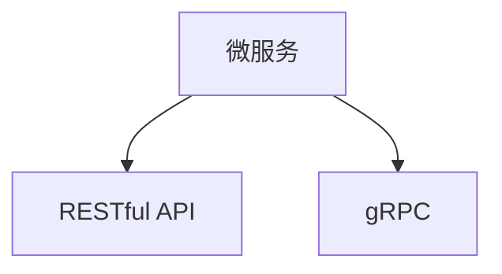

                 

# 微服务通信：REST 和 gRPC

> 关键词：微服务架构, REST, gRPC, API 设计, 服务发现, 负载均衡, 分布式事务, 安全性

## 1. 背景介绍

随着互联网应用的复杂度不断增加，传统的单体架构已经无法满足业务需求，微服务架构（Microservices Architecture）逐渐成为新的趋势。微服务架构将应用拆分为多个小的、可独立部署的服务，每个服务围绕业务核心进行设计，独立部署、独立扩展、独立维护，能够更灵活地响应业务变化。然而，微服务之间的通信方式一直是微服务架构中的一个重要问题。

## 2. 核心概念与联系

### 2.1 核心概念概述

微服务通信是指在微服务架构中，各个服务之间如何进行数据交换和信息传递。这是微服务架构的核心组成部分之一，也是微服务架构设计的基础。

微服务通信方式主要分为两类：
1. RESTful API：基于HTTP协议，使用标准URI、HTTP方法、HTTP状态码和数据格式（如JSON）进行通信。
2. gRPC：由Google开发的高性能、开源的远程过程调用框架，使用Protocol Buffers作为数据交换格式。

### 2.2 核心概念原理和架构的 Mermaid 流程图



上图中，微服务通过RESTful API和gRPC两种方式进行通信。RESTful API是一种标准的HTTP协议通信方式，简单易用，易于理解和实现。而gRPC则是一种高性能的远程过程调用框架，提供更高效的数据交换和更灵活的API设计。

## 3. 核心算法原理 & 具体操作步骤

### 3.1 算法原理概述

微服务之间的通信原理可以简单概括为：服务发现、负载均衡、数据交换和故障恢复。其中，数据交换是微服务通信的核心。

RESTful API和gRPC在数据交换方面有各自的优缺点。RESTful API基于HTTP协议，使用标准数据格式，易于使用和实现；而gRPC则提供了更高效的数据交换方式，支持二进制协议和Protocol Buffers格式，能够更好地支持高性能和高并发场景。

### 3.2 算法步骤详解

#### 3.2.1 RESTful API通信步骤

1. **服务发现**：
   - 微服务注册到服务注册中心，如Consul、Zookeeper等。
   - 客户端通过服务注册中心获取服务实例信息，确定通信目标。

2. **请求处理**：
   - 客户端发起HTTP请求，指定服务地址和请求方法。
   - 服务端接收请求，处理业务逻辑。

3. **响应返回**：
   - 服务端将处理结果转换为JSON格式，并返回HTTP响应。
   - 客户端接收响应，解析并处理数据。

4. **故障恢复**：
   - 如果服务不可用，客户端可以重试请求，或切换到备用服务实例。
   - 服务注册中心实时监控服务状态，提供故障恢复机制。

#### 3.2.2 gRPC通信步骤

1. **服务发现**：
   - 微服务注册到服务注册中心，如Consul、Zookeeper等。
   - 客户端通过服务注册中心获取服务实例信息，确定通信目标。

2. **请求处理**：
   - 客户端使用gRPC客户端库，生成远程调用对象。
   - 客户端调用远程方法，传入请求数据。

3. **响应返回**：
   - 服务端接收请求，处理业务逻辑。
   - 服务端将处理结果转换为Protocol Buffers格式，并返回响应数据。
   - 客户端接收响应，解析并处理数据。

4. **故障恢复**：
   - 如果服务不可用，客户端可以重试请求，或切换到备用服务实例。
   - 服务注册中心实时监控服务状态，提供故障恢复机制。

### 3.3 算法优缺点

#### RESTful API的优缺点

**优点**：
- 简单易用：基于HTTP协议，易于理解和实现。
- 易于扩展：支持多种数据格式，易于与现有系统集成。
- 安全性：使用HTTPS加密通信，安全性较高。

**缺点**：
- 性能较低：HTTP协议有一定的通信开销，适用于小规模应用。
- 数据传输量大：数据以字符串形式传输，体积较大。

#### gRPC的优缺点

**优点**：
- 高性能：Protocol Buffers格式体积小，传输速度快。
- 高性能协议：基于Protocol Buffers格式，数据传输效率高。
- 支持全双工通信：可以同时进行请求和响应，提高通信效率。

**缺点**：
- 协议复杂：Protocol Buffers格式需要定义结构体，不够灵活。
- 兼容性差：不同语言需要单独实现，开发成本较高。

### 3.4 算法应用领域

RESTful API和gRPC在微服务架构中有着广泛的应用领域。

#### RESTful API应用领域

1. **Web应用**：
   - 适用于传统的Web应用，易于与浏览器兼容。
   - 适用于需要大量Web请求的场景，如电商平台、在线客服等。

2. **移动应用**：
   - 适用于移动设备，易于与移动应用集成。
   - 适用于需要频繁与后端交互的场景，如社交网络、即时通讯等。

3. **第三方应用**：
   - 适用于需要与外部系统集成的场景，如支付系统、地图服务等。
   - 适用于需要跨平台兼容的场景，如云服务、API网关等。

#### gRPC应用领域

1. **高性能计算**：
   - 适用于高性能计算场景，如数据处理、科学计算等。
   - 适用于需要高并发处理的场景，如大数据分析、机器学习等。

2. **分布式系统**：
   - 适用于分布式系统架构，如微服务架构、分布式数据库等。
   - 适用于需要高性能、高可用的场景，如金融交易、智能合约等。

3. **嵌入式系统**：
   - 适用于嵌入式系统，如IoT设备、智能家居等。
   - 适用于需要低延迟、高可靠性的场景，如车联网、工业控制等。

## 4. 数学模型和公式 & 详细讲解 & 举例说明

### 4.1 数学模型构建

RESTful API和gRPC在数据交换方面，可以使用以下数学模型进行建模：

1. **RESTful API模型**：
   - 数据交换模型：基于HTTP协议，使用标准JSON格式。
   - 请求处理模型：客户端发送HTTP请求，服务端处理业务逻辑，返回HTTP响应。

2. **gRPC模型**：
   - 数据交换模型：基于Protocol Buffers格式，使用二进制数据交换。
   - 请求处理模型：客户端使用gRPC客户端库，生成远程调用对象，调用远程方法，服务端处理业务逻辑，返回响应数据。

### 4.2 公式推导过程

1. **RESTful API公式推导**：
   - 请求处理公式：$R = F(S)$，其中$R$表示响应，$S$表示请求数据。
   - 数据交换公式：$D = P(R)$，其中$D$表示数据，$P$表示解析函数。

2. **gRPC公式推导**：
   - 请求处理公式：$R = F(S)$，其中$R$表示响应，$S$表示请求数据。
   - 数据交换公式：$D = P(R)$，其中$D$表示数据，$P$表示解析函数。

### 4.3 案例分析与讲解

**案例1：电商系统的微服务架构**

1. **RESTful API**：
   - 服务注册：商品服务、订单服务、支付服务、用户服务等注册到Consul。
   - 请求处理：用户请求商品信息，商品服务接收请求，处理业务逻辑，返回JSON格式数据。
   - 响应返回：商品服务将处理结果转换为JSON格式，返回HTTP响应。
   - 故障恢复：如果商品服务不可用，用户请求重试或切换到备用商品服务。

2. **gRPC**：
   - 服务注册：商品服务、订单服务、支付服务、用户服务等注册到Consul。
   - 请求处理：用户请求商品信息，gRPC客户端生成远程调用对象，调用远程方法，商品服务接收请求，处理业务逻辑，返回Protocol Buffers格式数据。
   - 响应返回：商品服务将处理结果转换为Protocol Buffers格式，返回响应数据。
   - 故障恢复：如果商品服务不可用，用户请求重试或切换到备用商品服务。

**案例2：智能合约的微服务架构**

1. **RESTful API**：
   - 服务注册：智能合约服务、合约记录服务、合约执行服务、用户服务等注册到Zookeeper。
   - 请求处理：用户请求智能合约，智能合约服务接收请求，处理业务逻辑，返回JSON格式数据。
   - 响应返回：智能合约服务将处理结果转换为JSON格式，返回HTTP响应。
   - 故障恢复：如果智能合约服务不可用，用户请求重试或切换到备用智能合约服务。

2. **gRPC**：
   - 服务注册：智能合约服务、合约记录服务、合约执行服务、用户服务等注册到Zookeeper。
   - 请求处理：用户请求智能合约，gRPC客户端生成远程调用对象，调用远程方法，智能合约服务接收请求，处理业务逻辑，返回Protocol Buffers格式数据。
   - 响应返回：智能合约服务将处理结果转换为Protocol Buffers格式，返回响应数据。
   - 故障恢复：如果智能合约服务不可用，用户请求重试或切换到备用智能合约服务。

## 5. 项目实践：代码实例和详细解释说明

### 5.1 开发环境搭建

#### 5.1.1 依赖安装

1. **RESTful API依赖**：
   - 安装Flask：`pip install Flask`
   - 安装HTTP库：`pip install requests`
   - 安装SQLAlchemy：`pip install sqlalchemy`

2. **gRPC依赖**：
   - 安装gRPC：`pip install grpcio`
   - 安装Protocol Buffers：`pip install protobuf`

#### 5.1.2 环境配置

1. **RESTful API配置**：
   - 设置Flask应用：`app = Flask(__name__)`
   - 设置SQLAlchemy数据库：`db = create_engine('sqlite:///example.db')`
   - 设置请求处理函数：`@app.route('/')`

2. **gRPC配置**：
   - 生成Protocol Buffers定义文件：`protoc --python_out=. --grpc_out=. proto.proto`
   - 设置gRPC服务器：`server = grpc.server(futures.ThreadPoolExecutor(max_workers=10))`

### 5.2 源代码详细实现

#### 5.2.1 RESTful API实现

```python
from flask import Flask, request, jsonify
from sqlalchemy import create_engine, Column, Integer, String

app = Flask(__name__)
db = create_engine('sqlite:///example.db')
metadata = MetaData(bind=db)

class User(Base):
    __tablename__ = 'user'
    id = Column(Integer, primary_key=True)
    name = Column(String(50))
    email = Column(String(50))

@app.route('/')
def index():
    result = []
    users = User.query.all()
    for user in users:
        result.append({
            'id': user.id,
            'name': user.name,
            'email': user.email
        })
    return jsonify(result)

if __name__ == '__main__':
    app.run(debug=True)
```

#### 5.2.2 gRPC实现

```python
import grpc
from concurrent import futures
import logging

import user_pb2
import user_pb2_grpc

class UserService(user_pb2_grpc.UserServiceServicer):
    def ListUsers(self, request, context):
        result = []
        users = User.query.all()
        for user in users:
            result.append(user_pb2.User(id=user.id, name=user.name, email=user.email))
        return user_pb2.ListUsersResponse(result)

def serve():
    server = grpc.server(futures.ThreadPoolExecutor(max_workers=10))
    user_pb2_grpc.add_UserServiceServicer_to_server(UserService(), server)
    server.add_insecure_port('[::]:50051')
    server.start()
    server.wait_for_termination()

if __name__ == '__main__':
    logging.basicConfig()
    serve()
```

### 5.3 代码解读与分析

**RESTful API实现**：
1. **Flask框架**：使用Flask框架实现RESTful API，设置路由和请求处理函数。
2. **SQLAlchemy数据库**：使用SQLAlchemy框架连接数据库，定义User实体，获取用户数据。
3. **JSON数据返回**：将获取的用户数据转换为JSON格式，返回HTTP响应。

**gRPC实现**：
1. **Protocol Buffers定义**：生成Protocol Buffers定义文件，定义User消息格式。
2. **gRPC服务定义**：使用gRPC框架定义UserService服务，实现ListUsers方法。
3. **gRPC服务器启动**：启动gRPC服务器，监听50051端口。

## 6. 实际应用场景

### 6.1 电商系统

#### 6.1.1 RESTful API应用

电商系统需要处理复杂的业务逻辑，包括商品信息、订单信息、支付信息等。RESTful API可以很好地适应电商系统的高并发和海量数据处理需求。

1. **商品信息查询**：
   - 用户请求商品信息，商品服务接收请求，处理业务逻辑，返回JSON格式数据。
   - 商品服务将处理结果转换为JSON格式，返回HTTP响应。

2. **订单信息查询**：
   - 用户请求订单信息，订单服务接收请求，处理业务逻辑，返回JSON格式数据。
   - 订单服务将处理结果转换为JSON格式，返回HTTP响应。

3. **支付信息查询**：
   - 用户请求支付信息，支付服务接收请求，处理业务逻辑，返回JSON格式数据。
   - 支付服务将处理结果转换为JSON格式，返回HTTP响应。

#### 6.1.2 gRPC应用

gRPC适用于高性能和低延迟的业务场景，如电商系统的实时交易处理。

1. **实时交易处理**：
   - 用户进行实时交易，gRPC客户端生成远程调用对象，调用远程方法，订单服务接收请求，处理业务逻辑，返回Protocol Buffers格式数据。
   - 订单服务将处理结果转换为Protocol Buffers格式，返回响应数据。

2. **高并发处理**：
   - 电商平台需要处理海量交易，使用gRPC可以提高系统的高并发处理能力。

### 6.2 智能合约

#### 6.2.1 RESTful API应用

智能合约系统需要处理复杂的合约逻辑，包括合约信息、合约记录、合约执行等。RESTful API可以很好地适应智能合约系统的灵活性和扩展性需求。

1. **合约信息查询**：
   - 用户请求合约信息，智能合约服务接收请求，处理业务逻辑，返回JSON格式数据。
   - 智能合约服务将处理结果转换为JSON格式，返回HTTP响应。

2. **合约记录查询**：
   - 用户请求合约记录，合约记录服务接收请求，处理业务逻辑，返回JSON格式数据。
   - 合约记录服务将处理结果转换为JSON格式，返回HTTP响应。

3. **合约执行查询**：
   - 用户请求合约执行，合约执行服务接收请求，处理业务逻辑，返回JSON格式数据。
   - 合约执行服务将处理结果转换为JSON格式，返回HTTP响应。

#### 6.2.2 gRPC应用

gRPC适用于高性能和低延迟的业务场景，如智能合约的实时执行。

1. **实时合约执行**：
   - 用户进行实时合约执行，智能合约服务接收请求，处理业务逻辑，返回Protocol Buffers格式数据。
   - 智能合约服务将处理结果转换为Protocol Buffers格式，返回响应数据。

2. **高并发处理**：
   - 智能合约需要处理海量交易，使用gRPC可以提高系统的高并发处理能力。

## 7. 工具和资源推荐

### 7.1 学习资源推荐

1. **RESTful API学习资源**：
   - 《RESTful Web Services》（O'Reilly）：介绍RESTful API的基本概念和设计原则。
   - 《API Design Patterns》（O'Reilly）：介绍API设计的最佳实践和常见模式。

2. **gRPC学习资源**：
   - 《Protocol Buffers - Google's data interchange format》（Google）：介绍Protocol Buffers的基本概念和使用方法。
   - 《gRPC Performance Tips》（Google）：介绍gRPC的性能优化技巧和最佳实践。

### 7.2 开发工具推荐

1. **RESTful API开发工具**：
   - Postman：测试RESTful API的工具，支持多种HTTP方法，易于使用。
   - Insomnia：测试RESTful API的工具，支持API调试和数据验证。

2. **gRPC开发工具**：
   - Protobuf IDE：生成Protocol Buffers定义文件和代码的工具。
   - gRPC Client Generator：生成gRPC客户端代码的工具。

### 7.3 相关论文推荐

1. **RESTful API论文**：
   - "REST in Web Services Architecture"（D. W. T. Dennison）：介绍RESTful API的基本概念和设计原则。
   - "RESTful Services: A Survey"（M. Y. Ali, H. Fahim, T. A. Ismaeel）：介绍RESTful API的发展历程和应用场景。

2. **gRPC论文**：
   - "gRPC: A universal remote procedure call (RPC) framework"（M. Wolff）：介绍gRPC的基本概念和设计原理。
   - "Efficient Communication via Protocol Buffers"（G. Guillemot, B. Deconinck, S. P. Hastings, P. C. Keleher, A. Multis, E. Pitrat, S. Rémy, J. B. Sacks, J. A. Tromp, E. V. Vedder）：介绍Protocol Buffers的基本概念和使用方法。

## 8. 总结：未来发展趋势与挑战

### 8.1 未来发展趋势

#### 8.1.1 RESTful API发展趋势

1. **API安全性**：
   - 引入OAuth2认证机制，保障API安全性。
   - 使用HTTPS加密通信，防止数据泄露。

2. **API可扩展性**：
   - 引入API网关，统一API管理和服务发现。
   - 使用REST API版本控制，支持API版本升级。

3. **API自动化**：
   - 引入API自动化测试工具，提升API质量。
   - 使用API自动化部署工具，提高API部署效率。

#### 8.1.2 gRPC发展趋势

1. **性能优化**：
   - 使用gRPC负载均衡，提高系统的可扩展性。
   - 使用gRPC通道池，提高系统的高并发处理能力。

2. **安全性增强**：
   - 引入gRPC认证机制，保障服务安全性。
   - 使用gRPC加密通信，防止数据泄露。

3. **生态扩展**：
   - 扩展gRPC到新领域，如IoT、金融等。
   - 支持更多编程语言和框架，提高gRPC的普及度。

### 8.2 未来应用展望

#### 8.2.1 RESTful API应用展望

1. **微服务架构**：
   - 微服务架构需要高效、可靠的API通信方式，RESTful API可以满足需求。
   - RESTful API可以支持微服务的灵活扩展和独立部署。

2. **云原生架构**：
   - RESTful API可以与云原生技术无缝集成，支持容器化部署。
   - RESTful API可以支持Kubernetes、Docker等容器编排工具。

3. **分布式系统**：
   - RESTful API可以支持分布式系统的稳定性和可靠性。
   - RESTful API可以支持分布式事务处理和故障恢复机制。

#### 8.2.2 gRPC应用展望

1. **高性能计算**：
   - gRPC适用于高性能计算场景，如大数据分析、机器学习等。
   - gRPC可以支持分布式计算集群，提高系统的计算能力。

2. **分布式系统**：
   - gRPC适用于分布式系统架构，如微服务架构、分布式数据库等。
   - gRPC可以支持分布式事务处理和故障恢复机制。

3. **嵌入式系统**：
   - gRPC适用于嵌入式系统，如IoT设备、智能家居等。
   - gRPC可以支持低延迟、高可靠性的通信。

### 8.3 面临的挑战

#### 8.3.1 RESTful API挑战

1. **API安全性**：
   - 安全性问题成为API开发的重要挑战。
   - 需要引入OAuth2认证机制和HTTPS加密通信，防止数据泄露和攻击。

2. **API可扩展性**：
   - 微服务架构需要高效的API管理和服务发现机制。
   - 需要引入API网关和版本控制，支持API扩展和升级。

3. **API自动化**：
   - 需要引入API自动化测试和部署工具，提升API质量和服务稳定性。

#### 8.3.2 gRPC挑战

1. **性能优化**：
   - gRPC需要优化通信效率，提高系统的可扩展性和高并发处理能力。
   - 需要引入负载均衡和通道池机制，提高系统性能和稳定性。

2. **安全性增强**：
   - gRPC需要增强服务安全性，防止数据泄露和攻击。
   - 需要引入gRPC认证机制和加密通信，保障服务安全。

3. **生态扩展**：
   - gRPC需要扩展到新领域，如IoT、金融等。
   - 需要支持更多编程语言和框架，提高gRPC的普及度。

### 8.4 研究展望

#### 8.4.1 RESTful API研究展望

1. **API设计自动化**：
   - 引入API设计自动化工具，提升API设计效率和质量。
   - 使用API自动化测试和部署工具，提高API稳定性。

2. **API微服务化**：
   - 引入API微服务化技术，支持API的独立部署和扩展。
   - 支持API网关和版本控制，保障API服务的稳定性和可靠性。

3. **API安全性**：
   - 引入OAuth2认证机制和HTTPS加密通信，防止数据泄露和攻击。
   - 引入API访问控制和监控机制，保障API安全性。

#### 8.4.2 gRPC研究展望

1. **性能优化**：
   - 引入gRPC负载均衡和通道池机制，提高系统性能和稳定性。
   - 使用gRPC通道复用技术，减少通信开销和资源消耗。

2. **安全性增强**：
   - 引入gRPC认证机制和加密通信，保障服务安全。
   - 引入gRPC访问控制和监控机制，防止数据泄露和攻击。

3. **生态扩展**：
   - 扩展gRPC到新领域，如IoT、金融等。
   - 支持更多编程语言和框架，提高gRPC的普及度。

## 9. 附录：常见问题与解答

### 9.1 RESTful API常见问题与解答

**Q1: RESTful API的优缺点是什么？**

A1: RESTful API的优点是简单易用，易于理解和实现。缺点是性能较低，数据传输量大。

**Q2: RESTful API如何保障安全性？**

A2: RESTful API可以引入OAuth2认证机制和HTTPS加密通信，防止数据泄露和攻击。

**Q3: RESTful API如何进行版本控制？**

A3: RESTful API可以使用API网关和版本控制机制，支持API扩展和升级。

### 9.2 gRPC常见问题与解答

**Q1: gRPC的优缺点是什么？**

A1: gRPC的优点是高性能、安全性高，缺点是协议复杂、兼容性差。

**Q2: gRPC如何进行负载均衡？**

A2: gRPC可以使用负载均衡器进行服务发现和路由，提高系统的可扩展性和高并发处理能力。

**Q3: gRPC如何进行安全性增强？**

A3: gRPC可以引入gRPC认证机制和加密通信，保障服务安全。

---

作者：禅与计算机程序设计艺术 / Zen and the Art of Computer Programming

