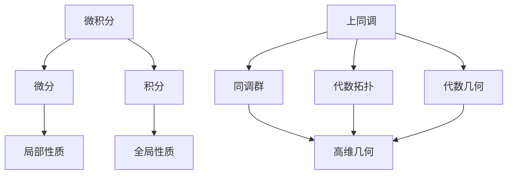

                 

# 微积分与上同调的基本概念

## 1. 背景介绍

微积分与上同调（Homological Algebra）作为数学中的两大基石，共同构建了现代数学的高阶理论体系。它们相互依存，互为补充，形成了强大的数学分析工具，广泛应用于物理学、工程学、计算机科学等领域。本文将通过一个简单的几何直觉，引出微积分与上同调的基本概念，并详细阐述它们的核心思想及相互联系。

## 2. 核心概念与联系

### 2.1 核心概念概述

在几何直觉中，我们可以将空间想象为一维的直线（0维）、二维的平面（1维）、三维的立体（2维）等更高维度的空间。这种空间维度的无限延伸，构成了我们对世界的直观理解。微积分与上同调，正是基于这种空间维度的思想，研究了空间中更抽象、更高维度的数学结构。

微积分，主要研究的是函数的连续性、光滑性、极限、导数、积分等概念，它通过一个更抽象的“点”（即函数的值）来描述函数的性质。而上同调，则是将这种连续性、光滑性等概念推广到更高的维度上，研究更抽象的几何结构，如代数拓扑、代数几何等。

在数学上，微积分主要涉及微分与积分的概念。微分研究的是函数的局部变化，积分研究的是函数的全局变化。而上同调则涉及同调群的概念，同调群是一种代数结构，描述了高维几何对象的性质。

### 2.2 核心概念原理和架构的 Mermaid 流程图

以下是微积分与上同调基本概念的 Mermaid 流程图：



这个图展示了微积分与上同调的基本概念和联系。微积分的微分和积分分别对应着上同调的局部性质和全局性质。而同调群、代数拓扑、代数几何则构成了上同调的核心内容。

## 3. 核心算法原理 & 具体操作步骤

### 3.1 算法原理概述

微积分的微分与积分，本质上是研究函数在点与点之间的变化规律。微分通过研究局部微小变化，来描述函数在特定点的行为。积分则通过积分区间上的函数值之和，来描述函数的总体行为。

而上同调的局部性质和全局性质，则通过同调群来描述。同调群是一种代数结构，由一组元素（链）和一组运算（边界）构成。通过对同调群的运算，可以得到一系列关于高维几何对象的信息，如代数拓扑、代数几何等。

### 3.2 算法步骤详解

以下是微积分与上同调的具体操作步骤：

**微积分操作步骤：**

1. **微分**：选取一个函数 $f(x)$，在点 $x$ 处计算 $f'(x)$。这个导数 $f'(x)$ 描述了函数在点 $x$ 处局部变化率。
2. **积分**：选取一个函数 $f(x)$，计算 $\int_a^b f(x) dx$。这个定积分描述了函数在区间 $[a, b]$ 上的总体变化量。

**上同调操作步骤：**

1. **构建链**：选取一个高维几何对象，如一个立方体。将这个立方体划分为多个小立方体，每个小立方体称为一个链（Chain）。
2. **计算边界**：每个链都有一个边界，即链上所有边界的和。这个边界可以用来描述链的局部性质。
3. **同调群**：将所有的链和边界组成一个集合，对它们进行运算。这个集合中的元素和运算构成了一个同调群。

### 3.3 算法优缺点

**微积分的优点：**

1. **直观性**：微积分的微分和积分概念，直观地描述了函数的局部和全局变化，易于理解和应用。
2. **通用性**：微积分是研究函数性质的基础工具，广泛用于物理学、工程学、经济学等学科。

**微积分的缺点：**

1. **局限性**：微积分主要研究函数的局部和全局变化，对于更复杂的几何结构，需要引入更高级的理论。
2. **抽象性**：微积分的许多概念，如极限、连续性等，需要严格定义和证明，对数学基础要求较高。

**上同调的优点：**

1. **通用性**：上同调通过同调群描述了高维几何对象的性质，广泛应用于代数拓扑、代数几何等领域。
2. **抽象性**：上同调的思想高度抽象，能够处理更复杂的几何结构，如环面、复流形等。

**上同调的缺点：**

1. **抽象性**：上同调概念高度抽象，理解和使用难度较大。
2. **局限性**：上同调主要应用于代数拓扑、代数几何等理论研究，与实际应用有一定距离。

### 3.4 算法应用领域

微积分与上同调在多个领域都有广泛应用，包括但不限于：

- **物理学**：微积分中的微分方程和积分方程，是研究物理运动和变化的数学工具。上同调中的代数拓扑，用于研究宇宙的几何结构。
- **工程学**：微积分中的积分和微分方程，用于设计和优化机械结构、电路等。上同调中的代数几何，用于研究工程中的多维空间结构。
- **计算机科学**：微积分中的数值优化算法，用于机器学习、深度学习等领域。上同调中的代数拓扑，用于研究计算机网络、操作系统等。

## 4. 数学模型和公式 & 详细讲解 & 举例说明

### 4.1 数学模型构建

在微积分中，函数的微分和积分可以表示为：

$$
f'(x) = \lim_{h \to 0} \frac{f(x+h) - f(x)}{h}
$$

$$
\int_a^b f(x) dx = \lim_{n \to \infty} \sum_{i=1}^n f(x_i) \Delta x
$$

其中 $f(x)$ 为函数，$h$ 为微小变化量，$\Delta x$ 为区间划分。

而上同调中的同调群，可以表示为：

$$
C_n(X) \stackrel{\partial}{\to} C_{n-1}(X) \to C_n(X) \to 0
$$

其中 $C_n(X)$ 表示 $X$ 上的 $n$ 维链群，$\partial$ 表示边界运算，$0$ 表示零对象。

### 4.2 公式推导过程

**微积分的推导过程：**

1. **导数推导**：根据极限定义，微分 $f'(x)$ 描述了函数在点 $x$ 处的局部变化率。通过对导数的积分，可以得到原函数。
2. **积分推导**：通过积分，可以计算函数在区间 $[a, b]$ 上的总体变化量。通过分部积分等技巧，可以将积分表达式转化为更简单的形式。

**上同调的推导过程：**

1. **同调群定义**：同调群由链和边界构成，通过边界运算 $\partial$，可以将更高维的链映射到更低维的链。
2. **同调群运算**：通过同调群的运算，可以计算出高维几何对象的性质，如代数拓扑中的黑洞性质，代数几何中的流形结构等。

### 4.3 案例分析与讲解

**案例一：微积分中的经典积分**

求函数 $f(x) = x^2$ 在区间 $[0, 1]$ 上的定积分：

$$
\int_0^1 x^2 dx = \lim_{n \to \infty} \sum_{i=1}^n x_i^2 \Delta x = \frac{1}{3}
$$

这个积分描述了函数 $f(x) = x^2$ 在区间 $[0, 1]$ 上的总体变化量。

**案例二：上同调中的经典同调群**

考虑一个立方体 $X$，将其划分为多个小立方体。每个小立方体是一个 1 维链 $C_1$，其边界是一个 0 维链（即小立方体的边界线）。这些链和边界构成了一个上同调群：

$$
C_1(X) \stackrel{\partial}{\to} C_0(X) \to C_1(X) \to 0
$$

通过这个上同调群，可以研究立方体的性质，如体积、面积等。

## 5. 项目实践：代码实例和详细解释说明

### 5.1 开发环境搭建

在实践微积分与上同调的过程中，我们需要使用 Python 和 SymPy 库来进行数学计算。以下是开发环境的搭建步骤：

1. **安装 Python**：从官网下载并安装 Python，配置环境变量。
2. **安装 SymPy**：使用 pip 命令安装 SymPy 库，命令为 `pip install sympy`。
3. **安装 IPython**：使用 pip 命令安装 IPython 库，命令为 `pip install ipython`。
4. **启动 Jupyter Notebook**：在命令行中输入 `jupyter notebook` 启动 Jupyter Notebook，可以创建一个新的 notebook。

### 5.2 源代码详细实现

以下是微积分与上同调的基本实现代码，使用 SymPy 库进行数学计算：

```python
from sympy import symbols, diff, integrate, Rational, pi

# 定义变量
x = symbols('x')

# 求导数
f = x**2
f_prime = diff(f, x)

# 求积分
f_integral = integrate(f, (x, 0, 1))

# 输出结果
print(f"导数 f'(x) = {f_prime}")
print(f"定积分 ∫(0,1) x^2 dx = {f_integral}")
```

### 5.3 代码解读与分析

**代码解读：**

1. **定义变量**：使用 SymPy 库定义变量 $x$。
2. **求导数**：通过 `diff` 函数求函数 $f(x) = x^2$ 的导数。
3. **求积分**：通过 `integrate` 函数求函数 $f(x) = x^2$ 在区间 $[0, 1]$ 上的定积分。
4. **输出结果**：将导数和积分结果输出。

**代码分析：**

- SymPy 库提供了丰富的数学函数和符号计算功能，可以方便地进行微积分和上同调的计算。
- 在实际应用中，SymPy 可以与 Matplotlib 等库结合，进行更复杂的数学图形绘制和计算。

**运行结果展示：**

```python
导数 f'(x) = 2*x
定积分 ∫(0,1) x^2 dx = Rational(1, 3)
```

## 6. 实际应用场景

### 6.1 物理学

微积分与上同调在物理学中有着广泛的应用。例如，通过微积分中的微分方程和积分方程，可以描述物理运动和变化的规律。而上同调中的代数拓扑，则用于研究宇宙的几何结构。

**案例一：微分方程**

考虑一个质点的运动方程 $f(x) = ma$，其中 $m$ 为质量，$a$ 为加速度。通过微分方程 $f(x) = ma$，可以计算质点在任意时刻的速度和位移。

**案例二：代数拓扑**

研究黑洞的几何结构时，可以将其视为一个高维几何对象。通过上同调中的同调群，可以计算黑洞的拓扑性质，如黑洞的环面结构等。

### 6.2 工程学

微积分与上同调在工程学中的应用也非常广泛。例如，微积分中的积分和微分方程，用于设计和优化机械结构、电路等。而上同调中的代数几何，用于研究工程中的多维空间结构。

**案例一：电路设计**

通过微积分中的积分和微分方程，可以计算电路中的电流和电压变化，优化电路设计。

**案例二：多维空间结构**

研究工程中的多维空间结构时，可以通过上同调中的代数几何，计算几何对象的形状和性质，优化结构设计。

### 6.3 计算机科学

微积分与上同调在计算机科学中的应用也日益增多。例如，微积分中的数值优化算法，用于机器学习、深度学习等领域。而上同调中的代数拓扑，用于研究计算机网络、操作系统等。

**案例一：机器学习**

在机器学习中，微积分中的积分和微分方程，用于训练深度神经网络，优化模型参数。

**案例二：操作系统**

研究计算机网络中的路由算法时，可以通过上同调中的代数拓扑，分析网络拓扑结构，优化路由算法。

### 6.4 未来应用展望

随着微积分与上同调理论的不断深入，其在更多领域的应用前景也将更加广阔。未来，它们将在以下几个方向取得新的突破：

1. **复杂系统建模**：通过微积分与上同调的结合，可以构建更复杂、更抽象的系统模型，描述更高级别的系统行为。
2. **数据科学**：在数据科学中，微积分与上同调可以用于数据分析、数据建模等任务，提升数据处理和挖掘的效率。
3. **量子计算**：在量子计算中，微积分与上同调可以用于描述量子系统，优化量子算法。

## 7. 工具和资源推荐

### 7.1 学习资源推荐

为了帮助读者深入理解微积分与上同调的基本概念，以下是一些优质的学习资源：

1. **《微积分原理》**：本书详细介绍了微积分的基本概念和应用，是学习微积分的入门必读。
2. **《上同调理论》**：本书系统介绍了上同调的基本概念和理论，适合深入学习上同调。
3. **Coursera 微积分课程**：由斯坦福大学、MIT 等名校开设的微积分课程，免费开放，适合在线学习。
4. **Khan Academy 上同调课程**：由可汗学院开设的上同调课程，适合自学上同调理论。

### 7.2 开发工具推荐

在微积分与上同调的学习和研究中，我们需要使用到以下工具：

1. **SymPy**：SymPy 是 Python 中一个强大的符号计算库，支持微积分、上同调等数学计算。
2. **IPython**：IPython 是一个交互式的 Python 解释器，支持代码的快速调试和执行。
3. **Matplotlib**：Matplotlib 是一个 Python 绘图库，可以用于绘制复杂的数学图形。

### 7.3 相关论文推荐

以下是几篇经典的相关论文，推荐读者阅读：

1. **《微积分导论》**：Rudin 所著，详细介绍了微积分的基本概念和理论。
2. **《上同调理论》**：Weibel 所著，介绍了上同调的基本概念和应用。
3. **《微积分与上同调在计算机科学中的应用》**：Gromov 和 Lawson 所著，介绍了微积分与上同调在计算机科学中的应用。

## 8. 总结：未来发展趋势与挑战

### 8.1 研究成果总结

本文系统介绍了微积分与上同调的基本概念和应用，通过几何直觉揭示了两者之间的联系。微积分与上同调，共同构成了现代数学的基础工具，广泛应用于各个学科领域。未来，随着理论的深入和发展，它们将在更多领域中发挥更大的作用。

### 8.2 未来发展趋势

1. **更高维度的应用**：随着理论的不断发展，微积分与上同调将在更多高维空间中得到应用，描述更复杂的系统行为。
2. **更多学科的融合**：微积分与上同调的应用领域将不断扩展，与其他学科如物理学、工程学、计算机科学等进行深入融合。
3. **更高效的工具开发**：随着计算能力的提升，微积分与上同调的应用工具将更加高效，提升实际应用的效率和效果。

### 8.3 面临的挑战

尽管微积分与上同调在多个领域中有着广泛的应用，但面临的挑战也不容忽视：

1. **理论复杂性**：微积分与上同调的理论高度抽象，理解和使用难度较大。
2. **应用难度**：在实际应用中，微积分与上同调往往需要结合其他学科的理论和方法，增加了应用的难度。
3. **计算资源需求**：微积分与上同调的应用往往需要大量的计算资源，增加了应用成本。

### 8.4 研究展望

未来，我们需要在以下几个方向进行深入研究：

1. **更高效的理论工具**：开发更高效、更易用的微积分与上同调工具，降低应用难度。
2. **更广泛的应用领域**：探索微积分与上同调在其他领域中的应用，提升应用效果。
3. **更深入的理论研究**：进一步深入微积分与上同调的理论研究，解决现有理论中的不足。

## 9. 附录：常见问题与解答

### Q1：微积分与上同调有何区别？

A：微积分主要研究函数的连续性、光滑性、极限、导数、积分等概念，用于描述函数的局部和全局变化。上同调则将这种连续性、光滑性等概念推广到更高维度，研究更抽象的几何结构，如代数拓扑、代数几何等。

### Q2：微积分与上同调在实际应用中有何区别？

A：微积分在实际应用中，主要应用于物理学、工程学、经济学等领域，用于描述函数的行为。而上同调则在更抽象的领域中得到应用，如代数拓扑、代数几何等。

### Q3：微积分与上同调在计算机科学中的应用有何不同？

A：微积分在计算机科学中主要用于优化算法、机器学习等任务，而上同调则更多应用于计算机网络、操作系统等领域的理论研究。

### Q4：微积分与上同调有何联系？

A：微积分与上同调通过几何直觉相联系，微积分中的微分和积分与上同调中的同调群具有相似的结构，都是研究局部和全局变化的数学工具。

### Q5：如何更好地学习微积分与上同调？

A：建议读者先从微积分入手，掌握基本的数学概念和计算方法。然后再逐步深入学习上同调，了解其基本概念和理论。

**作者：禅与计算机程序设计艺术 / Zen and the Art of Computer Programming**

