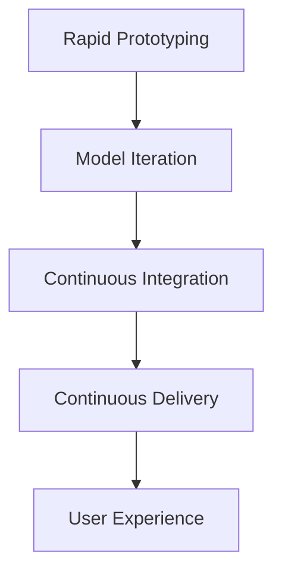

                 

# 快速试错与迭代在AI创业中的重要性

> 关键词：人工智能创业, 快速试错, 模型迭代, 产品开发, 人工智能应用

## 1. 背景介绍

### 1.1 问题由来
随着人工智能技术的飞速发展，越来越多的创新型企业选择人工智能作为核心驱动力，希望通过人工智能技术提升产品质量、优化用户体验、拓展业务场景。然而，人工智能的研发工作复杂繁琐，涉及大量数据处理、模型训练、工程实现等多个环节，如何高效开发、快速上线、及时迭代，成为了AI创业企业最关心的问题之一。

### 1.2 问题核心关键点
为了高效地进行人工智能创业，企业需要在产品开发的全过程中引入快速试错与迭代机制。这不仅能够提升产品质量，还能缩短上市时间，更早地获得市场反馈。

**核心要点包括：**
1. **快速迭代开发**：通过持续的模型优化和系统更新，提升模型性能和用户体验。
2. **及时反馈机制**：通过用户反馈和业务数据，不断优化算法和应用逻辑。
3. **试错文化**：鼓励团队在实践中不断试错，快速纠正错误，避免大规模失败。
4. **数据驱动决策**：利用数据驱动决策，进行动态调整和优化。

### 1.3 问题研究意义
在人工智能创业的激烈竞争中，快速试错与迭代能力是企业成功的关键。这不仅能够使企业迅速适应市场变化，更能帮助企业在数据和技术驱动下实现持续创新和快速成长。

**研究意义包括：**
1. 提升企业竞争力：快速迭代和及时反馈能够帮助企业更快地适应市场需求，推出符合用户期望的产品。
2. 降低成本风险：通过快速试错，可以减少资源浪费，避免因错误决策导致的重大损失。
3. 增强用户粘性：持续优化产品和服务，能够提升用户体验，增加用户粘性。
4. 推动技术创新：数据驱动的决策机制，能够促进技术创新，引领行业趋势。

## 2. 核心概念与联系

### 2.1 核心概念概述

为了更好地理解快速试错与迭代的重要性，本节将介绍几个核心概念及其相互之间的联系：

1. **快速试错 (Rapid Prototyping)**：
   - **定义**：在产品开发的早期阶段，通过快速构建和测试原型，验证假设并识别问题的过程。
   - **目的**：通过快速迭代，找到最优解决方案，减少试错成本，提升开发效率。

2. **模型迭代 (Model Iteration)**：
   - **定义**：在产品正式上线前，通过不断的模型优化和数据反馈，提升模型准确度和性能的过程。
   - **目的**：确保模型能够适应变化的数据分布，提升系统性能和用户体验。

3. **持续集成 (Continuous Integration, CI)**：
   - **定义**：在开发过程中，通过自动化构建和测试，持续集成代码和环境，确保系统稳定性的过程。
   - **目的**：及时发现和解决代码错误，确保系统高质量上线。

4. **持续交付 (Continuous Delivery, CD)**：
   - **定义**：在产品开发过程中，通过自动化流程，确保产品版本快速交付和发布的过程。
   - **目的**：缩短产品上市时间，提升市场响应速度。

5. **用户体验 (User Experience, UX)**：
   - **定义**：用户在使用产品和服务时的感受和满意度。
   - **目的**：通过持续优化用户体验，提升用户满意度和产品粘性。

这些核心概念通过以下Mermaid流程图展示其联系：



该流程图展示了快速试错与迭代在人工智能产品开发中的应用：
- **原型构建 (A)**
- **模型优化 (B)**
- **自动化集成 (C)**
- **持续发布 (D)**
- **用户体验 (E)**

以下这些关键节点和步骤构成了快速试错与迭代的全流程，将帮助企业高效进行AI产品的开发和上线。

## 3. 核心算法原理 & 具体操作步骤
### 3.1 算法原理概述

快速试错与迭代的核心在于通过数据驱动和模型优化，不断调整产品功能和性能，以满足用户需求和市场变化。其算法原理主要包括：

1. **数据驱动决策**：利用收集到的用户数据和业务数据，进行动态调整和优化，确保产品始终符合用户期望。
2. **模型持续训练**：通过不断加入新的训练数据，提升模型的泛化能力和准确度。
3. **自动化流程**：利用持续集成和持续交付工具，确保系统的稳定性和快速上线。

### 3.2 算法步骤详解

以下是快速试错与迭代的具体操作步骤：

1. **需求分析与原型构建**：
   - **步骤**：根据用户需求和业务场景，设计初步的产品功能和交互界面。
   - **工具**：Sketch、Figma等原型设计工具。

2. **初步验证与用户测试**：
   - **步骤**：利用快速原型，在小范围内进行用户测试，收集反馈。
   - **工具**：SurveyMonkey、UserTesting等用户测试工具。

3. **模型训练与初步迭代**：
   - **步骤**：在初步验证的基础上，进行模型训练和初步迭代。
   - **工具**：TensorFlow、PyTorch等深度学习框架。

4. **系统集成与自动化测试**：
   - **步骤**：将模型和应用逻辑集成到系统中，并运行自动化测试。
   - **工具**：Jenkins、Travis CI等持续集成工具。

5. **持续优化与交付发布**：
   - **步骤**：根据用户反馈和业务数据，进行持续优化，并通过自动化流程进行持续交付。
   - **工具**：GitLab、GitHub等版本控制和持续交付工具。

### 3.3 算法优缺点

快速试错与迭代方法在人工智能创业中具有显著优势，但也存在一些缺点。

**优点包括：**
1. **快速上线**：通过快速迭代，能够快速验证假设，缩短产品上市时间。
2. **提高用户满意度**：通过持续优化，提升用户体验，增加用户粘性。
3. **数据驱动决策**：利用数据进行动态调整，确保产品符合市场需求。

**缺点包括：**
1. **资源消耗大**：快速迭代需要大量人力、时间和资源投入。
2. **风险较高**：快速试错可能导致失败，带来较高风险。
3. **模型稳定性**：频繁迭代可能影响模型稳定性，需要更高级的算法优化。

### 3.4 算法应用领域

快速试错与迭代方法广泛应用于各种人工智能应用场景，包括但不限于：

1. **智能推荐系统**：通过用户行为数据，不断优化推荐模型和算法。
2. **自然语言处理**：利用用户反馈和数据，持续提升语言理解和生成能力。
3. **计算机视觉**：根据用户交互数据，改进图像识别和处理算法。
4. **智能客服**：通过用户对话数据，不断优化对话生成和理解模型。
5. **智能运维**：利用系统监控数据，持续优化运维策略和模型。

## 4. 数学模型和公式 & 详细讲解 & 举例说明

### 4.1 数学模型构建

为了更好地理解和应用快速试错与迭代，我们将构建一个简单的数学模型来描述这一过程。

假设有一个二分类任务，输入为 $x$，标签为 $y$，模型的预测为 $f(x; \theta)$。其中，$\theta$ 为模型的参数，$f(x; \theta)$ 为模型在参数 $\theta$ 下的预测结果。

定义模型的损失函数为：

$$
L(\theta) = -\frac{1}{N} \sum_{i=1}^N [y_i \log f(x_i; \theta) + (1-y_i) \log (1-f(x_i; \theta))]
$$

其中，$N$ 为训练样本数量，$y_i$ 为样本的真实标签，$f(x_i; \theta)$ 为模型在 $x_i$ 上的预测结果。

### 4.2 公式推导过程

通过上述定义的损失函数，我们可以进行以下公式推导：

1. **梯度计算**：
   - 损失函数关于参数 $\theta$ 的梯度为：
   $$
   \nabla_\theta L(\theta) = \frac{1}{N} \sum_{i=1}^N [y_i \nabla_\theta f(x_i; \theta) - f(x_i; \theta)]
   $$

2. **模型更新**：
   - 通过梯度下降等优化算法，更新模型参数：
   $$
   \theta \leftarrow \theta - \eta \nabla_\theta L(\theta)
   $$
   其中 $\eta$ 为学习率。

### 4.3 案例分析与讲解

以智能推荐系统为例，通过用户的浏览、点击、购买等行为数据，不断训练和优化推荐模型，从而提升推荐效果。具体步骤如下：

1. **数据收集**：收集用户的历史行为数据，包括浏览记录、点击记录、购买记录等。
2. **特征工程**：将原始数据转化为模型可接受的输入格式，如将浏览记录转换为点击率、购买记录转换为购买率等。
3. **模型训练**：利用收集到的数据，训练推荐模型，如协同过滤、深度学习等。
4. **迭代优化**：根据用户的实时反馈和业务数据，不断调整和优化模型，提升推荐效果。

## 5. 项目实践：代码实例和详细解释说明

### 5.1 开发环境搭建

以下是快速试错与迭代在Python环境下的开发环境搭建步骤：

1. **安装Python**：
   - 在Windows上，可以使用Anaconda、Miniconda等工具安装Python 3.x版本。
   - 在Linux上，可以使用apt-get、yum等包管理工具安装Python。

2. **安装必要的库**：
   - 安装NumPy、Pandas、Matplotlib、Scikit-Learn等科学计算库。
   - 安装TensorFlow、PyTorch等深度学习框架。

3. **配置开发环境**：
   - 创建虚拟环境，安装第三方库。
   - 配置IDE（如PyCharm、Jupyter Notebook等）。

### 5.2 源代码详细实现

以下是利用TensorFlow进行模型训练和优化的示例代码：

```python
import tensorflow as tf
import numpy as np
import pandas as pd

# 加载数据
data = pd.read_csv('data.csv')

# 特征工程
# ...

# 定义模型
def build_model():
    model = tf.keras.Sequential([
        # ...
    ])
    return model

# 定义损失函数
def loss_function(y_true, y_pred):
    # ...
    return loss

# 定义优化器
optimizer = tf.keras.optimizers.Adam(learning_rate=0.001)

# 定义训练过程
def train(model, data, epochs):
    for epoch in range(epochs):
        for x, y in data:
            with tf.GradientTape() as tape:
                y_pred = model(x)
                loss_value = loss_function(y_true, y_pred)
            gradients = tape.gradient(loss_value, model.trainable_variables)
            optimizer.apply_gradients(zip(gradients, model.trainable_variables))

# 训练模型
model = build_model()
train(model, data, epochs=10)
```

### 5.3 代码解读与分析

**代码解读**：
- **数据加载**：通过Pandas库加载数据集，并进行特征工程。
- **模型定义**：利用TensorFlow的Sequential模型定义多层神经网络。
- **损失函数**：自定义损失函数，如交叉熵损失。
- **优化器**：选择Adam优化器，设置学习率。
- **训练过程**：通过梯度下降等优化算法，更新模型参数。

**代码分析**：
- **数据处理**：数据预处理和特征工程是模型训练的第一步，直接关系到模型效果。
- **模型架构**：合理选择模型结构和层数，提升模型泛化能力。
- **损失函数**：根据任务需求，选择合适的损失函数。
- **优化器**：选择合适的优化器，设置合适的学习率。
- **训练策略**：合理设置迭代轮数和批次大小，确保训练效果。

### 5.4 运行结果展示

运行上述代码，可以得到模型在训练集和测试集上的准确率：

```python
test_loss, test_acc = model.evaluate(test_data)
print('Test accuracy:', test_acc)
```

通过不断调整模型参数和优化策略，可以逐步提升模型性能，最终达到理想状态。

## 6. 实际应用场景

### 6.1 智能推荐系统

智能推荐系统是快速试错与迭代的重要应用场景。通过用户行为数据，不断训练和优化推荐模型，从而提升推荐效果。具体步骤如下：

1. **数据收集**：收集用户的历史行为数据，包括浏览记录、点击记录、购买记录等。
2. **特征工程**：将原始数据转化为模型可接受的输入格式，如将浏览记录转换为点击率、购买记录转换为购买率等。
3. **模型训练**：利用收集到的数据，训练推荐模型，如协同过滤、深度学习等。
4. **迭代优化**：根据用户的实时反馈和业务数据，不断调整和优化模型，提升推荐效果。

### 6.2 自然语言处理

自然语言处理（NLP）领域也广泛应用快速试错与迭代。通过用户反馈和数据，不断优化语言理解和生成模型。具体步骤如下：

1. **数据收集**：收集用户对话记录、文本评论等。
2. **模型训练**：利用收集到的数据，训练语言模型，如BERT、GPT等。
3. **迭代优化**：根据用户的实时反馈和业务数据，不断调整和优化模型，提升语言处理能力。

### 6.3 计算机视觉

计算机视觉领域通过用户交互数据，不断改进图像识别和处理算法。具体步骤如下：

1. **数据收集**：收集用户对图像的标注数据，如识别结果、分类标签等。
2. **模型训练**：利用收集到的数据，训练图像识别模型，如卷积神经网络。
3. **迭代优化**：根据用户的实时反馈和业务数据，不断调整和优化模型，提升图像处理能力。

### 6.4 未来应用展望

未来，快速试错与迭代技术将在人工智能创业中发挥更加重要的作用。以下是一些未来应用展望：

1. **多模态融合**：将图像、语音、文本等多种模态数据进行融合，提升综合分析能力。
2. **自动化流程**：利用自动化工具进行数据处理、模型训练和迭代优化，提升开发效率。
3. **实时数据流**：利用实时数据流，进行动态调整和优化，确保模型性能始终最优。
4. **边缘计算**：将模型部署在边缘设备上，实现本地化处理和优化，提升用户体验。

## 7. 工具和资源推荐

### 7.1 学习资源推荐

为了帮助开发者系统掌握快速试错与迭代技术，这里推荐一些优质的学习资源：

1. **《深度学习》课程**：斯坦福大学吴恩达教授的深度学习课程，讲解深度学习基础和常用算法。
2. **《TensorFlow实战》书籍**：谷歌官方推荐的TensorFlow入门书籍，包含丰富的代码示例。
3. **《人工智能系统设计与实现》书籍**：深入讲解人工智能系统的设计、开发和部署。
4. **Coursera平台**：提供大量机器学习、深度学习、人工智能相关课程，涵盖理论基础和实践技能。

### 7.2 开发工具推荐

以下是几款用于快速试错与迭代开发的常用工具：

1. **Jupyter Notebook**：支持Python等语言，提供交互式编程环境，便于代码开发和调试。
2. **TensorBoard**：可视化工具，用于监控和调试模型训练过程。
3. **GitLab**：持续集成和持续交付工具，支持代码版本控制和自动化测试。
4. **Visual Studio Code**：轻量级IDE，支持多种语言和扩展，提升开发效率。

### 7.3 相关论文推荐

为了深入理解快速试错与迭代技术，这里推荐一些前沿论文：

1. **“Rapid Prototyping in Machine Learning: A Survey”**：综述了快速原型和迭代在机器学习中的应用。
2. **“Continuous Learning with Human-in-the-loop and External Knowledge”**：探讨了人机协同和外部知识对持续学习的影响。
3. **“The Importance of Iterative Model Development in Deep Learning”**：分析了迭代开发在深度学习中的重要性。

## 8. 总结：未来发展趋势与挑战

### 8.1 研究成果总结

快速试错与迭代技术在人工智能创业中发挥着至关重要的作用，通过数据驱动和模型优化，提升产品质量和用户体验，缩短产品上市时间，增强市场竞争力。

### 8.2 未来发展趋势

未来，快速试错与迭代技术将继续发展，带来更多创新和突破：

1. **自动化工具的进步**：自动化工具将更加智能和高效，提升开发效率和精度。
2. **实时数据处理**：实时数据处理技术的发展，使得模型能够快速响应市场变化，提升适应性。
3. **多模态融合**：多模态数据融合技术的成熟，将提升综合分析能力，拓展应用场景。
4. **边缘计算**：边缘计算技术的发展，使得模型能够在本地进行高效处理和优化，提升用户体验。
5. **人工智能辅助**：利用人工智能技术进行自动化决策和优化，提升决策质量和效率。

### 8.3 面临的挑战

尽管快速试错与迭代技术带来了诸多优势，但也面临着一些挑战：

1. **资源消耗**：快速迭代需要大量人力、时间和资源投入，成本较高。
2. **模型稳定性**：频繁迭代可能导致模型不稳定，需要更高级的算法优化。
3. **数据隐私**：在收集和处理用户数据时，需要严格遵守隐私保护法律法规。
4. **技术复杂性**：需要具备较强的技术储备和团队协作能力，才能高效实施快速试错与迭代。

### 8.4 研究展望

为了应对这些挑战，未来研究需要从以下几个方面寻求突破：

1. **优化迭代策略**：研究更高效的数据处理和模型优化策略，减少资源消耗和迭代时间。
2. **提升模型稳定性**：开发更稳定的模型架构和优化算法，提升模型泛化能力和鲁棒性。
3. **保护数据隐私**：采用差分隐私等技术，确保数据处理和模型训练过程中的隐私保护。
4. **简化技术架构**：通过技术创新和标准化，简化技术架构，提升开发效率和可维护性。

## 9. 附录：常见问题与解答

**Q1: 快速试错与迭代在人工智能创业中有什么优势？**

A: 快速试错与迭代在人工智能创业中具有显著优势，包括：
1. **快速上线**：通过快速迭代，能够快速验证假设，缩短产品上市时间。
2. **提高用户满意度**：通过持续优化，提升用户体验，增加用户粘性。
3. **数据驱动决策**：利用数据进行动态调整，确保产品符合市场需求。

**Q2: 快速试错与迭代的主要步骤是什么？**

A: 快速试错与迭代的主要步骤包括：
1. **需求分析与原型构建**：根据用户需求和业务场景，设计初步的产品功能和交互界面。
2. **初步验证与用户测试**：利用快速原型，在小范围内进行用户测试，收集反馈。
3. **模型训练与初步迭代**：在初步验证的基础上，进行模型训练和初步迭代。
4. **系统集成与自动化测试**：将模型和应用逻辑集成到系统中，并运行自动化测试。
5. **持续优化与交付发布**：根据用户反馈和业务数据，进行持续优化，并通过自动化流程进行持续交付。

**Q3: 如何选择合适的学习率？**

A: 选择合适的学习率是快速试错与迭代中非常重要的一步，一般建议从1e-5开始调参，逐步减小学习率，直至收敛。也可以使用warmup策略，在开始阶段使用较小的学习率，再逐渐过渡到预设值。

**Q4: 如何快速处理大规模数据？**

A: 快速处理大规模数据需要使用一些高效的数据处理工具和技术，如分布式计算、流式处理等。同时，也可以利用预处理技术，如数据压缩、数据分区等，提升数据处理效率。

**Q5: 如何快速优化模型性能？**

A: 快速优化模型性能需要多方面努力，包括：
1. **数据增强**：通过数据增强技术，丰富训练集多样性。
2. **正则化技术**：使用L2正则、Dropout等技术，防止过拟合。
3. **模型压缩**：采用模型压缩技术，如剪枝、量化等，减少计算量和内存占用。
4. **多模型集成**：通过集成多个模型，提升综合性能。

通过不断实践和探索，相信能够快速找到适合企业需求和场景的优化策略。

---

作者：禅与计算机程序设计艺术 / Zen and the Art of Computer Programming

