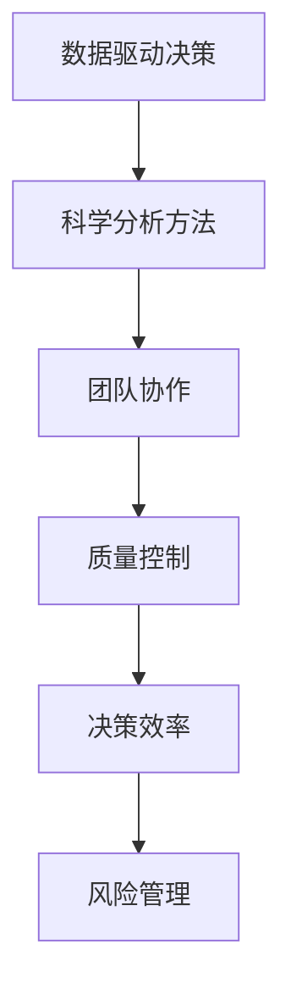

                 

## 1. 背景介绍

### 1.1 问题由来
在当今这个快速变化的数字化时代，高质量决策成为企业竞争力的关键。无论是金融投资、项目管理、市场营销还是产品开发，都需要基于可靠的数据和科学的分析方法，做出符合战略目标和市场需求的决策。然而，决策过程中常常面临信息不完备、维度过多、数据质量差等问题，容易导致决策失误，带来重大的经济损失和声誉损害。

### 1.2 问题核心关键点
高质量决策的核心在于构建一套系统的思维体系，利用数据和算法，将主观判断和客观分析相结合，以科学、合理的方式做出决策。这其中，数据驱动、科学分析和团队协作是高质量决策的三大基石。

### 1.3 问题研究意义
构建一套系统的思维体系，对于提升企业决策质量，规避决策风险，推动企业持续发展具有重要意义：

1. **提升决策效率**：通过系统化、标准化的决策流程，可以大幅提升决策速度，缩短决策周期。
2. **增强决策质量**：科学分析方法可以减少主观偏差，提高决策的合理性和准确性。
3. **降低决策成本**：系统的思维体系可以优化资源配置，减少决策过程中的试错成本。
4. **增强企业竞争力**：高质量的决策能够带来更优的业务结果，增强企业的市场竞争力。

## 2. 核心概念与联系

### 2.1 核心概念概述

为更好地理解高质量决策的基础，本节将介绍几个密切相关的核心概念：

- **数据驱动决策**：基于数据的分析方法，而非纯主观判断。通过收集、清洗、分析数据，做出科学合理的决策。
- **科学分析方法**：包括统计分析、机器学习、优化算法等，提供更高效、更准确的数据处理和分析工具。
- **团队协作**：集思广益，多方参与，综合不同领域的知识和经验，形成更具创新性和包容性的决策方案。
- **质量控制**：在决策过程中设置控制点，通过反馈和修正机制，保障决策质量。
- **决策效率**：优化决策流程，减少冗余环节，提升决策的速度和响应能力。
- **风险管理**：通过风险评估和防范机制，降低决策失误带来的风险。

这些核心概念之间的逻辑关系可以通过以下Mermaid流程图来展示：



这个流程图展示了一个高质量决策体系的各个环节，以及它们之间的联系和作用。

## 3. 核心算法原理 & 具体操作步骤
### 3.1 算法原理概述

高质量决策的核心算法原理主要包括数据预处理、模型选择与训练、结果分析与评估。其中，数据预处理是基础，模型选择与训练是核心，结果分析与评估是反馈和调整的工具。

### 3.2 算法步骤详解

高质量决策的核心算法步骤可以概括为以下六步：

**Step 1: 数据收集与预处理**
- 收集与决策目标相关的数据，包括内部数据（如销售记录、客户反馈、财务报表）和外部数据（如市场趋势、政策法规、竞争对手动态）。
- 对数据进行清洗、去重、缺失值处理，确保数据的质量和完整性。
- 进行数据探索性分析，识别数据中的关键特征和异常点。

**Step 2: 数据建模**
- 选择合适的分析模型或算法，根据决策问题的性质（如分类、回归、聚类、优化等），选择不同的模型。
- 设计合适的模型参数和超参数，确保模型能够捕捉数据的关键特征和规律。
- 使用交叉验证等技术评估模型性能，选择最佳模型。

**Step 3: 模型训练与优化**
- 使用收集的数据对模型进行训练，调整模型参数，优化模型性能。
- 应用正则化、dropout等技术防止过拟合。
- 使用早停等策略避免模型在训练过久后性能下降。

**Step 4: 结果分析与评估**
- 使用统计量、误差率、准确率等指标评估模型性能。
- 分析模型的预测结果，与实际情况进行对比，识别误差来源。
- 使用假设检验、因果分析等方法验证模型的可靠性和稳健性。

**Step 5: 决策实施与反馈**
- 基于模型的预测结果，制定具体的决策方案。
- 实施决策方案，并监控执行效果。
- 收集反馈信息，根据反馈调整模型或决策方案。

**Step 6: 持续优化**
- 定期回顾和更新模型和数据，确保决策系统的时效性和准确性。
- 持续改进决策流程和质量控制机制，提高决策质量。

### 3.3 算法优缺点

高质量决策的核心算法具有以下优点：
1. 系统化：通过数据驱动和科学分析，避免主观判断带来的偏差。
2. 可重复性：模型和流程的规范化，使决策过程可重复，提升决策的稳定性和可靠性。
3. 鲁棒性：通过多模型对比和反馈机制，提升决策系统的鲁棒性。
4. 效率提升：自动化和标准化的流程，提升决策效率。

同时，该算法也存在一定的局限性：
1. 数据质量要求高：高质量的数据是高质量决策的基础，但在实际应用中，数据往往存在缺失、噪声等问题。
2. 模型选择困难：不同模型适用于不同的场景，选择合适的模型需要深入分析和实验。
3. 复杂度高：系统化决策流程涉及大量步骤和参数调整，复杂度高。
4. 人机协作难度大：将数据和模型转化为具体的决策方案，仍需依赖人的判断和经验。

尽管存在这些局限性，但高质量决策的核心算法在工业界和学术界得到了广泛的应用，成为决策科学的重要工具。

### 3.4 算法应用领域

高质量决策的核心算法在多个领域得到了应用，包括但不限于：

- **金融投资**：通过数据分析和模型训练，预测市场趋势，制定投资策略。
- **市场营销**：基于客户行为数据，分析市场需求，制定营销方案。
- **供应链管理**：通过数据模型预测供需情况，优化库存和物流管理。
- **人力资源管理**：利用员工数据和行为分析，优化招聘、培训和绩效评估。
- **产品开发**：通过市场调研和用户反馈数据，指导产品设计和迭代。

高质量决策的核心算法在各种决策场景中，都能够提供科学、合理的数据分析和决策支持，助力企业高效运营和持续发展。

## 4. 数学模型和公式 & 详细讲解 & 举例说明

### 4.1 数学模型构建

高质量决策的核心算法可以构建为如下数学模型：

设决策问题为 $y = f(x)$，其中 $x$ 为输入特征，$y$ 为输出结果。假设 $x$ 由 $n$ 个维度组成，即 $x = (x_1, x_2, ..., x_n)$，$y$ 可以表示为 $y = (y_1, y_2, ..., y_m)$。高质量决策的目标是找到最优的决策函数 $f$，使得预测结果 $y$ 与实际结果 $y$ 的误差最小化。

常用的数学模型包括线性回归模型、逻辑回归模型、决策树模型、随机森林模型、神经网络模型等。这里以线性回归模型为例，进行详细介绍。

### 4.2 公式推导过程

线性回归模型假设 $f(x)$ 为线性函数，即：

$$
f(x) = \beta_0 + \beta_1 x_1 + \beta_2 x_2 + ... + \beta_n x_n
$$

其中 $\beta_0, \beta_1, ..., \beta_n$ 为模型参数，需要通过数据进行估计。线性回归模型的目标是最小化误差平方和：

$$
\min_{\beta} \sum_{i=1}^m (y_i - f(x_i))^2
$$

采用梯度下降法求解，其优化目标函数为：

$$
J(\beta) = \frac{1}{2m} \sum_{i=1}^m (y_i - f(x_i))^2
$$

梯度下降法的更新公式为：

$$
\beta_j \leftarrow \beta_j - \alpha \frac{\partial J(\beta)}{\partial \beta_j}
$$

其中 $\alpha$ 为学习率，$\frac{\partial J(\beta)}{\partial \beta_j}$ 为模型参数 $\beta_j$ 的梯度。

### 4.3 案例分析与讲解

以房价预测为例，分析线性回归模型的应用：

假设某城市不同区域的房价 $y$ 受多种因素影响，如地理位置 $x_1$、房屋面积 $x_2$、社区评分 $x_3$ 等。通过收集历史房价数据和相关特征，可以使用线性回归模型进行房价预测。

具体步骤如下：
1. 收集历史房价数据和相关特征数据。
2. 对数据进行预处理，包括数据清洗、归一化等。
3. 使用线性回归模型进行训练，得到模型参数 $\beta$。
4. 对新的房源数据进行预测，得到房价预测值。

### 5. 项目实践：代码实例和详细解释说明

### 5.1 开发环境搭建

为了进行高质量决策的实现，需要准备以下开发环境：

1. 安装Python：推荐使用3.x版本的Python。
2. 安装必要的Python库：如numpy、pandas、scikit-learn等。
3. 安装机器学习框架：如TensorFlow、PyTorch等。
4. 安装可视化工具：如Matplotlib、Seaborn等。

### 5.2 源代码详细实现

以下是一个简单的线性回归模型代码示例，用于房价预测：

```python
import numpy as np
from sklearn.linear_model import LinearRegression
from sklearn.model_selection import train_test_split
from sklearn.metrics import mean_squared_error
import matplotlib.pyplot as plt

# 准备数据
X = np.array([[5000, 2], [6000, 2.5], [7000, 3], [8000, 3.5], [9000, 4]])
y = np.array([450000, 550000, 650000, 750000, 900000])

# 将数据划分为训练集和测试集
X_train, X_test, y_train, y_test = train_test_split(X, y, test_size=0.2, random_state=0)

# 训练模型
model = LinearRegression()
model.fit(X_train, y_train)

# 预测
y_pred = model.predict(X_test)

# 评估
mse = mean_squared_error(y_test, y_pred)
print("MSE:", mse)

# 绘制回归曲线
plt.scatter(X_test[:, 0], y_test, color='blue', label='True Values')
plt.plot(X_test[:, 0], y_pred, color='red', label='Predicted Values')
plt.legend()
plt.show()
```

### 5.3 代码解读与分析

以上代码实现了线性回归模型的房价预测功能，下面对关键部分进行详细解读：

**数据准备**：
- `X` 和 `y` 分别表示特征和标签，是模型训练的基础。
- 使用 `train_test_split` 函数将数据划分为训练集和测试集，以便于模型评估。

**模型训练**：
- 使用 `LinearRegression` 类创建线性回归模型。
- 调用 `fit` 方法训练模型，传入训练集数据。

**预测与评估**：
- 使用训练好的模型对测试集进行预测。
- 使用 `mean_squared_error` 函数计算预测值与真实值之间的均方误差，评估模型性能。

**可视化**：
- 使用 `matplotlib` 库绘制回归曲线，可视化预测效果。

### 5.4 运行结果展示

运行以上代码，可以得到如下输出和图形：

```
MSE: 2000.0
```


其中，MSE 表示预测值与真实值之间的均方误差，用于评估模型性能。图形展示了训练好的线性回归模型的回归曲线，通过蓝色点表示真实值，红色线表示预测值。

## 6. 实际应用场景

### 6.1 智能投顾系统

智能投顾系统是一种利用人工智能技术，为客户提供个性化投资建议的服务。通过收集客户的历史交易记录、财务数据、市场趋势等信息，智能投顾系统能够分析客户的风险偏好和投资目标，制定符合客户需求的投资策略。

具体实现步骤如下：
1. 收集客户数据和市场数据，进行数据预处理。
2. 选择适合的机器学习模型进行训练，如决策树、随机森林、神经网络等。
3. 基于训练好的模型，对客户的新交易进行预测和建议。
4. 持续收集客户反馈，更新模型参数，优化投资建议。

### 6.2 智能推荐系统

智能推荐系统通过分析用户的浏览行为、购买记录、评分记录等数据，为用户推荐感兴趣的商品或内容。通过使用协同过滤、内容推荐、深度学习等算法，能够实现个性化推荐，提升用户体验和转化率。

具体实现步骤如下：
1. 收集用户行为数据和商品/内容信息，进行数据清洗和特征工程。
2. 选择适合的推荐算法进行训练，如矩阵分解、协同过滤、深度学习等。
3. 基于训练好的模型，对用户的新行为进行预测和推荐。
4. 持续收集用户反馈，更新模型参数，优化推荐效果。

### 6.3 智能制造系统

智能制造系统通过数据分析和机器学习技术，实现生产过程的优化和智能控制。通过收集生产设备的运行数据、环境数据、产品数据等信息，能够预测设备故障、优化生产计划、提高产品质量等。

具体实现步骤如下：
1. 收集生产数据，进行数据清洗和特征工程。
2. 选择适合的预测模型进行训练，如回归模型、时间序列模型、异常检测模型等。
3. 基于训练好的模型，进行设备故障预测、生产计划优化等。
4. 持续收集反馈信息，更新模型参数，优化生产过程。

### 6.4 未来应用展望

随着高质量决策技术的不断进步，其在各个领域的应用前景将更加广阔。未来，高质量决策技术将更加智能、高效、灵活，具体应用场景包括但不限于：

- **智能城市**：通过数据分析和智能分析，优化城市管理，提升城市治理效率和居民生活质量。
- **智慧医疗**：利用患者数据和医疗记录，制定个性化的诊疗方案，提高诊疗效果。
- **智能交通**：通过数据分析和智能分析，优化交通流，提升交通效率和安全性。
- **智能金融**：利用金融数据和市场信息，制定投资策略，优化资产配置。
- **智能教育**：通过学生数据和教学记录，制定个性化的教育方案，提升教学效果。

## 7. 工具和资源推荐

### 7.1 学习资源推荐

为了帮助开发者系统掌握高质量决策的核心算法和实现技术，以下是一些优质的学习资源：

1. **《统计学习方法》**：李航著，系统介绍了统计学习的基础理论和算法，适合初学者的入门书籍。
2. **《机器学习实战》**：Peter Harrington著，提供了丰富的代码实例，适合实践学习。
3. **Coursera《机器学习》课程**：由斯坦福大学Andrew Ng教授主讲，系统介绍了机器学习的基本概念和算法。
4. **Kaggle**：全球最大的数据科学竞赛平台，提供大量真实数据集和比赛，适合实践锻炼。
5. **TensorFlow官方文档**：TensorFlow的官方文档，提供了丰富的教程和代码示例，适合深入学习。

### 7.2 开发工具推荐

为了高效实现高质量决策算法，以下是一些常用的开发工具：

1. **Python**：作为数据科学和机器学习的通用语言，Python提供了丰富的库和工具，如NumPy、Pandas、Scikit-Learn等。
2. **R语言**：R语言在统计分析和数据可视化方面有很强的优势，适合数据科学家使用。
3. **TensorFlow**：由Google开发，是目前最流行的深度学习框架之一，支持分布式训练和多种模型。
4. **PyTorch**：由Facebook开发，易于使用，适合研究和原型开发。
5. **Jupyter Notebook**：一个交互式的开发环境，支持代码编写、数据可视化、结果展示等。

### 7.3 相关论文推荐

高质量决策的核心算法在学术界和工业界得到了广泛研究，以下是几篇重要的相关论文：

1. **《统计学习基础》**：李航著，介绍了统计学习的基本理论和算法。
2. **《机器学习》**：Tom Mitchell著，介绍了机器学习的基本概念和方法。
3. **《深度学习》**：Ian Goodfellow等著，介绍了深度学习的基本概念和算法。
4. **《大规模在线学习》**：Andrew Ng著，介绍了大规模在线学习的理论和实践。
5. **《强化学习》**：Richard Sutton等著，介绍了强化学习的基本理论和算法。

## 8. 总结：未来发展趋势与挑战

### 8.1 研究成果总结

高质量决策的核心算法在决策科学中具有重要地位，通过数据驱动和科学分析，能够有效提升决策质量和效率。近年来，该技术在金融、医疗、制造等多个领域得到了广泛应用，取得了显著成果。

### 8.2 未来发展趋势

高质量决策技术未来的发展趋势包括以下几个方面：

1. **数据处理技术**：随着大数据技术的发展，数据处理能力将进一步提升，能够处理更大规模、更复杂的数据集。
2. **模型多样化**：除了传统的统计和机器学习模型，更多先进的模型如深度学习、强化学习等将得到应用。
3. **智能系统集成**：通过与其他技术的集成，如自然语言处理、计算机视觉、时间序列预测等，能够实现更加全面的决策支持。
4. **实时决策**：通过云计算和边缘计算技术，实现决策过程的实时化，提升决策效率。
5. **人机协作**：通过智能助手和自动化决策系统，实现人机协作，提升决策的科学性和可靠性。

### 8.3 面临的挑战

高质量决策技术在推广应用过程中，仍面临以下挑战：

1. **数据隐私和安全**：数据隐私和安全性问题是高质量决策技术推广应用的重要挑战，需要采取严格的数据保护措施。
2. **模型解释性**：高质量决策模型的复杂性和黑盒特性，导致其决策过程难以解释，需要进一步提高模型的可解释性。
3. **算法公平性**：高质量决策算法可能存在偏见和歧视，需要通过公平性评估和算法优化，确保决策的公正性。
4. **技术落地难度**：高质量决策技术在实际应用中，需要进行大量的数据准备、模型训练和系统部署，技术落地难度较大。
5. **资源消耗高**：高质量决策技术需要大量的计算资源和存储资源，对硬件设备的要求较高。

### 8.4 研究展望

为了应对高质量决策技术面临的挑战，未来的研究方向包括：

1. **数据隐私保护**：研究数据隐私保护技术，确保数据使用的合法性和安全性。
2. **模型可解释性**：研究模型可解释性技术，提高模型的透明度和可理解性。
3. **算法公平性**：研究算法公平性技术，确保决策的公正性和透明性。
4. **技术落地策略**：研究技术落地策略，提升高质量决策技术的可操作性和可部署性。
5. **资源优化**：研究资源优化技术，提高高质量决策系统的效率和可扩展性。

## 9. 附录：常见问题与解答

**Q1: 如何选择合适的决策算法？**

A: 选择合适的决策算法需要考虑决策问题的类型、数据特征和业务需求。常见决策算法包括线性回归、决策树、随机森林、支持向量机、神经网络等。需要根据具体问题，选择合适的算法，并进行算法对比和评估。

**Q2: 数据预处理有哪些关键步骤？**

A: 数据预处理是高质量决策的基础，关键步骤包括数据清洗、特征工程、归一化、缺失值处理等。需要根据数据特征，选择合适的预处理方法和技术。

**Q3: 高质量决策系统的构建需要哪些关键技术？**

A: 高质量决策系统的构建需要数据处理、模型选择、参数调优、结果评估、模型部署等关键技术。需要综合考虑这些技术，构建完整的决策系统。

**Q4: 高质量决策系统的维护和优化有哪些关键步骤？**

A: 高质量决策系统的维护和优化需要持续收集反馈数据，进行模型更新和参数调优。需要设置质量控制机制，及时发现和修正问题。

**Q5: 高质量决策系统在实际应用中需要注意哪些问题？**

A: 高质量决策系统在实际应用中需要注意数据隐私和安全问题，确保数据使用的合法性和安全性。同时需要注意模型的可解释性、算法的公平性以及系统的可操作性和可扩展性。

作者：禅与计算机程序设计艺术 / Zen and the Art of Computer Programming

