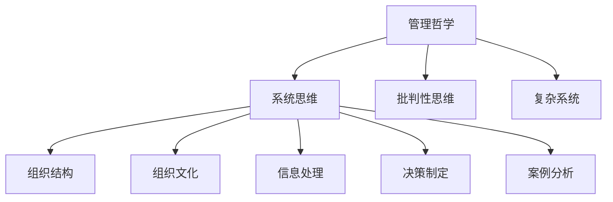

                 

# 思维体系对管理者战略视野的影响

> 关键词：管理哲学、战略视野、系统思维、批判性思维、复杂系统、组织结构、信息处理、组织文化、决策制定、案例分析

## 1. 背景介绍

### 1.1 问题由来
在快速变化的商业环境中，管理者必须具备远见卓识，能够洞察市场动态，预判未来趋势，从而制定科学合理的战略。而传统的管理理论与方法，往往过于简化的模型和假设，难以应对日趋复杂的经营环境。特别是当面临环境突变、技术革新、市场波动等不确定性因素时，传统的战略制定流程往往难以发挥应有的作用。因此，管理者需要一种更加全面、系统、灵活的思维体系，帮助他们深入理解商业的本质，提升战略视野。

### 1.2 问题核心关键点
管理者战略视野的形成和提升，直接关系到企业战略制定的科学性和有效性。因此，本文聚焦于探讨几种关键的思维体系，包括管理哲学、系统思维、批判性思维等，以及它们如何影响管理者的战略视野，帮助管理者更好地应对复杂环境。

### 1.3 问题研究意义
研究思维体系对管理者战略视野的影响，对于提升企业战略制定和实施的科学性，促进企业管理体系的现代化，具有重要意义：

1. 提升决策质量。通过系统、全面、灵活的思维体系，管理者能够更准确地理解企业内外部环境，做出科学合理的决策。
2. 增强风险管理。系统思维和批判性思维能够帮助管理者识别风险点，制定有效的风险应对策略，提升企业抗风险能力。
3. 优化资源配置。通过系统分析企业资源和环境，管理者能够更合理地配置资源，提高企业运营效率。
4. 促进组织创新。创新的思维体系能够激发管理者的创造力，推动企业持续创新，保持竞争优势。
5. 改善组织绩效。科学合理的战略视野能够促进企业绩效提升，增强市场竞争力。

## 2. 核心概念与联系

### 2.1 核心概念概述

为更好地理解思维体系对管理者战略视野的影响，本节将介绍几个密切相关的核心概念：

- 管理哲学(Management Philosophy)：管理思想体系的基本信念和价值观，影响着管理者的思维模式和行为方式。常见的管理哲学包括效率主义、人本主义、系统论等。

- 系统思维(System Thinking)：一种以系统为视角，整体看待问题的思维方法。系统思维强调各要素之间的相互作用和动态平衡，以及系统整体的优化。

- 批判性思维(Critical Thinking)：通过质疑、分析和评估现有知识，发现问题、寻找解决方案的思维方式。批判性思维有助于管理者提升洞察力和决策能力。

- 复杂系统(Complex System)：由众多相互依赖的要素构成的非线性、高度复杂性系统。复杂系统管理强调动态性、适应性、非线性等特点，是现代组织管理的重要方向。

- 组织结构(Organizational Structure)：企业的内部架构，包括层级结构、部门划分、权责分配等，对管理者的战略视野有重要影响。

- 组织文化(Organizational Culture)：企业的价值观、行为准则、管理风格等，对管理者的思维模式和决策风格有深远影响。

- 信息处理(Information Processing)：企业管理者获取、处理和应用信息的能力，是提升战略视野的重要手段。

- 决策制定(Decision Making)：管理者的决策过程和策略，直接影响企业战略的制定和执行。

- 案例分析(Case Study)：通过分析实际管理案例，学习借鉴成功经验，提升管理者的实践能力。

这些核心概念之间的逻辑关系可以通过以下Mermaid流程图来展示：



这个流程图展示了几大思维体系之间的相互联系：

1. 管理哲学为系统思维、批判性思维等提供了理论基础。
2. 系统思维、批判性思维帮助管理者深入理解复杂系统，优化组织结构和组织文化。
3. 系统思维、批判性思维和复杂系统管理共同提升信息处理和决策制定能力。
4. 案例分析为管理者提供了实战经验，提升战略视野的实际应用能力。

## 3. 核心算法原理 & 具体操作步骤
### 3.1 算法原理概述

思维体系对管理者战略视野的影响，本质上是一个理论应用于实践的过程。其核心思想是：通过系统化、全面化的思维框架，帮助管理者更深入、更准确地理解企业内外部环境，优化信息处理和决策制定能力，从而提升战略视野。

形式化地，假设管理者具备初步的管理哲学基础，能够理解和应用系统思维、批判性思维等工具。管理者通过系统的信息处理和决策制定流程，将外部环境因素内化为企业战略，得到理想的管理策略。

### 3.2 算法步骤详解

基于思维体系提升管理者战略视野，一般包括以下几个关键步骤：

**Step 1: 管理哲学引导**
- 选择合适的管理哲学作为理论基础，如人本主义、系统论等。
- 阅读相关书籍和文献，理解管理哲学的基本信念和价值观。

**Step 2: 系统思维训练**
- 学习系统思维的基本概念和工具，如系统结构、因果关系、反馈机制等。
- 应用系统思维方法，分析企业内外部环境，识别关键要素和影响因素。

**Step 3: 批判性思维培养**
- 通过案例分析、问题研讨等方式，培养批判性思维能力，学会质疑和评估现有知识。
- 练习批判性思维技能，如问题定义、证据评估、逻辑推理等。

**Step 4: 复杂系统管理实践**
- 理解复杂系统的特点和行为模式，如动态性、非线性、自组织性等。
- 应用复杂系统管理方法，提升企业的动态适应能力。

**Step 5: 信息处理能力提升**
- 学习信息获取、处理和应用的方法，如数据分析、数据可视化、信息检索等。
- 应用先进的信息技术工具，如数据仓库、商业智能等，提升信息处理效率。

**Step 6: 决策制定流程优化**
- 掌握决策制定的基本流程，如问题定义、方案生成、选择评估、执行监控等。
- 应用决策支持系统等工具，提升决策制定的科学性和效率。

**Step 7: 案例学习与实践**
- 学习经典案例，理解成功企业的战略制定和执行过程。
- 应用案例分析方法，将学习到的经验应用到自身企业的实际管理中。

### 3.3 算法优缺点

基于思维体系提升管理者战略视野的方法具有以下优点：
1. 系统全面。通过综合应用多种思维体系，管理者能够更全面地理解企业内外环境，避免单一视角的局限。
2. 灵活高效。系统思维和批判性思维等方法，能够帮助管理者快速识别问题和优化方案。
3. 提升决策质量。通过科学的信息处理和决策制定流程，管理者能够制定更科学合理的战略。

同时，该方法也存在一定的局限性：
1. 理论学习成本高。需要投入大量时间和精力学习多种管理哲学和思维方法。
2. 实践难度大。需要管理者具备较强的逻辑思维和分析能力，对实践中的问题有敏锐的洞察力。
3. 应用场景有限。方法对管理者的素质要求较高，可能不适用于所有类型的企业或管理者。

尽管存在这些局限性，但就目前而言，基于思维体系提升管理者战略视野的方法仍然是大规模管理实践的重要手段。未来相关研究的重点在于如何更好地将理论和方法与实际情况结合，降低学习成本，提高应用效果。

### 3.4 算法应用领域

基于思维体系提升管理者战略视野的方法，在企业管理、战略规划、市场营销、组织变革等多个领域都有广泛应用。以下是几个典型案例：

1. **企业管理**：通过学习系统思维和复杂系统管理方法，管理层能够理解企业运作的全貌，优化资源配置，提升运营效率。

2. **战略规划**：应用系统思维和批判性思维，结合环境分析，制定科学合理的战略规划，指导企业的长期发展。

3. **市场营销**：通过批判性思维和案例分析，理解市场需求变化，制定创新营销策略，提升市场竞争力。

4. **组织变革**：应用系统思维和复杂系统管理方法，评估组织结构和文化，推动企业转型和变革。

5. **信息管理**：提升信息处理能力，构建数据驱动的管理体系，增强企业的决策能力。

6. **案例学习**：通过案例分析，学习借鉴成功企业的经验，指导自身企业的管理实践。

除了上述这些领域外，基于思维体系提升战略视野的方法也在教育、医疗、政府等多个领域得到了应用，为组织管理提供了新的思路和方法。

## 4. 数学模型和公式 & 详细讲解 & 举例说明
### 4.1 数学模型构建

本文将使用数学语言对思维体系提升管理者战略视野的过程进行严格的刻画。

假设管理者具备初步的管理哲学基础，能够理解和应用系统思维、批判性思维等工具。管理者的战略视野由以下数学模型表示：

$$
V = F(P, S, C, K, D, A)
$$

其中：
- $V$ 为战略视野，表示管理者对企业内外部环境的全面理解和判断。
- $P$ 为管理哲学，表示管理者的基本信念和价值观。
- $S$ 为系统思维，表示管理者的系统化分析能力。
- $C$ 为批判性思维，表示管理者的逻辑分析和问题解决能力。
- $K$ 为复杂系统管理，表示管理者的动态适应能力。
- $D$ 为信息处理能力，表示管理者的数据驱动决策能力。
- $A$ 为案例学习，表示管理者的实战经验积累和应用能力。

### 4.2 公式推导过程

以下我们以二元决策树为例，推导系统思维在战略决策中的应用。

假设管理层面临两个战略选择 $A$ 和 $B$，已知 $A$ 的预期收益为 $X$，风险为 $Y$；$B$ 的预期收益为 $Z$，风险为 $W$。使用系统思维方法，构建决策树进行评估：

1. 将 $X$ 和 $Y$ 视为一个整体 $X-Y$，将 $Z$ 和 $W$ 视为一个整体 $Z-W$。
2. 识别出决策的关键节点 $X-Y$ 和 $Z-W$，分析其对战略选择的影响。
3. 应用因果关系分析，理解 $X-Y$ 和 $Z-W$ 对战略选择的影响机制。

通过系统思维方法，管理者能够更加全面地理解各个要素之间的关系，从而制定科学的战略决策。

### 4.3 案例分析与讲解

以下以Google的战略转型为例，分析系统思维和复杂系统管理方法在企业战略制定中的应用。

1. **背景**：2010年，Google面临业务多元化、市场竞争加剧、内部管理混乱等问题。公司高层通过系统思维方法，重新评估企业战略和运营模式。

2. **步骤**：
   - 应用系统思维，识别出Google内部存在的关键问题，如管理层级过多、部门间沟通不畅等。
   - 引入复杂系统管理方法，将Google视为一个高度复杂的大系统，识别出其中的动态性和非线性特点。
   - 制定新的战略规划，通过组织重组、文化建设等方式，提升管理效率和适应性。
   - 应用信息处理能力，构建数据驱动的战略决策体系，提升决策科学性。
   - 学习借鉴成功企业的经验，通过案例分析，不断优化战略实施。

3. **结果**：Google通过系统思维和复杂系统管理方法，成功地应对了业务和市场环境的变化，重新焕发出勃勃生机，成为全球领先的科技公司。

## 5. 项目实践：代码实例和详细解释说明
### 5.1 开发环境搭建

在进行思维体系提升实践前，我们需要准备好开发环境。以下是使用Python进行决策支持系统的环境配置流程：

1. 安装Anaconda：从官网下载并安装Anaconda，用于创建独立的Python环境。

2. 创建并激活虚拟环境：
```bash
conda create -n pydecision sys
conda activate pydecision
```

3. 安装相关Python库：
```bash
conda install numpy pandas matplotlib seaborn scikit-learn jupyter notebook
```

4. 安装R语言（可选）：
```bash
conda install r-essentials r-reticulate
```

完成上述步骤后，即可在`pydecision`环境中开始思维体系提升的实践。

### 5.2 源代码详细实现

这里我们以战略决策为例，使用Python编写一个简单的决策支持系统。

```python
import numpy as np
import pandas as pd
import matplotlib.pyplot as plt
from sklearn.ensemble import RandomForestClassifier
from sklearn.metrics import confusion_matrix

# 数据准备
data = pd.read_csv('strategic_decision_data.csv')
X = data.iloc[:, :-1]
y = data.iloc[:, -1]

# 数据预处理
X_train, X_test, y_train, y_test = train_test_split(X, y, test_size=0.2, random_state=42)

# 模型训练
clf = RandomForestClassifier()
clf.fit(X_train, y_train)

# 模型评估
y_pred = clf.predict(X_test)
conf_mat = confusion_matrix(y_test, y_pred)
plt.figure(figsize=(8, 6))
sns.heatmap(conf_mat, annot=True, cmap='Blues')
plt.xlabel('Actual')
plt.ylabel('Predicted')
plt.title('Confusion Matrix')
plt.show()

# 结果展示
print('Confusion Matrix:')
print(conf_mat)
```

### 5.3 代码解读与分析

让我们再详细解读一下关键代码的实现细节：

**数据准备**：
- `read_csv`方法用于读取决策数据，生成DataFrame对象。

**数据预处理**：
- `train_test_split`方法用于将数据集划分为训练集和测试集，便于模型训练和评估。

**模型训练**：
- `RandomForestClassifier`是决策树模型，用于分类决策。
- `fit`方法用于训练模型，输入训练集特征和标签。

**模型评估**：
- `predict`方法用于预测测试集结果。
- `confusion_matrix`方法用于生成混淆矩阵，可视化模型性能。

**结果展示**：
- `print`方法用于输出混淆矩阵，直观展示模型性能。

可以看到，使用Python和Scikit-learn库，可以快速搭建一个简单的决策支持系统，帮助管理者进行战略决策。在实际应用中，还需要根据具体需求，进行更复杂的数据分析和模型优化，才能更好地提升战略视野。

## 6. 实际应用场景
### 6.1 企业战略规划

基于思维体系提升战略视野的方法，在企业战略规划中具有广泛应用。传统的战略规划方法往往缺乏系统性和全面性，容易陷入单一视角的局限。通过系统思维和批判性思维，管理者能够更加全面地分析企业内外部环境，制定科学合理的战略规划。

在实践中，管理者可以通过系统思维方法，构建企业的战略框架，识别关键要素和影响因素，如市场环境、行业趋势、竞争态势等。通过批判性思维，对战略规划进行逻辑分析和问题解决，优化方案设计和执行路径。

### 6.2 组织变革

复杂的组织结构和文化管理，是现代企业面临的重大挑战。通过系统思维和复杂系统管理方法，管理者能够深入理解组织的动态特性，识别出其中的关键问题和优化点。

在实践中，管理者可以通过系统思维方法，分析企业的组织结构和运作模式，识别出其中的动态性和非线性特点，制定合适的组织变革方案。应用复杂系统管理方法，提升组织的动态适应能力，如引入敏捷方法、灵活架构等，确保组织变革的成功实施。

### 6.3 市场竞争分析

在激烈的市场竞争环境中，管理者需要具备敏锐的市场洞察力，快速识别市场机会和威胁。通过批判性思维和案例分析，管理者能够深入理解市场需求变化，制定创新营销策略。

在实践中，管理者可以通过批判性思维，对市场数据进行深入分析，识别出市场趋势和竞争态势。通过案例分析，借鉴成功企业的经验，优化营销策略和执行路径，提升市场竞争力。

### 6.4 未来应用展望

随着商业环境的日益复杂化，基于思维体系提升管理者战略视野的方法将得到更广泛的应用。未来，大型的复杂系统管理、数据驱动的战略决策、多学科融合的思维方式等，将成为企业战略管理的重要方向。

1. 大型的复杂系统管理：企业将面临更加复杂的外部环境和内部结构，需要通过系统思维和复杂系统管理方法，提升组织的动态适应能力和管理效率。
2. 数据驱动的战略决策：随着数据技术的不断进步，大数据和人工智能将成为企业战略决策的重要工具，提升决策的科学性和效率。
3. 多学科融合的思维方式：未来的战略管理将更加跨学科，融合管理学、经济学、心理学等领域的知识，提升管理者综合素质。

通过这些技术手段和思维方式的不断融合，管理者将能够更加全面地理解企业内外环境，提升战略视野，实现科学合理的战略决策。

## 7. 工具和资源推荐
### 7.1 学习资源推荐

为了帮助管理者系统掌握思维体系提升战略视野的理论基础和实践技巧，这里推荐一些优质的学习资源：

1. 《管理学原理》系列书籍：涵盖管理哲学、组织结构、人力资源管理等多个管理领域的经典教材。

2. 《系统思考：现代管理新范式》书籍：详细讲解系统思维的基本概念和应用方法，是系统思维学习的重要资源。

3. 《批判性思维：成为更好的思考者》书籍：介绍批判性思维的基本技巧和应用场景，帮助管理者提升逻辑分析和问题解决能力。

4. 《复杂系统管理》书籍：深入探讨复杂系统管理的基本理论和应用案例，提升管理者对复杂环境的管理能力。

5. 管理类MOOC课程：如Coursera、edX等平台提供的大量管理类课程，涵盖管理哲学、组织行为、战略管理等多个领域。

6. HBR管理学院：哈佛商学院开设的在线课程，提供高质量的管理课程和实战案例，帮助管理者提升实战能力。

通过对这些资源的学习实践，相信管理者一定能够更好地理解思维体系对战略视野的影响，并将其应用于实际管理中。

### 7.2 开发工具推荐

高效的开发离不开优秀的工具支持。以下是几款用于战略管理开发常用的工具：

1. Python编程语言：开源免费，广泛支持数据分析和机器学习工具，适合构建决策支持系统。

2. R语言（可选）：适合统计分析和数据可视化，适合进行复杂数据分析和模型优化。

3. Jupyter Notebook：免费的交互式编程环境，适合进行数据探索和模型实验。

4. Microsoft Excel：商业分析的必备工具，适合进行数据处理和可视化分析。

5. Tableau：数据可视化工具，适合进行复杂数据报表和图表展示。

6. SPSS：专业的统计分析工具，适合进行多维数据分析和模型验证。

合理利用这些工具，可以显著提升战略管理的开发效率，加快创新迭代的步伐。

### 7.3 相关论文推荐

管理哲学、系统思维、批判性思维等方向的研究，源于学界的持续探索。以下是几篇奠基性的相关论文，推荐阅读：

1. Peter Senge《第五项修炼：学习型组织的艺术与实务》：系统思维的里程碑之作，影响深远。

2. Richard Paul和Linda Elder《批判性思维工具书》：详细介绍批判性思维的基本方法和应用场景。

3. John Kay《复杂系统的构建与探索》：复杂系统管理的经典之作，适合深入理解复杂系统管理理论。

4. William Zinsser《一本通：组织文化设计的艺术》：深入探讨组织文化的构建和管理。

5. Christopher Argyris和Douglas Schon《组织学习》：组织学习理论的奠基之作，适合理解组织变革的原理和方法。

6. Eric Jones《数据驱动的战略决策》：数据驱动战略决策的权威著作，适合理解数据在战略管理中的应用。

这些论文代表了大语言模型微调技术的发展脉络。通过学习这些前沿成果，可以帮助管理者把握学科前进方向，激发更多的创新灵感。

## 8. 总结：未来发展趋势与挑战
### 8.1 总结

本文对基于思维体系提升管理者战略视野的方法进行了全面系统的介绍。首先阐述了思维体系对管理者战略视野的重要性，明确了系统思维、批判性思维等方法对战略决策的关键作用。其次，从原理到实践，详细讲解了这些方法的基本步骤和应用细节，给出了决策支持系统的完整代码实现。同时，本文还广泛探讨了思维体系在战略规划、组织变革、市场竞争等多个领域的应用前景，展示了其广阔的应用空间。最后，本文精选了思维体系提升战略视野的学习资源、开发工具和相关论文，力求为管理者提供全方位的技术指引。

通过本文的系统梳理，可以看到，基于思维体系提升管理者战略视野的方法，是现代管理实践中不可或缺的重要手段。这些思维体系和方法，能够帮助管理者更全面、更深入地理解企业内外环境，提升决策质量，增强风险管理能力，优化资源配置，促进组织创新，改善组织绩效。

### 8.2 未来发展趋势

展望未来，基于思维体系提升管理者战略视野的方法将呈现以下几个发展趋势：

1. 数据驱动的战略决策：随着数据技术的不断进步，大数据和人工智能将成为企业战略决策的重要工具，提升决策的科学性和效率。

2. 跨学科融合的思维方式：未来的战略管理将更加跨学科，融合管理学、经济学、心理学等领域的知识，提升管理者综合素质。

3. 系统化管理工具的普及：系统思维、复杂系统管理等方法将更加普及，应用于更多的企业管理场景。

4. 组织学习与知识共享：通过组织学习与知识共享，提升企业内部的知识传播和应用能力，推动企业持续创新和改进。

5. 动态适应能力的提升：企业将面临更加复杂的外部环境和内部结构，需要通过系统思维和复杂系统管理方法，提升组织的动态适应能力和管理效率。

以上趋势凸显了思维体系提升战略视野方法的广阔前景。这些方向的探索发展，必将进一步提升战略管理实践的科学性和效率，为企业的持续发展提供坚实的理论基础和实践支持。

### 8.3 面临的挑战

尽管基于思维体系提升管理者战略视野的方法已经取得了瞩目成就，但在实践中仍面临诸多挑战：

1. 学习成本高：系统思维和批判性思维等方法需要管理者具备较高的素质要求，学习成本较高。

2. 实施难度大：方法的应用需要管理者具备较强的逻辑思维和分析能力，难以在短时间内见效。

3. 技术支持不足：现有的管理工具和方法往往缺乏系统化、全面化的支持，难以满足实际需求。

4. 文化转型困难：企业内部的文化氛围、管理风格等，对新方法的应用和推广有深远影响。

5. 数据隐私和伦理问题：在数据驱动的决策过程中，需要关注数据隐私和伦理问题，确保决策的公正性和安全性。

尽管存在这些挑战，但通过不断优化和完善，这些方法仍然是大规模管理实践的重要手段。相信随着理论研究和实践探索的不断深入，这些挑战终将一一被克服，基于思维体系提升管理者战略视野的方法必将在企业的管理实践中发挥更大的作用。

### 8.4 研究展望

面对管理思维体系提升战略视野所面临的挑战，未来的研究需要在以下几个方面寻求新的突破：

1. 优化学习流程：通过在线课程、虚拟实验室等方式，降低学习门槛，提高学习效率。

2. 开发实用工具：研发更多的系统化、全面化的管理工具，帮助管理者高效应用思维体系。

3. 引入人工智能：应用人工智能技术，辅助系统思维、批判性思维等方法的应用，提升管理效率和决策质量。

4. 强化文化建设：通过企业文化建设，营造开放、包容、创新的管理氛围，推动新方法的推广应用。

5. 关注数据伦理：制定数据隐私保护和伦理规范，确保数据驱动决策的公正性和安全性。

通过这些方向的研究和探索，相信基于思维体系提升管理者战略视野的方法将更加完善和成熟，为企业的持续发展和创新提供更加坚实的理论基础和实践工具。

## 9. 附录：常见问题与解答
### Q1：系统思维和批判性思维有什么区别？

A: 系统思维强调从整体和动态视角，全面分析问题，识别关键要素和影响因素。而批判性思维则侧重于逻辑分析和问题解决，通过质疑和评估现有知识，寻找解决方案。系统思维和批判性思维相辅相成，共同提升管理者的战略视野。

### Q2：企业如何应用系统思维提升战略视野？

A: 企业可以通过以下步骤应用系统思维提升战略视野：
1. 识别企业内外部环境的关键要素和影响因素。
2. 构建系统的战略框架，全面分析问题。
3. 识别出系统中的因果关系和反馈机制，提升决策的科学性和效率。
4. 应用系统思维方法，优化资源配置和组织结构。

### Q3：如何提升批判性思维能力？

A: 提升批判性思维能力需要系统的学习和实践。以下是一些具体方法：
1. 学习批判性思维的基本理论和技巧，如问题定义、证据评估、逻辑推理等。
2. 多角度思考问题，通过反问和假设，挑战现有知识。
3. 培养逻辑思维能力，多进行案例分析和问题讨论。
4. 应用批判性思维方法，提升问题解决和决策能力。

### Q4：如何有效应用复杂系统管理？

A: 有效应用复杂系统管理需要以下几点：
1. 识别系统的动态性和非线性特点，理解复杂系统的行为模式。
2. 制定合适的组织变革方案，提升组织的动态适应能力。
3. 应用复杂系统管理工具，优化资源配置和运作模式。
4. 持续监测和评估系统状态，及时调整和优化管理策略。

### Q5：数据驱动的战略决策有哪些关键点？

A: 数据驱动的战略决策需要关注以下几点：
1. 建立数据驱动的管理体系，确保数据的准确性和可靠性。
2. 应用先进的数据分析工具，提升数据处理和应用能力。
3. 理解数据背后的因果关系和趋势，优化战略决策。
4. 关注数据隐私和伦理问题，确保决策的公正性和安全性。

通过以上问题的探讨和解答，相信读者对基于思维体系提升管理者战略视野的方法有了更深入的理解。

---

作者：禅与计算机程序设计艺术 / Zen and the Art of Computer Programming

