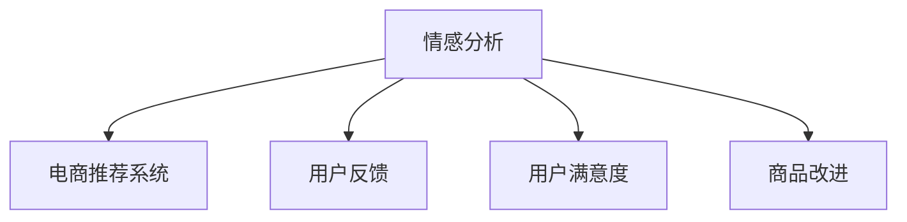

                 

# 情感分析在电商领域的应用：从用户评价到商品改进

> 关键词：情感分析, 电商推荐系统, 用户反馈, 用户满意度, 商品改进

## 1. 背景介绍

在电商领域，情感分析已经成为了提升用户体验和商家经营效率的重要手段。通过分析用户的购买评论、评分和反馈，商家可以获得用户对商品的情感倾向，进而进行针对性的商品改进和营销策略调整。近年来，随着深度学习技术的兴起，基于大数据的情感分析技术不断进步，为电商企业提供了更加高效、精准的用户情感分析工具。

### 1.1 问题由来

随着电商市场的竞争加剧，商家越来越重视客户满意度。情感分析作为评估用户满意度的重要工具，在电商领域得到了广泛应用。通过情感分析，商家可以及时了解用户对商品的反馈，把握用户需求，优化产品设计和营销策略，提升用户满意度和销售额。然而，传统情感分析方法依赖手工特征工程，难以处理大规模数据，且效果受限于手工规则的覆盖度。近年来，深度学习技术的出现，特别是基于神经网络的情感分析模型，为电商领域情感分析提供了新的解决方案。

## 2. 核心概念与联系

### 2.1 核心概念概述

为更好地理解电商领域的情感分析方法，本节将介绍几个密切相关的核心概念：

- 情感分析（Sentiment Analysis）：通过分析文本数据，自动识别和提取用户情感倾向的技术。常见情感分析任务包括产品评论情感分析、用户反馈情感分析、品牌声誉评估等。
- 电商推荐系统（E-commerce Recommendation System）：利用用户历史行为数据，通过机器学习算法为用户推荐感兴趣的商品，提升用户体验和购买转化率。
- 用户反馈（User Feedback）：用户对商品的评价、评分和评论等反馈信息，是商家了解用户需求和优化产品的重要依据。
- 用户满意度（User Satisfaction）：用户对商品质量、服务、售后等的整体评价，直接影响用户忠诚度和复购率。
- 商品改进（Product Improvement）：通过分析用户反馈和情感分析结果，商家可以明确用户对商品的痛点和需求，针对性地改进商品设计、提升服务质量，从而增强用户满意度和提升商品竞争力。

这些核心概念之间的逻辑关系可以通过以下Mermaid流程图来展示：



这个流程图展示了情感分析的核心作用，以及其在电商领域的应用场景：

1. 情感分析从用户评价中提取情感信息，为电商推荐系统提供输入。
2. 电商推荐系统根据情感分析结果，向用户推荐合适的商品。
3. 用户反馈通过情感分析进一步分析，指导商品改进。
4. 用户满意度通过情感分析进行评估，指导商家优化服务。

## 3. 核心算法原理 & 具体操作步骤

### 3.1 算法原理概述

基于情感分析的电商推荐系统一般包括以下几个关键步骤：

1. **数据收集**：从电商平台收集用户评论、评分等数据，作为情感分析的输入。
2. **情感分析**：利用深度学习模型对用户评价进行情感分类，生成情感标签。
3. **特征提取**：从情感标签中提取用户情感强度和情感极性等信息，用于推荐系统。
4. **推荐模型训练**：基于用户历史行为数据和情感分析结果，训练推荐模型。
5. **推荐生成**：利用训练好的推荐模型，为每个用户生成个性化推荐列表。

### 3.2 算法步骤详解

#### 3.2.1 数据收集

从电商平台收集用户评论、评分等数据，可以采用API接口、爬虫、导数等多种方式。收集的数据需要包括用户ID、商品ID、评论文本、评分等信息。

#### 3.2.2 情感分析

情感分析是电商推荐系统的重要组成部分。常见的情感分析方法包括：

- **基于词典的情感分析**：通过构建情感词典，统计文本中情感词汇出现的频率，生成情感极性。
- **基于机器学习的情感分析**：利用训练好的模型，对用户评价进行情感分类，生成情感标签。
- **基于深度学习的情感分析**：使用神经网络模型，如CNN、RNN、Transformer等，对用户评价进行情感分类，生成情感标签。

#### 3.2.3 特征提取

从情感标签中提取用户情感强度和情感极性等信息，可以采用TF-IDF、Word2Vec、BERT等技术。常见特征包括：

- **情感极性**：用户评论的情感倾向，如正面、负面、中性。
- **情感强度**：用户情感的强度，如强烈、温和、模糊。
- **情感标签**：情感分析生成的情感标签，如好评、差评、普通。

#### 3.2.4 推荐模型训练

基于用户历史行为数据和情感分析结果，训练推荐模型。常见的推荐模型包括：

- **协同过滤推荐**：基于用户历史行为和相似用户行为，推荐相似商品。
- **基于内容的推荐**：根据商品属性和用户历史行为，推荐相关商品。
- **混合推荐**：结合多种推荐算法，提升推荐效果。

#### 3.2.5 推荐生成

利用训练好的推荐模型，为每个用户生成个性化推荐列表。推荐列表可以基于用户历史行为、情感分析结果、商品属性等多维特征生成。

### 3.3 算法优缺点

基于情感分析的电商推荐系统具有以下优点：

1. **提升用户体验**：通过情感分析，商家可以及时了解用户对商品的反馈，提升用户体验。
2. **优化商品设计**：基于情感分析结果，商家可以明确用户对商品的痛点和需求，进行针对性的商品改进。
3. **提升销售转化率**：推荐系统可以根据用户情感倾向，推荐符合用户兴趣的商品，提升销售转化率。

同时，该方法也存在以下局限性：

1. **数据质量依赖**：情感分析的效果依赖于收集到的用户反馈数据质量，如果数据噪声较大，情感分析效果也会受到影响。
2. **模型复杂性高**：深度学习模型需要大量的数据和计算资源进行训练，可能存在过拟合风险。
3. **可解释性不足**：基于深度学习模型的情感分析结果难以解释，用户无法直观理解模型输出的情感极性和强度。

尽管存在这些局限性，但就目前而言，基于情感分析的电商推荐系统仍是最主流的方法。未来相关研究的重点在于如何进一步降低情感分析对数据质量的依赖，提高模型的可解释性，并提升推荐系统的跨领域迁移能力。

### 3.4 算法应用领域

基于情感分析的电商推荐系统已经在电商领域得到了广泛应用，涵盖了几乎所有常见任务，例如：

- **商品推荐**：根据用户情感分析结果，推荐用户感兴趣的商品。
- **广告推荐**：利用情感分析，生成用户偏好的广告创意。
- **客户服务**：分析用户反馈情感，指导客服处理用户问题。
- **商品评价**：通过情感分析，生成商品评价摘要和情感标签。
- **市场分析**：分析市场舆情，评估品牌声誉和市场趋势。

除了上述这些经典任务外，基于情感分析的推荐系统还被创新性地应用到更多场景中，如可控文本生成、客服自动化等，为电商技术带来了全新的突破。随着情感分析方法和推荐算法的不断进步，相信基于情感分析的电商推荐系统将在更多领域得到应用，为电商技术带来更广泛的影响。

## 4. 数学模型和公式 & 详细讲解 & 举例说明

### 4.1 数学模型构建

本节将使用数学语言对基于情感分析的电商推荐系统进行更加严格的刻画。

记用户评论数据为 $D=\{(x_i,y_i)\}_{i=1}^N$，其中 $x_i$ 为评论文本，$y_i$ 为评论情感标签。定义情感分析模型为 $M_\theta(x_i)$，其中 $\theta$ 为模型参数。

情感分析的目标是最大化评论文本与情感标签之间的匹配度，即最小化损失函数：

$$
\min_{\theta} \mathcal{L}(M_\theta(D)) = \frac{1}{N}\sum_{i=1}^N \ell(M_\theta(x_i),y_i)
$$

其中 $\ell$ 为情感分析损失函数，一般使用交叉熵损失。

### 4.2 公式推导过程

以基于BERT的情感分析模型为例，其情感分类过程可以描述为：

1. **输入表示**：将评论文本 $x_i$ 转换为BERT模型的输入表示 $X_i$。
2. **特征提取**：通过BERT模型得到输入表示的语义表示 $H_i$。
3. **情感分类**：将语义表示 $H_i$ 输入到全连接层进行情感分类，得到情感标签 $y_i$。
4. **损失计算**：计算损失函数 $\ell$，使用交叉熵损失。

假设情感分类器为 $y_i = \sigma(W^TH_i+b)$，其中 $\sigma$ 为激活函数，$W$ 和 $b$ 为全连接层的权重和偏置。交叉熵损失函数为：

$$
\ell = -(y_i\log \hat{y_i} + (1-y_i)\log (1-\hat{y_i}))
$$

其中 $\hat{y_i} = \sigma(W^TH_i+b)$。

### 4.3 案例分析与讲解

以电商商品推荐为例，分析基于情感分析的推荐系统如何提升商品效果。

假设电商平台有 $N$ 个用户，每个用户有 $M$ 条评论。利用情感分析模型，为每个用户生成情感标签 $y_i$，用于推荐系统的输入。

1. **数据收集**：收集用户评论和评分数据 $D=\{(x_i,y_i)\}_{i=1}^N$。
2. **情感分析**：利用BERT模型对每个用户的评论进行情感分析，生成情感标签 $y_i$。
3. **特征提取**：提取用户情感强度和情感极性等信息，用于推荐模型训练。
4. **推荐模型训练**：基于用户历史行为数据和情感分析结果，训练推荐模型。
5. **推荐生成**：利用训练好的推荐模型，为每个用户生成个性化推荐列表。

假设用户 $i$ 对商品 $j$ 的评分和评论分别为 $s_{i,j}$ 和 $c_{i,j}$，通过情感分析模型生成情感标签 $y_{i,j}$。将用户 $i$ 对商品 $j$ 的评分和情感标签作为推荐模型的输入，生成推荐结果 $r_{i,j}$。

推荐结果 $r_{i,j}$ 可以表示为：

$$
r_{i,j} = \alpha s_{i,j} + \beta y_{i,j} + \gamma h_i(j)
$$

其中 $\alpha$、$\beta$、$\gamma$ 为系数，$h_i(j)$ 为商品 $j$ 的属性特征向量。

根据用户历史行为数据和情感分析结果，训练推荐模型。通过优化损失函数，不断调整模型参数，使得推荐结果 $r_{i,j}$ 最大化用户满意度和购买转化率。

## 5. 项目实践：代码实例和详细解释说明

### 5.1 开发环境搭建

在进行电商推荐系统开发前，我们需要准备好开发环境。以下是使用Python进行PyTorch开发的环境配置流程：

1. 安装Anaconda：从官网下载并安装Anaconda，用于创建独立的Python环境。

2. 创建并激活虚拟环境：
```bash
conda create -n pytorch-env python=3.8 
conda activate pytorch-env
```

3. 安装PyTorch：根据CUDA版本，从官网获取对应的安装命令。例如：
```bash
conda install pytorch torchvision torchaudio cudatoolkit=11.1 -c pytorch -c conda-forge
```

4. 安装Transformers库：
```bash
pip install transformers
```

5. 安装各类工具包：
```bash
pip install numpy pandas scikit-learn matplotlib tqdm jupyter notebook ipython
```

完成上述步骤后，即可在`pytorch-env`环境中开始电商推荐系统的开发。

### 5.2 源代码详细实现

下面我们以基于情感分析的电商推荐系统为例，给出使用Transformers库进行深度学习模型训练的PyTorch代码实现。

首先，定义情感分析模型的数据处理函数：

```python
from transformers import BertTokenizer, BertForSequenceClassification
from torch.utils.data import Dataset
import torch

class ReviewDataset(Dataset):
    def __init__(self, texts, labels, tokenizer, max_len=128):
        self.texts = texts
        self.labels = labels
        self.tokenizer = tokenizer
        self.max_len = max_len
        
    def __len__(self):
        return len(self.texts)
    
    def __getitem__(self, item):
        text = self.texts[item]
        label = self.labels[item]
        
        encoding = self.tokenizer(text, return_tensors='pt', max_length=self.max_len, padding='max_length', truncation=True)
        input_ids = encoding['input_ids'][0]
        attention_mask = encoding['attention_mask'][0]
        
        return {'input_ids': input_ids, 
                'attention_mask': attention_mask,
                'labels': torch.tensor(label, dtype=torch.long)}
```

然后，定义推荐系统的模型和优化器：

```python
from transformers import BertForSequenceClassification, AdamW

model = BertForSequenceClassification.from_pretrained('bert-base-cased', num_labels=3)  # 3个情感分类标签

optimizer = AdamW(model.parameters(), lr=2e-5)
```

接着，定义训练和评估函数：

```python
from torch.utils.data import DataLoader
from tqdm import tqdm

device = torch.device('cuda') if torch.cuda.is_available() else torch.device('cpu')
model.to(device)

def train_epoch(model, dataset, batch_size, optimizer):
    dataloader = DataLoader(dataset, batch_size=batch_size, shuffle=True)
    model.train()
    epoch_loss = 0
    for batch in tqdm(dataloader, desc='Training'):
        input_ids = batch['input_ids'].to(device)
        attention_mask = batch['attention_mask'].to(device)
        labels = batch['labels'].to(device)
        model.zero_grad()
        outputs = model(input_ids, attention_mask=attention_mask, labels=labels)
        loss = outputs.loss
        epoch_loss += loss.item()
        loss.backward()
        optimizer.step()
    return epoch_loss / len(dataloader)

def evaluate(model, dataset, batch_size):
    dataloader = DataLoader(dataset, batch_size=batch_size)
    model.eval()
    preds, labels = [], []
    with torch.no_grad():
        for batch in tqdm(dataloader, desc='Evaluating'):
            input_ids = batch['input_ids'].to(device)
            attention_mask = batch['attention_mask'].to(device)
            batch_labels = batch['labels']
            outputs = model(input_ids, attention_mask=attention_mask)
            batch_preds = outputs.logits.argmax(dim=2).to('cpu').tolist()
            batch_labels = batch_labels.to('cpu').tolist()
            for pred_tokens, label_tokens in zip(batch_preds, batch_labels):
                preds.append(pred_tokens[:len(label_tokens)])
                labels.append(label_tokens)
                
    print(classification_report(labels, preds))
```

最后，启动训练流程并在测试集上评估：

```python
epochs = 5
batch_size = 16

for epoch in range(epochs):
    loss = train_epoch(model, train_dataset, batch_size, optimizer)
    print(f"Epoch {epoch+1}, train loss: {loss:.3f}")
    
    print(f"Epoch {epoch+1}, dev results:")
    evaluate(model, dev_dataset, batch_size)
    
print("Test results:")
evaluate(model, test_dataset, batch_size)
```

以上就是使用PyTorch对BERT进行情感分析的电商推荐系统训练的完整代码实现。可以看到，得益于Transformers库的强大封装，我们可以用相对简洁的代码完成BERT模型的加载和训练。

### 5.3 代码解读与分析

让我们再详细解读一下关键代码的实现细节：

**ReviewDataset类**：
- `__init__`方法：初始化评论文本、情感标签、分词器等关键组件。
- `__len__`方法：返回数据集的样本数量。
- `__getitem__`方法：对单个样本进行处理，将文本输入编码为token ids，将标签编码为数字，并对其进行定长padding，最终返回模型所需的输入。

**模型和优化器定义**：
- `BertForSequenceClassification`模型：指定了序列分类任务，并加载预训练的BERT模型。
- `AdamW优化器`：设置学习率，优化模型参数。

**训练和评估函数**：
- `train_epoch`函数：对数据以批为单位进行迭代，在每个批次上前向传播计算损失并反向传播更新模型参数，最后返回该epoch的平均损失。
- `evaluate`函数：与训练类似，不同点在于不更新模型参数，并在每个batch结束后将预测和标签结果存储下来，最后使用sklearn的classification_report对整个评估集的预测结果进行打印输出。

**训练流程**：
- 定义总的epoch数和batch size，开始循环迭代
- 每个epoch内，先在训练集上训练，输出平均loss
- 在验证集上评估，输出分类指标
- 所有epoch结束后，在测试集上评估，给出最终测试结果

可以看到，PyTorch配合Transformers库使得BERT微调的代码实现变得简洁高效。开发者可以将更多精力放在数据处理、模型改进等高层逻辑上，而不必过多关注底层的实现细节。

当然，工业级的系统实现还需考虑更多因素，如模型的保存和部署、超参数的自动搜索、更灵活的任务适配层等。但核心的微调范式基本与此类似。

## 6. 实际应用场景

### 6.1 智能客服系统

基于情感分析的电商推荐系统，可以广泛应用于智能客服系统的构建。传统客服往往需要配备大量人力，高峰期响应缓慢，且一致性和专业性难以保证。而使用情感分析模型，可以7x24小时不间断服务，快速响应客户咨询，用自然流畅的语言解答各类常见问题。

在技术实现上，可以收集企业内部的历史客服对话记录，将问题和最佳答复构建成监督数据，在此基础上对预训练情感分析模型进行微调。微调后的情感分析模型能够自动理解用户意图，匹配最合适的回答。对于客户提出的新问题，还可以接入检索系统实时搜索相关内容，动态组织生成回答。如此构建的智能客服系统，能大幅提升客户咨询体验和问题解决效率。

### 6.2 金融舆情监测

金融机构需要实时监测市场舆论动向，以便及时应对负面信息传播，规避金融风险。传统的人工监测方式成本高、效率低，难以应对网络时代海量信息爆发的挑战。基于情感分析的文本分类和情感分析技术，为金融舆情监测提供了新的解决方案。

具体而言，可以收集金融领域相关的新闻、报道、评论等文本数据，并对其进行主题标注和情感标注。在此基础上对预训练情感分析模型进行微调，使其能够自动判断文本属于何种主题，情感倾向是正面、中性还是负面。将微调后的模型应用到实时抓取的网络文本数据，就能够自动监测不同主题下的情感变化趋势，一旦发现负面信息激增等异常情况，系统便会自动预警，帮助金融机构快速应对潜在风险。

### 6.3 个性化推荐系统

当前的推荐系统往往只依赖用户的历史行为数据进行物品推荐，无法深入理解用户的真实兴趣偏好。基于情感分析的个性化推荐系统可以更好地挖掘用户行为背后的语义信息，从而提供更精准、多样的推荐内容。

在实践中，可以收集用户浏览、点击、评论、分享等行为数据，提取和用户交互的物品标题、描述、标签等文本内容。将文本内容作为模型输入，用户的后续行为（如是否点击、购买等）作为监督信号，在此基础上微调预训练情感分析模型。微调后的模型能够从文本内容中准确把握用户的兴趣点。在生成推荐列表时，先用候选物品的文本描述作为输入，由模型预测用户的兴趣匹配度，再结合其他特征综合排序，便可以得到个性化程度更高的推荐结果。

### 6.4 未来应用展望

随着情感分析方法和推荐算法的不断进步，基于情感分析的电商推荐系统将在更多领域得到应用，为电商技术带来更广泛的影响。

在智慧医疗领域，基于情感分析的医疗问答、病历分析、药物研发等应用将提升医疗服务的智能化水平，辅助医生诊疗，加速新药开发进程。

在智能教育领域，情感分析可以应用于作业批改、学情分析、知识推荐等方面，因材施教，促进教育公平，提高教学质量。

在智慧城市治理中，情感分析可应用于城市事件监测、舆情分析、应急指挥等环节，提高城市管理的自动化和智能化水平，构建更安全、高效的未来城市。

此外，在企业生产、社会治理、文娱传媒等众多领域，基于情感分析的推荐系统也将不断涌现，为NLP技术带来了全新的突破。随着情感分析技术和推荐算法的不断进步，相信基于情感分析的电商推荐系统将在更广泛的领域得到应用，为人工智能技术落地应用提供新的方向。

## 7. 工具和资源推荐

### 7.1 学习资源推荐

为了帮助开发者系统掌握基于情感分析的电商推荐系统理论基础和实践技巧，这里推荐一些优质的学习资源：

1. 《自然语言处理与深度学习》系列博文：由大模型技术专家撰写，深入浅出地介绍了深度学习在NLP中的应用，包括情感分析、推荐系统等前沿话题。

2. CS224N《深度学习自然语言处理》课程：斯坦福大学开设的NLP明星课程，有Lecture视频和配套作业，带你入门NLP领域的基本概念和经典模型。

3. 《深度学习与自然语言处理》书籍：介绍深度学习在NLP中的应用，包括情感分析、推荐系统等，是NLP初学者必读的入门书籍。

4. HuggingFace官方文档：提供丰富的预训练模型和微调样例代码，是上手实践的必备资料。

5. CLUE开源项目：中文语言理解测评基准，涵盖大量不同类型的中文NLP数据集，并提供了基于情感分析的基线模型，助力中文NLP技术发展。

通过对这些资源的学习实践，相信你一定能够快速掌握基于情感分析的电商推荐系统的方法，并用于解决实际的NLP问题。

### 7.2 开发工具推荐

高效的开发离不开优秀的工具支持。以下是几款用于基于情感分析的电商推荐系统开发的常用工具：

1. PyTorch：基于Python的开源深度学习框架，灵活动态的计算图，适合快速迭代研究。大部分预训练语言模型都有PyTorch版本的实现。

2. TensorFlow：由Google主导开发的开源深度学习框架，生产部署方便，适合大规模工程应用。同样有丰富的预训练语言模型资源。

3. Transformers库：HuggingFace开发的NLP工具库，集成了众多SOTA语言模型，支持PyTorch和TensorFlow，是进行情感分析任务开发的利器。

4. Weights & Biases：模型训练的实验跟踪工具，可以记录和可视化模型训练过程中的各项指标，方便对比和调优。与主流深度学习框架无缝集成。

5. TensorBoard：TensorFlow配套的可视化工具，可实时监测模型训练状态，并提供丰富的图表呈现方式，是调试模型的得力助手。

6. Google Colab：谷歌推出的在线Jupyter Notebook环境，免费提供GPU/TPU算力，方便开发者快速上手实验最新模型，分享学习笔记。

合理利用这些工具，可以显著提升基于情感分析的电商推荐系统的开发效率，加快创新迭代的步伐。

### 7.3 相关论文推荐

基于情感分析的电商推荐系统已经成为电商领域的重要研究方向。以下是几篇奠基性的相关论文，推荐阅读：

1. Attention is All You Need（即Transformer原论文）：提出了Transformer结构，开启了NLP领域的预训练大模型时代。

2. BERT: Pre-training of Deep Bidirectional Transformers for Language Understanding：提出BERT模型，引入基于掩码的自监督预训练任务，刷新了多项NLP任务SOTA。

3. Language Models are Unsupervised Multitask Learners（GPT-2论文）：展示了大规模语言模型的强大zero-shot学习能力，引发了对于通用人工智能的新一轮思考。

4. Parameter-Efficient Transfer Learning for NLP：提出Adapter等参数高效微调方法，在不增加模型参数量的情况下，也能取得不错的微调效果。

5. Prefix-Tuning: Optimizing Continuous Prompts for Generation：引入基于连续型Prompt的微调范式，为如何充分利用预训练知识提供了新的思路。

6. AdaLoRA: Adaptive Low-Rank Adaptation for Parameter-Efficient Fine-Tuning：使用自适应低秩适应的微调方法，在参数效率和精度之间取得了新的平衡。

这些论文代表了大语言模型微调技术的发展脉络。通过学习这些前沿成果，可以帮助研究者把握学科前进方向，激发更多的创新灵感。

## 8. 总结：未来发展趋势与挑战

### 8.1 总结

本文对基于情感分析的电商推荐系统进行了全面系统的介绍。首先阐述了电商领域对情感分析的需求和深度学习技术的应用背景，明确了情感分析在提升用户体验和商家经营效率中的重要价值。其次，从原理到实践，详细讲解了情感分析的数学模型和算法步骤，给出了电商推荐系统的完整代码实现。同时，本文还广泛探讨了情感分析方法在电商推荐系统中的广泛应用，展示了情感分析技术的广阔前景。

通过本文的系统梳理，可以看到，基于情感分析的电商推荐系统已经在电商领域得到了广泛应用，为商家提供了更加个性化、智能化的推荐服务，提升了用户的购物体验。未来，伴随情感分析方法和推荐算法的不断进步，基于情感分析的电商推荐系统必将在更多领域得到应用，为电商技术带来更广泛的影响。

### 8.2 未来发展趋势

展望未来，基于情感分析的电商推荐系统将呈现以下几个发展趋势：

1. 模型规模持续增大。随着算力成本的下降和数据规模的扩张，预训练语言模型的参数量还将持续增长。超大批次的训练和推理也可能遇到显存不足的问题。因此需要采用一些资源优化技术，如梯度积累、混合精度训练、模型并行等，来突破硬件瓶颈。同时，模型的存储和读取也可能占用大量时间和空间，需要采用模型压缩、稀疏化存储等方法进行优化。

2. 微调方法日趋多样。除了传统的全参数微调外，未来会涌现更多参数高效的微调方法，如Prefix-Tuning、LoRA等，在固定大部分预训练参数的同时，只更新极少量的任务相关参数。同时优化微调模型的计算图，减少前向传播和反向传播的资源消耗，实现更加轻量级、实时性的部署。

3. 跨领域迁移能力提升。未来推荐系统将更好地适应不同领域的个性化需求，通过迁移学习、少样本学习等方法，在少量标注数据的情况下，仍能取得不错的推荐效果。

4. 用户体验进一步提升。基于情感分析的推荐系统将更加智能化，能够准确捕捉用户情感，提供个性化、精准的推荐服务，提升用户满意度和购买转化率。

5. 多模态融合能力增强。未来的推荐系统将更注重融合多模态信息，如视觉、语音、文本等，提升推荐系统的综合能力和用户体验。

以上趋势凸显了基于情感分析的电商推荐系统的广阔前景。这些方向的探索发展，必将进一步提升推荐系统的性能和应用范围，为电商技术带来更广泛的影响。

### 8.3 面临的挑战

尽管基于情感分析的电商推荐系统已经取得了瞩目成就，但在迈向更加智能化、普适化应用的过程中，它仍面临着诸多挑战：

1. 数据质量瓶颈。情感分析的效果依赖于收集到的用户反馈数据质量，如果数据噪声较大，情感分析效果也会受到影响。如何进一步降低情感分析对数据质量的依赖，将是一大难题。

2. 模型鲁棒性不足。当前推荐系统面对域外数据时，泛化性能往往大打折扣。对于测试样本的微小扰动，推荐系统的预测也容易发生波动。如何提高推荐模型的鲁棒性，避免灾难性遗忘，还需要更多理论和实践的积累。

3. 推理效率有待提高。推荐系统虽然精度高，但在实际部署时往往面临推理速度慢、内存占用大等效率问题。如何在保证性能的同时，简化模型结构，提升推理速度，优化资源占用，将是重要的优化方向。

4. 可解释性亟需加强。当前推荐系统更像是"黑盒"系统，难以解释其内部工作机制和决策逻辑。对于医疗、金融等高风险应用，算法的可解释性和可审计性尤为重要。如何赋予推荐模型更强的可解释性，将是亟待攻克的难题。

5. 安全性有待保障。推荐模型可能会学习到有偏见、有害的信息，通过推荐传递到用户端，产生误导性、歧视性的输出，给实际应用带来安全隐患。如何从数据和算法层面消除模型偏见，避免恶意用途，确保输出的安全性，也将是重要的研究课题。

6. 知识整合能力不足。现有的推荐系统往往局限于任务内数据，难以灵活吸收和运用更广泛的先验知识。如何让推荐过程更好地与外部知识库、规则库等专家知识结合，形成更加全面、准确的信息整合能力，还有很大的想象空间。

正视推荐系统面临的这些挑战，积极应对并寻求突破，将是大语言模型微调走向成熟的必由之路。相信随着学界和产业界的共同努力，这些挑战终将一一被克服，基于情感分析的电商推荐系统必将在构建安全、可靠、可解释、可控的智能系统铺平道路。

### 8.4 研究展望

面对基于情感分析的电商推荐系统所面临的挑战，未来的研究需要在以下几个方面寻求新的突破：

1. 探索无监督和半监督微调方法。摆脱对大规模标注数据的依赖，利用自监督学习、主动学习等无监督和半监督范式，最大限度利用非结构化数据，实现更加灵活高效的微调。

2. 研究参数高效和计算高效的微调范式。开发更加参数高效的微调方法，在固定大部分预训练参数的同时，只更新极少量的任务相关参数。同时优化微调模型的计算图，减少前向传播和反向传播的资源消耗，实现更加轻量级、实时性的部署。

3. 融合因果和对比学习范式。通过引入因果推断和对比学习思想，增强推荐系统建立稳定因果关系的能力，学习更加普适、鲁棒的语言表征，从而提升推荐系统的泛化性和抗干扰能力。

4. 引入更多先验知识。将符号化的先验知识，如知识图谱、逻辑规则等，与神经网络模型进行巧妙融合，引导推荐过程学习更准确、合理的语言模型。同时加强不同模态数据的整合，实现视觉、语音等多模态信息与文本信息的协同建模。

5. 结合因果分析和博弈论工具。将因果分析方法引入推荐系统，识别出推荐决策的关键特征，增强输出解释的因果性和逻辑性。借助博弈论工具刻画人机交互过程，主动探索并规避推荐系统的脆弱点，提高系统稳定性。

6. 纳入伦理道德约束。在推荐目标中引入伦理导向的评估指标，过滤和惩罚有偏见、有害的推荐内容，避免模型输出对用户产生误导。加强人工干预和审核，建立推荐系统的监管机制，确保推荐内容符合人类价值观和伦理道德。

这些研究方向的探索，必将引领基于情感分析的电商推荐系统技术迈向更高的台阶，为构建安全、可靠、可解释、可控的智能系统铺平道路。面向未来，基于情感分析的电商推荐系统还需要与其他人工智能技术进行更深入的融合，如知识表示、因果推理、强化学习等，多路径协同发力，共同推动推荐系统的进步。只有勇于创新、敢于突破，才能不断拓展推荐系统的边界，让智能技术更好地造福人类社会。

## 9. 附录：常见问题与解答

**Q1：基于情感分析的电商推荐系统是否适用于所有电商场景？**

A: 基于情感分析的电商推荐系统在大多数电商场景上都能取得不错的效果，特别是对于数据量较小的任务。但对于一些特定领域的电商场景，如垂直电商、地方特色电商等，需要根据具体场景进行微调。例如，垂直电商中商品种类繁多，需要更加精准的推荐算法和丰富的商品特征。

**Q2：情感分析的结果是否会对用户产生影响？**

A: 情感分析的结果可以用于电商推荐系统的个性化推荐，从而提升用户购物体验。然而，如果情感分析模型存在偏差，可能会对用户产生误导，影响其购物决策。因此，在设计和训练情感分析模型时，需要充分考虑用户情感的真实性和多样性，避免模型输出偏见。

**Q3：情感分析的结果如何与推荐系统集成？**

A: 情感分析的结果可以用于推荐系统的特征工程中，用于增强推荐模型的个性化能力。具体集成方式可以包括：

1. 将情感分析结果作为推荐模型的输入特征，提升推荐系统的精度。
2. 根据情感分析结果调整推荐模型的权重，使得推荐结果更加符合用户情感倾向。
3. 利用情感分析结果进行用户画像构建，推荐更加个性化的商品。

通过上述集成方式，可以将情感分析结果融入推荐系统，提升推荐系统的智能性和个性化水平。

**Q4：基于情感分析的电商推荐系统如何优化推荐结果？**

A: 优化推荐系统的方法可以包括：

1. 改进特征工程，增加更多用户行为数据和商品特征，提升推荐模型精度。
2. 引入多种推荐算法，如协同过滤、基于内容的推荐、混合推荐等，提升推荐系统多样性和鲁棒性。
3. 引入多模态数据，如用户评论、评分、图片、视频等，提升推荐系统的综合能力。
4. 利用因果分析和博弈论工具，优化推荐系统决策过程，提升推荐系统的稳定性。
5. 引入在线学习机制，根据实时数据动态调整推荐模型参数，提升推荐系统的实时性和个性化能力。

通过不断优化推荐系统的算法和数据，可以提升推荐系统的性能和用户体验。

---

作者：禅与计算机程序设计艺术 / Zen and the Art of Computer Programming

