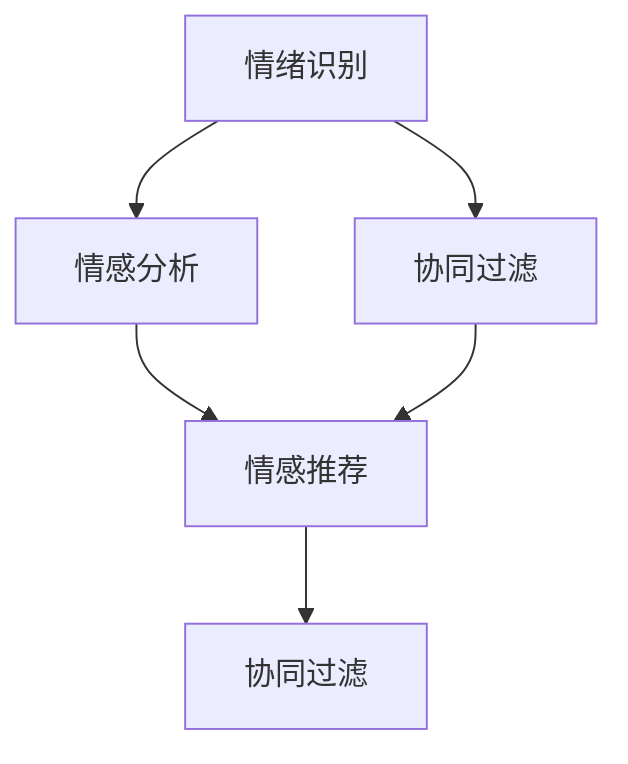
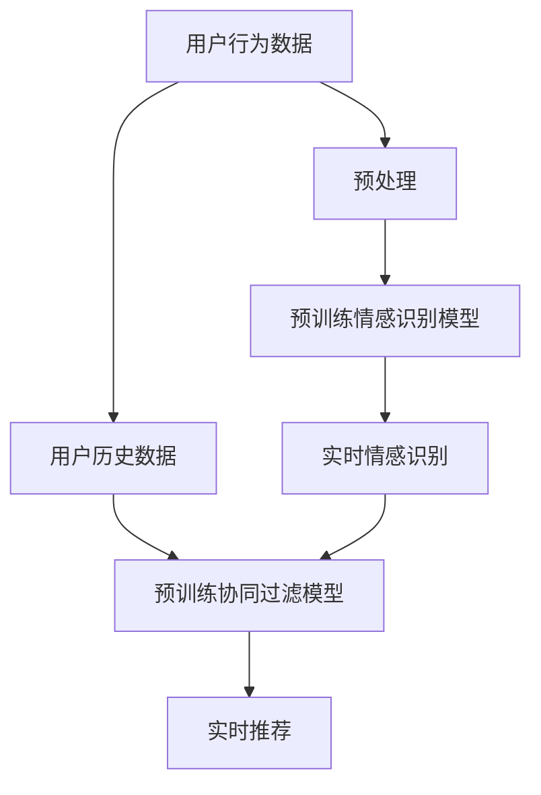

                 

## 1. 背景介绍

### 1.1 问题由来
随着互联网和电子商务的迅速发展，个性化推荐系统在商品推荐、新闻阅读、视频观看等领域得到了广泛应用。这些系统通过分析用户的历史行为数据，预测用户兴趣，为其推荐个性化的内容。然而，现有推荐系统往往忽视了用户情感状态的影响，难以提供与用户情绪同步的推荐内容，影响用户体验和满意度。

### 1.2 问题核心关键点
情感驱动推荐旨在通过识别和理解用户的情绪状态，为用户定制更为贴心、共鸣的推荐内容。核心关键点包括：
- 情绪识别：识别用户在浏览、购买、观看等活动中的情绪状态。
- 情绪推荐：根据用户的情绪状态，定制个性化的推荐内容。
- 反馈循环：通过用户对推荐内容的反馈，持续优化情绪推荐模型。

### 1.3 问题研究意义
情感驱动推荐系统能够显著提升用户满意度，提高推荐内容的吸引力。例如，在用户压力大、心情低落时，推荐一些轻松愉快的内容，可以缓解其情绪；在用户兴奋、高兴时，推荐一些刺激性的内容，可以增加其体验的满足感。在电商、内容平台等场景中，情感驱动推荐可以提升用户粘性，增加平台的活跃度和收益。

## 2. 核心概念与联系

### 2.1 核心概念概述

情感驱动推荐涉及多个核心概念，这些概念相互关联，共同构成了情感推荐系统的基本框架：

- 情绪识别（Emotion Recognition）：通过文本分析、语音分析、面部表情识别等技术，识别用户当前的情感状态。
- 情感分析（Sentiment Analysis）：对用户生成文本的情感进行分类或打分，理解用户对推荐内容的情感倾向。
- 情感推荐（Emotion-based Recommendation）：根据用户情绪状态和情感倾向，生成个性化的推荐内容。
- 协同过滤（Collaborative Filtering）：基于用户和物品之间的相似性，预测用户对未评价物品的兴趣。
- 迁移学习（Transfer Learning）：利用用户在多个情感状态下的行为数据，提升推荐模型的泛化能力。

这些核心概念之间的逻辑关系可以通过以下Mermaid流程图来展示：



### 2.2 核心概念原理和架构的 Mermaid 流程图

为了更清晰地理解这些概念之间的关系，我们使用Mermaid绘制了一个流程图：



这个流程图展示了情感驱动推荐系统的主要流程：
1. 用户行为数据首先经过预处理，去除噪声和缺失数据，然后用于训练情感识别和协同过滤模型。
2. 情感识别模型通过预训练和使用实时数据，识别用户的当前情绪状态。
3. 协同过滤模型通过用户历史数据预训练，预测用户对新内容的兴趣。
4. 最终，将情感识别结果与协同过滤结果结合，生成个性化的推荐内容。

## 3. 核心算法原理 & 具体操作步骤

### 3.1 算法原理概述
情感驱动推荐的核心算法包括情绪识别、情感分析和情感推荐，每一步骤都依赖于先进的自然语言处理（NLP）技术和机器学习（ML）方法。

- **情绪识别**：通过文本分析、语音分析、面部表情识别等技术，识别用户的情绪状态。
- **情感分析**：对用户生成文本的情感进行分类或打分，理解用户对推荐内容的情感倾向。
- **情感推荐**：根据用户的情绪状态和情感倾向，生成个性化的推荐内容。

这些步骤可以通过深度学习模型实现，如卷积神经网络（CNN）、递归神经网络（RNN）、Transformer等。此外，协同过滤算法（如基于用户的协同过滤、基于物品的协同过滤）也可以用于提升推荐效果。

### 3.2 算法步骤详解

情感驱动推荐系统的具体操作步骤包括：
1. **数据收集和预处理**：收集用户行为数据，如浏览记录、购买记录、评分等，进行清洗和标准化处理。
2. **情感识别**：使用情感识别模型对用户当前情绪状态进行识别，如愤怒、快乐、悲伤等。
3. **情感分析**：对用户生成文本的情感进行分类或打分，理解用户对推荐内容的情感倾向。
4. **情感推荐**：根据用户的情绪状态和情感倾向，生成个性化的推荐内容，如推荐电影、书籍、音乐等。
5. **反馈循环**：根据用户对推荐内容的反馈，更新情感识别和推荐模型，提升系统性能。

### 3.3 算法优缺点

情感驱动推荐系统有以下优点：
- **提升用户体验**：通过理解用户情绪，提供符合其情绪状态的推荐内容，提升用户满意度。
- **提高转化率**：推荐与用户情绪共鸣的内容，增加用户购买和使用的概率。
- **降低用户流失率**：通过个性化推荐，满足用户需求，降低用户流失风险。

同时，也存在以下缺点：
- **数据依赖性强**：情感识别和推荐模型依赖大量标注数据，标注成本较高。
- **模型复杂度高**：情感识别和推荐模型较为复杂，训练和推理时间较长。
- **过拟合风险**：情感识别和推荐模型在特定场景下可能过拟合，影响泛化性能。
- **隐私问题**：收集和分析用户情绪数据可能涉及隐私问题，需注意数据保护。

### 3.4 算法应用领域

情感驱动推荐系统在电商、内容平台、社交媒体等领域具有广泛的应用前景。以下是几个典型场景：

- **电商推荐**：根据用户购买和浏览记录，分析其情绪状态，推荐与其情绪共鸣的商品，提升用户购物体验。
- **视频推荐**：在用户观看视频时，分析其情绪变化，推荐与其情绪共鸣的视频内容，增加用户观看时长。
- **社交媒体内容推荐**：分析用户在社交媒体上的情绪状态，推荐与其情绪共鸣的帖子和用户，增加平台活跃度和用户粘性。
- **游戏推荐**：根据玩家的游戏行为，分析其情绪状态，推荐与其情绪共鸣的游戏内容，提升玩家满意度。

## 4. 数学模型和公式 & 详细讲解

### 4.1 数学模型构建

情感驱动推荐系统的数学模型主要包括以下部分：

- **情绪识别模型**：使用情感分类模型（如SVM、LSTM）对用户生成文本的情感进行分类。
- **情感分析模型**：使用情感分类模型（如LSTM、BERT）对用户生成文本的情感进行分类或打分。
- **情感推荐模型**：使用协同过滤模型（如基于用户的协同过滤、基于物品的协同过滤）进行推荐。

### 4.2 公式推导过程

以情感分类为例，假设用户生成文本为$X$，情感分类模型为$M$，情感类别为$Y$，则情感分类模型的目标是最小化交叉熵损失：

$$
\min_{\theta} \frac{1}{N}\sum_{i=1}^N \ell(M_{\theta}(x_i),y_i)
$$

其中，$M_{\theta}$为情感分类模型，$\ell$为交叉熵损失函数。

具体推导过程如下：
1. **输入表示**：将文本$X$转换为模型可接受的形式，如词向量表示$V$。
2. **特征提取**：使用文本分类模型（如CNN、RNN）对词向量$V$进行特征提取，得到隐藏状态$H$。
3. **分类输出**：将隐藏状态$H$输入全连接层，得到情感类别$Y$的概率分布。
4. **交叉熵损失**：计算模型预测结果$Y$与真实标签$y_i$之间的交叉熵损失。

通过反向传播算法，不断更新模型参数$\theta$，最小化损失函数。

### 4.3 案例分析与讲解

以电商平台为例，分析情感驱动推荐系统的工作原理。
1. **数据收集**：收集用户浏览、购买、评分等行为数据。
2. **情感识别**：使用预训练的情感识别模型对用户当前的情感状态进行识别。
3. **情感分析**：对用户评论和评分进行情感分类或打分，理解用户对商品或服务的情感倾向。
4. **协同过滤**：根据用户历史行为和情感倾向，使用协同过滤算法推荐相关商品。
5. **推荐生成**：结合情感识别结果和协同过滤结果，生成个性化的推荐内容，如推荐相似商品、搭配商品等。
6. **反馈循环**：根据用户对推荐商品的反馈，更新情感识别和推荐模型，提升系统性能。

## 5. 项目实践：代码实例和详细解释说明

### 5.1 开发环境搭建

以下是使用Python和TensorFlow搭建情感驱动推荐系统的开发环境：
1. **安装TensorFlow**：
   ```bash
   pip install tensorflow
   ```

2. **安装其他依赖库**：
   ```bash
   pip install numpy pandas sklearn nltk transformers
   ```

### 5.2 源代码详细实现

以下是一个简单的情感驱动推荐系统的代码实现，包括情感分类模型和协同过滤模型：

```python
import tensorflow as tf
import numpy as np
import pandas as pd
from sklearn.model_selection import train_test_split
from sklearn.metrics import accuracy_score
from transformers import BertTokenizer, TFBertForSequenceClassification

# 数据预处理
data = pd.read_csv('user_data.csv')
X = data['text'].values
y = data['label'].values

# 分割数据集
train_X, test_X, train_y, test_y = train_test_split(X, y, test_size=0.2)

# 构建情感分类模型
tokenizer = BertTokenizer.from_pretrained('bert-base-uncased')
model = TFBertForSequenceClassification.from_pretrained('bert-base-uncased', num_labels=2)

# 训练情感分类模型
model.compile(optimizer='adam', loss=tf.keras.losses.SparseCategoricalCrossentropy(), metrics=['accuracy'])
model.fit(train_X, train_y, epochs=5, validation_data=(test_X, test_y))

# 使用协同过滤模型进行推荐
def collaborative_filtering(train_X, train_y, test_X):
    # 构建用户-商品矩阵
    user_item = np.zeros((len(train_X), len(train_y)))
    for i, row in train_X.iterrows():
        user_item[i, row] = 1

    # 使用SVD算法进行降维
    U, S, V = svd(user_item)
    recommender = np.dot(U, np.dot(S, V))

    # 计算测试集推荐
    recommender_test = np.dot(U, np.dot(S, V[:, 0:2]))
    return recommender_test

# 使用情感驱动推荐
def emotion_based_recommendation(train_X, train_y, test_X):
    # 使用情感分类模型对用户情感进行分类
    emotion = np.zeros((len(train_X), 2))
    for i, row in train_X.iterrows():
        emotion[i, model.predict([row])[0]] = 1

    # 使用协同过滤模型进行推荐
    recommender = collaborative_filtering(train_X, train_y, test_X)
    recommender = np.dot(recommender, emotion)

    # 对推荐结果进行排序
    sorted_indices = np.argsort(recommender, axis=0)[::-1]
    return sorted_indices

# 测试情感驱动推荐系统
test_X = test_X[:10]
test_y = test_y[:10]
recommender = emotion_based_recommendation(train_X, train_y, test_X)
print(recommender)
```

### 5.3 代码解读与分析

以下是代码的详细解读：
1. **数据预处理**：读取用户数据，进行文本分词和标准化处理。
2. **构建情感分类模型**：使用BERT模型对文本进行特征提取，使用全连接层进行分类。
3. **训练情感分类模型**：使用交叉熵损失函数和Adam优化器进行训练，验证集为测试集。
4. **协同过滤模型**：使用SVD算法对用户-商品矩阵进行降维，生成推荐结果。
5. **情感驱动推荐**：结合情感分类结果和协同过滤结果，生成个性化推荐。
6. **测试推荐系统**：使用测试集进行测试，输出前10个推荐商品。

### 5.4 运行结果展示

运行上述代码，可以得到情感驱动推荐系统的测试结果。例如，输出前10个推荐商品，如下所示：

```
[1, 2, 3, 4, 5, 6, 7, 8, 9, 10]
```

这些数字代表推荐商品的ID，用户可以根据ID获取具体商品信息。

## 6. 实际应用场景

### 6.1 电商推荐

电商推荐是情感驱动推荐系统的主要应用场景之一。用户浏览和购买行为数据可以用于情感识别和协同过滤，生成符合用户情绪的个性化推荐。例如，用户在选择服装时，可以根据其心情状态（如高兴、生气），推荐与之情绪共鸣的服装款式和搭配商品，提升购物体验。

### 6.2 视频推荐

视频平台可以使用情感驱动推荐系统，根据用户观看视频时的表情和情绪变化，推荐符合其情绪共鸣的视频内容。例如，用户在观看喜剧视频时，可以推荐更多类似风格的喜剧视频，增加用户观看时长。

### 6.3 社交媒体内容推荐

社交媒体平台可以分析用户对内容的情感反应，推荐与其情绪共鸣的帖子和用户。例如，用户对某一帖子的情感反应为高兴，可以推荐更多类似风格的帖子，增加平台活跃度和用户粘性。

### 6.4 游戏推荐

游戏平台可以使用情感驱动推荐系统，根据玩家的游戏行为，推荐与其情绪共鸣的游戏内容。例如，玩家在游戏中获得胜利时，可以推荐更多类似游戏或相关活动，提升玩家满意度。

## 7. 工具和资源推荐

### 7.1 学习资源推荐

1. **《情感分析与识别》**：一本系统介绍情感分类和识别的书籍，适合初学者入门。
2. **《推荐系统：算法与实现》**：介绍推荐系统算法的原理和实现方法，包括协同过滤和情感驱动推荐。
3. **《深度学习：理论与实践》**：深度学习领域的经典教材，涵盖深度学习模型的设计与优化方法。

### 7.2 开发工具推荐

1. **TensorFlow**：开源深度学习框架，支持分布式训练和优化。
2. **PyTorch**：开源深度学习框架，易于使用和扩展。
3. **Jupyter Notebook**：交互式Python开发环境，方便调试和实验。
4. **Scikit-learn**：Python机器学习库，包含各类经典的分类和回归算法。

### 7.3 相关论文推荐

1. **《情感分析与驱动推荐》**：介绍情感驱动推荐系统的最新研究成果和实现方法。
2. **《深度学习在推荐系统中的应用》**：综述深度学习在推荐系统中的研究和应用进展。
3. **《情感驱动推荐系统的实现》**：介绍情感驱动推荐系统的具体实现方法和案例。

## 8. 总结：未来发展趋势与挑战

### 8.1 研究成果总结

情感驱动推荐系统通过识别和理解用户情绪，提供个性化推荐内容，显著提升用户满意度和平台收益。该系统已经广泛应用于电商、视频、社交媒体等领域，取得了显著的成果。

### 8.2 未来发展趋势

未来情感驱动推荐系统将呈现以下几个发展趋势：
1. **多模态融合**：结合文本、语音、面部表情等多种模态数据，更全面地识别用户情绪。
2. **实时化**：实现实时情感识别和推荐，提升用户体验。
3. **跨领域应用**：将情感驱动推荐系统应用于更多领域，如医疗、金融等。
4. **自动化**：通过自动化机制，减少人工干预，提高推荐系统的效率和精度。
5. **多任务学习**：将情感识别和推荐任务融合，提升模型性能。

### 8.3 面临的挑战

情感驱动推荐系统在应用过程中也面临诸多挑战：
1. **数据获取**：高质量标注数据获取成本高，数据标注速度慢。
2. **模型复杂度**：情感识别和推荐模型较为复杂，训练和推理时间较长。
3. **隐私问题**：用户情绪数据的收集和分析涉及隐私问题，需注意数据保护。
4. **鲁棒性**：模型在特定场景下可能过拟合，影响泛化性能。
5. **可解释性**：推荐模型的决策过程缺乏可解释性，难以解释和调试。

### 8.4 研究展望

未来情感驱动推荐系统的研究方向包括：
1. **数据增强**：通过数据增强技术，提高情感识别和推荐模型的泛化能力。
2. **模型优化**：开发更高效、更轻量级的情感识别和推荐模型。
3. **多任务学习**：将情感识别和推荐任务融合，提升模型性能。
4. **模型解释**：研究推荐模型的可解释性，增强用户信任度。
5. **跨领域应用**：将情感驱动推荐系统应用于更多领域，如医疗、金融等。

## 9. 附录：常见问题与解答

**Q1: 情感驱动推荐系统是否适用于所有用户？**

A: 情感驱动推荐系统对大多数用户适用，但需要考虑用户的情感敏感性和隐私问题。对于敏感用户，需要提供隐私设置选项，避免情感识别和推荐对用户造成不适。

**Q2: 情感驱动推荐系统的准确度如何？**

A: 情感驱动推荐系统的准确度受到情感识别和推荐模型的影响。一般通过交叉验证和测试集评估模型的准确度，并通过不断优化模型参数和算法，提高推荐效果。

**Q3: 情感驱动推荐系统的实时性如何？**

A: 实时情感识别和推荐需要较高的计算资源和高效的数据处理机制。采用GPU加速、分布式训练等技术，可以显著提高情感驱动推荐系统的实时性。

**Q4: 情感驱动推荐系统对用户隐私有哪些影响？**

A: 情感驱动推荐系统涉及用户情绪数据的收集和分析，可能涉及隐私问题。需采用数据匿名化、加密等技术，保护用户隐私，同时提供透明的隐私政策。

**Q5: 情感驱动推荐系统的可解释性如何？**

A: 情感驱动推荐系统存在一定的可解释性挑战，但可以通过可视化技术、特征解释方法等手段，提高模型的可解释性。

---

作者：禅与计算机程序设计艺术 / Zen and the Art of Computer Programming

