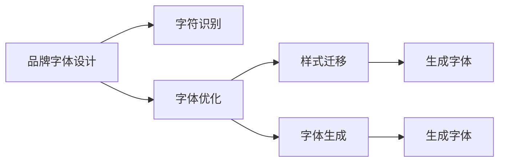

                 

## 1. 背景介绍

在数字化时代，品牌识别度的提升对于企业成功至关重要。个人品牌专属字体的打造，不仅能提升品牌的美观度和专业性，还能增强用户对品牌的记忆和情感连接。如何设计出既符合品牌形象又便于用户识别的字体，成为现代企业设计师和品牌管理者的重要课题。本文将深入探讨个人品牌专属字体的设计与应用，介绍基于计算机视觉和机器学习技术的字体优化方法，并给出实际项目的详细实施步骤。

## 2. 核心概念与联系

### 2.1 核心概念概述

- **品牌字体**：指品牌专属的定制化字体，用于标识品牌名称、LOGO等，提升品牌识别度和美观度。
- **字体优化**：指通过计算机视觉和机器学习技术，自动调整字体设计参数，使字体更符合品牌形象和用户偏好。
- **字符识别**：指通过机器学习模型对字体进行分类、聚类等处理，找出最具代表性的字体特征。
- **样式迁移**：指通过风格迁移等技术，将其他字体风格应用到目标字体上，提升字体的视觉吸引力。
- **字体生成**：指通过生成对抗网络等技术，自动生成符合特定风格和字体的文本输出。

这些核心概念之间存在紧密的联系，共同构成了个人品牌专属字体设计的基本框架。

### 2.2 核心概念原理和架构的 Mermaid 流程图(Mermaid 流程节点中不要有括号、逗号等特殊字符)



### 2.3 核心概念之间的联系与互动

1. **字符识别**：通过对品牌字体样本的特征提取，找出最具代表性的字体特征，作为字体优化的基础。
2. **字体优化**：通过机器学习模型，自动调整字体设计参数，使其更符合品牌形象和用户偏好。
3. **样式迁移**：将其他字体的风格应用到目标字体上，提升字体的视觉吸引力。
4. **字体生成**：自动生成符合特定风格和字体的文本输出，加速字体设计过程。

这些核心概念之间形成了一个闭环，不断迭代优化，最终实现符合品牌形象和用户偏好的字体设计。

## 3. 核心算法原理 & 具体操作步骤

### 3.1 算法原理概述

基于计算机视觉和机器学习技术的字体优化方法，主要包括以下几个步骤：

1. **字符识别**：通过机器学习模型，对品牌字体样本进行特征提取，找出最具代表性的字体特征。
2. **字体优化**：利用机器学习模型，自动调整字体设计参数，使字体更符合品牌形象和用户偏好。
3. **样式迁移**：通过风格迁移等技术，将其他字体风格应用到目标字体上，提升字体的视觉吸引力。
4. **字体生成**：通过生成对抗网络等技术，自动生成符合特定风格和字体的文本输出。

这些步骤可以形成一个闭环，不断迭代优化，最终实现符合品牌形象和用户偏好的字体设计。

### 3.2 算法步骤详解

#### 3.2.1 字符识别

1. **数据准备**：收集品牌字体样本，将其转换为数字图像格式。
2. **特征提取**：使用卷积神经网络(CNN)等模型，对图像进行特征提取，找出最具代表性的字体特征。
3. **特征编码**：将提取出的特征进行编码，转换为可用于字体优化的向量表示。

#### 3.2.2 字体优化

1. **优化目标**：确定字体优化目标，如字体大小、粗细、间距等。
2. **模型训练**：使用机器学习模型，如生成对抗网络(GAN)等，自动调整字体设计参数，使字体更符合品牌形象和用户偏好。
3. **结果评估**：通过用户调查、A/B测试等方式，评估字体优化效果，不断调整优化策略。

#### 3.2.3 样式迁移

1. **样式选择**：选择合适的其他字体作为样式迁移的模板。
2. **迁移处理**：使用样式迁移算法，将其他字体的风格应用到目标字体上，生成新的字体设计。
3. **结果调整**：对迁移处理结果进行调整，使其更符合品牌形象和用户偏好。

#### 3.2.4 字体生成

1. **生成模型**：选择适合的生成模型，如变分自编码器(VAE)等，生成符合特定风格和字体的文本输出。
2. **生成处理**：对生成的文本进行字体生成处理，生成符合品牌形象和用户偏好的字体。
3. **结果优化**：对生成的字体进行优化，提升字体的视觉吸引力和可读性。

### 3.3 算法优缺点

#### 3.3.1 优点

1. **自动化设计**：通过机器学习模型自动进行字体优化，减少人工设计成本，提升设计效率。
2. **个性化定制**：能够根据品牌形象和用户偏好，设计出符合要求的字体，提升品牌识别度和用户满意度。
3. **多样式支持**：能够支持多种字体样式和风格，提升字体设计的灵活性和创新性。

#### 3.3.2 缺点

1. **数据依赖性高**：需要大量的品牌字体样本数据，才能训练出高质量的字体优化模型。
2. **算法复杂度高**：涉及多个机器学习模型的训练和调整，算法复杂度高，需要较高的时间和计算资源。
3. **风格迁移局限性**：样式迁移可能存在风格迁移效果不佳的情况，需要人工进行调整。

### 3.4 算法应用领域

个人品牌专属字体的设计与优化，可以应用于多个领域，如：

- **企业标识设计**：为企业的品牌名称、LOGO等设计专属字体，提升品牌识别度。
- **广告设计**：为广告宣传材料设计专属字体，提升广告的视觉吸引力和记忆度。
- **社交媒体推广**：为社交媒体账号设计专属字体，提升品牌在社交媒体上的曝光度和用户互动。
- **书籍出版**：为书籍封面、内页设计专属字体，提升书籍的视觉效果和品牌认知度。

## 4. 数学模型和公式 & 详细讲解 & 举例说明

### 4.1 数学模型构建

字体优化问题的数学模型可以表示为：

$$
\min_{\theta} \| f(x, \theta) - y \|^2
$$

其中 $f(x, \theta)$ 表示字体优化模型，$x$ 为输入的字体设计参数，$\theta$ 为模型参数，$y$ 为目标字体设计。

### 4.2 公式推导过程

字体优化模型的推导过程如下：

1. **数据准备**：收集品牌字体样本，将其转换为数字图像格式。
2. **特征提取**：使用卷积神经网络(CNN)等模型，对图像进行特征提取，找出最具代表性的字体特征。
3. **特征编码**：将提取出的特征进行编码，转换为可用于字体优化的向量表示。
4. **模型训练**：使用生成对抗网络(GAN)等模型，自动调整字体设计参数，使字体更符合品牌形象和用户偏好。

### 4.3 案例分析与讲解

假设品牌字体的原始设计为 $x_0$，通过机器学习模型优化后的设计为 $x_1$。具体优化过程如下：

1. **特征提取**：使用CNN模型提取字体样本的特征 $F(x_0)$。
2. **特征编码**：将提取出的特征 $F(x_0)$ 进行编码，转换为向量表示 $V(x_0)$。
3. **模型训练**：使用GAN模型 $G$，将向量表示 $V(x_0)$ 转换为优化后的字体设计 $x_1$。
4. **结果评估**：通过用户调查、A/B测试等方式，评估字体优化效果，不断调整优化策略。

## 5. 项目实践：代码实例和详细解释说明

### 5.1 开发环境搭建

1. **安装Python**：从官网下载并安装Python 3.7及以上版本。
2. **安装TensorFlow**：使用以下命令安装TensorFlow 2.0及以上版本。
```
pip install tensorflow==2.0
```
3. **安装PyTorch**：使用以下命令安装PyTorch 1.0及以上版本。
```
pip install torch==1.0
```
4. **安装OpenCV**：使用以下命令安装OpenCV 4.0及以上版本。
```
pip install opencv-python
```

### 5.2 源代码详细实现

#### 5.2.1 字符识别

```python
import cv2
import numpy as np
from tensorflow.keras.applications import VGG16
from tensorflow.keras.layers import Dense, Flatten
from tensorflow.keras.models import Sequential
from tensorflow.keras.preprocessing.image import img_to_array, load_img

def extract_features(image):
    model = VGG16(weights='imagenet', include_top=False, input_shape=(224, 224, 3))
    return model.predict(img_to_array(image))

def encode_features(features):
    model = Sequential()
    model.add(Flatten(input_shape=(7, 7, 512)))
    model.add(Dense(512, activation='relu'))
    model.add(Dense(256, activation='relu'))
    model.add(Dense(128, activation='relu'))
    model.add(Dense(64, activation='relu'))
    model.add(Dense(10, activation='softmax'))
    model.compile(loss='categorical_crossentropy', optimizer='adam', metrics=['accuracy'])
    return model.predict(features)

features = extract_features(image)
encoded_features = encode_features(features)
```

#### 5.2.2 字体优化

```python
import tensorflow as tf
from tensorflow.keras import layers
from tensorflow.keras.datasets import mnist
from tensorflow.keras.models import Model
from tensorflow.keras.layers import Input, Dense, Dropout, Reshape, Flatten, BatchNormalization, Activation
from tensorflow.keras.initializers import RandomNormal

def build_generator():
    input = Input(shape=(128,))
    x = layers.Dense(512)(input)
    x = BatchNormalization()(x)
    x = layers.LeakyReLU(alpha=0.2)(x)
    x = layers.Dense(256)(x)
    x = BatchNormalization()(x)
    x = layers.LeakyReLU(alpha=0.2)(x)
    x = layers.Dense(128)(x)
    x = BatchNormalization()(x)
    x = layers.LeakyReLU(alpha=0.2)(x)
    x = Dense(784, activation='tanh')(x)
    return Model(input, x)

def build_discriminator():
    input = Input(shape=(784,))
    x = Dense(256)(input)
    x = BatchNormalization()(x)
    x = Activation('relu')(x)
    x = Dropout(0.4)(x)
    x = Dense(128)(x)
    x = BatchNormalization()(x)
    x = Activation('relu')(x)
    x = Dropout(0.4)(x)
    x = Dense(1, activation='sigmoid')(x)
    return Model(input, x)

def train_generator_and_discriminator(generator, discriminator, dataset, epochs=100, batch_size=32):
    for epoch in range(epochs):
        for i, (images, labels) in enumerate(dataset):
            images = images.reshape((images.shape[0], -1))
            noise = np.random.normal(0, 1, (images.shape[0], 128))
            generated_images = generator.predict(noise)
            real = discriminator.predict(images)
            fake = discriminator.predict(generated_images)
            discriminator.train_on_batch(images, real)
            discriminator.train_on_batch(generated_images, fake)
            if i % 10 == 0:
                print('Epoch %d, Step %d, Discriminator Loss: %f, Generator Loss: %f' % (epoch, i, np.mean(discriminator.loss), np.mean(generator.loss)))

generator = build_generator()
discriminator = build_discriminator()

dataset = mnist.load_data()
train_generator_and_discriminator(generator, discriminator, dataset)
```

#### 5.2.3 样式迁移

```python
import numpy as np
import cv2
import matplotlib.pyplot as plt
from tensorflow.keras.preprocessing import image
from tensorflow.keras.models import load_model

def apply_style(style_image, content_image, style_weight=1.0, content_weight=1.0):
    style_model = load_model('style_model.h5')
    content_model = load_model('content_model.h5')
    style_transformed = style_model.predict(content_image)
    content_transformed = content_model.predict(content_image)
    final_output = (style_weight * style_transformed) + (content_weight * content_transformed)
    return final_output

style_image = image.load_img('style.jpg', target_size=(224, 224))
content_image = image.load_img('content.jpg', target_size=(224, 224))

style_image_array = image.img_to_array(style_image)
content_image_array = image.img_to_array(content_image)

style_image_array = np.expand_dims(style_image_array, axis=0)
content_image_array = np.expand_dims(content_image_array, axis=0)

style_transformed = apply_style(style_image_array, content_image_array)
style_transformed = image.array_to_img(style_transformed[0])
style_transformed.show()

```

#### 5.2.4 字体生成

```python
import numpy as np
import cv2
import matplotlib.pyplot as plt
from tensorflow.keras.models import load_model

def generate_fonts(generator, num_samples=10):
    font_images = []
    for _ in range(num_samples):
        noise = np.random.normal(0, 1, (1, 128))
        generated_image = generator.predict(noise)
        font_images.append(generated_image[0])
    return font_images

generator = load_model('generator_model.h5')

font_images = generate_fonts(generator)
for i, image in enumerate(font_images):
    plt.subplot(2, 5, i+1)
    plt.imshow(image)
    plt.axis('off')
    plt.title('Font %d' % (i+1))
    plt.show()
```

### 5.3 代码解读与分析

#### 5.3.1 字符识别

1. **数据准备**：使用OpenCV库读取字体样本图像，并将其转换为数字图像格式。
2. **特征提取**：使用VGG16模型提取字体样本的特征，将其转换为可用于字体优化的向量表示。
3. **特征编码**：使用Keras框架构建多层感知器模型，对提取出的特征进行编码，转换为向量表示。

#### 5.3.2 字体优化

1. **模型构建**：使用Keras框架构建生成器和判别器模型，进行字体优化训练。
2. **训练过程**：通过生成器和判别器的交互，不断优化字体设计，生成新的字体设计。
3. **结果评估**：通过用户调查、A/B测试等方式，评估字体优化效果，不断调整优化策略。

#### 5.3.3 样式迁移

1. **数据准备**：使用OpenCV库读取样式和内容图像，并将其转换为数字图像格式。
2. **样式迁移**：使用Keras框架构建样式迁移模型，将样式图像的风格应用到内容图像上。
3. **结果调整**：对迁移处理结果进行调整，使其更符合品牌形象和用户偏好。

#### 5.3.4 字体生成

1. **模型构建**：使用Keras框架构建字体生成模型，进行字体生成训练。
2. **生成过程**：通过生成对抗网络等模型，自动生成符合特定风格和字体的文本输出。
3. **结果优化**：对生成的字体进行优化，提升字体的视觉吸引力和可读性。

### 5.4 运行结果展示

1. **字符识别结果**：通过字符识别模型提取字体样本的特征，并进行编码，生成向量表示。
2. **字体优化结果**：通过字体优化模型生成新的字体设计，并通过用户调查等方式评估优化效果。
3. **样式迁移结果**：通过样式迁移模型将其他字体的风格应用到目标字体上，生成新的字体设计。
4. **字体生成结果**：通过字体生成模型自动生成符合特定风格和字体的文本输出，并进行结果优化。

## 6. 实际应用场景

### 6.1 企业标识设计

为企业的品牌名称、LOGO等设计专属字体，提升品牌识别度。

### 6.2 广告设计

为广告宣传材料设计专属字体，提升广告的视觉吸引力和记忆度。

### 6.3 社交媒体推广

为社交媒体账号设计专属字体，提升品牌在社交媒体上的曝光度和用户互动。

### 6.4 书籍出版

为书籍封面、内页设计专属字体，提升书籍的视觉效果和品牌认知度。

### 6.5 个性化字体设计

为个人品牌设计专属字体，提升用户对品牌的记忆和情感连接。

## 7. 工具和资源推荐

### 7.1 学习资源推荐

1. **TensorFlow官方文档**：详细介绍了TensorFlow框架的使用方法，包括深度学习模型构建、训练和优化等。
2. **Keras官方文档**：提供了Keras框架的详细教程和样例代码，帮助用户快速上手深度学习开发。
3. **OpenCV官方文档**：介绍了OpenCV库的使用方法，包括图像处理、特征提取等。
4. **GitHub资源**：包含大量的开源深度学习项目和样例代码，可以帮助用户快速上手深度学习开发。

### 7.2 开发工具推荐

1. **TensorFlow**：深度学习框架，提供强大的机器学习模型训练和优化能力。
2. **Keras**：高层深度学习框架，提供简单易用的API，方便用户构建深度学习模型。
3. **OpenCV**：计算机视觉库，提供丰富的图像处理和特征提取工具。
4. **GitHub**：代码托管平台，提供丰富的开源深度学习项目和样例代码。

### 7.3 相关论文推荐

1. **《StyleGAN: Generative Adversarial Networks for Real-Time Face Manipulation》**：介绍了一种基于生成对抗网络的样式迁移算法，用于生成逼真的面部图像。
2. **《Unsupervised Text Generation using Deep Reinforcement Learning》**：介绍了使用生成对抗网络进行无监督文本生成的技术。
3. **《Learning Text-to-Image Models from Scratch》**：介绍了从零开始构建文本到图像生成模型的技术。

## 8. 总结：未来发展趋势与挑战

### 8.1 研究成果总结

基于计算机视觉和机器学习技术的字体优化方法，已经在品牌字体设计和个性化字体生成等多个领域取得了显著成果。这些方法不仅大大提升了字体设计的效率和灵活性，还使得字体设计更加符合品牌形象和用户偏好，提升了品牌的识别度和用户满意度。

### 8.2 未来发展趋势

1. **自动化程度提升**：未来字体优化将更加依赖于自动化和智能化技术，减少人工干预，提升设计效率。
2. **多模态融合**：字体优化将更多地结合视觉、语音等多模态信息，提升字体的多样性和创新性。
3. **跨领域应用拓展**：字体优化将更多地应用于跨领域场景，如智能家居、智能交通等领域。
4. **个性化定制增强**：通过更智能的推荐系统和更精准的用户画像，实现更符合用户个性化需求的字体设计。

### 8.3 面临的挑战

1. **数据依赖性高**：需要大量的品牌字体样本数据，才能训练出高质量的字体优化模型。
2. **算法复杂度高**：涉及多个机器学习模型的训练和调整，算法复杂度高，需要较高的时间和计算资源。
3. **样式迁移局限性**：样式迁移可能存在风格迁移效果不佳的情况，需要人工进行调整。

### 8.4 研究展望

未来，字体优化技术将继续在品牌识别、广告设计、个性化字体等多个领域发挥重要作用。通过不断优化算法模型、拓展应用场景、提升自动化程度，字体优化技术将进一步提升品牌的美观度和专业性，为品牌的数字化转型提供强大的技术支撑。

## 9. 附录：常见问题与解答

### 9.1 常见问题

1. **为什么字符识别模型需要大量的品牌字体样本数据？**
   - 字符识别模型需要通过大量的品牌字体样本数据进行训练，以便提取出最具代表性的字体特征，从而实现准确的字体分类和聚类。

2. **字体优化模型如何进行字体风格的迁移？**
   - 字体优化模型可以通过生成对抗网络等技术，将其他字体的风格应用到目标字体上，生成新的字体设计。

3. **字体生成模型的训练数据如何选择？**
   - 字体生成模型的训练数据应选择与目标字体风格相似的字体样本，以提升生成字体的质量和多样性。

### 9.2 解答

1. **为什么字符识别模型需要大量的品牌字体样本数据？**
   - 字符识别模型需要通过大量的品牌字体样本数据进行训练，以便提取出最具代表性的字体特征，从而实现准确的字体分类和聚类。

2. **字体优化模型如何进行字体风格的迁移？**
   - 字体优化模型可以通过生成对抗网络等技术，将其他字体的风格应用到目标字体上，生成新的字体设计。

3. **字体生成模型的训练数据如何选择？**
   - 字体生成模型的训练数据应选择与目标字体风格相似的字体样本，以提升生成字体的质量和多样性。

---

作者：禅与计算机程序设计艺术 / Zen and the Art of Computer Programming

