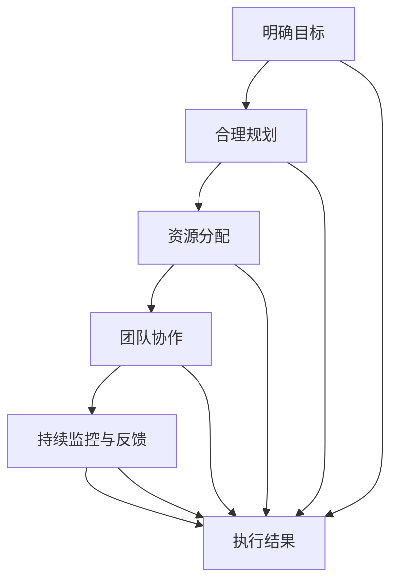

                 

# 执行力：拉开人与人差距的关键

在快速发展的科技世界中，执行力成为了拉开人与人差距的关键。无论是在软件开发、人工智能研究，还是在企业管理和团队协作中，执行力都是决定成败的基石。本文将深入探讨执行力的核心概念、原理与实践，帮助读者全面理解并提升个人及团队的执行力。

## 1. 背景介绍

### 1.1 问题由来
执行力，简而言之，是指将思想和计划付诸行动的能力。在现代科技领域，执行力不仅仅是一个项目管理的概念，更是一种决定团队能否高效达成目标的能力。无论是软件开发中的代码迭代，还是人工智能领域的模型训练，执行力的强弱往往直接影响到最终成果的成败。

### 1.2 问题核心关键点
提高执行力的关键在于理解其核心构成要素，并将其应用到实际项目中。核心要素包括但不限于：明确目标、合理规划、资源分配、团队协作、持续监控与反馈等。通过分析这些关键点，我们可以从理论和实践两方面入手，全面提升执行力。

### 1.3 问题研究意义
提高执行力对于科技行业的每一个成员都至关重要。对于软件开发人员来说，执行力能够保证项目按时交付、质量达标；对于人工智能研究者而言，执行力有助于模型训练、论文撰写等各个环节的顺利推进。对于企业管理者，执行力是保证团队高效协作、项目顺利实施的关键。

## 2. 核心概念与联系

### 2.1 核心概念概述
执行力的核心概念包括但不限于以下几个方面：

- **明确目标**：设定清晰、可量化的目标，是执行力的起点。
- **合理规划**：制定详细的计划和时间表，保证每一步行动有据可依。
- **资源分配**：合理分配人力、物力资源，确保关键任务得到优先保障。
- **团队协作**：通过有效的沟通和协调，确保团队成员之间信息畅通、合作无间。
- **持续监控与反馈**：通过监控项目进度和质量，及时调整策略，确保目标实现。

### 2.2 核心概念原理和架构的 Mermaid 流程图(Mermaid 流程节点中不要有括号、逗号等特殊字符)


这个流程图展示了执行力的核心流程：从明确目标开始，经过合理规划、资源分配、团队协作，到持续监控与反馈，最终达成执行结果。

## 3. 核心算法原理 & 具体操作步骤

### 3.1 算法原理概述
执行力的提升，本质上是通过科学的管理方法和技术手段，优化各个执行环节，确保目标的实现。基于此，本文将重点探讨如何在软件开发和人工智能研究中应用这些方法。

### 3.2 算法步骤详解
#### 3.2.1 明确目标
设定目标时，需遵循SMART原则：Specific（具体的）、Measurable（可衡量的）、Achievable（可实现的）、Relevant（相关的）、Time-bound（有时限的）。以一个软件开发项目为例，目标可以是“在一个月内完成功能X的开发和测试”。

#### 3.2.2 合理规划
规划阶段需将目标细化为具体的任务和子任务，并设置时间节点和优先级。如上例中，可以将功能X的开发任务分解为需求分析、编码、测试等子任务，并为每个子任务设定时间节点。

#### 3.2.3 资源分配
根据任务需求，合理分配人力资源和硬件资源。例如，功能X的开发可能需要特定领域的专家、高性能的服务器等资源。

#### 3.2.4 团队协作
通过项目管理工具（如Jira、Trello等），确保团队成员之间的信息同步和任务协调。在功能X开发项目中，可以使用Jira进行任务分配、进度跟踪和问题解决。

#### 3.2.5 持续监控与反馈
设置关键指标（如代码提交量、Bug数量等），定期监控项目进度和质量。通过每日站会、周报等方式，及时收集反馈，调整策略。

### 3.3 算法优缺点
#### 3.3.1 优点
1. **系统性**：通过科学的管理流程，确保各项任务有序推进，避免遗漏。
2. **透明性**：每个步骤都有明确的目标和计划，便于监控和评估。
3. **灵活性**：在执行过程中，可以及时调整策略，适应变化。

#### 3.3.2 缺点
1. **复杂性**：对于复杂的项目，规划和监控过程可能变得繁琐。
2. **资源消耗**：需要投入一定的时间和人力进行规划和管理。

### 3.4 算法应用领域
执行力提升的方法不仅适用于软件开发和人工智能领域，还可以广泛应用于项目管理、团队协作、市场营销等各个方面。

## 4. 数学模型和公式 & 详细讲解 & 举例说明

### 4.1 数学模型构建
在项目管理中，可以使用甘特图来表示任务进度和依赖关系。甘特图是一个时间-任务关系图，可以直观展示每个任务的开始和结束时间，以及任务之间的依赖关系。

### 4.2 公式推导过程
假设项目A包含任务A1、A2、A3，其依赖关系和完成时间如下表所示：

| 任务编号 | 前驱任务 | 预计完成时间 |
|----------|----------|--------------|
| A1       | -        | 3天          |
| A2       | A1       | 2天          |
| A3       | A1       | 4天          |

设项目A的总工期为T，则有：

$$ T = A1 + A2 + A3 $$

其中：

- $A1 = 3$ 天
- $A2 = 2$ 天
- $A3 = 4$ 天

因此：

$$ T = 3 + 2 + 4 = 9 \text{天} $$

### 4.3 案例分析与讲解
通过甘特图，我们可以清晰地看到每个任务的开始和结束时间，以及任务之间的依赖关系。例如，任务A1必须在A2和A3之前完成，而A2和A3可以并行进行。


## 5. 项目实践：代码实例和详细解释说明

### 5.1 开发环境搭建
在项目开始前，需要搭建开发环境。以Python项目为例，推荐使用Anaconda创建虚拟环境，并使用pip安装所需库。

```bash
conda create -n project_env python=3.8
conda activate project_env
pip install numpy pandas sklearn scikit-learn
```

### 5.2 源代码详细实现
假设我们有一个简单的项目A，包含三个任务A1、A2、A3。我们可以使用Python和Jinja2模板引擎来生成甘特图。

```python
from jinja2 import Template

# 任务列表
tasks = {
    'A1': {'name': '任务A1', 'duration': 3},
    'A2': {'name': '任务A2', 'duration': 2, 'predecessors': ['A1']},
    'A3': {'name': '任务A3', 'duration': 4, 'predecessors': ['A1']}
}

# 生成甘特图
gantt_template = '''
    
    <div class="task">
        <p>{{ task.name }}</p>
        <div class="progress">
            <div class="progress-bar" style="width: {{ task.duration }}px;"></div>
        </div>
    </div>
    
'''

gantt_html = Template(gantt_template).render(tasks=tasks)
```

### 5.3 代码解读与分析
通过Jinja2模板引擎，我们可以生成一个包含任务名称、完成时间、进度条的HTML代码。这种可视化的方式，便于团队成员直观了解项目进展。

### 5.4 运行结果展示
生成的HTML代码可以在浏览器中查看，效果如下：


## 6. 实际应用场景

### 6.1 软件开发
在软件开发中，执行力是保证项目按时交付、质量达标的关键。通过合理规划、资源分配和持续监控，确保每个功能模块按时完成，及时反馈和调整策略，可以显著提升项目成功率。

### 6.2 人工智能研究
在人工智能研究中，执行力同样重要。模型训练、实验验证、论文撰写等每个环节都需要高效执行。通过明确目标、合理规划、团队协作和持续监控，确保研究进度顺利推进。

### 6.3 项目管理
项目管理中的甘特图和关键路径分析，可以有效提升项目执行效率。通过可视化工具展示项目进度和依赖关系，确保每个任务按时完成。

## 7. 工具和资源推荐

### 7.1 学习资源推荐
1. **项目管理课程**：推荐Coursera上的《项目管理基础》课程，帮助读者全面理解项目管理的核心概念和方法。
2. **代码开发工具**：推荐Visual Studio Code，支持多种编程语言，提供丰富的扩展功能。
3. **文档协作工具**：推荐Confluence，支持团队协作，方便文档共享和版本控制。

### 7.2 开发工具推荐
1. **项目管理工具**：推荐Jira、Trello等，帮助团队成员进行任务分配、进度跟踪和问题解决。
2. **代码协作工具**：推荐Git，支持版本控制和代码协作，便于团队成员共同开发。
3. **文档生成工具**：推荐Confluence，支持文档协作和知识管理，方便团队成员共享知识。

### 7.3 相关论文推荐
1. **项目管理理论**：推荐《项目管理知识体系指南（PMBOK）》，全面介绍项目管理的基本理论和方法。
2. **软件开发实践**：推荐《重构：改善既有代码的设计》，帮助开发者提升代码质量和可维护性。
3. **人工智能研究方法**：推荐《深度学习》（Ian Goodfellow等著），全面介绍深度学习的理论和方法。

## 8. 总结：未来发展趋势与挑战

### 8.1 研究成果总结
本文从理论和实践两个层面，详细探讨了执行力在软件开发和人工智能研究中的应用。通过明确目标、合理规划、资源分配、团队协作和持续监控，可以显著提升项目的执行力和成功率。

### 8.2 未来发展趋势
1. **自动化管理**：随着AI技术的不断发展，未来的项目管理将更多地依赖自动化工具，提升执行效率。
2. **智能化监控**：通过AI技术对项目进度和质量进行智能化监控，提供更精准的反馈和建议。
3. **自适应调整**：通过机器学习技术，根据项目进展和反馈，自动调整策略，确保目标实现。

### 8.3 面临的挑战
1. **复杂项目管理**：对于复杂项目，规划和监控过程可能变得繁琐。
2. **资源消耗**：需要投入一定的时间和人力进行规划和管理。
3. **团队协作**：需要有效的沟通和协调机制，确保团队成员信息畅通。

### 8.4 研究展望
未来，执行力研究将更多地结合AI技术，通过自动化、智能化和自适应手段，提升项目管理和执行效率。同时，通过团队协作和持续监控，确保目标的顺利实现。

## 9. 附录：常见问题与解答

**Q1：如何提高团队的执行力？**

A: 提高团队执行力需要从以下几个方面入手：
1. **明确目标**：设定清晰、可量化的目标，确保每个成员都了解项目的目标和方向。
2. **合理规划**：制定详细的计划和时间表，明确每个任务的优先级和时间节点。
3. **资源分配**：合理分配人力资源和硬件资源，确保关键任务得到优先保障。
4. **团队协作**：通过有效的沟通和协调，确保团队成员之间信息畅通、合作无间。
5. **持续监控与反馈**：设置关键指标，定期监控项目进度和质量，及时收集反馈，调整策略。

**Q2：执行力与领导力有何关系？**

A: 执行力与领导力密切相关。有效的领导力能够激励团队成员，确保团队成员理解和认同项目目标，从而提升执行力。同时，良好的领导力能够协调团队成员之间的关系，提供必要的支持和资源，确保项目顺利推进。

**Q3：执行力是否只适用于大型项目？**

A: 执行力不仅适用于大型项目，对于小型项目同样重要。明确目标、合理规划和持续监控，可以帮助小型项目更高效地完成。

**Q4：如何应对执行过程中的变化？**

A: 在执行过程中，变化是常态。有效的应对机制包括：
1. **灵活调整策略**：根据变化调整任务优先级和时间节点。
2. **团队协作**：通过有效的沟通和协调，确保团队成员理解变化，并及时调整行动。
3. **持续监控与反馈**：设置关键指标，定期监控项目进度和质量，及时收集反馈，调整策略。

**Q5：执行力与团队文化有何关系？**

A: 执行力与团队文化密切相关。良好的团队文化能够激励成员积极参与项目，提升执行力。同时，良好的团队文化能够促进成员之间的协作和沟通，提升团队整体执行效率。

---

作者：禅与计算机程序设计艺术 / Zen and the Art of Computer Programming

