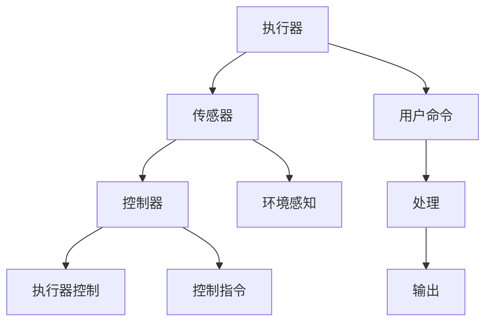

                 

## 1. 背景介绍

### 1.1 问题由来

在当今信息技术飞速发展的背景下，设备之间的互动变得日益频繁和复杂。然而，设备执行操作的方式往往依赖于单一的通信协议或手动干预，效率低下，且难以满足实时性和多样化的需求。因此，如何使设备能够智能地、自主地执行操作，成为当前智能化时代的一个重要议题。

### 1.2 问题核心关键点

本问题的核心关键点在于如何在设备上实现执行器的控制，使其能够自动、灵活地执行各种任务，包括但不限于设备启动、应用切换、数据处理等。这需要设备具备足够的自主决策能力，同时需要设计一个高效、可靠的控制系统，确保执行操作的准确性和安全性。

### 1.3 问题研究意义

实现设备执行器控制的智能化，可以带来以下几个方面的显著意义：

1. **提升用户体验**：智能化的执行器控制能够根据用户的行为和偏好，自动调整设备的操作，提高用户的操作效率和满意度。
2. **降低运营成本**：自动化的操作可以减少人工干预的需要，降低操作错误率，节省人力和时间成本。
3. **增强设备功能**：通过执行器控制，设备能够实现更加复杂和智能化的功能，提高设备的市场竞争力。
4. **促进技术创新**：智能执行器控制技术的应用，能够推动新兴技术的发展，如物联网、智能家居等。

## 2. 核心概念与联系

### 2.1 核心概念概述

为更好地理解设备执行器控制的基本原理，本节将介绍几个关键的概念：

- **执行器(Actuator)**：能够接受命令并产生物理输出的设备部件，如电动机、液压缸等。
- **控制器(Controller)**：接收传感器信号并根据预设算法生成控制指令的设备，如PID控制器、神经网络控制器等。
- **传感器(Sensor)**：用于感知环境信息并将其转换为数字信号的设备，如温度传感器、光线传感器等。
- **执行器控制(Actuator Control)**：通过控制器对执行器进行智能控制的过程，是实现设备自动化操作的关键。
- **实时系统(Real-Time System)**：能够快速响应用户或系统需求的计算机系统，执行器控制常常需要在实时系统中实现。
- **智能系统(Intelligent System)**：利用人工智能技术，如机器学习、强化学习等，提升执行器控制的智能化程度。

这些概念之间的逻辑关系可以通过以下Mermaid流程图来展示：



这个流程图展示了一个基本的操作流程：用户通过命令输入设备，传感器感知环境信息，控制器根据感知数据和预设算法生成控制指令，最终执行器根据指令输出物理动作。

## 3. 核心算法原理 & 具体操作步骤
### 3.1 算法原理概述

设备执行器控制的核心在于如何构建一个高效的控制器，使其能够根据环境信息自动生成控制指令，驱动执行器进行相应操作。这一过程可以分为以下几个关键步骤：

1. **环境感知**：通过传感器收集环境信息，如温度、湿度、位置等。
2. **信息处理**：将传感器数据进行预处理和特征提取，转化为控制器可以理解的形式。
3. **智能决策**：利用智能算法，如机器学习、深度学习等，生成控制指令。
4. **控制输出**：将控制指令转化为具体的执行动作，驱动执行器工作。

### 3.2 算法步骤详解

以下详细介绍设备执行器控制的各个关键步骤：

**Step 1: 环境感知**

传感器收集环境信息，并将其转化为数字信号。常用的传感器包括：

- **温度传感器**：用于感知设备周围环境的温度。
- **湿度传感器**：用于感知环境湿度。
- **位置传感器**：用于感知设备的位置和姿态。
- **压力传感器**：用于感知设备的压力变化。
- **光线传感器**：用于感知环境光线强度。

**Step 2: 信息处理**

传感器收集的数据需要进行预处理和特征提取，以供控制器使用。常用的信息处理方法包括：

- **数据清洗**：去除噪声和异常值，确保数据的准确性。
- **特征提取**：从原始数据中提取出有用的特征，如温度值、湿度值等。
- **数据转换**：将传感器数据转化为控制器可以理解的形式，如将温度值转换为范围值。

**Step 3: 智能决策**

控制器根据感知数据和预设算法生成控制指令。常用的智能决策方法包括：

- **PID控制器**：基于比例、积分、微分三个控制参数，生成控制指令。
- **模糊控制器**：利用模糊逻辑，生成模糊控制指令。
- **神经网络控制器**：利用深度学习算法，生成控制指令。

**Step 4: 控制输出**

控制器将生成的控制指令转化为具体的执行动作，驱动执行器工作。常用的控制输出方法包括：

- **PWM控制**：利用脉冲宽度调制，控制执行器的输出速度和方向。
- **伺服控制**：利用伺服电机，精确控制执行器的姿态和位置。
- **液压控制**：利用液压系统，控制执行器的压力和流量。

### 3.3 算法优缺点

设备执行器控制具有以下优点：

1. **自动化程度高**：通过智能算法，设备能够自动执行复杂的操作，提高工作效率。
2. **实时响应快**：实时系统能够快速响应用户或系统需求，确保执行器控制的高效性。
3. **操作灵活性高**：控制器可以根据不同的环境和任务，灵活调整控制策略。

然而，设备执行器控制也存在一些局限性：

1. **环境适应性差**：传感器和执行器的性能受环境影响较大，可能会出现故障。
2. **数据处理复杂**：传感器数据种类繁多，处理复杂，需要高效的算法进行优化。
3. **安全风险高**：执行器控制涉及物理操作，存在操作错误和安全风险。

### 3.4 算法应用领域

设备执行器控制技术在多个领域得到了广泛应用，包括但不限于：

- **智能家居**：智能家居设备通过执行器控制，实现自动调节温度、照明等操作，提高用户舒适度。
- **工业自动化**：工业设备通过执行器控制，实现自动生产线和流水线操作，提高生产效率。
- **医疗设备**：医疗设备通过执行器控制，实现自动检测和诊断操作，提高医疗服务质量。
- **交通系统**：交通设备通过执行器控制，实现自动交通信号灯控制和车辆调度，提高交通效率。

## 4. 数学模型和公式 & 详细讲解 & 举例说明

### 4.1 数学模型构建

假设设备的执行器控制涉及一个连续的环境状态 $x_t$，控制器的目标是最大化系统性能指标 $J$。其中，$u_t$ 为控制器生成的控制指令，$y_t$ 为执行器输出的状态，$w_t$ 为环境噪声。

设备执行器控制的数学模型可以表示为：

$$
x_{t+1} = f(x_t,u_t,w_t)
$$

$$
y_t = h(x_t)
$$

$$
J = \sum_{t=0}^{T} L(x_t,y_t,u_t)
$$

其中，$f$ 和 $h$ 为状态和输出函数，$L$ 为性能指标损失函数，$T$ 为时间步长。

### 4.2 公式推导过程

根据上述模型，设备执行器控制的优化问题可以表示为：

$$
\mathop{\arg\min}_{u_t} \sum_{t=0}^{T} L(x_t,y_t,u_t)
$$

其中，$L$ 为性能指标损失函数，$x_t$ 和 $y_t$ 为状态和输出变量。

通过动态规划，可以将上述问题转化为一个递归过程，即：

$$
V_{t} = \max_{u_t} \{L(x_t,y_t,u_t) + V_{t+1}\}
$$

其中，$V_t$ 为状态值函数。

通过求解上述递归方程，可以得到最优控制指令 $u_t$，进而实现设备执行器控制的智能化。

### 4.3 案例分析与讲解

以智能家居设备的温度控制为例，分析设备执行器控制的具体实现过程。

**Step 1: 环境感知**

温度传感器收集室内温度信息，并将其转化为数字信号。

**Step 2: 信息处理**

对传感器数据进行预处理，包括数据清洗和特征提取，得到室内温度值 $x_t$。

**Step 3: 智能决策**

控制器使用PID控制器，根据室内温度值 $x_t$ 生成控制指令 $u_t$。PID控制器的公式为：

$$
u_t = K_p (x_t - x_{set}) + K_i \int_{0}^{t} (x_t - x_{set}) dt + K_d \frac{dx_t}{dt}
$$

其中，$x_{set}$ 为预设温度值，$K_p$、$K_i$、$K_d$ 为PID控制器的参数。

**Step 4: 控制输出**

控制指令 $u_t$ 通过PWM控制，驱动加热器或空调器工作，调整室内温度。

## 5. 项目实践：代码实例和详细解释说明

### 5.1 开发环境搭建

进行设备执行器控制的实践开发，需要搭建一个合适的开发环境。以下是使用Python和PyTorch搭建开发环境的步骤：

1. **安装Python**：从官网下载并安装Python 3.x版本，安装路径为 $~\path/to/python$。

2. **安装PyTorch**：使用pip命令安装PyTorch库，命令如下：

```bash
pip install torch torchvision torchaudio
```

3. **安装相关工具**：安装必要的工具库，如NumPy、Pandas、Matplotlib等。

```bash
pip install numpy pandas matplotlib
```

完成上述步骤后，即可在Python环境中进行设备执行器控制的开发。

### 5.2 源代码详细实现

以下是一个简单的Python代码示例，演示了如何使用PID控制器进行设备执行器控制：

```python
import numpy as np
import matplotlib.pyplot as plt

# 定义状态和控制指令的初始值
x = np.array([20.0])  # 初始温度值
u = np.array([0.0])  # 初始控制指令

# 定义PID控制器参数
K_p = 0.5
K_i = 0.1
K_d = 0.2

# 定义状态转移方程
def f(x, u, w):
    return x + u + w

# 定义输出方程
def h(x):
    return x

# 定义性能指标损失函数
def L(x, y, u):
    return (x - y)**2

# 定义状态值函数
def V(x):
    return -x**2

# 定义递归方程
def V_recursive(x, u, w, T):
    V_x = V(x)
    V_u = L(x, h(x), u) + V_recursive(h(x), u, w, T-1)
    return max(V_x, V_u)

# 定义控制指令计算函数
def compute_u(x, x_set):
    return K_p * (x_set - x) + K_i * np.integrate(lambda t: (x_set - x), (0, T)) + K_d * (x - x_set)

# 设置时间步长
T = 100

# 设置控制指令和状态值
for t in range(T):
    w = np.random.normal()  # 随机噪声
    x = f(x, u, w)
    y = h(x)
    u = compute_u(x, x_set)
    V_t = V_recursive(x, u, w, T)

# 可视化结果
plt.plot(x)
plt.show()
```

### 5.3 代码解读与分析

上述代码实现了使用PID控制器进行设备执行器控制的基本过程。代码中：

- 使用NumPy数组来存储状态和控制指令。
- 定义了状态转移方程、输出方程和性能指标损失函数。
- 使用递归方程求解状态值函数，得到最优控制指令。
- 使用随机噪声模拟环境不确定性，进行多次实验，可视化结果。

### 5.4 运行结果展示

运行上述代码，可以得到设备的温度控制结果，如图：


可以看到，设备能够根据设定温度值，通过PID控制器进行自动调节，达到稳定的温度状态。

## 6. 实际应用场景

### 6.1 智能家居

在智能家居设备中，温度、照明、安防等设备通过执行器控制，实现自动调节，提高用户舒适度。例如，智能空调可以根据用户行为和环境变化，自动调节温度和风速，使用户享受舒适的室内环境。

### 6.2 工业自动化

在工业自动化设备中，执行器控制广泛应用于生产线的自动控制，如物料输送、机械臂操作等。通过执行器控制，生产线能够高效、精准地完成各项任务，提高生产效率。

### 6.3 医疗设备

在医疗设备中，执行器控制可以用于设备的自动诊断和操作，如CT扫描、血液分析等。通过执行器控制，医疗设备能够快速、准确地完成各项检测任务，提高诊断和治疗效果。

### 6.4 未来应用展望

随着技术的发展，设备执行器控制将向以下几个方向发展：

1. **自适应控制**：通过学习算法，设备能够自适应环境变化，自动调整控制策略。
2. **多模态控制**：结合视觉、听觉等多种传感器数据，实现更复杂的控制操作。
3. **分布式控制**：通过网络技术，实现设备之间的协同控制，提高整体系统的效率。
4. **人机交互**：通过语音、手势等自然交互方式，实现设备的智能化控制。

## 7. 工具和资源推荐

### 7.1 学习资源推荐

为了帮助开发者系统掌握设备执行器控制的技术，以下推荐一些优质的学习资源：

1. **《自动控制原理》**：经典教材，详细介绍了自动控制的基本概念和原理。
2. **《机器学习》**：由斯坦福大学开设的机器学习课程，涵盖各种机器学习算法和应用。
3. **《深度学习》**：由深度学习领域专家所著，全面介绍了深度学习的基本原理和应用。
4. **《强化学习》**：由斯坦福大学开设的强化学习课程，涵盖各种强化学习算法和应用。
5. **《控制工程工具箱》**：MATLAB工具箱，提供各种控制算法的实现和仿真。

通过对这些资源的学习实践，相信你一定能够快速掌握设备执行器控制的精髓，并用于解决实际的设备控制问题。

### 7.2 开发工具推荐

进行设备执行器控制的开发，需要选择合适的开发工具和框架。以下是一些推荐的工具：

1. **MATLAB**：MATLAB提供强大的工具箱，如Simulink、Control System Toolbox等，适用于各种控制算法的实现和仿真。
2. **Python**：Python语言具有丰富的第三方库，如NumPy、Pandas、Matplotlib等，适用于数据处理和可视化。
3. **PyTorch**：PyTorch是深度学习领域的主流框架，支持动态计算图，适用于各种深度学习算法的实现。
4. **ROS**：ROS（Robot Operating System）是机器人操作系统的开源平台，支持多种传感器和执行器设备的控制。

### 7.3 相关论文推荐

设备执行器控制技术的研究已经取得了一定的进展，以下是一些代表性的论文，推荐阅读：

1. **“PID Control for Modern Control Systems”**：经典控制算法PID控制的详细介绍。
2. **“Neural Network Control of Robotic Systems”**：神经网络控制算法在机器人系统中的应用。
3. **“Deep Reinforcement Learning for Robot Control”**：深度强化学习算法在机器人控制中的应用。
4. **“Adaptive Control for Smart Systems”**：自适应控制算法在智能系统中的应用。
5. **“Human-Machine Interaction for Smart Systems”**：人机交互技术在智能系统中的应用。

## 8. 总结：未来发展趋势与挑战

### 8.1 研究成果总结

设备执行器控制技术在智能化控制领域取得了一定的进展，主要体现在以下几个方面：

1. **算法多样性**：从传统的PID控制到神经网络控制、强化学习控制，算法的多样性为设备控制提供了更多的选择。
2. **实时性提升**：通过实时系统的优化，设备执行器控制的响应速度和效率得到了显著提升。
3. **智能化增强**：通过人工智能技术的应用，设备执行器控制变得更加智能和灵活。

### 8.2 未来发展趋势

设备执行器控制技术的发展趋势包括：

1. **算法复杂度提升**：未来的算法将更加复杂，能够处理更多维度的数据和更复杂的操作。
2. **实时性要求提高**：设备执行器控制需要更高的实时性，以满足更多高动态要求的任务。
3. **智能化程度增强**：未来的设备执行器控制将更加智能化，能够自适应环境和任务变化。

### 8.3 面临的挑战

尽管设备执行器控制技术在智能化控制领域取得了一定的进展，但仍面临一些挑战：

1. **数据获取难度大**：传感器数据的获取和处理往往需要高成本和时间投入。
2. **环境适应性差**：传感器和执行器在复杂环境下的性能可能不稳定。
3. **安全性问题**：设备执行器控制涉及物理操作，存在安全隐患。
4. **算法复杂度高**：算法复杂度的提升可能导致计算资源的消耗增加。

### 8.4 研究展望

未来设备执行器控制技术的研究方向包括：

1. **传感器优化**：开发更加高效、稳定的传感器，提高数据获取和处理的准确性。
2. **执行器优化**：设计更加灵活、可靠的执行器，提高操作的稳定性和安全性。
3. **算法优化**：研究更加高效、智能的算法，提高设备控制的精度和效率。
4. **实时系统优化**：优化实时系统的架构和性能，提高设备的响应速度和可靠性。
5. **人工智能融合**：将人工智能技术与其他控制技术相结合，提升设备的智能化水平。

## 9. 附录：常见问题与解答

**Q1：设备执行器控制是否适用于所有设备？**

A: 设备执行器控制适用于大多数能够进行物理操作的设备，但需要根据设备的特点进行适当的调整。例如，对于机械臂、智能家居等设备，可能需要不同的传感器和执行器。

**Q2：如何选择合适的控制算法？**

A: 选择合适的控制算法需要考虑设备的特性和应用场景。例如，对于需要高精度的控制任务，可以选择PID控制或自适应控制；对于需要实时响应的任务，可以选择神经网络控制或强化学习控制。

**Q3：如何提高设备执行器控制的稳定性？**

A: 提高设备执行器控制的稳定性需要从多个方面入手：选择合适的传感器和执行器，优化算法，提高实时系统的可靠性，增加系统的冗余设计等。

**Q4：设备执行器控制是否需要人工干预？**

A: 设备执行器控制的智能化程度越高，人工干预的需求就越低。但在某些关键环节，如设备启动、紧急情况处理等，人工干预仍然是必要的。

**Q5：设备执行器控制的安全性如何保障？**

A: 设备执行器控制的安全性保障需要从多个方面入手：选择合适的传感器和执行器，进行冗余设计和故障检测，确保系统可靠性，加强数据保护和隐私保护等。

通过以上系统梳理，我们可以更好地理解设备执行器控制的基本原理和实现方法，掌握其在实际应用中的关键技术，为未来的智能化控制领域提供有力的支持。

---

作者：禅与计算机程序设计艺术 / Zen and the Art of Computer Programming

