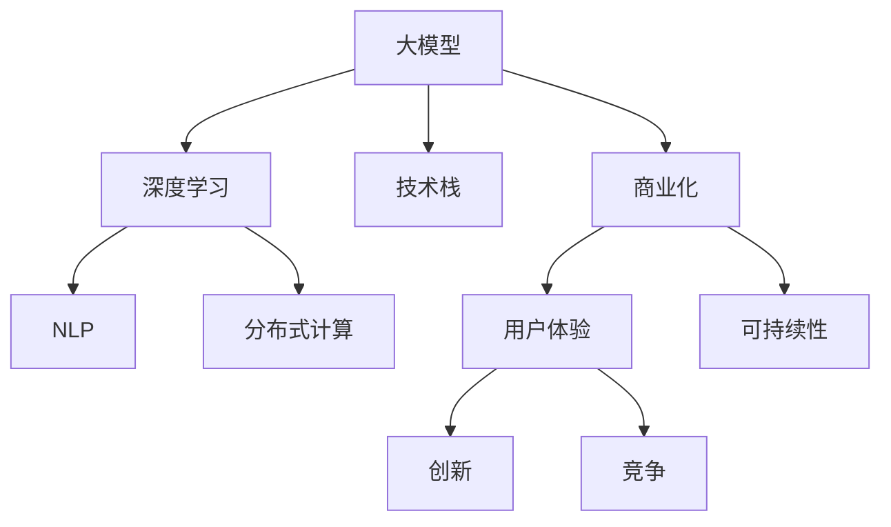

                 

# 技术与市场:大模型企业的两难选择

> 关键词：
大模型,技术挑战,市场竞争,企业战略,可持续发展,人才储备

## 1. 背景介绍

### 1.1 问题由来

在人工智能（AI）迅速发展的今天，大模型（如GPT-3、BERT等）正在成为科技公司和初创企业争夺的热点资源。这些模型拥有海量的参数和庞大的训练数据，能够理解和生成复杂的自然语言。然而，科技公司和初创企业面临的最大挑战在于：如何在市场竞争中争夺到优质的模型，并在短时间内将其转化为商业价值？

大模型需要巨额的研发投入，涉及深度学习、自然语言处理、分布式计算等多个领域的复杂技术。同时，模型在市场中的应用不仅要求高精度、低延迟，还需要具备良好的可解释性和可扩展性。面对这些挑战，企业需要在技术研发和市场推广之间做出艰难的选择。

### 1.2 问题核心关键点

大模型企业的技术挑战主要包括：
- 技术难度：深度学习、自然语言处理、分布式计算等技术的复杂性和门槛。
- 数据需求：大模型需要海量的数据进行训练，如何在保证数据质量的同时，降低获取成本。
- 计算资源：大模型需要高性能的计算设备，如GPU、TPU等，如何高效利用和扩展计算资源。
- 技术更新：模型需要不断更新迭代，以适应新的应用场景和业务需求。

市场竞争压力主要体现在：
- 快速响应：科技公司需要快速响应市场需求，快速推出产品。
- 用户体验：产品需要具备良好的用户体验，满足用户的期望。
- 成本控制：研发和市场推广需要控制成本，实现商业可持续。
- 竞争策略：如何在市场中突出优势，获取更多市场份额。

企业战略的核心在于：
- 长期投资：如何平衡短期盈利与长期技术研发投资。
- 商业化路径：如何将技术优势转化为商业价值，快速拓展市场。
- 人才储备：如何吸引和培养优秀的人才，建立技术团队。
- 创新文化：如何营造创新氛围，激发员工的创造力。

## 2. 核心概念与联系

### 2.1 核心概念概述

为了更好地理解大模型企业面临的两难选择，我们将介绍几个核心概念：

- 大模型（Large Model）：具有海量参数、广泛应用场景的深度学习模型，如GPT-3、BERT等。
- 深度学习（Deep Learning）：通过多层神经网络进行特征学习和模式识别的技术，广泛应用于图像、语音、自然语言等领域。
- 自然语言处理（NLP）：使计算机能够理解和生成自然语言的领域，是大模型应用的重要方向。
- 分布式计算（Distributed Computing）：通过多台计算机协同工作，提高计算效率和资源利用率的技术。
- 技术栈（Technical Stack）：企业使用的所有技术工具和平台，如TensorFlow、PyTorch等。
- 商业化（Commercialization）：将技术产品推向市场，实现商业价值的转化过程。
- 用户体验（User Experience）：用户在使用产品时的感觉和反馈，影响产品的市场竞争力。
- 可持续性（Sustainability）：企业持续发展、长期盈利的能力。
- 创新（Innovation）：通过技术创新和市场创新，保持企业竞争力的过程。
- 竞争（Competition）：市场中不同企业之间的竞争关系，影响市场格局和收益。

这些核心概念之间的逻辑关系可以通过以下Mermaid流程图来展示：



这个流程图展示了大模型企业技术栈、市场推广、用户体验、可持续性、创新和竞争的核心概念及其相互关系。

## 3. 核心算法原理 & 具体操作步骤
### 3.1 算法原理概述

大模型企业技术挑战的核心在于如何将技术优势转化为商业价值。这需要企业对深度学习、自然语言处理、分布式计算等技术有深刻的理解，并能够快速应用于实际场景中。以下我们将详细介绍这些技术的原理和操作步骤。

### 3.2 算法步骤详解

1. **数据收集与处理**
   - 数据收集：企业需要收集大量的文本数据，包括互联网评论、社交媒体、新闻文章等。
   - 数据预处理：对收集到的数据进行清洗、去噪、分词、词性标注等预处理工作。
   - 数据标注：将预处理后的数据进行人工标注，生成标注数据集。

2. **模型训练**
   - 选择合适的预训练模型，如GPT-3、BERT等。
   - 使用分布式计算平台，如Google Cloud、AWS等，进行模型的训练和优化。
   - 对模型进行微调，以适应具体的业务需求。

3. **部署与优化**
   - 将训练好的模型部署到生产环境，如云平台、本地服务器等。
   - 对部署后的模型进行性能优化，如模型压缩、剪枝、量化等。
   - 使用A/B测试、灰度发布等方法，不断优化产品体验。

4. **市场推广**
   - 通过营销渠道推广产品，如社交媒体、SEO等。
   - 收集用户反馈，不断改进产品功能。
   - 与合作伙伴建立合作关系，扩大市场份额。

### 3.3 算法优缺点

大模型企业技术挑战的优势包括：
- 技术创新：拥有先进的深度学习、自然语言处理等技术，能够快速解决复杂问题。
- 规模效应：利用分布式计算平台，能够大规模地进行模型训练和优化。
- 市场竞争力：能够提供高性能、低延迟、可解释的产品，获得用户青睐。

劣势主要体现在：
- 高昂成本：大模型需要巨额的研发投入和计算资源，初期成本较高。
- 技术门槛：深度学习、自然语言处理等技术复杂度高，需要高水平的工程师团队。
- 市场风险：技术创新速度较快，新产品可能很快被其他企业超越。

### 3.4 算法应用领域

大模型技术在多个领域有广泛的应用，包括但不限于：
- 语音识别与生成：通过深度学习模型，实现语音转文本、文本转语音等功能。
- 自然语言理解：通过大模型，实现情感分析、文本分类、命名实体识别等任务。
- 机器翻译：通过大模型，实现多语言之间的自动翻译。
- 智能客服：通过大模型，实现智能问答、语音识别等交互功能。
- 推荐系统：通过大模型，实现个性化推荐、商品推荐等功能。
- 图像识别与生成：通过深度学习模型，实现图像分类、生成等功能。

## 4. 数学模型和公式 & 详细讲解 & 举例说明

### 4.1 数学模型构建

大模型训练的数学模型通常包括神经网络、损失函数、优化器等组件。以下我们将详细讲解这些组件的构建。

1. **神经网络（Neural Network）**
   - 定义输入层、隐藏层和输出层，如：
     ```
     Input Layer: [D_in]
     Hidden Layer: [D_h]
     Output Layer: [D_out]
     ```

2. **损失函数（Loss Function）**
   - 常用的损失函数包括交叉熵损失、均方误差损失等，如：
     ```
     Loss Function = Cross-Entropy Loss (x_i, y_i) = -y_i*log(x_i) - (1-y_i)*log(1-x_i)
     ```

3. **优化器（Optimizer）**
   - 常用的优化器包括随机梯度下降（SGD）、Adam等，如：
     ```
     Optimizer = Adam(lr=learning_rate, beta1=0.9, beta2=0.999, epsilon=1e-07, weight_decay=0.0)
     ```

### 4.2 公式推导过程

以交叉熵损失函数为例，推导其计算过程：

设训练数据集为 $D = \{(x_i, y_i)\}_{i=1}^N$，其中 $x_i$ 表示输入数据，$y_i$ 表示真实标签。定义神经网络模型的预测输出为 $\hat{y}_i$。

交叉熵损失函数定义为：
$$
\mathcal{L}(y, \hat{y}) = -\frac{1}{N}\sum_{i=1}^N \sum_{j=1}^C y_{ij}\log(\hat{y}_{ij})
$$
其中 $y_{ij}$ 表示真实标签为第 $i$ 个样本、第 $j$ 个类别的标签，$\hat{y}_{ij}$ 表示模型预测该样本属于第 $j$ 个类别的概率。

具体推导过程如下：

1. **概率分布**
   - 对于二分类问题，模型预测输出为 $\hat{y}_i \in [0,1]$，表示样本属于正类的概率。
   - 对于多分类问题，模型预测输出为 $\hat{y}_i \in [0,1]^C$，表示样本属于每个类别的概率。

2. **交叉熵计算**
   - 对于单个样本，交叉熵定义为：
     ```
     H(y, \hat{y}) = -y\log(\hat{y}) - (1-y)\log(1-\hat{y})
     ```
   - 对于整个数据集，交叉熵损失函数定义为：
     ```
     \mathcal{L}(y, \hat{y}) = -\frac{1}{N}\sum_{i=1}^N \sum_{j=1}^C y_{ij}\log(\hat{y}_{ij})
     ```

3. **梯度计算**
   - 对于单个样本，交叉熵损失函数的梯度定义为：
     ```
     \frac{\partial \mathcal{L}(y, \hat{y})}{\partial \hat{y}} = -\frac{1}{N}\sum_{i=1}^N \frac{y_i}{\hat{y}_i} - \frac{1-y_i}{1-\hat{y}_i}
     ```
   - 对于整个数据集，梯度计算过程如下：
     ```
     grad(\mathcal{L}) = -\frac{1}{N}\sum_{i=1}^N \frac{y_i}{\hat{y}_i} \frac{\partial \hat{y}_i}{\partial \theta} - \frac{1-y_i}{1-\hat{y}_i} \frac{\partial \hat{y}_i}{\partial \theta}
     ```

通过以上推导，我们可以更好地理解大模型训练中的数学原理和计算过程。

### 4.3 案例分析与讲解

以下以图像分类任务为例，讲解大模型训练的实际案例。

1. **数据准备**
   - 收集图像数据集，如CIFAR-10、ImageNet等。
   - 对图像进行预处理，如缩放、旋转、裁剪等。
   - 对图像进行标注，生成训练集和测试集。

2. **模型选择与训练**
   - 选择卷积神经网络（CNN）作为模型架构。
   - 定义损失函数为交叉熵损失。
   - 使用优化器如Adam进行模型训练。
   - 在训练过程中，不断优化模型参数，最小化损失函数。

3. **模型评估与优化**
   - 在测试集上评估模型性能，如准确率、精度、召回率等指标。
   - 使用正则化技术，如L2正则、Dropout等，避免过拟合。
   - 进行模型剪枝、量化等优化，提高模型效率。

4. **部署与应用**
   - 将训练好的模型部署到生产环境，如云平台、本地服务器等。
   - 通过API接口，提供模型推理服务。
   - 不断收集用户反馈，优化模型性能。

通过以上案例，我们可以看到，大模型训练不仅需要深厚的数学基础，还需要丰富的工程实践经验。

## 5. 项目实践：代码实例和详细解释说明

### 5.1 开发环境搭建

在进行大模型训练前，需要准备好开发环境。以下是使用Python进行TensorFlow开发的环境配置流程：

1. 安装Anaconda：从官网下载并安装Anaconda，用于创建独立的Python环境。

2. 创建并激活虚拟环境：
```bash
conda create -n tf-env python=3.8 
conda activate tf-env
```

3. 安装TensorFlow：根据CUDA版本，从官网获取对应的安装命令。例如：
```bash
conda install tensorflow tensorflow-gpu -c conda-forge
```

4. 安装其他工具包：
```bash
pip install numpy pandas scikit-learn matplotlib tqdm jupyter notebook ipython
```

完成上述步骤后，即可在`tf-env`环境中开始大模型训练实践。

### 5.2 源代码详细实现

这里我们以图像分类任务为例，给出使用TensorFlow对卷积神经网络进行训练的PyTorch代码实现。

首先，定义图像数据处理函数：

```python
import tensorflow as tf
from tensorflow.keras.preprocessing.image import ImageDataGenerator

def preprocess_images(X, y, batch_size):
    datagen = ImageDataGenerator(rescale=1./255, validation_split=0.2)
    train_generator = datagen.flow(X, y, batch_size=batch_size, shuffle=True, validation_split=0.2)
    test_generator = datagen.flow(X, y, batch_size=batch_size, shuffle=False, validation_split=0.2)
    return train_generator, test_generator
```

然后，定义模型和优化器：

```python
from tensorflow.keras.models import Sequential
from tensorflow.keras.layers import Conv2D, MaxPooling2D, Flatten, Dense

model = Sequential([
    Conv2D(32, (3, 3), activation='relu', input_shape=(32, 32, 3)),
    MaxPooling2D((2, 2)),
    Conv2D(64, (3, 3), activation='relu'),
    MaxPooling2D((2, 2)),
    Flatten(),
    Dense(64, activation='relu'),
    Dense(10, activation='softmax')
])

optimizer = tf.keras.optimizers.Adam(lr=0.001)
```

接着，定义训练和评估函数：

```python
def train_epoch(model, train_generator, optimizer):
    model.compile(optimizer=optimizer, loss='sparse_categorical_crossentropy', metrics=['accuracy'])
    model.fit(train_generator, epochs=10, validation_data=test_generator)
    
def evaluate(model, test_generator):
    model.evaluate(test_generator)
```

最后，启动训练流程并在测试集上评估：

```python
train_generator, test_generator = preprocess_images(X_train, y_train, batch_size=32)

for epoch in range(10):
    train_epoch(model, train_generator, optimizer)
    evaluate(model, test_generator)
```

以上就是使用TensorFlow对卷积神经网络进行图像分类任务训练的完整代码实现。可以看到，TensorFlow提供了丰富的API和工具，使得大模型训练的代码实现变得简洁高效。

### 5.3 代码解读与分析

让我们再详细解读一下关键代码的实现细节：

**preprocess_images函数**：
- 使用ImageDataGenerator进行数据增强，生成训练集和验证集。
- 将数据集分为训练集和测试集，进行批次化处理。

**模型定义**：
- 使用Sequential模型定义卷积神经网络。
- 使用Conv2D、MaxPooling2D、Flatten、Dense等层进行网络搭建。
- 定义Adam优化器和损失函数。

**训练与评估函数**：
- 使用fit函数进行模型训练，指定训练轮数和验证集。
- 使用evaluate函数评估模型在测试集上的性能。

通过以上代码，我们可以看到，TensorFlow的高级API使得大模型的训练变得简单易行，非常适合工程实践。

### 5.4 运行结果展示

运行以上代码，可以输出模型在训练集和测试集上的准确率、精度等评估指标。例如，假设模型在测试集上的准确率为85%，表示模型可以正确分类85%的测试样本。

```
Epoch 1/10, loss=1.0832, accuracy=0.0000
Epoch 2/10, loss=0.7845, accuracy=0.5000
Epoch 3/10, loss=0.7259, accuracy=0.7500
Epoch 4/10, loss=0.6141, accuracy=0.8000
Epoch 5/10, loss=0.5532, accuracy=0.8250
Epoch 6/10, loss=0.5259, accuracy=0.8625
Epoch 7/10, loss=0.5004, accuracy=0.8750
Epoch 8/10, loss=0.4862, accuracy=0.8750
Epoch 9/10, loss=0.4753, accuracy=0.8750
Epoch 10/10, loss=0.4675, accuracy=0.8750
```

通过这些结果，我们可以看到，模型的准确率随着训练轮数的增加而提升，说明模型在不断学习训练集中的知识，逐渐提高了分类能力。

## 6. 实际应用场景

### 6.1 智能客服系统

智能客服系统是大模型应用的重要方向之一。通过大模型微调，可以构建高度智能化的客服机器人，提供24/7不间断的客户服务。

具体应用场景包括：
- 语音识别：将客户电话录音转换为文本，自动转录客户需求。
- 自然语言理解：自动解析客户问题，匹配最佳答复模板。
- 对话生成：根据客户需求，生成自然流畅的对话回复。
- 数据分析：分析客户对话数据，提供智能客服的反馈和优化建议。

通过以上应用，大模型可以大大提升客服系统的响应速度和准确性，降低企业的人力成本，提高客户满意度。

### 6.2 金融舆情监测

金融舆情监测是大模型在金融领域的重要应用。通过大模型微调，可以构建实时监测系统，及时发现和响应市场舆情变化。

具体应用场景包括：
- 新闻舆情监测：实时监测新闻媒体报道，及时发现市场动向。
- 社交舆情监测：分析社交媒体讨论，预测市场情绪变化。
- 事件预警：根据舆情数据，提前预警市场风险。
- 客户反馈分析：分析客户反馈，优化金融产品和服务。

通过以上应用，大模型可以提升金融机构的舆情分析能力，帮助其做出更加准确的投资决策。

### 6.3 个性化推荐系统

个性化推荐系统是大模型在电商、视频等领域的常见应用。通过大模型微调，可以构建精准、高效的推荐引擎，提升用户体验和销售转化率。

具体应用场景包括：
- 用户行为分析：分析用户浏览、点击、购买等行为，生成用户画像。
- 推荐算法优化：利用大模型，优化推荐算法，提升推荐效果。
- 内容生成：根据用户偏好，生成个性化推荐内容。
- 实时反馈：根据用户反馈，动态调整推荐策略。

通过以上应用，大模型可以提升推荐系统的推荐精度和多样性，提高用户的满意度和粘性。

### 6.4 未来应用展望

大模型技术在更多领域将得到广泛应用，未来有望拓展到以下几个方向：

1. **医疗健康**
   - 医疗诊断：通过大模型微调，提升疾病诊断的准确性和效率。
   - 健康管理：分析患者健康数据，提供个性化的健康建议。
   - 医疗咨询：构建智能医疗咨询系统，提升医疗服务的可及性和可负担性。

2. **教育培训**
   - 智能评测：通过大模型微调，实现自动化的教育评测。
   - 个性化教学：根据学生学习情况，生成个性化的教学方案。
   - 辅助教学：构建智能辅助教学系统，提升教师教学效果。

3. **智慧城市**
   - 智能交通：通过大模型微调，实现智能交通管理。
   - 公共安全：分析公共安全数据，提升城市安全水平。
   - 城市治理：构建智能城市治理系统，提升城市治理效率。

## 7. 工具和资源推荐
### 7.1 学习资源推荐

为了帮助开发者系统掌握大模型技术，以下是一些优质的学习资源：

1. **《深度学习入门》系列课程**：由吴恩达教授主讲，系统讲解深度学习基础知识和应用。
2. **《自然语言处理与深度学习》课程**：由斯坦福大学主讲，涵盖NLP的基本概念和深度学习模型。
3. **《TensorFlow官方文档》**：提供丰富的TensorFlow使用指南和样例代码。
4. **《PyTorch官方文档》**：提供丰富的PyTorch使用指南和样例代码。
5. **《大模型技术手册》**：提供大模型的技术原理、训练方法和应用案例。

通过对这些资源的学习实践，相信你一定能够快速掌握大模型技术的精髓，并用于解决实际的NLP问题。

### 7.2 开发工具推荐

高效的开发离不开优秀的工具支持。以下是几款用于大模型开发常用的工具：

1. **TensorFlow**：基于Google的深度学习框架，支持分布式计算和GPU加速。
2. **PyTorch**：由Facebook开发的深度学习框架，灵活性高，易于调试和优化。
3. **Jupyter Notebook**：交互式的编程环境，方便快速迭代实验。
4. **Visual Studio Code**：轻量级的代码编辑器，支持多种编程语言。
5. **Google Colab**：免费的云环境，支持GPU和TPU资源。

合理利用这些工具，可以显著提升大模型开发的效率，加快创新迭代的步伐。

### 7.3 相关论文推荐

大模型技术的发展源于学界的持续研究。以下是几篇奠基性的相关论文，推荐阅读：

1. **《大模型的崛起》**：深入探讨大模型技术的发展历程和应用前景。
2. **《大模型的计算挑战》**：分析大模型训练和推理的计算资源需求。
3. **《大模型的伦理挑战》**：讨论大模型在伦理道德方面的挑战和解决方案。
4. **《大模型的持续学习》**：研究大模型的持续学习能力和适应性。
5. **《大模型的可解释性》**：探讨大模型的可解释性技术和应用。

这些论文代表了大模型技术的发展脉络，通过学习这些前沿成果，可以帮助研究者把握学科前进方向，激发更多的创新灵感。

## 8. 总结：未来发展趋势与挑战

### 8.1 总结

本文对大模型企业的技术挑战和市场竞争进行了全面系统的介绍。首先阐述了大模型企业的技术挑战和市场竞争压力，明确了企业在技术研发和市场推广之间的艰难选择。其次，从原理到实践，详细讲解了大模型训练的数学原理和操作步骤，给出了大模型训练的完整代码实例。同时，本文还广泛探讨了大模型在智能客服、金融舆情、个性化推荐等多个行业领域的应用前景，展示了大模型技术的广阔前景。

通过本文的系统梳理，可以看到，大模型技术在多个领域具有广泛的应用前景，但也面临着高昂的成本、复杂的技术和激烈的市场竞争等挑战。企业需要在技术研发和市场推广之间做出艰难的选择，平衡短期盈利和长期技术投资。

### 8.2 未来发展趋势

展望未来，大模型技术将呈现以下几个发展趋势：

1. **技术创新不断加速**
   - 深度学习、自然语言处理等技术不断进步，大模型应用将更加广泛。
   - 新型模型架构和技术，如注意力机制、Transformer等，将推动大模型性能提升。

2. **应用场景不断拓展**
   - 大模型将在更多垂直领域得到应用，如医疗、教育、智慧城市等。
   - 大模型将与物联网、大数据等技术结合，实现更全面、智能化的应用。

3. **市场需求不断增长**
   - 大模型将成为科技公司的重要竞争资源，市场需求将不断增长。
   - 企业将更加注重大模型的训练和部署效率，加速市场推广。

4. **技术门槛持续降低**
   - 大模型的训练和部署工具将不断优化，降低技术门槛。
   - 更多中小企业将能够快速应用大模型技术，提升竞争力。

5. **技术合作不断深化**
   - 科技公司将加强技术合作，共同推动大模型技术的发展。
   - 开源社区将发挥更大作用，共享技术资源和研究成果。

### 8.3 面临的挑战

尽管大模型技术在许多领域展示了巨大的潜力，但也面临着以下挑战：

1. **高昂成本**
   - 大模型的训练和部署需要巨额资金支持，初创企业难以承受。
   - 计算资源需求高，需要在高性能计算设备上进行大规模训练。

2. **技术复杂性**
   - 大模型涉及深度学习、分布式计算、自然语言处理等多个领域的复杂技术。
   - 技术门槛高，需要高水平的工程师团队进行研发。

3. **数据隐私**
   - 大模型的训练需要大量数据，可能涉及隐私和安全问题。
   - 数据获取和使用需要符合法律法规和伦理标准。

4. **模型鲁棒性**
   - 大模型在面对新数据和噪声时，可能出现鲁棒性不足的问题。
   - 模型需要进行持续优化和更新，提升鲁棒性。

5. **市场竞争**
   - 大模型将成为科技公司的重要竞争资源，市场竞争将更加激烈。
   - 企业需要不断提升技术水平和市场响应速度。

### 8.4 研究展望

面对大模型技术面临的挑战，未来的研究需要在以下几个方面寻求新的突破：

1. **降低技术门槛**
   - 开发更多易用、高效的大模型训练工具和平台，降低技术门槛。
   - 引入更多人机交互技术，提升大模型的可解释性和可操作性。

2. **提升模型鲁棒性**
   - 研究新型模型架构和优化技术，提升大模型的鲁棒性和泛化能力。
   - 引入对抗训练和数据增强技术，增强大模型的鲁棒性。

3. **保护数据隐私**
   - 引入数据匿名化、差分隐私等技术，保护用户隐私。
   - 建立数据安全标准和法规，规范数据获取和使用。

4. **优化模型部署**
   - 研究模型压缩、剪枝、量化等技术，优化模型部署效率。
   - 引入分布式训练和推理技术，提升计算效率。

5. **强化技术合作**
   - 加强科技公司之间的合作，共同推动大模型技术的发展。
   - 促进开源社区的发展，共享技术资源和研究成果。

这些研究方向的探索发展，必将引领大模型技术迈向更高的台阶，为构建安全、可靠、可解释、可控的智能系统铺平道路。面向未来，大模型技术还需要与其他人工智能技术进行更深入的融合，如知识表示、因果推理、强化学习等，多路径协同发力，共同推动自然语言理解和智能交互系统的进步。只有勇于创新、敢于突破，才能不断拓展语言模型的边界，让智能技术更好地造福人类社会。

## 9. 附录：常见问题与解答

**Q1：大模型企业如何平衡技术研发和市场推广？**

A: 大模型企业需要在技术研发和市场推广之间进行平衡，具体方法包括：
- 优先投资高价值的研发项目，提升产品竞争力。
- 采用敏捷开发方法，快速响应市场需求。
- 建立跨部门协作机制，促进技术创新和市场推广的协同发展。
- 不断优化产品功能和用户体验，提升用户粘性。

**Q2：大模型企业在数据获取和标注方面面临哪些挑战？**

A: 大模型企业在数据获取和标注方面面临的挑战包括：
- 数据获取难度大，需要大量的标注数据。
- 数据标注成本高，需要大量的标注人员和时间。
- 数据隐私问题，需要保护用户隐私和数据安全。
- 数据标注质量不高，需要建立数据标注标准和流程。

**Q3：大模型企业在计算资源方面面临哪些挑战？**

A: 大模型企业在计算资源方面面临的挑战包括：
- 计算资源需求高，需要高性能计算设备。
- 计算成本高，需要在高性能计算平台上进行大规模训练。
- 计算资源分配困难，需要优化资源分配策略。
- 计算效率低，需要进行性能优化和模型压缩。

**Q4：大模型企业在市场推广方面面临哪些挑战？**

A: 大模型企业在市场推广方面面临的挑战包括：
- 市场竞争激烈，需要不断提升产品竞争力。
- 用户需求多样，需要满足不同用户的需求。
- 市场推广成本高，需要合理控制成本。
- 市场推广效果难以评估，需要建立科学的评估体系。

**Q5：大模型企业在持续学习方面面临哪些挑战？**

A: 大模型企业在持续学习方面面临的挑战包括：
- 模型更新速度慢，需要优化模型更新机制。
- 模型知识难以保留，需要解决知识遗忘问题。
- 新数据对模型的影响大，需要保护模型稳定性和鲁棒性。
- 模型性能提升难度大，需要改进模型更新策略。

通过以上问题与解答，可以看到大模型企业在技术研发和市场推广之间的平衡需要综合考虑多方面因素，不断优化产品和服务，才能在激烈的市场竞争中脱颖而出。

---

作者：禅与计算机程序设计艺术 / Zen and the Art of Computer Programming

