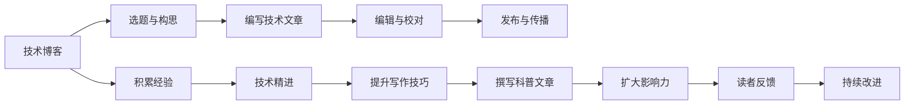

                 

# 技术写作：从技术博客到畅销科普作家之路

## 1. 背景介绍

### 1.1 问题由来
在这个信息爆炸的时代，技术写作正面临着前所未有的挑战与机遇。互联网的高速发展让信息的传播速度大大加快，人们对于技术的理解和掌握需求也随之增长。这其中，技术博客和科普文章作为技术与大众之间的桥梁，承担着将复杂技术概念简明扼要地介绍给非专业人士的重要任务。

如何使技术写作更具吸引力，如何让技术文章在众多信息中脱颖而出，如何让读者对复杂技术产生兴趣并乐于深入了解，是每个技术作者都需要面对的问题。本文将从技术写作的本质出发，深入探讨如何将技术博客转化为受欢迎的畅销科普文章。

## 2. 核心概念与联系

### 2.1 核心概念概述

在探讨技术写作之前，我们首先需要明确几个核心概念：

- **技术博客（Technical Blogging）**：利用博客形式，将技术知识、开发心得、项目经验等内容以文字形式发布在互联网上，供他人阅读和学习。
- **科普文章（Science Popularization Articles）**：以浅显易懂的语言，向非技术背景的读者介绍复杂技术或科学概念，旨在普及科学知识，激发兴趣和思考。
- **技术写作（Technical Writing）**：涵盖了技术博客、技术文档、用户手册、产品文档等所有与技术相关的文字创作，目标是让技术知识更易读、易理解。
- **内容创作（Content Creation）**：包括选题、构思、写作、编辑、排版、发布等一系列创作过程，旨在提供有价值的信息，满足读者的需求。

这些概念紧密相连，技术博客是科普文章的基础，科普文章则是技术写作的高级形态。通过技术博客，作者积累经验，培养写作技巧；通过科普文章，作者突破技术壁垒，传播知识，达到更广泛的影响。

### 2.2 核心概念原理和架构的 Mermaid 流程图



该流程图展示了技术写作从博客开始，到科普文章结束的全过程。

## 3. 核心算法原理 & 具体操作步骤

### 3.1 算法原理概述

技术写作的核心在于如何有效地将复杂的技术概念和信息传达给读者。其基本原理包括：

- **简化复杂概念**：将复杂的技术或科学概念分解为多个简单、易于理解的部分，通过比喻、类比、例子等手段使读者易于接受。
- **逻辑清晰的结构**：文章需有清晰的开头、中间、结尾，各部分之间应有逻辑关联，使得读者能够顺着文章的脉络理解全貌。
- **语言生动有趣**：使用生动有趣的语言，使文章既有技术性又具吸引力，避免枯燥乏味。

### 3.2 算法步骤详解

以下是技术写作的具体操作步骤：

#### 3.2.1 选题与构思

1. **确定目标受众**：明确文章将面向的读者群体，了解他们的知识背景、兴趣点和需求。
2. **选题定位**：选择受众感兴趣的、有价值的技术话题，避开过于深奥或过于基础的内容。
3. **构思框架**：列出文章的主要部分和子部分，决定每一部分的详细程度。

#### 3.2.2 编写技术文章

1. **开头部分**：简要介绍背景和目的，引起读者兴趣。
2. **主体部分**：按照既定的框架，逐步展开技术细节，每部分前可适当加入小标题和副标题。
3. **结尾部分**：总结全文，提出建议或进一步阅读的资源。

#### 3.2.3 编辑与校对

1. **逻辑检查**：确保每部分之间逻辑连贯，结构清晰。
2. **语法和拼写校对**：仔细检查错误，确保文章质量。
3. **读者反馈**：在发布前收集读者反馈，及时调整内容。

#### 3.2.4 发布与传播

1. **选择发布平台**：根据受众特点选择合适的博客或社交平台。
2. **优化SEO**：使用关键词优化，提升文章在搜索引擎中的排名。
3. **促进传播**：通过社交媒体、邮件列表等方式，扩大文章的覆盖范围。

### 3.3 算法优缺点

技术写作的优势在于其专业性和系统性，能提供深入的技术分析，但缺点也在于其抽象性和不易理解性。技术写作需要专业背景，否则很难深入浅出地表达技术概念。

### 3.4 算法应用领域

技术写作在多个领域都有广泛应用，包括但不限于：

- 软件开发与工程
- 数据科学与人工智能
- 网络安全
- 系统架构与设计
- 科学研究和实验

## 4. 数学模型和公式 & 详细讲解 & 举例说明

### 4.1 数学模型构建

技术写作的模型构建涉及内容的逻辑组织和信息的层次结构。以下是一个简化的模型框架：

1. **背景介绍**：设定上下文，引导读者进入主题。
2. **核心内容**：详细描述技术细节，采用树状结构划分章节。
3. **实例演示**：通过具体案例，展示理论应用。
4. **总结与展望**：归纳文章要点，提出未来方向。

### 4.2 公式推导过程

以机器学习为例，基本的数学模型可以表示为：

$$
y = f(x;\theta)
$$

其中 $x$ 为输入特征，$\theta$ 为模型参数，$f$ 为映射函数。

### 4.3 案例分析与讲解

以线性回归为例，公式推导如下：

假设数据集为 $(x_1, y_1), (x_2, y_2), ..., (x_n, y_n)$，目标是找到一个函数 $y = f(x)$，使得预测值 $y'$ 尽可能接近真实值 $y$。假设 $y = \theta_0 + \theta_1 x$，则有：

$$
\hat{\theta} = \arg\min_{\theta} \frac{1}{n}\sum_{i=1}^n(y_i - \theta_0 - \theta_1x_i)^2
$$

最小二乘法的公式推导和应用展示了技术写作的逻辑和推理过程。

## 5. 项目实践：代码实例和详细解释说明

### 5.1 开发环境搭建

1. **编程环境安装**：选择合适的编程环境（如Python），确保必要的软件包（如Jupyter Notebook、Markdown编辑器）安装。
2. **版本控制配置**：配置Git等版本控制系统，记录代码修改历史。
3. **文档管理工具**：使用ReadTheDocs、GitHub Pages等工具，管理和发布技术文章。

### 5.2 源代码详细实现

以下是一个简单的Python代码示例，用于实现线性回归模型：

```python
import numpy as np

# 定义线性回归模型
class LinearRegression:
    def __init__(self, learning_rate=0.01, n_iterations=1000):
        self.learning_rate = learning_rate
        self.n_iterations = n_iterations
        self.weights = None
        self.bias = None
    
    def fit(self, X, y):
        n_samples, n_features = X.shape
        self.weights = np.zeros(n_features)
        self.bias = 0
        
        for _ in range(self.n_iterations):
            y_pred = np.dot(X, self.weights) + self.bias
            dw = (1/n_samples) * np.dot(X.T, (y_pred - y))
            db = (1/n_samples) * np.sum(y_pred - y)
            self.weights -= self.learning_rate * dw
            self.bias -= self.learning_rate * db
    
    def predict(self, X):
        return np.dot(X, self.weights) + self.bias
```

### 5.3 代码解读与分析

代码中定义了一个`LinearRegression`类，用于实现基本的线性回归模型。其中，`fit`方法用于训练模型，`predict`方法用于预测新数据。

- **学习率（learning_rate）**：控制每次参数更新的幅度。
- **迭代次数（n_iterations）**：控制训练的轮数。
- **权重（weights）**：模型参数，初始化为零。
- **偏置（bias）**：模型偏置，初始化为零。

## 6. 实际应用场景

### 6.1 软件开发与工程

技术博客和科普文章可以用于介绍软件开发生命周期、架构设计、开发工具等，帮助开发者理解和学习先进技术。例如，介绍如何使用Docker进行容器化部署，如何使用Kubernetes进行容器编排，如何利用TensorFlow构建机器学习模型等。

### 6.2 数据科学与人工智能

在数据科学和人工智能领域，技术写作可以介绍数据分析流程、模型训练技巧、机器学习算法等内容。例如，介绍如何使用Pandas进行数据清洗和处理，如何使用Scikit-learn进行分类和回归分析，如何使用TensorFlow构建深度神经网络等。

### 6.3 网络安全

技术写作可以解释网络安全的基本原理、攻击手段和防护措施，帮助读者理解网络安全的重要性和如何保护个人隐私。例如，介绍常见的网络攻击（如DDoS攻击、SQL注入攻击）及其防护方法，介绍如何安全配置网络设备和应用，如何加密存储敏感数据等。

### 6.4 未来应用展望

未来，技术写作将更多地与新兴技术相结合，普及更加前沿和深奥的知识。例如，介绍区块链技术、人工智能伦理、量子计算等，使更多人了解和参与到技术发展中来。

## 7. 工具和资源推荐

### 7.1 学习资源推荐

1. **《技术写作之道》（On Writing Well）**：这本书介绍了技术写作的基本原则和技巧，是技术写作领域的经典之作。
2. **《如何阅读一本书》（How to Read a Book）**：帮助读者提升阅读和理解技术文章的能力。
3. **Coursera技术写作课程**：提供系统化的技术写作教学，适合初学者和进阶者。
4. **Google开发者文档**：包含大量技术文章和教程，是学习技术写作的好资源。
5. **Stack Overflow技术问答社区**：通过提问和回答，积累技术写作经验。

### 7.2 开发工具推荐

1. **Jupyter Notebook**：支持代码和文本混合编写，是技术写作和数据科学常用的工具。
2. **Markdown编辑器**：如GitHub、StackEdit等，方便编写和格式化技术文章。
3. **版本控制系统**：如Git、SVN，记录代码修改历史。
4. **文档管理工具**：如ReadTheDocs、GitHub Pages，管理和发布技术文章。
5. **代码编辑器**：如Visual Studio Code、Sublime Text，提高编程效率。

### 7.3 相关论文推荐

1. **"Technical Writing as a Creative Process" by C. K. Hirshleifer**：探讨技术写作的创意过程，对技术写作有深入见解。
2. **"Designing Effective Technical Training Materials" by R. M. M. Foggo**：介绍了如何设计有效的技术培训材料，对技术写作有实际指导意义。
3. **"The Role of Technical Writing in Technology Development" by J. M. S. Wood**：分析了技术写作在技术发展中的作用和重要性。

## 8. 总结：未来发展趋势与挑战

### 8.1 研究成果总结

本文从技术写作的本质出发，探讨了技术博客和科普文章之间的联系，详细讲解了技术写作的核心步骤和技巧。通过实际案例和代码示例，展示了技术写作的具体实践方法。通过学习资源、开发工具和相关论文推荐，为读者提供了全面的技术写作指南。

### 8.2 未来发展趋势

技术写作的未来趋势包括：

- **多媒体化**：结合图片、视频、音频等多种媒体形式，使技术文章更生动有趣。
- **交互式**：增加互动元素，如在线编程环境、模拟实验等，增强读者的参与感。
- **个性化**：根据读者的兴趣和反馈，提供定制化的内容推荐。
- **跨平台**：适应移动端、网页端、社交媒体等多种平台，扩大传播范围。

### 8.3 面临的挑战

技术写作面临的主要挑战包括：

- **理解难度**：技术内容本身复杂，需要深入浅出地表达。
- **保持更新**：技术快速迭代，内容需要及时更新。
- **跨领域挑战**：技术写作涉及多领域知识，需要不断学习和积累。
- **受众多样**：不同受众背景和需求差异大，需要多样化表达。

### 8.4 研究展望

未来的技术写作研究应注重以下方面：

- **跨学科融合**：将技术写作与其他学科结合，探索新的创作方式。
- **大数据应用**：利用大数据分析读者需求和行为，提供更精准的内容。
- **互动性增强**：开发互动工具，提高读者的参与度和体验。
- **跨平台协作**：建立跨平台的技术写作生态，促进资源共享和合作。

## 9. 附录：常见问题与解答

### 9.1 常见问题

**Q1: 如何提升技术写作的水平？**

A1: 提升技术写作水平需要不断学习和实践。首先，阅读大量优秀技术文章，学习其结构和语言特点。其次，多写多练，培养自己的写作风格和思路。最后，积极参与技术社区，听取反馈，不断改进。

**Q2: 技术写作中如何避免过于专业？**

A2: 技术写作需要找到技术和普通读者之间的平衡点。在介绍技术细节时，使用生动有趣的例子和比喻，避免过于抽象和枯燥。同时，适当引入背景知识和行业趋势，使文章具有广度。

**Q3: 如何应对技术领域的快速变化？**

A3: 技术领域的快速变化要求技术作者持续学习和跟进最新技术。订阅相关技术博客、参加技术会议、阅读最新论文，保持对技术趋势的敏感度。

**Q4: 技术写作如何传播更广？**

A4: 通过社交媒体、邮件列表、技术论坛等方式，扩大文章的传播范围。同时，制作视频、动画等视觉内容，吸引更多观众。

---

作者：禅与计算机程序设计艺术 / Zen and the Art of Computer Programming

