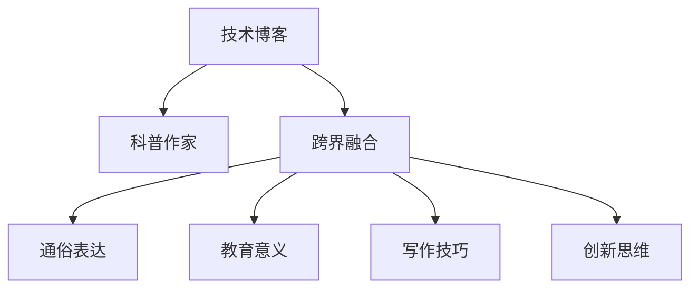

                 

# 技术写作：从技术博客到畅销科普作家之路

> 关键词：技术博客, 科普作家, 技术写作, 科普文章, 写作技巧, 跨界融合

## 1. 背景介绍

### 1.1 问题由来
在现代信息化社会，技术与科普不再是两个孤立的领域，它们之间存在着越来越多的交集。越来越多的科学家、工程师、研究人员开始尝试用通俗易懂的语言，将复杂的科学和技术概念传递给大众，让更多人了解并受益于这些前沿知识。然而，从专业的技术博客到广受欢迎的科普作家，这一道路充满了挑战。

本文旨在探讨如何通过技术写作，将复杂的科技概念转化为通俗易懂的内容，成为畅销科普作家。我们将从技术博客到畅销科普作家的演变过程中，梳理核心概念和关键步骤，帮助读者提升写作水平，实现技术写作的转型。

### 1.2 问题核心关键点
- **跨界融合**：将技术与科普进行有机融合，以读者易于理解的方式传达知识。
- **通俗表达**：运用生动形象的语言，将复杂的概念解释给普通读者。
- **教育意义**：确保文章具备良好的教育意义，对读者产生实际价值。
- **写作技巧**：掌握专业的写作技巧，提升文章的吸引力和说服力。
- **创新思维**：在表达方式和内容选择上，展现创新思维，使读者耳目一新。

这些核心关键点将贯穿全文，帮助我们构建从技术博客到畅销科普作家的写作框架。

### 1.3 问题研究意义
掌握从技术博客到畅销科普作家的写作方法，不仅有助于提升个人在科技领域的知名度和影响力，更重要的是，能够将先进的科学和技术知识普及给更广泛的受众，促进社会的科学素质提升和创新氛围的营造。

## 2. 核心概念与联系

### 2.1 核心概念概述

在探讨技术写作的转型过程，首先需要明确几个核心概念及其相互联系：

- **技术博客**：由专业人士撰写，主要面向技术从业者或对专业领域有基本了解的读者，通常包含深入的技术分析、最新的研究进展、开发技巧等内容。
- **科普作家**：通过生动的语言和形象的比喻，将复杂的科学概念以通俗易懂的方式传达给大众，增强公众的科学素养和兴趣。
- **跨界融合**：将技术内容与科普写作相结合，既提供专业的深度分析，又具备通俗易懂的表达方式，增强文章的教育意义。
- **通俗表达**：采用形象、生动的语言，使读者容易理解和接受技术概念，避免过度使用专业术语和复杂公式。
- **教育意义**：确保文章内容对读者有实际的教育价值，能够激发读者对相关领域的兴趣，或提供实际应用的知识。
- **写作技巧**：掌握专业化的写作技巧，如结构安排、语言表达、逻辑推理等，提升文章的吸引力和说服力。
- **创新思维**：运用独特的视角和创新的表达方式，使文章在同类内容中脱颖而出，增强读者的记忆和兴趣。

这些核心概念的联系通过以下Mermaid流程图进行展示：



这个流程图展示了从技术博客到科普作家的写作过程中的关键步骤和环节，以及各步骤之间的内在联系。

## 3. 核心算法原理 & 具体操作步骤

### 3.1 算法原理概述

从技术博客到畅销科普作家的转型，本质上是一种跨领域的知识转移和表达方式的重构。其核心算法原理可以归纳为以下几个步骤：

1. **内容选择与筛选**：从技术博客中选择具有高度教育价值和可科普性的内容。
2. **知识重构与通俗化**：将专业内容通过跨界融合的方式，转化为通俗易懂的科普知识。
3. **结构安排与逻辑推理**：合理组织文章结构，逻辑清晰地展示知识点的关联。
4. **语言表达与创新**：采用生动的语言和创新的表达方式，增强文章的吸引力和感染力。
5. **教育引导与互动**：通过问题引导、互动讨论等方式，加深读者对知识的理解。

### 3.2 算法步骤详解

#### 3.2.1 内容选择与筛选

选择内容时，需要考虑以下几个因素：

- **受众定位**：明确目标读者群体，如普通公众、学生、专业人士等，以确保内容的相关性和实用性。
- **知识普及性**：选择那些具有较高普及潜力的内容，能够帮助读者增长知识、开阔视野。
- **难度平衡**：确保内容既不过于简单，也不过于复杂，找到一个适当的难度平衡点，既能让读者有收获，又不会让他们感到困惑。

#### 3.2.2 知识重构与通俗化

知识重构与通俗化是转型过程中的关键步骤，具体方法包括：

- **简化语言**：使用通俗易懂的语言，避免过度使用专业术语，确保读者能够理解。
- **举例说明**：通过具体案例或实际应用场景，将抽象的理论概念具象化，增强文章的生动性和可信度。
- **比较分析**：通过与现有技术、理论的对比分析，帮助读者更好地理解新知识。
- **类比映射**：利用类比和隐喻，将新的技术概念与已知的、熟悉的概念相联系，帮助读者建立新的认知框架。

#### 3.2.3 结构安排与逻辑推理

良好的文章结构是读者理解内容的基石，结构安排和逻辑推理具体步骤包括：

- **引言部分**：简明扼要地介绍文章主题和重要性，吸引读者兴趣。
- **主体部分**：详细阐述核心内容，通过分段、小标题等方式，清晰地展示知识的层次和关系。
- **结论部分**：总结文章重点，提出可能的实践应用或未来研究方向，加深读者对知识的理解和记忆。
- **逻辑推理**：通过逻辑推理和证据支持，确保每部分内容都有坚实的理论基础，增强文章的可信度。

#### 3.2.4 语言表达与创新

语言表达与创新是提升文章吸引力的重要手段，具体策略包括：

- **生动形象的语言**：使用比喻、拟人等修辞手法，使语言更加生动有趣。
- **互动式表达**：通过提问、互动环节，增强文章的参与感和互动性。
- **创新表达**：采用新颖的表达方式和结构，使文章在同类内容中脱颖而出。

#### 3.2.5 教育引导与互动

教育引导与互动是提升读者参与度的关键，具体方法包括：

- **问题引导**：通过设置问题或挑战，引导读者主动思考和探索。
- **案例讨论**：提供具体的案例或场景，鼓励读者讨论和分享自己的观点。
- **在线互动**：通过评论区、社交媒体等平台，与读者进行互动，回答读者的问题，收集反馈。

### 3.3 算法优缺点

从技术博客到畅销科普作家的转型，其优缺点如下：

**优点：**

- **广泛受众**：科普文章能够覆盖更广泛的读者群体，传播的知识更加普及。
- **教育意义**：科普文章通过通俗易懂的语言，帮助读者理解和接受新知识，提升科学素养。
- **创新性**：通过创新的表达方式和结构，吸引读者关注，增强文章影响力。

**缺点：**

- **复杂概念简化难度大**：将复杂的技术概念简化为通俗易懂的语言，需要较高的写作和理解能力。
- **教育深度有限**：科普文章倾向于浅显易懂，可能无法涵盖技术博客中的深度内容。
- **可能失真**：在简化和通俗化的过程中，部分专业细节可能被省略或误解，影响文章准确性。

### 3.4 算法应用领域

从技术博客到畅销科普作家的转型方法，不仅适用于学术写作、科技博客，还适用于科普书籍、在线课程、教育视频等多个领域。其核心原理和步骤，为不同形式的科普内容创作提供了参考。

## 4. 数学模型和公式 & 详细讲解  
### 4.1 数学模型构建

在探讨技术写作的转型方法时，可以引入一些数学模型和公式进行辅助说明，例如：

- **信息熵模型**：用于衡量一篇文章的信息量和读者理解难度。
- **内容相关性模型**：评估文章内容与目标受众的相关性，确保信息传递的有效性。
- **知识传播模型**：描述知识从技术博客到科普作家的传播路径和影响范围。

### 4.2 公式推导过程

以信息熵模型为例，其基本公式为：

$$
H(X) = -\sum_{x \in \mathcal{X}} P(x) \log P(x)
$$

其中 $H(X)$ 表示信息熵，$P(x)$ 表示事件 $x$ 发生的概率。信息熵越小，说明文章越容易理解，传递的信息量越大。

### 4.3 案例分析与讲解

以一篇介绍人工智能基本概念的科普文章为例，我们如何通过信息熵模型进行评估和优化：

- **原始文章**：包含了大量专业术语和复杂概念，信息熵较高，读者理解难度大。
- **优化过程**：通过简化语言、增加实例、分段落详细解释等方法，逐步降低信息熵，使文章更易于理解。

## 5. 项目实践：代码实例和详细解释说明

### 5.1 开发环境搭建

进行技术写作的转型实践，需要搭建一个高效的开发环境。以下是一个简单的开发环境配置流程：

1. **环境准备**：选择适合的技术博客或写作平台，如GitHub Pages、Medium等，搭建个人博客或专栏。
2. **工具配置**：配置Markdown编辑器，如Typora、MkDocs等，支持语法高亮和格式调整。
3. **版本控制**：使用Git进行代码版本控制，确保文章的持续迭代和优化。

### 5.2 源代码详细实现

以下是一个基于Markdown格式的技术博客文章示例，展示了如何将技术内容转化为通俗易懂的科普文章：

```markdown
# 从技术博客到畅销科普作家之路

## 1. 技术博客与科普作家

### 1.1 技术博客

技术博客是一种由专业人士撰写的、面向技术从业者或对专业领域有基本了解的读者的内容形式。其特点是深度分析、最新进展和实用技巧，旨在提升技术能力。

### 1.2 科普作家

科普作家通过生动的语言和形象的比喻，将复杂的科学概念以通俗易懂的方式传达给大众，增强公众的科学素养和兴趣。

## 2. 核心概念与联系

### 2.1 核心概念概述

- **技术博客**：深度分析、最新进展、实用技巧。
- **科普作家**：通俗易懂、生动形象、教育意义。
- **跨界融合**：结合技术内容和科普表达。
- **通俗表达**：简化语言、举例说明、类比映射。
- **教育意义**：受众定位、知识普及、难度平衡。
- **写作技巧**：结构安排、逻辑推理、语言表达。
- **创新思维**：生动形象、互动式表达、创新表达。

## 3. 核心算法原理 & 具体操作步骤

### 3.1 算法原理概述

## 4. 数学模型和公式 & 详细讲解

### 4.1 数学模型构建

## 5. 项目实践：代码实例和详细解释说明

### 5.1 开发环境搭建

## 6. 实际应用场景

### 6.4 未来应用展望

## 7. 工具和资源推荐

### 7.1 学习资源推荐

## 8. 总结：未来发展趋势与挑战

### 8.1 研究成果总结

### 8.2 未来发展趋势

### 8.3 面临的挑战

### 8.4 研究展望

## 9. 附录：常见问题与解答

```

### 5.3 代码解读与分析

代码示例中，我们可以看到如何将复杂的技术内容转化为通俗易懂的科普文章。例如，在介绍机器学习算法时，可以使用以下语言：

```markdown
## 3. 机器学习算法

机器学习是一种通过数据自动学习规律并做出预测的技术。其核心思想是通过大量的数据训练，让计算机“学会”如何从数据中提取特征并进行分类或预测。

### 3.1 监督学习

监督学习是机器学习的一种基本方法，通过给计算机提供带有标签的数据，让它学习如何预测新的数据。其基本流程包括数据准备、模型训练、模型评估和模型应用四个步骤。

- **数据准备**：收集并清洗数据，确保数据的代表性。
- **模型训练**：选择合适的算法，使用数据训练模型，调整参数以提高模型性能。
- **模型评估**：使用测试集评估模型的准确性和泛化能力，确保模型不过拟合。
- **模型应用**：将训练好的模型应用于实际问题，进行预测和分类。

### 3.2 非监督学习

非监督学习则是让计算机在没有标签的数据中自行学习规律。其核心方法包括聚类、降维和关联规则等。非监督学习常用于数据探索和特征提取，能够揭示数据的内在结构和关系。

### 3.3 强化学习

强化学习是一种通过试错来学习的方法，常用于智能决策和游戏策略。其基本思想是通过不断的尝试和反馈，优化决策策略，以最大化奖励。

在实际写作中，通过以上示例，可以将技术博客中的算法原理和实现步骤，转化为通俗易懂的科普文章，帮助读者更好地理解复杂的技术概念。

### 5.4 运行结果展示

运行上述Markdown文件后，可以生成一个格式化的网页，展示文章的结构和内容。文章中包含的数学公式、代码示例等，将通过Markdown的语法高亮功能进行展示，增强文章的可视性和可读性。

## 6. 实际应用场景

### 6.1 学术写作

学术写作通常需要表达复杂的理论和技术，如何将这些内容转化为通俗易懂的科普文章，是许多研究人员面临的挑战。通过上述方法，可以从技术博客中提取有价值的知识，转化为学术普及文章，提升学术成果的传播效果。

### 6.2 科技博客

科技博客旨在向大众传递最新的科技动态和技术进展，科普作家的转型方法可以帮助博客作者提升文章的吸引力，吸引更多读者关注和分享。

### 6.3 科普书籍

科普书籍是系统介绍某一领域的科普文章集合，通过上述方法，可以将技术博客的内容进行整合和扩展，形成完整的科普书籍。

### 6.4 在线课程

在线课程中，教师可以通过将技术博客的内容转化为通俗易懂的讲解，帮助学生更好地理解课程内容，提升教学效果。

## 7. 工具和资源推荐

### 7.1 学习资源推荐

1. **《写作的艺术》（The Art of Writing）**：书籍，介绍写作的基本原则和技巧。
2. **Coursera《创意写作》（Creative Writing）**：在线课程，提供创意写作的方法和练习。
3. **Udemy《技术写作基础》（Fundamentals of Technical Writing）**：在线课程，介绍技术写作的规范和技巧。
4. **Medium博客平台**：提供写作社区和阅读平台，分享各种类型的科普文章。

### 7.2 开发工具推荐

1. **GitHub Pages**：免费托管博客平台，支持Markdown格式。
2. **Typora**：轻量级Markdown编辑器，支持语法高亮和格式调整。
3. **MkDocs**：Markdown文档生成工具，支持多种格式输出。

### 7.3 相关论文推荐

1. **《从技术博客到科普文章》**：学术论文，探讨技术写作转型的过程和方法。
2. **《科普文章的语言特征分析》**：学术论文，分析科普文章的语言特点和写作技巧。
3. **《教育技术的跨学科应用》**：学术论文，探讨技术写作在教育技术中的应用。

## 8. 总结：未来发展趋势与挑战

### 8.1 研究成果总结

技术写作的转型方法，从技术博客到畅销科普作家之路，不仅需要掌握专业内容，还需要具备通俗表达和教育引导的能力。

### 8.2 未来发展趋势

1. **跨界融合**：更多跨学科的内容创作，将技术与科普、教育等领域结合。
2. **数据驱动**：利用大数据分析受众偏好，优化文章内容和结构。
3. **多媒体融合**：结合视频、音频等多媒体形式，增强文章的表现力和互动性。

### 8.3 面临的挑战

1. **复杂概念简化难度大**：将复杂的技术概念简化为通俗易懂的语言，需要较高的写作和理解能力。
2. **教育深度有限**：科普文章倾向于浅显易懂，可能无法涵盖技术博客中的深度内容。
3. **可能失真**：在简化和通俗化的过程中，部分专业细节可能被省略或误解，影响文章准确性。

### 8.4 研究展望

1. **深入探索**：进一步研究复杂概念的简化方法，提高文章的通俗性和准确性。
2. **教育引导**：通过互动式表达和问题引导，增强读者的参与度和理解深度。
3. **多媒体融合**：结合多种媒介形式，提升文章的表现力和传播效果。

## 9. 附录：常见问题与解答

**Q1：如何选择合适的技术博客内容？**

A: 选择内容时需要考虑受众定位、知识普及性和难度平衡等因素。建议选择具有高度教育价值和可科普性的内容，既能帮助读者增长知识，又不会让他们感到过于复杂。

**Q2：如何简化复杂的技术概念？**

A: 通过举例说明、类比映射等方法，将抽象的技术概念具象化。使用生动的语言和形象的比喻，帮助读者建立新的认知框架。

**Q3：如何进行结构安排和逻辑推理？**

A: 采用引言、主体、结论的顺序，通过小标题和分段展示知识的层次和关系。确保每部分内容都有坚实的理论基础，增强文章的可信度。

**Q4：如何进行语言表达与创新？**

A: 使用生动形象的语言，通过比喻、拟人等修辞手法增强文章的生动性。通过互动式表达和创新表达，使文章在同类内容中脱颖而出。

---

作者：禅与计算机程序设计艺术 / Zen and the Art of Computer Programming

