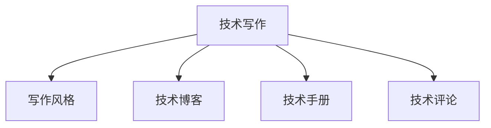

                 

# 技术写作：程序员的副业选择

## 1. 背景介绍

### 1.1 问题由来

随着科技的迅猛发展，程序员已成为市场需求高、待遇优厚的职业之一。然而，随着技术日新月异，以及市场竞争的加剧，单一的编程技能已难以满足企业的需求。为了提升自己的职业竞争力，许多程序员开始寻找新的副业，以丰富自己的技能树，并开拓更多的职业发展空间。

在众多副业中，技术写作成为了一个极具吸引力的选择。技术写作不仅能够为程序员提供额外的收入来源，还能增强其逻辑思维、表达能力，提升其技术理解和分析能力，进一步拓展职业发展路径。

### 1.2 问题核心关键点

选择技术写作作为副业，需关注以下几个关键点：

- **目标受众**：清晰定义目标受众，如开发者、数据科学家、运维工程师等。
- **写作风格**：确定写作风格，如技术博客、学术论文、技术手册等。
- **平台选择**：选择合适的写作平台，如GitHub、Medium、知乎等。
- **内容质量**：保证内容的准确性、权威性、实用性和可读性。
- **时间管理**：合理安排时间，平衡工作与副业。
- **持续学习**：保持技术更新，不断提升写作技能。

### 1.3 问题研究意义

技术写作作为程序员副业，具有以下几方面的研究意义：

1. **提升技术水平**：通过撰写技术文章，程序员能够深入学习新技术，提升自身技术水平。
2. **增强表达能力**：技术写作有助于提升程序员的表达和沟通能力，使其更好地参与团队协作和技术交流。
3. **拓展职业路径**：技术写作可带来额外收入，丰富职业发展选择，如成为技术博主、技术讲师等。
4. **增强市场竞争力**：通过技术写作，程序员能够展示其技术专长，吸引更多的工作机会和合作项目。

## 2. 核心概念与联系

### 2.1 核心概念概述

为了更好地理解技术写作的原理和实践，本节将介绍几个密切相关的核心概念：

- **技术写作**：以专业和清晰的方式，撰写关于技术的文章或文档，旨在传播知识、分享经验、引导实践。
- **写作风格**：文章或文档的表达方式和结构，如说明性、教程式、博客等。
- **技术博客**：以技术为主题的博客，通常分享技术见解、经验总结、最新技术动态等。
- **技术手册**：详细记录技术原理、使用方法和最佳实践的技术文档。
- **技术手册**：详细记录技术原理、使用方法和最佳实践的技术文档。
- **技术评论**：对技术产品、工具、框架的评测和分析，提供参考意见和改进建议。

这些核心概念之间的逻辑关系可以通过以下Mermaid流程图来展示：



这个流程图展示了技术写作的各个组成部分及其关系：技术写作基于不同的写作风格，通过技术博客、技术手册和技术评论等形式，向读者传播和分享技术知识。

## 3. 核心算法原理 & 具体操作步骤

### 3.1 算法原理概述

技术写作的核心算法原理主要涉及以下几个方面：

1. **选题规划**：根据目标受众需求，确定写作主题和内容方向。
2. **内容创作**：以清晰、准确的语言表达技术内容，并结构化组织文章结构。
3. **编辑校对**：对文章进行多轮编辑和校对，确保内容的准确性和可读性。
4. **发布传播**：选择合适的平台发布文章，并采取有效的传播策略，吸引读者。

### 3.2 算法步骤详解

1. **选题规划**
   - **受众分析**：了解目标受众的需求、兴趣和痛点，选择与其相关的主题。
   - **市场调研**：分析当前技术领域的热门话题和趋势，确定写作方向。
   - **内容框架**：制定详细的内容大纲，包括引言、正文、结论等部分。

2. **内容创作**
   - **知识积累**：深入研究相关技术知识，收集资料和数据。
   - **文章撰写**：采用结构化的方式，清晰表达技术细节和应用场景。
   - **代码示例**：结合实际代码示例，帮助读者更好地理解技术原理和实践方法。

3. **编辑校对**
   - **自查自改**：多次阅读和修改文章，确保逻辑连贯、语言准确。
   - **他人评审**：邀请同行评审文章，提出改进意见和建议。
   - **格式化处理**：使用Markdown等工具进行格式化处理，提升文章美观度。

4. **发布传播**
   - **平台选择**：选择合适的发布平台，如GitHub、Medium、知乎等。
   - **标题优化**：使用有吸引力的标题，提升文章点击率和传播效果。
   - **推广策略**：利用社交媒体、技术社区等渠道，推广文章。

### 3.3 算法优缺点

技术写作作为程序员副业，具有以下优点：

- **技能提升**：通过写作，提升逻辑思维、表达和沟通能力，丰富技术知识。
- **副业收入**：撰写技术文章可获得额外收入，增强经济稳定性。
- **职业发展**：提升个人品牌和技术影响力，拓展职业发展机会。

同时，技术写作也存在一定的缺点：

- **时间和精力投入**：写作需要大量的时间和精力，需合理安排与平衡。
- **内容质量要求高**：需确保内容的准确性、权威性和实用性，压力较大。
- **市场竞争激烈**：技术写作市场竞争激烈，需不断创新和提升内容质量。

### 3.4 算法应用领域

技术写作在以下几个领域有广泛的应用：

- **开源项目文档**：为开源项目撰写技术手册、代码示例和最佳实践指南，帮助开发者快速上手。
- **技术博客**：分享技术见解、经验总结和最新技术动态，吸引读者和同行关注。
- **技术评测**：对技术产品、工具和框架进行评测和分析，提供有价值的参考意见。
- **在线课程**：撰写技术教程和实践案例，支持在线教育平台和开发者社区。
- **企业内训**：为企业员工编写培训文档和技术手册，提升团队技术水平。

## 4. 数学模型和公式 & 详细讲解 & 举例说明

### 4.1 数学模型构建

技术写作的数学模型构建主要涉及以下几个方面：

- **选题模型**：基于目标受众需求和市场调研结果，构建选题模型。
- **内容生成模型**：使用自然语言处理(NLP)技术，自动生成技术文章。
- **阅读效果评估模型**：通过用户反馈和阅读量等指标，评估文章阅读效果。

### 4.2 公式推导过程

以下是一些常见技术写作的数学模型及其推导过程：

1. **选题模型**：
   - 假设目标受众需求为 $D$，市场调研结果为 $M$，则选题模型为：
   $$
   S = f(D, M)
   $$
   其中 $f$ 为选题函数，用于根据需求和调研结果选择主题。

2. **内容生成模型**：
   - 假设技术内容为 $C$，采用自然语言处理技术，生成技术文章 $A$，则模型为：
   $$
   A = g(C)
   $$
   其中 $g$ 为内容生成函数。

3. **阅读效果评估模型**：
   - 假设阅读量为 $R$，用户反馈为 $F$，则阅读效果评估模型为：
   $$
   E = h(R, F)
   $$
   其中 $h$ 为评估函数，用于计算文章阅读效果。

### 4.3 案例分析与讲解

以编写一篇关于"Python多线程编程实践"的技术文章为例：

1. **选题模型**：
   - 目标受众为 Python 开发者，市场调研显示多线程编程是热门话题，选题为 "Python多线程编程实践"。

2. **内容生成模型**：
   - 基于 Python 多线程编程相关知识，采用 Markdown 格式，撰写文章，包含引言、多线程基础、多线程应用场景、代码示例和常见问题解答。

3. **阅读效果评估模型**：
   - 通过阅读量、点赞、评论等指标评估文章效果，收集用户反馈，不断优化内容质量。

## 5. 项目实践：代码实例和详细解释说明

### 5.1 开发环境搭建

要进行技术写作，需要搭建一个合适的开发环境。以下是一个基本的开发环境搭建流程：

1. **选择平台**：根据目标受众和内容形式选择合适平台，如 GitHub、Medium、知乎等。
2. **安装工具**：安装必要的文本编辑器和Markdown工具，如Visual Studio Code、Typora等。
3. **设置模板**：创建固定模板，包括文章结构、标题样式、代码高亮等。

### 5.2 源代码详细实现

以下是一个简单的技术博客文章实现的示例：

```python
# 导入必要的库
import markdown
import os

# 设置文章标题和内容
title = "Python多线程编程实践"
content = """
# Python多线程编程实践

## 引言
多线程编程是Python编程中的重要内容，通过多线程可以提高程序运行效率，实现并发处理。本文将详细介绍多线程编程的基本概念、使用方法和常见问题。

## 多线程基础
多线程编程主要通过`threading`模块实现，创建一个线程需要以下步骤：
1. 导入`threading`模块
2. 创建线程对象
3. 启动线程
"""

# 渲染Markdown文章
md_content = markdown.markdown(content)

# 将渲染后的文章保存到本地
with open(os.path.join(os.getcwd(), f"{title}.md"), "w") as f:
    f.write(md_content)

print(f"文章保存成功：{title}.md")
```

### 5.3 代码解读与分析

该代码实现了一个简单的技术博客文章的生成和保存过程，主要涉及以下几个步骤：

1. **导入必要的库**：使用 `markdown` 库将Markdown格式的文章内容渲染为HTML格式。
2. **设置文章标题和内容**：定义文章标题和正文内容，使用Markdown格式进行排版。
3. **渲染Markdown文章**：将Markdown格式的内容渲染为HTML格式，便于在平台上展示。
4. **保存文章到本地**：将渲染后的HTML内容保存到本地文件中。

## 6. 实际应用场景

### 6.1 开源项目文档

为开源项目编写技术手册和文档，帮助开发者快速上手，是技术写作的重要应用场景之一。例如，为TensorFlow编写用户手册，详细介绍模型、API、最佳实践等内容，能够极大提升项目的使用率和社区活跃度。

### 6.2 技术博客

技术博客是展示个人技术见解和经验的主要平台，许多知名技术专家和博客作者都通过技术博客积累了大量的粉丝和影响力。例如，使用Medium撰写关于深度学习、人工智能等前沿技术文章，可以提升个人品牌和知名度。

### 6.3 技术评测

对技术产品、工具和框架进行评测和分析，提供有价值的参考意见，是技术写作的另一个重要应用场景。例如，撰写关于最新机器学习框架的评测文章，分析其性能、适用场景、优缺点等，能够帮助开发者选择合适的技术工具。

## 7. 工具和资源推荐

### 7.1 学习资源推荐

为了帮助程序员系统掌握技术写作的理论基础和实践技巧，以下推荐一些优质的学习资源：

1. **《The Elements of Style》**：经典写作指南，适合提升写作技巧和表达能力。
2. **《Technical Writing for Software Engineers》**：专业写作指南，详细介绍技术写作的各个方面。
3. **Coursera《Technical Writing》课程**：Coursera平台上的技术写作课程，适合初学者系统学习。
4. **EdX《Technical Writing》课程**：EdX平台上的技术写作课程，提供深入的理论和实践指导。

通过学习这些资源，相信你一定能够快速掌握技术写作的精髓，并用于解决实际的写作问题。

### 7.2 开发工具推荐

合适的开发工具是技术写作成功的关键，以下是几款常用的开发工具：

1. **Visual Studio Code**：轻量级代码编辑器，支持Markdown和Git版本控制，适合技术写作和项目管理。
2. **Typora**：美观的Markdown编辑器，支持实时预览和导出多种格式，适合撰写技术文章。
3. **GitHub Pages**：GitHub提供的静态网站托管服务，方便发布技术文章和文档。
4. **Medium**：全球知名的博客平台，提供丰富的写作工具和社区支持。
5. **知乎**：国内知名的问答社区，适合撰写技术文章和回答技术问题。

合理利用这些工具，可以显著提升技术写作的效率和效果，为程序员副业选择提供坚实的基础。

### 7.3 相关论文推荐

技术写作作为一门新兴学科，近年来也吸引了大量学者的关注。以下是几篇具有代表性的技术写作相关论文，推荐阅读：

1. **"Writing for Computer Scientists: A Handbook for Technically Minded Writers"**：主要介绍技术写作的基本原则和技巧，适合初学者阅读。
2. **"Technical Writing: Principles and Practices"**：详细讨论技术写作的理论基础和实践方法，适合深入研究。
3. **"The Role of Technical Writing in Software Development"**：探讨技术写作在软件开发中的应用，适合软件工程师参考。

这些论文代表了大规模语言模型微调技术的发展脉络。通过学习这些前沿成果，可以帮助研究者把握学科前进方向，激发更多的创新灵感。

## 8. 总结：未来发展趋势与挑战

### 8.1 总结

本文对技术写作的原理和实践进行了全面系统的介绍。首先阐述了技术写作的背景和意义，明确了技术写作在提升技术水平、增强表达能力、拓展职业路径等方面的独特价值。其次，从原理到实践，详细讲解了技术写作的数学原理和关键步骤，给出了技术写作任务开发的完整代码实例。同时，本文还广泛探讨了技术写作在开源项目文档、技术博客、技术评测等多个行业领域的应用前景，展示了技术写作范式的巨大潜力。此外，本文精选了技术写作的技术资源，力求为读者提供全方位的技术指引。

通过本文的系统梳理，可以看到，技术写作作为程序员副业，正在成为提升技术水平和职业竞争力的重要手段，拓展了程序员的就业机会和发展空间。未来，伴随技术写作方法的不断成熟和工具的不断完善，相信技术写作必将在构建人机协同的智能时代中扮演越来越重要的角色。

### 8.2 未来发展趋势

展望未来，技术写作的发展趋势主要体现在以下几个方面：

1. **内容多样化和国际化**：技术写作将更加注重内容的普适性和国际化，覆盖更多技术领域和语言。
2. **多平台融合**：技术写作将与多种平台进行深度融合，实现内容无缝跨平台传播。
3. **互动性和社区化**：技术写作将更多地引入互动元素和社区交流，提升内容的活跃度和参与度。
4. **技术栈融合**：技术写作将与其他技术栈进行融合，如结合代码示例、教程视频等，提升内容的完整性和实用性。

这些趋势凸显了技术写作的前景广阔，为程序员提供了更多的副业选择和发展机会。技术写作也将成为程序员综合素质提升的重要途径，帮助其更好地适应技术快速发展的趋势。

### 8.3 面临的挑战

尽管技术写作作为程序员副业具有广阔的前景，但在实际应用中仍面临一些挑战：

1. **内容质量要求高**：技术写作需确保内容的准确性、权威性和实用性，压力大。
2. **时间管理困难**：技术写作需大量时间和精力投入，需合理安排与平衡。
3. **市场竞争激烈**：技术写作市场竞争激烈，需不断创新和提升内容质量。
4. **版权和版权问题**：技术写作需注意版权和版权问题，避免侵权。

这些挑战需通过不断的实践和探索，逐步克服和解决。只有充分利用技术写作的优势，才能更好地实现副业选择，拓展职业发展空间。

### 8.4 研究展望

面向未来，技术写作的研究方向主要集中在以下几个方面：

1. **自动化写作**：结合AI技术，自动化生成技术文章，提升写作效率和质量。
2. **情感分析**：通过情感分析技术，评估读者对技术文章的反馈，优化写作策略。
3. **社区互动**：利用社区互动技术，提升技术文章的活跃度和传播效果。
4. **数据驱动**：利用大数据分析，优化选题和内容生成，提升技术文章的市场竞争力。

这些研究方向将推动技术写作向更加智能化、自动化、互动化的方向发展，为程序员副业选择提供更多的创新路径。

## 9. 附录：常见问题与解答

**Q1：如何提升技术文章的质量？**

A: 提升技术文章的质量需要多方面的努力：

1. **深入研究**：深入了解技术原理和应用，确保内容准确无误。
2. **清晰表达**：使用简洁明了的语言，避免冗长和模糊的表述。
3. **结构化组织**：采用清晰的结构，逻辑连贯，便于读者理解。
4. **代码示例**：结合实际代码示例，帮助读者更好地理解技术原理和实践方法。
5. **社区反馈**：多与社区用户互动，获取反馈，不断优化文章内容。

**Q2：如何选择技术写作的平台？**

A: 选择技术写作平台需要考虑以下因素：

1. **受众定位**：平台的用户定位和内容形式需与目标受众匹配。
2. **功能特性**：平台的功能特性需满足技术写作的需求，如Markdown支持、版本控制等。
3. **传播效果**：平台的传播效果需良好，有助于提升文章的阅读量和影响力。
4. **维护成本**：平台维护成本需可控，适合长期运营。

常用的技术写作平台包括GitHub Pages、Medium、知乎等，需根据实际情况进行选择。

**Q3：如何提升技术文章的传播效果？**

A: 提升技术文章的传播效果需要多方面的努力：

1. **标题优化**：使用有吸引力的标题，提升文章的点击率。
2. **内容质量**：保证文章内容的质量和实用性，吸引读者阅读。
3. **多媒体结合**：结合图片、视频、代码示例等多媒体内容，丰富文章的表达形式。
4. **互动元素**：加入互动元素，如评论、投票、问答等，提升文章的活跃度。
5. **推广策略**：利用社交媒体、技术社区等渠道，推广文章。

通过综合运用这些策略，可以显著提升技术文章的传播效果。

**Q4：如何保持技术文章的持续更新？**

A: 保持技术文章的持续更新需要建立系统化的内容管理流程：

1. **选题规划**：定期梳理选题，制定内容更新计划。
2. **知识积累**：不断学习新技术和知识，丰富文章内容。
3. **反馈机制**：建立用户反馈机制，及时了解读者需求和问题。
4. **迭代优化**：根据读者反馈，持续优化文章内容和结构。
5. **团队协作**：组建内容团队，分工协作，提升更新效率。

通过系统化的管理，可以确保技术文章的持续更新，保持内容的时效性和实用性。

---

作者：禅与计算机程序设计艺术 / Zen and the Art of Computer Programming

