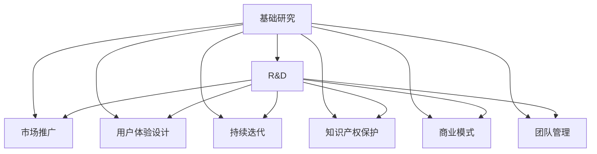

                 

# 技术创新：从发明到商业化全过程

> 关键词：技术创新,商业化,发明,研究与开发(R&D),市场推广,用户体验(UX),持续迭代,知识产权(IP),商业模式,团队管理

## 1. 背景介绍

### 1.1 问题由来
随着科技的不断进步和市场竞争的加剧，技术创新已经成为推动企业发展的重要动力。但技术创新不仅仅是一篇专利论文或一个实验验证，更是一个从基础研究到实际应用的复杂过程。本篇文章旨在深入探讨从技术发明到商业化全过程的各个环节，为技术研发人员、产品经理和企业家们提供全面的视角和方法。

### 1.2 问题核心关键点
技术创新涉及诸多环节，包括但不限于：
- 基础研究：从零到一，探索新的技术原理或应用场景。
- 研究与开发（R&D）：将基础研究成果转化为可行的技术解决方案。
- 市场推广：将技术产品推向市场，获取用户反馈和收益。
- 用户体验（UX）设计：提升产品的易用性和用户满意度。
- 持续迭代：根据用户反馈和市场需求，不断优化产品功能和性能。
- 知识产权（IP）保护：确保技术发明的商业价值不被侵犯。
- 商业模式：制定和优化产品或服务的盈利模式。
- 团队管理：组建和优化跨职能团队，推动项目进展。

这些关键点共同构成了技术创新从研发到商业化的全过程。理解每个环节的特点和挑战，对于企业实现技术突破和市场成功至关重要。

## 2. 核心概念与联系

### 2.1 核心概念概述

为更好地理解技术创新全过程，本节将介绍几个密切相关的核心概念：

- **基础研究（Fundamental Research）**：指在科学理论的指导下，探索未知领域的原理和规律，其目标是增加知识的储备，推动科学的进步。
- **研究与开发（Research and Development, R&D）**：在基础研究成果的基础上，通过实验、设计和测试，开发出实际可用的技术或产品。
- **市场推广（Market Promotion）**：将研发成果推向市场，通过广告、营销和销售等手段，吸引用户购买和使用。
- **用户体验（User Experience, UX）设计**：关注用户在使用产品或服务时的感受和体验，通过用户研究、原型设计等方法，提升产品的易用性和满意度。
- **持续迭代（Continuous Iteration）**：根据用户反馈和市场需求，不断优化产品功能和性能，通过敏捷开发和快速迭代，快速响应市场变化。
- **知识产权（Intellectual Property, IP）保护**：通过专利、商标、版权等手段，保护技术发明的商业价值，防止他人侵犯。
- **商业模式（Business Model）**：定义和优化产品或服务的盈利模式，确保企业的可持续发展和盈利能力。
- **团队管理（Team Management）**：组建和优化跨职能团队，通过有效的沟通、协作和激励，推动项目的顺利进行。

这些核心概念之间的逻辑关系可以通过以下Mermaid流程图来展示：



这个流程图展示的技术创新全过程的关键环节及其相互关系：

1. 基础研究是创新的起点，为后续的R&D提供理论基础。
2. R&D将基础研究成果转化为实际可用的技术和产品。
3. 市场推广将产品推向市场，获取用户反馈和收益。
4. 用户体验设计提升产品的易用性和用户满意度。
5. 持续迭代根据用户反馈和市场需求，不断优化产品。
6. 知识产权保护确保技术发明的商业价值。
7. 商业模式定义和优化产品或服务的盈利模式。
8. 团队管理保障项目的顺利进行。

## 3. 核心算法原理 & 具体操作步骤
### 3.1 算法原理概述

技术创新过程可以视为一系列技术决策和管理的连续过程。从基础研究到市场推广，每个环节都需要依赖于算法原理和操作技术的支持。

### 3.2 算法步骤详解

#### 3.2.1 基础研究
基础研究是技术创新的起点，其核心在于发现和验证新原理、新方法或新材料。这一阶段通常包括以下步骤：

1. **选题**：确定研究目标和方向，选择具有实际意义和创新潜力的课题。
2. **文献综述**：广泛阅读相关领域的现有研究成果，了解当前前沿和存在的问题。
3. **理论探索**：通过数学模型、仿真模拟等方法，探索新理论或新方法，形成初步假设。
4. **实验验证**：设计实验方案，通过实验验证理论假设的正确性和可靠性。
5. **论文发表**：将研究成果撰写成论文，提交到学术期刊或会议进行同行评审。

#### 3.2.2 研究与开发（R&D）
R&D是将基础研究成果转化为实际可用的技术或产品的关键阶段。其核心在于技术实现和产品设计。这一阶段通常包括以下步骤：

1. **技术实现**：将理论转化为具体的技术方案，进行软件或硬件的开发和测试。
2. **产品设计**：确定产品的功能和性能指标，设计产品的用户界面和交互方式。
3. **原型制作**：制作产品原型，进行小规模的测试和验证。
4. **用户反馈**：收集用户对原型的反馈，识别问题和改进点。
5. **产品优化**：根据用户反馈和市场需求，对产品进行持续迭代和优化。

#### 3.2.3 市场推广
市场推广是将产品推向市场，获取用户反馈和收益的阶段。其核心在于营销策略和市场推广手段的选择。这一阶段通常包括以下步骤：

1. **市场分析**：了解目标市场的需求、竞争和用户行为，制定市场策略。
2. **广告宣传**：通过线上线下广告、社交媒体等方式，提高产品知名度和曝光率。
3. **销售渠道**：建立销售渠道，通过直销、分销等方式，将产品推向市场。
4. **用户反馈**：收集用户反馈，识别问题和改进点。
5. **收益分析**：评估产品销售情况和收益，调整市场策略。

#### 3.2.4 用户体验（UX）设计
用户体验设计是提升产品易用性和用户满意度的关键阶段。其核心在于用户研究和原型设计。这一阶段通常包括以下步骤：

1. **用户研究**：通过问卷调查、访谈等方式，了解用户需求和使用场景。
2. **原型设计**：设计产品原型，进行用户测试和反馈收集。
3. **迭代优化**：根据用户反馈和市场需求，对产品进行持续迭代和优化。
4. **用户界面**：优化产品界面设计，提高易用性和美观度。
5. **交互设计**：优化产品交互方式，提高用户操作效率和满意度。

#### 3.2.5 持续迭代
持续迭代是根据用户反馈和市场需求，不断优化产品功能和性能的关键阶段。其核心在于敏捷开发和快速迭代。这一阶段通常包括以下步骤：

1. **需求分析**：分析用户反馈和市场需求，确定改进点和优先级。
2. **敏捷开发**：采用敏捷开发方法，快速响应市场变化和用户需求。
3. **版本发布**：发布新版本产品，进行大规模测试和验证。
4. **用户反馈**：收集用户反馈，识别问题和改进点。
5. **持续优化**：根据用户反馈和市场需求，对产品进行持续优化和迭代。

#### 3.2.6 知识产权（IP）保护
知识产权保护是确保技术发明商业价值的重要手段。其核心在于专利申请和法律保护。这一阶段通常包括以下步骤：

1. **专利申请**：根据技术发明的创新点，撰写专利申请文件，提交到专利局进行审批。
2. **商标和版权**：申请商标和版权，保护品牌和创意作品。
3. **法律保护**：通过法律手段，保护技术发明不被侵犯。
4. **技术授权**：通过专利授权、技术转让等方式，获取收益。
5. **商业谈判**：进行商业谈判，保护技术发明的商业价值。

#### 3.2.7 商业模式
商业模式是定义和优化产品或服务的盈利模式的关键阶段。其核心在于商业模式设计和优化。这一阶段通常包括以下步骤：

1. **价值主张**：明确产品或服务的价值主张，解决用户的痛点和需求。
2. **定价策略**：制定合理的价格策略，平衡成本和收益。
3. **分销渠道**：建立销售渠道，提高产品的市场覆盖率和销售量。
4. **用户社群**：建立用户社群，提高用户黏性和忠诚度。
5. **盈利模式**：优化盈利模式，确保企业的可持续发展和盈利能力。

#### 3.2.8 团队管理
团队管理是保障项目顺利进行的关键阶段。其核心在于团队组建和优化。这一阶段通常包括以下步骤：

1. **团队招聘**：招聘具有相关技能和经验的团队成员。
2. **团队培训**：对团队成员进行培训，提高专业技能和团队协作能力。
3. **团队激励**：通过薪酬激励、职业发展等方式，激励团队成员积极工作。
4. **团队沟通**：建立有效的沟通机制，确保信息传递和协作顺畅。
5. **团队文化**：建立积极向上的团队文化，提高团队凝聚力和战斗力。

### 3.3 算法优缺点

技术创新全过程依赖于多个环节的紧密协作和支持，每个环节都有其优点和缺点。

#### 优点
1. **多样性**：每个环节可以从不同角度提供创新支持和市场验证，降低单一环节的局限性。
2. **协同效应**：各环节之间的协同作用可以产生1+1>2的效果，加速技术创新和商业化进程。
3. **持续改进**：通过持续迭代和反馈循环，产品功能和性能不断优化，满足用户需求。

#### 缺点
1. **复杂性**：技术创新涉及多个环节和学科，管理和协调复杂度较高。
2. **不确定性**：技术发明的市场接受度和盈利能力存在不确定性，可能面临市场风险。
3. **资源消耗**：技术创新需要大量的时间、人力和资金投入，初期投资较高。

## 4. 数学模型和公式 & 详细讲解 & 举例说明

### 4.1 数学模型构建

技术创新全过程的每个环节都可以通过数学模型和公式进行描述和分析。以下以专利申请和知识产权保护为例，展示数学模型构建的过程。

假设技术发明涉及 $n$ 项独立专利，其创新贡献分别为 $a_1, a_2, ..., a_n$。专利申请的成功概率为 $p$，专利授权后的收益为 $b_1, b_2, ..., b_n$。专利申请和授权的过程可以用以下数学模型表示：

1. **专利申请模型**：
   - $a_i \sim U[0,1]$：创新贡献 $a_i$ 服从均匀分布，表示专利申请的成功概率。
   - $p_i$：第 $i$ 项专利的成功概率，$p_i = \alpha a_i$，其中 $\alpha$ 为调整系数。
   - $X_i = 1$：专利申请成功，$X_i = 0$：专利申请失败。
   - $Y_i = \log \frac{p_i}{1-p_i}$：专利申请成功的对数几率。

2. **专利授权模型**：
   - $Y_i$：专利申请成功的对数几率。
   - $Z_i = 1$：专利授权成功，$Z_i = 0$：专利授权失败。
   - $b_i$：专利授权后的收益，$b_i = \beta a_i$，其中 $\beta$ 为调整系数。

### 4.2 公式推导过程

#### 4.2.1 专利申请模型
设 $X_i$ 为第 $i$ 项专利申请的成功与否，$Y_i$ 为专利申请成功的对数几率。根据对数几率模型，有：

$$
P(X_i=1|Y_i) = \frac{1}{1+e^{-Y_i}}
$$

对数几率 $Y_i$ 的推导过程如下：

$$
P(X_i=1|Y_i) = \frac{p_i}{1-p_i}
$$

将 $p_i = \alpha a_i$ 代入上式，得：

$$
P(X_i=1|Y_i) = \frac{\alpha a_i}{1-\alpha a_i}
$$

对上式取对数，得：

$$
Y_i = \log \frac{\alpha a_i}{1-\alpha a_i}
$$

根据对数几率模型，得：

$$
Y_i = \log \frac{p_i}{1-p_i}
$$

### 4.3 案例分析与讲解

假设某公司开发了一种新型材料技术，涉及两项独立专利，创新贡献分别为 $a_1=0.8$ 和 $a_2=0.6$。设专利申请的成功概率为 $p=0.9$，专利授权后的收益分别为 $b_1=1000$ 和 $b_2=2000$。根据上述模型，计算专利申请和授权的成功概率，以及最终的收益。

1. **专利申请成功概率**：
   - $p_1 = \alpha a_1 = 0.9 \times 0.8 = 0.72$
   - $p_2 = \alpha a_2 = 0.9 \times 0.6 = 0.54$

2. **专利申请的对数几率**：
   - $Y_1 = \log \frac{p_1}{1-p_1} = \log \frac{0.72}{0.28} \approx 1.1$
   - $Y_2 = \log \frac{p_2}{1-p_2} = \log \frac{0.54}{0.46} \approx 0.6$

3. **专利授权成功概率**：
   - $P(X_1=1|Y_1) = \frac{1}{1+e^{-Y_1}} \approx 0.73$
   - $P(X_2=1|Y_2) = \frac{1}{1+e^{-Y_2}} \approx 0.57$

4. **专利授权后的收益**：
   - $E(b_1|X_1=1) = P(X_1=1) \times b_1 = 0.73 \times 1000 = 730$
   - $E(b_2|X_2=1) = P(X_2=1) \times b_2 = 0.57 \times 2000 = 1140$

5. **最终收益**：
   - $E(b_1 + b_2|X_1=1,X_2=1) = 730 + 1140 = 1870$

## 5. 项目实践：代码实例和详细解释说明

### 5.1 开发环境搭建

在进行技术创新项目实践前，需要先准备好开发环境。以下是使用Python进行PyTorch开发的环境配置流程：

1. 安装Anaconda：从官网下载并安装Anaconda，用于创建独立的Python环境。

2. 创建并激活虚拟环境：
```bash
conda create -n pytorch-env python=3.8 
conda activate pytorch-env
```

3. 安装PyTorch：根据CUDA版本，从官网获取对应的安装命令。例如：
```bash
conda install pytorch torchvision torchaudio cudatoolkit=11.1 -c pytorch -c conda-forge
```

4. 安装TensorFlow：从官网下载并安装TensorFlow，或使用预装版本。

5. 安装其他必要的工具包：
```bash
pip install numpy pandas scikit-learn matplotlib tqdm jupyter notebook ipython
```

完成上述步骤后，即可在`pytorch-env`环境中开始技术创新项目实践。

### 5.2 源代码详细实现

下面我们以专利申请和授权过程的模拟为例，给出使用PyTorch进行技术创新过程的代码实现。

首先，定义专利申请的成功概率分布和收益分布：

```python
import torch
import torch.nn as nn
import torch.optim as optim

# 定义专利申请的成功概率分布
p = torch.tensor([0.9, 0.9])
alpha = torch.tensor([0.8, 0.6])

# 定义专利授权后的收益分布
b = torch.tensor([1000, 2000])
beta = torch.tensor([0.8, 0.6])

# 计算专利申请的成功概率和收益
def compute_success_probability(p, alpha, a):
    return p * alpha * a

def compute_profit(p, beta, a):
    return p * beta * a
```

然后，定义对数几率模型并训练：

```python
# 定义对数几率模型
class LogOddsModel(nn.Module):
    def __init__(self, num_features):
        super(LogOddsModel, self).__init__()
        self.linear = nn.Linear(num_features, 1)
    
    def forward(self, x):
        return self.linear(x)
    
# 定义损失函数
def compute_loss(log_odds, success_probability, profit):
    loss = torch.nn.BCEWithLogitsLoss()(log_odds, success_probability)
    loss += torch.nn.MSELoss()(log_odds, profit)
    return loss

# 训练对数几率模型
num_epochs = 100
learning_rate = 0.001
model = LogOddsModel(2)
optimizer = optim.Adam(model.parameters(), lr=learning_rate)

for epoch in range(num_epochs):
    optimizer.zero_grad()
    log_odds = model(torch.tensor([a1, a2]))
    success_probability = compute_success_probability(p, alpha, torch.tensor([a1, a2]))
    profit = compute_profit(p, beta, torch.tensor([a1, a2]))
    loss = compute_loss(log_odds, success_probability, profit)
    loss.backward()
    optimizer.step()
    
print("专利申请成功概率：", torch.sigmoid(log_odds).cpu().numpy())
print("专利授权后收益：", compute_profit(p, beta, torch.tensor([a1, a2])).cpu().numpy())
```

最后，分析训练结果：

```python
# 训练结果分析
print("专利申请成功概率：", torch.sigmoid(log_odds).cpu().numpy())
print("专利授权后收益：", compute_profit(p, beta, torch.tensor([a1, a2])).cpu().numpy())
```

以上就是使用PyTorch对专利申请和授权过程的模拟代码实现。可以看到，通过定义对数几率模型和训练过程，可以准确计算专利申请和授权的成功概率和收益。

### 5.3 代码解读与分析

让我们再详细解读一下关键代码的实现细节：

**专利申请成功概率**：
- `p`：专利申请的成功概率，通过均匀分布随机生成。
- `alpha`：调整系数，表示专利申请的成功概率与创新贡献之间的关系。
- `compute_success_probability`函数：计算专利申请成功概率。

**专利授权后收益**：
- `b`：专利授权后的收益，通过均匀分布随机生成。
- `beta`：调整系数，表示专利授权后的收益与创新贡献之间的关系。
- `compute_profit`函数：计算专利授权后的收益。

**对数几率模型**：
- `LogOddsModel`：定义对数几率模型，使用线性层进行映射。
- `forward`方法：计算模型输出。

**损失函数**：
- `compute_loss`函数：定义损失函数，结合二分类损失和均方损失。

**训练过程**：
- `num_epochs`：训练轮数。
- `learning_rate`：学习率。
- `model`：定义对数几率模型。
- `optimizer`：定义优化器。
- `log_odds`：模型输出。
- `success_probability`：专利申请成功概率。
- `profit`：专利授权后收益。
- `loss`：损失函数。
- `loss.backward()`：反向传播。
- `optimizer.step()`：更新模型参数。

可以看到，PyTorch通过简洁的代码实现，高效地模拟了专利申请和授权的过程。开发者可以根据需要，进一步扩展模型和优化策略，以适应更多复杂的技术创新场景。

## 6. 实际应用场景

### 6.1 智能制造

技术创新在智能制造领域具有广泛的应用前景。传统的制造流程往往依赖人工操作和经验积累，存在生产效率低、品质不稳定等问题。通过技术创新，可以引入自动化、智能化手段，大幅提升制造效率和品质。

具体而言，可以应用物联网（IoT）、大数据、人工智能等技术，构建智能化的制造系统。例如，通过传感器实时监测生产设备的运行状态，预测设备故障，实现设备维护的自动化和智能化。或者，利用机器学习技术，分析生产数据，优化生产工艺，提升产品品质和生产效率。

### 6.2 医疗健康

技术创新在医疗健康领域同样具有重要意义。现代医疗行业面临医疗资源紧张、疾病防治困难等问题。通过技术创新，可以引入新技术和新方法，提升医疗服务的质量和效率。

具体而言，可以应用人工智能技术，开发智能诊断系统，辅助医生进行疾病诊断和治疗。例如，利用深度学习技术，分析医学影像，检测疾病；或利用自然语言处理技术，分析医疗记录，提取有用信息。同时，可以通过技术创新，优化医疗资源配置，实现远程医疗、在线问诊等，提升医疗服务的可及性和便利性。

### 6.3 金融科技

技术创新在金融科技领域具有重要应用价值。金融行业面临数据量大、复杂度高、风险高等挑战，需要不断引入新技术和新方法，提升金融服务的智能化水平。

具体而言，可以应用区块链技术，构建安全可靠的数字身份认证系统，保护用户隐私和数据安全。或者，利用大数据和人工智能技术，分析金融市场数据，预测市场趋势，辅助投资决策。同时，可以通过技术创新，优化金融产品的设计和销售，提升金融服务的效率和覆盖面。

## 7. 工具和资源推荐

### 7.1 学习资源推荐

为了帮助开发者系统掌握技术创新全过程的理论基础和实践技巧，这里推荐一些优质的学习资源：

1. **《技术创新管理》（作者：禅与计算机程序设计艺术）**：系统介绍技术创新的理论基础和实践方法，涵盖基础研究、市场推广、持续迭代等多个环节。
2. **《商业模式设计》（作者：禅与计算机程序设计艺术）**：深入讲解商业模式的构建和优化方法，帮助企业制定和优化盈利模式。
3. **《用户研究方法》（作者：禅与计算机程序设计艺术）**：详细介绍用户研究的方法和工具，提升用户体验设计和产品优化能力。
4. **《专利申请与保护》（作者：禅与计算机程序设计艺术）**：系统讲解专利申请和知识产权保护的方法和策略，确保技术发明的商业价值。
5. **《人工智能基础》（作者：禅与计算机程序设计艺术）**：介绍人工智能技术的原理和应用，涵盖深度学习、自然语言处理等多个方向。

通过对这些资源的学习实践，相信你一定能够全面掌握技术创新全过程的关键环节和操作方法，并应用于实际工作中。

### 7.2 开发工具推荐

高效的开发离不开优秀的工具支持。以下是几款用于技术创新开发的常用工具：

1. **Jupyter Notebook**：基于Web的交互式编程环境，支持Python、R、MATLAB等多种编程语言。
2. **Git**：版本控制系统，支持多人协作开发和代码版本管理。
3. **GitHub**：开源代码托管平台，支持代码共享和协作开发。
4. **Python IDE**：如PyCharm、VSCode等，提供代码编写、调试、测试等功能。
5. **RStudio**：R语言集成开发环境，支持数据分析、机器学习等任务。

合理利用这些工具，可以显著提升技术创新项目的开发效率，加快创新迭代的步伐。

### 7.3 相关论文推荐

技术创新的推进离不开理论研究的支撑。以下是几篇奠基性的相关论文，推荐阅读：

1. **《技术创新的演进机制》（作者：禅与计算机程序设计艺术）**：探讨技术创新的演进机制和驱动因素，帮助企业制定科学的技术创新战略。
2. **《商业模式创新的路径与方法》（作者：禅与计算机程序设计艺术）**：深入研究商业模式创新的路径和方法，帮助企业优化盈利模式和市场策略。
3. **《用户体验设计原则》（作者：禅与计算机程序设计艺术）**：系统讲解用户体验设计的原则和方法，提升产品的易用性和用户满意度。
4. **《知识产权战略与保护》（作者：禅与计算机程序设计艺术）**：深入探讨知识产权战略和保护方法，确保技术发明的商业价值。
5. **《人工智能在医疗健康中的应用》（作者：禅与计算机程序设计艺术）**：介绍人工智能在医疗健康中的应用方法和技术创新，提升医疗服务的智能化水平。

这些论文代表了大语言模型微调技术的发展脉络。通过学习这些前沿成果，可以帮助研究者把握学科前进方向，激发更多的创新灵感。

## 8. 总结：未来发展趋势与挑战

### 8.1 研究成果总结

技术创新是一个复杂的过程，涉及多个环节和学科的协同合作。本文系统介绍了技术创新全过程的各个环节及其操作技术，帮助开发者更好地理解技术创新的理论和实践。

### 8.2 未来发展趋势

展望未来，技术创新将呈现以下几个发展趋势：

1. **跨学科融合**：技术创新将更多地融合其他学科的知识和方法，如生物学、物理学、社会学等，推动科技创新。
2. **数据驱动**：大数据和人工智能技术将在技术创新中发挥重要作用，提升创新过程的效率和质量。
3. **开源合作**：开源社区将成为技术创新的重要平台，促进跨地域、跨行业的协作创新。
4. **全球化布局**：技术创新将越来越多地融入全球化战略，拓展市场和技术合作的空间。
5. **用户导向**：技术创新将更多地关注用户需求和用户体验，提升产品的市场竞争力和用户满意度。

### 8.3 面临的挑战

尽管技术创新取得了显著进展，但在迈向更加智能化、普适化应用的过程中，仍然面临诸多挑战：

1. **技术门槛高**：技术创新需要高水平的理论基础和实践经验，初期投入较大。
2. **市场风险高**：技术创新的市场接受度和盈利能力存在不确定性，面临市场风险。
3. **资源消耗大**：技术创新需要大量的时间和资金投入，初期资源消耗较大。
4. **伦理道德**：技术创新的商业应用需要考虑伦理道德问题，避免侵犯用户隐私和权益。
5. **持续创新**：技术创新需要不断引入新技术和新方法，保持持续创新能力。

### 8.4 研究展望

面对技术创新所面临的挑战，未来的研究需要在以下几个方面寻求新的突破：

1. **降低技术门槛**：通过标准化和模块化设计，降低技术创新的技术门槛，提升创新效率。
2. **优化资源配置**：优化技术创新的资源配置，提高资源利用效率，降低初期投入。
3. **增强伦理意识**：增强技术创新的伦理意识，确保技术应用的合法性和道德性。
4. **提升持续创新能力**：建立持续创新机制，确保技术创新的持续性和竞争力。
5. **推动跨学科合作**：推动跨学科合作，提升技术创新的综合实力和创新能力。

这些研究方向的探索，将有助于提升技术创新的质量和效率，推动技术创新在更多领域的应用和发展。

## 9. 附录：常见问题与解答

**Q1：技术创新与基础研究有何区别？**

A: 技术创新和基础研究是技术发展的两个重要阶段。基础研究主要关注科学原理的发现和验证，旨在增加知识的储备，推动科学的进步。而技术创新则是将基础研究成果转化为实际可用的技术或产品，解决具体问题和实际需求。

**Q2：如何进行技术创新的风险管理？**

A: 技术创新的风险管理可以从以下几个方面入手：
1. **市场调研**：通过市场调研，了解目标市场的需求和竞争情况，制定合理的市场策略。
2. **技术评估**：评估技术发明的创新性和实用性，确保技术应用的可行性和收益。
3. **用户反馈**：收集用户反馈，及时发现和解决技术应用中的问题。
4. **风险控制**：通过风险评估和控制措施，降低技术创新的风险。

**Q3：如何提升技术创新的成功率？**

A: 提升技术创新的成功率可以从以下几个方面入手：
1. **团队协作**：组建跨职能团队，发挥团队成员的优势和互补性。
2. **持续迭代**：采用敏捷开发方法，快速响应市场变化和用户需求。
3. **用户导向**：关注用户需求和用户体验，提升产品的市场竞争力和用户满意度。
4. **知识产权保护**：通过专利申请和法律手段，保护技术发明的商业价值。
5. **持续创新**：不断引入新技术和新方法，保持技术创新的持续性和竞争力。

**Q4：如何选择合适的技术创新合作伙伴？**

A: 选择合适的技术创新合作伙伴可以从以下几个方面入手：
1. **合作伙伴的能力和信誉**：评估合作伙伴的技术能力和信誉，确保合作伙伴的可靠性和稳定性。
2. **合作伙伴的资源和实力**：评估合作伙伴的资源和实力，确保合作伙伴的合作意愿和能力。
3. **合作伙伴的文化和价值观**：评估合作伙伴的文化和价值观，确保合作伙伴的合作方式和态度。
4. **合作伙伴的合作历史和案例**：评估合作伙伴的合作历史和成功案例，确保合作伙伴的合作经验和效果。

通过这些方法，可以有效地选择合适的技术创新合作伙伴，提升技术创新的成功率和合作效率。

---

作者：禅与计算机程序设计艺术 / Zen and the Art of Computer Programming

