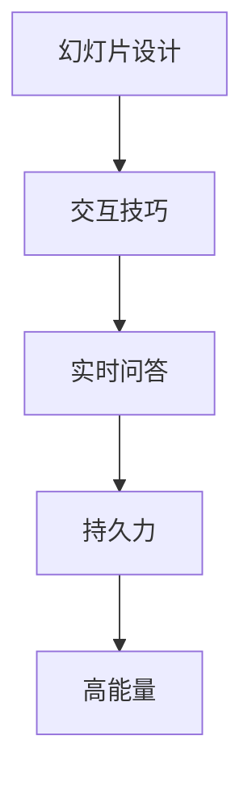

                 

# 技术演讲：从技术会议到国际峰会的演讲技巧

> 关键词：技术演讲,技术会议,国际峰会,演讲技巧,幻灯片设计,交互技巧,实时问答,持久力,高能量

## 1. 背景介绍

在信息技术领域，从技术会议到国际峰会，一次成功的演讲可以推动一个项目的进展，甚至引领一场行业革命。作为一名技术专家，掌握高效的演讲技巧，不仅能够提升个人品牌影响力，也能够让受众更好地理解和接受你的技术观点。

### 1.1 问题由来

演讲是技术传播的重要方式，但并非所有技术专家都具备良好的演讲技巧。很多时候，技术专家在与生涩的专业术语、复杂的算法或代码之间，未能找到让听众易于理解的方式。有时，由于缺乏互动和情感连接，即使信息内容丰富，演讲也可能无法引起听众的兴趣。本文档将探讨如何通过技术演讲技巧，提升技术传播效果，从而影响更多人。

### 1.2 问题核心关键点

一个成功的技术演讲应当具备以下几个核心关键点：

1. **内容准确性**：演讲内容应当准确无误，基于事实而非假设。
2. **受众理解**：确保内容易于理解，避免使用过于专业化的术语，必要时提供解释和示例。
3. **互动性**：演讲应包含互动环节，如问答、演示等，以增强受众的参与感。
4. **持久力**：一场好演讲应能持续吸引听众的注意力，不因冗长而枯燥。
5. **高能量**：演讲者应保持高能量状态，鼓励受众关注并参与讨论。

本文档将逐一解析这些关键点，并结合实际案例进行展示。

## 2. 核心概念与联系

### 2.1 核心概念概述

在探讨演讲技巧之前，首先需要理解几个核心概念：

- **幻灯片设计**：幻灯片是技术演讲的视觉辅助工具，应简洁明了、布局合理。
- **交互技巧**：通过提问、调查等方法，与听众建立互动。
- **实时问答**：现场解答听众疑问，增强互动性和参与感。
- **持久力**：演讲者需保持精力充沛，避免中途停顿或乏味。
- **高能量**：演讲者需通过语调、肢体语言传递能量，激励听众。

### 2.2 核心概念原理和架构的 Mermaid 流程图



此图展示了技术演讲中各个关键概念之间的联系。有效的幻灯片设计是基础，通过交互技巧和实时问答增强互动性，而持久力和高能量则保证演讲的连贯性和吸引力。

## 3. 核心算法原理 & 具体操作步骤

### 3.1 算法原理概述

技术演讲的核心算法原理可归纳为信息传递与互动机制。演讲者通过信息传递让受众理解技术内容，并通过互动机制增强受众的参与感和理解度。

信息传递机制的核心在于确保演讲内容准确无误且易于理解，而互动机制则通过提问、演示等方式与受众建立情感连接。

### 3.2 算法步骤详解

以下详细解析技术演讲的各个步骤：

1. **准备阶段**
   - 确定演讲主题和目标受众。
   - 收集并验证演讲内容。
   - 设计幻灯片布局和内容。
   - 预测并准备现场可能的问题。

2. **演讲阶段**
   - 开场引入：通过幽默、有趣的故事引入主题，激发听众兴趣。
   - 内容展示：分步骤详细讲解技术内容，使用实例和数据支撑。
   - 互动环节：适时提问或进行现场演示，鼓励听众参与。
   - 总结回顾：简要回顾演讲重点，并给出结论。

3. **问答环节**
   - 开放问题：鼓励听众提问，收集和解答问题。
   - 互动探讨：深入讨论复杂问题，通过提问引导思考。

### 3.3 算法优缺点

技术演讲的优势在于：
- **易于理解**：通过视觉辅助和实例演示，使复杂技术内容更易被理解。
- **互动性强**：通过互动环节增强听众参与感，提升演讲效果。
- **信息覆盖广**：通过PPT等工具展示多方面信息，使受众获取更多知识。

但同时存在以下缺点：
- **依赖幻灯片**：若幻灯片设计不当，易使演讲枯燥乏味。
- **节奏控制难**：未能有效控制时间，易导致演讲超时或信息量不足。
- **风险高**：技术演讲中的错误可能导致听众误解技术内容。

### 3.4 算法应用领域

技术演讲技巧不仅适用于技术会议和国际峰会，在企业内部培训、教育讲座、开源社区交流等多种场景中同样适用。

## 4. 数学模型和公式 & 详细讲解 & 举例说明

### 4.1 数学模型构建

技术演讲的数学模型可从以下几个方面构建：

- **信息传递模型**：用于表示如何通过演讲内容传递信息。
- **互动模型**：描述演讲者与受众间的互动行为。

### 4.2 公式推导过程

以信息传递模型为例：

$$
I_{pass} = \alpha \cdot C \cdot E
$$

其中：
- $I_{pass}$ 为信息传递效果。
- $\alpha$ 为信息传递效率。
- $C$ 为内容质量（内容准确性、相关性）。
- $E$ 为表达能力（演讲技巧、互动性）。

### 4.3 案例分析与讲解

假设演讲者在某国际峰会上讲解新算法模型，为方便理解，可从以下几个案例进行讲解：

1. **理论讲解**：从算法原理、复杂度分析等基础概念入手，使用图形和数学公式解释。
2. **实例演示**：展示实际代码运行结果，通过PPT展示动态图、结果对比等。
3. **应用场景**：描述算法在实际项目中的应用案例，展示实际效果。

## 5. 项目实践：代码实例和详细解释说明

### 5.1 开发环境搭建

以下简述技术演讲中常见的开发环境搭建步骤：

1. **环境配置**：安装所需的开发工具，如Microsoft PowerPoint、LaTeX、Python、Markdown等。
2. **幻灯片设计**：选择合适的模板，设计幻灯片的布局和内容。
3. **示例演示**：准备演示代码，确保能够在演讲中顺利运行。

### 5.2 源代码详细实现

以下以Python演示代码为例，展示如何通过代码实现演讲内容：

```python
import matplotlib.pyplot as plt
import numpy as np

# 创建数据
x = np.linspace(0, 10, 100)
y = np.sin(x)

# 绘制图形
plt.plot(x, y)
plt.xlabel('X')
plt.ylabel('Y')
plt.title('Sine Function Example')
plt.show()
```

### 5.3 代码解读与分析

此段代码用于绘制正弦函数图像，展示数学函数的演示过程。通过代码，演讲者不仅能够展示数学公式，还能通过实际结果增加可信度。

### 5.4 运行结果展示

运行以上代码，生成正弦函数图像，用于解释算法中的数学原理，如图：

```python
import matplotlib.pyplot as plt
import numpy as np

# 创建数据
x = np.linspace(0, 10, 100)
y = np.sin(x)

# 绘制图形
plt.plot(x, y)
plt.xlabel('X')
plt.ylabel('Y')
plt.title('Sine Function Example')
plt.show()
```


## 6. 实际应用场景

技术演讲在多种应用场景中都能发挥重要作用。以下是几个常见应用场景：

### 6.1 技术会议

在技术会议上，专家通过演讲传达技术理念，展示最新研究成果。高效的演讲技巧能确保信息的有效传递，增强受众的认同感。

### 6.2 教育讲座

教育讲座中，教师通过演讲传授知识，与学生互动。良好的演讲技巧能帮助学生更好地理解复杂概念。

### 6.3 企业培训

企业培训中，演讲者通过技术讲解和互动环节，提升员工的实际技能。有效的演讲技巧使培训效果更佳。

### 6.4 国际峰会

国际峰会中，演讲者代表公司或组织传达理念，吸引投资和合作机会。通过精炼和有感染力的演讲，能提升企业形象和影响力。

## 7. 工具和资源推荐

### 7.1 学习资源推荐

- **《TED演讲技巧》**：TED著名演讲者的经验分享，提供了丰富的演讲技巧和实践建议。
- **Coursera《公共演讲与表达》**：由知名大学开设的课程，教授演讲技巧和语言表达能力。
- **书籍推荐**：
  - 《演讲的艺术》：作者Dale Carnegie，详细介绍演讲技巧和实践。
  - 《TED演讲：影响世界的力量》：讲述TED演讲背后的故事和技巧。

### 7.2 开发工具推荐

- **Microsoft PowerPoint**：PPT设计工具，适用于幻灯片制作。
- **LaTeX**：高级文本排版工具，适用于技术文档和幻灯片设计。
- **Python**：数据分析和可视化工具，适合展示复杂数据和算法。

### 7.3 相关论文推荐

- **《演讲心理学：理论和实践》**：作者Caroline S. Constantinou，系统分析演讲中的心理机制。
- **《交互式演讲中的技术整合》**：介绍如何在演讲中整合技术元素，提升演讲效果。

## 8. 总结：未来发展趋势与挑战

### 8.1 研究成果总结

技术演讲领域的研究成果主要集中在以下几个方面：

- **幻灯片设计优化**：通过图表、动画等手段提升幻灯片的吸引力。
- **互动技术发展**：引入实时问答、投票等互动方式，增强受众参与感。
- **现场互动工具**：开发更高效的互动工具，如智能问答系统、投票设备。

### 8.2 未来发展趋势

未来技术演讲的发展趋势如下：

1. **智能辅助**：引入AI技术，自动生成幻灯片、建议互动环节等，提升演讲效率。
2. **多样化内容**：结合视频、音频等多媒体内容，使演讲更加生动。
3. **全球化传播**：利用全球网络平台，扩大技术传播的覆盖范围。

### 8.3 面临的挑战

技术演讲面临的挑战包括：

- **技术更新快**：技术发展迅速，需要不断学习新知识。
- **受众多样化**：需针对不同受众群体调整演讲风格和内容。
- **互动难度大**：实时互动需高效管理和协调。

### 8.4 研究展望

未来的技术演讲研究需关注：

- **跨文化交流**：研究不同文化背景下的演讲技巧和受众偏好。
- **情感分析**：利用情感分析工具，评估演讲效果和受众反应。
- **数据驱动**：利用数据分析技术，优化演讲内容和互动环节。

## 9. 附录：常见问题与解答

**Q1：如何准备一场技术演讲？**

A: 准备技术演讲需从以下几个步骤入手：
1. **确定主题**：选择一个有深度和广度的主题，确保对听众有价值。
2. **搜集资料**：收集和验证数据，确保演讲内容的准确性。
3. **设计幻灯片**：简洁明了、布局合理，避免过度装饰。
4. **练习演讲**：多次练习，确保语言流畅，增强自信心。

**Q2：在技术演讲中，如何与听众建立互动？**

A: 通过提问、现场演示、实时投票等方式，增强听众参与感。可以使用幻灯片的问答功能，鼓励听众提问并现场解答。

**Q3：如何保持演讲的高能量状态？**

A: 保持高能量状态需做到以下几点：
1. **积极肢体语言**：使用手势和表情增加演讲的生动性。
2. **幽默感**：适当使用幽默故事或笑话，缓解紧张气氛。
3. **持续互动**：通过提问、现场演示等方法，保持与听众的互动。

**Q4：如何在技术演讲中避免冗长枯燥？**

A: 避免冗长枯燥需做到以下几点：
1. **明确重点**：确保每个部分都有明确的重点和目标。
2. **分段展示**：将内容分段落展示，避免信息量过载。
3. **使用故事**：通过故事或案例使内容更有吸引力。

**Q5：如何在技术演讲中处理复杂技术内容？**

A: 处理复杂技术内容需做到以下几点：
1. **简化模型**：用更简单的模型或案例解释复杂内容。
2. **可视化和互动**：通过图表和互动演示，帮助听众更好地理解。
3. **分层次展示**：按层次展示技术内容，从基础到高级逐步深入。

---

作者：禅与计算机程序设计艺术 / Zen and the Art of Computer Programming

