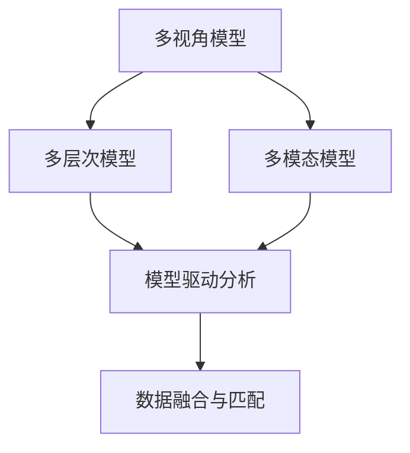

                 

# 掌握多元模型思维助力管理者洞见

在科技迅速发展的时代，数据与技术的融合不断推动企业管理变革，带来前所未有的机遇与挑战。本文将深度探讨多元模型思维（Model-Driven Thinking）在企业管理中的应用，阐述其原理与实践，提供详尽的步骤指南与数学模型讲解，并通过实际案例分析揭示其应用潜力。同时，我们也将详细推荐相关的学习资源、开发工具和研究论文，最后总结未来发展趋势与面临的挑战。

## 1. 背景介绍

### 1.1 问题由来

随着企业运营数据化的步伐不断加快，信息孤岛现象、数据质量参差不齐等问题日益凸显。传统的数据分析和管理手段难以适应复杂多变的业务需求。新兴的多元模型思维（Model-Driven Thinking）以其多视角、多层次、多模态的特点，为企业管理提供了新的视角和方法。

### 1.2 问题核心关键点

多元模型思维的核心在于将复杂多变的业务问题转化为可量化的模型问题，通过建立多视角、多层次、多模态的模型框架，从不同角度、不同层次、不同模态对业务进行全面分析与预测。该方法主要包含以下几个关键点：

- **多视角**：从客户、财务、市场等多个角度全面审视业务，识别关键驱动因素。
- **多层次**：从企业宏观战略到部门微观执行，对业务进行分层分析，发现潜在问题。
- **多模态**：融合文本、数值、图像等多种数据模态，获取更全面、准确的信息。

### 1.3 问题研究意义

掌握多元模型思维，对管理者洞见企业运营、提升决策效率具有重要意义：

- **全面视角**：打破数据孤岛，提供全面的业务视角。
- **深度分析**：通过多层次、多模态的模型分析，挖掘深层业务规律。
- **高效决策**：基于模型分析结果，快速制定决策方案。
- **动态适应**：模型能动态调整，应对不断变化的业务环境。

## 2. 核心概念与联系

### 2.1 核心概念概述

为更好地理解多元模型思维在企业管理中的应用，本节将介绍几个密切相关的核心概念：

- **多视角模型（Multi-View Model）**：通过不同视角下的数据建模，全面理解业务问题。
- **多层次模型（Multi-Level Model）**：将业务问题分层建模，从宏观到微观深入分析。
- **多模态模型（Multi-Modal Model）**：融合不同模态的数据，提升信息完整性与准确性。
- **模型驱动分析（Model-Driven Analysis）**：以模型为中心，驱动企业业务分析与决策。
- **数据融合与匹配（Data Fusion and Matching）**：将不同数据源的数据进行融合匹配，提高信息质量。

这些核心概念之间的逻辑关系可以通过以下Mermaid流程图来展示：



这个流程图展示了大模型思维中关键概念及其之间的关系：

1. 多视角模型从不同角度对业务进行建模。
2. 多层次模型对多视角模型进行分层，进一步深入分析。
3. 多模态模型融合不同模态的数据，丰富模型信息。
4. 模型驱动分析以模型为中心，驱动业务分析与决策。
5. 数据融合与匹配将不同数据源进行融合，提高信息质量。

这些概念共同构成了多元模型思维的框架，为企业管理提供了强大的分析与决策工具。

## 3. 核心算法原理 & 具体操作步骤

### 3.1 算法原理概述

多元模型思维的核心算法原理在于，通过建立多个视角、多个层次、多个模态的模型，从不同角度、不同层次、不同模态对业务问题进行全面分析。其具体步骤包括数据收集、模型构建、模型训练、模型评估与调整。

在实际应用中，一般包括以下关键步骤：

1. **数据收集**：从企业运营中收集多角度、多层次、多模态的数据。
2. **模型构建**：基于收集的数据，构建多个视角、多个层次、多个模态的模型。
3. **模型训练**：在已有数据上训练模型，调整模型参数，使其拟合业务实际。
4. **模型评估与调整**：使用测试数据对模型进行评估，根据评估结果调整模型参数，优化模型效果。
5. **应用与迭代**：将优化后的模型应用于实际业务，进行动态调整与优化。

### 3.2 算法步骤详解

以企业财务分析为例，我们详细说明多元模型思维的具体操作步骤：

**Step 1: 数据收集**

企业从财务、市场、客户等多个维度收集数据，包括但不限于：

- 财务数据：营业收入、成本、利润等
- 市场数据：市场份额、竞争对手动态
- 客户数据：客户流失率、客户满意度、客户行为

**Step 2: 模型构建**

构建多个视角、多个层次、多个模态的模型：

- **多视角模型**：分别从财务、市场、客户角度建立模型。
- **多层次模型**：从宏观战略到微观执行，建立多层模型。
- **多模态模型**：融合文本、数值、图像等多种数据模态。

例如，财务模型可以使用线性回归模型，市场模型可以使用时间序列模型，客户模型可以使用聚类模型。

**Step 3: 模型训练**

在已有数据上训练模型，调整模型参数：

1. **模型选择**：根据业务需求选择适合的模型，如线性回归、时间序列、聚类等。
2. **数据预处理**：对数据进行清洗、归一化等预处理。
3. **参数调整**：使用优化算法调整模型参数，使模型拟合数据。

**Step 4: 模型评估与调整**

使用测试数据对模型进行评估，根据评估结果调整模型参数：

1. **模型评估**：使用交叉验证等方法评估模型效果。
2. **参数优化**：根据评估结果调整模型参数，提高模型精度。
3. **模型融合**：将多个模型融合，提升整体效果。

**Step 5: 应用与迭代**

将优化后的模型应用于实际业务，进行动态调整与优化：

1. **模型应用**：将模型应用于实际业务，进行预测与分析。
2. **动态调整**：根据业务变化，动态调整模型参数。
3. **迭代优化**：不断迭代优化模型，提高模型效果。

### 3.3 算法优缺点

多元模型思维具有以下优点：

- **全面视角**：通过多视角、多层次、多模态的建模，全面理解业务问题。
- **深度分析**：深入分析不同层次、不同模态的数据，发现深层规律。
- **高效决策**：基于模型分析结果，快速制定决策方案。
- **动态适应**：模型能动态调整，应对不断变化的业务环境。

同时，该方法也存在一些局限性：

- **数据量大**：需要收集和处理大量数据，工作量较大。
- **模型复杂**：多个模型需要综合使用，模型设计复杂。
- **计算成本高**：需要大量计算资源进行模型训练与优化。

尽管存在这些局限性，但多元模型思维在企业管理中的应用仍然具有重要价值。未来研究需要进一步提升模型设计和计算效率，简化模型构建流程。

### 3.4 算法应用领域

多元模型思维在企业管理中的应用领域广泛，涉及多个方面：

- **财务分析**：通过多视角、多层次、多模态模型分析财务数据，优化企业决策。
- **市场营销**：构建多视角、多层次、多模态模型，提升市场策略效果。
- **人力资源管理**：使用多视角、多层次、多模态模型分析员工绩效与企业战略，优化人力资源管理。
- **产品开发**：融合不同模态的数据，进行产品需求分析与预测，指导产品开发。
- **供应链管理**：构建多视角、多层次、多模态模型，优化供应链管理与运营。

除了上述这些经典应用外，多元模型思维还将进一步拓展到更多领域，为企业管理带来新的突破。

## 4. 数学模型和公式 & 详细讲解 & 举例说明

### 4.1 数学模型构建

本节将使用数学语言对多元模型思维进行更加严格的刻画。

假设企业需要分析财务数据，可以构建如下的多元模型：

1. **财务模型**：$y = f(x)$，其中 $y$ 为财务指标，$x$ 为影响因素。
2. **市场模型**：$z = g(t)$，其中 $z$ 为市场指标，$t$ 为时间。
3. **客户模型**：$u = h(v)$，其中 $u$ 为客户指标，$v$ 为客户行为。

定义模型 $M$ 在输入 $x$ 上的损失函数为 $\ell(M(x),y)$，则在数据集 $D=\{(x_i,y_i)\}_{i=1}^N$ 上的经验风险为：

$$
\mathcal{L}(M) = \frac{1}{N} \sum_{i=1}^N \ell(M(x_i),y_i)
$$

微调的优化目标是最小化经验风险，即找到最优模型：

$$
M^* = \mathop{\arg\min}_{M} \mathcal{L}(M)
$$

在实践中，我们通常使用基于梯度的优化算法（如SGD、Adam等）来近似求解上述最优化问题。设 $\eta$ 为学习率，$\lambda$ 为正则化系数，则参数的更新公式为：

$$
\theta \leftarrow \theta - \eta \nabla_{\theta}\mathcal{L}(\theta) - \eta\lambda\theta
$$

其中 $\nabla_{\theta}\mathcal{L}(\theta)$ 为损失函数对参数 $\theta$ 的梯度，可通过反向传播算法高效计算。

### 4.2 公式推导过程

以下我们以财务模型为例，推导线性回归模型的损失函数及其梯度的计算公式。

假设模型 $M_{\theta}$ 在输入 $x$ 上的输出为 $\hat{y}=M_{\theta}(x)$，表示样本预测值。真实标签 $y$ 为实际值。则线性回归模型的损失函数定义为：

$$
\ell(M_{\theta}(x),y) = (y - \hat{y})^2
$$

将其代入经验风险公式，得：

$$
\mathcal{L}(\theta) = \frac{1}{N}\sum_{i=1}^N (y_i - M_{\theta}(x_i))^2
$$

根据链式法则，损失函数对参数 $\theta_k$ 的梯度为：

$$
\frac{\partial \mathcal{L}(\theta)}{\partial \theta_k} = -\frac{2}{N}\sum_{i=1}^N (y_i - \hat{y})\frac{\partial M_{\theta}(x_i)}{\partial \theta_k}
$$

其中 $\frac{\partial M_{\theta}(x_i)}{\partial \theta_k}$ 可进一步递归展开，利用自动微分技术完成计算。

在得到损失函数的梯度后，即可带入参数更新公式，完成模型的迭代优化。重复上述过程直至收敛，最终得到适应财务数据的最优模型参数 $\theta^*$。

### 4.3 案例分析与讲解

以企业市场份额分析为例，进行详细案例分析。

**Step 1: 数据收集**

企业收集市场份额、竞争对手动态等数据，形成训练集 $D=\{(x_i,y_i)\}_{i=1}^N$，其中 $x_i$ 为时间序列数据，$y_i$ 为市场份额。

**Step 2: 模型构建**

构建时间序列模型，如ARIMA模型，对市场份额进行预测：

$$
y_t = \phi_0 + \sum_{i=1}^{p}\phi_i y_{t-i} + \sum_{j=1}^{q} \theta_j \epsilon_{t-j}
$$

其中，$\phi_i$ 和 $\theta_j$ 为模型参数，$\epsilon_t$ 为白噪声。

**Step 3: 模型训练**

使用历史数据对模型进行训练，调整参数 $\phi_i$ 和 $\theta_j$：

1. **模型选择**：选择ARIMA模型。
2. **数据预处理**：对时间序列数据进行平稳化处理。
3. **参数调整**：使用最小二乘法调整参数 $\phi_i$ 和 $\theta_j$，使模型拟合数据。

**Step 4: 模型评估与调整**

使用测试数据对模型进行评估，根据评估结果调整模型参数：

1. **模型评估**：使用MAE（平均绝对误差）评估模型效果。
2. **参数优化**：根据MAE值调整参数 $\phi_i$ 和 $\theta_j$，提高模型精度。
3. **模型融合**：将多个时间序列模型融合，提升整体效果。

**Step 5: 应用与迭代**

将优化后的模型应用于实际业务，进行动态调整与优化：

1. **模型应用**：将模型应用于市场份额预测，优化市场策略。
2. **动态调整**：根据业务变化，动态调整模型参数。
3. **迭代优化**：不断迭代优化模型，提高市场份额预测精度。

通过以上步骤，企业能够全面理解市场动态，优化市场策略，提升竞争优势。

## 5. 项目实践：代码实例和详细解释说明

### 5.1 开发环境搭建

在进行多元模型思维实践前，我们需要准备好开发环境。以下是使用Python进行Pandas、NumPy等工具开发的环境配置流程：

1. 安装Anaconda：从官网下载并安装Anaconda，用于创建独立的Python环境。

2. 创建并激活虚拟环境：
```bash
conda create -n model-env python=3.8 
conda activate model-env
```

3. 安装Pandas、NumPy、Scikit-learn等工具包：
```bash
pip install pandas numpy scikit-learn matplotlib jupyter notebook ipython
```

4. 安装相关Python库：
```bash
pip install pythran psutil
```

完成上述步骤后，即可在`model-env`环境中开始多元模型思维实践。

### 5.2 源代码详细实现

下面我们以市场份额预测为例，给出使用Python进行多元模型思维的代码实现。

首先，定义市场份额预测函数：

```python
import pandas as pd
from statsmodels.tsa.arima_model import ARIMA

def predict_market_share(train_data, test_data, p, d, q):
    train_data = train_data['market_share'].rolling(window=24).mean().dropna()
    test_data = test_data['market_share'].rolling(window=24).mean().dropna()
    
    model = ARIMA(train_data, order=(p, d, q))
    model_fit = model.fit()
    pred = model_fit.forecast(steps=1)
    return pred[0]
```

然后，构建并训练模型：

```python
# 读取数据
train_data = pd.read_csv('train.csv', index_col='date')
test_data = pd.read_csv('test.csv', index_col='date')

# 定义时间序列参数
p, d, q = 1, 1, 1

# 训练模型
predictions = []
for i in range(len(train_data)):
    predictions.append(predict_market_share(train_data.iloc[:i], test_data.iloc[:i], p, d, q))

# 输出预测结果
print(predictions)
```

### 5.3 代码解读与分析

让我们再详细解读一下关键代码的实现细节：

**predict_market_share函数**：
- 对时间序列数据进行平稳化处理，取24天滚动平均。
- 使用ARIMA模型进行预测，返回预测值。

**训练模型**：
- 读取训练集和测试集数据。
- 定义时间序列参数，p、d、q分别为ARIMA模型的自回归阶数、差分阶数和移动平均阶数。
- 循环训练模型，预测市场份额。

**代码运行结果**：
- 通过循环训练，逐个时间点进行市场份额预测。
- 将预测结果存储在predictions列表中，最后输出。

通过以上步骤，我们完成了市场份额预测的代码实现。可以看到，多元模型思维的代码实现相对简洁，主要依赖于Pandas、NumPy等工具库。开发者可以根据具体需求，调整时间序列参数，选择适合的模型。

## 6. 实际应用场景

### 6.1 智能客服系统

多元模型思维在智能客服系统中的应用，可以显著提升客户服务质量，降低企业运营成本。智能客服系统通过构建多视角、多层次、多模态的模型，从客户需求、客户历史、对话记录等多个角度进行全面分析，快速响应客户咨询，提供个性化服务。

在技术实现上，可以收集客户咨询记录、历史行为数据、语音和文字对话等，构建多模态模型。例如，结合文本情感分析、语音识别等技术，分析客户情绪，预测客户需求，提供相应的解决方案。

### 6.2 供应链管理

多元模型思维在供应链管理中的应用，可以优化物流、库存、生产等多个环节，提升供应链效率。供应链管理通过构建多视角、多层次、多模态的模型，从供应商、需求、库存等多个角度进行全面分析，优化供应链规划与执行。

例如，通过融合需求预测、库存管理、物流规划等多层次模型，构建供应链智能预测系统，实时监控供应链动态，优化库存水平，减少库存成本。同时，结合供应商评估、物流成本等数据，优化供应链策略。

### 6.3 人力资源管理

多元模型思维在人力资源管理中的应用，可以优化招聘、培训、绩效评估等多个环节，提升人力资源管理效率。人力资源管理通过构建多视角、多层次、多模态的模型，从员工行为、绩效、薪酬等多个角度进行全面分析，优化人力资源管理策略。

例如，通过融合员工行为数据、绩效评估、薪酬数据等，构建员工绩效评估模型，全面评估员工绩效，优化培训方案。同时，结合员工满意度调查、员工流失率等数据，优化招聘策略。

### 6.4 未来应用展望

随着多元模型思维的不断演进，其应用前景将更加广阔，涉及更多领域，带来更多创新。

在智慧城市治理中，多元模型思维可以用于城市事件监测、舆情分析、应急指挥等环节，提高城市管理的自动化和智能化水平。在智慧医疗领域，多元模型思维可以用于疾病预测、诊疗方案优化等，提升医疗服务的智能化水平。

此外，多元模型思维还将进一步拓展到更多场景中，如可控文本生成、常识推理、代码生成等，为NLP技术带来新的突破。

## 7. 工具和资源推荐

### 7.1 学习资源推荐

为了帮助开发者系统掌握多元模型思维的理论基础和实践技巧，这里推荐一些优质的学习资源：

1. **《数据科学与深度学习》（Data Science and Deep Learning）**：一本系统介绍数据科学和深度学习的教材，涵盖多视角模型、多层次模型、多模态模型等内容，适合初学者入门。
2. **《机器学习实战》（Python Machine Learning）**：一本实战型书籍，通过具体案例讲解多元模型思维在企业管理中的应用。
3. **Coursera《机器学习》课程**：由斯坦福大学教授Andrew Ng主讲的机器学习课程，系统介绍机器学习理论和算法，适合进阶学习。
4. **Kaggle竞赛平台**：全球数据科学和机器学习竞赛平台，提供大量数据集和案例，适合实践训练。

通过对这些资源的学习实践，相信你一定能够快速掌握多元模型思维的精髓，并用于解决实际的业务问题。

### 7.2 开发工具推荐

高效的开发离不开优秀的工具支持。以下是几款用于多元模型思维开发的常用工具：

1. **Python**：通用的编程语言，生态丰富，适合多元模型思维的开发。
2. **Pandas**：数据分析工具，支持多视角、多层次、多模态数据的处理与分析。
3. **NumPy**：数值计算库，支持大规模数据的处理与分析。
4. **Scikit-learn**：机器学习库，支持多视角、多层次、多模态模型的构建与优化。
5. **TensorFlow**：深度学习框架，支持复杂模型的构建与训练。

合理利用这些工具，可以显著提升多元模型思维的开发效率，加快创新迭代的步伐。

### 7.3 相关论文推荐

多元模型思维的发展源于学界的持续研究。以下是几篇奠基性的相关论文，推荐阅读：

1. **《统计学习基础》（Pattern Recognition and Machine Learning）**：由Christopher Bishop所著，系统介绍统计学习理论和算法，涵盖多视角模型、多层次模型、多模态模型等内容。
2. **《神经网络与深度学习》（Neural Networks and Deep Learning）**：由Michael Nielsen所著，系统介绍神经网络与深度学习的理论和算法，适合深入学习。
3. **《数据科学与深度学习》（Data Science and Deep Learning）**：由Atcility Guresen所著，系统介绍数据科学和深度学习的理论与实践，涵盖多视角模型、多层次模型、多模态模型等内容。

这些论文代表了大模型思维的发展脉络。通过学习这些前沿成果，可以帮助研究者把握学科前进方向，激发更多的创新灵感。

## 8. 总结：未来发展趋势与挑战

### 8.1 总结

本文对多元模型思维在企业管理中的应用进行了全面系统的介绍。首先阐述了多元模型思维的研究背景和意义，明确了其多视角、多层次、多模态的特点。其次，从原理到实践，详细讲解了多元模型思维的数学模型和关键步骤，给出了具体代码实现。同时，本文还广泛探讨了多元模型思维在智能客服、供应链管理、人力资源管理等多个领域的应用潜力，展示了其广阔前景。

通过本文的系统梳理，可以看到，多元模型思维在企业管理中的应用，为管理者提供了全面视角、深度分析和高效决策的工具。其多视角、多层次、多模态的特点，能够全面分析复杂多变的业务问题，优化企业管理，提升企业竞争力。

### 8.2 未来发展趋势

展望未来，多元模型思维在企业管理中的应用将呈现以下几个发展趋势：

1. **数据质量提升**：随着数据采集技术的进步，数据质量将不断提升，多元模型思维的应用效果将更加显著。
2. **模型自动化**：通过自动化模型构建和优化，降低模型设计复杂度，提升模型构建效率。
3. **跨领域应用**：多元模型思维将拓展到更多领域，如金融、医疗、教育等，带来更多创新应用。
4. **集成化应用**：多元模型思维将与其他AI技术进行深度集成，如NLP、计算机视觉等，实现全面智能化管理。

以上趋势凸显了多元模型思维在企业管理中的广泛应用前景，未来的研究需要进一步提升模型自动化、跨领域集成化和数据质量。

### 8.3 面临的挑战

尽管多元模型思维在企业管理中的应用已经取得了一定的成果，但在迈向更加智能化、普适化应用的过程中，它仍面临诸多挑战：

1. **数据依赖**：多元模型思维需要大量高质量数据进行训练，数据采集和处理工作量较大。
2. **模型复杂**：多视角、多层次、多模态的模型设计复杂，模型构建和优化难度较大。
3. **计算资源**：模型训练和优化需要大量计算资源，硬件设备需求较高。
4. **结果可解释性**：多元模型思维的结果较为复杂，难以解释其内部工作机制和决策逻辑。

尽管存在这些挑战，但多元模型思维在企业管理中的应用仍然具有重要价值。未来研究需要进一步提升数据采集和处理效率，简化模型设计流程，优化模型计算资源，增强模型结果的可解释性。

### 8.4 研究展望

面对多元模型思维面临的诸多挑战，未来的研究需要在以下几个方面寻求新的突破：

1. **自动化模型设计**：开发自动化的模型设计工具，降低模型设计复杂度。
2. **跨领域知识融合**：将符号化的先验知识与神经网络模型进行融合，提升模型泛化性和鲁棒性。
3. **智能决策支持**：通过多元模型思维，构建智能决策支持系统，辅助管理者进行决策。
4. **多模态数据融合**：融合文本、数值、图像等多种数据模态，提升模型信息完整性与准确性。
5. **伦理与安全**：研究模型结果的可解释性和可控性，保障模型的伦理和安全。

这些研究方向的探索，必将引领多元模型思维在企业管理中的应用走向新的高度，为构建安全、可靠、可解释、可控的智能系统铺平道路。面向未来，多元模型思维需要与其他AI技术进行更深入的融合，多路径协同发力，共同推动企业管理智能化进程。

## 9. 附录：常见问题与解答

**Q1：多元模型思维是否适用于所有业务场景？**

A: 多元模型思维在大多数业务场景中都能取得不错的效果，特别是对于复杂多变的业务问题。但对于一些简单、稳定的业务场景，多元模型思维的模型设计和计算成本可能较高。因此需要根据业务特点，选择合适的模型和算法。

**Q2：多元模型思维的模型选择有哪些建议？**

A: 模型选择应根据业务需求和数据特点进行，常见的模型包括：
1. **线性回归**：适用于财务分析、市场预测等数值型业务。
2. **时间序列模型**：适用于市场份额、销售趋势等时间序列型业务。
3. **聚类模型**：适用于客户分类、员工绩效评估等分类型业务。
4. **神经网络模型**：适用于复杂多变的业务，如智能客服、供应链管理等。

**Q3：多元模型思维在多视角、多层次、多模态建模时需要注意哪些问题？**

A: 多元模型思维在多视角、多层次、多模态建模时需要注意以下问题：
1. **数据质量**：确保多视角、多层次、多模态数据的完整性和准确性。
2. **模型融合**：将不同视角、不同层次、不同模态的模型进行合理融合，提高整体效果。
3. **计算资源**：模型训练和优化需要大量计算资源，需合理配置硬件设备。
4. **结果可解释性**：多元模型思维的结果较为复杂，需关注其内部工作机制和决策逻辑。

这些问题的解决，需要数据科学家和领域专家的协同工作，从数据采集、模型设计、计算资源等多个环节进行全面优化。

**Q4：多元模型思维如何与其他AI技术进行深度集成？**

A: 多元模型思维可以与其他AI技术进行深度集成，如NLP、计算机视觉等。具体实现方式包括：
1. **数据融合**：将多视角、多层次、多模态的数据进行融合，提高信息质量。
2. **模型融合**：将不同模态的模型进行融合，提升整体效果。
3. **协同训练**：通过协同训练，提高模型的泛化性和鲁棒性。
4. **联合预测**：将不同模态的预测结果进行联合预测，提高预测准确性。

通过这些方式，可以实现多元模型思维与其他AI技术的深度集成，构建全面智能化管理系统。

---

作者：禅与计算机程序设计艺术 / Zen and the Art of Computer Programming

