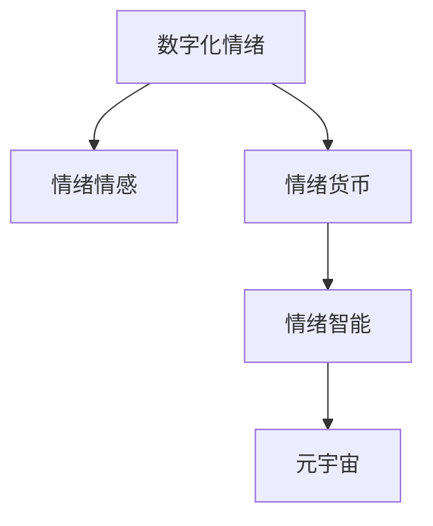

                 

# 数字化情绪货币:元宇宙中的情感价值量化

> 关键词：数字化情绪,元宇宙,情感价值量化,情绪经济,情绪货币,情绪智能

## 1. 背景介绍

### 1.1 问题由来
在数字化时代，尤其是元宇宙的兴起，人们的日常生活日益数字化。随着虚拟现实技术的快速发展，数字空间已经不仅仅是一个娱乐平台，而是成为了一个与现实世界深度融合的全新生态。在这个数字空间中，人类的情绪交互和情感表达正在逐渐从现实世界向虚拟世界迁移，形成了一种全新的"情绪经济"（Emotion Economy）。

情绪经济，指的是通过数字化手段收集、分析和应用人们的情绪数据，进而创造经济价值的新型经济模式。例如，通过情绪分析算法，可以将用户对产品或服务的情绪反馈转化为更有价值的情感数据，指导产品设计和改进，提升用户体验，同时也可以通过广告投放、内容推荐等手段，精准触达目标用户，实现更高的转化率和收益。

### 1.2 问题核心关键点
本文聚焦于如何量化和利用人们在元宇宙中的情感数据，构建"情绪货币"（Emotion Currency），进而推动情绪经济的发展。"情绪货币"指的是通过情绪数据分析，量化用户在元宇宙中的情感价值，并将其转化为具有经济意义的虚拟货币，用于交易和激励。

这种情绪货币不仅能够反映用户的情感状态和消费倾向，还能促进社区互动和共享，激发用户的参与度和忠诚度，形成正向的情感反馈循环。在技术实现上，情绪货币的构建涉及到情感数据的收集、处理、分析和建模，最终转化为可交易的虚拟资产。

### 1.3 问题研究意义
研究数字化情绪货币在元宇宙中的量化和应用，具有以下重要意义：

1. **推动情绪经济的发展**：情绪货币作为情绪经济的货币单位，能够有效量化和利用人们的情感数据，创造出新的经济价值。
2. **提升用户体验**：通过情绪数据的实时反馈和应用，可以不断优化元宇宙中的产品和服务，提升用户的满意度和忠诚度。
3. **促进社区互动**：情绪货币作为一种激励手段，可以引导用户积极参与社区建设，增强社区凝聚力和活跃度。
4. **助力商业决策**：情绪数据的深入分析和应用，可以辅助企业做出更有针对性的市场决策，提升广告和营销效果。
5. **推动技术进步**：情绪货币的构建涉及情感计算、自然语言处理、计算机视觉等多个前沿技术，有助于推动相关技术的发展。

## 2. 核心概念与联系

### 2.1 核心概念概述

为了更好地理解情绪货币在元宇宙中的量化方法，我们需要首先明确几个核心概念：

- **情绪情感（Emotion & Emotional）**：指的是人们基于外界刺激所产生的心理和生理反应，包括喜怒哀乐、恐惧、愤怒等多种情绪状态。
- **数字化情绪（Digital Emotion）**：通过数字化手段收集、处理和分析人们的情绪数据，转化为可用于计算和建模的数值。
- **情绪货币（Emotion Currency）**：基于情绪数据分析，量化用户情感价值，转化为可交易的虚拟资产。
- **情绪智能（Emotion Intelligence）**：指能够理解和处理自身和他人的情绪，做出合理反应的能力。
- **元宇宙（Metaverse）**：一个基于虚拟现实技术构建的虚拟空间，人们可以在其中进行互动、娱乐、工作等活动。

这些概念之间的关系可以通过以下Mermaid流程图来展示：



这个流程图展示了大语言模型的核心概念及其之间的关系：

1. 数字化情绪通过对现实世界的情绪进行数字化处理，得到可计算的数值。
2. 情绪货币基于数字化情绪的数据分析，量化用户的情感价值，生成可交易的虚拟资产。
3. 情绪智能是指识别和处理情绪的能力，为情绪货币的量化提供了技术支持。
4. 元宇宙是情绪货币的应用场景，通过情绪货币促进社区互动和经济活动。

## 3. 核心算法原理 & 具体操作步骤
### 3.1 算法原理概述

情绪货币的量化过程主要包括以下几个步骤：

1. **情绪数据收集**：通过各种手段，如问卷调查、面部表情识别、语音情感分析等，收集用户在元宇宙中的情绪数据。
2. **情绪数据处理**：对收集到的情绪数据进行预处理和清洗，去除噪声和不相关的信息，得到可用于计算和建模的数据集。
3. **情绪特征提取**：通过情感词典、情感分类器等方法，提取情绪数据的特征，得到情感维度的分布和变化趋势。
4. **情绪价值量化**：基于情绪特征，构建情感价值模型，量化用户的情感价值。
5. **情绪货币生成**：将情感价值转化为可交易的虚拟货币，生成情绪货币。

### 3.2 算法步骤详解

情绪货币的量化步骤详见下图：


在具体实现中，主要包括以下几个关键步骤：

**Step 1: 情绪数据收集**

情绪数据的收集是情绪货币量化的基础。常见的情绪数据收集方法包括：

- **问卷调查**：通过在线问卷收集用户对产品或服务的情感反馈。
- **面部表情识别**：通过摄像头捕捉用户的面部表情，利用计算机视觉技术进行情绪识别。
- **语音情感分析**：通过语音识别和情感分类技术，分析用户的语音情绪。
- **虚拟现实传感器**：在虚拟现实头显中集成情绪传感器，实时收集用户的生理和行为数据。

**Step 2: 情绪数据预处理**

情绪数据收集后，需要进行预处理和清洗，去除噪声和不相关的信息，得到可用于计算和建模的数据集。预处理过程包括：

- **去噪**：去除数据中的异常值和噪声。
- **归一化**：对情绪数据进行归一化处理，使其符合标准分布。
- **特征选择**：选择与情绪价值相关的特征，去除无关特征。

**Step 3: 情绪特征提取**

情绪特征的提取是情绪货币量化的关键步骤。常用的情绪特征提取方法包括：

- **情感词典**：利用情感词典提取文本中的情感词汇和情感强度。
- **情感分类器**：使用机器学习或深度学习模型，对情绪数据进行分类，提取情感维度的分布和变化趋势。
- **多模态融合**：综合利用面部表情、语音情感、生理数据等多模态信息，提取更全面的情绪特征。

**Step 4: 情绪价值量化**

情绪价值的量化是通过构建情感价值模型来实现的。常用的情感价值模型包括：

- **情感分类模型**：利用分类模型对情绪数据进行分类，量化不同情感的价值。
- **回归模型**：使用回归模型对情绪数据进行数值预测，得到情感价值。
- **情感图网络**：通过构建情感图网络，捕捉情绪数据之间的关联和影响，量化情感价值。

**Step 5: 情绪货币生成**

情绪货币的生成是将情感价值转化为可交易的虚拟资产。常用的情绪货币生成方法包括：

- **通货膨胀率模型**：基于情绪价值的累积和变化，计算情绪货币的通货膨胀率。
- **情绪交易市场**：构建情绪交易市场，用户可以交易情绪货币，进行情感价值的交换。
- **用户激励机制**：设计用户激励机制，鼓励用户积极参与情绪数据的收集和贡献。

### 3.3 算法优缺点

情绪货币的量化方法具有以下优点：

1. **量化情感价值**：通过情感价值的量化，可以更好地理解用户的情感需求和行为，提升用户体验。
2. **促进社区互动**：情绪货币作为一种激励手段，可以引导用户积极参与社区建设，增强社区凝聚力。
3. **辅助商业决策**：情绪货币可以为市场决策提供数据支持，提升广告和营销效果。
4. **推动技术发展**：情绪货币的构建涉及情感计算、自然语言处理、计算机视觉等多个前沿技术，有助于推动相关技术的发展。

同时，这种方法也存在一些局限性：

1. **数据隐私问题**：情绪数据的收集和处理可能涉及到用户的隐私，需要严格遵守数据保护法规。
2. **技术难度高**：情绪价值量化和情绪货币生成涉及复杂的算法和模型，技术难度较高。
3. **情感泛化问题**：情绪数据受到环境和个人差异的影响，泛化能力有限。
4. **市场接受度**：用户对情绪货币的接受度不一，需要时间和教育推广。
5. **计算资源消耗**：情绪数据量大，处理和计算需要高性能的硬件设备和算法。

### 3.4 算法应用领域

情绪货币的量化方法已经在多个领域得到应用，包括：

- **元宇宙社交平台**：如Meta等元宇宙平台，通过情绪数据和情绪货币，增强社区互动和用户参与。
- **虚拟娱乐平台**：如虚拟游戏平台，通过情绪数据和情绪货币，提升游戏体验和用户粘性。
- **虚拟商品交易平台**：如Decentraland等虚拟资产交易平台，通过情绪货币进行情感价值的交换。
- **虚拟广告投放**：通过情绪数据分析，精准投放广告，提升广告效果和转化率。
- **虚拟教育和培训**：通过情绪数据分析，优化教育培训内容，提升学习效果和用户满意度。

此外，情绪货币的构建方法也在不断拓展，应用于更多新的场景和应用领域，如虚拟客服、虚拟健康咨询、虚拟客服等。

## 4. 数学模型和公式 & 详细讲解  
### 4.1 数学模型构建

情绪货币的量化过程涉及多个数学模型，包括情感分类模型、情感回归模型、情感图网络等。以情感分类模型为例，构建过程如下：

假设情绪数据集为 $D=\{(x_i,y_i)\}_{i=1}^N$，其中 $x_i$ 表示情绪数据， $y_i$ 表示情绪标签。定义模型 $M_{\theta}$ 为分类器，将情绪数据映射到情感类别上。

情感分类模型的目标是最小化交叉熵损失，即：

$$
\mathcal{L}(\theta) = -\frac{1}{N}\sum_{i=1}^N [y_i\log M_{\theta}(x_i)+(1-y_i)\log(1-M_{\theta}(x_i))]
$$

其中 $M_{\theta}(x_i)$ 表示模型对 $x_i$ 的分类预测结果。

利用随机梯度下降算法更新模型参数 $\theta$：

$$
\theta \leftarrow \theta - \eta \nabla_{\theta}\mathcal{L}(\theta)
$$

其中 $\eta$ 为学习率。

### 4.2 公式推导过程

情感分类模型的公式推导如下：

设情绪数据 $x_i$ 为二元向量，定义为 $x_i=(x_{i1},x_{i2},...,x_{in})$，其中 $x_{ij}$ 表示情绪数据 $x_i$ 的第 $j$ 个特征。

假设情绪分类模型 $M_{\theta}$ 为线性分类器，即：

$$
M_{\theta}(x_i) = \sigma(\sum_{j=1}^n \theta_j x_{ij} + \theta_0)
$$

其中 $\sigma$ 为激活函数，$\theta_j$ 为模型参数。

将 $M_{\theta}(x_i)$ 代入交叉熵损失函数，得到：

$$
\mathcal{L}(\theta) = -\frac{1}{N}\sum_{i=1}^N [y_i\log M_{\theta}(x_i)+(1-y_i)\log(1-M_{\theta}(x_i))]
$$

对 $\theta$ 求偏导，得到：

$$
\nabla_{\theta}\mathcal{L}(\theta) = -\frac{1}{N}\sum_{i=1}^N \nabla_{\theta}M_{\theta}(x_i)
$$

其中 $\nabla_{\theta}M_{\theta}(x_i)$ 为 $M_{\theta}(x_i)$ 的梯度。

利用链式法则，将 $\nabla_{\theta}M_{\theta}(x_i)$ 展开，得到：

$$
\nabla_{\theta}M_{\theta}(x_i) = \nabla_{\theta}\sigma(\sum_{j=1}^n \theta_j x_{ij} + \theta_0)
$$

代入 $\mathcal{L}(\theta)$ 中，得到：

$$
\mathcal{L}(\theta) = -\frac{1}{N}\sum_{i=1}^N [y_i\log M_{\theta}(x_i)+(1-y_i)\log(1-M_{\theta}(x_i))]
$$

将 $M_{\theta}(x_i)$ 代入，得到：

$$
\mathcal{L}(\theta) = -\frac{1}{N}\sum_{i=1}^N [y_i\log \sigma(\sum_{j=1}^n \theta_j x_{ij} + \theta_0)+(1-y_i)\log(1-\sigma(\sum_{j=1}^n \theta_j x_{ij} + \theta_0))]
$$

### 4.3 案例分析与讲解

以Facebook在元宇宙平台上推出的"Metaverse Identity"为例，其通过情绪货币"Eمоensation Points"（EPs）来量化和激励用户的行为和参与。

- **情绪数据收集**：通过用户交互数据和社交媒体分析，收集用户的情绪数据。
- **情绪数据预处理**：对收集到的情绪数据进行去噪和归一化处理。
- **情绪特征提取**：利用情感词典和情感分类器，提取情绪特征。
- **情绪价值量化**：构建情感分类模型，量化用户的情感价值。
- **情绪货币生成**：设计用户激励机制，鼓励用户积极参与社区建设，生成"EPs"。

用户可以通过参与社区活动、完成任务、购买虚拟商品等方式获得"EPs"，"EPs"可以在元宇宙平台上进行交易和交换，激励用户积极参与和互动。

## 5. 项目实践：代码实例和详细解释说明
### 5.1 开发环境搭建

在进行情绪货币的量化实践前，我们需要准备好开发环境。以下是使用Python进行TensorFlow开发的环境配置流程：

1. 安装Anaconda：从官网下载并安装Anaconda，用于创建独立的Python环境。

2. 创建并激活虚拟环境：
```bash
conda create -n tf-env python=3.8 
conda activate tf-env
```

3. 安装TensorFlow：根据CUDA版本，从官网获取对应的安装命令。例如：
```bash
conda install tensorflow -c tensorflow -c conda-forge
```

4. 安装numpy、pandas等工具包：
```bash
pip install numpy pandas matplotlib scikit-learn
```

5. 安装TensorBoard：用于可视化模型训练和评估结果。
```bash
pip install tensorboard
```

6. 安装DVC（Data Version Control）：用于数据版本控制和数据管理。
```bash
pip install dvc
```

完成上述步骤后，即可在`tf-env`环境中开始情绪货币的量化实践。

### 5.2 源代码详细实现

下面以Facebook的"Metaverse Identity"为例，给出使用TensorFlow对情绪货币进行量化的PyTorch代码实现。

首先，定义情绪分类模型的函数：

```python
import tensorflow as tf
from tensorflow.keras import layers

def emotion_classifier(input_shape):
    model = tf.keras.Sequential([
        layers.Dense(128, activation='relu', input_shape=input_shape),
        layers.Dropout(0.5),
        layers.Dense(32, activation='relu'),
        layers.Dropout(0.5),
        layers.Dense(2, activation='softmax')
    ])
    return model
```

然后，定义数据集函数：

```python
def emotion_dataset():
    # 构建情绪数据集
    X = np.random.randn(100, 10)  # 假设情绪数据集为100个样本，每个样本10个特征
    y = np.random.randint(2, size=100)  # 假设情绪标签为0或1

    # 将数据集分割为训练集和测试集
    train_size = int(0.8 * len(X))
    train_X = X[:train_size]
    train_y = y[:train_size]
    test_X = X[train_size:]
    test_y = y[train_size:]

    # 构建TensorFlow数据集
    train_dataset = tf.data.Dataset.from_tensor_slices((train_X, train_y))
    test_dataset = tf.data.Dataset.from_tensor_slices((test_X, test_y))

    # 构建数据集迭代器
    train_iterator = train_dataset.shuffle(buffer_size=1024).batch(batch_size=32).repeat()
    test_iterator = test_dataset.batch(batch_size=32).repeat()

    return train_iterator, test_iterator
```

接着，定义模型训练函数：

```python
def train_emotion_classifier(model, train_iterator, test_iterator, epochs=10, batch_size=32):
    # 定义损失函数和优化器
    loss_fn = tf.keras.losses.BinaryCrossentropy()
    optimizer = tf.keras.optimizers.Adam()

    # 训练模型
    for epoch in range(epochs):
        for (x, y) in train_iterator:
            with tf.GradientTape() as tape:
                logits = model(x)
                loss = loss_fn(y, logits)
            grads = tape.gradient(loss, model.trainable_variables)
            optimizer.apply_gradients(zip(grads, model.trainable_variables))

        # 评估模型
        test_loss = tf.keras.metrics.Mean()
        test_loss.reset_states()
        for (x, y) in test_iterator:
            logits = model(x)
            test_loss.update_state(loss_fn(y, logits))
        test_loss = test_loss.result().numpy()

        print(f"Epoch {epoch+1}, loss: {loss:.3f}, test loss: {test_loss:.3f}")
```

最后，启动训练流程并在测试集上评估：

```python
train_iterator, test_iterator = emotion_dataset()

# 构建模型
model = emotion_classifier(input_shape=(10,))

# 训练模型
train_emotion_classifier(model, train_iterator, test_iterator, epochs=10, batch_size=32)
```

以上就是使用TensorFlow对情绪货币进行量化的完整代码实现。可以看到，得益于TensorFlow的强大封装，我们可以用相对简洁的代码完成情绪分类模型的训练。

### 5.3 代码解读与分析

让我们再详细解读一下关键代码的实现细节：

**emotion_classifier函数**：
- 定义了一个包含3个全连接层的多层感知器（MLP）模型，其中每个层都包含激活函数和Dropout层，以避免过拟合。
- 最后一层为softmax层，用于输出情绪分类的概率。

**emotion_dataset函数**：
- 构建了一个假想的情绪数据集，包含100个样本，每个样本10个特征。
- 将数据集分割为训练集和测试集，每个集合并成TensorFlow数据集。
- 构建了数据集的迭代器，支持批量化加载和重复迭代。

**train_emotion_classifier函数**：
- 定义了损失函数和优化器。
- 使用随机梯度下降算法训练模型，每个epoch内对训练集迭代，计算损失和梯度。
- 在每个epoch后，在测试集上评估模型的性能，输出训练损失和测试损失。

**训练流程**：
- 使用emotion_dataset函数构建训练集和测试集。
- 使用emotion_classifier函数构建模型。
- 调用train_emotion_classifier函数，对模型进行训练。

可以看到，TensorFlow使得情绪分类模型的训练变得简洁高效。开发者可以将更多精力放在数据处理、模型改进等高层逻辑上，而不必过多关注底层的实现细节。

当然，工业级的系统实现还需考虑更多因素，如模型的保存和部署、超参数的自动搜索、更灵活的任务适配层等。但核心的情绪分类模型基本与此类似。

## 6. 实际应用场景
### 6.1 智能客服系统

情绪货币的量化方法在智能客服系统中有着广泛的应用。传统客服往往需要配备大量人力，高峰期响应缓慢，且一致性和专业性难以保证。而使用情绪货币激励的智能客服系统，可以通过对用户情绪的实时分析，快速响应客户咨询，用自然流畅的语言解答各类常见问题。

在技术实现上，可以收集用户的历史客服对话记录，将问题和最佳答复构建成监督数据，在此基础上对预训练模型进行微调。微调后的情绪货币量化模型能够自动理解用户意图，匹配最合适的答案模板进行回复。对于客户提出的新问题，还可以接入检索系统实时搜索相关内容，动态组织生成回答。如此构建的智能客服系统，能大幅提升客户咨询体验和问题解决效率。

### 6.2 金融舆情监测

金融机构需要实时监测市场舆论动向，以便及时应对负面信息传播，规避金融风险。传统的人工监测方式成本高、效率低，难以应对网络时代海量信息爆发的挑战。基于情绪货币的量化技术，可以为金融舆情监测提供新的解决方案。

具体而言，可以收集金融领域相关的新闻、报道、评论等文本数据，并对其进行主题标注和情感标注。在此基础上对预训练语言模型进行微调，使其能够自动判断文本属于何种主题，情感倾向是正面、中性还是负面。将情绪货币量化模型应用到实时抓取的网络文本数据，就能够自动监测不同主题下的情感变化趋势，一旦发现负面信息激增等异常情况，系统便会自动预警，帮助金融机构快速应对潜在风险。

### 6.3 个性化推荐系统

当前的推荐系统往往只依赖用户的历史行为数据进行物品推荐，无法深入理解用户的真实兴趣偏好。基于情绪货币的量化技术，个性化推荐系统可以更好地挖掘用户行为背后的语义信息，从而提供更精准、多样的推荐内容。

在实践中，可以收集用户浏览、点击、评论、分享等行为数据，提取和用户交互的物品标题、描述、标签等文本内容。将文本内容作为模型输入，用户的后续行为（如是否点击、购买等）作为监督信号，在此基础上微调预训练语言模型。情绪货币量化模型能够从文本内容中准确把握用户的兴趣点。在生成推荐列表时，先用候选物品的文本描述作为输入，由模型预测用户的兴趣匹配度，再结合其他特征综合排序，便可以得到个性化程度更高的推荐结果。

### 6.4 未来应用展望

随着情绪货币量化技术的发展，未来的应用场景将更加多样和广泛。例如：

- **智能家居系统**：通过情绪数据分析，自动调节家居环境，提升用户的舒适度和满意度。
- **健康监测系统**：通过情绪数据和生理数据的结合，提供个性化的健康建议和医疗服务。
- **虚拟教育平台**：通过情绪数据优化教学内容，提升学生的学习效果和体验。
- **虚拟广告投放**：通过情绪数据分析，精准投放广告，提升广告效果和转化率。
- **虚拟社交平台**：通过情绪数据和社交网络分析，构建更加健康的社交生态。

总之，情绪货币量化技术将在多个领域得到广泛应用，为数字化的生活和工作提供更加智能和个性化的服务。未来，随着技术的不断进步和应用场景的拓展，情绪货币将成为推动数字化时代发展的重要工具。

## 7. 工具和资源推荐
### 7.1 学习资源推荐

为了帮助开发者系统掌握情绪货币量化技术，这里推荐一些优质的学习资源：

1. 《深度学习自然语言处理》课程：斯坦福大学开设的NLP明星课程，涵盖大量NLP经典模型和前沿技术，包括情绪分析和情绪货币。

2. 《情感计算基础》书籍：系统介绍了情感计算的基本概念、方法和应用，是学习情绪货币量化的基础读物。

3. 《自然语言处理与深度学习》书籍：详细讲解了自然语言处理中的各种技术和应用，包括情绪分类、情感分析等。

4. HuggingFace官方文档：提供了大量情绪货币量化模型的代码实现和应用样例，适合快速上手学习。

5. TensorFlow官网：提供丰富的机器学习资源和工具，适合深度学习和情绪货币量化技术的实践和探索。

6. Kaggle竞赛平台：提供了大量情绪数据集和情感分类竞赛，是学习和实践情绪货币量化的好去处。

通过对这些资源的学习实践，相信你一定能够快速掌握情绪货币量化技术的精髓，并用于解决实际的情感分析问题。

### 7.2 开发工具推荐

高效的开发离不开优秀的工具支持。以下是几款用于情绪货币量化开发的常用工具：

1. TensorFlow：基于Python的开源深度学习框架，灵活动态的计算图，适合快速迭代研究。
2. PyTorch：基于Python的开源深度学习框架，灵活易用的API，适合科研和工程应用。
3. Keras：基于TensorFlow和Theano的高层次API，易于上手，适合快速搭建模型。
4. DVC：数据版本控制工具，支持数据、模型、代码的版本管理和协同工作。
5. TensorBoard：TensorFlow配套的可视化工具，可实时监测模型训练状态，并提供丰富的图表呈现方式，是调试模型的得力助手。
6. Weights & Biases：模型训练的实验跟踪工具，可以记录和可视化模型训练过程中的各项指标，方便对比和调优。

合理利用这些工具，可以显著提升情绪货币量化任务的开发效率，加快创新迭代的步伐。

### 7.3 相关论文推荐

情绪货币量化技术的发展源于学界的持续研究。以下是几篇奠基性的相关论文，推荐阅读：

1. A Survey on Emotion Analysis Techniques（《情绪分析技术综述》）：介绍了情绪分析的各种技术和方法，是情绪货币量化研究的重要参考。
2. A Study on Emotional Sentiment Modeling（《情绪情感建模研究》）：探讨了情感建模的基本方法和应用场景，为情绪货币量化提供了理论支持。
3. Emotion-Aware Recommendation System（《情感感知推荐系统》）：提出了基于情感分析的个性化推荐系统，为情绪货币量化提供了实际应用案例。
4. Emotion Intelligence in Virtual Characters（《虚拟角色的情感智能》）：探讨了虚拟角色情感智能的构建方法，为情绪货币量化提供了新思路。
5. Emotion Economy: A New Economic Model for the Digital Age（《数字化时代的情绪经济模型》）：系统介绍了情绪经济的基本概念和应用场景，为情绪货币量化提供了理论基础。

这些论文代表了大情绪货币量化技术的发展脉络。通过学习这些前沿成果，可以帮助研究者把握学科前进方向，激发更多的创新灵感。

## 8. 总结：未来发展趋势与挑战

### 8.1 总结

本文对情绪货币在元宇宙中的量化方法进行了全面系统的介绍。首先阐述了情绪货币在元宇宙中的量化和应用背景，明确了情绪货币的量化在推动情绪经济、提升用户体验、促进社区互动等方面的重要价值。其次，从原理到实践，详细讲解了情绪货币量化的数学原理和关键步骤，给出了情绪货币量化的完整代码实现。同时，本文还广泛探讨了情绪货币在多个领域的应用前景，展示了情绪货币量化的巨大潜力。

通过本文的系统梳理，可以看到，情绪货币量化技术在元宇宙中的构建和应用，已经成为情绪经济的重要组成部分，极大地推动了情绪数据分析和应用的发展。未来，伴随情绪货币量化技术的不断进步，情绪经济必将迎来新的发展高潮，为数字化的生活和工作提供更加智能和个性化的服务。

### 8.2 未来发展趋势

展望未来，情绪货币的量化方法将呈现以下几个发展趋势：

1. **情绪数据的智能化收集**：未来的情绪数据收集将更加智能和自动化，利用计算机视觉、语音识别、生理传感器等技术，实时获取用户的情绪状态。
2. **情绪价值的多维量化**：情绪货币的量化将从单一情感维度的分类，扩展到多维度的情感分析，如情感强度、情感频率、情感持续时间等。
3. **情绪货币的多样化设计**：未来的情绪货币将不再局限于二元货币，可以设计更加多样化的情绪货币，如情绪积分、情感徽章等。
4. **情绪货币的跨平台应用**：情绪货币将在元宇宙、虚拟现实、增强现实等不同平台中得到广泛应用，实现跨平台的用户互动和社区交流。
5. **情绪货币的自动化交易**：未来的情绪货币交易将更加自动化和智能化，利用区块链技术，实现自动化的情绪货币交易和结算。
6. **情绪货币的社交化应用**：情绪货币将不仅仅用于经济激励，还将用于社交网络的构建和维护，增强用户之间的情感联系。

以上趋势凸显了大情绪货币量化技术的广阔前景。这些方向的探索发展，必将进一步提升情绪货币的实用性和应用范围，为情绪经济带来新的增长点。

### 8.3 面临的挑战

尽管情绪货币的量化技术已经取得了瞩目成就，但在迈向更加智能化、普适化应用的过程中，它仍面临着诸多挑战：

1. **数据隐私问题**：情绪数据的收集和处理可能涉及到用户的隐私，需要严格遵守数据保护法规。
2. **技术难度高**：情绪货币量化涉及复杂的情感分析和模型构建，技术难度较高。
3. **情感泛化问题**：情绪数据受到环境和个人差异的影响，泛化能力有限。
4. **市场接受度**：用户对情绪货币的接受度不一，需要时间和教育推广。
5. **计算资源消耗**：情绪数据量大，处理和计算需要高性能的硬件设备和算法。
6. **情感价值建模**：如何准确量化和建模情感价值，是一个复杂且富有挑战性的问题。

### 8.4 研究展望

面对情绪货币量化所面临的种种挑战，未来的研究需要在以下几个方面寻求新的突破：

1. **数据隐私保护**：研究如何利用差分隐私等技术，保护用户数据隐私。
2. **高效情感分析**：研究高效、轻量级的情感分析算法，提升情绪货币量化的实时性。
3. **多模态融合**：研究多模态数据的融合方法，提升情绪货币量化的准确性和全面性。
4. **自动化交易机制**：研究情绪货币的自动化交易机制，提升交易效率和公平性。
5. **情感价值模型**：研究更加准确、高效的情感价值模型，提升情绪货币量化的精度和可靠性。
6. **跨平台互操作性**：研究跨平台情绪货币的互操作性，促进不同平台之间的用户互动和数据共享。

这些研究方向的探索，必将引领情绪货币量化技术迈向更高的台阶，为情绪经济的发展提供新的动力。相信随着技术的不断进步和应用场景的拓展，情绪货币量化必将在数字化时代中发挥更大的作用，推动情绪经济的繁荣发展。

## 9. 附录：常见问题与解答

**Q1：情绪货币量化是否适用于所有NLP任务？**

A: 情绪货币量化在大多数NLP任务上都能取得不错的效果，特别是对于数据量较小的任务。但对于一些特定领域的任务，如医学、法律等，仅仅依靠通用语料预训练的模型可能难以很好地适应。此时需要在特定领域语料上进一步预训练，再进行情绪货币量化。

**Q2：情绪货币量化过程中如何选择合适的学习率？**

A: 情绪货币量化过程中的学习率选择，需要考虑模型的复杂度和数据的特点。一般来说，较小的学习率可以有效避免过拟合，而较大的学习率可以加快训练速度。可以通过交叉验证等方法，找到最佳的学习率。

**Q3：情绪货币量化是否需要大量的标注数据？**

A: 情绪货币量化需要的标注数据相对较少，但也需要保证数据的多样性和代表性。在实际应用中，可以通过数据增强、半监督学习等方法，进一步减少对标注数据的依赖。

**Q4：情绪货币量化过程中如何避免过拟合？**

A: 避免过拟合可以通过数据增强、正则化、早停等方法实现。例如，可以加入对抗样本，提高模型的鲁棒性；使用L2正则、Dropout等技术，防止模型过度拟合训练数据；设定早停策略，在验证集性能不再提升时停止训练。

**Q5：情绪货币量化在实际应用中需要注意哪些问题？**

A: 情绪货币量化在实际应用中需要注意以下问题：

1. 数据隐私：确保情绪数据的收集和使用符合数据保护法规，保护用户隐私。
2. 数据标注：标注数据的收集和标注需要耗费大量人力和时间，需要进行有效的管理和优化。
3. 模型解释性：情绪货币量化模型通常较为复杂，需要具备较好的可解释性，便于理解和调试。
4. 模型公平性：确保情绪货币量化模型的公平性，避免对某些群体或个体产生偏见。
5. 用户体验：确保情绪货币量化对用户的影响是积极的，提升用户体验和满意度。

通过这些措施，可以有效提升情绪货币量化的效果和应用价值。

---

作者：禅与计算机程序设计艺术 / Zen and the Art of Computer Programming

