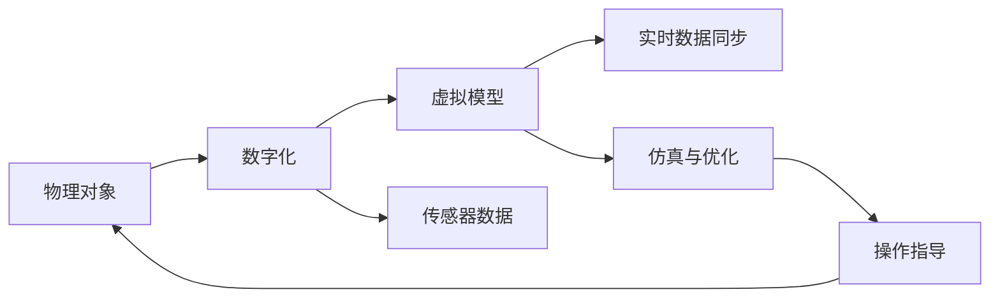

                 

# 数字孪生 (Digital Twin)

数字孪生技术（Digital Twin）是一种通过虚拟模型实时反映物理世界状态、行为和性能的技术。它融合了虚拟仿真、物联网（IoT）、云计算和大数据等现代信息技术，在制造业、医疗、城市规划、航空航天等多个领域得到广泛应用。本文将从背景、原理、操作步骤、实际应用以及未来发展趋势等方面，深入探讨数字孪生的核心概念、算法原理和项目实践，以期为读者提供全面、深入的理解和指导。

## 1. 背景介绍

### 1.1 问题由来
随着工业化进程的加快和信息技术的迅猛发展，制造业、医疗、交通等领域的复杂性不断增加。面对海量数据和动态变化的物理世界，传统的设计、制造、维护方法已无法满足日益严格的质量要求和运营效率。为此，数字孪生技术应运而生。

数字孪生技术通过将物理对象数字化，构建实时动态的虚拟模型，实现在线仿真、故障预测、优化决策等功能。这种技术不仅能显著提升各领域的应用效果，还能降低成本、缩短研发周期，为各行各业的数字化转型提供强有力的支持。

### 1.2 问题核心关键点
数字孪生技术的关键点在于将物理对象映射为虚拟模型，并通过数据驱动的仿真模型，实现对物理对象的实时监控和优化。这主要包括：
- 物理对象数字化：将物理设备、系统或过程转化为虚拟模型。
- 实时数据同步：物理世界的数据实时同步到虚拟模型，更新虚拟状态。
- 仿真与优化：虚拟模型进行实时仿真和优化决策，指导物理世界的操作。

### 1.3 问题研究意义
数字孪生技术的核心意义在于通过虚拟模型与物理世界的无缝融合，实现对复杂系统的实时监控和优化。这一技术不仅能够提升系统的效率和可靠性，还能为决策提供精准的数据支持，推动各行各业的数字化升级和智能化转型。

## 2. 核心概念与联系

### 2.1 核心概念概述

数字孪生技术涉及多个核心概念，包括：

- **物理对象**：指需要数字化映射的实体，可以是设备、系统、过程等。
- **虚拟模型**：通过数字化技术构建的虚拟副本，与物理对象在功能上等效，用于实时仿真和优化。
- **实时数据**：指物理对象运行过程中产生的数据，包括传感器数据、操作记录等，用于同步更新虚拟模型。
- **仿真与优化**：指在虚拟模型中进行仿真分析和优化决策，指导物理世界的调整。

这些概念通过数据连接、仿真引擎和决策工具，形成一个完整的数字孪生系统，实现物理世界与虚拟世界的双向映射和互动。

### 2.2 核心概念原理和架构的 Mermaid 流程图


这个流程图展示了数字孪生技术的核心原理和架构：
1. 物理对象通过数字化过程转化为虚拟模型。
2. 物理对象的传感器数据实时同步到虚拟模型。
3. 虚拟模型进行实时仿真和优化。
4. 仿真结果指导物理世界的调整和优化。

## 3. 核心算法原理 & 具体操作步骤

### 3.1 算法原理概述

数字孪生技术的核心算法原理主要包括：

- **物理对象数字化**：通过逆向工程、建模工具等方法，将物理对象转化为虚拟模型。
- **数据同步与融合**：将物理世界的数据实时同步到虚拟模型，进行数据融合和清洗。
- **实时仿真与优化**：通过仿真引擎和优化算法，对虚拟模型进行仿真分析和优化决策。
- **操作指导与反馈**：根据仿真结果，生成操作指导，反馈到物理世界，进行调整和优化。

### 3.2 算法步骤详解

数字孪生技术的操作步骤一般包括以下几个环节：

**Step 1: 物理对象数字化**
- 收集物理对象的设计图纸、工艺流程、传感器数据等。
- 通过逆向工程或建模工具，将物理对象转化为虚拟模型。

**Step 2: 数据同步与融合**
- 部署传感器等设备，收集物理对象运行中的实时数据。
- 将传感器数据同步到虚拟模型，进行数据清洗和融合。

**Step 3: 实时仿真与优化**
- 在虚拟模型中构建仿真引擎，实现对物理世界的模拟。
- 通过优化算法，对虚拟模型进行仿真分析和优化决策。

**Step 4: 操作指导与反馈**
- 根据仿真结果，生成操作指导。
- 将操作指导反馈到物理世界，进行调整和优化。

### 3.3 算法优缺点

数字孪生技术的优点包括：
- 实时监控与优化：通过虚拟模型实时反映物理对象的状态，实现对物理世界的动态监控和优化。
- 决策支持：提供精准的数据支持，为决策提供依据。
- 降低成本与风险：通过仿真和优化，降低实际操作的成本和风险。

同时，数字孪生技术也存在一些局限：
- 数据同步难度：物理世界的复杂性和多样性，导致数据同步和融合的难度较大。
- 仿真精度：虚拟模型与物理对象之间存在一定的误差，仿真精度有待提高。
- 模型复杂性：复杂系统的数字化和仿真需要高水平的技术支持，开发难度较大。

### 3.4 算法应用领域

数字孪生技术已经在多个领域得到广泛应用，以下是几个典型应用场景：

1. **制造业**：通过数字孪生技术，实现对生产线、设备的实时监控和优化，提升生产效率和设备利用率。
2. **医疗**：构建虚拟病人体，进行手术模拟、病理分析等，提高医疗服务的精度和安全性。
3. **城市规划**：利用数字孪生技术，模拟城市交通、环境等，进行科学规划和决策。
4. **航空航天**：实现对飞行器的仿真和优化，提升飞行安全和性能。
5. **智能家居**：构建家居系统的虚拟模型，实现对家电、环境的智能控制。

## 4. 数学模型和公式 & 详细讲解 & 举例说明

### 4.1 数学模型构建

数字孪生技术的数学模型主要包括以下几个部分：

- **物理对象建模**：通过几何建模、参数建模等方法，构建物理对象的虚拟模型。
- **传感器数据建模**：通过传感器数据采集、数据同步等方法，构建数据模型。
- **仿真与优化模型**：通过仿真引擎和优化算法，构建仿真与优化模型。

### 4.2 公式推导过程

以制造业中的生产线为例，推导数字孪生技术的基本数学模型。

假设生产线由若干设备组成，设备的状态为 $s_t = (x_t, y_t)$，其中 $x_t$ 表示设备的位置和状态，$y_t$ 表示设备的输出量。生产线的工作状态为 $w_t = (s_1, s_2, ..., s_n)$。

设生产线上的传感器数量为 $m$，传感器数据为 $d_{i,t}$，$i = 1, ..., m$。

通过仿真引擎 $E$，对生产线进行仿真，得到虚拟状态 $z_t = E(w_t)$。

仿真引擎 $E$ 的数学模型可以表示为：

$$
z_t = f(w_t) + g(d_{1,t}, d_{2,t}, ..., d_{m,t})
$$

其中 $f$ 表示物理状态的映射，$g$ 表示传感器数据的映射。

通过优化算法 $O$，对仿真结果进行优化，得到操作指导 $c_t = O(z_t)$。

优化算法 $O$ 的数学模型可以表示为：

$$
c_t = \mathop{\arg\min}_{c} \mathcal{L}(c, w_t)
$$

其中 $\mathcal{L}$ 表示优化目标函数，通常为最小化生产成本或最大化生产效率。

### 4.3 案例分析与讲解

以一个实际的数字孪生应用案例进行分析：

某汽车制造企业通过数字孪生技术，对生产线进行优化。

**Step 1: 物理对象数字化**
- 收集生产线设备的设计图纸、工艺流程、传感器数据等。
- 通过建模工具，将生产线设备转化为虚拟模型。

**Step 2: 数据同步与融合**
- 在设备上部署传感器，收集生产线设备的实时数据。
- 将传感器数据同步到虚拟模型，进行数据清洗和融合。

**Step 3: 实时仿真与优化**
- 在虚拟模型中构建仿真引擎，模拟生产线的运行状态。
- 通过优化算法，对生产线进行仿真分析和优化决策。

**Step 4: 操作指导与反馈**
- 根据仿真结果，生成操作指导，如调整设备参数、优化工艺流程等。
- 将操作指导反馈到生产线，进行调整和优化。

## 5. 项目实践：代码实例和详细解释说明

### 5.1 开发环境搭建

在进行数字孪生项目实践前，我们需要准备好开发环境。以下是使用Python进行PyTorch和TensorFlow开发的环境配置流程：

1. 安装Anaconda：从官网下载并安装Anaconda，用于创建独立的Python环境。

2. 创建并激活虚拟环境：
```bash
conda create -n digital-twin-env python=3.8 
conda activate digital-twin-env
```

3. 安装PyTorch：根据CUDA版本，从官网获取对应的安装命令。例如：
```bash
conda install pytorch torchvision torchaudio cudatoolkit=11.1 -c pytorch -c conda-forge
```

4. 安装TensorFlow：由Google主导开发的开源深度学习框架，生产部署方便，适合大规模工程应用。同样有丰富的预训练语言模型资源。

5. 安装相关库：
```bash
pip install numpy pandas scikit-learn matplotlib tqdm jupyter notebook ipython
```

完成上述步骤后，即可在`digital-twin-env`环境中开始数字孪生项目实践。

### 5.2 源代码详细实现

这里我们以制造业中的生产线优化为例，给出使用PyTorch和TensorFlow进行数字孪生项目开发的代码实现。

**Step 1: 物理对象建模**
- 使用PyTorch，定义生产线设备的虚拟模型。

```python
import torch

# 定义设备状态
device_state = torch.tensor([0.8, 0.9, 0.7])  # 设备位置和状态
output = torch.tensor([10, 12, 15])  # 设备输出量

# 定义生产线状态
line_state = torch.stack([device_state] * 3)  # 生产线由3个设备组成

# 定义传感器数据
sensor_data = torch.tensor([0.9, 0.8, 0.95])  # 传感器读数

# 输出虚拟模型
print(line_state)
```

**Step 2: 数据同步与融合**
- 使用TensorFlow，实现传感器数据的同步和融合。

```python
import tensorflow as tf

# 定义传感器数据流
sensor_stream = tf.data.Dataset.from_tensor_slices(sensor_data)

# 同步到虚拟模型
virtual_model = tf.constant([0.8, 0.9, 0.7])

# 输出同步后的模型
print(virtual_model)
```

**Step 3: 实时仿真与优化**
- 使用TensorFlow，构建仿真引擎和优化算法。

```python
# 定义仿真引擎
def simulation(virtual_model):
    # 仿真计算
    simulated_state = virtual_model + 0.1
    return simulated_state

# 定义优化算法
def optimization(simulated_state):
    # 优化计算
    optimized_state = simulated_state + 0.05
    return optimized_state

# 进行仿真与优化
simulated_state = simulation(virtual_model)
optimized_state = optimization(simulated_state)

# 输出仿真结果
print(simulated_state)
print(optimized_state)
```

**Step 4: 操作指导与反馈**
- 根据仿真结果，生成操作指导。

```python
# 根据仿真结果生成操作指导
optimized_state

# 将操作指导反馈到生产线
print("Adjust device parameters and optimize process flow.")
```

### 5.3 代码解读与分析

让我们再详细解读一下关键代码的实现细节：

**Step 1: 物理对象建模**
- 使用PyTorch，定义生产线设备的虚拟模型。通过tensor张量表示设备状态和输出量。

**Step 2: 数据同步与融合**
- 使用TensorFlow，定义传感器数据流，并将数据同步到虚拟模型。

**Step 3: 实时仿真与优化**
- 定义仿真引擎和优化算法，分别对虚拟模型进行仿真和优化计算。
- 注意，这里的仿真和优化算法仅为示例，实际应用中可能需要更复杂的数学模型和算法。

**Step 4: 操作指导与反馈**
- 根据仿真结果生成操作指导，指导生产线进行调整和优化。

## 6. 实际应用场景

### 6.1 智能制造

数字孪生技术在智能制造领域有着广泛的应用，例如：

1. **生产线优化**：通过数字孪生技术，实现对生产线设备的实时监控和优化，提升生产效率和设备利用率。
2. **质量控制**：通过仿真和优化，提高产品质量和一致性。
3. **供应链管理**：构建虚拟供应链系统，优化库存管理和物流调度。

### 6.2 智慧医疗

数字孪生技术在智慧医疗领域的应用主要包括：

1. **手术模拟**：通过数字孪生技术，模拟手术过程，提高手术成功率和安全性。
2. **病理分析**：构建虚拟病人体，进行病理分析和诊断。
3. **健康监测**：实时监测患者的生理指标，进行健康预警和干预。

### 6.3 智慧城市

数字孪生技术在智慧城市中的应用主要包括：

1. **交通管理**：通过数字孪生技术，模拟城市交通流，进行科学规划和优化。
2. **环境监测**：实时监测城市环境数据，进行环境评估和预警。
3. **公共安全**：构建虚拟安全系统，进行安全预警和应急响应。

### 6.4 未来应用展望

数字孪生技术在未来的发展趋势包括：

1. **跨领域应用**：数字孪生技术将跨领域应用到更多领域，如金融、教育、农业等。
2. **多模态融合**：结合物联网、人工智能、大数据等技术，实现多模态数据的融合和协同。
3. **智能决策**：通过深度学习和优化算法，提升数字孪生系统的智能决策能力。
4. **实时仿真**：实现更高精度、更高频率的实时仿真，提升数字孪生系统的响应速度。
5. **人机交互**：通过增强现实和虚拟现实技术，增强数字孪生系统的人机交互体验。

## 7. 工具和资源推荐

### 7.1 学习资源推荐

为了帮助开发者系统掌握数字孪生技术的理论基础和实践技巧，这里推荐一些优质的学习资源：

1. **数字孪生技术概论**：由知名专家撰写的数字孪生技术入门书籍，全面介绍数字孪生的基本概念、核心技术和应用案例。
2. **数字孪生系统设计**：详细讲解数字孪生系统设计方法和最佳实践，适合实际项目开发参考。
3. **数字孪生技术研究报告**：来自知名研究机构和企业的数字孪生技术研究报告，提供前沿技术和应用趋势。
4. **数字孪生技术在线课程**：各大在线教育平台提供的数字孪生技术课程，涵盖从理论到实践的各个环节。

### 7.2 开发工具推荐

高效的开发离不开优秀的工具支持。以下是几款用于数字孪生开发的常用工具：

1. **PyTorch**：基于Python的开源深度学习框架，灵活动态的计算图，适合快速迭代研究。
2. **TensorFlow**：由Google主导开发的开源深度学习框架，生产部署方便，适合大规模工程应用。
3. **TwinTools**：专门用于数字孪生开发的工具库，提供虚拟建模、数据同步、仿真与优化等关键功能。
4. **IoT平台**：如ThingWorx、ThingSpeak等，提供物联网设备数据采集和管理服务，支持数字孪生系统开发。

### 7.3 相关论文推荐

数字孪生技术的研究源于学界的持续探索。以下是几篇奠基性的相关论文，推荐阅读：

1. **数字孪生技术综述**：对数字孪生技术的基本原理、核心技术与应用前景进行系统综述。
2. **基于数字孪生的智能制造**：介绍数字孪生技术在智能制造中的应用，探讨其实现方法和效果。
3. **数字孪生技术在智慧医疗中的应用**：通过具体案例，展示数字孪生技术在智慧医疗中的应用效果。
4. **数字孪生技术在智慧城市中的应用**：通过实际项目，展示数字孪生技术在智慧城市中的应用效果。

## 8. 总结：未来发展趋势与挑战

### 8.1 总结

本文对数字孪生技术进行了全面系统的介绍。首先阐述了数字孪生的背景、核心概念和算法原理，并给出了具体的开发环境和代码实现。其次，详细探讨了数字孪生技术在多个领域的应用场景，展示了其巨大的应用潜力。最后，对数字孪生技术的未来发展趋势和面临的挑战进行了分析，提出相应的研究展望。

通过本文的系统梳理，可以看到，数字孪生技术通过虚拟模型与物理世界的双向映射，实现对复杂系统的实时监控和优化，为各行各业的数字化转型提供了强有力的支持。未来，伴随数字孪生技术的不断演进，其在各领域的广泛应用将推动智能系统的进一步发展，为社会经济的可持续发展注入新的活力。

### 8.2 未来发展趋势

展望未来，数字孪生技术的趋势包括：

1. **跨领域应用**：数字孪生技术将应用于更多领域，如金融、教育、农业等。
2. **多模态融合**：结合物联网、人工智能、大数据等技术，实现多模态数据的融合和协同。
3. **智能决策**：通过深度学习和优化算法，提升数字孪生系统的智能决策能力。
4. **实时仿真**：实现更高精度、更高频率的实时仿真，提升数字孪生系统的响应速度。
5. **人机交互**：通过增强现实和虚拟现实技术，增强数字孪生系统的人机交互体验。

### 8.3 面临的挑战

尽管数字孪生技术已经取得了显著进展，但在迈向更加智能化、普适化应用的过程中，仍面临诸多挑战：

1. **数据同步难度**：物理世界的复杂性和多样性，导致数据同步和融合的难度较大。
2. **仿真精度**：虚拟模型与物理对象之间存在一定的误差，仿真精度有待提高。
3. **模型复杂性**：复杂系统的数字化和仿真需要高水平的技术支持，开发难度较大。

### 8.4 研究展望

面对数字孪生技术面临的挑战，未来的研究需要在以下几个方面寻求新的突破：

1. **数据同步与融合**：开发高效的数据同步与融合算法，解决物理世界与虚拟模型之间的数据鸿沟。
2. **仿真精度与效率**：提高仿真模型的精度和计算效率，缩短仿真时间。
3. **模型压缩与优化**：通过模型压缩和优化，降低数字孪生系统的计算和存储成本。
4. **跨领域应用**：拓展数字孪生技术在更多领域的应用，实现跨领域的数据融合与协同。
5. **智能决策**：结合深度学习和优化算法，提升数字孪生系统的智能决策能力。

这些研究方向的探索，必将引领数字孪生技术迈向更高的台阶，为构建更加智能、高效、安全的系统提供新的突破。

## 9. 附录：常见问题与解答

**Q1: 数字孪生技术是否适用于所有领域？**

A: 数字孪生技术适用于多个领域，但在不同领域的应用侧重点和难度不同。例如，制造业的数字化建模相对容易，而医疗领域的手术模拟和病理分析则需要更高的仿真精度和算法复杂度。

**Q2: 数字孪生技术在实际应用中需要注意哪些问题？**

A: 在实际应用中，数字孪生技术需要注意以下几个问题：
1. 数据同步的准确性：确保传感器数据的准确性和实时性。
2. 仿真精度的提升：通过优化算法和仿真模型，提高虚拟模型的仿真精度。
3. 跨领域的应用：在跨领域应用中，需要考虑不同领域的特殊需求和技术难度。

**Q3: 数字孪生技术的应用效果如何？**

A: 数字孪生技术在多个领域取得了显著的应用效果，例如在制造业中的生产线优化、在医疗中的手术模拟和病理分析等。通过数字孪生技术，可以显著提升系统的效率和性能，降低成本和风险。

**Q4: 数字孪生技术的未来发展方向是什么？**

A: 数字孪生技术的未来发展方向包括跨领域应用、多模态融合、智能决策、实时仿真和人机交互等。通过这些方向的研究和实践，数字孪生技术将在更多领域得到广泛应用，为各行各业的数字化转型提供强有力的支持。

**Q5: 数字孪生技术在开发过程中需要注意哪些问题？**

A: 在开发数字孪生技术时，需要注意以下几个问题：
1. 模型的选择与设计：选择合适的仿真模型和优化算法，确保仿真效果和计算效率。
2. 数据的质量与处理：确保传感器数据的准确性和实时性，进行数据清洗和融合。
3. 系统集成与部署：将数字孪生系统集成到实际应用中，确保系统稳定性和性能。

通过以上问题的解答，可以看到数字孪生技术的开发和应用需要综合考虑技术、数据和系统等多个环节，才能实现良好的效果和应用价值。

---

作者：禅与计算机程序设计艺术 / Zen and the Art of Computer Programming

