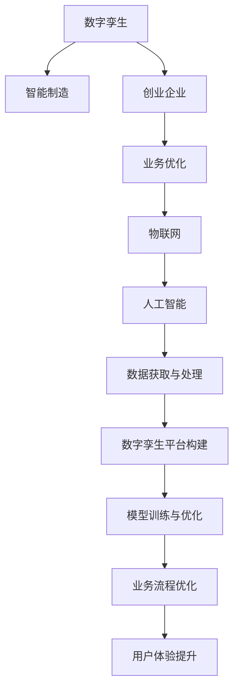

                 

# 数字孪生创业：虚实结合的业务优化

> 关键词：数字孪生，创业，虚实融合，业务优化，智能制造，企业决策支持

## 1. 背景介绍

### 1.1 问题由来

随着信息技术和制造业的深度融合，数字孪生技术在各行各业的应用日益广泛。数字孪生（Digital Twin）是指在虚拟空间中构建与现实世界对应的一对一模型，用于模拟、监控、优化和预测现实世界的运行状态。在制造业领域，数字孪生可以用于生产设备状态监控、供应链管理、产品质量控制等各个环节，极大地提高了生产效率和产品质量。然而，尽管数字孪生技术在制造业中已经得到了广泛应用，但在创业企业中，数字孪生技术的应用仍处于起步阶段，亟待进一步探索和挖掘其潜力。

### 1.2 问题核心关键点

数字孪生创业的核心在于将数字孪生技术应用于创业企业的业务优化。创业企业通常面临资源有限、市场竞争激烈等问题，如何利用数字孪生技术提升企业的运营效率、降低运营成本、优化产品设计和提升用户体验，成为数字孪生创业的重要挑战。

数字孪生创业的关键点包括：

1. **数据获取与处理**：数据是数字孪生的核心，创业企业需要从生产设备、供应链、用户等多个环节收集和处理数据，为数字孪生系统的构建和优化提供支持。

2. **数字孪生平台构建**：创业企业需要构建适应其业务特点的数字孪生平台，实现虚拟与现实的联动。

3. **模型训练与优化**：创业企业需要开发和训练适应其业务场景的模型，并通过不断的优化提升模型的预测和决策能力。

4. **业务流程优化**：创业企业需要利用数字孪生技术优化其业务流程，提升生产效率和产品质量。

5. **用户体验提升**：创业企业需要利用数字孪生技术提升用户体验，增强用户粘性。

## 2. 核心概念与联系

### 2.1 核心概念概述

为更好地理解数字孪生创业，本节将介绍几个密切相关的核心概念：

- **数字孪生（Digital Twin）**：在虚拟空间中构建与现实世界对应的一对一模型，用于模拟、监控、优化和预测现实世界的运行状态。数字孪生技术可以应用于制造业、医疗、交通等多个领域。

- **智能制造（Smart Manufacturing）**：利用信息技术和网络技术对制造过程进行智能化优化，提升生产效率和产品质量。智能制造是数字孪生技术在制造业中的重要应用。

- **创业企业（Startup）**：指创立初期的企业，通常资源有限，面临着市场竞争激烈、资金不足等问题。

- **业务优化（Business Optimization）**：通过技术手段对企业的业务流程、产品设计、用户体验等进行优化，提升企业运营效率和市场竞争力。

- **物联网（IoT）**：通过传感器、智能设备等技术，实现设备互联和数据实时采集，是数字孪生技术的重要基础。

- **人工智能（AI）**：利用机器学习、深度学习等技术，对数据进行智能分析和预测，是数字孪生技术的重要组成部分。

这些核心概念之间的逻辑关系可以通过以下Mermaid流程图来展示：



这个流程图展示了大语言模型的核心概念及其之间的关系：

1. 数字孪生通过物联网和人工智能技术获取数据，构建虚拟与现实的一对一模型。
2. 智能制造利用数字孪生技术进行生产设备状态监控、供应链管理等，提升生产效率和产品质量。
3. 创业企业通过构建数字孪生平台，优化业务流程，提升用户体验，增强市场竞争力。
4. 数据获取与处理、模型训练与优化、业务流程优化和用户体验提升等是数字孪生创业的关键环节。

## 3. 核心算法原理 & 具体操作步骤
### 3.1 算法原理概述

数字孪生创业的算法原理主要包括以下几个方面：

1. **数据采集与处理**：通过传感器、智能设备等技术，实现设备互联和数据实时采集，构建虚拟模型。

2. **模型训练与优化**：利用机器学习、深度学习等技术，训练适应业务场景的模型，并通过不断的优化提升模型的预测和决策能力。

3. **业务流程优化**：通过数字孪生技术，优化业务流程，提升生产效率和产品质量。

4. **用户体验提升**：利用数字孪生技术，提升用户体验，增强用户粘性。

5. **实时监控与预测**：通过数字孪生技术，实时监控设备状态，预测未来趋势，为创业企业的决策提供支持。

### 3.2 算法步骤详解

基于数字孪生创业的算法步骤可以概括为以下几个关键步骤：

**Step 1: 数据采集与处理**
- 通过传感器、智能设备等技术，采集生产设备、供应链、用户等多个环节的数据。
- 对采集到的数据进行清洗、筛选、融合等处理，确保数据的质量和完整性。

**Step 2: 数字孪生平台构建**
- 根据创业企业的业务特点，选择合适的数字孪生平台构建技术，如3D CAD、虚拟现实（VR）、增强现实（AR）等。
- 将采集到的数据映射到虚拟模型中，实现虚拟与现实的联动。

**Step 3: 模型训练与优化**
- 根据业务需求，选择合适的机器学习、深度学习模型，如卷积神经网络（CNN）、长短期记忆网络（LSTM）、变分自编码器（VAE）等。
- 利用采集到的数据训练模型，并通过不断的优化提升模型的预测和决策能力。

**Step 4: 业务流程优化**
- 利用数字孪生技术，优化生产流程、供应链管理、质量控制等业务环节。
- 通过实时监控和预测，及时调整生产计划和资源配置，提升生产效率和产品质量。

**Step 5: 用户体验提升**
- 利用数字孪生技术，提升产品设计和用户交互体验。
- 通过实时反馈和用户行为分析，不断优化产品设计和用户界面，增强用户粘性。

### 3.3 算法优缺点

数字孪生创业的算法具有以下优点：

1. **提升生产效率**：数字孪生技术可以实时监控生产设备状态，优化生产流程，提升生产效率。

2. **降低运营成本**：数字孪生技术可以优化供应链管理，减少库存和资源浪费，降低运营成本。

3. **优化产品设计**：数字孪生技术可以实时反馈用户需求和市场趋势，优化产品设计和功能，提升产品质量和市场竞争力。

4. **增强用户体验**：数字孪生技术可以实时监控和预测用户行为，提升用户体验，增强用户粘性。

5. **支持决策支持**：数字孪生技术可以实时监控和预测生产设备状态，支持企业决策，提升管理水平。

然而，数字孪生创业的算法也存在以下缺点：

1. **数据质量要求高**：数字孪生技术依赖于高质量的数据，数据采集和处理环节需要投入大量资源和技术支持。

2. **技术门槛高**：数字孪生创业需要较强的技术储备，创业企业需要投入大量人力和财力进行技术研发和应用。

3. **初期投入高**：数字孪生创业的初期投入较大，创业企业需要有一定的资金基础和市场资源。

4. **技术成熟度不足**：数字孪生技术还处于快速发展阶段，部分技术成熟度不足，可能面临技术风险和市场风险。

### 3.4 算法应用领域

数字孪生创业的算法已经在多个领域得到了广泛应用，包括但不限于：

- **智能制造**：通过数字孪生技术，实现生产设备状态监控、供应链管理、质量控制等，提升生产效率和产品质量。

- **智慧医疗**：通过数字孪生技术，实现患者健康数据监控、医疗资源优化等，提升医疗服务水平和患者体验。

- **智慧城市**：通过数字孪生技术，实现城市基础设施监控、交通管理、环境监测等，提升城市管理水平和居民生活质量。

- **数字金融**：通过数字孪生技术，实现金融资产风险评估、市场预测等，提升金融服务水平和风险控制能力。

- **智慧农业**：通过数字孪生技术，实现农作物生长监控、土壤环境监测等，提升农业生产效率和产品质量。

这些应用领域展示了数字孪生创业的广阔前景，为创业企业提供了更多业务优化和创新的机会。

## 4. 数学模型和公式 & 详细讲解 & 举例说明

### 4.1 数学模型构建

数字孪生创业的数学模型主要包括以下几个方面：

1. **数据采集与处理模型**：用于描述数据采集和处理过程，确保数据的质量和完整性。

2. **数字孪生平台构建模型**：用于描述虚拟模型和现实世界的一一对应关系，确保虚拟与现实的联动。

3. **模型训练与优化模型**：用于描述模型的训练和优化过程，提升模型的预测和决策能力。

4. **业务流程优化模型**：用于描述业务流程的优化过程，提升生产效率和产品质量。

5. **用户体验提升模型**：用于描述用户体验的提升过程，增强用户粘性。

6. **实时监控与预测模型**：用于描述实时监控和预测过程，支持企业决策。

### 4.2 公式推导过程

以数字孪生创业中的智能制造为例，推导生产设备状态监控的数学模型。

假设生产设备的状态为 $x_i$，采集到的实时数据为 $y_i$，状态监测模型为 $f(x_i; \theta)$，其中 $\theta$ 为模型的参数。

根据数据采集和处理模型，有：

$$
y_i = H(x_i) + \epsilon
$$

其中 $H(x_i)$ 为数据处理函数，$\epsilon$ 为噪声。

根据模型训练与优化模型，有：

$$
\theta = \mathop{\arg\min}_{\theta} \frac{1}{N} \sum_{i=1}^N \| y_i - f(x_i; \theta) \|^2
$$

其中 $N$ 为样本数量，$\| \cdot \|$ 为范数。

通过不断的训练和优化，可以得到最优的模型参数 $\theta^*$，用于实时监控和预测生产设备的状态。

### 4.3 案例分析与讲解

以某制造企业为例，分析数字孪生创业的实际应用案例。

假设某制造企业生产智能设备，采集到的实时数据包括设备温度、湿度、振动等参数。通过数字孪生技术，构建设备状态监控模型，实时监控设备状态，预测设备故障，提升生产效率和产品质量。

具体步骤包括：

1. **数据采集与处理**：通过传感器采集设备温度、湿度、振动等参数，利用数据处理函数 $H(x_i)$ 进行清洗和筛选，确保数据质量。

2. **数字孪生平台构建**：利用3D CAD技术，构建设备虚拟模型，实现虚拟与现实的联动。

3. **模型训练与优化**：利用采集到的实时数据 $y_i$，训练生产设备状态监控模型 $f(x_i; \theta)$，并通过不断的优化提升模型的预测能力。

4. **业务流程优化**：根据实时监控和预测结果，优化生产计划和资源配置，提升生产效率和产品质量。

5. **用户体验提升**：通过实时反馈和用户行为分析，不断优化产品设计和用户界面，增强用户粘性。

6. **实时监控与预测**：实时监控设备状态，预测设备故障，支持企业决策，提升管理水平。

## 5. 项目实践：代码实例和详细解释说明
### 5.1 开发环境搭建

在进行数字孪生创业的实践前，我们需要准备好开发环境。以下是使用Python进行开发的环境配置流程：

1. 安装Anaconda：从官网下载并安装Anaconda，用于创建独立的Python环境。

2. 创建并激活虚拟环境：
```bash
conda create -n dt_env python=3.8 
conda activate dt_env
```

3. 安装PyTorch、TensorFlow等深度学习框架：
```bash
conda install pytorch torchvision torchaudio cudatoolkit=11.1 -c pytorch -c conda-forge
conda install tensorflow
```

4. 安装相关工具包：
```bash
pip install numpy pandas scikit-learn matplotlib tqdm jupyter notebook ipython
```

完成上述步骤后，即可在`dt_env`环境中开始数字孪生创业的实践。

### 5.2 源代码详细实现

下面我们以生产设备状态监控为例，给出使用TensorFlow进行数字孪生创业的PyTorch代码实现。

首先，定义数据处理函数：

```python
import tensorflow as tf
from tensorflow.keras import layers

def data_preprocess(data):
    # 数据清洗和筛选
    cleaned_data = data[data['temperature'] > 0 & data['humidity'] > 0]
    # 数据标准化
    standardized_data = (cleaned_data - cleaned_data.mean()) / cleaned_data.std()
    # 数据拆分
    train_data, test_data = standardized_data[:70], standardized_data[70:]
    # 数据归一化
    train_data = train_data / 1000
    test_data = test_data / 1000
    return train_data, test_data
```

然后，定义模型：

```python
def build_model():
    # 定义模型结构
    model = tf.keras.Sequential([
        layers.Dense(64, activation='relu', input_shape=(4,)),
        layers.Dense(64, activation='relu'),
        layers.Dense(1, activation='sigmoid')
    ])
    # 编译模型
    model.compile(optimizer='adam', loss='binary_crossentropy', metrics=['accuracy'])
    return model
```

接着，定义训练和评估函数：

```python
def train_model(model, train_data, test_data):
    # 训练模型
    model.fit(train_data, train_data[:, 3], epochs=100, batch_size=32, validation_data=(test_data, test_data[:, 3]))
    # 评估模型
    test_loss, test_acc = model.evaluate(test_data, test_data[:, 3])
    print(f'Test Loss: {test_loss:.4f}, Test Accuracy: {test_acc:.4f}')

# 加载数据
data = pd.read_csv('device_data.csv')

# 数据预处理
train_data, test_data = data_preprocess(data)

# 模型构建
model = build_model()

# 模型训练与优化
train_model(model, train_data, test_data)
```

以上就是使用TensorFlow进行数字孪生创业的完整代码实现。可以看到，通过TensorFlow等深度学习框架，我们可以用相对简洁的代码实现数字孪生创业的核心功能。

### 5.3 代码解读与分析

让我们再详细解读一下关键代码的实现细节：

**data_preprocess函数**：
- 该函数用于数据清洗、筛选、标准化和拆分，确保数据的质量和完整性。
- 首先，筛选出温度和湿度大于0的数据，以确保数据的有效性。
- 然后，对数据进行标准化处理，将数据转换到均值为0、方差为1的标准正态分布中。
- 最后，将数据按照70:30的比例拆分为训练集和测试集，并进行归一化处理。

**build_model函数**：
- 该函数用于定义和编译数字孪生创业中的生产设备状态监控模型。
- 模型由两个全连接层和一个输出层组成，使用ReLU激活函数和Sigmoid激活函数。
- 编译模型时，使用Adam优化器和二元交叉熵损失函数，并设置准确率作为评估指标。

**train_model函数**：
- 该函数用于训练数字孪生创业中的生产设备状态监控模型。
- 首先，使用训练集数据和输出标签训练模型，设置100个epochs和32个批次的训练周期。
- 然后，在测试集上评估模型性能，输出测试损失和准确率。

**加载数据**：
- 使用Pandas库加载设备状态监控的数据集，包括温度、湿度、振动、输出标签等字段。

**数据预处理**：
- 使用自定义的data_preprocess函数对数据进行清洗、筛选、标准化和拆分。
- 数据预处理是数字孪生创业中至关重要的一环，决定了模型的训练效果和预测能力。

**模型构建**：
- 使用TensorFlow定义生产设备状态监控模型，包括输入层、隐藏层和输出层。
- 模型结构的选择和设计是数字孪生创业中的关键环节，决定了模型的预测能力。

**模型训练与优化**：
- 使用训练集数据和输出标签训练模型，优化模型参数，提升模型预测能力。
- 训练过程中，使用测试集数据进行验证，调整模型参数，防止过拟合。

**运行结果展示**：
- 在测试集上评估模型性能，输出测试损失和准确率。
- 根据测试结果，分析模型的优缺点，调整模型结构，进一步提升模型性能。

## 6. 实际应用场景

### 6.1 智能制造

数字孪生创业在智能制造中的应用非常广泛，可以实现生产设备状态监控、供应链管理、质量控制等，提升生产效率和产品质量。

例如，某制造企业通过数字孪生技术，构建设备状态监控模型，实时监控设备温度、振动等参数，预测设备故障，优化生产计划和资源配置，提升生产效率和产品质量。

### 6.2 智慧医疗

数字孪生创业在智慧医疗中的应用也日益增多，可以实现患者健康数据监控、医疗资源优化等，提升医疗服务水平和患者体验。

例如，某医院通过数字孪生技术，构建患者健康数据监控模型，实时监控患者生命体征数据，预测病情变化，优化医疗资源配置，提升医疗服务水平和患者体验。

### 6.3 智慧城市

数字孪生创业在智慧城市中的应用也逐渐兴起，可以实现城市基础设施监控、交通管理、环境监测等，提升城市管理水平和居民生活质量。

例如，某城市通过数字孪生技术，构建交通管理模型，实时监控交通流量和路况，优化交通信号灯和道路布局，提升交通管理水平和居民出行体验。

### 6.4 数字金融

数字孪生创业在数字金融中的应用也正在展开，可以实现金融资产风险评估、市场预测等，提升金融服务水平和风险控制能力。

例如，某金融公司通过数字孪生技术，构建金融资产风险评估模型，实时监控金融市场动态，预测资产价格变化，优化投资组合和风险控制策略，提升金融服务水平和风险控制能力。

### 6.5 智慧农业

数字孪生创业在智慧农业中的应用也在逐步拓展，可以实现农作物生长监控、土壤环境监测等，提升农业生产效率和产品质量。

例如，某农业公司通过数字孪生技术，构建农作物生长监控模型，实时监控土壤湿度、温度、光照等参数，预测作物生长状态，优化种植计划和资源配置，提升农业生产效率和产品质量。

## 7. 工具和资源推荐

### 7.1 学习资源推荐

为了帮助开发者系统掌握数字孪生创业的理论基础和实践技巧，这里推荐一些优质的学习资源：

1. 《数字孪生：制造行业的应用与挑战》系列博文：由数字孪生领域专家撰写，深入浅出地介绍了数字孪生在制造业中的应用和挑战。

2. CS344《数字孪生技术》课程：某知名大学开设的数字孪生技术课程，涵盖了数字孪生的概念、应用、技术和挑战。

3. 《数字孪生技术与应用》书籍：数字孪生领域的经典著作，全面介绍了数字孪生的原理、技术和应用。

4. 数字孪生开源项目：包括多个数字孪生技术和应用的开源项目，如Digital Twin、Twins、Vaex等，提供了丰富的代码和文档。

5. Digital Twin Consortium：数字孪生领域的国际性组织，定期发布数字孪生的标准、白皮书和技术报告，提供了丰富的学习资源。

通过对这些资源的学习实践，相信你一定能够快速掌握数字孪生创业的理论基础和实践技巧，并用于解决实际的数字孪生问题。

### 7.2 开发工具推荐

高效的开发离不开优秀的工具支持。以下是几款用于数字孪生创业开发的常用工具：

1. TensorFlow：由Google主导开发的开源深度学习框架，支持大规模分布式训练和部署，是数字孪生创业的重要工具。

2. PyTorch：由Facebook主导开发的开源深度学习框架，支持动态计算图和丰富的Tensor操作，适合快速迭代研究。

3. Digital Twin Consortium（DTC）工具：DTC提供的开源数字孪生工具，包括Twins、Vaex等，提供了丰富的数字孪生开发和部署支持。

4. OpenCV：用于图像和视频处理的开源库，支持数字孪生创业中的视觉处理任务。

5. Simulink：用于系统模拟和仿真的开源工具，支持数字孪生创业中的仿真任务。

6. ROS：用于机器人控制和仿真的开源框架，支持数字孪生创业中的机器人控制和仿真任务。

合理利用这些工具，可以显著提升数字孪生创业的开发效率，加快创新迭代的步伐。

### 7.3 相关论文推荐

数字孪生创业的研究源于学界的持续研究。以下是几篇奠基性的相关论文，推荐阅读：

1. A Survey on Digital Twin: From Concepts to Implementation：总结了数字孪生的概念、技术、应用和挑战，为数字孪生创业提供了理论基础。

2. Digital Twins for the Industry 4.0：介绍了数字孪生在工业4.0中的应用，包括智能制造、智慧城市、智慧医疗等。

3. Real-time Monitoring and Fault Prediction of Smart Manufacturing Equipment：通过数字孪生技术实现智能制造设备的实时监控和故障预测，为数字孪生创业提供了实际案例。

4. Digital Twins for Medical Systems: A Survey：介绍了数字孪生在医疗系统中的应用，包括患者健康数据监控、医疗资源优化等。

5. Digital Twins for Smart Cities：介绍了数字孪生在智慧城市中的应用，包括城市基础设施监控、交通管理、环境监测等。

这些论文代表了大语言模型微调技术的发展脉络。通过学习这些前沿成果，可以帮助研究者把握学科前进方向，激发更多的创新灵感。

## 8. 总结：未来发展趋势与挑战

### 8.1 总结

本文对数字孪生创业进行了全面系统的介绍。首先阐述了数字孪生创业的研究背景和意义，明确了数字孪生在创业企业的业务优化中的重要价值。其次，从原理到实践，详细讲解了数字孪生创业的数学模型和关键步骤，给出了数字孪生创业的完整代码实例。同时，本文还广泛探讨了数字孪生创业在智能制造、智慧医疗、智慧城市等多个领域的应用前景，展示了数字孪生创业的广阔前景。此外，本文精选了数字孪生创业的学习资源，力求为读者提供全方位的技术指引。

通过本文的系统梳理，可以看到，数字孪生创业具有广阔的发展前景，为创业企业提供了更多业务优化和创新的机会。未来，伴随数字孪生技术的不断演进，数字孪生创业必将在更多领域得到应用，为创业企业带来新的突破和机遇。

### 8.2 未来发展趋势

展望未来，数字孪生创业技术将呈现以下几个发展趋势：

1. **技术不断演进**：数字孪生创业技术将不断演进，出现更多高效、灵活的开发工具和算法，提升数字孪生创业的开发效率和预测精度。

2. **行业应用广泛**：数字孪生创业将在更多行业领域得到应用，如智能制造、智慧医疗、智慧城市等，拓展数字孪生创业的应用场景。

3. **数据融合深化**：数字孪生创业将进一步深化数据融合，实现跨领域数据的整合和协同，提升数字孪生创业的预测和决策能力。

4. **智慧决策支持**：数字孪生创业将进一步融合智慧决策支持系统，实现实时监控和预测，优化决策过程，提升决策水平。

5. **人机协同增强**：数字孪生创业将进一步增强人机协同能力，通过实时反馈和智能建议，提升用户体验和满意度。

6. **跨界融合拓展**：数字孪生创业将进一步拓展跨界融合，结合物联网、人工智能、区块链等技术，提升数字孪生创业的创新性和应用价值。

以上趋势凸显了数字孪生创业技术的广阔前景。这些方向的探索发展，必将进一步提升数字孪生创业的性能和应用范围，为创业企业带来新的突破和机遇。

### 8.3 面临的挑战

尽管数字孪生创业技术已经取得了显著进展，但在迈向更加智能化、普适化应用的过程中，仍面临诸多挑战：

1. **数据质量问题**：数字孪生创业依赖高质量的数据，数据采集和处理环节需要投入大量资源和技术支持。如何提升数据质量，确保数据的准确性和完整性，是数字孪生创业中的重要挑战。

2. **技术成熟度不足**：数字孪生创业技术还处于快速发展阶段，部分技术成熟度不足，可能面临技术风险和市场风险。如何提升技术的成熟度和可靠性，是数字孪生创业中的重要课题。

3. **成本投入高**：数字孪生创业的初期投入较大，创业企业需要有一定的资金基础和市场资源。如何降低成本，提升数字孪生创业的可行性和可扩展性，是数字孪生创业中的重要挑战。

4. **用户体验提升难度大**：数字孪生创业需要提升用户体验，增强用户粘性。然而，提升用户体验是一个复杂而耗时的过程，如何提升用户体验，优化产品设计和用户界面，是数字孪生创业中的重要挑战。

5. **安全性和隐私保护**：数字孪生创业需要保护用户隐私和数据安全，避免数据泄露和滥用。如何加强数据安全性和隐私保护，是数字孪生创业中的重要挑战。

### 8.4 研究展望

面对数字孪生创业所面临的种种挑战，未来的研究需要在以下几个方面寻求新的突破：

1. **数据采集与处理技术**：研究高效、鲁棒的数据采集与处理技术，提升数据质量和完整性，确保数字孪生创业的预测和决策能力。

2. **数字孪生平台构建**：研究灵活、高效的数字孪生平台构建技术，支持不同类型的数字孪生应用场景。

3. **模型训练与优化算法**：研究高效、灵活的模型训练与优化算法，提升数字孪生创业的预测和决策能力。

4. **业务流程优化技术**：研究适应不同业务场景的数字孪生优化技术，提升数字孪生创业的运营效率和产品质量。

5. **用户体验提升技术**：研究提升用户体验的技术，优化产品设计和用户界面，增强用户粘性。

6. **数字孪生安全与隐私保护技术**：研究数字孪生安全与隐私保护技术，确保数据安全性和隐私保护。

这些研究方向的探索，必将引领数字孪生创业技术迈向更高的台阶，为创业企业带来更多的创新和突破。面向未来，数字孪生创业技术还需要与其他人工智能技术进行更深入的融合，如知识表示、因果推理、强化学习等，多路径协同发力，共同推动数字孪生创业的进步。只有勇于创新、敢于突破，才能不断拓展数字孪生创业的边界，让数字孪生创业技术更好地造福创业企业和社会。

## 9. 附录：常见问题与解答

**Q1：数字孪生创业是否适用于所有创业企业？**

A: 数字孪生创业并不适用于所有创业企业，特别是那些资源有限、技术储备不足的企业。数字孪生创业需要一定的资金基础和市场资源，对于技术要求较高的企业来说，需要慎重考虑。

**Q2：数字孪生创业需要哪些关键技术？**

A: 数字孪生创业需要以下关键技术：

1. **数据采集与处理技术**：用于获取高质量的数据，确保数据的准确性和完整性。

2. **数字孪生平台构建技术**：用于构建虚拟模型和实现虚拟与现实的联动。

3. **模型训练与优化技术**：用于训练和优化数字孪生模型，提升模型的预测和决策能力。

4. **业务流程优化技术**：用于优化生产流程、供应链管理等业务环节，提升生产效率和产品质量。

5. **用户体验提升技术**：用于提升产品设计和用户交互体验，增强用户粘性。

6. **数字孪生安全与隐私保护技术**：用于保护用户隐私和数据安全，避免数据泄露和滥用。

**Q3：数字孪生创业的初期投入如何控制？**

A: 数字孪生创业的初期投入较大，需要一定的资金基础和市场资源。为控制初期投入，可以采取以下措施：

1. **选择适合的技术方案**：选择适合的技术方案和工具，避免盲目投资。

2. **逐步迭代开发**：采用逐步迭代开发的方式，先构建最小可行产品（MVP），逐步优化和扩展。

3. **合理规划预算**：合理规划预算，确保资源分配合理，避免过度投入。

4. **寻找合作伙伴**：寻找合作伙伴，共同承担开发和推广成本。

5. **优化商业模式**：优化商业模式，通过服务化、订阅制等方式，降低一次性投入。

**Q4：数字孪生创业在落地应用中需要注意哪些问题？**

A: 数字孪生创业在落地应用中需要注意以下问题：

1. **数据质量**：确保数据的质量和完整性，避免因数据问题影响模型效果。

2. **技术成熟度**：确保技术的成熟度和可靠性，避免因技术问题影响系统稳定性和性能。

3. **成本控制**：合理控制成本，避免因成本问题影响企业盈利能力。

4. **用户体验**：提升用户体验，优化产品设计和用户界面，增强用户粘性。

5. **数据安全与隐私保护**：确保数据安全性和隐私保护，避免因数据泄露和滥用影响企业声誉和客户信任。

**Q5：数字孪生创业的未来发展方向是什么？**

A: 数字孪生创业的未来发展方向包括：

1. **技术演进**：数字孪生创业技术将不断演进，出现更多高效、灵活的开发工具和算法。

2. **行业应用广泛**：数字孪生创业将在更多行业领域得到应用，拓展数字孪生创业的应用场景。

3. **数据融合深化**：数字孪生创业将进一步深化数据融合，实现跨领域数据的整合和协同。

4. **智慧决策支持**：数字孪生创业将进一步融合智慧决策支持系统，优化决策过程，提升决策水平。

5. **人机协同增强**：数字孪生创业将进一步增强人机协同能力，通过实时反馈和智能建议，提升用户体验和满意度。

6. **跨界融合拓展**：数字孪生创业将进一步拓展跨界融合，结合物联网、人工智能、区块链等技术，提升数字孪生创业的创新性和应用价值。

这些发展方向凸显了数字孪生创业技术的广阔前景，为创业企业带来了新的突破和机遇。

---

作者：禅与计算机程序设计艺术 / Zen and the Art of Computer Programming

