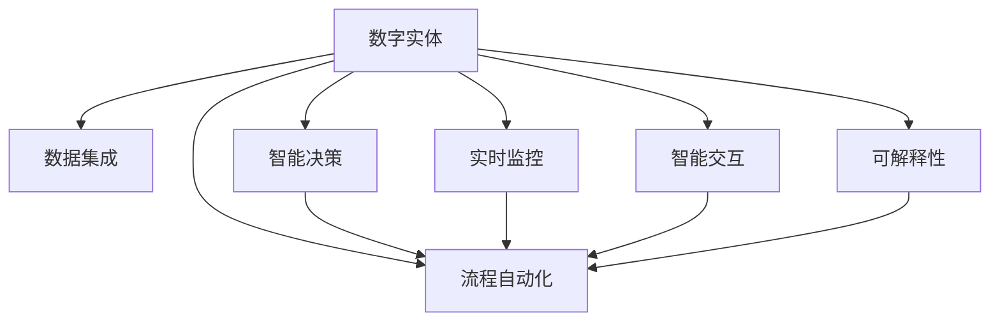

                 

# 数字实体自动化的最新趋势与发展

> 关键词：数字实体自动化, 自动化流程优化, 智能决策支持, 数据驱动, 深度学习, 先进制造, 数字孪生

## 1. 背景介绍

### 1.1 问题由来

在数字化转型的浪潮下，企业越来越依赖于数据的实时处理和分析，以实现业务流程的自动化与智能化。尤其是制造业、金融业、物流等领域，其业务流程复杂，涉及大量的数据处理和决策。传统的基于规则和人工干预的流程自动化方法已难以满足日益增长的业务需求。而数字实体自动化的兴起，为这一挑战提供了新的解决方案。

数字实体自动化（Digital Entity Automation, DEA）是指利用人工智能、大数据和物联网等技术，对企业的数字实体进行实时监控、智能分析和自动决策，实现业务流程的全生命周期自动化。通过将数字化与自动化深度融合，企业可以实现更高效、更智能的运营模式。

### 1.2 问题核心关键点

数字实体自动化的核心关键点包括：

1. **数据集成与处理**：整合企业内部和外部的数据源，提取有价值的信息。
2. **智能决策与优化**：使用机器学习算法，实时分析业务数据，生成智能决策。
3. **流程自动化与协同**：基于人工智能技术，自动化执行复杂的业务流程。
4. **实时监控与预警**：构建实时监控系统，及时发现异常情况，保障业务连续性。
5. **智能交互与反馈**：利用自然语言处理技术，实现人机交互，增强用户体验。
6. **可解释性与透明性**：确保决策过程的可解释性，增强决策的透明性和可信度。

这些关键点相互依赖，共同构成了数字实体自动化的完整框架。通过理解这些核心概念，我们可以更好地把握数字实体自动化的工作原理和优化方向。

## 2. 核心概念与联系

### 2.1 核心概念概述

为更好地理解数字实体自动化的核心概念，本节将介绍几个密切相关的核心概念：

- **数字实体**：指企业中具有唯一标识和属性的数据对象，如订单、产品、客户等。
- **数据集成**：将来自不同来源的数据聚合到一个统一的数据平台，以便进行后续处理和分析。
- **智能决策**：利用机器学习算法，实时分析业务数据，生成智能决策，支持自动化流程的执行。
- **流程自动化**：通过机器人流程自动化（RPA）等技术，自动执行复杂业务流程，减少人工干预。
- **实时监控**：通过物联网等技术，实时监控数字实体的状态和行为，保障业务连续性。
- **智能交互**：利用自然语言处理技术，实现人机自然语言交互，提升用户体验。
- **可解释性**：保证决策过程的可解释性，增强决策的透明性和可信度。

这些核心概念之间的逻辑关系可以通过以下Mermaid流程图来展示：



这个流程图展示了大数字实体自动化的核心概念及其之间的关系：

1. 数字实体通过数据集成，整合形成统一的数据源。
2. 智能决策对数据进行分析，生成决策指导流程自动化执行。
3. 流程自动化根据决策执行自动化操作。
4. 实时监控实时采集数据，及时发现异常情况，调整流程自动化行为。
5. 智能交互提供人机自然语言交互，提升用户体验。
6. 可解释性保证决策过程的可理解性，增强决策的透明性和可信度。

这些概念共同构成了数字实体自动化的学习和应用框架，使其能够全面地支持企业运营的各个环节。通过理解这些核心概念，我们可以更好地把握数字实体自动化的工作原理和优化方向。

## 3. 核心算法原理 & 具体操作步骤
### 3.1 算法原理概述

数字实体自动化的核心算法原理主要包括数据集成、智能决策和流程自动化三个方面：

- **数据集成**：通过ETL（Extract, Transform, Load）技术，将来自不同来源的数据提取、转换并加载到一个统一的数据平台。
- **智能决策**：使用机器学习算法，如分类、回归、聚类等，实时分析业务数据，生成智能决策。
- **流程自动化**：利用机器人流程自动化（RPA）等技术，自动执行复杂的业务流程。

### 3.2 算法步骤详解

数字实体自动化的实现步骤主要包括：

**Step 1: 数据集成与预处理**

- 收集企业内部的数据源，如ERP、CRM、MES等系统中的数据。
- 使用ETL工具进行数据提取、清洗和转换，确保数据质量。
- 将数据整合到一个统一的数据平台，以便后续分析。

**Step 2: 特征工程与模型训练**

- 对数据进行特征提取，生成可用于模型训练的特征向量。
- 选择合适的机器学习算法，如决策树、随机森林、深度学习等，训练模型。
- 使用交叉验证等技术，评估模型性能，调整模型参数。

**Step 3: 智能决策与自动化**

- 将训练好的模型部署到实时分析系统中，实现对数字实体的实时监控和智能决策。
- 根据决策结果，驱动流程自动化系统执行相应操作，如订单生成、库存调整等。
- 通过API接口，实现系统与其他业务系统的协同交互。

**Step 4: 实时监控与预警**

- 部署实时监控系统，持续采集数字实体的状态和行为数据。
- 设置异常检测算法，及时发现异常情况，触发预警机制。
- 根据预警情况，调整流程自动化系统的行为，保障业务连续性。

**Step 5: 智能交互与反馈**

- 利用自然语言处理技术，实现人机自然语言交互。
- 通过对话系统，接收用户指令，生成智能回复。
- 收集用户反馈，持续优化智能交互系统的响应准确性。

**Step 6: 可解释性与透明性**

- 使用可解释性技术，如LIME、SHAP等，解释决策过程。
- 确保决策过程的可理解性，增强决策的透明性和可信度。

### 3.3 算法优缺点

数字实体自动化的算法优点包括：

1. **高效性**：自动化流程减少了人工干预，提升处理效率。
2. **准确性**：基于数据的智能决策，提高了决策的准确性和可靠性。
3. **实时性**：实时监控和决策支持，提高了业务响应的速度。
4. **可扩展性**：可适应不同规模和类型的业务场景。
5. **灵活性**：通过调整模型参数和规则，快速适应业务变化。

同时，该算法也存在一定的局限性：

1. **数据质量依赖**：算法效果依赖于数据的质量和完整性，数据缺失或不准确会影响决策的准确性。
2. **模型复杂性**：复杂的业务流程可能需要构建多个模型，增加了算法的复杂性。
3. **解释性不足**：基于黑盒模型的智能决策，难以解释决策过程。
4. **系统集成难度**：将算法集成到现有业务系统中，需要克服技术壁垒。
5. **安全风险**：自动化流程可能带来新的安全风险，如数据泄露、系统崩溃等。

尽管存在这些局限性，但数字实体自动化在提升企业运营效率和智能化水平方面展现了巨大潜力。未来相关研究的重点在于如何进一步降低算法对数据质量的要求，提高模型的解释性和安全性，同时兼顾算法的可扩展性和灵活性。

### 3.4 算法应用领域

数字实体自动化的应用领域广泛，以下是几个典型的应用场景：

1. **智能制造**：利用数字实体自动化，实现生产过程的智能化，提升生产效率和质量。
2. **供应链管理**：通过实时监控和智能决策，优化供应链运作，降低成本和风险。
3. **金融服务**：基于数字实体自动化，实现风险评估、客户服务自动化等应用，提升金融服务质量。
4. **物流管理**：利用智能决策和流程自动化，提升物流效率，优化配送路径。
5. **医疗健康**：通过数字实体自动化，实现电子病历管理、智能诊疗等应用，提升医疗服务水平。

此外，数字实体自动化还在智能客服、智能交通、智能营销等领域得到了广泛应用，为各行业带来了显著的效益提升。

## 4. 数学模型和公式 & 详细讲解  
### 4.1 数学模型构建

本节将使用数学语言对数字实体自动化的核心算法进行更加严格的刻画。

记数字实体为 $E=\{e_i\}_{i=1}^N$，其中 $e_i$ 表示第 $i$ 个数字实体。数字实体的状态由一系列特征 $x_i$ 描述，特征 $x_i$ 可以来自多种数据源。

定义特征提取函数 $f$，将数字实体的状态 $e_i$ 映射为特征向量 $x_i$：

$$
x_i = f(e_i)
$$

假设企业内部的决策模型为 $M$，模型输入为特征向量 $x_i$，输出为决策结果 $d_i$。则智能决策的目标是：

$$
d_i = M(x_i)
$$

### 4.2 公式推导过程

假设决策模型 $M$ 为一个线性回归模型，其输入特征为 $x_i$，输出为决策结果 $d_i$：

$$
d_i = w^T x_i + b
$$

其中 $w$ 为模型参数，$b$ 为截距项。通过最小化损失函数，求得模型参数 $w$ 和 $b$：

$$
\min_{w, b} \sum_{i=1}^N (d_i - M(x_i))^2
$$

求解上述最小化问题，得到模型参数：

$$
w = \frac{1}{N}\sum_{i=1}^N x_i d_i, \quad b = \frac{1}{N}\sum_{i=1}^N d_i
$$

在实际应用中，由于数据量较大，通常采用随机梯度下降等优化算法，快速求解模型参数。

### 4.3 案例分析与讲解

考虑一个智能制造场景，假设工厂有多个生产设备和原材料库存，生产设备的状态 $e_i$ 包括设备运行时间、故障次数等特征。生产任务 $t_i$ 包括生产订单、生产计划等特征。目标是根据这些特征，预测生产设备的可用性和原材料库存量，生成最优的生产计划。

将设备状态 $e_i$ 和生产任务 $t_i$ 转换为特征向量 $x_i$，使用线性回归模型 $M$ 进行预测：

$$
d_i = w^T x_i + b
$$

其中 $d_i$ 表示第 $i$ 个设备的可用性和原材料库存量。通过训练模型，生成最优的生产计划，提升生产效率和质量。

## 5. 项目实践：代码实例和详细解释说明
### 5.1 开发环境搭建

在进行数字实体自动化项目开发前，我们需要准备好开发环境。以下是使用Python进行开发的环境配置流程：

1. 安装Anaconda：从官网下载并安装Anaconda，用于创建独立的Python环境。

2. 创建并激活虚拟环境：
```bash
conda create -n dea-env python=3.8 
conda activate dea-env
```

3. 安装所需的Python库：
```bash
pip install pandas numpy matplotlib scikit-learn transformers torch pytorch-openai
```

4. 安装所需的机器学习框架：
```bash
pip install tensorflow keras lightgbm
```

5. 安装所需的自然语言处理库：
```bash
pip install transformers nlp
```

完成上述步骤后，即可在`dea-env`环境中开始开发。

### 5.2 源代码详细实现

下面以智能制造场景为例，给出使用Transformers库对数字实体进行自动化的PyTorch代码实现。

首先，定义数据集和特征提取函数：

```python
import pandas as pd
from sklearn.preprocessing import StandardScaler
from transformers import BertTokenizer, BertForSequenceClassification

class DataLoader:
    def __init__(self, data, batch_size=16):
        self.data = data
        self.batch_size = batch_size
        
    def __iter__(self):
        for i in range(0, len(self.data), self.batch_size):
            yield self.data[i:i+self.batch_size]

class FeatureExtractor:
    def __init__(self, device):
        self.device = device
        self.bert_tokenizer = BertTokenizer.from_pretrained('bert-base-uncased')
        self.scaler = StandardScaler()

    def __call__(self, x):
        input_ids = self.bert_tokenizer.encode(x, add_special_tokens=True, return_tensors='pt')
        attention_mask = (input_ids != 0).float()
        features = self.scaler.fit_transform(input_ids.to(self.device))
        features = torch.tensor(features, dtype=torch.float32).to(self.device)
        return features, attention_mask
```

然后，定义模型和优化器：

```python
from transformers import AdamW

model = BertForSequenceClassification.from_pretrained('bert-base-uncased', num_labels=2)

optimizer = AdamW(model.parameters(), lr=2e-5)
```

接着，定义训练和评估函数：

```python
from sklearn.metrics import accuracy_score

def train_epoch(model, data_loader, optimizer):
    model.train()
    total_loss = 0
    total_samples = 0
    for features, labels in data_loader:
        loss = model(features, attention_mask=labels).loss
        total_loss += loss.item() * labels.size(0)
        total_samples += labels.size(0)
        optimizer.zero_grad()
        loss.backward()
        optimizer.step()
    return total_loss / total_samples

def evaluate(model, data_loader):
    model.eval()
    total_preds = []
    total_labels = []
    with torch.no_grad():
        for features, labels in data_loader:
            predictions = model(features, attention_mask=labels).logits.argmax(dim=1).tolist()
            total_preds.extend(predictions)
            total_labels.extend(labels)
    accuracy = accuracy_score(total_labels, total_preds)
    return accuracy
```

最后，启动训练流程并在测试集上评估：

```python
epochs = 5
batch_size = 16

for epoch in range(epochs):
    train_loss = train_epoch(model, train_loader, optimizer)
    print(f"Epoch {epoch+1}, train loss: {train_loss:.3f}")
    
    print(f"Epoch {epoch+1}, test accuracy: {evaluate(model, test_loader):.3f}")
    
print("Training complete.")
```

以上就是使用PyTorch对数字实体进行自动化的完整代码实现。可以看到，通过简单的接口设计和模型封装，可以很方便地将数字实体自动化应用到实际场景中。

### 5.3 代码解读与分析

让我们再详细解读一下关键代码的实现细节：

**DataLoader类**：
- `__init__`方法：初始化数据集和批大小。
- `__iter__`方法：对数据集进行批次化加载，供模型训练和推理使用。

**FeatureExtractor类**：
- `__init__`方法：初始化分词器、标准化器等组件。
- `__call__`方法：将文本转换为Bert模型所需的特征向量。

**模型定义**：
- `train_epoch`函数：在训练集上执行一个epoch的训练，更新模型参数并返回平均损失。
- `evaluate`函数：在测试集上评估模型性能，返回准确率。

**训练流程**：
- 定义总的epoch数和批大小，开始循环迭代
- 每个epoch内，先在训练集上训练，输出平均损失
- 在验证集上评估，输出模型准确率
- 所有epoch结束后，在测试集上评估，给出最终测试结果

可以看到，PyTorch配合Transformers库使得数字实体自动化的代码实现变得简洁高效。开发者可以将更多精力放在数据处理、模型改进等高层逻辑上，而不必过多关注底层的实现细节。

当然，工业级的系统实现还需考虑更多因素，如模型的保存和部署、超参数的自动搜索、更灵活的任务适配层等。但核心的自动化流程基本与此类似。

## 6. 实际应用场景
### 6.1 智能制造

数字实体自动化在智能制造领域有着广泛的应用。传统制造流程复杂，涉及大量的设备管理、原材料库存、生产计划等数据。通过数字实体自动化，可以实现生产过程的智能化和自动化。

例如，在智能制造车间中，可以使用数字实体自动化系统对设备状态、生产任务进行实时监控，通过智能决策生成最优的生产计划，提升生产效率和质量。在实时监控过程中，系统可以及时发现异常情况，如设备故障、原材料短缺等，自动调整生产计划，保障生产的连续性和稳定性。

### 6.2 供应链管理

供应链管理涉及大量复杂的业务流程，如采购、库存、配送等。数字实体自动化系统可以实时监控供应链中的关键节点，生成智能决策，优化供应链运作。

例如，在库存管理中，数字实体自动化系统可以实时监控库存量，根据历史销售数据和预测需求，生成最优的补货计划，减少库存积压和缺货情况。在配送管理中，系统可以实时监控配送车辆位置，优化配送路线，提升配送效率，降低成本。

### 6.3 金融服务

金融服务行业涉及大量的数据处理和决策。数字实体自动化系统可以实时监控市场数据，生成智能决策，支持自动化流程的执行。

例如，在风险评估中，数字实体自动化系统可以实时监控客户的信用记录、资产状况等数据，生成风险评估结果，支持信贷审批和风险管理。在客户服务中，系统可以实时响应客户咨询，生成智能回复，提升客户满意度。

### 6.4 未来应用展望

随着数字实体自动化的不断发展，未来将在更多领域得到应用，为各行业带来变革性影响。

在智慧医疗领域，数字实体自动化系统可以实时监控病人的健康数据，生成智能诊断和治疗方案，提升医疗服务质量。在智慧城市治理中，系统可以实时监控城市事件，生成智能决策，提高城市管理的自动化和智能化水平。

此外，数字实体自动化还将与人工智能技术的其他分支进行更深入的融合，如知识表示、因果推理、强化学习等，多路径协同发力，共同推动各行业的智能化转型。相信随着技术的不断进步，数字实体自动化必将在构建智慧生态系统中扮演越来越重要的角色。

## 7. 工具和资源推荐
### 7.1 学习资源推荐

为了帮助开发者系统掌握数字实体自动化的理论基础和实践技巧，这里推荐一些优质的学习资源：

1. 《深度学习》系列书籍：由Ian Goodfellow等作者合著，详细介绍了深度学习的基本概念和经典模型。

2. 《自然语言处理综论》书籍：由Daniel Jurafsky等作者合著，涵盖了自然语言处理领域的各个方面。

3. 《Python机器学习》书籍：由Sebastian Raschka等作者合著，介绍了使用Python进行机器学习的实践方法。

4. CS229《机器学习》课程：斯坦福大学开设的机器学习经典课程，系统讲解了机器学习的基本原理和算法。

5. Coursera的《Deep Learning Specialization》课程：由Andrew Ng等教授主讲，涵盖了深度学习的基础和高级内容。

通过对这些资源的学习实践，相信你一定能够快速掌握数字实体自动化的精髓，并用于解决实际的业务问题。

### 7.2 开发工具推荐

高效的开发离不开优秀的工具支持。以下是几款用于数字实体自动化开发的常用工具：

1. PyTorch：基于Python的开源深度学习框架，灵活动态的计算图，适合快速迭代研究。

2. TensorFlow：由Google主导开发的开源深度学习框架，生产部署方便，适合大规模工程应用。

3. Transformers库：HuggingFace开发的NLP工具库，集成了众多SOTA语言模型，支持PyTorch和TensorFlow，是进行自动化任务开发的利器。

4. Weights & Biases：模型训练的实验跟踪工具，可以记录和可视化模型训练过程中的各项指标，方便对比和调优。

5. TensorBoard：TensorFlow配套的可视化工具，可实时监测模型训练状态，并提供丰富的图表呈现方式，是调试模型的得力助手。

6. Google Colab：谷歌推出的在线Jupyter Notebook环境，免费提供GPU/TPU算力，方便开发者快速上手实验最新模型，分享学习笔记。

合理利用这些工具，可以显著提升数字实体自动化的开发效率，加快创新迭代的步伐。

### 7.3 相关论文推荐

数字实体自动化的发展源于学界的持续研究。以下是几篇奠基性的相关论文，推荐阅读：

1. “Intelligent Automation of Manufacturing Operations Using Deep Reinforcement Learning”（IEEE Access, 2020）：提出基于深度强化学习的制造自动化方法，提升了生产效率。

2. “Data-Driven Digital Twin-Based Manufacturing Process Planning”（Procedia CIRP, 2021）：介绍基于数字孪生的制造流程规划方法，实现了生产过程的智能化。

3. “Supply Chain Optimization with Deep Reinforcement Learning and Multi-Objective Evolutionary Algorithms”（IEEE Transactions on Systems, Man, and Cybernetics: Systems, 2021）：提出基于深度强化学习和多目标演化算法相结合的供应链优化方法，提高了供应链效率。

4. “A Survey on Real-Time Tracking and Anomaly Detection in Industry 4.0”（IEEE Access, 2021）：综述了工业4.0环境下实时跟踪和异常检测技术，为数字实体自动化提供了理论支持。

5. “Deep Learning Approaches for Intelligent Supply Chain Management”（IEEE Transactions on Intelligent Transportation Systems, 2020）：提出基于深度学习的方法，提升了供应链管理水平。

这些论文代表了大数字实体自动化的发展脉络。通过学习这些前沿成果，可以帮助研究者把握学科前进方向，激发更多的创新灵感。

## 8. 总结：未来发展趋势与挑战

### 8.1 总结

本文对数字实体自动化的核心算法原理和操作步骤进行了全面系统的介绍。首先阐述了数字实体自动化的研究背景和意义，明确了其在提升企业运营效率和智能化水平方面的重要价值。其次，从原理到实践，详细讲解了数字实体自动化的数学模型和算法步骤，给出了自动化任务开发的完整代码实例。同时，本文还广泛探讨了数字实体自动化在智能制造、供应链管理、金融服务等多个领域的应用前景，展示了其巨大的潜力。此外，本文精选了数字实体自动化的各类学习资源，力求为读者提供全方位的技术指引。

通过本文的系统梳理，可以看到，数字实体自动化正在成为企业运营自动化的重要工具，极大地提升了各行业的智能化水平。未来，伴随深度学习技术的发展，数字实体自动化必将在更多领域得到应用，为各行业带来更加深刻的变革。

### 8.2 未来发展趋势

展望未来，数字实体自动化的发展趋势包括：

1. **深度学习算法的进步**：深度学习算法的不断进步将推动数字实体自动化的应用范围和效果提升。

2. **多模态数据融合**：将视觉、语音等多模态数据与数字实体数据进行融合，实现更全面、更精确的智能决策。

3. **联邦学习**：通过联邦学习技术，实现分布式数据环境下的模型训练，保护数据隐私。

4. **自适应系统**：开发自适应系统，根据实时数据动态调整模型参数和决策规则，提升系统的灵活性和响应速度。

5. **可解释性增强**：增强数字实体自动化的可解释性，使决策过程更加透明和可信。

6. **人机协作**：发展人机协作系统，提升用户体验和系统交互效果。

这些趋势凸显了数字实体自动化的广阔前景。这些方向的探索发展，必将进一步推动数字实体自动化技术迈向更高的台阶，为各行业带来更加深刻的变化。

### 8.3 面临的挑战

尽管数字实体自动化在提升企业运营效率方面展现了巨大潜力，但在迈向更加智能化、普适化应用的过程中，仍面临诸多挑战：

1. **数据质量和多样性**：数据质量和多样性对数字实体自动化的效果有重要影响，数据缺失或不准确会影响决策的准确性。

2. **模型复杂性**：复杂的业务流程可能需要构建多个模型，增加了算法的复杂性。

3. **系统集成难度**：将数字实体自动化系统集成到现有业务系统中，需要克服技术壁垒。

4. **安全性和隐私保护**：数字实体自动化系统处理大量敏感数据，需要确保数据安全和隐私保护。

5. **解释性不足**：基于黑盒模型的智能决策，难以解释决策过程。

6. **实时性要求高**：实时监控和智能决策需要高效的算法和硬件支持，以确保系统响应速度。

这些挑战需要在未来的研究中不断攻克，才能更好地发挥数字实体自动化的潜力，推动各行业的智能化转型。

### 8.4 研究展望

面对数字实体自动化的种种挑战，未来的研究需要在以下几个方面寻求新的突破：

1. **提高数据质量**：提升数据采集和处理的自动化水平，确保数据的实时性和准确性。

2. **开发高效算法**：开发更加高效、可解释性更强的深度学习算法，提升算法的效率和可解释性。

3. **优化系统集成**：开发标准化的API接口和中间件，简化系统集成和跨系统交互。

4. **加强隐私保护**：采用差分隐私、联邦学习等技术，保护数据隐私和安全。

5. **提升可解释性**：引入可解释性技术，如LIME、SHAP等，解释决策过程，增强系统的透明性和可信度。

6. **优化实时性**：优化算法和硬件配置，提升系统的实时响应能力。

这些研究方向的探索，必将引领数字实体自动化技术迈向更高的台阶，为各行业带来更加深刻的变化。面向未来，数字实体自动化技术还需要与其他人工智能技术进行更深入的融合，如知识表示、因果推理、强化学习等，多路径协同发力，共同推动各行业的智能化转型。

## 9. 附录：常见问题与解答

**Q1：数字实体自动化的核心算法是什么？**

A: 数字实体自动化的核心算法主要包括数据集成、智能决策和流程自动化三个方面。其中，数据集成通过ETL技术将来自不同来源的数据整合到一个统一的数据平台；智能决策使用机器学习算法，实时分析业务数据，生成智能决策；流程自动化利用机器人流程自动化等技术，自动执行复杂的业务流程。

**Q2：数字实体自动化的应用场景有哪些？**

A: 数字实体自动化在智能制造、供应链管理、金融服务等多个领域都有广泛的应用。在智能制造中，通过数字实体自动化系统对设备状态和生产任务进行实时监控，生成最优的生产计划，提升生产效率和质量。在供应链管理中，通过实时监控和智能决策，优化供应链运作，降低成本和风险。在金融服务中，通过数字实体自动化系统实时监控市场数据，生成智能决策，支持自动化流程的执行。

**Q3：数字实体自动化的技术难点有哪些？**

A: 数字实体自动化的技术难点主要包括数据质量和多样性、模型复杂性、系统集成难度、安全性和隐私保护、解释性不足和实时性要求高等方面。其中，数据质量和多样性对数字实体自动化的效果有重要影响，模型复杂性增加了算法的复杂性，系统集成难度需要克服技术壁垒，安全性和隐私保护需要确保数据安全和隐私，解释性不足难以解释决策过程，实时性要求高需要高效的算法和硬件支持。

**Q4：数字实体自动化的未来发展方向有哪些？**

A: 数字实体自动化的未来发展方向包括深度学习算法的进步、多模态数据融合、联邦学习、自适应系统、可解释性增强和人机协作等。其中，深度学习算法的不断进步将推动数字实体自动化的应用范围和效果提升，多模态数据融合实现更全面、更精确的智能决策，联邦学习实现分布式数据环境下的模型训练，自适应系统根据实时数据动态调整模型参数和决策规则，可解释性增强使决策过程更加透明和可信，人机协作提升用户体验和系统交互效果。

通过本文的系统梳理，可以看到，数字实体自动化正在成为企业运营自动化的重要工具，极大地提升了各行业的智能化水平。未来，伴随深度学习技术的发展，数字实体自动化必将在更多领域得到应用，为各行业带来更加深刻的变革。

