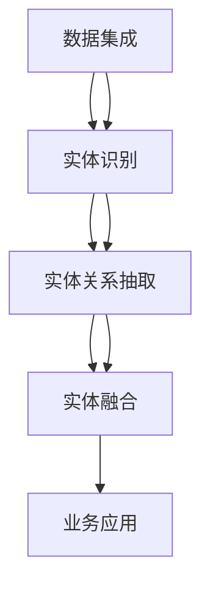
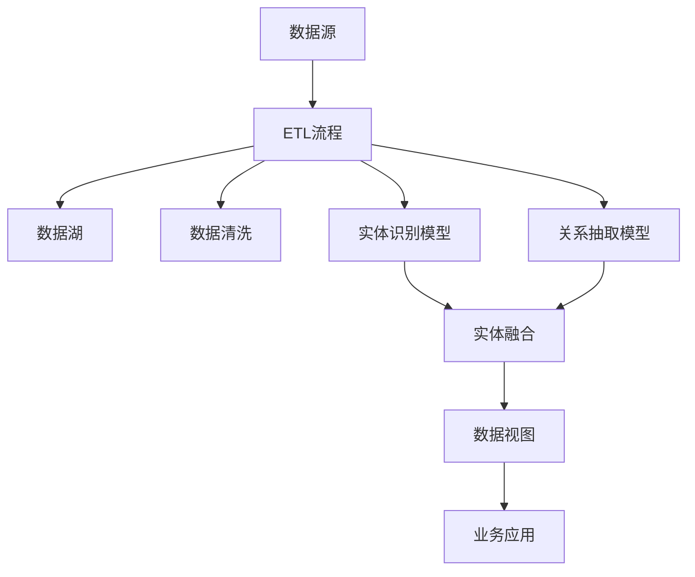

                 

# 数字实体自动化的未来发展

## 1. 背景介绍

### 1.1 问题由来
近年来，随着人工智能（AI）和机器学习（ML）技术的迅速发展，数字实体的自动化处理已成为各行各业关注的焦点。在金融、零售、医疗、制造等多个领域，数字实体（如金融资产、产品、病人信息等）的管理和自动化处理直接关系到企业竞争力、客户满意度以及决策效率。然而，现有的数字实体处理方式往往存在数据孤岛、信息异构、处理流程复杂等问题，严重制约了行业的发展。

### 1.2 问题核心关键点
数字实体自动化的核心在于如何将海量、多源、异构的数字实体数据高效、准确地进行整合和处理，以支持业务决策和运营。当前，数字实体自动化主要面临以下几个关键问题：

1. **数据孤岛**：不同业务系统生成的数据格式、存储方式、数据模型各异，导致数据难以统一管理和共享。
2. **数据异构**：同一种实体在不同业务系统中表示不一致，如一个产品在不同系统中的描述字段不同，导致数据整合困难。
3. **处理流程复杂**：数字实体的生命周期复杂，涉及创建、更新、关联、撤销等多个环节，流程管理繁琐。
4. **实时性要求高**：金融、零售等行业对数字实体的处理往往要求快速响应，传统系统难以满足。

解决这些问题需要融合最新的AI技术，实现数字实体的自动化处理和智能化管理。本文将从核心概念、算法原理、实际操作、应用领域、数学模型、项目实践、实际应用场景、工具和资源推荐、未来发展趋势与挑战以及常见问题与解答等方面，对数字实体自动化进行全面系统的介绍。

## 2. 核心概念与联系

### 2.1 核心概念概述

数字实体自动化涉及多个核心概念，包括数据集成、实体识别、实体关系抽取、实体融合等。这些概念相互联系，共同构成了数字实体自动化的基础框架。

- **数据集成**：将不同来源的数据进行统一管理和整合，形成全局的、一致的数据视图。
- **实体识别**：从原始数据中自动识别出数字实体，并对其进行分类和标记。
- **实体关系抽取**：识别和抽取数字实体之间的关系，如父子关系、所属关系等。
- **实体融合**：将同类型或不同类型的数据实体进行合并和整合，形成更完整、准确的实体表示。

这些概念通过数据流、算法处理、模型训练等技术手段，形成了一个完整的数字实体自动化处理链条，如图1所示：



其中，数据集成是基础，实体识别和关系抽取是关键，实体融合是目标，业务应用是最终目的。

### 2.2 核心概念原理和架构的 Mermaid 流程图



## 3. 核心算法原理 & 具体操作步骤

### 3.1 算法原理概述

数字实体自动化的核心算法原理主要包括以下几个方面：

1. **数据集成**：采用ETL（Extract, Transform, Load）流程，从多个数据源抽取数据，通过数据清洗和转换，加载到数据湖中，形成一致、完整的数据视图。
2. **实体识别**：利用NLP（自然语言处理）和图像识别等技术，从文本、图像等多种数据中自动识别出数字实体，并进行分类和标记。
3. **实体关系抽取**：采用基于规则或深度学习的方法，从文本、图表等多种数据中抽取数字实体之间的关系，如父子关系、所属关系等。
4. **实体融合**：通过合并和整合，将同类型或不同类型的数据实体进行融合，形成更完整、准确的实体表示。

### 3.2 算法步骤详解

**Step 1: 数据集成**

1. **数据抽取**：从多个数据源（如数据库、API接口、文件等）抽取数据，形成数据源列表。
2. **数据清洗**：对抽取的数据进行格式转换、缺失值处理、重复数据去重等预处理操作，确保数据质量。
3. **数据转换**：根据业务需求，对数据进行格式转换，如日期格式化、字段映射等，统一数据格式。
4. **数据加载**：将清洗和转换后的数据加载到数据湖中，形成全局一致的数据视图。

**Step 2: 实体识别**

1. **实体分类**：对数据中的每个字段进行分类，确定其是否为数字实体，如客户、产品、订单等。
2. **实体标记**：为每个分类后的数字实体打上标签，如客户ID、产品名称等。
3. **实体命名**：通过NLP技术，从文本数据中识别出实体名称，并进行标准化处理。
4. **实体合并**：对同名的实体进行合并，避免重复和歧义。

**Step 3: 实体关系抽取**

1. **关系定义**：定义实体之间的关系，如父子关系、所属关系等，确定实体间的连接方式。
2. **关系抽取**：采用基于规则或深度学习的方法，从文本、图表等多种数据中抽取实体之间的关系，形成实体关系图。
3. **关系验证**：对抽取的关系进行验证，确保其准确性和一致性。

**Step 4: 实体融合**

1. **实体关联**：对同类型或不同类型的数据实体进行关联，形成完整的实体视图。
2. **实体合并**：对重复的实体进行合并，避免数据冗余。
3. **实体校正**：对错误的实体信息进行校正，确保数据准确性。

### 3.3 算法优缺点

数字实体自动化的算法具有以下优点：

1. **效率高**：采用自动化处理流程，可以减少人工干预，提高数据处理效率。
2. **准确性好**：利用AI技术进行实体识别和关系抽取，可以减少人工错误，提高数据处理准确性。
3. **灵活性强**：通过灵活配置，可以实现对不同业务场景的数据处理需求。
4. **可扩展性好**：可以方便地扩展到更多数据源和处理任务。

同时，数字实体自动化的算法也存在一些缺点：

1. **数据源复杂**：不同业务系统生成的数据格式、存储方式各异，处理难度较大。
2. **数据异构**：同一种实体在不同业务系统中表示不一致，导致数据整合困难。
3. **处理复杂**：涉及实体识别、关系抽取、实体融合等多个环节，处理流程复杂。

### 3.4 算法应用领域

数字实体自动化的算法在多个领域得到了广泛应用，主要包括：

1. **金融行业**：用于客户关系管理、资产管理、交易监控等，帮助金融机构进行智能决策和运营。
2. **零售行业**：用于库存管理、客户画像、销售分析等，提升零售企业的数据分析和运营效率。
3. **医疗行业**：用于病人信息管理、病历分析、医疗影像处理等，帮助医疗机构提升医疗服务水平。
4. **制造业**：用于设备维护、生产调度、供应链管理等，提升制造企业的生产效率和运营管理水平。

## 4. 数学模型和公式 & 详细讲解 & 举例说明

### 4.1 数学模型构建

数字实体自动化的数学模型主要涉及实体识别、关系抽取、实体融合等任务。以实体识别为例，假设从文本中识别出实体$x$，其概率分布为$P(x)$，则需要构建模型$M$，使得$P(x|M)$最大化。

### 4.2 公式推导过程

1. **实体识别模型**：采用CRF（条件随机场）模型，对文本中的每个字段进行分类，确定其是否为数字实体。
2. **关系抽取模型**：采用基于LSTM（长短时记忆网络）或Transformer模型的关系抽取方法，从文本中抽取数字实体之间的关系。
3. **实体融合模型**：采用聚类算法，将同名的实体进行合并，形成完整的实体视图。

### 4.3 案例分析与讲解

**案例1: 金融行业客户关系管理**

1. **数据集成**：从多个数据源（如客户信息系统、交易系统、客户服务系统等）抽取客户数据，进行清洗和转换，加载到数据湖中。
2. **实体识别**：利用NLP技术，从客户服务记录中识别出客户姓名、电话、邮箱等实体，并进行分类和标记。
3. **关系抽取**：采用基于Transformer的关系抽取模型，从交易记录中抽取客户与资产的关系，如客户持有的股票、债券等。
4. **实体融合**：将客户在不同业务系统中的信息进行关联和合并，形成完整的客户视图。

**案例2: 零售行业库存管理**

1. **数据集成**：从销售系统、库存系统、供应链系统等抽取数据，进行清洗和转换，加载到数据湖中。
2. **实体识别**：利用图像识别技术，从商品图片和标签中识别出产品名称、规格、价格等实体，并进行分类和标记。
3. **关系抽取**：采用基于深度学习的关系抽取模型，从销售记录中抽取产品之间的关系，如父子关系、商品组合等。
4. **实体融合**：将产品在不同业务系统中的信息进行关联和合并，形成完整的产品视图。

## 5. 项目实践：代码实例和详细解释说明

### 5.1 开发环境搭建

为了进行数字实体自动化的项目实践，需要准备以下开发环境：

1. **Python**：安装最新版本的Python，确保安装pandas、numpy、scikit-learn等数据处理和机器学习库。
2. **数据湖**：选择一个数据湖平台，如AWS Lake Formation、Google BigQuery等，用于存储和处理大量数据。
3. **AI框架**：选择一个AI框架，如TensorFlow、PyTorch、Scikit-learn等，用于构建实体识别、关系抽取等模型。
4. **ETL工具**：选择一个ETL工具，如Apache Nifi、AWS Glue等，用于数据抽取、清洗和转换。

### 5.2 源代码详细实现

以下是一个使用PyTorch框架进行实体识别的示例代码：

```python
import torch
import torch.nn as nn
import torch.optim as optim

# 定义实体识别模型
class EntityRecognitionModel(nn.Module):
    def __init__(self, embedding_dim, hidden_dim, num_classes):
        super(EntityRecognitionModel, self).__init__()
        self.embedding = nn.Embedding(num_words, embedding_dim)
        self.lstm = nn.LSTM(embedding_dim, hidden_dim)
        self.fc = nn.Linear(hidden_dim, num_classes)
    
    def forward(self, input, mask):
        embedded = self.embedding(input)
        output, _ = self.lstm(embedded, None)
        return self.fc(output[:, -1, :])

# 训练实体识别模型
def train_model(model, train_data, test_data, batch_size, num_epochs, learning_rate):
    criterion = nn.CrossEntropyLoss()
    optimizer = optim.Adam(model.parameters(), lr=learning_rate)
    
    for epoch in range(num_epochs):
        for batch in train_data:
            input, mask, labels = batch
            optimizer.zero_grad()
            output = model(input, mask)
            loss = criterion(output, labels)
            loss.backward()
            optimizer.step()
        print("Epoch {}: Loss={:.4f}".format(epoch+1, loss.item()))
    
    # 评估模型
    test_loss = 0
    for batch in test_data:
        input, mask, labels = batch
        output = model(input, mask)
        test_loss += criterion(output, labels).item()
    print("Test Loss={:.4f}".format(test_loss/len(test_data)))
```

### 5.3 代码解读与分析

**代码解读**：

1. **实体识别模型**：定义了一个基于LSTM的实体识别模型，包含嵌入层、LSTM层和全连接层。
2. **训练模型**：使用Adam优化器，进行交叉熵损失函数的计算和反向传播，更新模型参数。
3. **评估模型**：在测试集上计算模型损失，评估模型性能。

**代码分析**：

1. **输入**：输入为句子中的单词列表，每个单词用其对应的编号表示。
2. **嵌入层**：将单词列表映射到固定维度的向量空间中，便于LSTM处理。
3. **LSTM层**：采用LSTM模型对单词序列进行处理，提取语义信息。
4. **全连接层**：对LSTM的输出进行分类，预测单词是否为实体。

## 6. 实际应用场景

### 6.1 智能客服系统

数字实体自动化的实体识别和关系抽取技术，可以应用于智能客服系统的构建。传统客服往往需要配备大量人力，高峰期响应缓慢，且一致性和专业性难以保证。使用数字实体自动化的技术，可以大幅提升客服系统的响应速度和准确性。

**案例**：某电商平台的智能客服系统，利用数字实体自动识别客户订单信息、产品信息、服务记录等，进行智能分析和处理。通过关系抽取，系统可以自动识别客户在订单、服务中的关联信息，提供更精准的客服回复和解决方案，提升客户满意度。

### 6.2 金融行业客户关系管理

数字实体自动化的实体识别和关系抽取技术，可以应用于金融行业的客户关系管理（CRM）系统。传统CRM系统需要大量人工进行客户信息的收集和整理，效率低下。使用数字实体自动化的技术，可以自动化收集和整理客户信息，提升数据处理效率和准确性。

**案例**：某银行的CRM系统，利用数字实体自动识别客户姓名、电话、邮箱等实体，进行客户画像和关系抽取。通过关系抽取，系统可以自动识别客户持有的资产信息，进行风险评估和客户推荐，提升客户关系管理的智能化水平。

### 6.3 医疗行业病人信息管理

数字实体自动化的实体识别和关系抽取技术，可以应用于医疗行业的病人信息管理系统。传统系统需要大量人工进行病人信息的收集和整理，效率低下。使用数字实体自动化的技术，可以自动化收集和整理病人信息，提升数据处理效率和准确性。

**案例**：某医院的病人信息管理系统，利用数字实体自动识别病人姓名、年龄、病情等实体，进行病人画像和关系抽取。通过关系抽取，系统可以自动识别病人就诊的历史记录和关联信息，进行病情分析和治疗推荐，提升医疗服务水平。

## 7. 工具和资源推荐

### 7.1 学习资源推荐

为了帮助开发者系统掌握数字实体自动化的理论基础和实践技巧，这里推荐一些优质的学习资源：

1. **《自然语言处理综述》**：介绍了自然语言处理的基本概念和常用算法，包括实体识别、关系抽取等任务。
2. **《深度学习》课程**：斯坦福大学开设的深度学习课程，涵盖深度学习的基础和应用，包括数字实体自动化的相关内容。
3. **Kaggle竞赛**：参与Kaggle上的实体识别和关系抽取竞赛，实践和学习前沿算法和技术。
4. **GitHub开源项目**：GitHub上提供了许多数字实体自动化的开源项目，包括实体识别、关系抽取等，可以借鉴和学习。

### 7.2 开发工具推荐

1. **Python**：Python是最流行的编程语言之一，拥有丰富的数据处理和机器学习库，如pandas、numpy、scikit-learn等。
2. **TensorFlow**：TensorFlow是一个强大的深度学习框架，支持GPU加速，可以处理大规模数据和复杂模型。
3. **PyTorch**：PyTorch是一个灵活的深度学习框架，易于使用，支持动态计算图和GPU加速。
4. **ETL工具**：Apache Nifi、AWS Glue等ETL工具，支持数据的抽取、清洗和转换，可以高效处理大量数据。

### 7.3 相关论文推荐

数字实体自动化的相关研究涉及多个领域，以下是几篇奠基性的相关论文，推荐阅读：

1. **《基于规则的实体识别方法》**：介绍了一种基于规则的实体识别方法，可以高效处理多种实体类型。
2. **《基于深度学习的实体关系抽取方法》**：提出了一种基于深度学习的实体关系抽取方法，可以准确抽取实体之间的关系。
3. **《基于知识图谱的实体融合方法》**：提出了一种基于知识图谱的实体融合方法，可以合并和整合不同来源的数字实体。

## 8. 总结：未来发展趋势与挑战

### 8.1 研究成果总结

数字实体自动化的研究已经取得了一定的成果，涵盖了实体识别、关系抽取、实体融合等多个方面。这些技术在金融、零售、医疗等多个领域得到了广泛应用，提升了数据处理的效率和准确性。

### 8.2 未来发展趋势

未来，数字实体自动化的研究将呈现以下几个发展趋势：

1. **技术融合**：数字实体自动化将与其他AI技术进行深度融合，如知识图谱、语义理解等，提升系统的智能化水平。
2. **跨领域应用**：数字实体自动化技术将拓展到更多领域，如物流、交通、公共安全等，提升各行各业的运营效率。
3. **实时处理**：数字实体自动化系统将实现实时处理，支持动态数据流和实时任务调度。
4. **自适应学习**：数字实体自动化系统将具备自适应学习能力，能够根据业务需求动态调整处理策略。

### 8.3 面临的挑战

数字实体自动化的研究仍面临诸多挑战，主要包括：

1. **数据质量**：不同业务系统生成的数据质量参差不齐，如何提高数据质量是关键。
2. **数据异构**：同一种实体在不同业务系统中表示不一致，如何统一实体表示是难点。
3. **处理复杂**：数字实体自动化涉及多个环节，如何简化处理流程，提高系统效率。
4. **实时性要求**：金融、零售等行业对数字实体的处理要求快速响应，如何实现实时处理。

### 8.4 研究展望

未来，数字实体自动化的研究需要在以下几个方面寻求新的突破：

1. **数据清洗和转换**：开发更加高效、通用的数据清洗和转换方法，提升数据质量。
2. **实体识别和关系抽取**：开发更加准确、高效的实体识别和关系抽取算法，提升系统性能。
3. **实体融合和校验**：开发更加灵活、鲁棒的实体融合和校验方法，提高数据准确性。
4. **跨领域应用**：拓展数字实体自动化的应用领域，提升跨领域通用性。

## 9. 附录：常见问题与解答

**Q1: 数字实体自动化的实体识别和关系抽取技术如何提升智能客服系统的响应速度和准确性？**

A: 数字实体自动化的实体识别和关系抽取技术可以自动识别客户订单信息、产品信息、服务记录等，进行智能分析和处理。通过关系抽取，系统可以自动识别客户在订单、服务中的关联信息，提供更精准的客服回复和解决方案，从而提升客服系统的响应速度和准确性。

**Q2: 数字实体自动化的实体识别和关系抽取技术如何应用于金融行业的客户关系管理（CRM）系统？**

A: 数字实体自动化的实体识别和关系抽取技术可以自动识别客户姓名、电话、邮箱等实体，进行客户画像和关系抽取。通过关系抽取，系统可以自动识别客户持有的资产信息，进行风险评估和客户推荐，提升客户关系管理的智能化水平。

**Q3: 数字实体自动化的实体识别和关系抽取技术如何应用于医疗行业的病人信息管理系统？**

A: 数字实体自动化的实体识别和关系抽取技术可以自动识别病人姓名、年龄、病情等实体，进行病人画像和关系抽取。通过关系抽取，系统可以自动识别病人就诊的历史记录和关联信息，进行病情分析和治疗推荐，提升医疗服务水平。

---

作者：禅与计算机程序设计艺术 / Zen and the Art of Computer Programming

