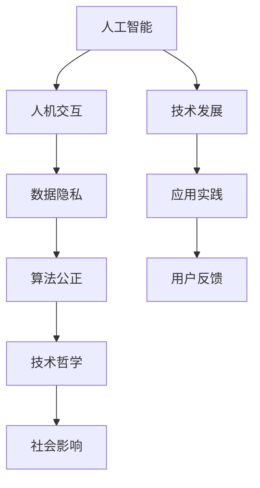

                 

# 数字时代的人文精神的复兴

> 关键词：人工智能, 人机交互, 数字人文, 伦理, 社会影响, 技术哲学, 算法公正

## 1. 背景介绍

### 1.1 问题由来
进入数字时代，人工智能(AI)技术的迅猛发展极大地改变了人类的生产和生活方式。机器学习、深度学习等技术的应用，使得各种智能系统逐步渗透到各行各业，推动了自动化、智能化进程。然而，这一过程中也引发了诸多新问题，包括但不限于数据隐私保护、算法偏见、伦理道德、社会影响等方面。

这些问题不仅仅是技术问题，更涉及到人类在数字时代所面临的深层伦理和哲学挑战。正如法国哲学家伯纳德·斯蒂格特所说，“人工智能将引导我们进入一个新的纪元，我们必须在道德和伦理上为这一新纪元做好准备。”数字时代的人文精神复兴，正是为了在这个新时代中，既发挥AI技术的强大潜力，又避免其潜在的负面影响，确保人类的核心价值和尊严得以维护。

### 1.2 问题核心关键点
数字时代人文精神的复兴，聚焦于以下几个核心关键点：

- 人机交互的伦理：AI系统如何与人类进行自然、公正、人性化的互动。
- 数据隐私保护：在AI应用中，如何合理地收集、使用和保护个人数据。
- 算法公正：如何构建不带有偏见的AI系统，保证不同群体的权益。
- 技术哲学：在AI发展的不同阶段，如何通过技术哲学对人类社会进行深刻反思。
- 社会影响：AI技术如何促进或破坏人类的共同福祉，提升或削弱社会的正义和平等。

这些关键点相互关联，共同构成了一个复杂的系统，需要从技术、伦理、哲学和社会多维度进行综合考量。

## 2. 核心概念与联系

### 2.1 核心概念概述

为更好地理解数字时代的人文精神复兴，本节将介绍几个密切相关的核心概念：

- **人工智能(AI)**：包括机器学习、深度学习、自然语言处理等技术，通过算法实现对人类智能的模拟和扩展。
- **人机交互(Human-Computer Interaction, HCI)**：研究如何让计算机系统更好地理解、回应用户需求，提升用户体验。
- **数据隐私(Data Privacy)**：保护用户数据不被未经授权的访问、使用和共享，确保数据的安全性、完整性和机密性。
- **算法公正(Algorithmic Fairness)**：保证AI系统在不同群体间的公平性，避免算法偏见和歧视。
- **技术哲学(Philosophy of Technology)**：对技术及其对人类社会影响的深入反思和探索，强调技术与伦理、社会价值观的互动关系。
- **社会影响(Societal Impact)**：评估AI技术对社会结构、文化、经济等方面的深远影响，探讨如何优化技术应用以造福全人类。

这些核心概念之间的逻辑关系可以通过以下Mermaid流程图来展示：



这个流程图展示了大语言模型的核心概念及其之间的关系：

1. AI技术推动人机交互的革新，提升用户体验。
2. 在交互过程中，数据隐私保护和算法公正至关重要，以避免技术滥用。
3. 技术哲学的探讨为AI应用提供伦理指导，引导其健康发展。
4. 社会影响评估则是对AI技术应用效果的全面考察，以优化技术应用。
5. 技术的发展和应用实践是互为因果，不断反馈和优化的过程。

## 3. 核心算法原理 & 具体操作步骤
### 3.1 算法原理概述

数字时代的人文精神复兴，不仅依赖于技术的进步，也需要对技术进行深度理解和反思。基于此，本文将探讨几个核心的算法原理：

- **算法公正**：如何在数据收集和模型训练阶段，避免偏见和歧视，保证不同群体的权益。
- **隐私保护**：如何设计隐私友好的AI系统，确保用户数据的安全性。
- **用户友好**：如何提升人机交互的质量，使用户更加自然地与AI系统交流。
- **社会伦理**：如何在AI系统设计和应用过程中，考虑社会伦理问题，确保技术正向影响。

### 3.2 算法步骤详解

接下来，我们将详细介绍基于这些核心原理的算法步骤：

**Step 1: 数据收集与预处理**
- 选择合适的数据来源，如公开数据集、调查问卷、社交媒体等，以获取高质量的数据。
- 对数据进行清洗和标注，去除噪声和不一致性，确保数据的可靠性和代表性。

**Step 2: 模型设计与训练**
- 设计合适的模型架构，如深度神经网络、集成学习等，以适应不同的任务需求。
- 使用监督学习、无监督学习或半监督学习等方法进行模型训练，确保模型的泛化能力。

**Step 3: 评估与优化**
- 利用测试数据集对模型进行评估，使用准确率、召回率、F1值等指标衡量模型性能。
- 根据评估结果调整模型参数，优化算法流程，提升模型效果。

**Step 4: 部署与反馈**
- 将训练好的模型部署到实际应用场景中，观察其在真实环境下的表现。
- 收集用户反馈，进一步调整和优化模型，确保系统的稳定性和可接受性。

**Step 5: 伦理与社会影响评估**
- 进行全面的伦理审查，确保AI系统的透明性、公正性和安全性。
- 评估AI系统对社会的影响，包括经济、文化、就业等方面，确保其正向效益。

### 3.3 算法优缺点

基于这些核心原理和操作步骤，AI技术在人文精神复兴中具备以下优缺点：

**优点**：
- **高效性**：AI技术可以快速处理大量数据，提供即时决策和反馈，提高效率。
- **精准性**：基于先进算法和大量数据，AI系统可以提供高精度的分析和预测。
- **自动化**：通过算法自动化处理和优化，减少人为干预，提升工作质量和速度。

**缺点**：
- **依赖数据**：AI系统的表现高度依赖于输入数据的质量和多样性，数据偏差可能导致不公平或歧视。
- **缺乏理解**：现有AI系统仍无法完全理解人类情感、文化和价值观，可能导致互动生硬、不自然。
- **伦理争议**：AI系统的决策过程和结果可能引发伦理争议，需要深入探讨其社会影响。

### 3.4 算法应用领域

数字时代的人文精神复兴，涵盖了多个应用领域，如医疗、教育、金融、法律等。以下是一些典型应用场景：

- **医疗**：利用AI进行疾病预测、诊断和治疗方案推荐，提升医疗质量和效率。同时，考虑医疗伦理，保护患者隐私。
- **教育**：通过AI辅助个性化教学，为不同学生提供个性化学习路径，提升教育公平性和效果。
- **金融**：利用AI进行风险评估、欺诈检测和信用评分，同时确保金融数据的隐私保护和算法公正。
- **法律**：运用AI进行证据分析和法律文本处理，提升法律效率和公正性。同时，考虑法律伦理，避免技术滥用。

## 4. 数学模型和公式 & 详细讲解 & 举例说明
### 4.1 数学模型构建

在本节中，我们将使用数学语言对基于监督学习的AI模型进行系统阐述。

假设我们要构建一个用于分类问题的AI模型，输入为特征向量 $x \in \mathbb{R}^d$，输出为类别标签 $y \in \{0, 1\}$。模型的目标是最小化预测错误率：

$$
\min_{\theta} \frac{1}{N}\sum_{i=1}^N \mathbb{I}(y_i \neq f_{\theta}(x_i))
$$

其中 $\mathbb{I}$ 为示性函数，$f_{\theta}(x)$ 为模型在参数 $\theta$ 下的预测函数，$N$ 为训练样本数。

常用的模型包括逻辑回归、决策树、支持向量机等。以逻辑回归为例，其预测函数为：

$$
f_{\theta}(x) = \sigma(\theta^T x)
$$

其中 $\sigma$ 为sigmoid函数，$\theta$ 为模型参数。

### 4.2 公式推导过程

我们以逻辑回归模型为例，推导其损失函数和梯度公式。

根据对数损失函数，我们定义训练集的平均损失为：

$$
L(\theta) = -\frac{1}{N}\sum_{i=1}^N [y_i \log f_{\theta}(x_i) + (1-y_i) \log (1-f_{\theta}(x_i))]
$$

对 $\theta$ 求偏导，得到梯度公式：

$$
\nabla_{\theta} L(\theta) = -\frac{1}{N}\sum_{i=1}^N [y_i (1-f_{\theta}(x_i)) (1-x_i) \nabla_{\theta} f_{\theta}(x_i) - (1-y_i) f_{\theta}(x_i) (1-x_i) \nabla_{\theta} f_{\theta}(x_i)]
$$

将 $\nabla_{\theta} f_{\theta}(x_i)$ 展开，得到：

$$
\nabla_{\theta} L(\theta) = -\frac{1}{N}\sum_{i=1}^N [y_i(1-f_{\theta}(x_i)) - (1-y_i)f_{\theta}(x_i)]x_i
$$

这就是逻辑回归模型的梯度公式。

### 4.3 案例分析与讲解

以下我们通过一个具体的案例，分析AI在医疗诊断中的应用：

**案例背景**：
某医院希望利用AI技术辅助乳腺癌诊断，基于历史病例数据，构建一个分类模型。

**数据准备**：
收集大量乳腺癌患者的病历数据，包括年龄、症状、检查结果、病理结果等特征，并将其标记为“恶性”或“良性”。

**模型构建**：
选择逻辑回归模型作为预测模型，利用历史数据对其进行训练。在训练过程中，需要特别注意数据隐私保护，确保病人信息不被泄露。

**模型评估**：
使用交叉验证等方法评估模型的准确率、召回率和F1值等指标，确保模型在不同数据集上的泛化能力。

**部署应用**：
将训练好的模型部署到医院的诊断系统中，对新患者的检查结果进行分类预测。同时，需要考虑医疗伦理，确保患者知情同意，并提供清晰的解释和反馈机制。

**社会影响评估**：
评估该AI系统对医院工作效率、诊断精度和患者满意度的影响。确保系统不会对医护人员产生替代效应，而是作为辅助工具提升医疗质量。

## 5. 项目实践：代码实例和详细解释说明
### 5.1 开发环境搭建

在进行AI项目实践前，我们需要准备好开发环境。以下是使用Python进行TensorFlow开发的环境配置流程：

1. 安装Anaconda：从官网下载并安装Anaconda，用于创建独立的Python环境。

2. 创建并激活虚拟环境：
```bash
conda create -n tf-env python=3.8 
conda activate tf-env
```

3. 安装TensorFlow：根据CUDA版本，从官网获取对应的安装命令。例如：
```bash
conda install tensorflow -c pytorch -c conda-forge
```

4. 安装各类工具包：
```bash
pip install numpy pandas scikit-learn matplotlib tqdm jupyter notebook ipython
```

完成上述步骤后，即可在`tf-env`环境中开始AI实践。

### 5.2 源代码详细实现

下面我们以医疗诊断任务为例，给出使用TensorFlow对逻辑回归模型进行训练的PyTorch代码实现。

首先，定义医疗诊断任务的数据处理函数：

```python
import tensorflow as tf
from tensorflow.keras.datasets import boston_housing
from tensorflow.keras.utils import to_categorical

(x_train, y_train), (x_test, y_test) = boston_housing.load_data()

# 标准化数据
x_train = (x_train - x_train.mean()) / x_train.std()
x_test = (x_test - x_test.mean()) / x_test.std()

# 数据编码
y_train = to_categorical(y_train)
y_test = to_categorical(y_test)

# 定义模型
model = tf.keras.models.Sequential([
    tf.keras.layers.Dense(64, activation='relu', input_shape=(13,)),
    tf.keras.layers.Dense(64, activation='relu'),
    tf.keras.layers.Dense(2, activation='softmax')
])

# 编译模型
model.compile(optimizer='adam',
              loss='categorical_crossentropy',
              metrics=['accuracy'])

# 训练模型
model.fit(x_train, y_train, epochs=50, batch_size=32, validation_data=(x_test, y_test))
```

然后，定义训练和评估函数：

```python
def train(model, x_train, y_train, x_test, y_test, epochs=50, batch_size=32, verbose=1):
    model.fit(x_train, y_train, epochs=epochs, batch_size=batch_size, validation_data=(x_test, y_test), verbose=verbose)
    return model.evaluate(x_test, y_test)

def evaluate(model, x_test, y_test):
    test_loss, test_acc = model.evaluate(x_test, y_test)
    print('Test loss:', test_loss)
    print('Test accuracy:', test_acc)
```

最后，启动训练流程并在测试集上评估：

```python
train(model, x_train, y_train, x_test, y_test)
evaluate(model, x_test, y_test)
```

以上就是使用TensorFlow对逻辑回归模型进行医疗诊断任务训练的完整代码实现。可以看到，得益于TensorFlow的强大封装，我们可以用相对简洁的代码完成模型的构建和训练。

### 5.3 代码解读与分析

让我们再详细解读一下关键代码的实现细节：

**波士顿房价数据集准备**：
- `boston_housing.load_data()`函数加载波士顿房价数据集，获取训练集和测试集的数据和标签。
- `(x_train - x_train.mean()) / x_train.std()`对特征数据进行标准化处理，使得数据具有较好的分布特性。
- `to_categorical()`函数将标签转换为one-hot编码，方便模型处理。

**模型构建**：
- `Sequential`类定义了一个顺序层叠的神经网络模型。
- `Dense`层定义了全连接层，使用ReLU激活函数。最后一层为输出层，使用softmax激活函数进行多分类预测。

**模型编译**：
- `compile`方法指定了优化器、损失函数和评估指标。`adam`优化器基于自适应梯度算法，适合处理大规模数据集。`categorical_crossentropy`损失函数用于多分类任务，`accuracy`评估指标衡量模型的分类准确率。

**模型训练**：
- `fit`方法对模型进行训练，指定了训练轮数、批次大小和验证数据。`verbose`参数控制训练过程中的输出信息。

**模型评估**：
- `evaluate`方法对模型进行评估，计算测试集上的损失和准确率。

**训练流程**：
- 使用`train`函数训练模型，并在测试集上评估。

可以看到，TensorFlow提供了丰富的API和工具，使得模型构建、训练和评估变得非常方便。结合上述代码实例，读者可以迅速上手TensorFlow进行AI项目的开发。

## 6. 实际应用场景
### 6.1 智能医疗

利用AI技术进行医疗诊断和治疗，是数字时代人文精神复兴的重要应用场景。AI系统可以辅助医生进行疾病预测、诊断和治疗方案推荐，提升医疗质量和效率，同时保护患者隐私。

在技术实现上，可以通过收集大量医疗数据，训练AI模型，对新病人的症状进行分类预测。同时，需要确保模型在不泄露患者隐私的前提下，提供准确的诊断结果和推荐方案。

### 6.2 智慧教育

AI技术在教育领域的应用，旨在提供个性化、智能化的教育服务。通过AI系统，可以根据学生的学习情况和兴趣，推荐适合的课程和学习资源，帮助学生高效学习，提升教育质量。

在实际应用中，可以通过分析学生的作业、测试、互动反馈等数据，构建个性化学习模型。同时，需要确保系统的公平性和可解释性，避免算法偏见，保护学生的合法权益。

### 6.3 金融风控

AI技术在金融领域的应用，主要用于风险评估、欺诈检测和信用评分等方面。AI系统可以实时监控交易行为，预测风险，及时预警，保护金融机构的利益。

在技术实现上，可以通过收集用户的交易记录、行为数据等，训练AI模型，预测异常交易行为。同时，需要确保模型的透明性和公正性，避免算法偏见，保护用户权益。

### 6.4 未来应用展望

随着AI技术的不断进步，未来在数字时代人文精神的复兴中，AI应用将更加广泛和深入。我们可以预见以下发展趋势：

1. **智能化决策支持**：AI系统将深度融入各行各业，提供基于数据的决策支持，提升决策的科学性和准确性。
2. **社会福利提升**：AI技术将助力社会治理，优化资源配置，提升社会福利。例如，通过AI辅助公共卫生管理，提升疾病预防和控制效果。
3. **伦理和法律保障**：AI系统的应用将带来诸多伦理和法律问题，需要相关制度和规范进行全面保障。例如，制定AI系统的伦理准则，确保其公正、透明和安全。
4. **技术哲学探讨**：AI技术的发展将引发更多关于技术、社会、伦理的哲学思考，推动人类对数字时代的深度反思。
5. **人机协同增强**：AI系统将与人类的协同工作更加紧密，提升人机交互的质量和效率，促进人类和技术的共生共进。

## 7. 工具和资源推荐
### 7.1 学习资源推荐

为了帮助开发者系统掌握AI技术在数字时代人文精神复兴中的应用，这里推荐一些优质的学习资源：

1. **《Python深度学习》**：弗朗索瓦·肖邦尼(François Chollet)著，介绍了深度学习的基本原理和TensorFlow的使用方法，适合入门学习。
2. **《机器学习实战》**：彼得·哈维(Peter Harrington)著，通过实际案例介绍了机器学习的应用，涵盖数据预处理、模型训练等关键步骤。
3. **Coursera的机器学习课程**：斯坦福大学李飞飞教授主讲的机器学习课程，系统介绍了机器学习的基本概念和算法。
4. **Kaggle竞赛**：通过参与Kaggle数据科学竞赛，积累实战经验，提升数据分析和模型构建能力。
5. **GitHub开源项目**：浏览和参与GitHub上的开源项目，了解AI应用的最新进展和实际案例。

通过这些资源的学习实践，相信你一定能够掌握AI技术在数字时代人文精神复兴中的应用，并用于解决实际问题。

### 7.2 开发工具推荐

高效的开发离不开优秀的工具支持。以下是几款用于AI项目开发的常用工具：

1. **TensorFlow**：由Google主导开发的深度学习框架，生产部署方便，适合大规模工程应用。
2. **PyTorch**：由Facebook开发的深度学习框架，灵活高效，适合研究型开发。
3. **Jupyter Notebook**：开源的交互式笔记本，适合快速迭代和实验。
4. **Google Colab**：谷歌提供的云端Jupyter Notebook环境，免费提供GPU/TPU算力，方便快速实验。
5. **TensorBoard**：TensorFlow配套的可视化工具，可实时监测模型训练状态，提供丰富的图表呈现方式。

合理利用这些工具，可以显著提升AI项目开发的效率，加速创新迭代的步伐。

### 7.3 相关论文推荐

AI技术在数字时代人文精神复兴中的研究已取得显著进展，以下是几篇奠基性的相关论文，推荐阅读：

1. **《深度学习》**：深度学习领域的开创性书籍，由杨玉刚著，涵盖了深度学习的基本原理和应用。
2. **《算法伦理》**：研究AI算法中伦理问题的经典论文，探讨如何构建公平、透明的AI系统。
3. **《人工智能：一种现代方法》**：人工智能领域的经典教材，由 Stuart Russell 和 Peter Norvig 合著，全面介绍了AI技术的各个方面。
4. **《AI：一种人类的方法》**：探讨AI技术对人类社会影响的专著，由尤瓦尔·诺亚·哈拉里(Yuval Noah Harari)著，引发了对AI技术伦理和道德的深刻思考。

这些论文代表了大语言模型微调技术的发展脉络。通过学习这些前沿成果，可以帮助研究者把握学科前进方向，激发更多的创新灵感。

## 8. 总结：未来发展趋势与挑战
### 8.1 总结

本文对基于监督学习的AI模型在数字时代人文精神复兴中的应用进行了全面系统的介绍。首先阐述了AI技术在医疗、教育、金融等领域的潜在影响，明确了其在提升生活质量、优化社会治理、促进技术公平等方面的重要作用。其次，从原理到实践，详细讲解了AI模型的设计、训练、评估和应用流程，给出了具体的代码实例和详细解释。同时，本文还广泛探讨了AI应用中的伦理、法律和社会影响问题，展示了AI技术在数字时代人文精神复兴中的广阔前景。

通过本文的系统梳理，可以看到，AI技术在数字时代人文精神的复兴中，既面临挑战，也充满机遇。只有全面考量技术、伦理、社会等多方面因素，才能构建一个真正有益于人类发展的AI系统。

### 8.2 未来发展趋势

展望未来，AI技术在数字时代人文精神复兴中仍将呈现以下几个发展趋势：

1. **智能化决策支持**：AI系统将深度融入各行各业，提供基于数据的决策支持，提升决策的科学性和准确性。
2. **社会福利提升**：AI技术将助力社会治理，优化资源配置，提升社会福利。例如，通过AI辅助公共卫生管理，提升疾病预防和控制效果。
3. **伦理和法律保障**：AI系统的应用将带来诸多伦理和法律问题，需要相关制度和规范进行全面保障。例如，制定AI系统的伦理准则，确保其公正、透明和安全。
4. **技术哲学探讨**：AI技术的发展将引发更多关于技术、社会、伦理的哲学思考，推动人类对数字时代的深度反思。
5. **人机协同增强**：AI系统将与人类的协同工作更加紧密，提升人机交互的质量和效率，促进人类和技术的共生共进。

这些趋势凸显了AI技术在数字时代人文精神复兴中的广阔前景。这些方向的探索发展，必将进一步提升AI系统的性能和应用范围，为人类认知智能的进化带来深远影响。

### 8.3 面临的挑战

尽管AI技术在数字时代人文精神复兴中取得了显著进展，但在迈向更加智能化、普适化应用的过程中，仍面临诸多挑战：

1. **数据隐私保护**：在AI应用中，如何合理地收集、使用和保护个人数据，确保数据的安全性、完整性和机密性。
2. **算法公正性**：如何在数据收集和模型训练阶段，避免偏见和歧视，保证不同群体的权益。
3. **伦理和社会影响**：AI系统的决策过程和结果可能引发伦理争议，如何通过技术哲学进行深入探讨，确保系统的公正性和透明性。
4. **技术发展不均衡**：不同地区、不同领域的技术发展水平不均衡，如何缩小数字鸿沟，推动技术普惠。
5. **模型鲁棒性不足**：AI系统面对域外数据时，泛化性能往往大打折扣。如何提高模型的鲁棒性和泛化能力。

这些挑战需要全社会共同努力，才能确保AI技术在数字时代人文精神的复兴中，发挥其最大的正向作用。

### 8.4 研究展望

面对AI技术在数字时代人文精神复兴中所面临的挑战，未来的研究需要在以下几个方面寻求新的突破：

1. **数据隐私保护**：研究更加高效、透明的数据隐私保护技术，确保数据的使用不侵犯个人隐私。
2. **算法公正性**：开发更加公平、透明、无偏见的AI算法，确保不同群体的权益。
3. **社会伦理**：通过技术哲学和社会科学的结合，探讨AI系统的伦理和社会影响，推动AI技术的健康发展。
4. **模型鲁棒性**：研究新的模型鲁棒性提升方法，确保AI系统在不同环境下的稳定性和泛化能力。
5. **技术普惠**：推动AI技术在欠发达地区的普及，缩小数字鸿沟，实现技术普惠。

这些研究方向将进一步推动AI技术在数字时代人文精神的复兴中，发挥更大的社会价值。相信在学界和产业界的共同努力下，AI技术将在提升生活质量、优化社会治理、促进技术公平等方面，发挥越来越重要的作用。

## 9. 附录：常见问题与解答
**Q1：AI技术在数字时代人文精神复兴中面临哪些挑战？**

A: AI技术在数字时代人文精神复兴中面临的挑战主要包括数据隐私保护、算法公正性、伦理和社会影响等问题。例如：

- 数据隐私保护：如何合理地收集、使用和保护个人数据，确保数据的安全性、完整性和机密性。
- 算法公正性：如何在数据收集和模型训练阶段，避免偏见和歧视，保证不同群体的权益。
- 伦理和社会影响：AI系统的决策过程和结果可能引发伦理争议，如何通过技术哲学进行深入探讨，确保系统的公正性和透明性。

这些挑战需要全社会共同努力，才能确保AI技术在数字时代人文精神的复兴中，发挥其最大的正向作用。

**Q2：如何构建公平、透明、无偏见的AI算法？**

A: 构建公平、透明、无偏见的AI算法，需要从数据预处理、模型设计、评估标准等多个环节进行综合考虑。具体措施包括：

- 数据预处理：确保数据的多样性和代表性，避免数据偏见。例如，使用对抗样本对模型进行鲁棒性训练，减少数据偏差的影响。
- 模型设计：选择合适的模型架构，避免过度拟合。例如，使用集成学习、迁移学习等方法，提升模型的泛化能力。
- 评估标准：引入公平性、透明性和可解释性指标，对模型进行全面评估。例如，使用Robustness、Fairness等指标，对模型的公正性和鲁棒性进行评估。

通过综合运用这些措施，可以构建更加公平、透明、无偏见的AI算法，确保其在实际应用中的公正性和安全性。

**Q3：AI技术在数字时代人文精神复兴中如何促进社会福利提升？**

A: AI技术在数字时代人文精神复兴中，可以通过以下方式促进社会福利提升：

- 提升医疗质量：通过AI技术辅助医疗诊断和治疗，提高疾病预防和控制效果，减少医疗成本。
- 优化教育资源：利用AI技术进行个性化教育，提升教育质量和公平性，满足不同学生的学习需求。
- 改善金融服务：通过AI技术进行风险评估和欺诈检测，提高金融服务的安全性和效率，提升社会福利。
- 推动社会治理：利用AI技术进行公共卫生管理、城市规划等，优化资源配置，提升社会治理水平。

通过AI技术的深度应用，可以显著提升社会福利，推动社会全面发展。

**Q4：如何确保AI系统的透明性和公正性？**

A: 确保AI系统的透明性和公正性，需要从数据、模型和评估等多个环节进行全面考量：

- 数据透明性：确保数据收集和处理过程透明，公开数据来源和使用方式。例如，公开数据集和算法源码，接受社会监督。
- 模型透明性：通过模型解释工具，提供模型预测的透明度和可解释性。例如，使用LIME、SHAP等工具，对模型的决策过程进行解释。
- 算法公正性：采用公平性指标，对模型进行全面评估。例如，使用公平性指标，如Equalized Odds、Demographic Parity等，对模型的公正性进行评估。

通过这些措施，可以确保AI系统的透明性和公正性，增强社会对AI技术的信任和接受。

**Q5：AI技术在数字时代人文精神复兴中如何促进技术普惠？**

A: AI技术在数字时代人文精神复兴中，可以通过以下方式促进技术普惠：

- 教育普及：通过AI技术辅助教育，提升教育资源的公平性和可及性，推动技术普及。
- 技术培训：提供AI技术的培训和支持，帮助更多人掌握AI技术，推动技术应用。
- 政策支持：制定相关政策，鼓励和支持AI技术的研发和应用，缩小数字鸿沟。
- 开源社区：通过开源社区，共享AI技术资源和经验，推动技术普及。

通过这些措施，可以确保AI技术在数字时代人文精神的复兴中，更好地服务于全人类，促进社会的公平和进步。

---

作者：禅与计算机程序设计艺术 / Zen and the Art of Computer Programming

