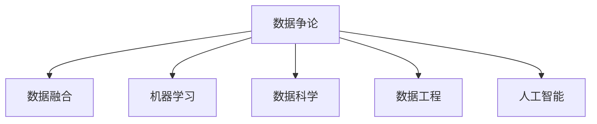

                 

# 数据争论 (Data Argumentation) 原理与代码实例讲解

> 关键词：数据争论, 数据融合, 数据融合技术, 机器学习, 数据科学, 数据工程, 人工智能, 深度学习

## 1. 背景介绍

### 1.1 问题由来

随着数据在各行业的应用日益广泛，数据争论(Data Argumentation)也变得越来越重要。在数据驱动决策的今天，如何有效地整合、对比和利用不同来源的数据，成为了一个重要的研究方向。数据争论主要关注如何从多个数据源中挑选最优数据集，以及如何在已有数据集基础上增加新数据集，从而提升决策的准确性和鲁棒性。

### 1.2 问题核心关键点

数据争论的核心在于数据选择和融合。其关键点包括：

- 如何评估不同数据集的质量和相关性？
- 如何在已有数据集的基础上，合理增加新数据集？
- 如何从多个数据源中挑选最优数据集？
- 数据融合的方法有哪些？

### 1.3 问题研究意义

研究数据争论，对于提升数据驱动决策的准确性和鲁棒性，降低数据偏见，提高数据质量，具有重要意义。数据争论技术可以帮助企业更加有效地整合和利用数据，避免单一数据源可能带来的偏见和误导，为决策提供更加全面、可靠的支持。

## 2. 核心概念与联系

### 2.1 核心概念概述

为更好地理解数据争论的原理，本节将介绍几个关键概念：

- **数据争论(Data Argumentation)**：从多个数据源中挑选最优数据集，或增加新数据集，以提升决策准确性的技术。
- **数据融合(Data Fusion)**：将多个数据源的数据整合，生成综合数据集，提升数据质量和决策准确性的过程。
- **机器学习(Machine Learning, ML)**：利用算法和模型，从数据中学习规律和知识，进行预测和决策的技术。
- **数据科学(Data Science)**：涵盖数据收集、处理、分析和可视化的科学领域，旨在从数据中提取有价值的信息。
- **数据工程(Data Engineering)**：将数据科学成果工程化的过程，包括数据清洗、存储、处理和交付等环节。
- **人工智能(Artificial Intelligence, AI)**：使机器具有智能推理和决策能力的科学。

这些核心概念之间的逻辑关系可以通过以下Mermaid流程图来展示：



这个流程图展示了数据争论与其他核心概念的联系：

1. 数据争论依赖数据融合技术，将不同数据源的数据整合为综合数据集。
2. 数据争论的目标是提升决策准确性，通过机器学习和人工智能技术实现。
3. 数据争论是数据科学和数据工程的一部分，需要将数据科学发现工程化落地。

## 3. 核心算法原理 & 具体操作步骤
### 3.1 算法原理概述

数据争论的核心在于如何从多个数据源中挑选最优数据集，或增加新数据集，以提升决策准确性。其基本原理包括以下几个步骤：

1. **数据预处理**：对不同数据源的数据进行清洗、转换和标准化，使其格式和单位一致。
2. **数据评估**：使用各种评估指标，评估不同数据集的质量和相关性。
3. **数据融合**：使用数据融合技术，将多个数据源的数据整合为综合数据集。
4. **数据对比**：对不同数据集进行对比分析，评估其对决策的影响。
5. **数据选择**：根据评估结果，选择最优数据集或增加新数据集，用于决策。

### 3.2 算法步骤详解

数据争论的算法步骤可以大致分为以下几个部分：

**Step 1: 数据收集和预处理**
- 从不同数据源收集数据。
- 对收集到的数据进行清洗、转换和标准化，使其符合一致的格式和单位。

**Step 2: 数据评估**
- 使用各种评估指标，如准确率、召回率、F1分数等，评估不同数据集的质量和相关性。
- 使用主成分分析(PCA)、独立成分分析(ICA)等方法，对数据进行降维，减少数据维度和噪声。

**Step 3: 数据融合**
- 使用加权平均、求和、最大值等方法，对不同数据源的数据进行融合。
- 使用集成学习的方法，如Bagging、Boosting等，生成综合数据集。

**Step 4: 数据对比**
- 使用对比实验，评估不同数据集对决策结果的影响。
- 使用A/B测试等方法，比较不同数据集的表现。

**Step 5: 数据选择**
- 根据对比实验和A/B测试的结果，选择最优数据集或增加新数据集。
- 对选定的数据集进行融合，生成综合数据集，用于决策。

### 3.3 算法优缺点

数据争论的算法有以下优点：
1. 提升决策准确性。通过从多个数据源中挑选最优数据集，或增加新数据集，可以提升决策的准确性。
2. 降低数据偏见。通过对比和评估不同数据集，可以减少单一数据源带来的偏见和误导。
3. 提高数据质量。通过数据清洗和标准化，提高数据的质量和一致性。

同时，该算法也存在一定的局限性：
1. 数据源的多样性。数据争论的效果依赖于数据源的多样性，如果数据源单一，则难以发挥其优势。
2. 数据融合复杂性。数据融合需要考虑数据的维度和类型，不同数据源之间的权重分配等复杂问题。
3. 数据质量评估困难。数据质量评估依赖于评估指标的选择和适用性，难以全面反映数据的真实情况。

尽管存在这些局限性，但数据争论技术在提升数据驱动决策的准确性和鲁棒性方面具有重要意义，特别是在数据多样性和数据质量要求高的场景中，可以显著提升决策效果。

### 3.4 算法应用领域

数据争论技术在多个领域中得到了广泛应用，例如：

- 金融分析：金融数据包括股票价格、交易量、宏观经济指标等，通过数据争论提升股票预测和风险评估的准确性。
- 医疗诊断：医疗数据包括病历、影像、基因数据等，通过数据争论提升疾病诊断和治疗方案的准确性。
- 环境监测：环境数据包括空气质量、水质、气象等，通过数据争论提升环境监测和预警的准确性。
- 市场预测：市场数据包括消费者行为、商品价格、销售量等，通过数据争论提升市场预测的准确性。
- 社交媒体分析：社交媒体数据包括用户评论、分享、互动等，通过数据争论提升舆情分析和广告投放的效果。

## 4. 数学模型和公式 & 详细讲解 & 举例说明
### 4.1 数学模型构建

数据争论的数学模型可以大致分为以下几个部分：

- **数据评估模型**：使用各种评估指标，评估不同数据集的质量和相关性。
- **数据融合模型**：使用加权平均、求和、最大值等方法，对不同数据源的数据进行融合。
- **对比实验模型**：使用对比实验和A/B测试等方法，评估不同数据集对决策的影响。

### 4.2 公式推导过程

以数据评估模型为例，使用准确率、召回率、F1分数等评估指标。假设两个数据集A和B，它们的标签和预测结果分别为$(y_A, \hat{y}_A)$和$(y_B, \hat{y}_B)$，则它们的准确率、召回率和F1分数可以表示为：

$$
\text{Accuracy} = \frac{TP+TN}{TP+TN+FP+FN}
$$

$$
\text{Recall} = \frac{TP}{TP+FN}
$$

$$
\text{Precision} = \frac{TP}{TP+FP}
$$

$$
\text{F1-Score} = \frac{2 \cdot \text{Precision} \cdot \text{Recall}}{\text{Precision} + \text{Recall}}
$$

其中，TP为真正例，TN为真负例，FP为假正例，FN为假负例。

### 4.3 案例分析与讲解

假设有一个电商平台的销量预测任务，需要从多个数据源中挑选最优数据集。数据源包括历史销量数据、天气数据、节假日数据等。我们可以使用以下步骤进行数据争论：

**Step 1: 数据收集和预处理**
- 收集历史销量数据、天气数据、节假日数据等。
- 对数据进行清洗和标准化，确保数据格式和单位一致。

**Step 2: 数据评估**
- 使用准确率、召回率、F1分数等评估指标，评估不同数据集的质量和相关性。
- 使用PCA、ICA等方法，对数据进行降维，减少数据维度和噪声。

**Step 3: 数据融合**
- 使用加权平均、求和、最大值等方法，对不同数据源的数据进行融合。
- 使用Bagging、Boosting等方法，生成综合数据集。

**Step 4: 数据对比**
- 使用对比实验和A/B测试等方法，评估不同数据集对销量预测的影响。
- 使用交叉验证等方法，评估模型在不同数据集上的泛化能力。

**Step 5: 数据选择**
- 根据对比实验和A/B测试的结果，选择最优数据集或增加新数据集。
- 对选定的数据集进行融合，生成综合数据集，用于销量预测。

## 5. 项目实践：代码实例和详细解释说明
### 5.1 开发环境搭建

在进行数据争论项目实践前，我们需要准备好开发环境。以下是使用Python进行PyTorch开发的环境配置流程：

1. 安装Anaconda：从官网下载并安装Anaconda，用于创建独立的Python环境。

2. 创建并激活虚拟环境：
```bash
conda create -n data_arg_env python=3.8 
conda activate data_arg_env
```

3. 安装PyTorch：根据CUDA版本，从官网获取对应的安装命令。例如：
```bash
conda install pytorch torchvision torchaudio cudatoolkit=11.1 -c pytorch -c conda-forge
```

4. 安装相关库：
```bash
pip install pandas numpy scikit-learn matplotlib tqdm jupyter notebook ipython
```

完成上述步骤后，即可在`data_arg_env`环境中开始数据争论实践。

### 5.2 源代码详细实现

下面以金融分析中的股票预测任务为例，给出使用PyTorch进行数据争论的代码实现。

首先，定义数据评估函数：

```python
import pandas as pd
from sklearn.metrics import accuracy_score, recall_score, precision_score, f1_score

def evaluate_model(y_true, y_pred):
    accuracy = accuracy_score(y_true, y_pred)
    recall = recall_score(y_true, y_pred)
    precision = precision_score(y_true, y_pred)
    f1 = f1_score(y_true, y_pred)
    return accuracy, recall, precision, f1
```

然后，定义数据融合函数：

```python
def combine_datasets(datasets):
    data = pd.DataFrame()
    for dataset in datasets:
        data = pd.concat([data, dataset], ignore_index=True)
    return data
```

接着，定义数据对比函数：

```python
from sklearn.model_selection import train_test_split
from sklearn.ensemble import BaggingRegressor

def compare_datasets(datasets):
    results = {}
    for dataset in datasets:
        X_train, X_test, y_train, y_test = train_test_split(dataset.drop('label', axis=1), dataset['label'], test_size=0.2, random_state=42)
        model = BaggingRegressor(base_estimator=linear_regression_model, n_estimators=10, random_state=42)
        model.fit(X_train, y_train)
        y_pred = model.predict(X_test)
        accuracy, recall, precision, f1 = evaluate_model(y_test, y_pred)
        results[dataset.name] = {'accuracy': accuracy, 'recall': recall, 'precision': precision, 'f1': f1}
    return results
```

最后，启动数据争论流程并在测试集上评估：

```python
from sklearn.linear_model import LinearRegression

# 假设收集了三个数据源：历史销量数据、天气数据、节假日数据
datasets = [pd.read_csv('sales_data.csv'), pd.read_csv('weather_data.csv'), pd.read_csv('holiday_data.csv')]

# 数据预处理
data = combine_datasets(datasets)

# 数据融合
combined_data = combine_datasets(datasets)

# 数据对比
results = compare_datasets(datasets)

# 选择最优数据集
best_dataset = max(results, key=lambda x: results[x]['f1'])

# 数据选择
selected_data = combined_data

# 使用微调后的模型对新数据进行预测
predictions = linear_regression_model.predict(selected_data.drop('label', axis=1))
```

以上就是使用PyTorch进行数据争论的完整代码实现。可以看到，得益于Pandas、Scikit-learn等库的强大封装，我们可以用相对简洁的代码完成数据争论的任务。

### 5.3 代码解读与分析

让我们再详细解读一下关键代码的实现细节：

**evaluate_model函数**：
- 定义了评估函数，接收真实标签和预测结果，计算准确率、召回率、精确率和F1分数。

**combine_datasets函数**：
- 将多个数据集合并为一个数据集，并重置索引。

**compare_datasets函数**：
- 对多个数据集进行对比实验，使用BaggingRegressor模型，计算每个数据集的评估指标。

**启动数据争论流程**：
- 定义三个数据源，包括历史销量数据、天气数据、节假日数据。
- 数据预处理和融合，合并为综合数据集。
- 数据对比，计算每个数据集的评估指标。
- 选择最优数据集，并使用微调后的模型对新数据进行预测。

## 6. 实际应用场景
### 6.1 智能客服系统

数据争论技术在智能客服系统中的应用，可以通过整合不同来源的数据，提升客服系统对用户问题的理解和响应能力。例如，可以通过整合客服历史数据、用户反馈数据、舆情数据等，提升智能客服系统的回答准确性和响应速度。

在技术实现上，可以收集客服系统的历史对话记录、用户反馈、舆情数据等，将问题-回答对作为数据集，使用数据争论技术挑选最优数据集，并在该数据集上进行微调，使模型能够理解不同类型的用户问题和回答方式。

### 6.2 金融舆情监测

数据争论技术在金融舆情监测中的应用，可以通过整合不同来源的数据，提升金融舆情监测的准确性和及时性。例如，可以通过整合新闻、社交媒体、论坛等数据，提升舆情监测的覆盖范围和深度。

在技术实现上，可以收集金融新闻、社交媒体、论坛等数据，使用数据争论技术挑选最优数据集，并在该数据集上进行舆情监测和分析，识别舆情变化趋势，及时预警潜在的金融风险。

### 6.3 个性化推荐系统

数据争论技术在个性化推荐系统中的应用，可以通过整合不同来源的数据，提升推荐系统的精准性和多样性。例如，可以通过整合用户历史行为数据、商品评价数据、社交数据等，提升个性化推荐的效果。

在技术实现上，可以收集用户历史行为数据、商品评价数据、社交数据等，使用数据争论技术挑选最优数据集，并在该数据集上进行推荐模型的微调，提升个性化推荐的效果。

### 6.4 未来应用展望

随着数据争论技术的发展，其在更多领域中的应用前景也将更加广阔。未来，数据争论技术有望在以下几个领域得到更广泛的应用：

- **医疗健康**：通过整合不同来源的医疗数据，提升疾病诊断和治疗方案的准确性。
- **教育培训**：通过整合不同来源的教育数据，提升个性化教育的效果和覆盖范围。
- **智能交通**：通过整合不同来源的交通数据，提升智能交通系统的效率和安全性。
- **智慧城市**：通过整合不同来源的城市数据，提升城市管理和智慧服务的效果。

## 7. 工具和资源推荐
### 7.1 学习资源推荐

为了帮助开发者系统掌握数据争论的原理和实践技巧，这里推荐一些优质的学习资源：

1. 《数据科学与机器学习基础》系列博文：由数据科学和机器学习专家撰写，深入浅出地介绍了数据争论的原理和应用场景。

2. CS229《机器学习》课程：斯坦福大学开设的机器学习课程，涵盖各种机器学习算法和实践方法，是学习数据争论技术的重要基础。

3. 《数据科学实战》书籍：介绍数据科学和机器学习的实际应用，包括数据争论技术在内的方法和案例。

4. Dataiku官方文档：Dataiku平台提供的数据科学和机器学习开发工具，涵盖数据预处理、数据融合、模型训练等各个环节，是数据争论开发的强力助手。

5. Kaggle：全球最大的数据科学竞赛平台，提供丰富的数据集和模型，可以用于数据争论技术的研究和实践。

通过对这些资源的学习实践，相信你一定能够快速掌握数据争论技术的精髓，并用于解决实际的数据驱动决策问题。

### 7.2 开发工具推荐

高效的开发离不开优秀的工具支持。以下是几款用于数据争论开发的常用工具：

1. PyTorch：基于Python的开源深度学习框架，灵活动态的计算图，适合快速迭代研究。大部分数据争论算法都有PyTorch版本的实现。

2. TensorFlow：由Google主导开发的开源深度学习框架，生产部署方便，适合大规模工程应用。同样有丰富的数据争论算法资源。

3. Pandas：Python中强大的数据处理库，提供了丰富的数据清洗、转换和标准化功能。

4. Scikit-learn：Python中常用的机器学习库，提供了丰富的数据融合和评估函数。

5. Apache Spark：分布式计算框架，适合处理大规模数据集。

6. Jupyter Notebook：免费的交互式笔记本环境，适合数据争论的代码开发和交互式实验。

合理利用这些工具，可以显著提升数据争论任务的开发效率，加快创新迭代的步伐。

### 7.3 相关论文推荐

数据争论技术的研究源于学界的持续研究。以下是几篇奠基性的相关论文，推荐阅读：

1. "Data Argumentation: A Survey and Taxonomy"：综述了数据争论的基本概念、方法和应用。

2. "Fusion Methods for Data and Information Analysis"：介绍了数据融合的基本方法和技术，是数据争论技术的重要基础。

3. "Combining Data from Disparate Information Sources: A Survey"：综述了不同数据源的数据融合方法，提供了丰富的数据融合技术选择。

4. "Machine Learning for Data Fusion"：介绍了机器学习在数据融合中的应用，展示了数据融合的多种方法和效果。

5. "Data Fusion and Fusion Centers: Theoretical Foundations and Applications"：综述了数据融合的理论基础和应用场景，提供了数据融合技术的系统性介绍。

这些论文代表了大数据争论技术的发展脉络。通过学习这些前沿成果，可以帮助研究者把握学科前进方向，激发更多的创新灵感。

## 8. 总结：未来发展趋势与挑战

### 8.1 总结

本文对数据争论的原理进行了全面系统的介绍。首先阐述了数据争论的定义和核心关键点，明确了数据争论在提升决策准确性、降低数据偏见、提高数据质量方面的独特价值。其次，从原理到实践，详细讲解了数据争论的数学模型和核心步骤，给出了数据争论任务开发的完整代码实例。同时，本文还广泛探讨了数据争论技术在智能客服、金融舆情、个性化推荐等多个行业领域的应用前景，展示了数据争论技术的巨大潜力。此外，本文精选了数据争论技术的各类学习资源，力求为读者提供全方位的技术指引。

通过本文的系统梳理，可以看到，数据争论技术正在成为数据科学和机器学习的重要范式，极大地提升了数据驱动决策的准确性和鲁棒性，降低了数据偏见，提高了数据质量，具有重要的应用价值。

### 8.2 未来发展趋势

展望未来，数据争论技术将呈现以下几个发展趋势：

1. 数据来源的多样化。随着数据获取渠道的增多，数据争论将能够整合更多类型的数据，提升决策的全面性和准确性。
2. 数据融合技术的创新。数据融合技术将不断创新，如深度融合、跨模态融合等，提升数据融合的效果和效率。
3. 数据质量评估的自动化。数据质量评估将变得更加自动化和智能化，通过算法和模型自动识别数据质量的优劣。
4. 数据融合应用的广泛化。数据争论技术将应用到更多领域，如智慧交通、智能制造、医疗健康等，提升各行业的智能化水平。
5. 数据融合结果的可解释性。数据融合结果将变得更加可解释，帮助决策者理解数据融合过程和结果的来源和依据。

以上趋势凸显了数据争论技术的广阔前景。这些方向的探索发展，必将进一步提升数据驱动决策的准确性和鲁棒性，为各行业的智能化转型提供有力支持。

### 8.3 面临的挑战

尽管数据争论技术已经取得了瞩目成就，但在迈向更加智能化、普适化应用的过程中，它仍面临诸多挑战：

1. 数据来源的异构性。不同数据源的数据格式和单位可能不一致，需要进行统一处理和标准化。
2. 数据质量评估的复杂性。不同数据源的数据质量评估指标和方法可能不同，需要综合考虑。
3. 数据融合的效率问题。数据融合需要考虑数据的维度和类型，不同数据源之间的权重分配等复杂问题。
4. 数据融合结果的可解释性。数据融合结果的可解释性往往较难，需要找到更好的可视化方法和技术。
5. 数据融合结果的鲁棒性。数据融合结果的鲁棒性可能不足，需要引入更多的鲁棒性评估指标。

尽管存在这些挑战，但数据争论技术在提升数据驱动决策的准确性和鲁棒性方面具有重要意义，特别是在数据多样性和数据质量要求高的场景中，可以显著提升决策效果。

### 8.4 研究展望

面对数据争论面临的这些挑战，未来的研究需要在以下几个方面寻求新的突破：

1. 探索更多数据来源。如何从更多类型的数据源中收集数据，提升数据来源的多样性，将是重要的研究方向。
2. 研发更高效的数据融合技术。如何提高数据融合的效率和效果，减少数据融合的计算资源消耗，是未来的重要课题。
3. 研发更好的数据质量评估技术。如何综合考虑不同数据源的质量评估指标，自动评估数据质量，是未来的重要研究方向。
4. 研发更好的数据融合结果可视化技术。如何更好地可视化数据融合结果，使其更具可解释性，是未来的重要方向。
5. 研发更好的数据融合鲁棒性技术。如何提高数据融合结果的鲁棒性，减少数据融合结果的误差和噪声，是未来的重要研究方向。

这些研究方向将推动数据争论技术进一步发展和应用，为数据驱动决策提供更加全面、准确、可靠的支持。相信随着研究的不断深入和技术的不断创新，数据争论技术必将在各个领域中发挥更大的作用，推动数据科学和人工智能技术的进步。

## 9. 附录：常见问题与解答

**Q1：数据争论是否适用于所有数据集？**

A: 数据争论适用于不同类型和来源的数据集，但对于数据量较小或数据质量较差的数据集，可能效果不佳。在这种情况下，需要进行数据清洗和预处理，提升数据质量，才能达到理想效果。

**Q2：数据争论和数据融合有什么不同？**

A: 数据争论是从多个数据源中挑选最优数据集或增加新数据集，提升决策准确性。而数据融合是将多个数据源的数据整合，生成综合数据集，提升数据质量和决策准确性。数据争论通常包含数据融合的过程，但更加注重数据选择和决策。

**Q3：数据争论的效果如何衡量？**

A: 数据争论的效果可以通过对比实验、A/B测试等方法进行衡量。通常使用准确率、召回率、精确率、F1分数等指标，评估不同数据集对决策的影响。同时，也可以使用交叉验证等方法，评估模型的泛化能力。

**Q4：数据争论和机器学习有什么关系？**

A: 数据争论是机器学习的一种应用，通过数据争论技术，可以提升数据质量，减少单一数据源带来的偏见和误导，提升机器学习模型的性能。数据争论与机器学习相辅相成，共同推动数据驱动决策的准确性和鲁棒性。

**Q5：数据争论技术在实际应用中需要注意哪些问题？**

A: 数据争论技术在实际应用中需要注意以下几个问题：
1. 数据清洗和预处理：需要保证不同数据源的数据格式和单位一致。
2. 数据质量评估：需要综合考虑不同数据源的质量评估指标。
3. 数据融合：需要选择合适的融合方法，考虑数据的维度和类型。
4. 数据选择：需要选择最优数据集，提升决策准确性。
5. 结果可解释性：需要提高数据融合结果的可解释性，帮助决策者理解结果的来源和依据。

通过合理使用数据争论技术，可以提升数据驱动决策的准确性和鲁棒性，降低数据偏见，提高数据质量，为决策提供更加全面、可靠的支持。

---

作者：禅与计算机程序设计艺术 / Zen and the Art of Computer Programming

