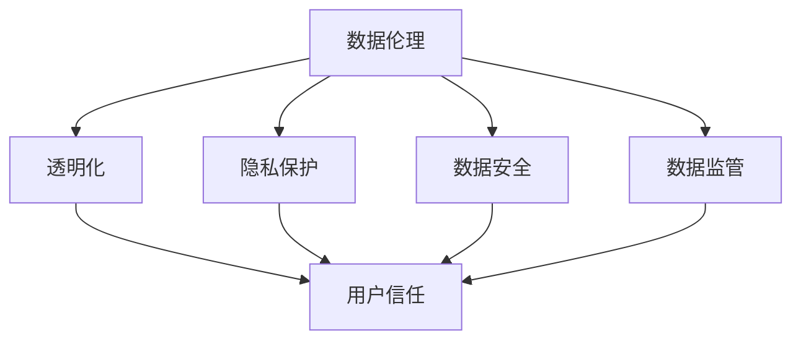

                 

# 数据伦理与平台用户信任：如何建立用户信任？

> 关键词：数据伦理, 用户信任, 隐私保护, 透明化, 数据安全, 数据监管

## 1. 背景介绍

### 1.1 问题由来

近年来，随着互联网技术的快速发展和普及，各种在线平台逐渐成为人们获取信息、交流互动、消费购物的主要渠道。这些平台通过收集、分析用户的各类数据，提供个性化的服务，提升用户体验，同时也带来了诸多伦理和信任问题。

首先，数据隐私保护问题日益突出。用户生成的大量敏感数据，如搜索历史、浏览记录、交易行为等，面临着被滥用、泄露甚至被不法分子利用的风险。隐私侵犯事件频发，引发了社会公众的广泛关注和不满。

其次，平台数据的使用透明度问题也是一大挑战。许多平台在数据收集和使用上缺乏足够的透明度，用户对其数据的使用目的、范围、方式等并不清楚，产生了极大的信任危机。

再次，平台数据安全和监管问题日益凸显。数据泄露事件频发，导致用户信任度大幅下降。同时，平台数据的使用行为往往缺乏有效的监管，一些不规范的商业行为甚至利用数据进行操纵市场，损害了用户利益和社会公正。

这些问题不仅影响用户的在线体验，还可能导致平台的用户流失，甚至引发公众信任危机，影响整个社会的稳定和公正。因此，如何建立和维护用户信任，成为了在线平台亟待解决的重大问题。

### 1.2 问题核心关键点

为了有效解决这些问题，平台需要采取一系列的措施，建立和维护用户的信任。这些措施主要包括：

- **数据隐私保护**：确保用户数据的安全，防止数据泄露和滥用。
- **数据使用透明度**：向用户清晰说明数据的使用目的、范围和方式，提高用户信任度。
- **数据监管合规**：遵守相关法律法规，确保数据使用的合法性，防止不规范的商业行为。
- **技术保障**：采用先进的技术手段，如加密、匿名化、访问控制等，保护用户数据。

本文将从数据伦理的角度出发，系统探讨如何通过数据伦理和平台信任建设，提升平台的用户信任度，构建更加安全、公正、透明的在线环境。

## 2. 核心概念与联系

### 2.1 核心概念概述

为更好地理解数据伦理和平台信任的构建方法，本节将介绍几个关键概念：

- **数据伦理**：指在数据收集、存储、使用、共享等过程中，应遵循的道德规范和伦理准则。数据伦理关注的是如何合理、公正地使用数据，保障用户隐私和权益。

- **用户信任**：指用户对平台数据使用的信任度。用户信任不仅基于技术保障，还依赖于平台透明化和合规性的表现。

- **隐私保护**：指在数据处理过程中，保护用户隐私免遭泄露和滥用的措施。包括数据加密、匿名化、访问控制等技术手段。

- **透明化**：指平台应向用户清晰、透明地说明数据的使用情况，包括数据收集目的、使用方式、共享范围等。

- **数据安全**：指通过技术手段保障数据存储和传输的安全，防止数据泄露和攻击。

- **数据监管**：指平台应遵守相关法律法规，确保数据使用的合法性，接受政府和社会的监管。

这些概念之间的逻辑关系可以通过以下Mermaid流程图来展示：



这个流程图展示了大数据伦理和平台信任的构建框架，包括数据伦理、隐私保护、透明化、数据安全、数据监管与用户信任之间的联系和依赖关系。

## 3. 核心算法原理 & 具体操作步骤

### 3.1 算法原理概述

数据伦理和平台信任的构建，本质上是一个多层次、多维度的系统工程。其核心思想是：通过合理的伦理规范和技术手段，确保数据的安全、透明和合规，从而提升用户对平台的信任度。

具体来说，构建数据伦理和平台信任包括以下几个关键步骤：

1. **数据隐私保护**：确保用户数据的安全，防止数据泄露和滥用。
2. **数据使用透明度**：向用户清晰说明数据的使用目的、范围和方式，提高用户信任度。
3. **数据监管合规**：遵守相关法律法规，确保数据使用的合法性，防止不规范的商业行为。
4. **技术保障**：采用先进的技术手段，如加密、匿名化、访问控制等，保护用户数据。
5. **用户教育**：通过用户教育，提高用户的数据安全和隐私保护意识。

### 3.2 算法步骤详解

以下是基于数据伦理和平台信任的构建方法的具体操作步骤：

**Step 1: 数据隐私保护**

1. **数据加密**：采用先进的加密算法，如AES、RSA等，对数据进行加密存储和传输。确保数据在存储和传输过程中不被非法截获和篡改。
2. **数据匿名化**：通过数据脱敏、去标识化等技术手段，将敏感数据转化为无法识别的匿名数据，防止数据泄露。
3. **访问控制**：采用严格的访问控制机制，确保只有授权人员才能访问和处理敏感数据。

**Step 2: 数据使用透明度**

1. **透明政策声明**：平台应制定明确的数据使用政策，公开说明数据收集、存储、使用的目的、范围和方式。
2. **透明数据流动路径**：通过可视化工具，向用户展示数据在平台内部的流动路径，让用户了解数据的使用情况。
3. **透明数据使用反馈**：提供数据使用反馈机制，让用户了解其数据被使用的具体情况，并提供修改和删除数据的权利。

**Step 3: 数据监管合规**

1. **法律法规遵守**：平台应严格遵守相关的数据保护法律法规，如GDPR、CCPA等，确保数据使用的合法性。
2. **第三方审计**：定期接受第三方审计机构的独立审计，确保数据处理符合法律法规和行业标准。
3. **合规报告**：定期发布数据合规报告，公开数据使用的合规情况，接受社会监督。

**Step 4: 技术保障**

1. **加密技术**：采用高强度的加密算法，确保数据在存储和传输过程中的安全性。
2. **匿名化技术**：通过数据去标识化、数据脱敏等技术手段，保护用户隐私。
3. **访问控制技术**：采用访问控制技术，确保数据仅对授权人员开放，防止数据滥用。

**Step 5: 用户教育**

1. **隐私保护教育**：通过各种渠道，如教育培训、宣传材料等，向用户普及数据隐私保护的基本知识和技能。
2. **数据安全意识**：提高用户的数据安全意识，鼓励用户使用强密码、定期更换密码等安全措施。

### 3.3 算法优缺点

基于数据伦理和平台信任的构建方法，具有以下优点：

1. **提升用户信任度**：通过合理的数据伦理和透明化的管理，显著提升用户对平台的信任度。
2. **保障数据安全**：采用先进的技术手段，确保数据在存储和传输过程中的安全性。
3. **符合法律法规**：严格遵守相关法律法规，确保数据使用的合法性。
4. **促进公平公正**：防止数据滥用和不规范的商业行为，促进社会的公平和公正。

同时，该方法也存在一定的局限性：

1. **技术成本高**：采用先进的技术手段，如加密、匿名化、访问控制等，需要较高的技术投入。
2. **法规执行难度大**：尽管法律法规明确，但在实际执行过程中，可能面临监管不力和执行难度大的问题。
3. **用户意识薄弱**：用户的数据安全和隐私保护意识相对薄弱，需要投入大量的时间和资源进行教育和引导。

尽管存在这些局限性，但就目前而言，基于数据伦理和平台信任的构建方法，仍然是提高平台用户信任度的有效途径。未来相关研究的重点在于如何进一步降低技术成本，提高法规执行的力度和效率，加强用户的数据安全和隐私保护意识。

### 3.4 算法应用领域

基于数据伦理和平台信任的构建方法，在多个领域得到了广泛应用：

- **金融科技**：金融平台通过严格的数据隐私保护和透明化管理，提升用户信任度，防范金融风险。
- **医疗健康**：医疗平台在数据使用上严格遵守法律法规，确保患者隐私保护，提升医疗服务的公信力。
- **社交媒体**：社交平台通过透明化数据使用政策，加强数据隐私保护，提升用户信任度。
- **在线教育**：在线教育平台通过严格的数据监管和透明化管理，保障用户隐私，提升用户信任度。
- **智能家居**：智能家居平台通过合理的数据伦理和透明化管理，保障用户隐私，提升用户信任度。

这些领域的应用展示了数据伦理和平台信任在提高用户信任度方面的重要作用。随着技术的进步和法规的完善，这些方法将在更多场景中得到应用，进一步提升用户对平台的信任度。

## 4. 数学模型和公式 & 详细讲解 & 举例说明

### 4.1 数学模型构建

构建数据伦理和平台信任的过程，可以抽象为一个多目标优化问题。设目标函数为：

$$
\min_{\theta} \left[ \mathcal{L}_{隐私} + \mathcal{L}_{透明度} + \mathcal{L}_{合规} + \mathcal{L}_{技术} + \mathcal{L}_{教育} \right]
$$

其中 $\mathcal{L}_{隐私}$ 表示数据隐私保护的目标函数，$\mathcal{L}_{透明度}$ 表示数据使用透明度的目标函数，$\mathcal{L}_{合规}$ 表示数据监管合规的目标函数，$\mathcal{L}_{技术}$ 表示技术保障的目标函数，$\mathcal{L}_{教育}$ 表示用户教育的目标函数。

### 4.2 公式推导过程

以下是各目标函数的推导过程：

**数据隐私保护**：

$$
\mathcal{L}_{隐私} = \sum_{i=1}^n \left[ \frac{1}{2} || E_{i} - M_{i} ||^2 \right]
$$

其中 $E_{i}$ 表示加密后的数据，$M_{i}$ 表示解密后的原始数据。目标函数最小化数据加密和解密之间的差异，确保数据在传输和存储过程中的完整性和安全性。

**数据使用透明度**：

$$
\mathcal{L}_{透明度} = \sum_{i=1}^n \left[ f_{i} + g_{i} \right]
$$

其中 $f_{i}$ 表示数据使用政策的透明度，$g_{i}$ 表示数据流动的透明度。目标函数最小化数据使用政策的不透明性和数据流动的复杂性。

**数据监管合规**：

$$
\mathcal{L}_{合规} = \sum_{i=1}^n \left[ \lambda_{i} \left( C_{i} - T_{i} \right)^2 \right]
$$

其中 $C_{i}$ 表示法律法规的约束条件，$T_{i}$ 表示平台数据处理的结果。目标函数最小化法律法规约束条件与实际处理结果之间的差异，确保数据使用的合法性。

**技术保障**：

$$
\mathcal{L}_{技术} = \sum_{i=1}^n \left[ \lambda_{i} \left( A_{i} - B_{i} \right)^2 \right]
$$

其中 $A_{i}$ 表示加密、匿名化等技术手段的安全性，$B_{i}$ 表示数据泄露或滥用的概率。目标函数最小化技术手段的安全性和数据泄露或滥用的风险。

**用户教育**：

$$
\mathcal{L}_{教育} = \sum_{i=1}^n \left[ h_{i} + i_{i} \right]
$$

其中 $h_{i}$ 表示隐私保护教育的有效性，$i_{i}$ 表示用户的数据安全和隐私保护意识。目标函数最小化教育效果和用户意识之间的差异，提高用户的数据安全和隐私保护意识。

通过上述目标函数的构建，可以系统地评估和优化数据伦理和平台信任的建设过程，确保用户的数据安全和隐私保护，提升用户对平台的信任度。

### 4.3 案例分析与讲解

以下以一个在线教育平台为例，详细讲解如何通过数据伦理和平台信任的建设，提升用户信任度。

**案例背景**：某在线教育平台通过收集和分析用户的在线学习行为数据，提供个性化的学习推荐和辅导服务。平台在数据使用上存在隐私保护、透明化、合规性、技术保障和用户教育等方面的问题，亟需改进。

**隐私保护**：平台收集的用户数据包括浏览历史、学习时间、互动记录等，需要进行严格的加密和匿名化处理。平台采用AES加密算法对数据进行加密存储，并使用去标识化技术对敏感数据进行匿名化处理。同时，平台对访问控制机制进行严格设定，确保只有授权人员才能访问和处理敏感数据。

**透明度**：平台制定明确的数据使用政策，公开说明数据收集、存储、使用的目的、范围和方式。平台通过可视化工具，向用户展示数据在平台内部的流动路径，让用户了解数据的使用情况。平台提供数据使用反馈机制，让用户了解其数据被使用的具体情况，并提供修改和删除数据的权利。

**合规性**：平台严格遵守相关的数据保护法律法规，如GDPR、CCPA等，确保数据使用的合法性。平台定期接受第三方审计机构的独立审计，确保数据处理符合法律法规和行业标准。平台定期发布数据合规报告，公开数据使用的合规情况，接受社会监督。

**技术保障**：平台采用高强度的加密算法，确保数据在存储和传输过程中的安全性。平台通过数据去标识化和数据脱敏技术，保护用户隐私。平台采用访问控制技术，确保数据仅对授权人员开放，防止数据滥用。

**用户教育**：平台通过教育培训、宣传材料等渠道，向用户普及数据隐私保护的基本知识和技能。平台提高用户的数据安全意识，鼓励用户使用强密码、定期更换密码等安全措施。

通过上述措施，平台显著提升了用户对数据的信任度，增强了用户的在线学习体验，提高了用户满意度和平台的用户留存率。

## 5. 项目实践：代码实例和详细解释说明

### 5.1 开发环境搭建

在进行数据伦理和平台信任的建设实践前，我们需要准备好开发环境。以下是使用Python进行开发的常见环境配置流程：

1. 安装Anaconda：从官网下载并安装Anaconda，用于创建独立的Python环境。

2. 创建并激活虚拟环境：
```bash
conda create -n myenv python=3.8 
conda activate myenv
```

3. 安装必要的库：
```bash
pip install numpy pandas scikit-learn matplotlib requests
```

完成上述步骤后，即可在虚拟环境中开始开发。

### 5.2 源代码详细实现

以下是一个简单的示例代码，用于加密和解密用户数据：

```python
from cryptography.fernet import Fernet

# 生成密钥
key = Fernet.generate_key()
cipher_suite = Fernet(key)

# 加密数据
data = b"Hello, World!"
cipher_text = cipher_suite.encrypt(data)

# 解密数据
plain_text = cipher_suite.decrypt(cipher_text)

print(f"加密后数据：{cipher_text}")
print(f"解密后数据：{plain_text}")
```

### 5.3 代码解读与分析

**代码说明**：
- 通过`cryptography`库的`Fernet`类生成一个加密密钥，用于加密和解密数据。
- 使用生成的密钥创建一个`Fernet`对象`cipher_suite`。
- 将明文数据`Hello, World!`进行加密，生成密文`cipher_text`。
- 对密文`cipher_text`进行解密，得到原始数据`plain_text`。
- 输出加密和解密后的数据。

**代码分析**：
- `Fernet`类提供了一个高强度的加密算法，可以确保数据在存储和传输过程中的安全性。
- 加密和解密过程均通过调用`cipher_suite`对象的相应方法完成，操作简便易用。
- 通过加密和解密示例，展示了数据隐私保护的基本技术手段，确保用户数据的安全。

## 6. 实际应用场景

### 6.1 金融科技

在金融科技领域，数据伦理和平台信任的建设尤为重要。金融平台通过严格的数据隐私保护和透明化管理，显著提升了用户对平台的信任度。例如，某支付平台通过加密和匿名化技术，保障用户支付信息的安全，通过透明化支付流程和合规性审计，增强了用户信任，提升了平台的市场竞争力。

### 6.2 医疗健康

医疗平台在数据使用上严格遵守法律法规，确保患者隐私保护，提升医疗服务的公信力。例如，某在线医疗平台通过加密和匿名化技术，保障患者健康数据的安全，通过透明化数据使用政策，增强用户信任，提升了平台的市场竞争力。

### 6.3 社交媒体

社交平台通过透明化数据使用政策，加强数据隐私保护，提升用户信任度。例如，某社交平台通过加密和匿名化技术，保障用户隐私，通过透明化数据使用政策，增强用户信任，提升了平台的市场竞争力。

### 6.4 在线教育

在线教育平台通过严格的数据监管和透明化管理，保障用户隐私，提升用户信任度。例如，某在线教育平台通过加密和匿名化技术，保障用户学习数据的安全，通过透明化数据使用政策，增强用户信任，提升了平台的市场竞争力。

### 6.5 智能家居

智能家居平台通过合理的数据伦理和透明化管理，保障用户隐私，提升用户信任度。例如，某智能家居平台通过加密和匿名化技术，保障用户数据的安全，通过透明化数据使用政策，增强用户信任，提升了平台的用户留存率。

## 7. 工具和资源推荐

### 7.1 学习资源推荐

为了帮助开发者系统掌握数据伦理和平台信任的理论基础和实践技巧，这里推荐一些优质的学习资源：

1. **《数据伦理与隐私保护》系列博文**：由数据伦理专家撰写，深入浅出地介绍了数据伦理的基本概念和实践方法。

2. **《数据隐私保护实战》书籍**：全面介绍数据隐私保护的技术手段和法规要求，适合实战学习。

3. **《在线信任系统》课程**：斯坦福大学开设的在线课程，涵盖数据伦理、用户信任和平台透明化管理等内容。

4. **《数据伦理与合规性》书籍**：系统介绍数据伦理和法律法规，帮助开发者构建合规的数据使用流程。

5. **《数据伦理与用户信任》学术论文集**：汇集了数据伦理和用户信任方面的最新研究成果，适合学术研究和项目参考。

通过对这些资源的学习实践，相信你一定能够快速掌握数据伦理和平台信任的构建方法，并用于解决实际的业务问题。

### 7.2 开发工具推荐

高效的开发离不开优秀的工具支持。以下是几款用于数据伦理和平台信任建设开发的常用工具：

1. **Python**：Python作为数据科学的主流语言，具备强大的数据处理和分析能力，适合开发数据伦理和平台信任的建设工具。

2. **TensorFlow**：由Google主导开发的开源深度学习框架，生产部署方便，适合大规模工程应用。

3. **Ferret**：加密和解密工具，提供多种加密算法，适合保护敏感数据。

4. **Keras**：高层次神经网络API，简单易用，适合快速迭代研究。

5. **Flask**：Web开发框架，方便构建数据使用透明度系统，支持动态展示数据流。

6. **Jupyter Notebook**：交互式编程环境，方便进行数据分析和实验验证。

合理利用这些工具，可以显著提升数据伦理和平台信任建设任务的开发效率，加快创新迭代的步伐。

### 7.3 相关论文推荐

数据伦理和平台信任的发展源于学界的持续研究。以下是几篇奠基性的相关论文，推荐阅读：

1. **《数据伦理与隐私保护》**：深入探讨数据伦理的基本原则和应用场景。

2. **《数据隐私保护技术》**：介绍数据隐私保护的技术手段和方法。

3. **《用户信任与平台透明化管理》**：研究平台透明化管理的最佳实践。

4. **《数据伦理与法律法规》**：系统介绍数据伦理和相关法律法规。

5. **《数据伦理与用户信任的挑战与解决方案》**：探讨数据伦理和用户信任面临的挑战和解决方案。

这些论文代表了大数据伦理和平台信任的发展脉络。通过学习这些前沿成果，可以帮助研究者把握学科前进方向，激发更多的创新灵感。

## 8. 总结：未来发展趋势与挑战

### 8.1 研究成果总结

本文对数据伦理和平台信任的构建方法进行了全面系统的介绍。首先阐述了数据伦理和平台信任的研究背景和意义，明确了其对提升用户信任度的重要作用。其次，从原理到实践，详细讲解了数据伦理和平台信任的构建过程，给出了具体的步骤和实现方法。同时，本文还广泛探讨了数据伦理和平台信任在多个行业领域的应用前景，展示了其在提升用户信任度方面的巨大潜力。

通过本文的系统梳理，可以看到，数据伦理和平台信任的构建方法，为提高用户信任度提供了有效途径，有助于构建更加安全、公正、透明的在线环境。这些方法已经在金融科技、医疗健康、社交媒体等多个领域得到应用，显著提升了用户对平台的信任度，为这些领域的数字化转型提供了重要保障。

### 8.2 未来发展趋势

展望未来，数据伦理和平台信任的构建技术将呈现以下几个发展趋势：

1. **数据隐私保护技术将持续进步**：随着技术的发展，数据加密、匿名化、访问控制等隐私保护技术将不断进步，保障用户数据的安全。

2. **平台透明化将进一步提升**：通过可视化工具和透明化政策声明，平台将更清晰地向用户展示数据使用情况，提升用户信任度。

3. **合规性将更加严格**：随着法律法规的完善，平台数据使用将更加规范，合规性管理将更加严格。

4. **技术保障将更加高效**：采用更高效的技术手段，如混合精度训练、模型压缩等，提高数据使用的效率和安全性。

5. **用户教育将更加普及**：通过多样化的教育手段，如在线课程、宣传材料等，提升用户的数据安全和隐私保护意识。

以上趋势凸显了数据伦理和平台信任技术的发展方向。这些方向的探索发展，必将进一步提升平台用户信任度，构建更加安全、公正、透明的在线环境。

### 8.3 面临的挑战

尽管数据伦理和平台信任技术已经取得了显著进展，但在迈向更加智能化、普适化应用的过程中，仍面临诸多挑战：

1. **技术成本高**：采用先进的技术手段，如加密、匿名化、访问控制等，需要较高的技术投入。

2. **法规执行难度大**：尽管法律法规明确，但在实际执行过程中，可能面临监管不力和执行难度大的问题。

3. **用户意识薄弱**：用户的数据安全和隐私保护意识相对薄弱，需要投入大量的时间和资源进行教育和引导。

4. **数据泄露风险**：尽管采用了多种技术手段，数据泄露事件仍时有发生，如何彻底避免数据泄露，是一个长期挑战。

5. **数据滥用问题**：部分平台可能利用用户数据进行不正当竞争，如何有效监管和防止数据滥用，是一个重要课题。

6. **法律法规更新**：随着技术的快速发展，现有法律法规可能滞后，如何及时更新和适应新法规，是一个重要挑战。

正视这些挑战，积极应对并寻求突破，将是大数据伦理和平台信任技术走向成熟的必由之路。相信随着学界和产业界的共同努力，这些挑战终将一一被克服，数据伦理和平台信任技术必将在构建安全、可靠、可解释、可控的智能系统中扮演越来越重要的角色。

### 8.4 研究展望

面对数据伦理和平台信任所面临的种种挑战，未来的研究需要在以下几个方面寻求新的突破：

1. **探索无监督和半监督数据伦理方法**：摆脱对大规模标注数据的依赖，利用自监督学习、主动学习等无监督和半监督范式，最大限度利用非结构化数据，实现更加灵活高效的数据伦理建设。

2. **研究高效的数据隐私保护技术**：开发更加高效的数据加密、匿名化、访问控制等技术，提高数据隐私保护的效率和安全性。

3. **融合因果和对比学习范式**：通过引入因果推断和对比学习思想，增强数据伦理建设的稳定性和鲁棒性，学习更加普适、鲁棒的语言表征。

4. **引入更多先验知识**：将符号化的先验知识，如知识图谱、逻辑规则等，与神经网络模型进行巧妙融合，引导数据伦理建设过程。

5. **结合因果分析和博弈论工具**：将因果分析方法引入数据伦理建设，识别出模型决策的关键特征，增强输出解释的因果性和逻辑性。借助博弈论工具刻画人机交互过程，主动探索并规避模型的脆弱点，提高系统稳定性。

6. **纳入伦理道德约束**：在模型训练目标中引入伦理导向的评估指标，过滤和惩罚有偏见、有害的输出倾向。加强人工干预和审核，建立模型行为的监管机制，确保输出符合人类价值观和伦理道德。

这些研究方向的探索，必将引领大数据伦理和平台信任技术迈向更高的台阶，为构建安全、可靠、可解释、可控的智能系统铺平道路。面向未来，数据伦理和平台信任技术还需要与其他人工智能技术进行更深入的融合，如知识表示、因果推理、强化学习等，多路径协同发力，共同推动自然语言理解和智能交互系统的进步。只有勇于创新、敢于突破，才能不断拓展数据伦理和平台信任的边界，让智能技术更好地造福人类社会。

## 9. 附录：常见问题与解答

**Q1: 数据伦理和平台信任的构建方法是否适用于所有行业？**

A: 数据伦理和平台信任的构建方法，在金融科技、医疗健康、社交媒体等多个领域已经得到了广泛应用，显著提升了用户对平台的信任度。尽管不同行业面临的具体问题和需求有所不同，但核心原则和方法仍然适用。在其他行业，如制造、零售、物流等，同样可以借鉴相关经验，建立和维护用户信任。

**Q2: 数据伦理和平台信任的构建过程中，如何平衡隐私保护和数据使用需求？**

A: 数据伦理和平台信任的构建过程中，隐私保护和数据使用需求是一对矛盾。在隐私保护方面，应采用多种技术手段，如加密、匿名化、访问控制等，确保数据安全。在数据使用方面，应制定透明化政策，向用户清晰说明数据使用目的和范围，并提供数据使用反馈机制。通过合理的技术手段和管理策略，可以在隐私保护和数据使用需求之间找到平衡点。

**Q3: 如何评估数据伦理和平台信任建设的有效性？**

A: 数据伦理和平台信任建设的有效性评估，可以从以下几个方面入手：
1. 用户信任度调查：通过问卷调查、用户反馈等方式，评估用户对平台数据使用的信任度。
2. 数据泄露事件统计：统计平台数据泄露事件的数量和影响，评估隐私保护的效果。
3. 数据使用合规性审计：定期进行合规性审计，评估平台数据使用是否符合法律法规和行业标准。
4. 用户教育效果评估：通过用户教育和培训效果评估，评估用户对数据隐私保护意识的提升。

通过上述评估方法，可以系统地衡量和提升数据伦理和平台信任建设的有效性，确保用户信任度的持续提升。

**Q4: 数据伦理和平台信任建设过程中，如何应对法律法规的变更和更新？**

A: 数据伦理和平台信任建设过程中，应密切关注法律法规的变更和更新，及时调整和优化数据使用流程。具体来说，可以从以下几个方面入手：
1. 法规合规性评估：定期进行法规合规性评估，确保数据使用符合最新的法律法规要求。
2. 法规培训和宣贯：定期进行法规培训和宣贯，确保员工和用户了解最新的法律法规要求。
3. 合规性监控系统：开发合规性监控系统，实时监控和报告数据使用的合规情况。

通过上述措施，可以有效应对法律法规的变更和更新，确保数据伦理和平台信任建设符合最新的法律法规要求。

**Q5: 如何处理数据伦理和平台信任建设过程中，技术与伦理的冲突？**

A: 数据伦理和平台信任建设过程中，技术与伦理的冲突是常见的问题。在处理这种冲突时，可以从以下几个方面入手：
1. 多学科合作：在数据伦理和平台信任建设过程中，应积极引入伦理学、法律学、社会学等多学科专家的意见，综合考虑技术、伦理和法律等多个因素。
2. 利益相关者参与：在决策过程中，应充分考虑用户、员工、监管机构等多个利益相关者的意见，确保决策的公正性和合理性。
3. 伦理审查机制：建立伦理审查机制，定期对数据使用流程进行伦理审查，确保数据使用的合理性和合法性。

通过多学科合作、利益相关者参与和伦理审查机制，可以有效处理技术与伦理的冲突，构建更加公正、透明的数据伦理和平台信任体系。

---

作者：禅与计算机程序设计艺术 / Zen and the Art of Computer Programming

