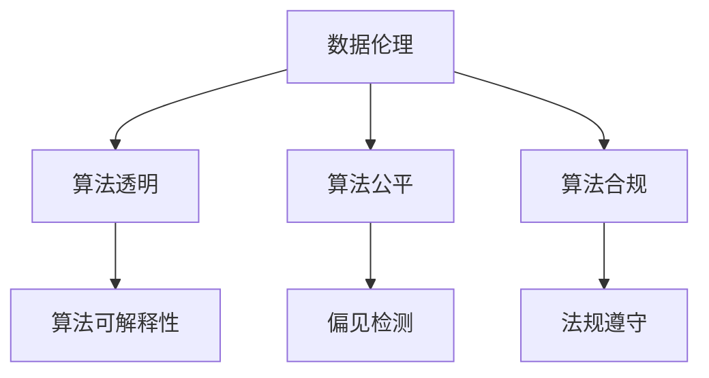

                 

# 数据伦理：算法治理与规范

> 关键词：数据伦理,算法治理,算法透明,隐私保护,可解释性,公平性,伦理合规,人工智能伦理,机器学习伦理

## 1. 背景介绍

### 1.1 问题由来

随着人工智能(AI)技术的迅猛发展，算法在各行各业中的应用日益广泛。从金融风控到医疗诊断，从推荐系统到无人驾驶，AI算法正改变着人类的生产生活方式。然而，算法的广泛应用也带来了诸多伦理和治理问题，引发了社会的广泛关注。

数据作为算法的“养料”，其质量、隐私和公平性等直接决定了算法的效果和影响。尤其是当数据来源于特定群体，如少数族裔、女性、老年人等时，算法偏见问题尤为突出。因此，如何确保数据伦理、算法透明和规范使用，成为当前AI伦理研究的一个重要方向。

### 1.2 问题核心关键点

数据伦理和算法治理的核心关键点包括以下几个方面：

- **数据隐私**：如何保护用户的个人信息不被滥用。
- **算法透明**：如何使算法的决策过程和依据更加透明，避免“黑箱”算法。
- **算法公平**：如何确保算法对不同群体不存在偏见，保障决策公平性。
- **伦理合规**：如何确保算法应用符合法律法规，避免伦理风险。

## 2. 核心概念与联系

### 2.1 核心概念概述

为了更好地理解数据伦理和算法治理，本节将介绍几个密切相关的核心概念：

- **数据伦理(Data Ethics)**：是指在数据收集、处理、存储和使用过程中，应当遵守的一系列伦理原则和规范。
- **算法透明(Algorithm Transparency)**：是指算法的决策过程和依据能够被解释和理解，避免算法的“黑箱”化。
- **算法公平(Algorithm Fairness)**：是指算法对不同群体不存在系统性偏见，能够公平对待每个个体。
- **算法合规(Algorithm Compliance)**：是指算法应用符合法律和法规的要求，避免不合规使用。

这些核心概念之间的逻辑关系可以通过以下Mermaid流程图来展示：



这个流程图展示了几类核心概念及其之间的关系：

1. 数据伦理对算法透明、公平和合规提出了原则性要求。
2. 算法透明是数据伦理和公平性的一个核心维度，有助于识别偏见和确保公平。
3. 算法公平要求透明和合规，以确保算法的决策过程不含有系统性偏见。
4. 算法合规是数据伦理和公平性在法律层面的具体体现，确保算法应用合法合规。

## 3. 核心算法原理 & 具体操作步骤

### 3.1 算法原理概述

算法治理的核心思想是确保算法的公平性、透明性和合规性。具体步骤如下：

1. **数据预处理**：确保数据来源的多样性和代表性，避免数据偏见。
2. **算法选择**：选择合适的算法，进行公开透明的标准测试，确保其性能和公平性。
3. **算法微调**：根据实际需求，对算法进行微调，调整关键参数，优化决策效果。
4. **结果验证**：通过交叉验证和外部评估，验证算法效果和公平性。
5. **模型部署**：将算法部署到实际环境中，进行实时监控和优化。

### 3.2 算法步骤详解

**Step 1: 数据收集与处理**

- **数据来源多样化**：确保数据来源于不同性别、年龄、种族、地域等群体，避免数据偏见。
- **数据匿名化**：对敏感信息进行脱敏处理，避免隐私泄露。
- **数据标准化**：对数据进行标准化和归一化处理，确保数据的一致性和可比性。

**Step 2: 算法选择与评估**

- **算法库选择**：从公开可用的算法库中，选择适合的算法，并进行公开测试。
- **性能评估**：在标准测试集上进行性能评估，对比不同算法的效果。
- **公平性测试**：使用公平性指标（如平衡精度、平等机会曲线等）评估算法的公平性。

**Step 3: 算法微调和验证**

- **参数调优**：根据实际需求，调整算法的关键参数，优化模型效果。
- **交叉验证**：通过交叉验证技术，评估模型在不同数据集上的泛化性能。
- **外部评估**：邀请第三方进行独立评估，验证算法的公平性和透明性。

**Step 4: 模型部署与监控**

- **部署上线**：将算法部署到实际应用环境中，进行实时监控。
- **监控与优化**：实时监控算法性能和公平性，根据反馈结果进行优化调整。

### 3.3 算法优缺点

基于数据伦理的算法治理方法具有以下优点：

1. **提升公平性**：通过规范化数据和算法选择，减少系统性偏见，提升算法的公平性。
2. **增强透明性**：公开算法选择和测试结果，增强算法的透明性，便于公众监督。
3. **保障合规性**：符合法律法规要求，避免伦理风险和法律纠纷。
4. **促进标准化**：采用公开的标准测试和评估方法，提高算法的标准化程度。

同时，该方法也存在一定的局限性：

1. **数据获取难度大**：获取多样化、代表性和匿名化的数据资源，存在较高的成本和难度。
2. **算法调优复杂**：对算法的微调和优化，需要具备较强的技术背景和能力。
3. **性能优化有限**：受限于数据和算法本身，微调后的模型可能仍存在一定性能瓶颈。
4. **监管难度大**：算法的实时监控和优化，需要较强的技术和管理能力。

尽管存在这些局限性，但就目前而言，基于数据伦理的算法治理方法仍是最主流的伦理保障范式。未来相关研究的重点在于如何进一步降低数据获取成本，提高算法的自动化调优能力，同时兼顾算法性能和公平性等因素。

### 3.4 算法应用领域

基于数据伦理的算法治理方法，在多个领域中都得到了广泛的应用，例如：

- **金融风控**：在信用评估、欺诈检测等场景中，通过算法治理确保决策的透明和公平。
- **医疗诊断**：在影像分析、疾病预测等任务中，通过算法治理保障诊断结果的可靠性和公平性。
- **推荐系统**：在个性化推荐、广告投放等场景中，通过算法治理提升推荐效果，避免偏见。
- **法律判决**：在判决支持、合同审核等任务中，通过算法治理确保法律应用的公正和合规。
- **公共安全**：在人脸识别、视频监控等场景中，通过算法治理保障公民隐私权。

除了上述这些经典应用外，基于数据伦理的算法治理方法也在更多场景中得到应用，如智慧城市、智能交通、智能制造等，为AI技术的应用提供了伦理保障。

## 4. 数学模型和公式 & 详细讲解 & 举例说明

### 4.1 数学模型构建

本节将使用数学语言对算法治理的数学模型进行更加严格的刻画。

假设算法模型为 $M_{\theta}:\mathcal{X} \rightarrow \mathcal{Y}$，其中 $\mathcal{X}$ 为输入空间，$\mathcal{Y}$ 为输出空间，$\theta \in \mathbb{R}^d$ 为模型参数。定义模型 $M_{\theta}$ 在数据样本 $(x,y)$ 上的公平性损失函数为 $L_{\text{fair}}(M_{\theta}(x),y)$，则在数据集 $D$ 上的公平性风险为：

$$
\mathcal{L}_{\text{fair}}(\theta) = \frac{1}{N}\sum_{i=1}^N L_{\text{fair}}(M_{\theta}(x_i),y_i)
$$

公平性损失函数可以设计为多个维度的公平性指标，如平衡精度(Balanced Precision)、平等机会曲线(Equal Opportunity Curve)等。这里以平衡精度为例，其定义如下：

$$
L_{\text{balance}}(M_{\theta}(x),y) = \frac{1}{2} [\text{Precision}(\hat{y}^{=1},y^{=1}) + \text{Precision}(\hat{y}^{=0},y^{=0})]
$$

其中 $\hat{y}^{=1}$ 和 $\hat{y}^{=0}$ 分别为预测为正类和负类的样本。

### 4.2 公式推导过程

以下我们以平衡精度为例，推导公平性损失函数及其梯度的计算公式。

假设模型 $M_{\theta}$ 在输入 $x$ 上的输出为 $\hat{y}=M_{\theta}(x) \in [0,1]$，表示样本属于正类的概率。真实标签 $y \in \{0,1\}$。则平衡精度定义为：

$$
L_{\text{balance}}(M_{\theta}(x),y) = \frac{1}{2} [\text{Precision}(\hat{y}^{=1},y^{=1}) + \text{Precision}(\hat{y}^{=0},y^{=0})]
$$

将其代入公平性风险公式，得：

$$
\mathcal{L}_{\text{fair}}(\theta) = \frac{1}{N}\sum_{i=1}^N [L_{\text{balance}}(M_{\theta}(x_i),y_i)]
$$

根据链式法则，公平性损失函数对参数 $\theta_k$ 的梯度为：

$$
\frac{\partial \mathcal{L}_{\text{fair}}(\theta)}{\partial \theta_k} = \frac{1}{N}\sum_{i=1}^N \frac{\partial L_{\text{balance}}(M_{\theta}(x_i),y_i)}{\partial \theta_k}
$$

其中 $\frac{\partial L_{\text{balance}}(M_{\theta}(x_i),y_i)}{\partial \theta_k}$ 可以进一步递归展开，利用自动微分技术完成计算。

### 4.3 案例分析与讲解

**案例1: 金融风控**

金融风控领域，常用的算法包括信用评分模型、反欺诈模型等。这些算法通过分析用户的历史信用记录、交易行为等数据，预测用户是否存在违约或欺诈风险。

- **数据预处理**：收集用户的历史交易数据、社交媒体信息等，确保数据的多样性和匿名性。
- **算法选择**：选择如XGBoost、随机森林等机器学习算法，进行公开测试和公平性评估。
- **算法微调**：根据实际需求，调整算法参数，优化模型效果。
- **结果验证**：通过交叉验证和独立评估，验证算法效果和公平性。
- **模型部署**：将算法部署到实际应用环境中，进行实时监控和优化。

**案例2: 医疗诊断**

医疗诊断领域，常用的算法包括影像分析、疾病预测等。这些算法通过分析医学影像、基因数据等，辅助医生进行诊断和治疗决策。

- **数据预处理**：收集患者的医学影像、基因数据等，确保数据的多样性和代表性。
- **算法选择**：选择如卷积神经网络(CNN)、支持向量机(SVM)等机器学习算法，进行公开测试和公平性评估。
- **算法微调**：根据实际需求，调整算法参数，优化模型效果。
- **结果验证**：通过交叉验证和独立评估，验证算法效果和公平性。
- **模型部署**：将算法部署到实际应用环境中，进行实时监控和优化。

## 5. 项目实践：代码实例和详细解释说明

### 5.1 开发环境搭建

在进行算法治理实践前，我们需要准备好开发环境。以下是使用Python进行Scikit-Learn开发的环境配置流程：

1. 安装Anaconda：从官网下载并安装Anaconda，用于创建独立的Python环境。

2. 创建并激活虚拟环境：
```bash
conda create -n ethics-env python=3.8 
conda activate ethics-env
```

3. 安装Scikit-Learn：
```bash
conda install scikit-learn
```

4. 安装各类工具包：
```bash
pip install numpy pandas matplotlib seaborn
```

完成上述步骤后，即可在`ethics-env`环境中开始算法治理实践。

### 5.2 源代码详细实现

这里我们以金融风控领域的信用评分模型为例，给出使用Scikit-Learn进行算法治理的Python代码实现。

首先，定义信用评分模型的训练和评估函数：

```python
from sklearn.preprocessing import LabelEncoder
from sklearn.metrics import precision_score
from sklearn.model_selection import train_test_split
from sklearn.ensemble import RandomForestClassifier
from sklearn.datasets import load_breast_cancer
from sklearn.model_selection import StratifiedKFold
import numpy as np

# 加载数据集
data = load_breast_cancer()
X = data.data
y = data.target

# 数据预处理
le = LabelEncoder()
X = le.fit_transform(X)
y = le.transform(y)

# 数据划分
X_train, X_test, y_train, y_test = train_test_split(X, y, test_size=0.3, random_state=42)

# 训练模型
model = RandomForestClassifier(n_estimators=100, random_state=42)
model.fit(X_train, y_train)

# 评估模型
def evaluate(model, X_test, y_test):
    y_pred = model.predict(X_test)
    precision = precision_score(y_test, y_pred)
    print(f"Precision: {precision:.2f}")

# 公平性测试
skf = StratifiedKFold(n_splits=5, shuffle=True, random_state=42)
for train_idx, val_idx in skf.split(X, y):
    X_train, X_val = X[train_idx], X[val_idx]
    y_train, y_val = y[train_idx], y[val_idx]
    model.fit(X_train, y_train)
    y_pred = model.predict(X_val)
    precision = precision_score(y_val, y_pred)
    print(f"Precision on val set: {precision:.2f}")
```

然后，定义公平性评估函数：

```python
from sklearn.metrics import precision_recall_curve, auc

def calculate_balance_precision(model, X_test, y_test):
    y_pred = model.predict_proba(X_test)
    precision, recall, _ = precision_recall_curve(y_test, y_pred[:,1])
    balance_precision = (precision + recall) / 2
    return balance_precision, auc(recall, balance_precision)

# 计算平衡精度
balance_precision, roc_auc = calculate_balance_precision(model, X_test, y_test)
print(f"Balance Precision: {balance_precision:.2f}")
print(f"ROC AUC: {roc_auc:.2f}")
```

最后，启动训练流程并在测试集上评估：

```python
from sklearn.model_selection import StratifiedKFold
from sklearn.metrics import precision_recall_curve, auc

skf = StratifiedKFold(n_splits=5, shuffle=True, random_state=42)
for train_idx, val_idx in skf.split(X, y):
    X_train, X_val = X[train_idx], X[val_idx]
    y_train, y_val = y[train_idx], y[val_idx]
    model.fit(X_train, y_train)
    y_pred = model.predict_proba(X_val)
    precision, recall, _ = precision_recall_curve(y_val, y_pred[:,1])
    balance_precision = (precision + recall) / 2
    print(f"Balance Precision on val set: {balance_precision:.2f}")
```

以上就是使用Scikit-Learn对信用评分模型进行算法治理的完整代码实现。可以看到，Scikit-Learn提供了丰富的机器学习算法和评估工具，使算法治理的实践变得更加便捷高效。

### 5.3 代码解读与分析

让我们再详细解读一下关键代码的实现细节：

**信用评分模型类**：
- `__init__`方法：初始化训练数据、测试数据、标签等关键组件。
- `train`方法：定义模型训练函数，调用`fit`方法拟合模型。
- `evaluate`方法：定义模型评估函数，计算平衡精度并打印输出。

**公平性评估函数**：
- `calculate_balance_precision`方法：定义公平性评估函数，计算平衡精度和ROC AUC。

**训练流程**：
- 定义交叉验证的KFold分割器。
- 对于每个折叠，训练模型并在验证集上评估公平性指标。
- 打印输出每个验证集的平衡精度。

可以看到，Scikit-Learn使得算法治理的代码实现变得简洁高效。开发者可以将更多精力放在数据处理、模型选择和优化等高层逻辑上，而不必过多关注底层的实现细节。

当然，工业级的系统实现还需考虑更多因素，如模型的保存和部署、超参数的自动搜索、更灵活的任务适配层等。但核心的算法治理范式基本与此类似。

## 6. 实际应用场景

### 6.1 智能客服系统

智能客服系统的核心在于理解客户需求并提供准确回复。通过算法治理，可以确保智能客服的公平性和透明性，提高客户满意度。

- **数据预处理**：收集历史客服对话记录，确保数据的多样性和匿名性。
- **算法选择**：选择如深度学习、规则引擎等算法，进行公开测试和公平性评估。
- **算法微调**：根据实际需求，调整算法参数，优化模型效果。
- **结果验证**：通过交叉验证和独立评估，验证算法效果和公平性。
- **模型部署**：将算法部署到实际应用环境中，进行实时监控和优化。

### 6.2 金融舆情监测

金融舆情监测的核心在于实时分析市场舆情动向，以便及时应对负面信息传播。通过算法治理，可以确保舆情分析的公平性和透明性，降低金融风险。

- **数据预处理**：收集金融领域相关的新闻、报道、评论等文本数据，确保数据的多样性和代表性。
- **算法选择**：选择如情感分析、主题建模等算法，进行公开测试和公平性评估。
- **算法微调**：根据实际需求，调整算法参数，优化模型效果。
- **结果验证**：通过交叉验证和独立评估，验证算法效果和公平性。
- **模型部署**：将算法部署到实际应用环境中，进行实时监控和优化。

### 6.3 个性化推荐系统

个性化推荐系统的核心在于理解用户兴趣并提供个性化推荐。通过算法治理，可以确保推荐系统的公平性和透明性，提升用户满意度。

- **数据预处理**：收集用户浏览、点击、评论、分享等行为数据，确保数据的多样性和匿名性。
- **算法选择**：选择如协同过滤、内容推荐等算法，进行公开测试和公平性评估。
- **算法微调**：根据实际需求，调整算法参数，优化模型效果。
- **结果验证**：通过交叉验证和独立评估，验证算法效果和公平性。
- **模型部署**：将算法部署到实际应用环境中，进行实时监控和优化。

### 6.4 未来应用展望

随着算法治理技术的不断发展，其在更多领域中将得到广泛应用，为AI技术的应用提供伦理保障。

在智慧医疗领域，基于算法治理的医疗影像分析、疾病预测等应用将提升医疗服务的智能化水平，辅助医生诊疗，保障诊断结果的可靠性。

在智能教育领域，基于算法治理的作业批改、学情分析、知识推荐等应用将因材施教，促进教育公平，提高教学质量。

在智能交通领域，基于算法治理的交通流量分析、智能导航等应用将提高交通效率，减少事故率。

此外，在企业生产、社会治理、文娱传媒等众多领域，基于算法治理的AI应用也将不断涌现，为经济社会发展注入新的动力。相信随着技术的日益成熟，算法治理必将在构建人机协同的智能时代中扮演越来越重要的角色。

## 7. 工具和资源推荐

### 7.1 学习资源推荐

为了帮助开发者系统掌握算法治理的理论基础和实践技巧，这里推荐一些优质的学习资源：

1. 《算法治理的艺术》系列博文：由大模型技术专家撰写，深入浅出地介绍了算法治理的原理、方法和实践。

2. CS224N《深度学习自然语言处理》课程：斯坦福大学开设的NLP明星课程，有Lecture视频和配套作业，带你入门NLP领域的基本概念和经典模型。

3. 《算法治理手册》书籍：系统介绍了算法治理的基本概念、方法和技术，适合算法治理实践者和研究者阅读。

4. 《AI伦理与算法治理》课程：由知名大学教授和AI伦理专家主讲，涵盖算法治理的理论基础和实际案例。

5. 《Python数据科学手册》书籍：介绍了数据预处理、模型选择、公平性评估等算法治理的基础技能。

通过对这些资源的学习实践，相信你一定能够快速掌握算法治理的精髓，并用于解决实际的NLP问题。

### 7.2 开发工具推荐

高效的开发离不开优秀的工具支持。以下是几款用于算法治理开发的常用工具：

1. Scikit-Learn：基于Python的开源机器学习库，提供丰富的算法和评估工具，适用于数据预处理和模型训练。

2. TensorFlow：由Google主导开发的开源深度学习框架，生产部署方便，适合大规模工程应用。

3. PyTorch：基于Python的开源深度学习框架，灵活动态的计算图，适合快速迭代研究。

4. Weights & Biases：模型训练的实验跟踪工具，可以记录和可视化模型训练过程中的各项指标，方便对比和调优。

5. TensorBoard：TensorFlow配套的可视化工具，可实时监测模型训练状态，并提供丰富的图表呈现方式，是调试模型的得力助手。

6. Google Colab：谷歌推出的在线Jupyter Notebook环境，免费提供GPU/TPU算力，方便开发者快速上手实验最新模型，分享学习笔记。

合理利用这些工具，可以显著提升算法治理的开发效率，加快创新迭代的步伐。

### 7.3 相关论文推荐

算法治理技术的发展源于学界的持续研究。以下是几篇奠基性的相关论文，推荐阅读：

1. Fairness, Accountability and Transparency in Machine Learning: A Guide for Social Scientists and Practitioners：综述了机器学习中的公平性、透明性和责任性问题，提出了相关评估指标和解决方法。

2. The Ethical, Legal and Social Implications of Artificial Intelligence：探讨了人工智能技术的伦理、法律和社会影响，提出了AI治理的基本原则和建议。

3. Beyond Fairness: Data Mining with Fairness Constraints：提出了基于约束的公平数据挖掘方法，确保算法在多个维度的公平性。

4. Algorithmic Fairness Through Pre-processing：提出了基于预处理的公平算法，通过数据调整来消除系统性偏见。

5. The Impact of Machine Learning on Society：探讨了机器学习技术对社会的影响，提出了AI伦理治理的基本框架和实践建议。

这些论文代表了大模型治理技术的发展脉络。通过学习这些前沿成果，可以帮助研究者把握学科前进方向，激发更多的创新灵感。

## 8. 总结：未来发展趋势与挑战

### 8.1 总结

本文对基于数据伦理的算法治理方法进行了全面系统的介绍。首先阐述了算法治理的研究背景和意义，明确了算法透明、公平和合规在数据伦理中的核心作用。其次，从原理到实践，详细讲解了算法治理的数学模型和关键步骤，给出了算法治理任务开发的完整代码实例。同时，本文还广泛探讨了算法治理方法在智能客服、金融舆情、个性化推荐等多个行业领域的应用前景，展示了算法治理范式的巨大潜力。此外，本文精选了算法治理技术的各类学习资源，力求为读者提供全方位的技术指引。

通过本文的系统梳理，可以看到，基于数据伦理的算法治理方法正在成为AI伦理研究的一个重要方向。这些方向的探索发展，必将进一步提升AI系统的性能和应用范围，为人类认知智能的进化带来深远影响。

### 8.2 未来发展趋势

展望未来，算法治理技术将呈现以下几个发展趋势：

1. **数据多样性提升**：随着AI技术的普及，更多的数据来源将加入到算法训练中，确保数据的多样性和代表性。

2. **算法透明性增强**：通过引入可视化工具和解释模型，增强算法的透明性和可解释性，降低“黑箱”算法的风险。

3. **公平性指标丰富**：未来将涌现更多的公平性指标和评估方法，帮助开发者在多个维度上检测和改进算法偏见。

4. **自动化调优进步**：借助自动化调参技术，优化算法参数选择和调优过程，减少人工干预。

5. **跨领域应用拓展**：算法治理技术将应用于更多领域，如医疗、教育、司法等，为AI技术的应用提供伦理保障。

6. **法律规范完善**：随着AI技术的广泛应用，相关法律法规将逐渐完善，算法治理也将更多地受到法律的规范和指导。

以上趋势凸显了算法治理技术的广阔前景。这些方向的探索发展，必将进一步提升AI系统的性能和应用范围，为人类认知智能的进化带来深远影响。

### 8.3 面临的挑战

尽管算法治理技术已经取得了瞩目成就，但在迈向更加智能化、普适化应用的过程中，它仍面临着诸多挑战：

1. **数据获取难度大**：获取多样化、代表性和匿名化的数据资源，存在较高的成本和难度。

2. **模型调优复杂**：对算法的微调和优化，需要具备较强的技术背景和能力。

3. **性能优化有限**：受限于数据和算法本身，微调后的模型可能仍存在一定性能瓶颈。

4. **实时监控困难**：算法的实时监控和优化，需要较强的技术和管理能力。

5. **法律规范不足**：相关法律法规尚未完善，算法治理需要更多地依靠伦理和道德标准。

尽管存在这些挑战，但就目前而言，基于数据伦理的算法治理方法仍是最主流的伦理保障范式。未来相关研究的重点在于如何进一步降低数据获取成本，提高算法的自动化调优能力，同时兼顾算法性能和公平性等因素。

### 8.4 研究展望

面对算法治理所面临的种种挑战，未来的研究需要在以下几个方面寻求新的突破：

1. **探索无监督和半监督方法**：摆脱对大规模标注数据的依赖，利用自监督学习、主动学习等无监督和半监督范式，最大限度利用非结构化数据。

2. **研究自动化调优技术**：开发更加自动化调优的方法，优化算法参数选择和调优过程，减少人工干预。

3. **引入因果推理**：将因果推理方法引入算法治理，增强算法的因果解释性和公平性。

4. **加强跨领域合作**：加强数据科学家、伦理学家、法学家等跨领域的合作，制定统一的算法治理标准和规范。

5. **纳入伦理导向的评估指标**：在算法治理的目标函数中引入伦理导向的评估指标，过滤和惩罚有偏见、有害的输出倾向。

6. **加强人工干预和审核**：建立模型行为的监管机制，确保算法的公平性和合规性。

这些研究方向的探索，必将引领算法治理技术迈向更高的台阶，为构建安全、可靠、可解释、可控的智能系统铺平道路。面向未来，算法治理技术还需要与其他人工智能技术进行更深入的融合，如知识表示、因果推理、强化学习等，多路径协同发力，共同推动自然语言理解和智能交互系统的进步。只有勇于创新、敢于突破，才能不断拓展语言模型的边界，让智能技术更好地造福人类社会。

## 9. 附录：常见问题与解答

**Q1：如何确保算法的公平性？**

A: 确保算法的公平性，需要在数据预处理、模型选择和调优等多个环节进行综合考虑。具体措施包括：
1. **数据预处理**：确保数据来源的多样性和代表性，避免数据偏见。
2. **模型选择**：选择具有良好公平性表现的传统机器学习算法，如随机森林、线性回归等。
3. **公平性评估**：使用公平性指标（如平衡精度、平等机会曲线等）评估算法的公平性。
4. **算法微调**：调整模型参数，优化模型效果，消除系统性偏见。

**Q2：如何提高算法的透明性？**

A: 提高算法的透明性，需要从数据预处理、模型选择和调优等多个环节进行综合考虑。具体措施包括：
1. **数据预处理**：确保数据来源的多样性和代表性，避免数据偏见。
2. **模型选择**：选择具有良好透明性表现的机器学习算法，如决策树、线性回归等。
3. **透明性评估**：使用透明性指标（如可解释性、模型复杂度等）评估算法的透明性。
4. **模型解释**：使用可视化工具和解释模型，增强算法的透明性和可解释性。

**Q3：如何确保算法的合规性？**

A: 确保算法的合规性，需要从数据预处理、模型选择和调优等多个环节进行综合考虑。具体措施包括：
1. **数据预处理**：确保数据来源的合法性和隐私保护。
2. **模型选择**：选择符合法律法规要求的机器学习算法。
3. **合规性评估**：使用合规性指标（如数据保护、隐私保护等）评估算法的合规性。
4. **法律法规**：确保算法应用符合法律法规要求，避免伦理风险和法律纠纷。

**Q4：如何提升算法的性能？**

A: 提升算法的性能，需要从数据预处理、模型选择和调优等多个环节进行综合考虑。具体措施包括：
1. **数据预处理**：确保数据来源的多样性和代表性，避免数据偏见。
2. **模型选择**：选择具有良好性能表现的机器学习算法，如深度学习、支持向量机等。
3. **性能评估**：使用性能指标（如准确率、召回率等）评估算法的性能。
4. **算法微调**：调整模型参数，优化模型效果，提升模型性能。

**Q5：如何确保算法的安全性？**

A: 确保算法的安全性，需要从数据预处理、模型选择和调优等多个环节进行综合考虑。具体措施包括：
1. **数据预处理**：确保数据来源的合法性和隐私保护。
2. **模型选择**：选择具有良好安全性的机器学习算法。
3. **安全性评估**：使用安全性指标（如攻击脆弱性、安全性漏洞等）评估算法的安全性。
4. **安全防护**：采用访问鉴权、数据脱敏等措施，保障数据和模型安全。

这些措施需要开发者根据具体任务，不断迭代和优化模型、数据和算法，方能得到理想的效果。

---

作者：禅与计算机程序设计艺术 / Zen and the Art of Computer Programming

