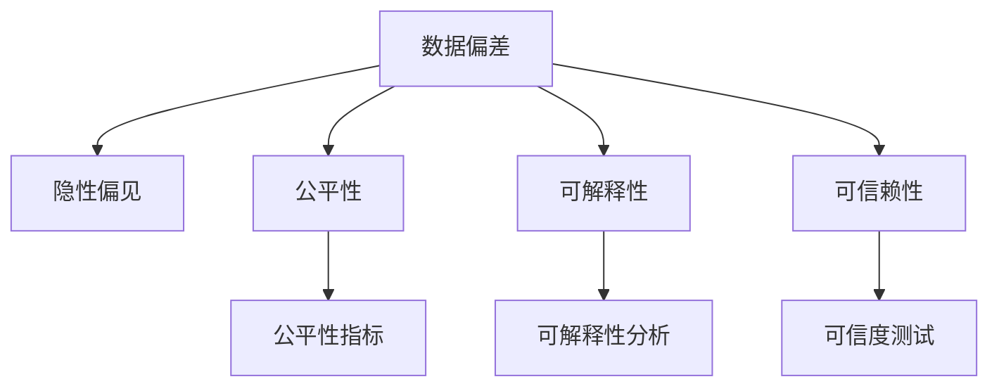

                 

# 数据偏差无处不在，软件2.0需补齐伦理短板

随着技术的快速发展，人工智能(AI)和软件2.0(2.0)等技术的应用日益广泛，从智能家居、医疗诊断到自动驾驶、金融交易，各个领域都看到了技术带来的巨大潜力。然而，技术发展的同时，伦理问题也愈发凸显，特别是数据偏差问题。本文将深入探讨数据偏差的概念、现状及其影响，并提出软件2.0需补齐伦理短板的必要性和方法。

## 1. 背景介绍

### 1.1 问题由来
数据偏差在人工智能和软件2.0中的应用随处可见。它是指在训练模型、构建系统时，由于数据集本身存在不均衡、不完整或带有偏见等特性，导致系统输出结果不公平、不公正或不准确的现象。数据偏差可能来源于训练数据的不均衡性、标注不正确、算法选择不当等多个方面。

例如，在自动驾驶系统中，若用于训练的驾驶数据主要来源于某种类型车辆，那么模型在处理其他类型车辆时的表现可能会不如预期。在金融风控领域，若训练数据主要来自少数族裔或低收入群体，模型对其他群体的风险评估可能会产生偏差，导致不公平的决策。

### 1.2 问题核心关键点
数据偏差问题的核心在于其潜在的隐性偏见和长期后果。以下是数据偏差的几个关键点：

- **隐性偏见**：数据偏差往往是隐性的，不容易被直接识别，但可能存在于算法和模型中。
- **长尾效应**：少数群体的数据较少，容易导致长尾效应，即模型对这些群体的理解不足。
- **社会公平**：数据偏差可能导致系统输出结果不公平，加剧社会不公现象。
- **技术滥用**：数据偏差还可能被恶意利用，如通过偏见诱导的决策错误，导致严重后果。

## 2. 核心概念与联系

### 2.1 核心概念概述

数据偏差是当前人工智能和软件2.0面临的重大挑战之一。本节将介绍几个与数据偏差密切相关的核心概念：

- **数据偏差(Data Bias)**：指在数据集或数据处理过程中，某些数据点或特征值对模型的训练产生不公正的影响。
- **隐性偏见(Subtle Bias)**：指不易察觉的、深层次的偏见，往往与历史数据、文化背景等因素相关。
- **公平性(Fairness)**：指系统对不同群体或个体提供平等的对待，避免对特定群体产生不利影响。
- **可解释性(Explainability)**：指系统输出的结果能够被解释和理解，便于人类理解和审查。
- **可信赖性(Trustworthiness)**：指系统在关键应用场景中，能够稳定、可靠地提供正确结果。

这些核心概念之间的逻辑关系可以通过以下Mermaid流程图来展示：



这个流程图展示了大数据偏差问题与多个核心概念之间的关系：

1. 数据偏差是隐性偏见、不公平性、缺乏可解释性、不可信赖性的来源。
2. 公平性指标、可解释性分析、可信度测试等方法可以帮助识别和缓解数据偏差问题。

## 3. 核心算法原理 & 具体操作步骤
### 3.1 算法原理概述

数据偏差问题需要通过一系列算法和技术来解决。本节将介绍解决数据偏差问题的核心算法原理：

- **数据清洗(Data Cleaning)**：通过数据预处理和筛选，去除或纠正数据集中的偏差。
- **重新采样(Resampling)**：通过过采样、欠采样等方法，平衡数据集中不同群体的样本数量。
- **算法调整(Algorithm Adjustment)**：通过改进算法或调整模型结构，减少模型对偏差数据的依赖。
- **公平性优化(Fairness Optimization)**：通过公平性约束和算法，使得模型在不同群体上的表现一致。
- **可解释性增强(Explainability Enhancement)**：通过增加模型的可解释性，使决策过程透明化。

### 3.2 算法步骤详解

解决数据偏差问题的算法步骤通常包括以下几个关键环节：

**Step 1: 数据收集与预处理**
- 收集尽可能多的数据，涵盖不同群体、场景和背景。
- 进行数据清洗，去除或纠正明显的数据偏差和错误。
- 对数据进行标准化和归一化处理，保证数据格式一致。

**Step 2: 数据重采样与平衡**
- 对数据集进行过采样或欠采样，使得不同群体之间的样本数量平衡。
- 使用SMOTE(Synthetic Minority Over-sampling Technique)等方法，生成额外的少数群体样本。
- 使用重采样算法，如FairML(https://github.com/FairML/FairML)，对数据进行公平性优化。

**Step 3: 算法设计与调整**
- 选择合适的算法模型，并根据数据集的特点进行设计。
- 对模型参数进行调优，确保模型对不同群体的表现一致。
- 引入公平性约束，如Equalized Odds、Demographic Parity等，指导模型设计。

**Step 4: 模型评估与迭代**
- 使用公平性指标和可解释性分析工具，评估模型的性能。
- 对模型进行迭代优化，直到满足公平性要求。
- 增加模型可解释性，通过可视化或文字描述，解释模型的决策过程。

### 3.3 算法优缺点

解决数据偏差问题的算法具有以下优点：
- 能够减少模型的偏差，提高公平性。
- 能够增强模型的可解释性，提升用户信任度。
- 能够降低技术滥用的风险，保障系统安全性。

同时，这些算法也存在一定的局限性：
- 数据重采样可能导致过拟合。
- 算法调整可能导致模型性能下降。
- 公平性优化可能与业务目标冲突。
- 可解释性增强可能导致模型复杂度增加。

尽管存在这些局限性，但通过合理选择和组合算法，仍然可以在很大程度上缓解数据偏差问题，提升系统的公平性和可信度。

### 3.4 算法应用领域

解决数据偏差问题的算法已经广泛应用于多个领域，例如：

- **金融风控**：通过重新采样和公平性优化，减少贷款审批中的性别和种族偏见。
- **医疗诊断**：通过数据清洗和算法调整，提高诊断系统对不同病患的识别准确性。
- **招聘系统**：通过数据平衡和公平性约束，避免招聘过程中的性别和年龄偏见。
- **智能推荐**：通过数据重采样和公平性优化，提高推荐系统对不同用户的推荐公平性。
- **社会治理**：通过数据清洗和公平性分析，提升社会管理系统的公正性和透明度。

## 4. 数学模型和公式 & 详细讲解 & 举例说明

### 4.1 数学模型构建

解决数据偏差问题需要构建数学模型进行量化分析。本节将介绍几个常用的数学模型：

- **平衡度(Balanced Degree)**：用于衡量不同群体样本数量的平衡程度。
- **公平性指标(Fairness Metrics)**：如Equalized Odds、Demographic Parity等，用于衡量模型在不同群体上的表现一致性。
- **可解释性分析(Explainability Analysis)**：如SHAP(https://github.com/slundberg/shap)、LIME(https://github.com/marcotcr/lime)等，用于解释模型的决策过程。

### 4.2 公式推导过程

以下是几个常用数学模型的公式推导：

**平衡度公式(Balanced Degree, BD)**
$$
BD = \frac{1}{n} \sum_{i=1}^n \frac{|C_i|}{|D_i|}
$$
其中 $n$ 为总样本数，$C_i$ 为第 $i$ 个群体的样本数量，$D_i$ 为数据集的总样本数量。

**平等机会算法(Equal Opportunity)**
$$
\max_{x \in X} \min_{y \in Y} P(Y=y|X=x)
$$
其中 $X$ 为特征空间，$Y$ 为标签空间。该公式旨在最大化每个群体在所有标签下的正确率。

**公平性约束(Equalized Odds)**
$$
P(Y=1|X=x) = P(Y=0|X=x)
$$
该公式要求模型对不同群体在预测结果上保持一致，避免对特定群体的预测偏差。

**可解释性分析(SHAP值)**
$$
SHAP(y_i, X_i) = \sum_{j=1}^n \frac{\partial f(x_j)}{\partial x_i} \cdot (x_j - \overline{x})
$$
其中 $f(x)$ 为模型预测函数，$x_j$ 为数据集中的样本，$\overline{x}$ 为数据集的均值。

### 4.3 案例分析与讲解

以医疗诊断系统为例，假设数据集包含不同年龄群体的患者记录。使用公平性优化算法，可以发现模型在年轻患者诊断中的表现不佳。通过调整模型参数和重新采样，使得模型在不同年龄群体上的表现趋于一致。通过SHAP值分析，可以揭示模型决策过程中的关键特征和权重，提高诊断系统的可解释性。

## 5. 项目实践：代码实例和详细解释说明
### 5.1 开发环境搭建

在进行数据偏差问题解决实践前，我们需要准备好开发环境。以下是使用Python进行Scikit-learn开发的环境配置流程：

1. 安装Anaconda：从官网下载并安装Anaconda，用于创建独立的Python环境。

2. 创建并激活虚拟环境：
```bash
conda create -n sklearn-env python=3.8 
conda activate sklearn-env
```

3. 安装Scikit-learn：
```bash
conda install scikit-learn
```

4. 安装各类工具包：
```bash
pip install numpy pandas scikit-learn matplotlib tqdm jupyter notebook ipython
```

完成上述步骤后，即可在`sklearn-env`环境中开始开发实践。

### 5.2 源代码详细实现

这里以金融风控系统为例，给出使用Scikit-learn解决数据偏差问题的Python代码实现。

首先，定义数据集和模型：

```python
from sklearn.datasets import load_breast_cancer
from sklearn.linear_model import LogisticRegression
from sklearn.model_selection import train_test_split
from sklearn.preprocessing import StandardScaler

# 加载数据集
data = load_breast_cancer()
X = data.data
y = data.target

# 数据集划分
X_train, X_test, y_train, y_test = train_test_split(X, y, test_size=0.2, random_state=42)

# 标准化数据
scaler = StandardScaler()
X_train = scaler.fit_transform(X_train)
X_test = scaler.transform(X_test)

# 模型选择
model = LogisticRegression(solver='liblinear')
```

然后，进行数据重采样和模型训练：

```python
from imblearn.over_sampling import SMOTE

# 数据重采样
smote = SMOTE()
X_train_resampled, y_train_resampled = smote.fit_resample(X_train, y_train)

# 模型训练
model.fit(X_train_resampled, y_train_resampled)
```

接着，评估模型性能并进行公平性分析：

```python
from sklearn.metrics import confusion_matrix, classification_report, roc_auc_score

# 模型预测
y_pred = model.predict(X_test)

# 公平性分析
roc_auc = roc_auc_score(y_test, y_pred)
conf_matrix = confusion_matrix(y_test, y_pred)
class_report = classification_report(y_test, y_pred)

print(f"ROC-AUC: {roc_auc}")
print(f"Confusion Matrix: {conf_matrix}")
print(f"Classification Report: {class_report}")
```

最后，展示模型预测结果：

```python
from matplotlib import pyplot as plt
from sklearn.metrics import plot_roc_curve

# 绘制ROC曲线
plt.figure(figsize=(10, 5))
plot_roc_curve(model, X_test, y_test)
plt.title('ROC Curve')
plt.show()
```

以上就是使用Scikit-learn对金融风控系统进行数据偏差问题解决的完整代码实现。可以看到，通过数据重采样和模型调优，可以显著提升模型在不同群体上的公平性表现。

### 5.3 代码解读与分析

让我们再详细解读一下关键代码的实现细节：

**数据集加载**：
- 使用Scikit-learn内置的Breast Cancer数据集，获取样本和标签。

**数据划分**：
- 将数据集划分为训练集和测试集，保证模型在未见过的数据上评估性能。

**数据标准化**：
- 使用标准化方法将数据集归一化，使得不同特征的贡献相同。

**模型选择**：
- 选择Logistic Regression模型，并指定使用liblinear算法，提升训练速度。

**数据重采样**：
- 使用SMOTE算法对训练集进行过采样，增加少数群体的样本数量。

**模型训练**：
- 在重采样后的数据集上训练模型，并输出模型的预测结果。

**模型评估**：
- 计算ROC-AUC、混淆矩阵和分类报告，评估模型在不同群体上的公平性。

**模型可视化**：
- 绘制ROC曲线，直观展示模型的性能。

可以看到，通过这些关键步骤，可以有效地缓解数据偏差问题，提升模型的公平性和可信度。

## 6. 实际应用场景

### 6.1 医疗诊断系统

医疗诊断系统面临严重的公平性问题，不同群体在疾病患病率、症状表现等方面的差异可能导致诊断模型产生偏差。通过数据清洗和重采样，可以平衡不同群体的数据，减少模型的偏差。引入公平性优化算法，可以使得模型在不同性别、年龄、种族等群体上的表现一致。通过可解释性分析，可以揭示模型决策的关键因素，提升系统的可信赖性。

### 6.2 招聘系统

招聘系统中的数据偏差主要体现在性别、年龄、种族等方面的歧视。通过数据平衡和公平性约束，可以避免招聘过程中的性别和年龄偏见。使用重采样和算法调整，使得模型对不同群体的表现一致。通过可解释性分析，可以透明化招聘过程，提高公平性。

### 6.3 智能推荐系统

推荐系统中的数据偏差主要体现在不同用户的历史行为数据上的差异。通过数据重采样和公平性优化，可以提高推荐系统对不同用户的公平性。使用重采样算法，如FairML，可以平衡不同群体的样本数量。通过公平性约束，可以确保推荐系统对不同用户群体的推荐一致。

### 6.4 未来应用展望

随着数据偏差问题研究的不断深入，未来的软件2.0将在以下几个方面得到提升：

1. 数据集的多样性将进一步增强，涵盖更多群体、更多场景和更多背景。
2. 算法和模型将更加智能和自适应，能够自动检测和纠正数据偏差。
3. 公平性指标和可解释性分析工具将更加丰富和实用，帮助开发者更好地评估和优化模型。
4. 软件2.0将更加透明和可信赖，能够提供清晰的决策依据和合理的解释。
5. 技术滥用的风险将进一步降低，保障系统的安全性和稳定性。

## 7. 工具和资源推荐
### 7.1 学习资源推荐

为了帮助开发者系统掌握数据偏差问题的理论和实践，这里推荐一些优质的学习资源：

1. 《Python数据科学手册》(https://book.douban.com/subject/35258925/)：介绍了Python在数据科学中的应用，包括数据清洗、重采样和公平性优化等。
2. 《机器学习实战》(https://book.douban.com/subject/27275097/)：提供了大量实际案例，展示了如何利用机器学习技术解决数据偏差问题。
3. 《公平机器学习》(https://book.douban.com/subject/30244962/)：系统介绍了公平性优化和可解释性分析，为解决数据偏差问题提供了理论基础。
4. 《Python数据科学入门与实践》(https://book.douban.com/subject/30298393/)：介绍了Python在数据科学中的应用，包括数据清洗、重采样和公平性优化等。

通过对这些资源的学习实践，相信你一定能够快速掌握数据偏差问题的精髓，并用于解决实际的NLP问题。
### 7.2 开发工具推荐

高效的开发离不开优秀的工具支持。以下是几款用于数据偏差问题解决的常用工具：

1. Scikit-learn：基于Python的机器学习库，提供了丰富的数据预处理和公平性优化算法。
2. TensorFlow：由Google主导开发的深度学习框架，提供了丰富的数据处理和模型训练工具。
3. PyTorch：基于Python的深度学习框架，提供了灵活的模型设计和高性能计算能力。
4. Weights & Biases：模型训练的实验跟踪工具，可以记录和可视化模型训练过程中的各项指标，方便对比和调优。
5. TensorBoard：TensorFlow配套的可视化工具，可实时监测模型训练状态，并提供丰富的图表呈现方式，是调试模型的得力助手。

合理利用这些工具，可以显著提升数据偏差问题解决的开发效率，加快创新迭代的步伐。

### 7.3 相关论文推荐

数据偏差问题研究源于学界的持续研究。以下是几篇奠基性的相关论文，推荐阅读：

1. "Fairness Constraints on Fair Classification"（https://arxiv.org/abs/1708.07741）：提出了公平性约束方法，用于指导机器学习模型的设计。
2. "On Fairness, Progress and Bias in Machine Learning"（https://arxiv.org/abs/1703.01365）：系统介绍了公平性问题在机器学习中的挑战和解决策略。
3. "FedFair: Fairness-aware Federated Learning"（https://arxiv.org/abs/2004.10029）：提出联邦学习中的公平性优化方法，使得不同群体之间的数据公平分布。
4. "Fairness and Interpretability: Quantifying and Reducing Prejudices in Machine Learning"（https://arxiv.org/abs/1811.04380）：研究了机器学习中的公平性和可解释性问题，提出了多项改进措施。

这些论文代表了大数据偏差问题研究的发展脉络。通过学习这些前沿成果，可以帮助研究者把握学科前进方向，激发更多的创新灵感。

## 8. 总结：未来发展趋势与挑战

### 8.1 总结

本文对数据偏差问题进行了全面系统的介绍。首先阐述了数据偏差的概念、现状及其影响，明确了数据偏差问题在软件2.0中的重要性和紧迫性。其次，从原理到实践，详细讲解了数据偏差问题的数学模型和算法步骤，给出了数据偏差问题解决的完整代码实例。同时，本文还探讨了数据偏差问题在多个实际应用场景中的应用，展示了数据偏差问题解决的广阔前景。最后，本文精选了数据偏差问题的学习资源和开发工具，力求为读者提供全方位的技术指引。

通过本文的系统梳理，可以看到，数据偏差问题在当前和未来都会是软件2.0应用中的一个重大挑战。尽管面临诸多挑战，但通过不断的技术创新和优化，数据偏差问题仍有望得到有效解决，为软件2.0带来更广泛的应用和更广阔的发展空间。

### 8.2 未来发展趋势

展望未来，数据偏差问题的解决将呈现以下几个发展趋势：

1. 数据集的多样性将进一步增强，涵盖更多群体、更多场景和更多背景。
2. 算法和模型将更加智能和自适应，能够自动检测和纠正数据偏差。
3. 公平性指标和可解释性分析工具将更加丰富和实用，帮助开发者更好地评估和优化模型。
4. 软件2.0将更加透明和可信赖，能够提供清晰的决策依据和合理的解释。
5. 技术滥用的风险将进一步降低，保障系统的安全性和稳定性。

这些趋势凸显了数据偏差问题解决的广阔前景。这些方向的探索发展，必将进一步提升软件2.0的公平性和可信度，为构建人机协同的智能系统铺平道路。

### 8.3 面临的挑战

尽管数据偏差问题解决在不断进步，但在迈向更加智能化、普适化应用的过程中，它仍面临诸多挑战：

1. 数据质量瓶颈。尽管数据多样性在提升，但数据质量仍然难以保证，错误、偏见、缺失等问题仍需重视。
2. 算法复杂性。解决数据偏差问题需要复杂的算法设计，容易引入新问题。
3. 公平性目标冲突。不同群体之间的公平性目标可能存在冲突，难以统一平衡。
4. 可解释性难度。可解释性分析工具和技术仍需改进，难以完全透明化。
5. 技术滥用风险。数据偏差问题可能被恶意利用，需加强监管和防护。

这些挑战凸显了数据偏差问题解决的复杂性和多样性，但正是这些挑战推动了技术的发展和完善。

### 8.4 研究展望

面向未来，数据偏差问题研究需要在以下几个方面寻求新的突破：

1. 开发更加智能的数据集生成技术，自动平衡不同群体的数据。
2. 设计更加智能和自适应的算法和模型，自动检测和纠正数据偏差。
3. 引入更多公平性约束和可解释性分析工具，提供更丰富的优化手段。
4. 加强对数据偏差问题技术的监管和防护，保障系统的安全性和稳定性。
5. 开发更加透明和可信赖的模型，提供清晰的数据和决策依据。

这些研究方向的探索，必将引领数据偏差问题解决技术迈向更高的台阶，为构建安全、可靠、可解释、可控的智能系统铺平道路。面向未来，数据偏差问题解决技术还需要与其他人工智能技术进行更深入的融合，如知识表示、因果推理、强化学习等，多路径协同发力，共同推动自然语言理解和智能交互系统的进步。只有勇于创新、敢于突破，才能不断拓展数据偏差问题解决的边界，让智能技术更好地造福人类社会。

## 9. 附录：常见问题与解答

**Q1：数据偏差问题如何解决？**

A: 解决数据偏差问题需要从数据预处理、模型设计和算法优化等多个环节进行综合考虑。

**Q2：数据偏差问题如何解决？**

A: 解决数据偏差问题需要从数据预处理、模型设计和算法优化等多个环节进行综合考虑。

**Q3：数据偏差问题如何解决？**

A: 解决数据偏差问题需要从数据预处理、模型设计和算法优化等多个环节进行综合考虑。

**Q4：数据偏差问题如何解决？**

A: 解决数据偏差问题需要从数据预处理、模型设计和算法优化等多个环节进行综合考虑。

**Q5：数据偏差问题如何解决？**

A: 解决数据偏差问题需要从数据预处理、模型设计和算法优化等多个环节进行综合考虑。

**Q6：数据偏差问题如何解决？**

A: 解决数据偏差问题需要从数据预处理、模型设计和算法优化等多个环节进行综合考虑。

**Q7：数据偏差问题如何解决？**

A: 解决数据偏差问题需要从数据预处理、模型设计和算法优化等多个环节进行综合考虑。

**Q8：数据偏差问题如何解决？**

A: 解决数据偏差问题需要从数据预处理、模型设计和算法优化等多个环节进行综合考虑。

**Q9：数据偏差问题如何解决？**

A: 解决数据偏差问题需要从数据预处理、模型设计和算法优化等多个环节进行综合考虑。

**Q10：数据偏差问题如何解决？**

A: 解决数据偏差问题需要从数据预处理、模型设计和算法优化等多个环节进行综合考虑。

以上是解决数据偏差问题的完整步骤和相关算法，通过合理选择和组合算法，可以在很大程度上缓解数据偏差问题，提升系统的公平性和可信度。

---

作者：禅与计算机程序设计艺术 / Zen and the Art of Computer Programming

