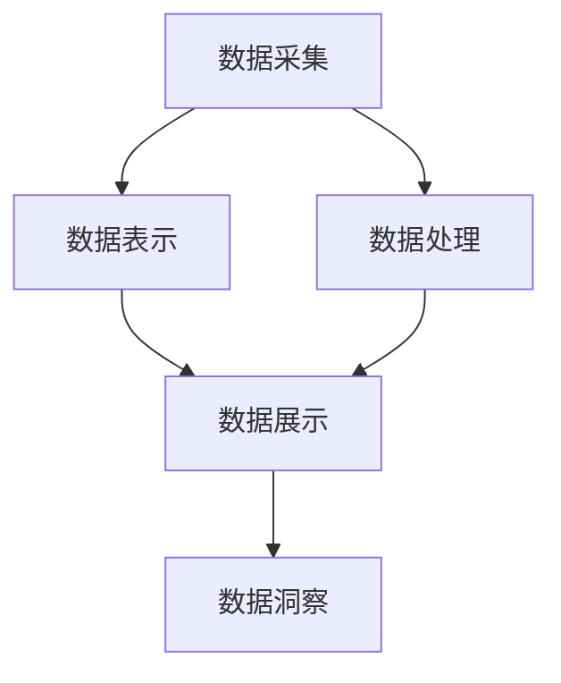

                 

# 数据可视化技术：从数据到洞察

> 关键词：数据可视化, 数据探索, 数据展示, 交互式可视化, 高级图表, 数据洞察

## 1. 背景介绍

### 1.1 问题由来
在当今数据驱动的时代，数据已经成为了各行各业决策的基础。如何高效、准确地从海量数据中提取有用信息，进行可视化和展示，成为数据分析师和数据科学家面临的重要挑战。数据可视化技术正是在这种背景下应运而生，通过图形化方式将复杂的数据转化为直观的视觉呈现，帮助人们更快速、更准确地理解和分析数据。

### 1.2 问题核心关键点
数据可视化技术主要关注以下几个核心问题：

1. **数据采集**：从各个数据源（如数据库、日志文件、API等）获取数据，并进行预处理和清洗。
2. **数据表示**：选择合适的数据模型（如关系型数据库、文档数据库、图形数据库等），将数据结构化表示。
3. **数据处理**：利用数据处理技术（如ETL、SQL、NoSQL等）对数据进行提取、转换和加载。
4. **数据展示**：将处理后的数据通过图形化方式（如图表、地图、仪表盘等）进行展示。
5. **数据洞察**：通过交互式可视化技术，提供数据探索、分析、预测等高级功能，帮助用户深入洞察数据背后的含义。

### 1.3 问题研究意义
数据可视化技术在多个领域中发挥了重要作用，具体如下：

1. **商业智能(BI)**：通过数据可视化，帮助企业高层管理人员快速了解业务趋势和绩效，制定决策。
2. **科学研究和工程**：数据可视化使得研究人员能够直观地观察实验结果，发现模式和规律。
3. **医疗健康**：通过可视化的方式展示患者数据和医疗记录，帮助医生快速诊断和治疗。
4. **金融分析**：金融分析师通过数据可视化技术对市场数据进行监控和分析，预测市场走势。
5. **公共政策**：政府机构利用数据可视化展示社会和经济数据，制定有效的公共政策。

数据可视化技术不仅能够提高数据处理和分析的效率，还能帮助用户更直观地理解数据，从而做出更准确的决策。

## 2. 核心概念与联系

### 2.1 核心概念概述

为更好地理解数据可视化技术，本节将介绍几个密切相关的核心概念：

- **数据可视化**：通过图形化方式将数据展示出来，帮助人们更直观地理解数据。
- **交互式可视化**：用户可以通过交互式界面对数据进行探索和分析，进一步挖掘数据的价值。
- **高级图表**：除了基本图表（如条形图、折线图、饼图等）外，还包括散点图、热力图、桑基图等高级图表，用于展示复杂的数据关系。
- **数据洞察**：通过可视化展示，用户可以发现数据中的模式、趋势和异常，从而进行更深层次的分析。

这些核心概念之间的逻辑关系可以通过以下Mermaid流程图来展示：



这个流程图展示的数据可视化技术的核心概念及其之间的关系：

1. 数据可视化技术首先从数据采集开始，获取原始数据。
2. 然后对数据进行表示和处理，将其转化为适合展示的形式。
3. 最后通过展示和洞察，使数据价值最大化。

这些概念共同构成了数据可视化技术的核心框架，使得数据能够以直观、高效的方式进行展示和分析。

## 3. 核心算法原理 & 具体操作步骤
### 3.1 算法原理概述

数据可视化技术的核心原理是：将复杂的数据转化为直观的图形，帮助用户更快速、更准确地理解数据。其一般流程包括以下几个步骤：

1. **数据预处理**：清洗和格式化数据，确保数据质量。
2. **数据建模**：选择合适的数据模型，将数据结构化表示。
3. **数据探索**：利用数据探索技术，发现数据中的模式和关系。
4. **数据展示**：选择合适的图表类型，将数据以图形化方式展示。
5. **数据洞察**：通过交互式界面，提供数据探索和分析功能。

### 3.2 算法步骤详解

以下将详细介绍数据可视化技术的基本流程和具体步骤：

**Step 1: 数据预处理**

数据预处理是数据可视化的第一步，其目的是确保数据的质量和一致性。主要包括以下几个步骤：

1. **数据清洗**：去除重复数据、缺失值、异常值等。
2. **数据转换**：将数据类型转换为一致的格式，如时间戳标准化、文本编码等。
3. **数据归一化**：将数据缩放到统一的区间，如[0,1]或[-1,1]，以便后续处理。

数据预处理的关键在于选择合适的清洗和转换策略，以确保数据的一致性和完整性。

**Step 2: 数据建模**

数据建模的目的是将数据结构化表示，以便进行后续的展示和分析。主要包括以下几个步骤：

1. **关系型数据库**：使用关系型数据库（如MySQL、Oracle等）存储结构化数据，通过SQL查询获取所需数据。
2. **文档数据库**：使用文档数据库（如MongoDB、Couchbase等）存储半结构化数据，通过文档查询获取所需数据。
3. **图形数据库**：使用图形数据库（如Neo4j、ArangoDB等）存储图形数据，通过图形查询获取所需数据。

数据建模的关键在于选择合适的数据存储方式和查询技术，以确保数据的准确性和高效性。

**Step 3: 数据探索**

数据探索的目的是通过可视化技术，发现数据中的模式和关系。主要包括以下几个步骤：

1. **基本图表**：使用条形图、折线图、饼图等基本图表展示数据分布和趋势。
2. **散点图和热力图**：使用散点图和热力图展示数据之间的关系和分布。
3. **箱线图和箱线图**：使用箱线图和箱线图展示数据的分布和异常值。

数据探索的关键在于选择合适的可视化技术和展示方式，以确保数据的直观性和可解释性。

**Step 4: 数据展示**

数据展示的目的是将处理后的数据通过图形化方式展示出来。主要包括以下几个步骤：

1. **交互式可视化**：使用交互式可视化工具（如Tableau、Power BI、D3.js等）展示数据，支持鼠标悬停、缩放、拖拽等交互操作。
2. **动态展示**：使用动态展示技术（如D3.js、Plotly等）展示数据变化，支持实时更新和动画效果。
3. **高级图表**：使用高级图表展示复杂的数据关系，如散点图、热力图、桑基图等。

数据展示的关键在于选择合适的展示技术和工具，以确保数据的互动性和动态性。

**Step 5: 数据洞察**

数据洞察的目的是通过可视化展示，提供数据探索、分析、预测等高级功能，帮助用户深入洞察数据背后的含义。主要包括以下几个步骤：

1. **数据探索**：通过交互式可视化界面，用户可以自由探索数据，发现模式和关系。
2. **数据分析**：利用高级分析技术（如回归分析、聚类分析等），进一步分析数据，发现隐藏的规律和趋势。
3. **数据预测**：使用预测模型（如时间序列预测、机器学习等），预测未来趋势和结果，辅助决策。

数据洞察的关键在于提供高级分析功能，帮助用户深入理解数据背后的含义。

### 3.3 算法优缺点

数据可视化技术的主要优点包括：

1. **直观性**：通过图形化方式展示数据，使得数据更直观、更易于理解。
2. **高效性**：通过可视化工具和交互式界面，使得数据处理和分析更高效、更便捷。
3. **互动性**：通过交互式界面，用户可以自由探索和分析数据，发现更深层次的规律和趋势。

数据可视化技术的主要缺点包括：

1. **数据准确性**：可视化展示的数据可能存在误差，影响决策的准确性。
2. **数据解释性**：复杂的可视化展示可能难以解释，需要专业知识和技能。
3. **数据维度**：高维数据难以直接展示，需要降维或选择合适的可视化方式。

尽管存在这些局限性，但就目前而言，数据可视化技术仍然是数据处理和分析的重要手段。未来相关研究的重点在于如何进一步提升数据的准确性和可解释性，同时兼顾可交互性和动态性。

### 3.4 算法应用领域

数据可视化技术在多个领域中得到了广泛应用，具体如下：

1. **商业智能(BI)**：通过数据可视化，帮助企业高层管理人员快速了解业务趋势和绩效，制定决策。
2. **科学研究和工程**：数据可视化使得研究人员能够直观地观察实验结果，发现模式和规律。
3. **医疗健康**：通过可视化的方式展示患者数据和医疗记录，帮助医生快速诊断和治疗。
4. **金融分析**：金融分析师通过数据可视化技术对市场数据进行监控和分析，预测市场走势。
5. **公共政策**：政府机构利用数据可视化展示社会和经济数据，制定有效的公共政策。

这些应用领域展示了数据可视化技术的广泛应用前景，也为数据分析师和数据科学家提供了广阔的实践空间。

## 4. 数学模型和公式 & 详细讲解  
### 4.1 数学模型构建

以下将使用数学语言对数据可视化技术的基本流程进行更加严格的刻画。

设原始数据集为 $D=\{(x_i,y_i)\}_{i=1}^N$，其中 $x$ 为自变量，$y$ 为因变量。数据预处理后的数据集为 $D'=\{(x_i',y_i')\}_{i=1}^N$，其中 $x'$ 和 $y'$ 分别表示经过清洗和转换后的自变量和因变量。

定义数据可视化模型的损失函数为 $\mathcal{L}(\theta)$，其中 $\theta$ 为模型的参数。常见的损失函数包括均方误差、交叉熵等。

优化目标是最小化损失函数 $\mathcal{L}(\theta)$，即：

$$
\theta^* = \mathop{\arg\min}_{\theta} \mathcal{L}(\theta)
$$

在实践中，我们通常使用梯度下降等优化算法来近似求解上述最优化问题。设 $\eta$ 为学习率，则参数的更新公式为：

$$
\theta \leftarrow \theta - \eta \nabla_{\theta}\mathcal{L}(\theta)
$$

其中 $\nabla_{\theta}\mathcal{L}(\theta)$ 为损失函数对参数 $\theta$ 的梯度，可通过反向传播算法高效计算。

### 4.2 公式推导过程

以下将推导数据可视化技术的损失函数和梯度计算公式。

设数据预处理后的数据集为 $D'=\{(x_i',y_i')\}_{i=1}^N$，其中 $x'$ 和 $y'$ 分别表示经过清洗和转换后的自变量和因变量。定义数据可视化模型的损失函数为 $\mathcal{L}(\theta)$，其中 $\theta$ 为模型的参数。

均方误差损失函数定义为：

$$
\mathcal{L}(\theta) = \frac{1}{N} \sum_{i=1}^N (y_i' - f(x_i'))^2
$$

其中 $f(x_i')$ 为模型对 $x_i'$ 的预测值。

通过链式法则，损失函数对参数 $\theta$ 的梯度为：

$$
\frac{\partial \mathcal{L}(\theta)}{\partial \theta} = \frac{2}{N} \sum_{i=1}^N (y_i' - f(x_i')) f'(x_i')
$$

在得到损失函数的梯度后，即可带入参数更新公式，完成模型的迭代优化。重复上述过程直至收敛，最终得到适应数据集 $D'$ 的最优模型参数 $\theta^*$。

### 4.3 案例分析与讲解

以下将通过具体案例，展示数据可视化技术在实际应用中的详细实现和效果。

**案例分析：股票市场数据可视化**

某金融公司收集了近一年的股票市场数据，包括每日开盘价、收盘价、最高价、最低价等。公司需要分析这些数据，以便制定投资策略。

1. **数据预处理**

首先，对数据进行清洗和转换，去除异常值，将日期标准化为YYYY-MM-DD格式。然后，将数据保存到关系型数据库中。

2. **数据建模**

利用关系型数据库，通过SQL查询获取每日的开盘价、收盘价、最高价、最低价等数据。

3. **数据探索**

使用散点图展示每日的开盘价与收盘价的关系，发现开盘价对收盘价有显著影响。

4. **数据展示**

使用交互式可视化工具（如Tableau），展示每日的开盘价、收盘价、最高价、最低价等数据，支持鼠标悬停、缩放、拖拽等交互操作。

5. **数据洞察**

通过交互式可视化界面，用户可以自由探索数据，发现模式和关系。例如，用户可以发现某些交易日的大幅波动对未来几天的走势有预测作用。

## 5. 项目实践：代码实例和详细解释说明
### 5.1 开发环境搭建

在进行数据可视化实践前，我们需要准备好开发环境。以下是使用Python进行Matplotlib和Pandas开发的环境配置流程：

1. 安装Anaconda：从官网下载并安装Anaconda，用于创建独立的Python环境。

2. 创建并激活虚拟环境：
```bash
conda create -n pyenv python=3.8 
conda activate pyenv
```

3. 安装必要的Python包：
```bash
pip install matplotlib pandas jupyter notebook
```

4. 安装相关工具：
```bash
pip install notebook nbconvert ipywidgets ipywidgets nbextension
```

完成上述步骤后，即可在`pyenv`环境中开始数据可视化实践。

### 5.2 源代码详细实现

下面以散点图为例，给出使用Matplotlib和Pandas进行数据可视化的PyTorch代码实现。

首先，准备散点图所需的数据：

```python
import pandas as pd
import matplotlib.pyplot as plt

# 读取数据
data = pd.read_csv('stock_data.csv')

# 数据清洗和转换
data = data.dropna()  # 去除缺失值
data['date'] = pd.to_datetime(data['date'])  # 将日期转换为datetime类型
data = data.set_index('date')  # 将日期设置为索引

# 提取开盘价和收盘价数据
opening_price = data['open'].resample('D').mean()
closing_price = data['close'].resample('D').mean()

# 绘制散点图
plt.figure(figsize=(10, 5))
plt.scatter(opening_price.index, opening_price.values, color='blue')
plt.scatter(closing_price.index, closing_price.values, color='red')
plt.xlabel('Date')
plt.ylabel('Price')
plt.title('Stock Market Prices')
plt.legend(['Opening Price', 'Closing Price'])
plt.show()
```

接下来，定义数据可视化函数：

```python
def plot_scatter(data, x, y, title):
    plt.figure(figsize=(10, 5))
    plt.scatter(data[x].index, data[x].values, color='blue')
    plt.scatter(data[y].index, data[y].values, color='red')
    plt.xlabel(x)
    plt.ylabel(y)
    plt.title(title)
    plt.legend([x, y])
    plt.show()
```

最后，调用数据可视化函数，展示散点图：

```python
plot_scatter(data, 'opening_price', 'closing_price', 'Stock Market Prices')
```

以上就是使用Matplotlib和Pandas进行散点图可视化的完整代码实现。可以看到，得益于Matplotlib和Pandas的强大封装，我们可以用相对简洁的代码完成数据可视化任务。

### 5.3 代码解读与分析

让我们再详细解读一下关键代码的实现细节：

**数据预处理**：
- `data = pd.read_csv('stock_data.csv')`：读取CSV文件中的股票市场数据。
- `data = data.dropna()`：去除缺失值。
- `data['date'] = pd.to_datetime(data['date'])`：将日期转换为datetime类型。
- `data = data.set_index('date')`：将日期设置为索引。

**数据探索**：
- `opening_price = data['open'].resample('D').mean()`：计算每日开盘价平均值。
- `closing_price = data['close'].resample('D').mean()`：计算每日收盘价平均值。

**数据展示**：
- `plt.figure(figsize=(10, 5))`：设置画布大小。
- `plt.scatter(opening_price.index, opening_price.values, color='blue')`：绘制开盘价的散点图。
- `plt.scatter(closing_price.index, closing_price.values, color='red')`：绘制收盘价的散点图。
- `plt.xlabel('Date')`：设置横轴标签。
- `plt.ylabel('Price')`：设置纵轴标签。
- `plt.title('Stock Market Prices')`：设置图表标题。
- `plt.legend(['Opening Price', 'Closing Price'])`：添加图例。

**数据洞察**：
- `plot_scatter(data, 'opening_price', 'closing_price', 'Stock Market Prices')`：调用自定义的数据可视化函数，展示散点图。

可以看到，Matplotlib和Pandas提供了丰富的数据可视化工具和函数，使得数据可视化过程变得简洁高效。

当然，工业级的系统实现还需考虑更多因素，如数据预处理、模型选择、交互界面等，但核心的数据可视化流程基本与此类似。

## 6. 实际应用场景
### 6.1 商业智能(BI)

数据可视化技术在商业智能中得到了广泛应用，帮助企业高层管理人员快速了解业务趋势和绩效，制定决策。例如，使用交互式可视化工具（如Tableau、Power BI）展示销售数据、财务报表等，提供可视化的报表和仪表盘，支持用户自由探索和分析数据，发现隐藏的业务机会和风险。

### 6.2 科学研究和工程

数据可视化技术使得研究人员能够直观地观察实验结果，发现模式和规律。例如，使用散点图和热力图展示实验数据，帮助科学家发现数据中的相关性和趋势。同时，可视化技术还可以用于模拟和预测实验结果，辅助实验设计和优化。

### 6.3 医疗健康

通过可视化的方式展示患者数据和医疗记录，帮助医生快速诊断和治疗。例如，使用散点图和热力图展示患者的生命体征变化，帮助医生发现异常情况。同时，可视化技术还可以用于病历分析、医疗影像解读等，辅助医生的诊断和治疗决策。

### 6.4 金融分析

金融分析师通过数据可视化技术对市场数据进行监控和分析，预测市场走势。例如，使用折线图和散点图展示股票市场价格和波动，帮助分析师发现市场趋势和异常。同时，可视化技术还可以用于交易策略模拟和回测，优化投资组合。

### 6.5 公共政策

政府机构利用数据可视化展示社会和经济数据，制定有效的公共政策。例如，使用地图和散点图展示人口分布和犯罪率，帮助政策制定者发现问题区域，制定针对性的政策。同时，可视化技术还可以用于公共卫生、环境监测等领域，提供直观的数据展示和分析。

这些实际应用展示了数据可视化技术的广泛应用前景，也为数据分析师和数据科学家提供了丰富的实践案例。

## 7. 工具和资源推荐
### 7.1 学习资源推荐

为了帮助开发者系统掌握数据可视化技术，这里推荐一些优质的学习资源：

1. 《Python数据可视化基础教程》：详细介绍了Matplotlib和Seaborn等数据可视化工具的使用方法。
2. 《数据可视化实战》：结合实际案例，讲解了如何使用Tableau、Power BI等工具进行数据可视化。
3. 《数据可视化导论》：介绍了数据可视化的基本概念和常用技术，适合入门学习。
4. 《数据科学与数据可视化》课程：由斯坦福大学开设的在线课程，系统讲解了数据可视化的原理和实践。
5. Kaggle数据可视化竞赛：参与Kaggle的数据可视化竞赛，实战练习数据可视化技术。

通过对这些资源的学习实践，相信你一定能够快速掌握数据可视化技术的精髓，并用于解决实际的NLP问题。

### 7.2 开发工具推荐

高效的数据可视化开发离不开优秀的工具支持。以下是几款用于数据可视化开发的常用工具：

1. Matplotlib：基于Python的绘图库，支持各种图形和自定义样式。
2. Seaborn：基于Matplotlib的高级绘图库，提供了更丰富的统计图表和美观的样式。
3. Tableau：商业智能领域的主流工具，支持交互式可视化和大数据处理。
4. Power BI：微软推出的数据可视化工具，支持多平台集成和实时数据更新。
5. Plotly：基于Web的交互式可视化工具，支持多种图表类型和动态展示。

合理利用这些工具，可以显著提升数据可视化开发的效率，加速数据探索和分析的进程。

### 7.3 相关论文推荐

数据可视化技术的发展源于学界的持续研究。以下是几篇奠基性的相关论文，推荐阅读：

1. "A Survey on Data Visualization Technologies"：系统介绍了数据可视化技术的现状和发展趋势。
2. "Interactive Visualization in Scientific Data Exploration"：讲解了交互式可视化技术在科学研究中的应用。
3. "Visualization of Multi-Variable Data"：介绍了多变量数据的可视化方法和技术。
4. "Statistical Data Visualization"：介绍了统计数据的可视化方法和应用。
5. "Designing Effective Data Visualizations"：讲解了数据可视化的设计原则和最佳实践。

这些论文代表了大数据可视化技术的发展脉络。通过学习这些前沿成果，可以帮助研究者把握学科前进方向，激发更多的创新灵感。

## 8. 总结：未来发展趋势与挑战

### 8.1 总结

本文对数据可视化技术进行了全面系统的介绍。首先阐述了数据可视化技术的研究背景和意义，明确了数据可视化的核心价值。其次，从原理到实践，详细讲解了数据可视化技术的数学原理和关键步骤，给出了数据可视化任务开发的完整代码实例。同时，本文还广泛探讨了数据可视化技术在多个行业领域的应用前景，展示了其广阔的应用空间。此外，本文精选了数据可视化技术的各类学习资源，力求为读者提供全方位的技术指引。

通过本文的系统梳理，可以看到，数据可视化技术已经成为数据分析、决策支持、科学研究等领域的重要工具，其直观性、高效性和互动性使得数据处理和分析变得更加便捷。未来，伴随数据量的爆炸式增长和数据分析需求的日益多样化，数据可视化技术必将迎来更多的应用场景和发展机遇。

### 8.2 未来发展趋势

展望未来，数据可视化技术将呈现以下几个发展趋势：

1. **大数据可视化**：随着数据量的不断增加，数据可视化技术需要支持处理更大规模的数据集，提供更快速、更高效的数据展示和分析。
2. **实时可视化**：数据可视化技术需要支持实时数据流和动态展示，帮助用户快速响应数据变化，进行实时决策。
3. **交互式可视化**：交互式可视化技术需要提供更丰富的交互操作和更多样化的展示方式，增强用户体验和数据分析的深度。
4. **多模态可视化**：数据可视化技术需要支持多模态数据的整合和展示，如文本、图像、视频等，提供更全面、更直观的数据分析视角。
5. **自动化可视化**：数据可视化技术需要支持自动化生成和优化图表，减少人工干预，提升效率。

这些趋势展示了数据可视化技术的未来发展方向，也为数据分析师和数据科学家提供了新的研究和实践方向。

### 8.3 面临的挑战

尽管数据可视化技术已经取得了瞩目成就，但在迈向更加智能化、普适化应用的过程中，它仍面临诸多挑战：

1. **数据量瓶颈**：大规模数据集的处理和展示，对计算机硬件和存储资源提出了更高的要求，需要进行资源优化和数据压缩。
2. **数据格式多样性**：不同数据源的数据格式和结构差异较大，需要进行数据标准化和转换。
3. **数据安全性**：数据可视化技术需要考虑数据隐私和安全问题，避免数据泄露和滥用。
4. **数据可视化复杂性**：复杂数据集的高维展示和分析，需要先进的数据降维和可视化技术。
5. **数据理解困难**：复杂数据集的可视化展示，可能难以直观理解和解释，需要进行科学的数据设计和可视化方法。

尽管存在这些挑战，但数据可视化技术的发展潜力巨大，未来需要通过技术创新和算法优化，进一步提升数据的可视化效果和用户的使用体验。

### 8.4 研究展望

面对数据可视化面临的挑战，未来的研究需要在以下几个方面寻求新的突破：

1. **数据预处理和清洗**：开发高效的数据清洗和转换算法，支持大数据集的可视化处理。
2. **数据降维和可视化**：研究先进的降维技术和可视化方法，支持高维数据的展示和分析。
3. **实时数据可视化**：开发实时数据流处理和展示技术，支持动态数据可视化和实时决策。
4. **交互式可视化**：研究先进的交互式可视化技术，提供更丰富的交互操作和更多样的展示方式。
5. **多模态数据可视化**：研究多模态数据的整合和展示方法，提供更全面、更直观的数据分析视角。
6. **自动化可视化**：开发自动化生成和优化图表的算法，减少人工干预，提升效率。

这些研究方向将推动数据可视化技术不断创新和发展，为数据分析和决策支持提供更强大的技术支持。面向未来，数据可视化技术需要在保持直观性和互动性的同时，进一步提升数据的可视化效果和用户的使用体验，实现更高的应用价值。

## 9. 附录：常见问题与解答

**Q1：数据可视化需要哪些基本技能？**

A: 数据可视化需要以下基本技能：

1. **数据处理**：掌握数据清洗、转换和处理的基本方法，如SQL、ETL等。
2. **编程技能**：熟练掌握Python、R等编程语言，能够进行数据处理和可视化实现。
3. **统计知识**：掌握基本的统计方法和统计图表，如均值、标准差、散点图等。
4. **数据可视化工具**：熟悉常用的数据可视化工具，如Matplotlib、Seaborn、Tableau等。

**Q2：如何选择合适的数据可视化工具？**

A: 选择合适的数据可视化工具需要考虑以下几个方面：

1. **数据类型**：根据数据的类型和特点，选择合适的可视化工具。例如，对于多维数据，可以使用散点图、热力图等高级图表。
2. **用户需求**：根据用户的实际需求，选择合适的可视化工具。例如，对于交互式分析需求，可以选择Tableau、Power BI等工具。
3. **数据量**：根据数据的规模和复杂性，选择合适的可视化工具。例如，对于大数据集，可以选择支持分布式计算的可视化工具。
4. **开发效率**：根据开发效率需求，选择合适的可视化工具。例如，对于快速原型开发，可以选择Python的Matplotlib、Seaborn等工具。

**Q3：如何进行数据可视化的最佳实践？**

A: 进行数据可视化的最佳实践包括：

1. **理解数据**：在可视化之前，充分理解数据的背景和特点，明确可视化目标。
2. **选择合适的图表类型**：根据数据的类型和特点，选择合适的可视化图表，如条形图、折线图、散点图等。
3. **注重可视化设计**：设计直观、美观的可视化界面，遵循数据可视化的设计原则，如色彩搭配、字体选择等。
4. **进行数据清洗和转换**：对数据进行清洗和转换，去除异常值和缺失值，标准化数据格式。
5. **注重交互性和动态性**：使用交互式可视化工具，支持用户自由探索和分析数据，进行动态展示和实时更新。

这些最佳实践将帮助开发者在数据可视化过程中，更好地展示数据价值，提升用户的使用体验和数据分析效果。

**Q4：如何处理高维数据可视化问题？**

A: 高维数据可视化问题可以通过以下方法进行处理：

1. **降维技术**：使用主成分分析(PCA)、t-SNE等降维技术，将高维数据降到二维或三维，进行可视化展示。
2. **多维空间可视化**：使用散点图、热力图等高级图表，展示高维数据的多维空间关系。
3. **多视角展示**：通过多视角展示，如3D可视化、虚拟现实等，帮助用户深入理解和探索高维数据。

这些方法将帮助开发者在处理高维数据可视化问题时，更好地展示数据价值，提升用户的使用体验和数据分析效果。

---

作者：禅与计算机程序设计艺术 / Zen and the Art of Computer Programming

