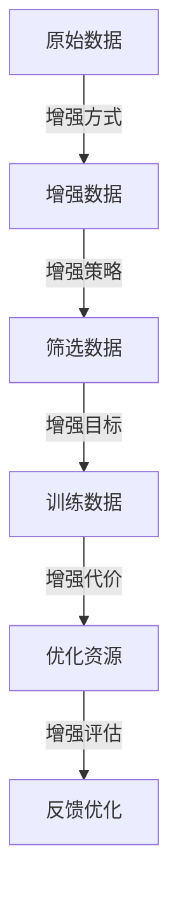

                 

# 数据增强擦边球:从经验驱动到想象力驱动

## 1. 背景介绍

在人工智能的浪潮中，数据增强（Data Augmentation）以其独特的优势，成为了提升模型性能的重要手段。从图像处理到自然语言处理，数据增强在多种场景中大显身手。它不仅扩充了训练集，提高了模型的泛化能力，还减少了对标注数据的依赖，降低了数据收集成本。然而，数据增强在实际应用中也面临着不少挑战，如增强方式的可解释性、增强样本的质量控制、以及如何平衡数据量和计算资源的消耗。本文将从理论和实践两个层面，深入探讨数据增强技术，探索其潜在的限制，并提出一些新的改进方向。

## 2. 核心概念与联系

### 2.1 核心概念概述

在深度学习模型训练过程中，数据增强是一种重要的技术手段。它通过各种方式对原始数据进行变换，生成新的训练样本，从而扩充训练集。常见的数据增强方法包括随机裁剪、翻转、旋转、颜色抖动、文本替换等。这些变换可以有效地提高模型的鲁棒性和泛化能力，使得模型能够更好地适应各种变化的数据分布。

数据增强的核心思想是通过模拟真实数据分布的随机性和多样性，减少模型对特定样本的过度拟合，提升模型在不同场景下的表现。它主要涉及以下几个方面：

- **增强方式**：指如何对原始数据进行变换，生成新的样本。
- **增强策略**：决定哪些样本被增强，以及如何评估增强样本的质量。
- **增强目标**：增强后数据分布与原始数据分布的对比，如何保证增强后的数据分布不偏离原分布。
- **增强代价**：在增强过程中需要消耗的计算资源，如何优化计算效率。

### 2.2 核心概念原理和架构的 Mermaid 流程图



## 3. 核心算法原理 & 具体操作步骤

### 3.1 算法原理概述

数据增强的核心原理是通过对原始数据进行随机变换，生成新的训练样本。这些新的样本虽然可能与原始数据不完全一致，但其分布与原始数据相似，从而提高模型的泛化能力。其基本流程包括数据收集、增强策略设计、数据筛选、模型训练和效果评估。

- **数据收集**：收集足够量的原始数据，数据质量要高，且分布均衡。
- **增强策略设计**：根据不同任务的特点，设计合适的增强方式和策略。例如，对于图像分类任务，可以使用随机裁剪、翻转、旋转等增强方式。
- **数据筛选**：筛选出符合要求的增强样本，避免生成无意义的噪声样本。
- **模型训练**：使用增强后的数据集训练模型，不断迭代优化。
- **效果评估**：评估模型在测试集上的表现，分析增强效果。

### 3.2 算法步骤详解

数据增强的具体步骤主要包括：

1. **数据预处理**：对原始数据进行标准化处理，如归一化、去噪、增强等。
2. **设计增强策略**：根据具体任务设计增强方式和策略。
3. **增强数据生成**：对原始数据进行随机变换，生成新的训练样本。
4. **数据筛选与采样**：筛选出符合要求的增强样本，并进行采样。
5. **模型训练**：使用增强后的数据集训练模型，调整超参数，优化模型性能。
6. **模型评估**：在测试集上评估模型性能，分析增强效果。

### 3.3 算法优缺点

**优点**：

- **泛化能力提升**：增强后的数据集更加多样化，有助于模型学习更多的特征。
- **减少对标注数据的依赖**：增强数据可以补充标注数据不足的问题。
- **降低计算资源消耗**：使用增强数据可以在不增加数据量的情况下提升模型性能。

**缺点**：

- **增强方式难以解释**：增强方式的设计依赖于领域知识和经验，难以解释。
- **过度增强可能导致过拟合**：增强过度可能导致模型对增强后的数据过度拟合。
- **数据质量控制困难**：增强样本的质量控制较难，可能生成噪声样本。
- **计算资源消耗大**：增强数据生成需要大量计算资源，可能影响训练效率。

### 3.4 算法应用领域

数据增强技术在图像处理、自然语言处理、语音识别等多个领域都有广泛应用。例如：

- **图像处理**：图像分类、目标检测、图像分割等任务。
- **自然语言处理**：文本分类、命名实体识别、机器翻译等任务。
- **语音识别**：语音识别、语音情感分析、语音合成等任务。

## 4. 数学模型和公式 & 详细讲解

### 4.1 数学模型构建

在图像处理领域，数据增强主要通过图像变换实现。设原始图像为 $I \in [0,1]^{h \times w}$，增强后的图像为 $I' \in [0,1]^{h' \times w'}$，其中 $h, w, h', w'$ 分别为图像的高度和宽度。常用的图像增强方式包括：

- 随机裁剪（Crop）：从原始图像中随机选取一个子区域，作为增强后的图像。
- 随机翻转（Flip）：沿垂直或水平轴翻转图像。
- 随机旋转（Rotate）：以一定角度旋转图像。
- 颜色抖动（Color Jittering）：对图像的颜色进行随机变换。

数学上，增强后的图像可以表示为：

$$I' = T(I)$$

其中 $T$ 为增强变换函数，常用的增强函数包括：

- 随机裁剪函数 $C$：从原始图像中随机裁剪一个子区域，生成增强后的图像。
- 随机翻转函数 $F$：沿垂直或水平轴翻转图像。
- 随机旋转函数 $R$：以一定角度旋转图像。
- 颜色抖动函数 $CJ$：对图像的颜色进行随机变换。

### 4.2 公式推导过程

以随机裁剪为例，设裁剪后的子区域大小为 $h_1 \times w_1$，在原始图像中随机选取一个位置 $(x, y)$ 作为裁剪的起始点，生成裁剪后的图像：

$$
I'(x', y') = 
\begin{cases} 
I(x', y') & \text{if } (x', y') \in (x_0 + h_1 \mathbb{Z}, y_0 + w_1 \mathbb{Z}) \\
0 & \text{otherwise}
\end{cases}
$$

其中 $x_0, y_0$ 为裁剪起始点的位置，$h_1, w_1$ 为裁剪区域的大小。

### 4.3 案例分析与讲解

以图像分类任务为例，假设原始数据集为 $D = \{(x_i, y_i)\}_{i=1}^N$，其中 $x_i \in [0,1]^{h \times w}$ 为原始图像，$y_i \in \{1,2,\cdots,K\}$ 为标签。使用随机裁剪和随机翻转进行数据增强，生成增强后的数据集 $D' = \{(x_i', y_i')\}_{i=1}^M$，其中 $M$ 为增强后的样本数。模型 $f$ 在增强后的数据集上训练，得到最优参数 $\theta^*$。在测试集上评估模型性能，分析增强效果。

## 5. 项目实践：代码实例和详细解释说明

### 5.1 开发环境搭建

为了快速实现数据增强，我们可以使用深度学习框架（如PyTorch、TensorFlow等）提供的增强模块。以PyTorch为例，首先需要安装相关库：

```bash
pip install torch torchvision
```

然后，搭建基本的开发环境：

```bash
python -m pip install -r requirements.txt
```

### 5.2 源代码详细实现

以下是一个基于PyTorch的数据增强实践代码：

```python
import torchvision.transforms as transforms
from torchvision.datasets import CIFAR10
from torch.utils.data import DataLoader

# 定义数据增强
transform_train = transforms.Compose([
    transforms.RandomCrop(32, padding=4),
    transforms.RandomHorizontalFlip(),
    transforms.ToTensor(),
    transforms.Normalize(mean=[0.485, 0.456, 0.406], std=[0.229, 0.224, 0.225])
])

# 加载数据集
trainset = CIFAR10(root='./data', train=True, download=True, transform=transform_train)
trainloader = DataLoader(trainset, batch_size=128, shuffle=True, num_workers=2)

# 训练模型
model = # 加载模型
criterion = # 定义损失函数
optimizer = # 定义优化器

for epoch in range(num_epochs):
    for i, (inputs, labels) in enumerate(trainloader):
        # 训练模型
        optimizer.zero_grad()
        outputs = model(inputs)
        loss = criterion(outputs, labels)
        loss.backward()
        optimizer.step()

        # 打印日志
        if (i+1) % 100 == 0:
            print('Train Epoch: {} [{}/{} ({:.0f}%)]\tLoss: {:.6f}'.format(
                epoch+1, i*len(inputs), len(trainloader.dataset),
                100. * i / len(trainloader), loss.item()))

print('Finished Training')
```

### 5.3 代码解读与分析

**transforms模块**：提供了各种数据增强的函数，如随机裁剪、翻转、缩放、颜色变换等。

**RandomCrop函数**：随机裁剪图像，可以指定裁剪区域的大小和填充方式。

**RandomHorizontalFlip函数**：随机水平翻转图像。

**ToTensor函数**：将图像转换为Tensor格式。

**Normalize函数**：对图像进行归一化处理。

## 6. 实际应用场景

### 6.1 医疗影像增强

在医疗影像处理中，数据增强技术被广泛应用于提高模型泛化能力。例如，通过随机旋转、缩放、平移等增强方式，可以增加影像数据的丰富性，提升模型对不同角度、大小、位置影像的识别能力。这对于临床诊断和治疗具有重要意义。

### 6.2 自然语言处理

在自然语言处理领域，数据增强技术也被广泛应用。例如，通过随机替换、随机删除、插入等文本增强方式，可以增加文本的多样性，提升模型对语义变化的理解能力。这对于情感分析、文本分类等任务有显著效果。

### 6.3 机器翻译

在机器翻译中，数据增强技术可以提升模型的语言转换能力。例如，通过随机重排序、随机替换等增强方式，增加翻译数据的多样性，提升模型对不同语言风格的适应能力。这对于多语言场景的翻译具有重要意义。

### 6.4 未来应用展望

未来，数据增强技术将进一步发展和完善。例如，结合生成对抗网络（GAN）的增强方式，可以生成更加逼真的增强样本，提升模型对复杂场景的适应能力。同时，数据增强与强化学习的结合，可以在训练过程中动态调整增强策略，进一步提高模型性能。

## 7. 工具和资源推荐

### 7.1 学习资源推荐

- **深度学习入门指南**：适合初学者，介绍深度学习基础和常用技术。
- **TensorFlow官方文档**：详细介绍TensorFlow框架的使用方法和增强模块。
- **PyTorch官方文档**：详细介绍PyTorch框架的使用方法和增强模块。

### 7.2 开发工具推荐

- **PyTorch**：深度学习框架，提供丰富的增强模块和API接口。
- **TensorFlow**：深度学习框架，支持多种增强方式和优化算法。
- **OpenCV**：计算机视觉库，提供丰富的图像处理和增强功能。

### 7.3 相关论文推荐

- **ImageNet Large Scale Visual Recognition Challenge**：介绍数据增强在图像分类任务中的应用。
- **Data Augmentation for Generative Adversarial Networks**：探索数据增强与GAN的结合方式。

## 8. 总结：未来发展趋势与挑战

### 8.1 研究成果总结

数据增强技术在深度学习中发挥了重要作用，提升了模型的泛化能力和性能。然而，数据增强的方式和策略设计依赖于领域知识和经验，难以解释和优化。同时，数据增强可能导致过拟合，生成噪声样本，影响模型性能。

### 8.2 未来发展趋势

未来的数据增强技术将向以下几个方向发展：

- **自动化增强**：通过自动化手段生成增强样本，减少人工干预。
- **多模态增强**：结合不同模态的数据增强方式，提升模型对复杂场景的适应能力。
- **生成对抗增强**：利用GAN生成更加逼真的增强样本，提升模型性能。
- **动态增强**：根据训练过程中的数据分布变化，动态调整增强策略。

### 8.3 面临的挑战

尽管数据增强技术在深度学习中具有重要意义，但仍面临以下挑战：

- **增强方式设计困难**：增强方式的设计依赖于领域知识和经验，难以解释和优化。
- **生成样本质量控制**：生成样本的质量控制较难，可能生成噪声样本。
- **计算资源消耗大**：增强数据生成需要大量计算资源，可能影响训练效率。

### 8.4 研究展望

未来的研究将在以下几个方向进行：

- **自动化增强**：利用自动化手段生成高质量的增强样本，减少人工干预。
- **多模态增强**：结合不同模态的数据增强方式，提升模型对复杂场景的适应能力。
- **生成对抗增强**：利用GAN生成更加逼真的增强样本，提升模型性能。
- **动态增强**：根据训练过程中的数据分布变化，动态调整增强策略。

总之，数据增强技术在深度学习中具有重要意义，未来的研究将致力于解决现有问题，提升增强方式的可解释性和优化性，增强样本的质量控制和动态适应性。

## 9. 附录：常见问题与解答

**Q1: 数据增强的原理是什么？**

A: 数据增强通过模拟真实数据分布的随机性和多样性，减少模型对特定样本的过度拟合，提升模型在不同场景下的表现。增强方式包括随机裁剪、翻转、旋转、颜色抖动等。

**Q2: 如何设计合适的数据增强策略？**

A: 数据增强策略的设计依赖于领域知识和经验。需要根据具体任务选择合适的增强方式和参数。例如，对于图像分类任务，可以使用随机裁剪、翻转、旋转等增强方式。

**Q3: 如何评估数据增强的效果？**

A: 数据增强的效果评估可以通过模型在测试集上的性能变化来衡量。可以通过对比增强前后的模型性能，评估增强方式和策略的有效性。

**Q4: 如何控制增强样本的质量？**

A: 增强样本的质量控制较难，可能生成噪声样本。可以通过设定增强参数和筛选策略，避免生成无意义的噪声样本。

**Q5: 数据增强是否适用于所有任务？**

A: 数据增强技术在深度学习中具有重要意义，适用于图像、文本、语音等多种任务。然而，对于某些任务，如语义理解、情感分析等，增强方式的设计需要更加谨慎，避免引入噪声。

---

作者：禅与计算机程序设计艺术 / Zen and the Art of Computer Programming

