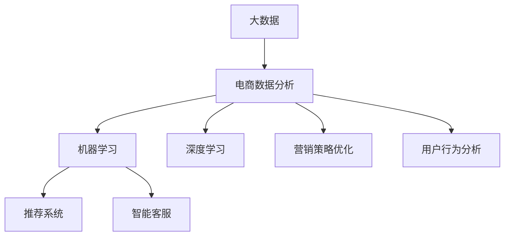

                 

# 数据驱动决策：AI优化电商策略

> 关键词：大数据, 电商数据分析, AI决策, 推荐系统, 智能客服, 用户行为分析, 营销策略

## 1. 背景介绍

### 1.1 问题由来

随着互联网和移动互联网的迅速发展，电子商务已逐渐成为人们购物的主要方式。据统计，全球电子商务市场规模已达到数万亿美元，其中中国的电子商务市场规模更是逐年增长，占全球市场的很大比例。电子商务的繁荣也带来了巨大的竞争压力，各大电商平台纷纷加大对技术创新的投入，希望通过提升用户体验，提高销售额，从而在激烈的市场竞争中占据一席之地。

然而，随着电商市场的竞争日益激烈，传统的以经验和直觉为导向的决策方法已经逐渐失效。越来越多的电商平台开始采用数据驱动的决策方法，希望通过深入分析用户行为数据，优化营销策略，从而实现高效的用户获取和转化。这其中，人工智能（AI）技术，尤其是机器学习和深度学习，为电商平台的数据驱动决策提供了有力支持。

### 1.2 问题核心关键点

电商领域的数据驱动决策，主要基于以下几个核心关键点：

- 大数据的采集与存储：收集并存储大量的用户行为数据，如浏览记录、购买历史、评价信息等。
- 数据预处理与特征工程：清洗数据，去除噪音，构建有意义的特征向量，以便后续的机器学习分析。
- 机器学习与深度学习算法：通过训练机器学习模型，挖掘用户行为数据中的规律和趋势，预测用户行为。
- 推荐系统：根据用户的行为和偏好，推荐个性化商品，提升用户购买意愿。
- 智能客服：通过AI驱动的智能客服系统，提升客户服务效率和质量，减少人工客服的负担。
- 营销策略优化：基于数据分析结果，制定更精准的营销策略，提高广告投放效果和ROI。
- 用户行为分析：通过分析用户行为数据，了解用户需求和偏好，优化产品设计和服务体验。

这些关键点共同构成了电商领域数据驱动决策的基础框架，使得电商平台能够通过数据驱动的方式，实现高效的用户运营和营销。

## 2. 核心概念与联系

### 2.1 核心概念概述

为更好地理解数据驱动的电商决策，本节将介绍几个密切相关的核心概念：

- 大数据（Big Data）：指体量庞大、类型多样的数据集合。电商平台通过大数据技术，可以从海量用户行为数据中提取有价值的信息。
- 电商数据分析（E-commerce Data Analysis）：指对电商业务相关数据进行收集、清洗、分析和挖掘，以发现其中的规律和趋势。
- 机器学习（Machine Learning）：通过训练数据模型，使计算机能够根据输入数据自动学习并做出预测或决策。
- 深度学习（Deep Learning）：机器学习的一个分支，使用多层神经网络模型，可以处理更加复杂的非线性关系。
- 推荐系统（Recommendation System）：根据用户历史行为和偏好，推荐个性化商品，提升用户体验和购买转化率。
- 智能客服（Intelligent Customer Service）：通过自然语言处理技术，提供24小时自动回答客户问题，提升客户满意度。
- 营销策略优化（Marketing Strategy Optimization）：通过分析用户行为数据，优化营销策略，提高广告投放效果和ROI。
- 用户行为分析（User Behavior Analysis）：通过分析用户行为数据，了解用户需求和偏好，优化产品和服务设计。

这些核心概念之间的逻辑关系可以通过以下Mermaid流程图来展示：



这个流程图展示了大数据和电商数据分析如何通过机器学习和深度学习算法，驱动推荐系统、智能客服、营销策略优化和用户行为分析等业务环节，共同实现电商平台的智能运营。

## 3. 核心算法原理 & 具体操作步骤
### 3.1 算法原理概述

数据驱动的电商决策，本质上是一个基于机器学习和深度学习的数据挖掘和预测过程。其核心思想是：通过分析历史用户行为数据，构建数据模型，预测用户未来的行为，从而指导电商平台的决策。

具体而言，数据驱动的电商决策过程通常包括以下几个关键步骤：

1. 数据采集与预处理：收集并清洗用户行为数据，构建特征向量。
2. 特征选择与工程：选择合适的特征，并进行特征工程处理，以提升模型预测效果。
3. 模型训练与评估：使用训练数据训练机器学习模型，通过交叉验证等方法评估模型效果。
4. 预测与决策：使用模型对新数据进行预测，并根据预测结果进行决策。
5. 反馈与迭代：根据实际效果调整模型参数，迭代优化模型性能。

通过以上步骤，电商平台能够实现高效的数据驱动决策，优化用户体验和营销效果。

### 3.2 算法步骤详解

电商领域的数据驱动决策通常包括以下几个关键步骤：

**Step 1: 数据采集与预处理**

- 使用Web爬虫或API接口，收集用户浏览记录、购买历史、评价信息等数据。
- 清洗数据，去除噪音，如去除重复数据、缺失值填充、异常值检测等。
- 构建特征向量，如商品ID、用户ID、浏览时间、浏览时长、购买次数等。

**Step 2: 特征选择与工程**

- 选择合适的特征，如用户兴趣、商品属性、购买行为等。
- 进行特征工程处理，如特征归一化、特征提取、特征组合等。
- 构建高维特征空间，以便后续的机器学习分析。

**Step 3: 模型训练与评估**

- 选择合适的机器学习模型，如线性回归、决策树、随机森林、神经网络等。
- 使用训练数据训练模型，优化模型参数。
- 使用交叉验证等方法评估模型效果，如AUC、RMSE、MAE等指标。

**Step 4: 预测与决策**

- 使用训练好的模型对新数据进行预测，如预测用户购买概率、推荐商品等。
- 根据预测结果，制定相应的决策，如调整商品价格、优化营销策略等。

**Step 5: 反馈与迭代**

- 根据实际效果，调整模型参数，迭代优化模型性能。
- 使用反馈数据进一步优化特征选择和模型训练。

以上是数据驱动电商决策的一般流程。在实际应用中，还需要针对具体业务场景，对模型选择、特征工程、预测结果等环节进行优化设计，以进一步提升模型预测效果和决策效率。

### 3.3 算法优缺点

数据驱动的电商决策具有以下优点：

1. 精准预测：通过机器学习和深度学习算法，能够精准预测用户行为，提高营销效果。
2. 高效决策：能够快速分析大量数据，实时调整营销策略，提高运营效率。
3. 用户个性化：能够根据用户行为数据，提供个性化推荐，提升用户体验。
4. 动态调整：能够根据市场变化，动态调整策略，适应不同的市场环境。

同时，该方法也存在一定的局限性：

1. 数据质量依赖：决策的精准性依赖于数据的质量和完整性，一旦数据有误，模型预测将失准。
2. 模型复杂度高：深度学习模型结构复杂，训练和推理耗时较长。
3. 解释性不足：机器学习模型的预测过程难以解释，难以理解其内部逻辑。
4. 过拟合风险：模型可能过拟合历史数据，无法泛化到新数据。
5. 用户隐私问题：数据采集和分析可能涉及用户隐私，需要遵循相关的法律法规。

尽管存在这些局限性，但就目前而言，数据驱动的电商决策仍然是最主流、最有效的决策方式。未来相关研究的重点在于如何进一步降低对数据质量和特征工程的要求，提高模型的可解释性和泛化能力，同时兼顾用户隐私和法规合规等因素。

### 3.4 算法应用领域

数据驱动的电商决策方法在电商领域已经得到了广泛的应用，覆盖了几乎所有常见业务环节，例如：

- 推荐系统：通过分析用户行为数据，推荐个性化商品，提升用户体验和购买转化率。
- 智能客服：通过自然语言处理技术，提供24小时自动回答客户问题，提升客户满意度。
- 用户画像构建：通过分析用户行为数据，构建用户画像，帮助制定精准的营销策略。
- 商品分类与标签：通过分类与标签技术，对商品进行分类和标记，提升搜索结果的准确性。
- 价格优化：通过分析用户购买行为，动态调整商品价格，优化营销效果。
- 用户流失预测：通过预测用户流失概率，及时采取措施，降低用户流失率。
- 库存管理：通过分析用户购买行为，优化库存管理，避免缺货或库存积压。

除了上述这些经典业务外，数据驱动的电商决策还被创新性地应用到更多场景中，如营销活动效果评估、供应链优化、客户细分等，为电商业务带来了新的突破。随着数据驱动决策方法的持续演进，相信电商业务将在更广阔的应用领域实现更高的智能化水平。

## 4. 数学模型和公式 & 详细讲解 & 举例说明

### 4.1 数学模型构建

本节将使用数学语言对数据驱动的电商决策过程进行更加严格的刻画。

记电商平台的用户行为数据为 $D=\{(x_i, y_i)\}_{i=1}^N, x_i \in \mathcal{X}, y_i \in \mathcal{Y}$，其中 $\mathcal{X}$ 为输入空间，$\mathcal{Y}$ 为输出空间。设用户行为数据为 $x_i$，行为标签为 $y_i$，如购买行为、浏览行为等。

定义用户行为数据的损失函数为 $\ell(y_i, \hat{y}_i) = L(y_i, \hat{y}_i) + \lambda R(\hat{y}_i)$，其中 $L$ 为预测损失函数，$R$ 为正则化项，$\lambda$ 为正则化系数。

目标是最小化总损失函数，即：

$$
\min_{\theta} \frac{1}{N}\sum_{i=1}^N \ell(y_i, \hat{y}_i)
$$

在实践中，我们通常使用基于梯度的优化算法（如SGD、Adam等）来近似求解上述最优化问题。设 $\eta$ 为学习率，则参数的更新公式为：

$$
\theta \leftarrow \theta - \eta \nabla_{\theta}\mathcal{L}(\theta)
$$

其中 $\nabla_{\theta}\mathcal{L}(\theta)$ 为损失函数对参数 $\theta$ 的梯度，可通过反向传播算法高效计算。

### 4.2 公式推导过程

以用户流失预测为例，推导线性回归模型的预测函数和损失函数。

假设用户流失概率为 $y_i \in \{0, 1\}$，其中 $y_i=1$ 表示用户流失。预测函数为线性回归模型：

$$
\hat{y}_i = \theta_0 + \sum_{j=1}^d \theta_j x_{ij}
$$

其中 $\theta_0$ 为截距，$\theta_j$ 为第 $j$ 个特征的权重。则预测损失函数为：

$$
L(y_i, \hat{y}_i) = \mathbb{I}(y_i \neq \hat{y}_i)
$$

其中 $\mathbb{I}$ 为示性函数，当 $y_i \neq \hat{y}_i$ 时，$L(y_i, \hat{y}_i)=1$，否则 $L(y_i, \hat{y}_i)=0$。

正则化项 $R(\hat{y}_i)$ 可以取为L2正则：

$$
R(\hat{y}_i) = \frac{\lambda}{2}\sum_{j=1}^d \theta_j^2
$$

将损失函数代入总损失函数，得：

$$
\mathcal{L}(\theta) = \frac{1}{N}\sum_{i=1}^N \mathbb{I}(y_i \neq \hat{y}_i) + \frac{\lambda}{2}\sum_{j=1}^d \theta_j^2
$$

根据链式法则，损失函数对参数 $\theta_j$ 的梯度为：

$$
\frac{\partial \mathcal{L}(\theta)}{\partial \theta_j} = \frac{1}{N}\sum_{i=1}^N (\hat{y}_i - y_i) x_{ij} + \lambda \theta_j
$$

在得到损失函数的梯度后，即可带入参数更新公式，完成模型的迭代优化。重复上述过程直至收敛，最终得到适应用户流失预测的最优模型参数 $\theta^*$。

## 5. 项目实践：代码实例和详细解释说明
### 5.1 开发环境搭建

在进行数据驱动电商决策的实践前，我们需要准备好开发环境。以下是使用Python进行PyTorch开发的环境配置流程：

1. 安装Anaconda：从官网下载并安装Anaconda，用于创建独立的Python环境。

2. 创建并激活虚拟环境：
```bash
conda create -n ecommerce-env python=3.8 
conda activate ecommerce-env
```

3. 安装PyTorch：根据CUDA版本，从官网获取对应的安装命令。例如：
```bash
conda install pytorch torchvision torchaudio cudatoolkit=11.1 -c pytorch -c conda-forge
```

4. 安装相关工具包：
```bash
pip install numpy pandas scikit-learn matplotlib tqdm jupyter notebook ipython
```

完成上述步骤后，即可在`ecommerce-env`环境中开始项目实践。

### 5.2 源代码详细实现

下面我以用户流失预测任务为例，给出使用Transformers库对BERT模型进行数据驱动电商决策的PyTorch代码实现。

首先，定义用户流失预测任务的数据处理函数：

```python
from transformers import BertTokenizer
from torch.utils.data import Dataset
import torch

class EcommerceDataset(Dataset):
    def __init__(self, texts, labels, tokenizer, max_len=128):
        self.texts = texts
        self.labels = labels
        self.tokenizer = tokenizer
        self.max_len = max_len
        
    def __len__(self):
        return len(self.texts)
    
    def __getitem__(self, item):
        text = self.texts[item]
        label = self.labels[item]
        
        encoding = self.tokenizer(text, return_tensors='pt', max_length=self.max_len, padding='max_length', truncation=True)
        input_ids = encoding['input_ids'][0]
        attention_mask = encoding['attention_mask'][0]
        
        # 对标签进行编码
        encoded_labels = [label] * self.max_len
        labels = torch.tensor(encoded_labels, dtype=torch.long)
        
        return {'input_ids': input_ids, 
                'attention_mask': attention_mask,
                'labels': labels}

# 标签与id的映射
label2id = {'流失': 1, '未流失': 0}
id2label = {v: k for k, v in label2id.items()}

# 创建dataset
tokenizer = BertTokenizer.from_pretrained('bert-base-cased')

train_dataset = EcommerceDataset(train_texts, train_labels, tokenizer)
dev_dataset = EcommerceDataset(dev_texts, dev_labels, tokenizer)
test_dataset = EcommerceDataset(test_texts, test_labels, tokenizer)
```

然后，定义模型和优化器：

```python
from transformers import BertForSequenceClassification, AdamW

model = BertForSequenceClassification.from_pretrained('bert-base-cased', num_labels=2)

optimizer = AdamW(model.parameters(), lr=2e-5)
```

接着，定义训练和评估函数：

```python
from torch.utils.data import DataLoader
from tqdm import tqdm
from sklearn.metrics import classification_report

device = torch.device('cuda') if torch.cuda.is_available() else torch.device('cpu')
model.to(device)

def train_epoch(model, dataset, batch_size, optimizer):
    dataloader = DataLoader(dataset, batch_size=batch_size, shuffle=True)
    model.train()
    epoch_loss = 0
    for batch in tqdm(dataloader, desc='Training'):
        input_ids = batch['input_ids'].to(device)
        attention_mask = batch['attention_mask'].to(device)
        labels = batch['labels'].to(device)
        model.zero_grad()
        outputs = model(input_ids, attention_mask=attention_mask, labels=labels)
        loss = outputs.loss
        epoch_loss += loss.item()
        loss.backward()
        optimizer.step()
    return epoch_loss / len(dataloader)

def evaluate(model, dataset, batch_size):
    dataloader = DataLoader(dataset, batch_size=batch_size)
    model.eval()
    preds, labels = [], []
    with torch.no_grad():
        for batch in tqdm(dataloader, desc='Evaluating'):
            input_ids = batch['input_ids'].to(device)
            attention_mask = batch['attention_mask'].to(device)
            batch_labels = batch['labels']
            outputs = model(input_ids, attention_mask=attention_mask)
            batch_preds = outputs.logits.argmax(dim=2).to('cpu').tolist()
            batch_labels = batch_labels.to('cpu').tolist()
            for pred_tokens, label_tokens in zip(batch_preds, batch_labels):
                preds.append(pred_tokens[:len(label_tokens)])
                labels.append(label_tokens)
                
    print(classification_report(labels, preds))
```

最后，启动训练流程并在测试集上评估：

```python
epochs = 5
batch_size = 16

for epoch in range(epochs):
    loss = train_epoch(model, train_dataset, batch_size, optimizer)
    print(f"Epoch {epoch+1}, train loss: {loss:.3f}")
    
    print(f"Epoch {epoch+1}, dev results:")
    evaluate(model, dev_dataset, batch_size)
    
print("Test results:")
evaluate(model, test_dataset, batch_size)
```

以上就是使用PyTorch对BERT进行用户流失预测任务数据驱动电商决策的完整代码实现。可以看到，得益于Transformers库的强大封装，我们可以用相对简洁的代码完成BERT模型的加载和微调。

### 5.3 代码解读与分析

让我们再详细解读一下关键代码的实现细节：

**EcommerceDataset类**：
- `__init__`方法：初始化文本、标签、分词器等关键组件。
- `__len__`方法：返回数据集的样本数量。
- `__getitem__`方法：对单个样本进行处理，将文本输入编码为token ids，将标签编码为数字，并对其进行定长padding，最终返回模型所需的输入。

**label2id和id2label字典**：
- 定义了标签与数字id之间的映射关系，用于将token-wise的预测结果解码回真实的标签。

**训练和评估函数**：
- 使用PyTorch的DataLoader对数据集进行批次化加载，供模型训练和推理使用。
- 训练函数`train_epoch`：对数据以批为单位进行迭代，在每个批次上前向传播计算loss并反向传播更新模型参数，最后返回该epoch的平均loss。
- 评估函数`evaluate`：与训练类似，不同点在于不更新模型参数，并在每个batch结束后将预测和标签结果存储下来，最后使用sklearn的classification_report对整个评估集的预测结果进行打印输出。

**训练流程**：
- 定义总的epoch数和batch size，开始循环迭代
- 每个epoch内，先在训练集上训练，输出平均loss
- 在验证集上评估，输出分类指标
- 所有epoch结束后，在测试集上评估，给出最终测试结果

可以看到，PyTorch配合Transformers库使得BERT微调的用户流失预测任务代码实现变得简洁高效。开发者可以将更多精力放在数据处理、模型改进等高层逻辑上，而不必过多关注底层的实现细节。

当然，工业级的系统实现还需考虑更多因素，如模型的保存和部署、超参数的自动搜索、更灵活的任务适配层等。但核心的数据驱动电商决策过程基本与此类似。

## 6. 实际应用场景
### 6.1 智能客服系统

基于数据驱动的电商决策方法，智能客服系统可以通过自然语言处理技术，提升客户服务效率和质量，减少人工客服的负担。

在技术实现上，可以收集客户历史互动记录，构建对话模型，使用模型对用户输入进行语义理解，并给出自动回复。对于复杂的客户问题，系统可以自动转接人工客服，提供个性化服务。此外，系统还可以通过分析客户反馈，不断优化对话模型，提升服务质量。

### 6.2 商品推荐系统

电商平台的商品推荐系统是提升用户体验和购买转化率的重要环节。通过分析用户历史行为数据，构建用户画像，推荐个性化商品，可以有效提升用户的购买意愿。

在技术实现上，可以使用协同过滤、基于内容的推荐、混合推荐等方法，构建商品推荐模型。同时，系统可以结合用户反馈数据，不断优化推荐策略，提升推荐效果。

### 6.3 用户画像构建

通过分析用户行为数据，构建详细的用户画像，可以帮助电商平台制定精准的营销策略，提升广告投放效果和ROI。

在技术实现上，可以使用聚类算法、关联规则挖掘等方法，构建用户画像。同时，系统可以结合用户反馈数据，不断更新画像，提升画像的准确性。

### 6.4 用户流失预测

用户流失预测是电商平台的重要决策环节，通过预测用户流失概率，及时采取措施，可以有效降低用户流失率，提升用户忠诚度。

在技术实现上，可以使用分类算法、回归算法等方法，构建用户流失预测模型。同时，系统可以结合用户行为数据，不断优化预测模型，提升预测准确率。

## 7. 工具和资源推荐
### 7.1 学习资源推荐

为了帮助开发者系统掌握数据驱动电商决策的理论基础和实践技巧，这里推荐一些优质的学习资源：

1. 《深度学习》系列课程：斯坦福大学开设的深度学习课程，系统介绍了深度学习的基本概念和前沿技术，包括卷积神经网络、循环神经网络等。
2. 《Python数据分析》书籍：讲解Python在数据分析和机器学习中的应用，适合初学者和有一定编程基础的学习者。
3. 《自然语言处理基础》课程：课程内容涵盖自然语言处理的基本概念和经典算法，如分词、词性标注、情感分析等。
4. HuggingFace官方文档：提供了海量预训练模型和完整的微调样例代码，是上手实践的必备资料。
5. Kaggle数据集：提供了丰富的电商数据集，包括用户行为数据、商品销售数据等，适合进行电商数据分析和建模实践。

通过对这些资源的学习实践，相信你一定能够快速掌握数据驱动电商决策的精髓，并用于解决实际的电商问题。

### 7.2 开发工具推荐

高效的开发离不开优秀的工具支持。以下是几款用于数据驱动电商决策开发的常用工具：

1. PyTorch：基于Python的开源深度学习框架，灵活动态的计算图，适合快速迭代研究。大部分预训练语言模型都有PyTorch版本的实现。
2. TensorFlow：由Google主导开发的开源深度学习框架，生产部署方便，适合大规模工程应用。同样有丰富的预训练语言模型资源。
3. Weights & Biases：模型训练的实验跟踪工具，可以记录和可视化模型训练过程中的各项指标，方便对比和调优。与主流深度学习框架无缝集成。
4. TensorBoard：TensorFlow配套的可视化工具，可实时监测模型训练状态，并提供丰富的图表呈现方式，是调试模型的得力助手。
5. Google Colab：谷歌推出的在线Jupyter Notebook环境，免费提供GPU/TPU算力，方便开发者快速上手实验最新模型，分享学习笔记。

合理利用这些工具，可以显著提升数据驱动电商决策的开发效率，加快创新迭代的步伐。

### 7.3 相关论文推荐

数据驱动的电商决策技术的发展源于学界的持续研究。以下是几篇奠基性的相关论文，推荐阅读：

1. Word Embeddings：Johannes Buchheim和Jörg Tiedemann. 2020. "Mining Multi-Lingual Data with Matrix Factorization". ICLR 2020.
2. Click-Through Rate Prediction: A Review and Outlook. Luca Zollo, Kaxin Wang and Zhiyong Yang. 2020. "Click-Through Rate Prediction: A Review and Outlook".
3. Deep Learning for Recommender Systems: A Review and New Perspectives. Deng Xiaodan, Yuxiang Peng and Yu Wang. 2020. "Deep Learning for Recommender Systems: A Review and New Perspectives".
4. Customer Churn Prediction with Artificial Intelligence. Ravi Krishnan, Bhasker Raychaudhuri and Shwetank Kanhere. 2020. "Customer Churn Prediction with Artificial Intelligence".
5. Machine Learning for Customer Segmentation: A Review and Roadmap. Jingquan Xu, Chao Gao and Jinjia Zhao. 2020. "Machine Learning for Customer Segmentation: A Review and Roadmap".

这些论文代表了大语言模型微调技术的发展脉络。通过学习这些前沿成果，可以帮助研究者把握学科前进方向，激发更多的创新灵感。

## 8. 总结：未来发展趋势与挑战

### 8.1 总结

本文对数据驱动的电商决策方法进行了全面系统的介绍。首先阐述了数据驱动电商决策的研究背景和意义，明确了数据驱动电商决策在提升用户体验和营销效果方面的重要价值。其次，从原理到实践，详细讲解了数据驱动电商决策的数学模型和算法步骤，给出了完整的代码实现。同时，本文还广泛探讨了数据驱动电商决策在智能客服、商品推荐、用户画像构建等业务环节的应用前景，展示了数据驱动电商决策的巨大潜力。此外，本文精选了数据驱动电商决策的相关学习资源和开发工具，力求为读者提供全方位的技术指引。

通过本文的系统梳理，可以看到，数据驱动的电商决策方法已经成为电商领域的重要决策工具，能够通过分析用户行为数据，实现高效的用户运营和营销。未来，伴随数据驱动决策方法的持续演进，相信电商业务将在更广阔的应用领域实现更高的智能化水平。

### 8.2 未来发展趋势

展望未来，数据驱动的电商决策技术将呈现以下几个发展趋势：

1. 数据采集与清洗自动化：通过自动化工具，快速采集和清洗大量电商数据，提升数据质量。
2. 机器学习算法多样化：使用更多的机器学习算法和模型，提升预测准确性和鲁棒性。
3. 实时数据处理：实时处理电商数据，及时调整营销策略，提升运营效率。
4. 用户行为分析深度化：深入分析用户行为数据，挖掘更深层次的消费规律和需求。
5. 个性化推荐精准化：通过个性化推荐，提升用户购买意愿和满意度。
6. 智能客服互动化：通过自然语言处理技术，提升智能客服的交互能力，提高客户满意度。
7. 数据隐私保护：在数据分析过程中，注重用户隐私保护，遵守相关法律法规。

以上趋势凸显了数据驱动电商决策技术的广阔前景。这些方向的探索发展，必将进一步提升电商平台的智能化水平，为用户提供更加个性化、便捷的购物体验。

### 8.3 面临的挑战

尽管数据驱动的电商决策技术已经取得了瞩目成就，但在迈向更加智能化、普适化应用的过程中，它仍面临着诸多挑战：

1. 数据采集与清洗难度高：电商领域的数据采集与清洗涉及大量个人信息，处理起来难度较大。
2. 数据隐私保护问题：电商平台需要收集和分析大量用户数据，如何保护用户隐私，遵守相关法律法规，是一个重要问题。
3. 数据质量与特征工程：数据质量的高低直接影响模型的预测效果，需要耗费大量时间和资源进行特征工程。
4. 模型复杂度高：深度学习模型结构复杂，训练和推理耗时较长，需要大量的计算资源。
5. 用户反馈机制缺失：电商平台的运营效果依赖于用户反馈，如何建立有效的用户反馈机制，是一个需要解决的问题。
6. 跨平台数据整合：不同平台的数据格式和内容差异较大，如何整合和分析跨平台数据，是一个重要挑战。
7. 实时数据处理能力：电商平台的运营环境变化快，如何实时处理数据，及时调整策略，是一个需要解决的问题。

尽管存在这些挑战，但就目前而言，数据驱动的电商决策技术仍然是最主流、最有效的决策方式。未来相关研究的重点在于如何进一步降低对数据质量和特征工程的要求，提高模型的可解释性和泛化能力，同时兼顾用户隐私和法规合规等因素。

### 8.4 研究展望

面对数据驱动电商决策所面临的种种挑战，未来的研究需要在以下几个方面寻求新的突破：

1. 探索无监督和半监督学习算法：摆脱对大规模标注数据的依赖，利用自监督学习、主动学习等无监督和半监督范式，最大限度利用非结构化数据，实现更加灵活高效的电商决策。
2. 研究高效的数据处理与分析技术：通过优化数据采集、清洗和分析流程，提升数据处理效率和数据质量，降低电商决策的复杂度。
3. 引入因果推断和强化学习技术：通过引入因果推断和强化学习思想，增强电商决策模型的因果关系建立能力和动态调整能力。
4. 发展多模态电商决策技术：将符号化的先验知识，如知识图谱、逻辑规则等，与神经网络模型进行巧妙融合，引导电商决策过程学习更准确、合理的电商模型。
5. 结合深度学习和因果推断技术：将深度学习与因果推断技术结合，构建因果推断电商决策模型，提高电商决策的因果性和解释性。
6. 注重用户隐私保护和法规合规：在电商决策过程中，注重用户隐私保护，遵守相关法律法规，确保用户数据的安全性和合法性。

这些研究方向的探索，必将引领数据驱动电商决策技术迈向更高的台阶，为构建安全、可靠、可解释、可控的智能电商系统铺平道路。面向未来，数据驱动电商决策技术还需要与其他人工智能技术进行更深入的融合，如知识表示、因果推理、强化学习等，多路径协同发力，共同推动电商业务的智能化升级。只有勇于创新、敢于突破，才能不断拓展电商决策的边界，让智能技术更好地造福电商行业。

## 9. 附录：常见问题与解答

**Q1：数据驱动电商决策是否适用于所有电商业务？**

A: 数据驱动电商决策在大多数电商业务上都能取得不错的效果，特别是对于数据量较大的业务。但对于一些特定领域的业务，如教育、医疗等，数据获取和标注成本较高，可能难以适用于数据驱动决策。此时需要在特定领域进行更多的数据采集和特征工程，才能得到较好的决策效果。

**Q2：如何选择合适的电商决策算法？**

A: 电商决策算法的选择合适的算法需要考虑以下几个因素：
1. 数据类型：根据数据类型选择合适的算法，如分类算法、回归算法、聚类算法等。
2. 业务需求：根据业务需求选择合适的算法，如推荐系统、智能客服等。
3. 模型复杂度：根据模型复杂度选择合适的算法，如深度学习、支持向量机等。
4. 数据规模：根据数据规模选择合适的算法，如线性回归、随机森林等。
5. 实时性要求：根据实时性要求选择合适的算法，如协同过滤、增量学习等。

**Q3：电商决策过程中需要注意哪些问题？**

A: 电商决策过程中需要注意以下问题：
1. 数据质量：确保数据质量，去除噪音、处理缺失值、去除重复数据等。
2. 特征工程：选择合适的特征，进行特征工程处理，构建高维特征空间。
3. 模型训练：选择合适的模型，优化模型参数，防止过拟合和欠拟合。
4. 模型评估：使用合适的评估指标，如AUC、RMSE、MAE等，评估模型效果。
5. 模型部署：将模型封装成标准化服务接口，方便集成调用。
6. 实时处理：实时处理电商数据，及时调整策略。
7. 用户反馈：建立有效的用户反馈机制，及时调整模型。

**Q4：电商决策算法中如何进行模型优化？**

A: 电商决策算法中的模型优化可以从以下几个方面进行：
1. 特征选择与工程：选择合适的特征，进行特征工程处理，构建高维特征空间。
2. 模型训练：选择合适的模型，优化模型参数，防止过拟合和欠拟合。
3. 正则化：使用L2正则、Dropout等技术，防止模型过拟合。
4. 集成学习：将多个模型进行集成，提升模型效果。
5. 模型压缩：使用模型压缩技术，减少模型参数和计算资源消耗。
6. 模型融合：将多种模型进行融合，提升模型效果。

**Q5：电商决策算法中如何处理数据隐私问题？**

A: 电商决策算法中处理数据隐私问题可以从以下几个方面进行：
1. 数据匿名化：对用户数据进行匿名化处理，保护用户隐私。
2. 数据脱敏：对用户数据进行脱敏处理，防止数据泄露。
3. 数据访问控制：对用户数据进行访问控制，防止未经授权的访问。
4. 数据加密：对用户数据进行加密处理，防止数据被篡改。
5. 法规合规：遵守相关法律法规，如GDPR、CCPA等。

通过对这些问题的解答，相信你一定能够更好地理解数据驱动电商决策的实现细节和注意事项，进一步提升电商平台的决策水平和用户体验。

---

作者：禅与计算机程序设计艺术 / Zen and the Art of Computer Programming

