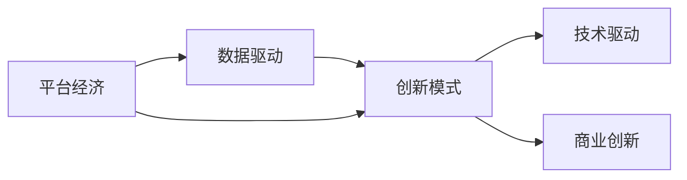

                 

# 数据驱动平台经济创新模式：如何探索创新模式？

## 1. 背景介绍

在过去几十年中，数据驱动的平台经济已经彻底改变了商业和社会的运作方式。从互联网到物联网，从云计算到大数据，再到人工智能和区块链，技术的进步让平台经济的发展越来越快，应用也越来越广泛。平台经济不再只是企业的创新模式，更成为了推动社会进步的重要力量。

在平台经济中，数据成为了关键的生产要素，其价值无法估量。如何更高效地利用数据，提高平台经济的发展速度和质量，成为了各个企业、行业乃至政府都关注的焦点。而数据驱动的平台经济创新模式，正是通过数据的深度挖掘、分析和应用，为平台经济的持续发展提供了强有力的支撑。

本文将围绕数据驱动平台经济创新模式的核心概念、原理和应用进行探讨，并结合具体的项目实践和案例分析，深入讲解如何探索和实现这些创新模式。

## 2. 核心概念与联系

### 2.1 核心概念概述

在探讨数据驱动平台经济创新模式时，我们需要理解几个关键的核心概念：

- **平台经济**：指基于互联网或数字平台，通过整合资源、促进协作，实现价值共享的经济模式。

- **数据驱动**：指通过大量数据的收集、存储、分析和应用，来驱动业务决策和发展的一种商业模式。

- **创新模式**：指通过技术进步和商业模式创新，为平台经济带来的新的发展方向和解决方案。

这些核心概念构成了数据驱动平台经济创新模式的基础。数据不仅是一种资源，更是一种能力，能够提升平台经济的运营效率和创新能力。而创新模式则是在这一过程中，通过技术手段和商业模式创新，实现新的价值创造。

### 2.2 核心概念原理和架构的 Mermaid 流程图



这个图展示了平台经济、数据驱动和创新模式之间的关系：平台经济依托数据驱动技术，通过商业创新实现价值创造和业务发展。

## 3. 核心算法原理 & 具体操作步骤

### 3.1 算法原理概述

数据驱动平台经济创新模式的算法原理主要包括以下几个方面：

- **数据收集与预处理**：通过各种渠道收集数据，并对数据进行清洗、整合和标注，为后续分析打下基础。

- **数据分析与建模**：利用机器学习、深度学习等技术，对数据进行建模和分析，提取有价值的洞察和信息。

- **业务应用与创新**：将分析结果应用到业务中，通过产品创新、流程优化等方式，实现业务的持续改进和发展。

这些算法原理构成了数据驱动平台经济创新模式的基础，通过数据和算法的结合，平台经济能够实现更高效的运营和发展。

### 3.2 算法步骤详解

数据驱动平台经济创新模式的具体操作步骤如下：

**Step 1: 数据收集与预处理**

- 确定数据收集的目标和范围，通过API接口、爬虫、传感器等方式收集数据。
- 对数据进行清洗和预处理，包括去重、缺失值填补、异常值检测等。
- 对数据进行标注和整合，生成可供后续分析的数据集。

**Step 2: 数据分析与建模**

- 选择合适的算法和模型，进行数据训练和预测。
- 对模型进行调优和验证，确保模型准确性和鲁棒性。
- 将模型结果应用到实际业务中，提取有价值的洞察和信息。

**Step 3: 业务应用与创新**

- 根据模型结果，优化产品设计、流程和策略，提升用户体验和运营效率。
- 结合商业洞察，进行商业模式的创新和优化，拓展新的业务机会。
- 持续收集用户反馈，迭代优化产品和策略，保持业务持续增长。

### 3.3 算法优缺点

数据驱动平台经济创新模式有以下优点：

- **数据驱动**：通过数据驱动决策，能够更准确地把握市场和用户需求，提升业务效率。
- **持续优化**：通过持续优化和创新，能够适应市场变化，保持竞争优势。
- **敏捷响应**：数据驱动的决策过程，能够快速响应市场和用户变化，提高灵活性。

同时，该模式也存在一些缺点：

- **数据隐私和安全**：大规模数据收集和应用，可能带来隐私和安全性问题。
- **技术门槛高**：需要具备较强的数据处理和算法能力，对技术和资源要求较高。
- **成本高**：数据收集和处理需要大量的资源投入，对企业的财务压力较大。

### 3.4 算法应用领域

数据驱动平台经济创新模式在多个领域都有广泛的应用，包括但不限于：

- **电子商务**：通过用户行为数据分析，优化商品推荐和营销策略，提升用户转化率和满意度。
- **金融服务**：利用大数据和机器学习技术，进行风险控制、欺诈检测和用户画像分析，提升金融服务质量。
- **智能制造**：通过物联网设备和传感器数据，进行生产过程优化和故障预测，提升生产效率和质量。
- **健康医疗**：通过电子病历和医疗数据，进行疾病预测和个性化治疗方案推荐，提升医疗服务水平。
- **交通出行**：利用实时数据和智能算法，进行交通流量预测和调度优化，提升交通出行效率。

这些应用领域展示了数据驱动平台经济创新模式的巨大潜力和广泛应用场景。

## 4. 数学模型和公式 & 详细讲解 & 举例说明

### 4.1 数学模型构建

数据驱动平台经济创新模式的数学模型构建主要包括以下几个方面：

- **回归模型**：用于预测连续型变量，如用户购买概率、产品价格等。
- **分类模型**：用于分类预测，如用户行为分类、产品类别等。
- **聚类模型**：用于数据分组和关联分析，如用户群体划分、推荐系统等。
- **时序模型**：用于时间序列分析和预测，如股票价格预测、用户行为变化等。

这些模型通过数据训练和预测，为平台经济提供了决策支持。

### 4.2 公式推导过程

以线性回归模型为例，其数学公式如下：

$$
y = \beta_0 + \beta_1x_1 + \beta_2x_2 + ... + \beta_nx_n + \epsilon
$$

其中，$y$ 为预测变量，$x_i$ 为输入变量，$\beta_i$ 为模型参数，$\epsilon$ 为随机误差项。

该模型通过最小二乘法进行参数估计，求解最小化以下损失函数：

$$
\min_{\beta} \frac{1}{2m} \sum_{i=1}^m (y_i - \beta_0 - \beta_1x_{1i} - \beta_2x_{2i} - ... - \beta_nx_{ni})^2
$$

求解该优化问题，即可得到模型参数 $\beta$。

### 4.3 案例分析与讲解

假设某电商平台希望预测用户购买概率，可以将用户历史行为数据作为输入变量 $x_i$，购买是否发生作为预测变量 $y$。利用线性回归模型进行预测，并通过交叉验证和模型选择方法，选择最优模型参数。最终，可以根据模型预测结果，优化商品推荐策略，提升用户购买转化率。

## 5. 项目实践：代码实例和详细解释说明

### 5.1 开发环境搭建

在进行项目实践前，我们需要准备好开发环境。以下是使用Python进行TensorFlow和Keras开发的环境配置流程：

1. 安装Anaconda：从官网下载并安装Anaconda，用于创建独立的Python环境。

2. 创建并激活虚拟环境：
```bash
conda create -n tf-env python=3.8 
conda activate tf-env
```

3. 安装TensorFlow和Keras：
```bash
pip install tensorflow
pip install keras
```

4. 安装各类工具包：
```bash
pip install numpy pandas scikit-learn matplotlib tqdm jupyter notebook ipython
```

完成上述步骤后，即可在`tf-env`环境中开始项目实践。

### 5.2 源代码详细实现

下面我们以电商平台用户购买行为预测为例，给出使用TensorFlow和Keras进行线性回归模型的PyTorch代码实现。

```python
import tensorflow as tf
from tensorflow.keras import layers, models
from sklearn.model_selection import train_test_split
from sklearn.metrics import mean_squared_error

# 加载数据集
data = pd.read_csv('user_b Purchase_data.csv')
X = data.drop(['Purchase'], axis=1)
y = data['Purchase']

# 划分训练集和测试集
X_train, X_test, y_train, y_test = train_test_split(X, y, test_size=0.2, random_state=42)

# 构建模型
model = models.Sequential([
    layers.Dense(64, activation='relu', input_shape=[X_train.shape[1]]),
    layers.Dense(64, activation='relu'),
    layers.Dense(1)
])

# 编译模型
model.compile(optimizer='adam', loss='mse', metrics=['mse'])

# 训练模型
model.fit(X_train, y_train, epochs=50, batch_size=32, validation_split=0.2)

# 评估模型
y_pred = model.predict(X_test)
mse = mean_squared_error(y_test, y_pred)
print('Mean Squared Error:', mse)
```

以上代码实现了使用线性回归模型进行用户购买行为预测的完整流程。可以看到，利用TensorFlow和Keras，开发过程非常简洁高效。

### 5.3 代码解读与分析

让我们再详细解读一下关键代码的实现细节：

**数据加载**：
- 使用pandas库加载数据集，去除 irrelevant 列，保留 input features 和 output feature。

**模型构建**：
- 定义了包含两个全连接层的模型，每层包含64个神经元，激活函数为 ReLU。
- 输出层只有一个神经元，无激活函数。

**模型编译**：
- 使用 Adam 优化器和 MSE 损失函数，同时监测 MSE 指标。

**模型训练**：
- 使用训练集进行模型训练，epochs=50，batch_size=32，验证集占 20%。

**模型评估**：
- 使用测试集进行模型评估，计算均方误差。

可以看到，TensorFlow和Keras的开发工具使得线性回归模型的实现变得非常简单。开发者可以将更多精力放在数据处理和业务应用上，而不必过多关注底层实现细节。

当然，工业级的系统实现还需考虑更多因素，如模型的保存和部署、超参数的自动搜索、更灵活的任务适配层等。但核心的算法流程基本与此类似。

## 6. 实际应用场景

### 6.1 电商平台

基于数据驱动的平台经济创新模式，电商平台可以通过用户行为数据分析，优化商品推荐和营销策略，提升用户转化率和满意度。

**Step 1: 数据收集与预处理**
- 收集用户浏览、点击、购买、评价等行为数据，并对数据进行清洗和标注。
- 将用户行为数据划分为训练集和测试集，确保数据分布一致。

**Step 2: 数据分析与建模**
- 利用机器学习算法，如随机森林、深度学习模型等，对用户行为数据进行建模和分析。
- 提取用户兴趣、购买意向等关键信息，构建用户画像。

**Step 3: 业务应用与创新**
- 根据用户画像和行为数据，进行个性化推荐和精准营销。
- 通过数据分析，优化广告投放策略，提升广告投放效果。
- 收集用户反馈，迭代优化推荐系统，持续提升用户体验。

### 6.2 金融服务

金融服务领域可以利用大数据和机器学习技术，进行风险控制、欺诈检测和用户画像分析，提升金融服务质量。

**Step 1: 数据收集与预处理**
- 收集用户交易数据、信用评分、历史贷款记录等数据，并对数据进行清洗和标注。
- 将数据划分为训练集和测试集，确保数据分布一致。

**Step 2: 数据分析与建模**
- 利用机器学习算法，如决策树、随机森林、深度学习模型等，对数据进行建模和分析。
- 提取用户信用评分、风险等级等关键信息，构建用户画像。

**Step 3: 业务应用与创新**
- 根据用户画像和行为数据，进行信用评分、风险控制、欺诈检测等应用。
- 通过数据分析，优化贷款审批流程，提高审批效率和准确性。
- 收集用户反馈，迭代优化风控系统，提升金融服务质量。

### 6.3 智能制造

智能制造可以利用物联网设备和传感器数据，进行生产过程优化和故障预测，提升生产效率和质量。

**Step 1: 数据收集与预处理**
- 收集生产线上的传感器数据、设备状态、生产计划等数据，并对数据进行清洗和标注。
- 将数据划分为训练集和测试集，确保数据分布一致。

**Step 2: 数据分析与建模**
- 利用机器学习算法，如时间序列分析、深度学习模型等，对数据进行建模和分析。
- 提取生产过程的异常点、故障预测等关键信息，构建生产流程优化模型。

**Step 3: 业务应用与创新**
- 根据生产流程优化模型，优化生产计划和生产过程，提高生产效率和质量。
- 通过数据分析，进行故障预测和维护，降低生产停机率。
- 收集生产数据，迭代优化模型，持续提升生产质量。

### 6.4 未来应用展望

随着数据驱动平台经济创新模式的不断发展和应用，未来将会有更多的新场景和应用出现。例如：

- **智慧城市**：利用实时数据和智能算法，进行交通流量预测和调度优化，提升交通出行效率。
- **智能医疗**：通过电子病历和医疗数据，进行疾病预测和个性化治疗方案推荐，提升医疗服务水平。
- **智能农业**：利用传感器数据和智能算法，进行农田监控和作物生长预测，提升农业生产效率。

数据驱动平台经济创新模式的应用领域将会更加广泛，为各行各业带来更多的机遇和挑战。

## 7. 工具和资源推荐

### 7.1 学习资源推荐

为了帮助开发者系统掌握数据驱动平台经济创新模式的技术基础和实践技巧，这里推荐一些优质的学习资源：

1. **《Python数据科学手册》**：涵盖了数据科学和机器学习的基础知识，适合初学者入门。

2. **《深度学习》**：由 Goodfellow 等人合著的深度学习经典教材，系统介绍了深度学习的基础理论和应用实践。

3. **TensorFlow官方文档**：TensorFlow的官方文档，提供了详细的API参考和实例代码，适合深度学习开发。

4. **Keras官方文档**：Keras的官方文档，提供了丰富的实例和教程，适合快速上手TensorFlow开发。

5. **Coursera数据科学课程**：Coursera上的数据科学系列课程，涵盖了数据科学和机器学习的基础知识和高级应用。

通过对这些资源的学习实践，相信你一定能够快速掌握数据驱动平台经济创新模式的技术精髓，并用于解决实际的商业问题。

### 7.2 开发工具推荐

高效的数据驱动平台经济创新模式开发离不开优秀的工具支持。以下是几款常用的工具：

1. **Jupyter Notebook**：一个开源的交互式笔记本环境，适合编写和运行代码，实时显示结果。

2. **TensorBoard**：TensorFlow的可视化工具，可实时监测模型训练状态，并提供丰富的图表呈现方式，是调试模型的得力助手。

3. **Weights & Biases**：模型训练的实验跟踪工具，可以记录和可视化模型训练过程中的各项指标，方便对比和调优。

4. **Apache Spark**：一个分布式计算框架，适合处理大规模数据集，支持多种编程语言和数据源。

5. **Kubeflow**：一个开源的机器学习平台，支持从数据准备、模型训练到模型部署的全流程自动化。

合理利用这些工具，可以显著提升数据驱动平台经济创新模式的开发效率，加快创新迭代的步伐。

### 7.3 相关论文推荐

数据驱动平台经济创新模式的研究源于学界的持续研究。以下是几篇奠基性的相关论文，推荐阅读：

1. **《数据驱动的电商推荐系统》**：文章探讨了电商推荐系统中数据分析和模型构建的流程和策略，提出了多目标优化的方法。

2. **《金融服务中的大数据应用》**：文章介绍了金融服务领域中大数据和机器学习技术的应用，包括信用评分、风险控制等。

3. **《智能制造中的物联网和传感器应用》**：文章介绍了智能制造中传感器数据的应用，包括生产过程优化和故障预测。

4. **《智慧城市中的交通流量优化》**：文章探讨了智慧城市中交通流量预测和优化的方法，利用实时数据和智能算法，提升了交通出行效率。

5. **《智能医疗中的电子病历分析》**：文章介绍了智能医疗中电子病历和医疗数据分析的应用，包括疾病预测和个性化治疗方案推荐。

这些论文代表了大数据和机器学习技术在平台经济中的应用，展示了数据驱动平台经济创新模式的巨大潜力和广阔应用场景。

## 8. 总结：未来发展趋势与挑战

### 8.1 研究成果总结

数据驱动平台经济创新模式的研究和应用已经取得了显著进展，主要体现在以下几个方面：

1. **数据收集和预处理**：通过多种渠道和方式，大规模收集和标注数据，为后续分析打下了坚实的基础。
2. **数据分析和建模**：利用机器学习和深度学习算法，对数据进行建模和分析，提取有价值的洞察和信息。
3. **业务应用与创新**：将分析结果应用到实际业务中，通过产品创新、流程优化等方式，实现业务的持续改进和发展。

这些研究为平台经济的数字化转型提供了强有力的支持。

### 8.2 未来发展趋势

展望未来，数据驱动平台经济创新模式将呈现以下几个发展趋势：

1. **数据质量提升**：随着数据采集和处理技术的进步，数据质量将得到进一步提升，为模型训练和业务决策提供更高质量的输入。
2. **算法和模型优化**：随着算法和模型的不断创新，平台经济的应用将更加灵活和高效，能够应对更多复杂的业务场景。
3. **跨领域应用拓展**：数据驱动平台经济创新模式将在更多领域得到应用，如智慧城市、智能农业等，为各行各业带来更多的机遇和挑战。
4. **人工智能与大数据的融合**：人工智能技术和大数据技术将更加紧密地结合，共同推动平台经济的创新和发展。

这些趋势将使数据驱动平台经济创新模式更加普适和高效，为各行各业带来更多的机遇和挑战。

### 8.3 面临的挑战

尽管数据驱动平台经济创新模式已经取得了显著进展，但在迈向更加智能化、普适化应用的过程中，它仍面临诸多挑战：

1. **数据隐私和安全**：大规模数据收集和应用，可能带来隐私和安全性问题。如何在保证数据隐私的同时，充分利用数据的价值，是一个重要的研究方向。
2. **技术门槛高**：数据驱动平台经济创新模式需要具备较强的数据处理和算法能力，对技术和资源要求较高。如何降低技术门槛，使更多企业能够应用这些技术，是一个重要的研究方向。
3. **成本高**：数据收集和处理需要大量的资源投入，对企业的财务压力较大。如何降低成本，使更多企业能够应用这些技术，是一个重要的研究方向。
4. **算法鲁棒性不足**：当前的数据驱动平台经济创新模式，面对噪声和异常数据时，鲁棒性不足。如何在保证算法鲁棒性的同时，提高模型的准确性，是一个重要的研究方向。
5. **应用场景有限**：当前的数据驱动平台经济创新模式，主要应用于电商、金融、智能制造等领域，如何在更多领域得到应用，是一个重要的研究方向。

### 8.4 研究展望

面对数据驱动平台经济创新模式所面临的挑战，未来的研究需要在以下几个方面寻求新的突破：

1. **隐私保护技术**：探索隐私保护技术，如差分隐私、联邦学习等，在保护数据隐私的同时，充分利用数据的价值。
2. **自动化工具**：开发更多的自动化工具，如数据清洗工具、模型选择工具等，降低技术门槛，使更多企业能够应用这些技术。
3. **资源优化技术**：探索资源优化技术，如模型压缩、分布式计算等，降低成本，使更多企业能够应用这些技术。
4. **鲁棒性算法**：探索鲁棒性算法，如鲁棒回归、鲁棒神经网络等，在保证算法鲁棒性的同时，提高模型的准确性。
5. **多领域应用**：探索多领域应用，如智慧城市、智能农业等，拓展数据驱动平台经济创新模式的应用范围。

这些研究方向的探索，将引领数据驱动平台经济创新模式迈向更高的台阶，为各行各业带来更多的机遇和挑战。

## 9. 附录：常见问题与解答

**Q1: 数据驱动平台经济创新模式是否适用于所有行业？**

A: 数据驱动平台经济创新模式在电商、金融、智能制造等领域已成功应用，但在一些特定的行业，如医疗、教育等，可能需要结合行业特性进行定制化开发。

**Q2: 数据驱动平台经济创新模式的核心技术有哪些？**

A: 数据驱动平台经济创新模式的核心技术包括数据采集和预处理、数据分析和建模、业务应用与创新等。其中，机器学习和深度学习是核心算法。

**Q3: 如何确保数据隐私和安全？**

A: 数据隐私和安全是数据驱动平台经济创新模式面临的重要挑战。可以通过差分隐私、联邦学习等技术，确保数据隐私和安全。

**Q4: 如何提高数据驱动平台经济创新模式的鲁棒性？**

A: 提高数据驱动平台经济创新模式的鲁棒性，可以通过鲁棒回归、鲁棒神经网络等算法，提高模型对噪声和异常数据的鲁棒性。

**Q5: 如何降低数据驱动平台经济创新模式的开发成本？**

A: 降低数据驱动平台经济创新模式的开发成本，可以通过模型压缩、分布式计算等技术，优化资源使用，降低成本。

**Q6: 数据驱动平台经济创新模式的未来发展方向是什么？**

A: 数据驱动平台经济创新模式的未来发展方向包括隐私保护技术、自动化工具、资源优化技术、鲁棒性算法、多领域应用等。这些方向的探索，将引领数据驱动平台经济创新模式迈向更高的台阶，为各行各业带来更多的机遇和挑战。

---

作者：禅与计算机程序设计艺术 / Zen and the Art of Computer Programming

