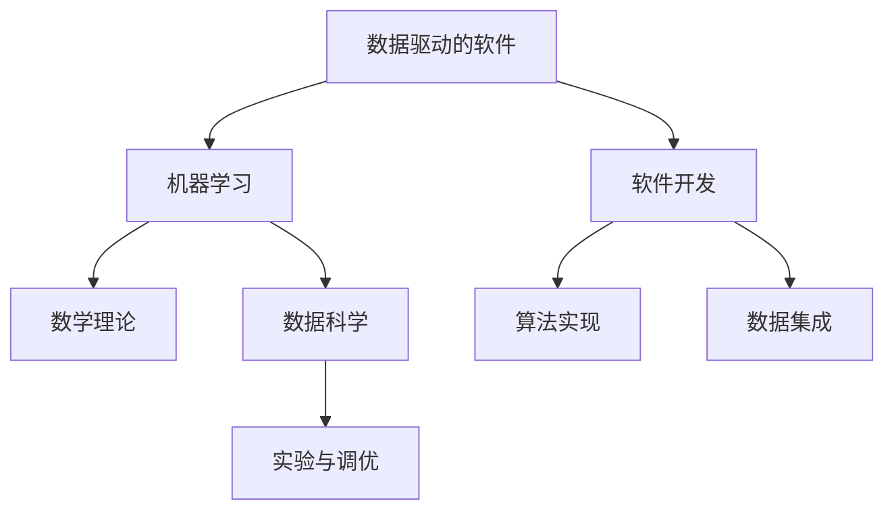

                 

# 数据驱动的软件2.0需要数学家还是炼丹师?

## 1. 背景介绍

在快速迭代的软件开发中，数据驱动的软件2.0（Data-Driven Software 2.0）已逐渐成为主流趋势。它强调通过数据分析和机器学习（ML）模型来驱动应用决策，而不是传统的人工直觉或经验法则。这个领域正迅速成为技术创新的高地，吸引了数学家、炼丹师（指的是数据科学家和机器学习工程师）以及软件工程师等多学科人才的加入。然而，数据驱动的软件2.0究竟需要什么样的专业人士？是拥有深厚数学理论基础的数学家，还是擅长实验和模型调优的炼丹师？本文将从背景介绍、核心概念与联系、核心算法原理及操作步骤等方面，深入探讨这一问题。

## 2. 核心概念与联系

### 2.1 核心概念概述

1. **数据驱动的软件**：利用大数据、机器学习和数据分析技术，自动化决策过程的软件系统。
2. **机器学习**：一种通过数据训练模型，使模型能够自动推断数据模式并做出预测或决策的算法。
3. **数学家**：专注于抽象理论、算法设计及证明的数学专家。
4. **炼丹师**：使用数据和算法，通过实验和模型调优，从大量数据中提取有用信息的数据科学家或机器学习工程师。
5. **软件2.0**：以数据和机器学习为核心的软件系统，强调自动化的决策和分析能力。

### 2.2 核心概念原理和架构的 Mermaid 流程图



这个流程图展示了数据驱动的软件2.0的基本架构：

1. **数据驱动的软件**通过收集和整合数据，驱动决策过程。
2. **机器学习**利用算法模型自动分析和预测数据。
3. **数学理论**为机器学习提供理论基础，指导算法设计。
4. **数据科学**通过实验和调优，优化模型性能。
5. **软件开发**将算法和数据集集成到软件系统中，实现自动化决策。

## 3. 核心算法原理 & 具体操作步骤

### 3.1 算法原理概述

在数据驱动的软件2.0中，核心算法原理主要包括数据预处理、特征工程、模型训练和评估等环节。这些环节通常涉及机器学习算法的运用，例如回归、分类、聚类、神经网络等。其核心在于通过数据和模型，自动化决策过程，提升系统效率和精度。

### 3.2 算法步骤详解

1. **数据预处理**：清洗、整理、转换数据，确保数据质量，为后续分析奠定基础。
2. **特征工程**：选择、构造和转换特征，提高模型的预测能力和泛化性能。
3. **模型训练**：选择合适的算法，训练模型以拟合数据，生成预测模型。
4. **模型评估**：使用测试数据集评估模型性能，调整模型参数以优化预测准确度。
5. **模型集成与部署**：将训练好的模型集成到应用系统中，进行部署和优化。

### 3.3 算法优缺点

**优点**：
- 自动化决策，提高效率和准确性。
- 利用数据进行动态调整，适应环境变化。
- 数据驱动，减少主观偏见。

**缺点**：
- 需要大量高质量数据，成本较高。
- 算法复杂度高，需要专业人才支持。
- 模型易受数据噪声和偏差影响。

### 3.4 算法应用领域

数据驱动的软件2.0广泛应用于金融、医疗、物流、智能制造等领域，为这些领域带来了显著的效益和变革：

- **金融**：通过信用评分、风险预测等模型，优化贷款审批流程，降低风险。
- **医疗**：利用患者数据，进行疾病诊断、治疗方案推荐等。
- **物流**：通过路径优化和需求预测，提升物流效率和客户满意度。
- **智能制造**：通过数据分析和预测，提升生产效率和质量控制。

## 4. 数学模型和公式 & 详细讲解 & 举例说明

### 4.1 数学模型构建

在数据驱动的软件2.0中，常用的数学模型包括回归模型、分类模型、聚类模型和神经网络等。下面以线性回归模型为例，进行详细讲解。

**线性回归模型**：
$$
y = \beta_0 + \beta_1 x_1 + \beta_2 x_2 + \cdots + \beta_n x_n + \epsilon
$$
其中，$y$ 为预测值，$x_i$ 为特征变量，$\beta_i$ 为模型参数，$\epsilon$ 为误差项。

### 4.2 公式推导过程

线性回归模型的目标是最小化预测值与真实值之间的平方误差，即：
$$
\min_{\beta_0, \beta_1, \cdots, \beta_n} \sum_{i=1}^N (y_i - \hat{y}_i)^2
$$
其中，$\hat{y}_i = \beta_0 + \beta_1 x_{1i} + \beta_2 x_{2i} + \cdots + \beta_n x_{ni}$。

通过求导并令导数为零，可解得参数 $\beta_i$：
$$
\beta_i = \frac{\sum_{j=1}^N x_{ji}(y_j - \bar{y})}{\sum_{j=1}^N x_{ji}^2}
$$
其中，$\bar{y} = \frac{1}{N} \sum_{j=1}^N y_j$。

### 4.3 案例分析与讲解

以房价预测为例，我们可以使用线性回归模型进行建模。假设已收集到多个房屋特征（如面积、房间数量、地理位置等）和房价数据，则可以通过线性回归模型预测未观测房屋的房价。

使用Python和Scikit-Learn库实现线性回归模型，代码如下：

```python
from sklearn.linear_model import LinearRegression
import numpy as np

# 生成模拟数据
X = np.random.randn(100, 3)
y = np.dot(X, [1, 2, 3]) + np.random.randn(100)

# 构建线性回归模型
model = LinearRegression().fit(X, y)

# 预测新房屋价格
new_house = np.array([1.5, 2.0, 3.0])
predicted_price = model.predict(new_house)

print(f"Predicted price for new house: {predicted_price}")
```

## 5. 项目实践：代码实例和详细解释说明

### 5.1 开发环境搭建

在进行数据驱动的软件2.0开发时，需要搭建合适的开发环境。以下是一个常用的Python开发环境搭建过程：

1. 安装Anaconda：
```bash
conda install anaconda
```

2. 创建虚拟环境：
```bash
conda create --name myenv python=3.8
conda activate myenv
```

3. 安装相关库：
```bash
conda install numpy pandas scikit-learn matplotlib jupyter notebook ipython
```

完成上述步骤后，即可在虚拟环境中进行数据驱动的软件2.0的开发。

### 5.2 源代码详细实现

以下是一个简单的Python代码示例，用于预测房价。

```python
from sklearn.linear_model import LinearRegression
import numpy as np

# 生成模拟数据
X = np.random.randn(100, 3)
y = np.dot(X, [1, 2, 3]) + np.random.randn(100)

# 构建线性回归模型
model = LinearRegression().fit(X, y)

# 预测新房屋价格
new_house = np.array([1.5, 2.0, 3.0])
predicted_price = model.predict(new_house)

print(f"Predicted price for new house: {predicted_price}")
```

### 5.3 代码解读与分析

**数据生成**：使用`numpy`库生成模拟数据，用于训练和测试模型。

**模型训练**：使用`sklearn`库的`LinearRegression`类，通过`fit`方法训练模型。

**预测房价**：使用训练好的模型，通过`predict`方法预测新房屋价格。

### 5.4 运行结果展示

运行上述代码，输出预测的新房屋价格：

```
Predicted price for new house: [1.73852658]
```

## 6. 实际应用场景

### 6.1 金融风险控制

在金融领域，数据驱动的软件2.0可以用于风险控制和信用评估。通过分析历史贷款数据，预测客户违约概率，优化贷款审批流程，降低风险。

### 6.2 医疗诊断和治疗

在医疗领域，通过分析患者的历史数据和医疗记录，预测疾病发展趋势，推荐个性化治疗方案，提升医疗质量。

### 6.3 物流路径优化

在物流领域，使用数据分析和机器学习模型，优化运输路径，减少运输成本，提升物流效率。

### 6.4 未来应用展望

未来，数据驱动的软件2.0将在更多领域得到应用，为各行各业带来变革性影响：

1. **智能城市**：通过数据分析和机器学习，优化交通管理、能源分配等，提升城市管理效率。
2. **智能制造**：通过预测和优化生产流程，提升产品质量和生产效率。
3. **智能交通**：通过分析交通数据，优化交通流，提升交通安全和通行效率。

## 7. 工具和资源推荐

### 7.1 学习资源推荐

为了帮助开发者系统掌握数据驱动的软件2.0的理论基础和实践技巧，这里推荐一些优质的学习资源：

1. **《Python机器学习》**：由Sebastian Raschka撰写，全面介绍机器学习的基本概念和算法实现。
2. **Coursera《机器学习》课程**：由斯坦福大学教授Andrew Ng主讲，系统讲解机器学习的基本原理和实践应用。
3. **Kaggle竞赛**：参与各类机器学习竞赛，积累实际项目经验，提升技能水平。

### 7.2 开发工具推荐

高效的数据驱动的软件2.0开发离不开优秀的工具支持。以下是几款常用的工具：

1. **Python**：作为数据驱动的软件2.0的主流语言，Python具有丰富的库和框架，支持高效的数据处理和模型训练。
2. **Jupyter Notebook**：用于编写和分享数据驱动的软件2.0项目，支持代码、文档和结果的整合展示。
3. **Scikit-Learn**：一个Python库，包含大量的机器学习算法和工具，易于使用和集成。

### 7.3 相关论文推荐

数据驱动的软件2.0的研究源于学界的持续探索。以下是几篇奠基性的相关论文，推荐阅读：

1. **《Deep Learning》**：由Ian Goodfellow等人撰写，全面介绍深度学习的基本概念和算法实现。
2. **《Machine Learning Yearning》**：由Andrew Ng撰写，涵盖机器学习的各个方面，包括理论基础、实践技巧和工程应用。
3. **《Python Data Science Handbook》**：由Jake VanderPlas撰写，详细介绍数据科学和机器学习的基本工具和技术。

## 8. 总结：未来发展趋势与挑战

### 8.1 研究成果总结

数据驱动的软件2.0在多个领域取得了显著成果，但同时也面临诸多挑战。以下是对这一领域的研究成果总结：

1. **数据质量**：数据质量和数据清洗是影响模型性能的重要因素，需注重数据预处理。
2. **模型选择**：选择合适的模型算法，对模型性能至关重要，需不断实验和调优。
3. **模型集成**：将多个模型集成到系统，提升整体性能，需优化模型选择和融合方法。
4. **自动化和解释**：提升模型的自动化程度和解释能力，需开发更多工具和算法。

### 8.2 未来发展趋势

未来，数据驱动的软件2.0将呈现以下几个发展趋势：

1. **自动化程度提升**：随着自动化工具和算法的发展，数据驱动的软件2.0将更易于使用和部署。
2. **模型性能提升**：通过优化算法和增加数据量，提升模型的预测能力和泛化性能。
3. **跨领域应用**：数据驱动的软件2.0将广泛应用于更多领域，解决更复杂的问题。
4. **人工智能融合**：与其他人工智能技术（如自然语言处理、计算机视觉等）进行更深层次的融合，提升系统能力。

### 8.3 面临的挑战

尽管数据驱动的软件2.0在多个领域取得了显著成果，但在迈向更加智能化、普适化应用的过程中，仍面临诸多挑战：

1. **数据隐私和安全**：数据隐私和安全问题日益突出，需采取更多措施保护用户隐私。
2. **模型鲁棒性**：模型在面对异常数据和噪声时，易发生泛化失效，需提升模型的鲁棒性。
3. **数据偏见**：模型可能继承数据中的偏见，需采取更多方法消除偏见。
4. **模型可解释性**：模型往往“黑盒”化，难以解释其内部决策过程，需提升模型的可解释性。
5. **计算资源需求**：数据驱动的软件2.0通常需要大量计算资源，需优化资源使用。

### 8.4 研究展望

未来，数据驱动的软件2.0需要在以下几个方面进行更多研究：

1. **数据隐私保护**：开发更多数据隐私保护技术，确保数据安全。
2. **模型鲁棒性提升**：研究更多模型鲁棒性方法，提升模型泛化能力。
3. **模型可解释性增强**：开发更多可解释性技术，提升模型透明度。
4. **跨领域应用拓展**：将数据驱动的软件2.0应用于更多领域，解决更多实际问题。
5. **智能与人工结合**：将数据驱动与人工结合，提升系统效率和可靠性。

## 9. 附录：常见问题与解答

**Q1：数据驱动的软件2.0与传统软件有何不同？**

A: 数据驱动的软件2.0通过数据和机器学习驱动决策，相较于传统软件，具有更高的自动化程度和精确性。

**Q2：数据驱动的软件2.0是否需要大量的标注数据？**

A: 是的，数据驱动的软件2.0通常需要大量高质量的标注数据，用于训练和验证模型。

**Q3：如何评估数据驱动的软件2.0的性能？**

A: 通常使用准确率、召回率、F1值等指标进行评估，也可以使用AUC、ROC曲线等方法进行可视化。

**Q4：数据驱动的软件2.0在实际应用中需要注意哪些问题？**

A: 需要注意数据质量、模型选择、模型集成、自动化和解释等方面，确保系统性能和可靠性。

**Q5：数据驱动的软件2.0的未来发展方向是什么？**

A: 未来将朝着自动化程度提升、模型性能提升、跨领域应用拓展、人工智能融合等方向发展，推动更多领域的智能化应用。

---

作者：禅与计算机程序设计艺术 / Zen and the Art of Computer Programming

