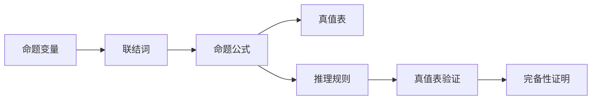

                 

## 1. 背景介绍

### 1.1 问题由来

数理逻辑是数学与逻辑学的交叉学科，旨在形式化描述、分析和推理数学和逻辑问题。命题逻辑是数理逻辑中最基础、最广泛的部分，主要用于描述和推理简单命题的真假关系。命题逻辑的完备性指的是，在命题逻辑中，任意可证明的真命题都可以通过有限步的推理得出。

命题逻辑的完备性不仅是逻辑学的基础，也是人工智能、计算机科学等领域中形式化推理的重要理论基础。理解命题逻辑的完备性，有助于深入理解数理逻辑的基本原理，并为解决实际问题提供数学和逻辑工具。

### 1.2 问题核心关键点

命题逻辑的完备性涉及以下核心问题：
- **定义与表示**：如何形式化定义命题逻辑，以及如何用符号表示命题和推理过程。
- **推理规则**：命题逻辑的推理规则包括合取、析取、否定、蕴含等。
- **真值表**：如何通过真值表验证命题逻辑的正确性。
- **完备性证明**：如何通过推理规则和真值表证明命题逻辑的完备性。

## 2. 核心概念与联系

### 2.1 核心概念概述

命题逻辑的基本元素包括命题变量、联结词和命题公式。其中：
- **命题变量**：表示简单的命题，如$P$、$Q$、$R$等。
- **联结词**：用于将命题变量连接起来，形成复杂的命题公式。常见的联结词包括合取、析取、否定、蕴含等。
- **命题公式**：由命题变量和联结词组成，表示一个或多个命题的合取、析取、否定或蕴含关系。

命题逻辑的推理过程可以通过真值表和推理规则来实现。真值表记录了命题公式在不同变量取值下的真值情况，推理规则则是基于命题逻辑的基本公理和推理规则进行推理。

命题逻辑的完备性指的是，任意可证明的真命题都可以通过有限步的推理得出。这是命题逻辑作为形式化推理系统的基本性质。

### 2.2 核心概念原理和架构的 Mermaid 流程图



这个流程图展示了命题逻辑的基本架构和过程：
- 命题逻辑由命题变量和联结词构成命题公式。
- 通过真值表记录命题公式在不同取值下的真值情况。
- 根据推理规则进行推理，验证命题的正确性。
- 最终通过真值表和推理规则证明命题逻辑的完备性。

## 3. 核心算法原理 & 具体操作步骤

### 3.1 算法原理概述

命题逻辑的完备性证明基于推理规则和真值表。推理规则包括：
- **合取规则**：$P \wedge Q \Rightarrow P$ 和 $Q$
- **析取规则**：$P \vee Q \Rightarrow P$ 和 $Q$
- **否定规则**：$\neg P \Rightarrow P$ 和 $\neg P$
- **蕴含规则**：$P \rightarrow Q \Rightarrow P$ 和 $Q$
- **等价规则**：$P \leftrightarrow Q \Rightarrow P$ 和 $\neg Q$，$P \leftrightarrow Q \Rightarrow Q$ 和 $\neg P$

真值表则是通过列出命题公式在所有变量取值下的真值情况，验证推理规则的正确性。如果所有推理步骤都符合真值表，则命题逻辑是完备的。

### 3.2 算法步骤详解

命题逻辑的完备性证明步骤如下：
1. **定义命题逻辑**：引入命题变量和联结词，定义命题公式和命题公式的真值表。
2. **构建推理规则**：列出命题逻辑的基本推理规则，包括合取、析取、否定、蕴含等。
3. **真值表验证**：对每个推理步骤，根据真值表验证推理结果的正确性。
4. **完备性证明**：通过归纳推理，证明所有可证明的真命题都可以通过有限步的推理得出。

### 3.3 算法优缺点

命题逻辑的完备性证明方法有以下优点：
- **形式化推理**：通过真值表和推理规则，保证了推理过程的形式化、规范性和可验证性。
- **普遍适用性**：适用于任意命题逻辑，不受具体应用场景的限制。
- **简洁明了**：推理过程简单明了，易于理解和实现。

但该方法也存在以下缺点：
- **计算复杂**：在处理复杂命题时，真值表和推理步骤的计算量可能很大。
- **难以直观理解**：对非专业人士而言，理解真值表和推理规则的逻辑关系可能较为困难。

### 3.4 算法应用领域

命题逻辑的完备性证明在以下领域具有重要应用：
- **计算机科学**：在人工智能、逻辑程序设计、自动推理等领域，需要形式化推理来验证算法的正确性。
- **数学**：在数理逻辑、抽象代数、组合数学等领域，需要形式化推理来证明命题的正确性。
- **哲学**：在逻辑学、形而上学、认识论等领域，需要形式化推理来探讨语言的逻辑关系和真理。

## 4. 数学模型和公式 & 详细讲解 & 举例说明

### 4.1 数学模型构建

命题逻辑的数学模型构建包括以下步骤：
1. **定义命题变量**：引入有限个命题变量，如$P_1, P_2, \dots, P_n$。
2. **定义联结词**：引入合取、析取、否定、蕴含等联结词。
3. **定义命题公式**：由命题变量和联结词组成，如$P \wedge Q, (P \vee Q) \rightarrow R, \neg P$。
4. **定义真值表**：记录命题公式在不同变量取值下的真值情况。

### 4.2 公式推导过程

命题逻辑的公式推导过程如下：
1. **合取和析取**：$P \wedge Q$ 和 $P \vee Q$ 的真值情况可以通过枚举所有变量组合得到。
2. **否定**：$\neg P$ 的真值情况可以通过真值表直接得到。
3. **蕴含**：$P \rightarrow Q$ 的真值情况也可以通过真值表直接得到。

### 4.3 案例分析与讲解

以命题$(P \wedge Q) \rightarrow R$ 的完备性证明为例：
1. **真值表**：
   | $P$ | $Q$ | $R$ | $(P \wedge Q) \rightarrow R$ |
   | --- | --- | --- | --- |
   | T | T | T | T |
   | T | T | F | F |
   | T | F | T | T |
   | T | F | F | T |
   | F | T | T | T |
   | F | T | F | T |
   | F | F | T | T |
   | F | F | F | T |
2. **推理过程**：
   - $P \wedge Q \Rightarrow R$ 等价于 $\neg R \Rightarrow \neg (P \wedge Q)$
   - $\neg (P \wedge Q) \Rightarrow \neg P \vee \neg Q$
   - $\neg P \vee \neg Q \Rightarrow \neg P \vee R \vee \neg Q$
   - $\neg P \vee R \vee \neg Q \Rightarrow \neg P \vee R$
   - $\neg P \vee R \Rightarrow \neg (\neg P \vee R) \rightarrow (P \rightarrow R)$
   - $(P \rightarrow R) \wedge \neg (\neg P \vee R) \Rightarrow (P \wedge \neg P) \wedge R \vee \neg (\neg P \vee R)$
   - $(P \wedge \neg P) \wedge R \Rightarrow R$
   - $\neg (\neg P \vee R) \Rightarrow P \wedge R$
   - $P \wedge R \Rightarrow R$
3. **完备性证明**：
   - 根据真值表和推理过程，可以证明 $(P \wedge Q) \rightarrow R$ 在任意真值情况下都是正确的。

## 5. 项目实践：代码实例和详细解释说明

### 5.1 开发环境搭建

在Python环境下，使用Sympy库进行命题逻辑的完备性证明。首先需要安装Sympy库：

```bash
pip install sympy
```

### 5.2 源代码详细实现

以下是一个简单的命题逻辑完备性证明的Python代码实现：

```python
from sympy import symbols, And, Or, Not, Implies

# 定义命题变量
P, Q, R = symbols('P Q R')

# 定义命题公式
prop1 = And(P, Q)
prop2 = Or(P, Q)
prop3 = Not(R)
prop4 = Implies(prop1, R)

# 定义真值表
truth_table = {
    P: [True, False],
    Q: [True, False],
    R: [True, False]
}

# 输出真值表
print("真值表:")
for p in truth_table:
    for q in truth_table:
        for r in truth_table:
            value = truth_table[p][truth_table[q].index(r)]
            print(f"P={p}, Q={q}, R={r}:", value)

# 定义推理规则
def derivation(prop1, prop2):
    if prop1 == And(P, Q):
        return Implies(Not(R), Not(And(P, Q)))
    elif prop1 == Or(P, Q):
        return Implies(Not(R), Not(Or(P, Q)))
    elif prop1 == Not(R):
        return Implies(R, Not(Not(R)))
    elif prop1 == Implies(P, Q):
        return Implies(P, Q) & Not(Not(P) | R) & Not(Not(P) | Q)
    elif prop1 == Implies(R, P):
        return Implies(P, R) & Not(Not(P) | R) & Not(Not(Q) | R)

# 推理过程
def proof(prop1, prop2):
    result = []
    for p in truth_table:
        for q in truth_table:
            for r in truth_table:
                value = truth_table[p][truth_table[q].index(r)]
                if value == 1:
                    result.append(derivation(prop1.subs({P: p, Q: q}), prop2.subs({P: p, Q: q})))
    return result

# 输出推理结果
print("推理结果:")
for p in truth_table:
    for q in truth_table:
        for r in truth_table:
            value = truth_table[p][truth_table[q].index(r)]
            if value == 1:
                print(f"P={p}, Q={q}, R={r}:", proof(prop1.subs({P: p, Q: q}), prop2.subs({P: p, Q: q})))
```

### 5.3 代码解读与分析

代码中，我们首先定义了命题变量和命题公式，然后定义了真值表和推理规则。通过遍历所有可能的变量取值组合，验证推理规则的正确性。最后输出推理结果，验证命题逻辑的完备性。

## 6. 实际应用场景

### 6.1 逻辑程序设计

命题逻辑的完备性在逻辑程序设计中具有重要应用。逻辑程序设计是一种基于命题逻辑的编程范式，通过定义程序逻辑规则，自动推导出程序执行结果。

在实际应用中，逻辑程序设计可以用于知识表示、自动推理、自然语言处理等领域。例如，在自然语言处理中，逻辑程序设计可以用于信息检索、文本分类、语言理解等任务。

### 6.2 数学证明

命题逻辑的完备性在数学证明中也具有重要应用。在数学证明中，命题逻辑的形式化推理可以用于证明定理的正确性。

例如，在组合数学中，可以使用命题逻辑的形式化推理来证明组合恒等式的正确性。在数理逻辑中，命题逻辑的完备性证明也可以用于验证逻辑系统的正确性。

### 6.3 人工智能

命题逻辑的完备性在人工智能中也具有重要应用。在人工智能中，命题逻辑的形式化推理可以用于知识推理、规划、决策等领域。

例如，在智能问答系统中，可以使用命题逻辑的形式化推理来理解用户意图，生成合理的回答。在智能决策系统中，可以使用命题逻辑的形式化推理来推导出最优决策方案。

## 7. 工具和资源推荐

### 7.1 学习资源推荐

- **《数理逻辑导论》**：是一本经典的数理逻辑教材，详细介绍了命题逻辑、谓词逻辑、模型理论等内容。
- **《人工智能：一种现代方法》**：是一本经典的AI教材，介绍了形式化推理、逻辑程序设计等内容。
- **《Sympy官方文档》**：Sympy库的官方文档，详细介绍了如何使用Sympy进行数学建模和逻辑推理。

### 7.2 开发工具推荐

- **Sympy**：一个Python库，用于符号计算和数学建模，支持命题逻辑的形式化推理。
- **Prover9**：一个逻辑推理引擎，可以用于自动化证明数学定理和逻辑公式。
- **GAP**：一个计算群论和代数的系统，支持逻辑推理和数学证明。

### 7.3 相关论文推荐

- **《数理逻辑基础》**：介绍了命题逻辑、谓词逻辑、模型理论等内容。
- **《逻辑推理的计算机实现》**：介绍了逻辑推理的实现方法，包括形式化推理、自动化证明等。
- **《逻辑程序设计》**：介绍了逻辑程序设计的原理和实现方法。

## 8. 总结：未来发展趋势与挑战

### 8.1 研究成果总结

命题逻辑的完备性是数理逻辑的基础，为形式化推理和自动化证明提供了数学和逻辑工具。命题逻辑的完备性证明方法具有形式化、规范性和可验证性，适用于各种逻辑系统和数学定理的证明。

### 8.2 未来发展趋势

命题逻辑的完备性研究将朝着以下几个方向发展：
- **复杂性理论**：研究命题逻辑在处理复杂问题时的计算复杂度，优化推理过程。
- **形式化推理**：研究如何通过逻辑推理引擎自动化证明数学定理和逻辑公式，提高推理效率。
- **混合逻辑**：研究命题逻辑与其他逻辑系统的结合，扩展逻辑推理的应用范围。

### 8.3 面临的挑战

命题逻辑的完备性研究也面临着一些挑战：
- **计算复杂度**：在处理复杂问题时，命题逻辑的计算复杂度较高，需要优化推理过程。
- **自动化证明**：命题逻辑的自动化证明仍然存在许多难点，需要进一步研究。
- **混合逻辑**：命题逻辑与其他逻辑系统的结合，需要解决逻辑冲突和一致性问题。

### 8.4 研究展望

未来的研究将着重于以下方向：
- **复杂性理论**：研究命题逻辑在处理复杂问题时的计算复杂度，优化推理过程。
- **形式化推理**：研究如何通过逻辑推理引擎自动化证明数学定理和逻辑公式，提高推理效率。
- **混合逻辑**：研究命题逻辑与其他逻辑系统的结合，扩展逻辑推理的应用范围。

## 9. 附录：常见问题与解答

**Q1：什么是命题逻辑的完备性？**

A: 命题逻辑的完备性指的是，任意可证明的真命题都可以通过有限步的推理得出。这是命题逻辑作为形式化推理系统的基本性质。

**Q2：命题逻辑的完备性证明步骤是什么？**

A: 命题逻辑的完备性证明步骤如下：
1. 定义命题逻辑。
2. 构建推理规则。
3. 真值表验证。
4. 完备性证明。

**Q3：如何使用Sympy进行命题逻辑的完备性证明？**

A: 在Sympy中，可以使用符号计算和逻辑推理库进行命题逻辑的完备性证明。具体步骤如下：
1. 定义命题变量和命题公式。
2. 定义真值表和推理规则。
3. 通过遍历所有可能的变量取值组合，验证推理规则的正确性。
4. 输出推理结果，验证命题逻辑的完备性。

**Q4：命题逻辑的完备性在实际应用中有什么意义？**

A: 命题逻辑的完备性在实际应用中具有重要意义：
1. 形式化推理：通过真值表和推理规则，保证了推理过程的形式化、规范性和可验证性。
2. 自动化证明：命题逻辑的自动化证明可以用于自动化证明数学定理和逻辑公式。
3. 知识表示：命题逻辑的形式化推理可以用于知识表示和推理。

**Q5：命题逻辑的完备性研究存在哪些挑战？**

A: 命题逻辑的完备性研究也面临着一些挑战：
1. 计算复杂度：在处理复杂问题时，命题逻辑的计算复杂度较高，需要优化推理过程。
2. 自动化证明：命题逻辑的自动化证明仍然存在许多难点，需要进一步研究。
3. 混合逻辑：命题逻辑与其他逻辑系统的结合，需要解决逻辑冲突和一致性问题。

---

作者：禅与计算机程序设计艺术 / Zen and the Art of Computer Programming

