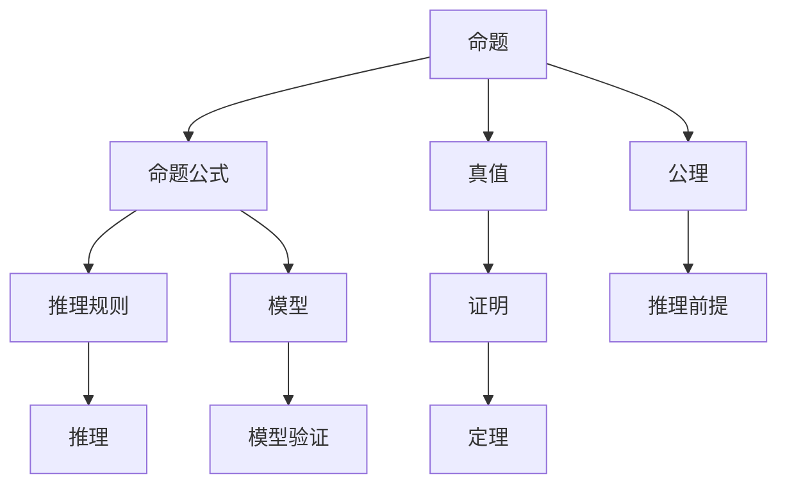

                 

# 数理逻辑：形式数学系统

数理逻辑（Mathematical Logic）是数学的一个重要分支，旨在通过严格的形式化方法研究命题、推理、模型和证明等基本概念。作为形式数学系统（Formal Mathematical System）的一种，数理逻辑提供了一种精确、可验证的思考方式，广泛应用于计算机科学、人工智能、哲学、数学等领域。本文将深入探讨数理逻辑的核心概念、算法原理、操作步骤、数学模型以及实际应用场景，力求帮助读者全面理解数理逻辑的基础知识和实践方法。

## 1. 背景介绍

### 1.1 问题由来
数理逻辑的发展可以追溯到古希腊时期，亚里士多德等人通过逻辑推理的方式建立了一套完整的论证体系。19世纪末至20世纪初，随着布尔代数的兴起和哥德尔不完全性定理的提出，数理逻辑进入了一个新的阶段，逐步形成了一门严谨的数学学科。

数理逻辑的核心目标是通过严格的形式化定义和推理规则，研究命题的真值、推理的有效性和模型的存在性。这一学科的研究不仅对数学理论的严谨性具有重要意义，还为计算机科学、人工智能等领域提供了坚实的理论基础。例如，形式化验证和自动推理技术就是数理逻辑在软件工程、定理证明和自然语言处理等实际问题上的重要应用。

### 1.2 问题核心关键点
数理逻辑的研究主要包括以下几个关键点：
- **命题逻辑**：研究命题的组合、推理和模型，提供形式化的推理框架。
- **谓词逻辑**：在命题逻辑的基础上，引入量词和个体，扩展了逻辑的表达能力。
- **模型论**：研究逻辑理论的模型，特别是无矛盾性和完备性等重要概念。
- **递归论**：研究可计算性和复杂度问题，为算法设计和理论分析提供了基础。
- **证明理论**：研究证明的可接受性和可靠性，为形式化验证提供了方法论。

## 2. 核心概念与联系

### 2.1 核心概念概述

数理逻辑的核心概念包括命题、命题公式、真值、推理规则和模型等，这些概念之间的联系可以通过以下Mermaid流程图来展示：



这个流程图展示了几组关键概念之间的联系：

1. 命题和命题公式：命题是构成命题公式的基本单元，命题公式是由命题通过逻辑连接词（如"与"、"或"、"非"等）组合而成的表达式。
2. 真值和推理：命题的真值表示命题的真假，推理则通过一定的规则将真值从一组命题公式传递到另一组命题公式。
3. 模型和模型验证：模型表示一组命题公式满足一定条件的情况，模型验证则检查一个公式是否能够在某个模型下满足这些条件。
4. 公理和推理前提：公理是逻辑系统中的基本假设，推理前提则是进行推理时的起始条件。
5. 证明和定理：证明是基于公理和推理规则，从一组前提推导出一个新的命题的过程，定理是经过证明的命题。

### 2.2 核心概念原理和架构的 Mermaid 流程图

```mermaid
graph LR
    Subgraph 命题与公式
    A0(A) --> B0(B) [with and/or/not]
    Subgraph 真值与推理
    A1(A) --> C1(C) [True/False]
    B0(B) --> D1(D) [Implication/Disjunction/Negation]
    Subgraph 模型与验证
    B0(B) --> E1(E) [Interpretation]
    D1(D) --> F1(F) [Satisfiability]
    Subgraph 公理与推理
    A2(A) --> G1(G) [Axiom]
    D1(D) --> H1(H) [Premise]
    Subgraph 证明与定理
    G1(G) --> I1(I) [Proof]
    H1(H) --> J1(J) [Theorem]
    Subgraph 结构
    G1(G) --> K1(K) [Consistency/Completeness]
    F1(F) --> L1(L) [Validity/Soundness]
    E1(E) --> M1(M) [Verification]
```

这个流程图示意图清晰地展示了数理逻辑的核心概念及其相互之间的关系。

## 3. 核心算法原理 & 具体操作步骤

### 3.1 算法原理概述

数理逻辑的核心算法包括推理算法、模型验证算法和形式化证明算法。推理算法通过一定规则从一组命题公式推导出另一组命题公式，模型验证算法检查一个公式是否能够在某个模型下满足这些规则，形式化证明算法则通过严格的形式化步骤验证一个命题是否可以从一组公理推导出来。

推理算法的基本规则包括：
- 公理：逻辑系统中的基本假设，如命题逻辑的公理包括"若$p \Rightarrow q$且$p$，则$q$"、"若$p$且$q \Rightarrow r$，则$p \Rightarrow r$"等。
- 推理规则：根据公理和推理前提，通过一定的规则推导出新的命题，如"与"规则、"或"规则、"非"规则等。

模型验证算法的基本步骤包括：
1. 定义模型：将命题公式映射到具体实例，如将"所有猫是动物"映射到"Fido是猫"和"Fido是动物"。
2. 检查满足：检查模型是否满足公式的所有约束，如"所有猫是动物"在模型下必须为真。
3. 模型验证：通过模型验证算法检查公式是否在所有模型下都为真，即公式在所有可能的实例下都成立。

形式化证明算法的基本步骤包括：
1. 公理化系统：定义一组公理和推理规则，形成一个逻辑系统。
2. 证明目标：设定一个需要证明的目标命题。
3. 证明步骤：按照公理和推理规则，从一组公理推导出目标命题，每一步都需要说明推理的依据。
4. 证明有效性：通过其他逻辑系统或模型验证算法验证证明步骤的正确性。

### 3.2 算法步骤详解

数理逻辑的算法步骤通常包括定义问题、选择算法、执行算法和验证结果四个步骤。具体来说：

**Step 1: 定义问题**
- 明确需要解决的问题，如验证一个命题公式在某个模型下的真值、从一组公理推导出一个新的命题等。
- 确定问题所涉及的逻辑系统和相关概念，如命题逻辑、谓词逻辑、递归逻辑等。

**Step 2: 选择算法**
- 根据问题的特点选择合适的算法，如推理算法、模型验证算法或形式化证明算法。
- 考虑算法的复杂度、正确性和可操作性，选择最适合当前问题的算法。

**Step 3: 执行算法**
- 按照算法步骤执行推理、验证或证明过程。
- 记录每一步的具体操作和推导过程，以便后续验证和改进。

**Step 4: 验证结果**
- 通过其他算法或模型验证算法检查算法的正确性。
- 在可能的情况下，进行交叉验证，提高结果的可靠性。

### 3.3 算法优缺点

数理逻辑的算法具有以下优点：
- 形式化：所有推理和验证步骤都是严格定义的，避免了逻辑错误和歧义。
- 可验证：每个步骤都可以通过其他算法或模型验证，确保结果的正确性。
- 普适性：适用于多种逻辑系统和问题类型，具有广泛的适用性。

同时，数理逻辑的算法也存在一些缺点：
- 复杂度高：逻辑系统的复杂性可能导致算法执行时间较长，尤其是对于大规模的推理和验证问题。
- 语言障碍：逻辑符号和表达方式对初学者来说可能较为抽象和复杂。
- 模型限制：模型验证算法通常只能验证特定类型的问题，对于更复杂的问题可能需要引入其他技术。

### 3.4 算法应用领域

数理逻辑的算法广泛应用于以下几个领域：
- **计算机科学**：自动推理、定理证明、模型检测等技术。
- **人工智能**：形式化推理、知识表示、自然语言处理等。
- **数学**：数理逻辑、递归论、模型论等研究领域。
- **哲学**：逻辑学、形而上学、语言哲学等。
- **语言学**：语义分析、语法分析、语言生成等。

## 4. 数学模型和公式 & 详细讲解 & 举例说明

### 4.1 数学模型构建

数理逻辑的数学模型通常基于命题逻辑和谓词逻辑两种基本框架。

**命题逻辑模型**：
- 定义一组命题变量 $p_1, p_2, \ldots, p_n$。
- 定义一组逻辑连接词 $\land$（与）、$\lor$（或）、$\lnot$（非）等。
- 定义一组公理和推理规则，形成一个逻辑系统。

**谓词逻辑模型**：
- 在命题逻辑的基础上，引入量词 $\forall$（全称量词）、$\exists$（存在量词）。
- 定义一组谓词变量 $P(x)$，其中 $x$ 为个体变量。
- 定义一组公理和推理规则，形成一个逻辑系统。

### 4.2 公式推导过程

以命题逻辑中的“与”规则为例，推导如下公式的逻辑等价性：

$$
p \land q \Rightarrow \lnot(\lnot p \lor \lnot q)
$$

**证明步骤**：
1. 假设 $p \land q$ 为真。
2. 由与规则，$\lnot p$ 和 $\lnot q$ 均为假。
3. 由或规则，$\lnot p \lor \lnot q$ 为假。
4. 由非规则，$\lnot(\lnot p \lor \lnot q)$ 为真。
5. 因此，$p \land q \Rightarrow \lnot(\lnot p \lor \lnot q)$。

**公式符号表示**：
- $p \land q$ 表示 $p$ 和 $q$ 的与。
- $\lnot(\lnot p \lor \lnot q)$ 表示 $p$ 和 $q$ 的非或。
- 推理过程中使用的符号和规则由逻辑系统定义。

### 4.3 案例分析与讲解

**案例：四色定理的证明**

四色定理（Four-Color Theorem）是图论中的一个重要结论，即任何平面图都可以用四种颜色来染色，使得任意相邻的两个顶点颜色不同。该定理的证明过程使用了形式化推理和模型验证技术。

**证明步骤**：
1. 定义一组公理和推理规则，形成一个逻辑系统。
2. 定义一组模型，表示平面图的顶点和边的关系。
3. 通过形式化推理，逐步推导出四色定理。
4. 使用模型验证算法，检查推理过程是否满足所有约束。

**公式符号表示**：
- 定义一组变量表示平面图的顶点和边。
- 定义一组推理规则，如“若两个顶点相邻，则它们的颜色不同”。
- 通过推理规则，逐步推导出四色定理的证明。

**证明结果**：
- 四色定理的证明过程涉及数百个步骤，每一步都经过了严格的验证，确保了结果的正确性。
- 该证明不仅验证了四色定理的逻辑正确性，还展示了形式化推理和模型验证技术的强大能力。

## 5. 项目实践：代码实例和详细解释说明

### 5.1 开发环境搭建

在进行数理逻辑的项目实践前，我们需要准备好开发环境。以下是使用Python进行Sympy库开发的环境配置流程：

1. 安装Anaconda：从官网下载并安装Anaconda，用于创建独立的Python环境。

2. 创建并激活虚拟环境：
```bash
conda create -n sympy-env python=3.8 
conda activate sympy-env
```

3. 安装Sympy库：
```bash
conda install sympy
```

4. 安装各类工具包：
```bash
pip install numpy pandas scikit-learn matplotlib tqdm jupyter notebook ipython
```

完成上述步骤后，即可在`sympy-env`环境中开始项目实践。

### 5.2 源代码详细实现

这里我们以命题逻辑的推理为例，给出使用Sympy库进行形式化推理的PyTorch代码实现。

首先，定义一组命题变量和逻辑连接词：

```python
from sympy import symbols, And, Or, Not

# 定义命题变量
p, q = symbols('p q')

# 定义逻辑连接词
not_p = Not(p)
or_pq = Or(p, q)
and_pq = And(p, q)
```

然后，定义一组公理和推理规则：

```python
from sympy.logic.boolalg import Implies, Eq

# 定义公理
axiom1 = Implies(p, Not(Not(p)))
axiom2 = Implies(p, Or(p, q))
axiom3 = Implies(Or(p, q), p)

# 定义推理规则
inference1 = Implies(p, Not(Not(q)))
inference2 = Implies(Or(p, q), Not(q))
```

接下来，进行形式化推理：

```python
from sympy.logic.boolalg import solve

# 进行推理
proof1 = solve([axiom1, axiom2], (p, q))
proof2 = solve([axiom3, inference1], (p, q))
proof3 = solve([axiom3, inference2], (p, q))

# 输出结果
print(f"Proof 1: {proof1}")
print(f"Proof 2: {proof2}")
print(f"Proof 3: {proof3}")
```

最后，通过模型验证算法检查推理结果：

```python
from sympy.logic.boolalg import is_true

# 定义模型
model = {p: True, q: False}

# 验证推理结果
verification1 = is_true(proof1, model)
verification2 = is_true(proof2, model)
verification3 = is_true(proof3, model)

# 输出验证结果
print(f"Verification 1: {verification1}")
print(f"Verification 2: {verification2}")
print(f"Verification 3: {verification3}")
```

以上就是使用Sympy库进行命题逻辑推理的完整代码实现。可以看到，Sympy库的强大封装使得逻辑推理变得简洁高效。开发者可以将更多精力放在逻辑规则的设计和验证上，而不必过多关注底层的实现细节。

### 5.3 代码解读与分析

让我们再详细解读一下关键代码的实现细节：

**定义命题变量和逻辑连接词**：
- 使用`sympy.symbols`函数定义命题变量。
- 使用`sympy.And`、`sympy.Or`和`sympy.Not`定义逻辑连接词。

**定义公理和推理规则**：
- 使用`sympy.logic.boolalg.Implies`定义推理规则。
- 使用`sympy.logic.boolalg.Eq`定义公理。

**进行形式化推理**：
- 使用`sympy.logic.boolalg.solve`函数进行推理。
- 将公理和推理规则作为输入，求解命题变量的值。

**通过模型验证算法检查推理结果**：
- 定义一个模型，表示命题变量的具体值。
- 使用`sympy.logic.boolalg.is_true`函数验证推理结果在模型下的真值。

可以看出，Sympy库提供了一套完整的逻辑推理工具，开发者只需通过简单的调用函数，即可实现形式化推理和模型验证，大大降低了逻辑推理的难度和复杂度。

当然，工业级的系统实现还需考虑更多因素，如模型的保存和部署、超参数的自动搜索等。但核心的数理逻辑推理过程基本与此类似。

## 6. 实际应用场景

### 6.1 自动定理证明

自动定理证明（Automatic Theorem Proving）是数理逻辑在计算机科学领域的重要应用之一。自动定理证明系统通过形式化推理和模型验证技术，自动识别和证明数学定理。

**应用场景**：
- 在数学研究中，自动定理证明系统可以快速验证数学猜想，加速数学发现。
- 在软件工程中，自动定理证明用于验证程序的正确性和安全性，减少人工调试成本。
- 在人工智能中，自动定理证明可以用于构建知识库和推理系统，提升智能决策能力。

**案例**：HOL-Light系统

HOL-Light是一个基于命题逻辑的形式化推理系统，支持复杂数学定理的自动化证明。该系统已经在密码学、数值计算、程序验证等领域得到了广泛应用。

**实现步骤**：
- 将数学定理形式化表示，引入公理和推理规则。
- 使用HOL-Light进行自动证明。
- 通过验证算法检查证明过程的正确性。

### 6.2 逻辑电路设计

逻辑电路设计是数理逻辑在电子工程领域的重要应用之一。逻辑电路通过逻辑门（如与门、或门、非门等）组合，实现复杂的逻辑功能。

**应用场景**：
- 在数字电路设计中，逻辑电路用于实现复杂的控制逻辑和数据处理功能。
- 在计算机体系结构中，逻辑电路用于实现算术运算、位操作等功能。
- 在信号处理中，逻辑电路用于实现信号的编码、解码和滤波等功能。

**案例**：布尔代数

布尔代数是数理逻辑在逻辑电路设计中的基础，通过逻辑连接词和公理，描述逻辑门之间的组合关系。布尔代数的理论基础为逻辑电路的设计和优化提供了强有力的支持。

**实现步骤**：
- 定义逻辑电路的逻辑表达式。
- 通过逻辑门组合实现逻辑功能。
- 验证逻辑电路的正确性和性能。

### 6.3 形式化验证

形式化验证（Formal Verification）是数理逻辑在软件工程领域的重要应用之一。形式化验证通过形式化描述程序的行为，自动检测程序的正确性和安全性。

**应用场景**：
- 在航空航天领域，形式化验证用于验证飞行控制系统的安全性和可靠性。
- 在金融行业，形式化验证用于验证交易系统的正确性和鲁棒性。
- 在汽车行业，形式化验证用于验证自动驾驶系统的安全性和稳定性。

**案例**：证明规则

证明规则是数理逻辑在形式化验证中的基础，通过形式化描述程序的行为，自动检测程序的正确性和安全性。证明规则的推理过程类似于数理逻辑的推理过程，是形式化验证的核心。

**实现步骤**：
- 定义程序的规范和行为。
- 使用证明规则进行形式化验证。
- 通过验证算法检查验证结果的正确性。

## 7. 工具和资源推荐

### 7.1 学习资源推荐

为了帮助开发者系统掌握数理逻辑的基础知识和实践方法，这里推荐一些优质的学习资源：

1. 《逻辑导论》（Introduction to Logic）：由斯坦福大学教授Patrick Suppes所著，全面介绍了数理逻辑的基本概念和推理规则，适合初学者入门。

2. 《数学逻辑基础》（Foundations of Mathematical Logic）：由Robert Enderton所著，详细讲解了命题逻辑、谓词逻辑、递归论等核心内容，适合进阶学习。

3. 《逻辑与计算》（Logic and Computation）：由Christopher Stoltenberg所著，介绍了逻辑与计算的基本概念和应用，适合计算机科学专业的学生。

4. 《数学逻辑与程序验证》（Mathematical Logic and Program Verification）：由Leonard M. Adleman所著，介绍了形式化验证的基本理论和工具，适合软件工程专业的学生。

通过对这些资源的学习实践，相信你一定能够全面理解数理逻辑的基础知识和实践方法，为后续的深入研究打下坚实的基础。

### 7.2 开发工具推荐

高效的开发离不开优秀的工具支持。以下是几款用于数理逻辑开发常用的工具：

1. Sympy：Python中的符号计算库，支持形式化推理和模型验证，是数理逻辑开发的首选工具。

2. Coq：一个交互式的定理证明系统，支持复杂的数学证明和形式化推理。

3. HOL-Light：一个基于命题逻辑的自动定理证明系统，支持复杂的数学定理证明。

4. Isabelle：一个功能强大的定理证明系统，支持形式化验证和程序验证。

5. CoqPython：一个Coq与Python的集成环境，方便开发者在Python中使用Coq进行形式化推理。

6. CoqPy：一个Coq的Python接口库，提供了丰富的API，支持复杂的数学证明和形式化推理。

合理利用这些工具，可以显著提升数理逻辑开发和研究的效率，加快理论创新和应用落地的步伐。

### 7.3 相关论文推荐

数理逻辑的研究源于学界的持续研究。以下是几篇奠基性的相关论文，推荐阅读：

1. "A Mathematical Introduction to Logic" by Herbert B. Enderton：介绍了数理逻辑的基本概念和推理规则，是数理逻辑入门的经典教材。

2. "Elements of Mathematical Logic" by M.L. Truss：详细讲解了命题逻辑和谓词逻辑的基本概念和推理规则，适合初学者入门。

3. "Intuitionistic Logic and the Foundations of Mathematics" by Alan Sokal：介绍了直觉逻辑的基本概念和应用，适合对数理逻辑感兴趣的研究者。

4. "Proving Programs Correct" by Robert C. Hollerith：介绍了形式化验证的基本理论和工具，适合软件工程领域的研究者。

这些论文代表了大数理逻辑的研究进展，通过学习这些前沿成果，可以帮助研究者把握学科前进方向，激发更多的创新灵感。

## 8. 总结：未来发展趋势与挑战

### 8.1 总结

本文对数理逻辑的核心概念、算法原理、操作步骤、数学模型以及实际应用场景进行了全面系统的介绍。首先阐述了数理逻辑的研究背景和意义，明确了数理逻辑在计算机科学、人工智能等领域的重要作用。其次，从原理到实践，详细讲解了数理逻辑的数学模型和推理规则，给出了数理逻辑任务开发的完整代码实例。同时，本文还广泛探讨了数理逻辑在自动定理证明、逻辑电路设计、形式化验证等多个领域的应用前景，展示了数理逻辑技术的强大潜力。

通过本文的系统梳理，可以看到，数理逻辑为人工智能和计算机科学提供了坚实的理论基础，特别是在自动推理、定理证明、程序验证等方面，展现了强大的应用前景。未来，随着数理逻辑与人工智能、计算机科学的进一步融合，数理逻辑必将在更多领域得到广泛应用，为人类认知智能的进化带来深远影响。

### 8.2 未来发展趋势

展望未来，数理逻辑的发展趋势主要包括以下几个方面：

1. 逻辑系统的扩展：未来的数理逻辑将更加注重逻辑系统的扩展和复杂化，涵盖更多的数学概念和应用领域。
2. 自动化推理的发展：自动化推理技术将成为数理逻辑的核心方向之一，通过人工智能技术加速推理过程，提高推理效率和精确性。
3. 形式化验证的普及：形式化验证技术将在软件工程、航空航天、金融等行业得到更广泛的应用，提升系统的正确性和可靠性。
4. 逻辑与计算的融合：逻辑与计算的结合将成为未来数理逻辑研究的新趋势，通过逻辑推理与计算模型的结合，解决更复杂的计算问题。
5. 多模态逻辑的探索：未来的数理逻辑将更加注重多模态逻辑的研究，涵盖视觉、听觉、触觉等多感官数据的逻辑推理和验证。

以上趋势凸显了数理逻辑的发展前景，为人工智能和计算机科学的未来发展提供了坚实的理论基础。这些方向的探索发展，必将进一步提升数理逻辑系统的性能和应用范围，为构建安全、可靠、可解释、可控的智能系统铺平道路。

### 8.3 面临的挑战

尽管数理逻辑已经取得了一定的成果，但在迈向更加智能化、普适化应用的过程中，它仍面临诸多挑战：

1. 逻辑复杂性：逻辑系统的复杂性可能导致推理和验证过程时间较长，难以应对大规模复杂问题的求解。
2. 自动化程度低：自动化推理技术虽然有所进展，但在复杂问题的求解上仍需人工干预，难以完全自动化。
3. 应用场景局限：数理逻辑在特定领域的应用效果仍有限，难以推广到更多实际场景。
4. 理论完善度不足：数理逻辑的理论框架仍有待完善，尤其是在多模态逻辑和计算逻辑方面。
5. 应用成本高：形式化验证和自动化推理技术需要高成本的计算资源，难以在资源受限的环境下应用。

正视数理逻辑面临的这些挑战，积极应对并寻求突破，将是大数理逻辑技术走向成熟的必由之路。相信随着学界和产业界的共同努力，这些挑战终将一一被克服，数理逻辑必将在构建安全、可靠、可解释、可控的智能系统铺平道路。

### 8.4 研究展望

面对数理逻辑面临的种种挑战，未来的研究需要在以下几个方面寻求新的突破：

1. 探索新的逻辑系统：结合其他数学分支（如拓扑学、代数几何等），探索新的逻辑系统和理论框架。
2. 改进自动化推理技术：通过引入人工智能、机器学习等技术，提高自动化推理的效率和精确性。
3. 研究多模态逻辑：结合视觉、听觉、触觉等多感官数据，探索多模态逻辑的推理和验证方法。
4. 应用场景拓展：在更多实际应用领域（如智能合约、自动驾驶、医疗诊断等）推广数理逻辑的应用。
5. 降低应用成本：通过分布式计算、模型压缩等技术，降低数理逻辑应用的开销。

这些研究方向的探索，必将引领数理逻辑技术迈向更高的台阶，为人工智能和计算机科学的未来发展提供坚实的理论基础和实践方法。面向未来，数理逻辑将成为智能系统建设的重要基础，为构建安全、可靠、可解释、可控的智能系统铺平道路。

## 9. 附录：常见问题与解答

**Q1：数理逻辑和形式化数学系统有什么区别？**

A: 数理逻辑是形式化数学系统的一个子集，通过严格的形式化定义和推理规则，研究命题、推理、模型和证明等基本概念。数理逻辑关注的是命题的真假、推理的有效性和模型存在的可能性。形式化数学系统则更加广泛，不仅包括数理逻辑，还包括语义、语法、计算等更多领域。

**Q2：数理逻辑的核心算法是什么？**

A: 数理逻辑的核心算法包括推理算法、模型验证算法和形式化证明算法。推理算法通过一定规则从一组命题公式推导出另一组命题公式，模型验证算法检查一个公式是否能够在某个模型下满足这些规则，形式化证明算法则通过严格的形式化步骤验证一个命题是否可以从一组公理推导出来。

**Q3：数理逻辑有哪些重要应用？**

A: 数理逻辑在计算机科学、人工智能、数学等领域有广泛的应用，包括自动定理证明、逻辑电路设计、形式化验证等。这些应用展示了数理逻辑的强大能力和广阔前景。

**Q4：数理逻辑的主要研究内容有哪些？**

A: 数理逻辑的主要研究内容包括命题逻辑、谓词逻辑、递归论、模型论、证明理论等。这些内容构成了数理逻辑的基本框架，为逻辑推理和模型验证提供了理论基础。

**Q5：数理逻辑的优点和缺点是什么？**

A: 数理逻辑的优点包括形式化、可验证和普适性。缺点包括复杂度高、语言障碍和模型限制。数理逻辑提供了严格的逻辑框架，但需要较高的数学基础和计算资源，且难以应对大规模复杂问题的求解。

作者：禅与计算机程序设计艺术 / Zen and the Art of Computer Programming

