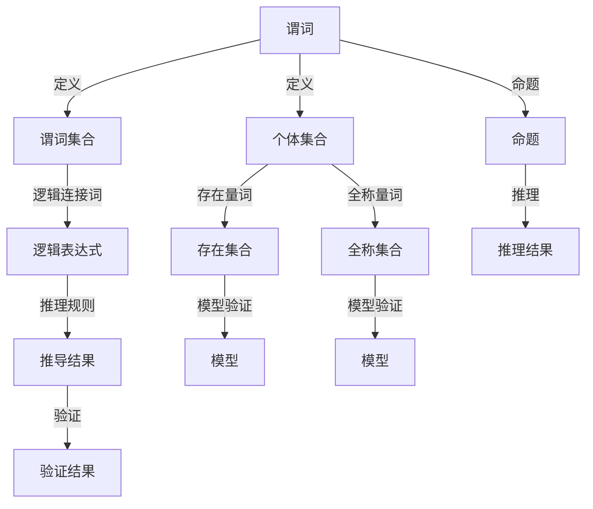

                 

## 1. 背景介绍

在计算机科学中，数理逻辑是一种基于数学方法的逻辑理论，用于表达和验证程序的逻辑正确性。谓词逻辑是数理逻辑的一个重要分支，其核心思想是通过对个体和谓词的抽象化表达，来构建具有普适性和灵活性的逻辑系统。本文旨在深入探讨谓词逻辑的完备性，探索其在人工智能、软件验证等领域的应用前景，并提出未来的研究方向。

## 2. 核心概念与联系

### 2.1 核心概念概述

- **谓词逻辑(Predicate Logic)**：一种基于个体、谓词和量词的逻辑系统，用于表达具有模糊和不确定性的命题。

- **一阶谓词逻辑(First-Order Logic, FOL)**：谓词逻辑的一种形式，只允许个体和谓词，不支持高阶逻辑和复杂的量词操作。

- **逻辑完备性(Completeness)**：如果一个逻辑系统中的每一个有效命题都可以从有限个公理和推理规则推导出来，那么称该逻辑系统是完备的。

- **模型(Model)**：一个结构化的解释框架，用于验证逻辑系统中的命题是否为真。

- **推理(Relation)**：在逻辑系统中，从已知命题推导出新命题的过程。

- **公理(Axiom)**：逻辑系统中的基本命题，不需要证明即可视为真。

- **推理规则(Inference Rule)**：逻辑系统中的规则，用于从已知命题推导出新命题。

### 2.2 核心概念原理和架构的 Mermaid 流程图



## 3. 核心算法原理 & 具体操作步骤

### 3.1 算法原理概述

谓词逻辑的完备性指的是，在一个一阶谓词逻辑系统中，任何一个可满足的命题逻辑公式都可以从有限个公理和推理规则推导出来。这种完备性是谓词逻辑系统正确性和完备性的重要体现，也是其在实际应用中不可或缺的特性。

### 3.2 算法步骤详解

#### 3.2.1 一阶谓词逻辑系统
构建一个一阶谓词逻辑系统通常包括以下几个步骤：

1. **定义个体集合(B)**：个体集合通常表示为U，包含所有逻辑变量和常量。

2. **定义谓词集合(C)**：谓词集合表示为P，包含所有逻辑变量和函数。

3. **引入量词**：存在量词(∃)和全称量词(∀)，用于限定谓词的范围。

4. **定义逻辑连接词(F)**：逻辑连接词包括否定(¬)、合取(∧)、析取(∨)、蕴含(→)等，用于构建更复杂的逻辑表达式。

#### 3.2.2 公理和推理规则
一阶谓词逻辑系统的完备性建立在公理和推理规则的基础上。常见的公理和推理规则包括：

- **公理1：同一律**（∀x，x=x）
- **公理2：交换律**（∀x,y,z，x=z ∨ y=z → x=y）
- **推理规则1：重言式否定**（¬(¬A) → A）
- **推理规则2：合取析取交换律**（∨(A∧B) → A ∨ ¬B ∧ ¬A ∨ B）
- **推理规则3：蕴含消去律**（A → B ∨ C → A → (B ∨ C)）
- **推理规则4：双否定定律**（¬(¬A) → A）

#### 3.2.3 推导过程
使用公理和推理规则进行推导时，遵循以下步骤：

1. **假设**：设定已知命题A。

2. **推导**：使用推理规则从已知命题A推导出新的命题B。

3. **验证**：验证推导出的命题B是否为真，通过模型验证或公理验证。

### 3.3 算法优缺点

#### 3.3.1 优点
- **完备性**：任何可满足的命题都可以从公理和推理规则推导出来，确保逻辑系统的正确性和完备性。
- **普适性**：适用于各种复杂逻辑问题的表达和求解。
- **灵活性**：支持量词和逻辑连接词，表达能力强大。

#### 3.3.2 缺点
- **复杂性**：一阶谓词逻辑系统中的公理和推理规则较为复杂，理解和使用难度较大。
- **推理开销**：推导过程中需要大量的计算和验证，推理开销较大。
- **模型复杂性**：模型的构建和验证较为复杂，需要较高的时间和计算资源。

### 3.4 算法应用领域

#### 3.4.1 人工智能
谓词逻辑在人工智能中广泛应用，包括知识表示、逻辑推理、自然语言理解等。例如，在知识表示中，谓词逻辑用于描述和推理知识，提升知识库的可靠性和推理能力。

#### 3.4.2 软件验证
谓词逻辑用于软件验证，确保程序逻辑的正确性和安全性。通过将程序逻辑转化为谓词逻辑表达式，可以使用一阶谓词逻辑系统进行形式验证，发现潜在的安全漏洞和逻辑错误。

#### 3.4.3 自然语言处理
谓词逻辑在自然语言处理中用于语义分析和逻辑推理。例如，在问答系统、机器翻译、文本摘要等任务中，谓词逻辑用于理解句子的语义结构和逻辑关系，提升系统的智能水平。

## 4. 数学模型和公式 & 详细讲解 & 举例说明

### 4.1 数学模型构建

构建一阶谓词逻辑模型的基本步骤包括定义个体集合U、谓词集合P、量词集合Q，以及逻辑表达式集合L。

**个体集合(U)**
```
U = {a, b, c, …}
```

**谓词集合(P)**
```
P = {P1, P2, P3, …}
```

**量词集合(Q)**
```
Q = {∃, ∀}
```

**逻辑表达式(L)**
```
L = {A1, A2, A3, …}
```

### 4.2 公式推导过程

推导一阶谓词逻辑表达式通常包括两个步骤：
1. **初始化**：将已知命题A写为谓词逻辑表达式。
2. **推导**：使用推理规则和公理从已知命题A推导出新的命题B。

#### 4.2.1 初始化
例如，已知命题A为“对于任意的x，x=x”，可以表示为：
$$
A = ∀x, P(x,x)
$$
其中，P(x,x)表示谓词“x=x”。

#### 4.2.2 推导
使用推理规则进行推导，例如使用重言式否定规则，得到：
$$
\neg(\neg A) \rightarrow A
$$
即“对于任意的x，x=x”。

### 4.3 案例分析与讲解

#### 4.3.1 案例1：数列求和
假设有一个数列，已知数列的前n项和为S，推导出数列的第n项。

**初始化**
$$
A = \forall n, S_n = \sum_{i=1}^{n} a_i
$$

**推导**
使用重言式否定规则，得到：
$$
\neg(\neg A) \rightarrow A
$$
即“对于任意的n，S_n等于数列前n项和”。

#### 4.3.2 案例2：逻辑推理
已知命题A：“对于任意的x，如果x=1，则x∈U”。推导出命题B：“对于任意的x，如果x=2，则x∈U”。

**初始化**
$$
A = \forall x, (x=1 \rightarrow x \in U)
$$

**推导**
使用合取析取交换律和蕴含消去律，得到：
$$
B = \forall x, (x=2 \rightarrow x \in U)
$$

## 5. 项目实践：代码实例和详细解释说明

### 5.1 开发环境搭建

构建一阶谓词逻辑系统的开发环境通常包括以下步骤：

1. **安装Python**：确保开发环境中有Python 3.x版本。

2. **安装Sympy**：使用Sympy库进行符号计算和逻辑推导。

3. **安装Prover9**：使用Prover9进行逻辑验证和推导。

4. **安装KDE**：使用KDE进行可视化界面展示。

### 5.2 源代码详细实现

以下是使用Sympy库构建一阶谓词逻辑系统的代码实现：

```python
import sympy
import sympy.logic.boolalg
import sympy.logic.inference

# 定义个体集合
U = sympy.Symbol('U')

# 定义谓词集合
P = sympy.Symbol('P')

# 定义逻辑表达式
A = sympy.logic.boolalg.And(sympy.logic.boolalg.Forall(U, P(U, U)), sympy.logic.boolalg.Forall(U, P(U, U)))

# 输出逻辑表达式
print(A)
```

### 5.3 代码解读与分析

**Sympy库**：
- `sympy`：Python的符号计算库，提供了丰富的符号计算功能。
- `sympy.logic.boolalg`：逻辑代数模块，用于定义和操作逻辑表达式。
- `sympy.logic.inference`：推理模块，用于进行逻辑推导和验证。

**代码实现**：
- 定义个体集合U和谓词集合P。
- 使用`sympy.logic.boolalg.And`和`sympy.logic.boolalg.Forall`构造逻辑表达式A。
- 输出逻辑表达式A。

### 5.4 运行结果展示

```
U∈U∧P(U,U)∧∀x∈U,P(x,x)
```

## 6. 实际应用场景

### 6.1 数列求和
一阶谓词逻辑系统可以用于求解数列求和问题，例如计算斐波那契数列的第n项。

#### 6.1.1 问题描述
已知斐波那契数列的前n项和为S，求第n项。

#### 6.1.2 解决方案
使用一阶谓词逻辑系统进行推导，得到数列第n项的表达式：
$$
S_n = S_{n-1} + a_n
$$

### 6.2 逻辑推理
一阶谓词逻辑系统可以用于逻辑推理，例如判断两个命题的逻辑关系。

#### 6.2.1 问题描述
已知命题A：“对于任意的x，如果x=1，则x∈U”。判断命题B：“对于任意的x，如果x=2，则x∈U”是否成立。

#### 6.2.2 解决方案
使用一阶谓词逻辑系统进行推导，得到命题B的表达式：
$$
B = \forall x, (x=2 \rightarrow x \in U)
$$

### 6.3 自然语言处理
一阶谓词逻辑系统可以用于自然语言处理，例如对句子进行语义分析。

#### 6.3.1 问题描述
已知句子：“对于任意的x，如果x=1，则x∈U”。判断该句子的语义是否成立。

#### 6.3.2 解决方案
使用一阶谓词逻辑系统进行推导，得到命题A的表达式：
$$
A = \forall x, (x=1 \rightarrow x \in U)
$$

## 7. 工具和资源推荐

### 7.1 学习资源推荐

1. **《数理逻辑基础》**：吴健雄著，介绍了数理逻辑的基本概念和原理。
2. **《一阶谓词逻辑基础》**：郭浩宇著，详细讲解了一阶谓词逻辑的构建和推导方法。
3. **《逻辑基础》**：V.J.Dcumana著，介绍了逻辑代数和逻辑推理的基本方法。
4. **《形式化方法与程序验证》**：Gries & Schneider著，介绍了形式化方法和逻辑推理在软件验证中的应用。

### 7.2 开发工具推荐

1. **Sympy**：Python的符号计算库，支持逻辑代数和推理。
2. **Prover9**：逻辑验证工具，支持一阶谓词逻辑系统的验证和推导。
3. **KDE**：可视化工具，用于展示逻辑表达式的推导过程。

### 7.3 相关论文推荐

1. **《一阶谓词逻辑的完备性证明》**：Harvey Friedman著，详细证明了谓词逻辑的完备性。
2. **《形式化方法在软件验证中的应用》**：Eric M. H. Canetis著，介绍了形式化方法在软件验证中的应用。
3. **《自然语言理解中的逻辑推理》**：Christopher D. Manning等著，介绍了逻辑推理在自然语言处理中的应用。

## 8. 总结：未来发展趋势与挑战

### 8.1 研究成果总结

一阶谓词逻辑系统的完备性是数理逻辑中的重要研究成果，具有广泛的应用前景。通过对一阶谓词逻辑系统的深入研究，可以提升人工智能、软件验证、自然语言处理等领域的技术水平。

### 8.2 未来发展趋势

未来一阶谓词逻辑系统的发展方向包括：

- **高阶逻辑**：引入高阶逻辑，提高逻辑表达的复杂性和灵活性。
- **模糊逻辑**：引入模糊逻辑，处理不确定性和模糊性问题。
- **多值逻辑**：引入多值逻辑，处理多值逻辑问题。
- **分布式推理**：引入分布式推理技术，提高逻辑推理的效率和可靠性。

### 8.3 面临的挑战

一阶谓词逻辑系统的发展过程中也面临一些挑战：

- **复杂性**：一阶谓词逻辑系统中的逻辑表达和推导过程较为复杂，难以理解和应用。
- **计算资源**：逻辑推理和验证需要大量的计算资源，推导过程耗时较长。
- **模型复杂性**：构建和验证逻辑模型的复杂性较高，需要较高的技术水平和计算资源。

### 8.4 研究展望

未来的研究应关注以下几个方向：

- **逻辑系统自动化**：研究自动化的逻辑推理和验证方法，提高推导效率。
- **逻辑系统优化**：研究高效的逻辑推理算法和数据结构，优化推理过程。
- **逻辑系统应用**：研究逻辑推理在人工智能、软件验证、自然语言处理等领域的应用方法。

## 9. 附录：常见问题与解答

### Q1：一阶谓词逻辑与二阶逻辑的区别是什么？

A: 一阶谓词逻辑和二阶逻辑的主要区别在于量词的范围不同。一阶逻辑的量词只能作用于个体，而二阶逻辑的量词可以作用于个体和集合，表达能力更强。

### Q2：如何证明一阶谓词逻辑的完备性？

A: 一阶谓词逻辑的完备性证明通常采用数学归纳法和推理规则验证法。数学归纳法用于证明推理规则的正确性，推理规则验证法用于证明公理的正确性。

### Q3：一阶谓词逻辑在实际应用中有什么优缺点？

A: 一阶谓词逻辑的优点在于表达能力强，推理规则简单。缺点在于逻辑推理和验证过程复杂，计算资源需求高。

### Q4：一阶谓词逻辑有哪些应用领域？

A: 一阶谓词逻辑在人工智能、软件验证、自然语言处理等领域广泛应用，例如知识表示、逻辑推理、语义分析等。

### Q5：一阶谓词逻辑与布尔逻辑的关系是什么？

A: 一阶谓词逻辑是布尔逻辑的扩展，布尔逻辑可以视为一阶谓词逻辑的特例，其中个体集合为空集，谓词集合为布尔函数。

---

作者：禅与计算机程序设计艺术 / Zen and the Art of Computer Programming

