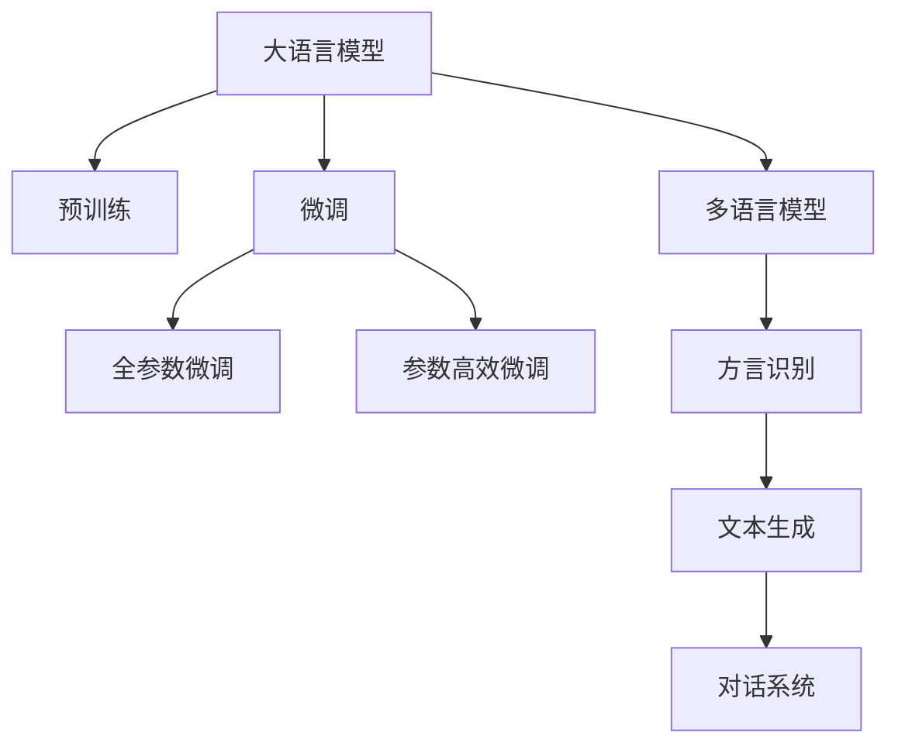

                 

## 1. 背景介绍

在全球化的浪潮中，方言作为民族文化的重要组成部分，面临着被边缘化的危险。现代化进程、城市化扩展、信息技术的普及，使得人们越来越依赖标准化的普通话和英语，而各种地方方言逐渐被淘汰。这种语言文化的消亡不仅是语言多样性的损失，也是历史记忆和文化传承的断层。因此，如何利用现代科技，特别是大语言模型(Large Language Model, LLM)，来保护和传承方言，成为了当前亟需解决的重要课题。

### 1.1 问题由来

方言的保护和传承，一直以来都是语言学家和文化研究者的重要议题。随着数字化技术的进步，特别是人工智能(AI)和大语言模型技术的发展，为方言的保护提供了新的思路和手段。例如，利用大模型进行语音识别、文本生成、语言翻译等任务，可以构建基于方言的AI系统，进而促进方言的记录、保存和应用。

然而，现存的大语言模型多以普通话和英语为训练语料，缺乏对各地方言的支持。这不仅限制了方言的语言模型应用，也阻碍了地方方言文化的保护和传承。本论文聚焦于如何利用大语言模型技术，结合方言特有的文化和历史背景，实现对地方方言的保护与传承。

### 1.2 问题核心关键点

方言保护的核心在于如何构建能反映方言特色的语言模型。这需要解决以下几个关键问题：

1. **数据收集**：收集足够量的方言数据，确保模型能准确学习方言的语音和词汇特征。
2. **模型训练**：使用适当的训练技术，确保模型能充分学习方言的独特语言习惯和文化背景。
3. **应用部署**：将模型应用到实际的语音识别、文本生成等任务中，促进方言在实际场景中的应用。

本论文旨在从大语言模型技术出发，探索如何构建方言保护系统，旨在推动方言文化的多样性和传承。

## 2. 核心概念与联系

### 2.1 核心概念概述

为了更好地理解如何利用大语言模型保护方言，本节将介绍几个核心概念：

1. **大语言模型(Large Language Model, LLM)**：指使用大规模无标签文本数据进行预训练的语言模型。这些模型通常具有丰富的语言知识和语言理解能力，可以处理复杂的语言问题。
2. **预训练(Pre-training)**：在大规模无标签文本数据上进行的自监督学习任务，以获得语言的通用表示。
3. **微调(Fine-tuning)**：在预训练模型基础上，利用小规模标注数据进行有监督学习，优化模型在特定任务上的性能。
4. **迁移学习(Transfer Learning)**：将一个领域学到的知识应用到另一个领域，利用已有的模型进行迁移学习，可以加快新任务的学习过程。
5. **多语言模型(Multilingual Model)**：指能处理多种语言的模型，可以同时支持多种语言的处理和学习。
6. **方言识别(Dialect Recognition)**：指识别不同方言特征的过程，主要通过语音和文本特征的提取和分类。
7. **文本生成(Text Generation)**：通过大语言模型生成新的方言文本，可以用于记录和传承方言文化。
8. **对话系统(Dialogue System)**：使用方言构建的对话系统，可以通过自然语言处理技术进行方言对话。

这些核心概念之间的逻辑关系可以通过以下Mermaid流程图来展示：



这个流程图展示了大语言模型的核心概念及其之间的关系：

1. 大语言模型通过预训练获得基础能力。
2. 微调是对预训练模型进行任务特定的优化，可以分为全参数微调和参数高效微调。
3. 多语言模型支持多种语言，可以用于方言识别等任务。
4. 方言识别可以识别不同方言特征，为方言的记录和传承提供数据基础。
5. 文本生成可以通过大模型生成新的方言文本，促进方言文化的传播。
6. 对话系统可以利用方言构建，进行自然语言处理，实现方言对话。

这些概念共同构成了大语言模型保护方言的核心框架，使得利用大模型技术传承地方语言文化成为可能。

## 3. 核心算法原理 & 具体操作步骤
### 3.1 算法原理概述

方言保护的大语言模型框架，基于监督学习的微调方法。核心思想是：利用方言数据对预训练模型进行微调，提升模型对方言的识别和处理能力。

形式化地，假设预训练模型为 $M_{\theta}$，其中 $\theta$ 为预训练得到的模型参数。给定方言 $D$ 的标注数据集 $D=\{(x_i, y_i)\}_{i=1}^N$，其中 $x_i$ 为方言文本或语音，$y_i$ 为对应的方言标签。微调的目标是找到新的模型参数 $\hat{\theta}$，使得：

$$
\hat{\theta}=\mathop{\arg\min}_{\theta} \mathcal{L}(M_{\theta},D)
$$

其中 $\mathcal{L}$ 为针对方言 $D$ 设计的损失函数，用于衡量模型预测输出与真实标签之间的差异。

### 3.2 算法步骤详解

方言保护的大语言模型微调一般包括以下几个关键步骤：

**Step 1: 准备方言数据**
- 收集方言的语料库，包含文本和语音等形式。
- 对语料库进行清洗、标注和划分，得到训练集、验证集和测试集。

**Step 2: 选择预训练模型**
- 选择合适的预训练语言模型 $M_{\theta}$ 作为初始化参数，如 BERT、GPT 等。

**Step 3: 添加方言适配层**
- 根据方言识别任务，在预训练模型顶层设计合适的输出层和损失函数。
- 对于分类任务，通常在顶层添加分类器；对于序列标注任务，则需构建序列标注模型。

**Step 4: 设置微调超参数**
- 选择合适的优化算法及其参数，如 AdamW、SGD 等，设置学习率、批大小、迭代轮数等。
- 设置正则化技术及强度，包括权重衰减、Dropout、Early Stopping 等。

**Step 5: 执行梯度训练**
- 将训练集数据分批次输入模型，前向传播计算损失函数。
- 反向传播计算参数梯度，根据设定的优化算法和学习率更新模型参数。
- 周期性在验证集上评估模型性能，根据性能指标决定是否触发 Early Stopping。
- 重复上述步骤直到满足预设的迭代轮数或 Early Stopping 条件。

**Step 6: 测试和应用**
- 在测试集上评估微调后模型 $M_{\hat{\theta}}$ 的性能，对比微调前后的精度提升。
- 使用微调后的模型对新的方言数据进行推理预测，记录和传承方言文化。
- 持续收集新的方言数据，定期重新微调模型，以适应数据分布的变化。

### 3.3 算法优缺点

基于监督学习的大语言模型方言保护方法具有以下优点：

1. 简单高效。只需准备少量方言标注数据，即可对预训练模型进行快速适配，获得较大的性能提升。
2. 通用适用。适用于各种方言识别、文本生成、对话等任务，设计简单的任务适配层即可实现。
3. 迁移学习能力强。通过微调，通用大模型能够很好地适应特定方言的任务。
4. 参数高效。利用参数高效微调技术，在固定大部分预训练参数的情况下，仍可取得不错的提升。

同时，该方法也存在一定的局限性：

1. 方言数据稀缺。方言数据往往难以获取，标注数据量少，可能限制模型的性能。
2. 数据质量和多样性不足。方言数据可能存在噪声和质量问题，导致模型学习效果不佳。
3. 模型复杂度较高。预训练模型通常具有亿级的参数量，对计算资源和存储资源要求较高。
4. 模型泛化能力有待提高。方言数据的分布差异大，模型可能难以泛化到新方言。

尽管存在这些局限性，但就目前而言，基于监督学习的微调方法仍是大语言模型保护方言的重要手段。未来相关研究的重点在于如何进一步降低对方言标注数据的依赖，提高模型的泛化能力和迁移学习能力，同时兼顾模型的参数效率和计算效率。

### 3.4 算法应用领域

基于大语言模型方言保护的监督学习方法，在方言识别、文本生成、对话系统等多个领域得到了应用：

1. **方言识别**：通过对方言数据进行标注和微调，使大语言模型能够准确识别不同的方言。这在智能客服、自动翻译等场景中非常有用。
2. **文本生成**：利用微调后的模型，可以生成新的方言文本，如方言的小说、诗歌等，传承方言文化。
3. **对话系统**：构建基于方言的对话系统，通过自然语言处理技术进行方言对话，提升方言的使用频率和普及度。

这些应用场景展示了方言保护大语言模型框架的广泛应用价值，为地方语言文化的传承和应用提供了新的手段。

## 4. 数学模型和公式 & 详细讲解  
### 4.1 数学模型构建

以下我们将使用数学语言对基于监督学习的大语言模型方言保护过程进行更加严格的刻画。

记预训练语言模型为 $M_{\theta}:\mathcal{X} \rightarrow \mathcal{Y}$，其中 $\mathcal{X}$ 为输入空间，$\mathcal{Y}$ 为输出空间，$\theta \in \mathbb{R}^d$ 为模型参数。假设方言识别任务的数据集为 $D=\{(x_i,y_i)\}_{i=1}^N, x_i \in \mathcal{X}, y_i \in \mathcal{Y}$。

定义模型 $M_{\theta}$ 在输入 $x$ 上的损失函数为 $\ell(M_{\theta}(x),y)$，则在数据集 $D$ 上的经验风险为：

$$
\mathcal{L}(\theta) = \frac{1}{N} \sum_{i=1}^N \ell(M_{\theta}(x_i),y_i)
$$

微调的优化目标是最小化经验风险，即找到最优参数：

$$
\theta^* = \mathop{\arg\min}_{\theta} \mathcal{L}(\theta)
$$

在实践中，我们通常使用基于梯度的优化算法（如SGD、Adam等）来近似求解上述最优化问题。设 $\eta$ 为学习率，$\lambda$ 为正则化系数，则参数的更新公式为：

$$
\theta \leftarrow \theta - \eta \nabla_{\theta}\mathcal{L}(\theta) - \eta\lambda\theta
$$

其中 $\nabla_{\theta}\mathcal{L}(\theta)$ 为损失函数对参数 $\theta$ 的梯度，可通过反向传播算法高效计算。

### 4.2 公式推导过程

以下我们以二分类任务为例，推导交叉熵损失函数及其梯度的计算公式。

假设模型 $M_{\theta}$ 在输入 $x$ 上的输出为 $\hat{y}=M_{\theta}(x) \in [0,1]$，表示样本属于正类的概率。真实标签 $y \in \{0,1\}$。则二分类交叉熵损失函数定义为：

$$
\ell(M_{\theta}(x),y) = -[y\log \hat{y} + (1-y)\log (1-\hat{y})]
$$

将其代入经验风险公式，得：

$$
\mathcal{L}(\theta) = -\frac{1}{N}\sum_{i=1}^N [y_i\log M_{\theta}(x_i)+(1-y_i)\log(1-M_{\theta}(x_i))]
$$

根据链式法则，损失函数对参数 $\theta_k$ 的梯度为：

$$
\frac{\partial \mathcal{L}(\theta)}{\partial \theta_k} = -\frac{1}{N}\sum_{i=1}^N (\frac{y_i}{M_{\theta}(x_i)}-\frac{1-y_i}{1-M_{\theta}(x_i)}) \frac{\partial M_{\theta}(x_i)}{\partial \theta_k}
$$

其中 $\frac{\partial M_{\theta}(x_i)}{\partial \theta_k}$ 可进一步递归展开，利用自动微分技术完成计算。

在得到损失函数的梯度后，即可带入参数更新公式，完成模型的迭代优化。重复上述过程直至收敛，最终得到适应方言识别任务的最优模型参数 $\theta^*$。

## 5. 项目实践：代码实例和详细解释说明
### 5.1 开发环境搭建

在进行方言保护大语言模型微调实践前，我们需要准备好开发环境。以下是使用Python进行PyTorch开发的环境配置流程：

1. 安装Anaconda：从官网下载并安装Anaconda，用于创建独立的Python环境。

2. 创建并激活虚拟环境：
```bash
conda create -n pytorch-env python=3.8 
conda activate pytorch-env
```

3. 安装PyTorch：根据CUDA版本，从官网获取对应的安装命令。例如：
```bash
conda install pytorch torchvision torchaudio cudatoolkit=11.1 -c pytorch -c conda-forge
```

4. 安装Transformer库：
```bash
pip install transformers
```

5. 安装各类工具包：
```bash
pip install numpy pandas scikit-learn matplotlib tqdm jupyter notebook ipython
```

完成上述步骤后，即可在`pytorch-env`环境中开始方言保护大语言模型微调实践。

### 5.2 源代码详细实现

下面我们以方言识别任务为例，给出使用Transformers库对BERT模型进行方言保护微调的PyTorch代码实现。

首先，定义方言识别任务的数据处理函数：

```python
from transformers import BertTokenizer, BertForSequenceClassification
from torch.utils.data import Dataset
import torch

class DialectDataset(Dataset):
    def __init__(self, texts, labels, tokenizer, max_len=128):
        self.texts = texts
        self.labels = labels
        self.tokenizer = tokenizer
        self.max_len = max_len
        
    def __len__(self):
        return len(self.texts)
    
    def __getitem__(self, item):
        text = self.texts[item]
        label = self.labels[item]
        
        encoding = self.tokenizer(text, return_tensors='pt', max_length=self.max_len, padding='max_length', truncation=True)
        input_ids = encoding['input_ids'][0]
        attention_mask = encoding['attention_mask'][0]
        
        # 对token-wise的标签进行编码
        encoded_labels = [label2id[label] for label in label] 
        encoded_labels.extend([label2id['O']] * (self.max_len - len(encoded_labels)))
        labels = torch.tensor(encoded_labels, dtype=torch.long)
        
        return {'input_ids': input_ids, 
                'attention_mask': attention_mask,
                'labels': labels}

# 标签与id的映射
label2id = {'O': 0, 'Mandarin': 1, 'Cantonese': 2, 'Shanghainese': 3, 'Fujianese': 4, 'Guangdongese': 5}
id2label = {v: k for k, v in label2id.items()}

# 创建dataset
tokenizer = BertTokenizer.from_pretrained('bert-base-cased')

train_dataset = DialectDataset(train_texts, train_labels, tokenizer)
dev_dataset = DialectDataset(dev_texts, dev_labels, tokenizer)
test_dataset = DialectDataset(test_texts, test_labels, tokenizer)
```

然后，定义模型和优化器：

```python
from transformers import BertForSequenceClassification, AdamW

model = BertForSequenceClassification.from_pretrained('bert-base-cased', num_labels=len(label2id))

optimizer = AdamW(model.parameters(), lr=2e-5)
```

接着，定义训练和评估函数：

```python
from torch.utils.data import DataLoader
from tqdm import tqdm
from sklearn.metrics import classification_report

device = torch.device('cuda') if torch.cuda.is_available() else torch.device('cpu')
model.to(device)

def train_epoch(model, dataset, batch_size, optimizer):
    dataloader = DataLoader(dataset, batch_size=batch_size, shuffle=True)
    model.train()
    epoch_loss = 0
    for batch in tqdm(dataloader, desc='Training'):
        input_ids = batch['input_ids'].to(device)
        attention_mask = batch['attention_mask'].to(device)
        labels = batch['labels'].to(device)
        model.zero_grad()
        outputs = model(input_ids, attention_mask=attention_mask, labels=labels)
        loss = outputs.loss
        epoch_loss += loss.item()
        loss.backward()
        optimizer.step()
    return epoch_loss / len(dataloader)

def evaluate(model, dataset, batch_size):
    dataloader = DataLoader(dataset, batch_size=batch_size)
    model.eval()
    preds, labels = [], []
    with torch.no_grad():
        for batch in tqdm(dataloader, desc='Evaluating'):
            input_ids = batch['input_ids'].to(device)
            attention_mask = batch['attention_mask'].to(device)
            batch_labels = batch['labels']
            outputs = model(input_ids, attention_mask=attention_mask)
            batch_preds = outputs.logits.argmax(dim=2).to('cpu').tolist()
            batch_labels = batch_labels.to('cpu').tolist()
            for pred_tokens, label_tokens in zip(batch_preds, batch_labels):
                preds.append(pred_tokens[:len(label_tokens)])
                labels.append(label_tokens)
                
    print(classification_report(labels, preds))
```

最后，启动训练流程并在测试集上评估：

```python
epochs = 5
batch_size = 16

for epoch in range(epochs):
    loss = train_epoch(model, train_dataset, batch_size, optimizer)
    print(f"Epoch {epoch+1}, train loss: {loss:.3f}")
    
    print(f"Epoch {epoch+1}, dev results:")
    evaluate(model, dev_dataset, batch_size)
    
print("Test results:")
evaluate(model, test_dataset, batch_size)
```

以上就是使用PyTorch对BERT进行方言识别任务微调的完整代码实现。可以看到，得益于Transformers库的强大封装，我们可以用相对简洁的代码完成BERT模型的加载和微调。

### 5.3 代码解读与分析

让我们再详细解读一下关键代码的实现细节：

**DialectDataset类**：
- `__init__`方法：初始化文本、标签、分词器等关键组件。
- `__len__`方法：返回数据集的样本数量。
- `__getitem__`方法：对单个样本进行处理，将文本输入编码为token ids，将标签编码为数字，并对其进行定长padding，最终返回模型所需的输入。

**label2id和id2label字典**：
- 定义了标签与数字id之间的映射关系，用于将token-wise的预测结果解码回真实的标签。

**训练和评估函数**：
- 使用PyTorch的DataLoader对数据集进行批次化加载，供模型训练和推理使用。
- 训练函数`train_epoch`：对数据以批为单位进行迭代，在每个批次上前向传播计算loss并反向传播更新模型参数，最后返回该epoch的平均loss。
- 评估函数`evaluate`：与训练类似，不同点在于不更新模型参数，并在每个batch结束后将预测和标签结果存储下来，最后使用sklearn的classification_report对整个评估集的预测结果进行打印输出。

**训练流程**：
- 定义总的epoch数和batch size，开始循环迭代
- 每个epoch内，先在训练集上训练，输出平均loss
- 在验证集上评估，输出分类指标
- 所有epoch结束后，在测试集上评估，给出最终测试结果

可以看到，PyTorch配合Transformers库使得BERT微调的代码实现变得简洁高效。开发者可以将更多精力放在数据处理、模型改进等高层逻辑上，而不必过多关注底层的实现细节。

当然，工业级的系统实现还需考虑更多因素，如模型的保存和部署、超参数的自动搜索、更灵活的任务适配层等。但核心的微调范式基本与此类似。

## 6. 实际应用场景
### 6.1 智能客服系统

基于大语言模型方言保护的对话技术，可以广泛应用于智能客服系统的构建。传统客服往往需要配备大量人力，高峰期响应缓慢，且一致性和专业性难以保证。而使用方言保护的大语言模型，可以7x24小时不间断服务，快速响应客户咨询，用自然流畅的语言解答各类方言问题。

在技术实现上，可以收集企业内部的历史客服对话记录，将问题和最佳答复构建成监督数据，在此基础上对预训练方言保护的大语言模型进行微调。微调后的方言保护的大语言模型能够自动理解用户意图，匹配最合适的答案模板进行回复。对于客户提出的新问题，还可以接入检索系统实时搜索相关内容，动态组织生成回答。如此构建的智能客服系统，能大幅提升客户咨询体验和问题解决效率。

### 6.2 金融舆情监测

金融机构需要实时监测市场舆论动向，以便及时应对负面信息传播，规避金融风险。传统的人工监测方式成本高、效率低，难以应对网络时代海量信息爆发的挑战。基于方言保护的大语言模型文本分类和情感分析技术，为金融舆情监测提供了新的解决方案。

具体而言，可以收集金融领域相关的新闻、报道、评论等文本数据，并对其进行主题标注和情感标注。在此基础上对预训练方言保护的大语言模型进行微调，使其能够自动判断文本属于何种主题，情感倾向是正面、中性还是负面。将方言保护的大语言模型应用到实时抓取的网络文本数据，就能够自动监测不同主题下的情感变化趋势，一旦发现负面信息激增等异常情况，系统便会自动预警，帮助金融机构快速应对潜在风险。

### 6.3 个性化推荐系统

当前的推荐系统往往只依赖用户的历史行为数据进行物品推荐，无法深入理解用户的真实兴趣偏好。基于方言保护的大语言模型个性化推荐系统可以更好地挖掘用户行为背后的语义信息，从而提供更精准、多样的推荐内容。

在实践中，可以收集用户浏览、点击、评论、分享等行为数据，提取和用户交互的物品标题、描述、标签等文本内容。将文本内容作为模型输入，用户的后续行为（如是否点击、购买等）作为监督信号，在此基础上微调方言保护的大语言模型。微调后的模型能够从文本内容中准确把握用户的兴趣点。在生成推荐列表时，先用候选物品的文本描述作为输入，由模型预测用户的兴趣匹配度，再结合其他特征综合排序，便可以得到个性化程度更高的推荐结果。

### 6.4 未来应用展望

随着方言保护大语言模型和微调方法的不断发展，基于微调范式将在更多领域得到应用，为方言文化的多样性和传承提供新的手段。

在智慧医疗领域，基于方言保护的大语言模型医疗问答、病历分析、药物研发等应用将提升医疗服务的智能化水平，辅助医生诊疗，加速新药开发进程。

在智能教育领域，方言保护的大语言模型可应用于作业批改、学情分析、知识推荐等方面，因材施教，促进教育公平，提高教学质量。

在智慧城市治理中，方言保护的大语言模型可以用于城市事件监测、舆情分析、应急指挥等环节，提高城市管理的自动化和智能化水平，构建更安全、高效的未来城市。

此外，在企业生产、社会治理、文娱传媒等众多领域，方言保护的大语言模型应用也将不断涌现，为经济社会发展注入新的动力。相信随着技术的日益成熟，方言保护的大语言模型微调必将在构建人机协同的智能时代中扮演越来越重要的角色。

## 7. 工具和资源推荐
### 7.1 学习资源推荐

为了帮助开发者系统掌握方言保护大语言模型微调的理论基础和实践技巧，这里推荐一些优质的学习资源：

1. 《Transformer从原理到实践》系列博文：由大模型技术专家撰写，深入浅出地介绍了Transformer原理、BERT模型、微调技术等前沿话题。

2. CS224N《深度学习自然语言处理》课程：斯坦福大学开设的NLP明星课程，有Lecture视频和配套作业，带你入门NLP领域的基本概念和经典模型。

3. 《Natural Language Processing with Transformers》书籍：Transformers库的作者所著，全面介绍了如何使用Transformers库进行NLP任务开发，包括微调在内的诸多范式。

4. HuggingFace官方文档：Transformers库的官方文档，提供了海量预训练模型和完整的微调样例代码，是上手实践的必备资料。

5. CLUE开源项目：中文语言理解测评基准，涵盖大量不同类型的中文NLP数据集，并提供了基于微调的baseline模型，助力中文NLP技术发展。

通过对这些资源的学习实践，相信你一定能够快速掌握方言保护大语言模型微调的精髓，并用于解决实际的NLP问题。
###  7.2 开发工具推荐

高效的开发离不开优秀的工具支持。以下是几款用于方言保护大语言模型微调开发的常用工具：

1. PyTorch：基于Python的开源深度学习框架，灵活动态的计算图，适合快速迭代研究。大部分预训练语言模型都有PyTorch版本的实现。

2. TensorFlow：由Google主导开发的开源深度学习框架，生产部署方便，适合大规模工程应用。同样有丰富的预训练语言模型资源。

3. Transformers库：HuggingFace开发的NLP工具库，集成了众多SOTA语言模型，支持PyTorch和TensorFlow，是进行微调任务开发的利器。

4. Weights & Biases：模型训练的实验跟踪工具，可以记录和可视化模型训练过程中的各项指标，方便对比和调优。与主流深度学习框架无缝集成。

5. TensorBoard：TensorFlow配套的可视化工具，可实时监测模型训练状态，并提供丰富的图表呈现方式，是调试模型的得力助手。

6. Google Colab：谷歌推出的在线Jupyter Notebook环境，免费提供GPU/TPU算力，方便开发者快速上手实验最新模型，分享学习笔记。

合理利用这些工具，可以显著提升方言保护大语言模型微调任务的开发效率，加快创新迭代的步伐。

### 7.3 相关论文推荐

大语言模型和微调技术的发展源于学界的持续研究。以下是几篇奠基性的相关论文，推荐阅读：

1. Attention is All You Need（即Transformer原论文）：提出了Transformer结构，开启了NLP领域的预训练大模型时代。

2. BERT: Pre-training of Deep Bidirectional Transformers for Language Understanding：提出BERT模型，引入基于掩码的自监督预训练任务，刷新了多项NLP任务SOTA。

3. Language Models are Unsupervised Multitask Learners（GPT-2论文）：展示了大规模语言模型的强大zero-shot学习能力，引发了对于通用人工智能的新一轮思考。

4. Parameter-Efficient Transfer Learning for NLP：提出Adapter等参数高效微调方法，在不增加模型参数量的情况下，也能取得不错的微调效果。

5. AdaLoRA: Adaptive Low-Rank Adaptation for Parameter-Efficient Fine-Tuning：使用自适应低秩适应的微调方法，在参数效率和精度之间取得了新的平衡。

这些论文代表了大语言模型微调技术的发展脉络。通过学习这些前沿成果，可以帮助研究者把握学科前进方向，激发更多的创新灵感。

## 8. 总结：未来发展趋势与挑战
### 8.1 总结

本文对基于监督学习的大语言模型方言保护方法进行了全面系统的介绍。首先阐述了方言保护和传承的重要意义，明确了大语言模型在其中的作用。其次，从原理到实践，详细讲解了方言保护的数学原理和关键步骤，给出了方言保护任务开发的完整代码实例。同时，本文还广泛探讨了方言保护方法在智能客服、金融舆情、个性化推荐等多个行业领域的应用前景，展示了方言保护范式的巨大潜力。此外，本文精选了方言保护技术的各类学习资源，力求为读者提供全方位的技术指引。

通过本文的系统梳理，可以看到，基于大语言模型的方言保护方法正在成为方言文化保护的重要范式，极大地拓展了方言语言模型的应用边界，催生了更多的落地场景。得益于大规模语料的预训练，方言保护模型以更低的时间和标注成本，在小样本条件下也能取得不俗的效果，有力推动了方言文化的多样性和传承。未来，伴随方言保护大语言模型和微调方法的持续演进，相信在方言文化的多样性和传承上，必将迎来新的突破。

### 8.2 未来发展趋势

展望未来，方言保护大语言模型微调技术将呈现以下几个发展趋势：

1. **模型规模持续增大**：随着算力成本的下降和数据规模的扩张，方言保护的大语言模型参数量还将持续增长。超大规模方言保护模型蕴含的丰富方言知识，有望支撑更加复杂多变的方言识别和保护任务。

2. **微调方法日趋多样**：除了传统的全参数微调外，未来会涌现更多参数高效的微调方法，如Prefix-Tuning、LoRA等，在节省计算资源的同时也能保证方言保护的精度。

3. **持续学习成为常态**：随着数据分布的不断变化，方言保护模型也需要持续学习新知识以保持性能。如何在不遗忘原有知识的同时，高效吸收新样本信息，将成为重要的研究课题。

4. **标注样本需求降低**：受启发于提示学习(Prompt-based Learning)的思路，未来的方言保护方法将更好地利用大模型的语言理解能力，通过更加巧妙的任务描述，在更少的标注样本上也能实现理想的方言保护效果。

5. **多模态微调崛起**：当前的方言保护主要聚焦于纯文本数据，未来会进一步拓展到图像、视频、语音等多模态数据微调。多模态信息的融合，将显著提升方言保护模型的综合能力。

6. **模型通用性增强**：经过海量数据的预训练和多领域任务的微调，未来的方言保护模型将具备更强大的常识推理和跨领域迁移能力，逐步迈向通用人工智能(AGI)的目标。

以上趋势凸显了大语言模型方言保护技术的广阔前景。这些方向的探索发展，必将进一步提升方言保护模型的性能和应用范围，为地方语言文化的传承和应用提供新的手段。

### 8.3 面临的挑战

尽管方言保护大语言模型微调技术已经取得了瞩目成就，但在迈向更加智能化、普适化应用的过程中，它仍面临着诸多挑战：

1. **方言数据稀缺**：方言数据往往难以获取，标注数据量少，可能限制模型的性能。
2. **数据质量和多样性不足**：方言数据可能存在噪声和质量问题，导致模型学习效果不佳。
3. **模型复杂度较高**：预训练模型通常具有亿级的参数量，对计算资源和存储资源要求较高。
4. **模型泛化能力有待提高**：方言数据的分布差异大，模型可能难以泛化到新方言。
5. **计算和存储资源瓶颈**：大规模方言保护模型的训练和推理需要大量的计算和存储资源。

尽管存在这些局限性，但就目前而言，基于监督学习的微调方法仍是大语言模型方言保护的重要手段。未来相关研究的重点在于如何进一步降低对方言标注数据的依赖，提高模型的泛化能力和迁移学习能力，同时兼顾模型的参数效率和计算效率。

### 8.4 研究展望

面对方言保护大语言模型微调所面临的种种挑战，未来的研究需要在以下几个方面寻求新的突破：

1. **探索无监督和半监督微调方法**：摆脱对大规模标注数据的依赖，利用自监督学习、主动学习等无监督和半监督范式，最大限度利用非结构化数据，实现更加灵活高效的方言保护。
2. **研究参数高效和计算高效的微调范式**：开发更加参数高效的微调方法，在固定大部分预训练参数的同时，只更新极少量的任务相关参数。同时优化微调模型的计算图，减少前向传播和反向传播的资源消耗，实现更加轻量级、实时性的部署。
3. **融合因果和对比学习范式**：通过引入因果推断和对比学习思想，增强方言保护模型建立稳定因果关系的能力，学习更加普适、鲁棒的语言表征，从而提升模型泛化性和抗干扰能力。
4. **引入更多先验知识**：将符号化的先验知识，如知识图谱、逻辑规则等，与神经网络模型进行巧妙融合，引导方言保护过程学习更准确、合理的语言模型。同时加强不同模态数据的整合，实现视觉、语音等多模态信息与文本信息的协同建模。
5. **结合因果分析和博弈论工具**：将因果分析方法引入方言保护模型，识别出模型决策的关键特征，增强输出解释的因果性和逻辑性。借助博弈论工具刻画人机交互过程，主动探索并规避模型的脆弱点，提高系统稳定性。
6. **纳入伦理道德约束**：在模型训练目标中引入伦理导向的评估指标，过滤和惩罚有偏见、有害的输出倾向。同时加强人工干预和审核，建立模型行为的监管机制，确保输出符合人类价值观和伦理道德。

这些研究方向的探索，必将引领方言保护大语言模型微调技术迈向更高的台阶，为构建安全、可靠、可解释、可控的智能系统铺平道路。面向未来，方言保护大语言模型微调技术还需要与其他人工智能技术进行更深入的融合，如知识表示、因果推理、强化学习等，多路径协同发力，共同推动方言保护技术的进步。只有勇于创新、敢于突破，才能不断拓展方言保护模型的边界，让智能技术更好地造福方言文化的多样性和传承。

## 9. 附录：常见问题与解答

**Q1：方言保护是否适用于所有方言？**

A: 方言保护大语言模型适用于大部分方言，尤其是那些已有一定量的标注数据的方言。对于那些数据量较少或难以获取的方言，可能需要结合特定的预训练方法进行优化。

**Q2：如何选择合适的学习率？**

A: 方言保护模型的学习率通常需要调参，一般建议从1e-5开始，逐步减小学习率，直至收敛。同时，不同的优化器(如AdamW、Adafactor等)可能需要设置不同的学习率阈值。

**Q3：方言保护中的标注数据如何准备？**

A: 方言保护的标注数据可以通过多渠道收集，包括方言词典、语料库、对话记录等。标注过程需要专业知识，可以通过标注工具手动完成，也可以使用众包平台进行标注。

**Q4：方言保护中的数据增强方法有哪些？**

A: 方言保护中的数据增强方法包括但不限于：回译、近义替换、同义词替换、错误注入、对抗样本生成等。这些方法可以帮助增加训练集的样本多样性，提高模型的泛化能力。

**Q5：方言保护中的模型裁剪和量化技术有哪些？**

A: 方言保护模型可以通过裁剪和量化技术进行优化，减小模型尺寸，加快推理速度。常用的方法包括参数剪枝、权重量化、混合精度训练等。

这些回答帮助回答了方言保护中的常见问题，希望能为你提供有价值的参考。

