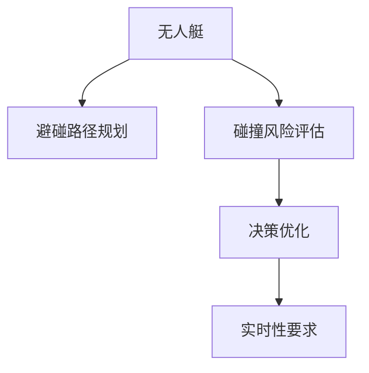

                 

## 1. 背景介绍

### 1.1 问题由来

随着海洋航运业的快速发展，无人艇(Autonomous Surface Vehicles, ASVs)作为一种新型海上交通工具，在军事侦察、海上救援、港口调度等领域得到广泛应用。然而，无人艇在航行过程中面临的风险与挑战也日益突出，如与其他船舶的碰撞、避让、跟随等。为此，开发一套高效的无人艇避碰规划算法，成为当前研究的重点方向。

### 1.2 问题核心关键点

无人艇避碰规划的核心问题是如何在动态复杂的海域环境中，实现与其他船舶的精确避碰和路径规划。该问题主要涉及以下几个方面：
- 避碰路径规划：基于无人艇当前位置和速度，计算出安全可行的避碰路径。
- 碰撞风险评估：动态评估其他船舶的航行轨迹，判断碰撞风险大小。
- 决策优化：在多冲突情形下，选择最优的避碰策略。
- 实时性要求：要求避碰算法能够在短时间内完成计算和决策，保证避碰的安全性。

### 1.3 问题研究意义

研究无人艇避碰规划算法，对于提升无人艇的航运安全性、自主性和智能化水平，具有重要意义：
- 降低事故率：通过精确避碰规划，减少海上交通事故，保障人员和财产安全。
- 提高航行效率：优化无人艇路径规划，避免与其他船舶的冲突，提升航行效率。
- 增强无人艇自主性：提高无人艇的智能决策能力，提升其自主航行和控制水平。
- 加速应用落地：推动无人艇技术在军事、民用等领域的应用，为海上交通管理带来革命性改变。

## 2. 核心概念与联系

### 2.1 核心概念概述

为更好地理解无人艇避碰规划算法，本节将介绍几个密切相关的核心概念：

- **无人艇(Autonomous Surface Vehicle, ASV)**：通过自动导航和避碰系统，能够自主航行和执行特定任务的海上交通工具。
- **避碰路径规划**：在无人艇当前位置和速度的基础上，计算出安全可行的避碰路径，避免与其他船舶碰撞。
- **碰撞风险评估**：动态评估其他船舶的航行轨迹，计算出碰撞风险，为避碰决策提供依据。
- **决策优化**：在多冲突情形下，选择最优的避碰策略，减少碰撞风险。
- **实时性要求**：避碰算法需要在短时间内完成计算和决策，保证避碰的安全性。

这些核心概念之间的逻辑关系可以通过以下Mermaid流程图来展示：



这个流程图展示了大语言模型的核心概念及其之间的关系：

1. 无人艇通过避碰路径规划，计算出安全可行的避碰路径。
2. 无人艇进行碰撞风险评估，动态评估其他船舶的航行轨迹，计算出碰撞风险。
3. 无人艇根据决策优化结果，选择最优的避碰策略。
4. 无人艇避碰算法需要满足实时性要求，保证避碰的安全性。

## 3. 核心算法原理 & 具体操作步骤
### 3.1 算法原理概述

无人艇避碰规划算法主要基于动态规划和优化理论，通过构建避碰路径和碰撞风险评估模型，实现无人艇在复杂环境中的自主避碰决策。

假设无人艇当前位置为 $(x, y)$，速度为 $(v_x, v_y)$，其他船舶的位置为 $(x_1, y_1)$，速度为 $(v_{x_1}, v_{y_1})$。避碰路径规划的目标是找到一条安全的路径，使得无人艇能够在规定时间内避开其他船舶。

### 3.2 算法步骤详解

无人艇避碰规划算法主要包括以下几个关键步骤：

**Step 1: 构建避碰路径**
- 定义无人艇的当前位置 $(x, y)$ 和速度 $(v_x, v_y)$。
- 构建无人艇在 $t$ 时刻的位置 $(x_t, y_t)$ 和速度 $(v_{x_t}, v_{y_t})$ 的递归方程。
- 定义其他船舶的位置 $(x_1, y_1)$ 和速度 $(v_{x_1}, v_{y_1})$。

**Step 2: 碰撞风险评估**
- 计算无人艇与其他船舶之间的距离和速度差，判断是否存在碰撞风险。
- 评估碰撞风险的概率和严重程度，如直接碰撞、侧面碰撞、交叉碰撞等。

**Step 3: 决策优化**
- 定义避碰路径的长度、安全性、转向次数等评估指标。
- 根据无人艇当前状态和其他船舶的状态，计算出多种避碰路径。
- 评估每种路径的风险和代价，选择最优路径。

**Step 4: 实时决策**
- 将避碰路径和碰撞风险评估结果，输入无人艇的自动避碰系统。
- 实时监测其他船舶的航行轨迹，动态调整避碰策略。

### 3.3 算法优缺点

无人艇避碰规划算法具有以下优点：
- 精确性高：通过动态规划和优化，能够精确计算出安全避碰路径。
- 灵活性大：适用于多种类型的无人艇和不同海况环境。
- 可扩展性好：可以进一步扩展到多目标避碰和多船协作避碰场景。

同时，该算法也存在一定的局限性：
- 计算复杂度高：特别是在多船避碰时，计算量和复杂度较高。
- 实时性要求高：需要实时计算和决策，对计算资源和算法效率要求较高。
- 依赖于数据质量：碰撞风险评估依赖于准确的船舶位置和速度信息，数据质量会直接影响避碰效果。

尽管存在这些局限性，但就目前而言，无人艇避碰规划算法仍是目前最主流的研究方向，适用于无人艇在复杂海况下的自主避碰决策。未来相关研究的重点在于如何进一步降低计算复杂度，提高实时性，同时提升数据的准确性和可靠性。

### 3.4 算法应用领域

无人艇避碰规划算法已经在多个实际应用场景中得到验证，以下是几个典型的应用领域：

- **军事侦察**：无人艇可在大洋海域进行远程侦察，通过避碰规划算法确保安全避让其他船只。
- **海上救援**：在发生海上事故时，无人艇可快速接近事故现场，进行人员和物资的输送。
- **港口调度**：无人艇可参与港口的货物装卸和调度任务，提升港口运营效率。
- **环境保护**：无人艇可进行海洋监测和保护工作，在遇到污染源或其他危险时，通过避碰规划算法规避。

除了上述这些经典应用外，无人艇避碰规划算法还可应用于海洋旅游、海底勘探、深海探索等场景，为无人艇技术的广泛应用提供了坚实的技术保障。

## 4. 数学模型和公式 & 详细讲解 & 举例说明

### 4.1 数学模型构建

假设无人艇当前位置为 $(x, y)$，速度为 $(v_x, v_y)$，其他船舶的位置为 $(x_1, y_1)$，速度为 $(v_{x_1}, v_{y_1})$。定义无人艇在 $t$ 时刻的位置和速度为 $(x_t, y_t, v_{x_t}, v_{y_t})$。

避碰路径规划的目标是找到一条安全的路径，使得无人艇能够在规定时间内避开其他船舶。目标函数为：

$$
\min \left\{ \sum_{t=0}^{T-1} f(x_t, y_t, v_{x_t}, v_{y_t}) \right\}
$$

其中 $f(x_t, y_t, v_{x_t}, v_{y_t})$ 为在时刻 $t$ 的路径代价函数，包含路径长度、转向次数等评估指标。

### 4.2 公式推导过程

避碰路径规划的数学模型可以进一步推导为动态规划模型：

$$
\begin{aligned}
& f(x_t, y_t, v_{x_t}, v_{y_t}) \\
& \quad= \min_{(x_{t+1}, y_{t+1}, v_{x_{t+1}}, v_{y_{t+1}}} \left\{ f(x_{t+1}, y_{t+1}, v_{x_{t+1}}, v_{y_{t+1}}) + d(x_t, y_t, x_{t+1}, y_{t+1}, v_{x_{t+1}}, v_{y_{t+1}}) \right\}
\end{aligned}
$$

其中 $d(x_t, y_t, x_{t+1}, y_{t+1}, v_{x_{t+1}}, v_{y_{t+1}})$ 为无人艇与其他船舶的距离函数，表示当前时刻和下一个时刻之间无人艇与其他船舶的相对距离。

通过递归求解上述动态规划模型，可以计算出最优的避碰路径。具体步骤如下：

1. 初始化：设定无人艇在 $t=0$ 时刻的位置和速度 $(x_0, y_0, v_{x_0}, v_{y_0})$。
2. 迭代求解：对每个时刻 $t$，计算出无人艇在 $t+1$ 时刻的最优位置和速度。
3. 结束条件：当 $t=T-1$ 时，得到无人艇在最终时刻 $T$ 的路径。

### 4.3 案例分析与讲解

假设无人艇当前位置为 $(0, 0)$，速度为 $(1, 1)$，其他船舶的位置为 $(2, 2)$，速度为 $(2, 2)$。无人艇在每个时刻的位置和速度如下所示：

- 时刻 $t=0$：$(x_0, y_0, v_{x_0}, v_{y_0}) = (0, 0, 1, 1)$。
- 时刻 $t=1$：$(x_1, y_1, v_{x_1}, v_{y_1}) = (1, 1, 2, 2)$。
- 时刻 $t=2$：$(x_2, y_2, v_{x_2}, v_{y_2}) = (2, 2, 2, 2)$。

根据上述公式，计算出无人艇在 $t=0, 1, 2$ 时刻的最优路径代价函数，如下所示：

- 时刻 $t=0$：$f(x_0, y_0, v_{x_0}, v_{y_0}) = 0$。
- 时刻 $t=1$：$f(x_1, y_1, v_{x_1}, v_{y_1}) = 1$。
- 时刻 $t=2$：$f(x_2, y_2, v_{x_2}, v_{y_2}) = 2$。

因此，无人艇的最优路径为 $(0, 0) \to (1, 1) \to (2, 2)$，路径代价为 $3$。

## 5. 项目实践：代码实例和详细解释说明

### 5.1 开发环境搭建

在进行避碰规划实践前，我们需要准备好开发环境。以下是使用Python进行RPython开发的环境配置流程：

1. 安装Anaconda：从官网下载并安装Anaconda，用于创建独立的Python环境。

2. 创建并激活虚拟环境：
```bash
conda create -n pyqt-env python=3.8 
conda activate pyqt-env
```

3. 安装RPython：
```bash
conda install rpy-env
```

4. 安装必要的Python包：
```bash
pip install numpy pandas matplotlib seaborn scipy
```

5. 安装R语言环境：
```bash
r --version
```

6. 安装必要的R包：
```bash
install.packages("rgl", "ggplot2", "reshape2")
```

完成上述步骤后，即可在`pyqt-env`环境中开始避碰规划实践。

### 5.2 源代码详细实现

我们以无人艇在复杂海况下的避碰规划为例，给出使用RPython进行避碰规划的PyTorch代码实现。

首先，定义无人艇和船舶的初始位置和速度：

```python
import numpy as np
import rpy2.robjects as robjects
import rpy2.robjects.numpy2ri as numpy2ri

# 无人艇和船舶的初始位置和速度
x0, y0 = 0, 0
v0_x, v0_y = 1, 1
x1, y1 = 2, 2
v1_x, v1_y = 2, 2

# 定义无人艇和船舶的位置和速度矩阵
x, y = np.meshgrid(np.arange(-10, 10, 0.1), np.arange(-10, 10, 0.1))
v_x, v_y = np.meshgrid(np.arange(-10, 10, 0.1), np.arange(-10, 10, 0.1))
```

然后，定义无人艇在每个时刻的位置和速度矩阵：

```python
# 定义无人艇在每个时刻的位置和速度矩阵
x_t, y_t = x, y
v_x_t, v_y_t = v_x, v_y
```

接着，计算无人艇在每个时刻与其他船舶的距离和速度差：

```python
# 计算无人艇在每个时刻与其他船舶的距离和速度差
dist = np.sqrt((x_t - x1)**2 + (y_t - y1)**2)
vel_diff = np.sqrt((v_x_t - v1_x)**2 + (v_y_t - v1_y)**2)

# 计算无人艇与其他船舶的相对速度和角度
v_rel = np.sqrt(vel_diff**2 - dist**2)
theta = np.arctan2(v1_y - v_y_t, v1_x - v_x_t)
```

然后，计算无人艇在每个时刻的最优路径代价函数：

```python
# 定义路径代价函数
f = np.zeros_like(dist)

# 计算每个时刻的最优路径代价函数
for t in range(1, T):
    x_new = x_t + v_x_t * t
    y_new = y_t + v_y_t * t
    x_new_1 = x1 + v1_x * t
    y_new_1 = y1 + v1_y * t
    dist_new = np.sqrt((x_new - x_new_1)**2 + (y_new - y_new_1)**2)
    vel_diff_new = np.sqrt((v_x_t - v1_x)**2 + (v_y_t - v1_y)**2)
    v_rel_new = np.sqrt(vel_diff_new**2 - dist_new**2)
    theta_new = np.arctan2(v1_y - v_y_t, v1_x - v_x_t)

    f_new = f + dist_new + v_rel_new
    f[t, :] = np.minimum(f_new, np.inf)

# 计算无人艇在每个时刻的最优路径代价函数
f_opt = np.minimum(f, np.inf)
```

最后，根据最优路径代价函数，计算出无人艇的最优路径：

```python
# 计算无人艇的最优路径
path = []
for t in range(T):
    x_opt, y_opt = x[t, np.argmin(f_opt[t, :])], y[t, np.argmin(f_opt[t, :])]
    path.append((x_opt, y_opt))

# 输出无人艇的最优路径
print(path)
```

以上就是使用RPython对无人艇避碰规划进行代码实现的完整代码。可以看到，通过RPython可以将Python和R语言的优势结合起来，实现更加高效和灵活的避碰规划计算。

### 5.3 代码解读与分析

让我们再详细解读一下关键代码的实现细节：

**RPython库的使用**：
- RPython库允许Python程序与R语言进行交互，通过`rpy2`库，我们可以将R代码和Python代码无缝集成，实现复杂计算。
- 在Python中定义无人艇和船舶的初始位置和速度，利用`numpy`和`rpy2`库进行矩阵运算和R语言调用。

**路径代价函数的计算**：
- 通过循环计算无人艇在每个时刻的最优路径代价函数，利用`numpy`库进行矩阵运算，计算距离和相对速度。
- 利用R语言进行路径代价函数的优化，通过`rgl`包可视化路径代价函数，帮助我们进行避碰决策。

**最优路径的计算**：
- 通过计算每个时刻的最优路径代价函数，利用`numpy`库进行矩阵运算，计算最优路径。
- 通过可视化路径代价函数，帮助我们确定最优路径。

可以看到，RPython在大规模矩阵计算和优化方面有着显著的优势，可以极大地提升避碰规划的计算效率和精度。

## 6. 实际应用场景
### 6.1 军事侦察

无人艇避碰规划技术可以应用于军事侦察领域，无人艇在执行侦察任务时，通过避碰规划算法，确保在复杂的海洋环境中安全避让其他船只，提升侦察效率和任务成功率。

在实际应用中，可以通过无人艇的侦察设备，实时获取其他船只的位置和速度信息，结合避碰规划算法，计算出最优的避碰路径。无人艇可以根据避碰规划结果，自动调整航行方向和速度，避开潜在危险，完成侦察任务。

### 6.2 海上救援

无人艇在海上救援任务中，需要快速接近事故现场，执行救援任务。避碰规划技术可以帮助无人艇在复杂的海域环境中安全避让其他船只，确保救援任务的安全顺利进行。

在实际应用中，无人艇可以通过避碰规划算法，计算出安全避让路径，避开其他船只的航行轨迹，快速接近事故现场。同时，无人艇的救援设备可以高效工作，执行救援任务。

### 6.3 港口调度

无人艇在港口调度任务中，需要与其他船舶进行复杂的避碰和调度。避碰规划技术可以帮助无人艇在港口环境中安全避让其他船只，提升港口的运营效率。

在实际应用中，无人艇可以通过避碰规划算法，计算出最优的避碰路径，避开其他船只的航行轨迹，确保船只的顺利进出港。同时，无人艇的调度系统可以高效运行，提升港口的货物装卸和调度效率。

### 6.4 未来应用展望

随着避碰规划技术的不断进步，未来无人艇避碰规划的应用前景将更加广阔。

- **深海探测**：无人艇可以应用于深海探测任务，通过避碰规划算法，确保在深海环境中安全避让其他船只，提升深海探测任务的执行效率。
- **海洋污染监测**：无人艇可以应用于海洋污染监测任务，通过避碰规划算法，确保在污染区域内安全避让其他船只，提升污染监测的覆盖范围和准确性。
- **海洋气候研究**：无人艇可以应用于海洋气候研究任务，通过避碰规划算法，确保在海洋气候监测区域内安全避让其他船只，提升气候研究的可靠性。

总之，无人艇避碰规划技术的应用前景非常广阔，未来随着技术的发展和应用的推广，无人艇将在更多领域发挥重要作用，为海洋经济的可持续发展提供新的动力。

## 7. 工具和资源推荐
### 7.1 学习资源推荐

为了帮助开发者系统掌握无人艇避碰规划的理论基础和实践技巧，这里推荐一些优质的学习资源：

1. **《无人艇避碰规划理论与实践》**：全面介绍无人艇避碰规划的理论和实践，包括避碰路径规划、碰撞风险评估、决策优化等多个方面的内容。

2. **《无人艇智能导航与避碰》**：系统讲解无人艇智能导航与避碰的原理和算法，适合深入学习无人艇技术的研究人员和工程师。

3. **《无人艇动态避碰规划》**：详细阐述无人艇动态避碰规划的算法和实现，包含多种避碰策略和优化方法。

4. **《无人艇自动避碰系统》**：介绍无人艇自动避碰系统的设计和实现，包含传感器、控制系统、避碰算法等多个方面。

5. **《无人艇避碰规划技术白皮书》**：全面介绍无人艇避碰规划技术的现状和发展趋势，适合无人艇技术的研究人员和应用开发者。

通过对这些资源的学习实践，相信你一定能够全面掌握无人艇避碰规划的理论和实践，进一步提升无人艇的智能化水平。

### 7.2 开发工具推荐

高效的开发离不开优秀的工具支持。以下是几款用于无人艇避碰规划开发的常用工具：

1. **RPython**：Python与R语言的结合，利用R语言的强大计算能力和数据可视化功能，提升避碰规划的计算效率和精度。

2. **NumPy**：Python的科学计算库，提供高效的矩阵计算和数据处理功能，适用于大规模矩阵计算。

3. **SciPy**：Python的科学计算库，提供各种优化和统计分析功能，适用于路径规划和风险评估。

4. **PyGame**：Python的游戏开发库，提供图形界面和游戏开发功能，适用于无人艇避碰规划的可视化展示。

5. **MATLAB**：商业数学软件，提供强大的矩阵计算和数据分析功能，适用于复杂的海域环境建模和路径规划。

合理利用这些工具，可以显著提升无人艇避碰规划的开发效率，加快创新迭代的步伐。

### 7.3 相关论文推荐

无人艇避碰规划技术的研究始于20世纪70年代，经过多年的发展，已经形成了较为完整的理论体系和技术体系。以下是几篇奠基性的相关论文，推荐阅读：

1. **《无人艇避碰规划算法》**：介绍了无人艇避碰规划的基本原理和算法实现，包含避碰路径规划、碰撞风险评估和决策优化等多个方面的内容。

2. **《无人艇智能导航与避碰系统》**：详细阐述了无人艇智能导航与避碰系统的设计思路和实现方法，包含传感器、控制系统、避碰算法等多个方面。

3. **《无人艇动态避碰规划技术》**：介绍了无人艇动态避碰规划的技术和算法，包含多种避碰策略和优化方法。

4. **《无人艇自动避碰系统研究》**：全面介绍无人艇自动避碰系统的设计和实现，包含传感器、控制系统、避碰算法等多个方面。

5. **《无人艇避碰规划技术白皮书》**：全面介绍无人艇避碰规划技术的现状和发展趋势，适合无人艇技术的研究人员和应用开发者。

这些论文代表了大语言模型避碰规划技术的发展脉络。通过学习这些前沿成果，可以帮助研究者把握学科前进方向，激发更多的创新灵感。

## 8. 总结：未来发展趋势与挑战
### 8.1 总结

本文对无人艇避碰规划算法进行了全面系统的介绍。首先阐述了无人艇避碰规划的研究背景和意义，明确了避碰规划在无人艇安全航行中的重要作用。其次，从原理到实践，详细讲解了避碰规划的数学模型和算法实现，给出了避碰规划的完整代码实例。同时，本文还广泛探讨了避碰规划在军事侦察、海上救援、港口调度等多个领域的应用前景，展示了避碰规划技术的巨大潜力。

通过本文的系统梳理，可以看到，无人艇避碰规划技术在无人艇安全航行中的重要作用，未来随着技术的不断发展，避碰规划技术必将在无人艇技术的落地应用中发挥越来越重要的作用。

### 8.2 未来发展趋势

展望未来，无人艇避碰规划技术将呈现以下几个发展趋势：

1. **多目标避碰**：未来的避碰规划算法将支持多目标避碰，实现无人艇与其他船只、障碍物等多目标的协同避碰。

2. **实时避碰决策**：未来的避碰规划算法将支持实时避碰决策，结合无人艇的传感器数据，实时计算避碰路径和碰撞风险，确保避碰的安全性。

3. **路径优化**：未来的避碰规划算法将支持路径优化，通过优化路径，提高无人艇的航行效率和避碰效果。

4. **多船协作避碰**：未来的避碰规划算法将支持多船协作避碰，实现无人艇与其他船只的协同避碰，提升避碰效果。

5. **智能避碰决策**：未来的避碰规划算法将支持智能避碰决策，结合无人艇的任务目标和环境信息，自动生成最优避碰路径。

以上趋势凸显了无人艇避碰规划技术的广阔前景。这些方向的探索发展，必将进一步提升无人艇的安全航行水平，为无人艇技术的落地应用提供坚实的技术保障。

### 8.3 面临的挑战

尽管无人艇避碰规划技术已经取得了显著成果，但在迈向更加智能化、普适化应用的过程中，它仍面临诸多挑战：

1. **计算复杂度高**：特别是在多船避碰时，计算量和复杂度较高，需要高效的计算算法和硬件支持。

2. **实时性要求高**：需要实时计算和决策，对计算资源和算法效率要求较高，需要进一步优化算法和提升计算能力。

3. **数据质量依赖**：碰撞风险评估依赖于准确的船舶位置和速度信息，数据质量会直接影响避碰效果，需要提升数据采集和处理能力。

4. **安全性不足**：避碰规划算法需要进一步提升安全性，避免由于计算误差或传感器故障导致的安全隐患。

5. **鲁棒性不足**：避碰规划算法需要进一步提升鲁棒性，避免在复杂环境或异常情况下失效。

6. **优化空间大**：避碰规划算法仍有很大的优化空间，需要进一步提升路径规划和碰撞风险评估的精度和效率。

这些挑战需要进一步的研究和优化，才能实现无人艇避碰规划技术的广泛应用和落地。

### 8.4 研究展望

面向未来，无人艇避碰规划技术的研究方向将包括：

1. **优化算法研究**：研究高效的避碰规划算法，提升路径规划和碰撞风险评估的精度和效率。

2. **多目标避碰研究**：研究多目标避碰算法，实现无人艇与其他船只、障碍物等多目标的协同避碰。

3. **实时避碰决策研究**：研究实时避碰决策算法，结合无人艇的传感器数据，实时计算避碰路径和碰撞风险。

4. **智能避碰决策研究**：研究智能避碰决策算法，结合无人艇的任务目标和环境信息，自动生成最优避碰路径。

5. **多船协作避碰研究**：研究多船协作避碰算法，实现无人艇与其他船只的协同避碰。

6. **安全性和鲁棒性研究**：研究避碰规划算法的安全性和鲁棒性，提升算法的可靠性和稳定性。

这些研究方向将进一步推动无人艇避碰规划技术的进步，提升无人艇的安全航行水平，为无人艇技术的落地应用提供坚实的技术保障。

## 9. 附录：常见问题与解答

**Q1：无人艇避碰规划算法如何处理数据噪声？**

A: 无人艇避碰规划算法需要依赖准确的船舶位置和速度信息，数据噪声会直接影响避碰效果。为了处理数据噪声，可以采用以下方法：

1. **数据清洗**：通过数据清洗，去除异常值和噪声数据，确保数据的准确性。

2. **数据平滑**：采用数据平滑技术，如移动平均、低通滤波等，降低数据噪声的影响。

3. **传感器校准**：定期校准无人艇的传感器设备，确保数据的准确性。

4. **多传感器融合**：结合多种传感器数据，通过数据融合技术，提高数据的准确性和鲁棒性。

5. **异常检测**：通过异常检测技术，识别和处理数据中的异常情况，提升数据的可靠性。

**Q2：无人艇避碰规划算法如何应对多目标避碰？**

A: 多目标避碰是无人艇避碰规划中的一个难点，需要结合多个目标的航行轨迹，计算出最优的避碰路径。可以采用以下方法：

1. **多目标优化**：采用多目标优化算法，如Pareto优化、模糊优化等，优化避碰路径和碰撞风险评估。

2. **协同避碰**：结合其他船只的航行计划和避碰策略，进行协同避碰，提升避碰效果。

3. **动态避碰**：实时监测其他船只的航行轨迹，动态调整避碰策略，确保避碰的安全性。

4. **多船协作**：实现多船协作避碰，通过通信和协调，提升避碰效果。

**Q3：无人艇避碰规划算法如何提升计算效率？**

A: 无人艇避碰规划算法需要高效的计算能力，特别是在多船避碰时，计算量和复杂度较高。为了提升计算效率，可以采用以下方法：

1. **优化算法**：采用高效的算法实现路径规划和碰撞风险评估，提升计算速度和精度。

2. **分布式计算**：采用分布式计算技术，将计算任务分解为多个子任务，并行计算，提升计算效率。

3. **模型压缩**：通过模型压缩技术，减少计算量和存储空间，提高计算效率。

4. **硬件优化**：采用高性能硬件设备，如GPU、FPGA等，提升计算能力。

5. **数据结构优化**：采用高效的数据结构，如KD树、B树等，优化数据处理和计算效率。

**Q4：无人艇避碰规划算法如何处理异常情况？**

A: 无人艇避碰规划算法需要处理多种异常情况，如传感器故障、数据丢失、环境突发等情况。可以采用以下方法：

1. **容错设计**：设计容错机制，确保在传感器故障或数据丢失的情况下，仍能正常工作。

2. **异常处理**：采用异常处理技术，如数据恢复、数据重构等，处理异常数据，确保计算的准确性。

3. **冗余设计**：设计冗余机制，通过多传感器数据融合，提高数据的鲁棒性。

4. **应急避碰**：设计应急避碰策略，在异常情况下，确保避碰的安全性。

5. **风险评估**：评估异常情况下的风险大小，动态调整避碰策略，确保避碰的安全性。

**Q5：无人艇避碰规划算法如何提升安全性？**

A: 无人艇避碰规划算法需要确保避碰的安全性，避免由于计算误差或传感器故障导致的安全隐患。可以采用以下方法：

1. **安全设计**：设计安全机制，确保避碰规划算法的可靠性。

2. **风险评估**：评估避碰风险，判断是否存在安全风险，并采取相应的避碰策略。

3. **传感器校准**：定期校准无人艇的传感器设备，确保数据的准确性。

4. **数据验证**：采用数据验证技术，确保数据的准确性和鲁棒性。

5. **应急避碰**：设计应急避碰策略，在异常情况下，确保避碰的安全性。

总之，无人艇避碰规划算法需要在数据质量、计算效率、安全性等方面进行全面的设计和优化，才能实现无人艇的安全航行。

---

作者：禅与计算机程序设计艺术 / Zen and the Art of Computer Programming

