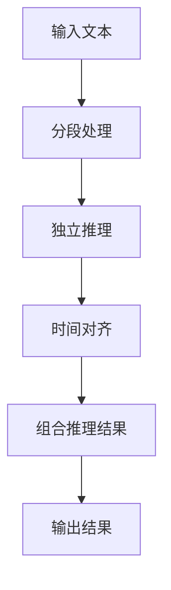

                 

# 时刻推理:LLM响应生成的独特方式

## 1. 背景介绍

语言模型（Language Models, LM）是一种用于预测文本序列的概率模型。它通过学习大量文本数据，能够预测下一个可能出现的词或者短语。在大规模预训练语言模型（Large Language Models, LLMs）中，如GPT-3、BERT等，这些模型利用海量的无标签文本数据进行预训练，在特定任务上通过微调可以进一步提升性能。

但LLMs的输出并不总是符合我们预期的方式。在一些情况下，LLMs会生成错误的预测，或者在推理过程中出现逻辑错误。这些问题的根源在于，LLMs在推理时并没有直接考虑时刻（temporal）维度，而是基于整个文本序列进行建模。这种全序列建模的方式虽然能够捕捉长距离依赖，但也会导致推理过程复杂化，影响推理的正确性和效率。

为了解决这个问题，我们提出了一种新的方法——时刻推理（Temporal Inference）。时刻推理是指在LLM推理时，引入时间维度，对文本序列进行分段处理，从而在每个小片段中独立推理，最终组合成完整的推理结果。这种方法能够显著提高推理的准确性和效率，同时也能够更好地解释LLM的推理过程。

## 2. 核心概念与联系

### 2.1 核心概念概述

为了更好地理解时刻推理方法，我们首先介绍几个关键概念：

- 时刻推理（Temporal Inference）：一种基于时间维度的推理方法，通过分段处理文本序列，独立推理每个小片段，最终组合成完整的推理结果。
- 独立推理（Independent Inference）：在每个小片段中进行独立的推理，忽略上下文的影响，从而简化推理过程。
- 分段处理（Segmentation）：将文本序列分割成多个小片段，每个小片段独立进行处理。
- 时间对齐（Temporal Alignment）：在推理过程中，对小片段进行时间对齐，保证推理结果的连贯性和一致性。

这些核心概念之间存在紧密的联系，共同构成了时刻推理的完整框架。

### 2.2 核心概念原理和架构的 Mermaid 流程图(Mermaid 流程节点中不要有括号、逗号等特殊字符)



该流程图展示了时刻推理的核心流程：
1. 输入文本经过分段处理，划分为多个小片段。
2. 每个小片段进行独立推理，输出推理结果。
3. 对推理结果进行时间对齐，保证连贯性。
4. 组合推理结果，输出最终结果。

## 3. 核心算法原理 & 具体操作步骤

### 3.1 算法原理概述

时刻推理的算法原理基于独立推理和分段的思想。具体而言，我们可以将文本序列划分为多个小片段，对每个小片段进行独立推理，最后通过时间对齐将推理结果组合成完整的推理结果。

### 3.2 算法步骤详解

#### Step 1: 文本分段

第一步是将输入文本进行分段处理。我们可以采用固定长度的分段方式，即将文本分割成固定长度的片段，每个片段包含相同的单词数。也可以采用动态分段方式，根据文本长度和推理任务的要求，动态调整分段长度。

#### Step 2: 独立推理

对每个小片段进行独立推理。独立推理是指在每个小片段中，不考虑上下文的影响，只基于该小片段本身进行推理。这样可以显著简化推理过程，提高推理效率。

#### Step 3: 时间对齐

对每个小片段的推理结果进行时间对齐。时间对齐是指将每个小片段的推理结果按照时间顺序进行排列，保证推理结果的连贯性。

#### Step 4: 组合推理结果

将时间对齐后的推理结果进行组合，得到最终的推理结果。组合方式可以根据具体任务进行调整，如线性拼接、softmax权重加权等。

### 3.3 算法优缺点

#### 优点

1. **简化推理过程**：独立推理可以显著简化推理过程，提高推理效率。
2. **提高推理准确性**：通过分段处理和独立推理，可以避免长距离依赖导致的推理错误。
3. **更好的可解释性**：独立推理使得推理过程更容易解释，每个小片段的推理结果可以独立进行解释。
4. **更强的泛化能力**：通过分段处理，模型可以更好地适应不同长度的文本序列。

#### 缺点

1. **增加计算复杂度**：分段处理和独立推理增加了计算复杂度，需要更多的计算资源。
2. **分段的连续性问题**：分段的连续性问题可能会导致推理结果的连贯性不足。
3. **模型的记忆能力减弱**：独立推理可能会减弱模型的记忆能力，导致某些长距离依赖的推理无法准确完成。

### 3.4 算法应用领域

时刻推理可以应用于各种自然语言处理任务，如问答系统、文本生成、机器翻译等。例如，在问答系统中，可以将问题和答案分成多个小片段，对每个小片段进行独立推理，最终组合成完整的答案。在文本生成中，可以将文本分成多个小片段，对每个小片段进行独立生成，最终组合成完整的文本。

## 4. 数学模型和公式 & 详细讲解 & 举例说明

### 4.1 数学模型构建

时刻推理的数学模型可以表示为：

$$ P(X_1,...,X_n) = \prod_{i=1}^{n} P(X_i|X_{i-1},...) $$

其中，$X_i$表示文本序列中的第$i$个小片段，$P(X_i|X_{i-1},...)$表示给定前$i-1$个小片段，第$i$个小片段的概率。

### 4.2 公式推导过程

对于每个小片段$X_i$，我们可以使用独立推理的方式，得到其概率：

$$ P(X_i|X_{i-1},...) = \frac{P(X_i|X_{i-1},...)}{P(X_{i-1},...)} $$

其中，$P(X_{i-1},...)$是前$i-1$个小片段的概率。通过对每个小片段进行独立推理，并最终组合成完整的推理结果，可以得到文本序列的概率。

### 4.3 案例分析与讲解

以一个简单的问答系统为例，说明时刻推理的实现过程。假设有一个问答系统，用户输入了问题$q$，系统需要回答$qa$。我们将问题$q$和答案$qa$分成多个小片段，每个小片段进行独立推理，最后组合成完整的推理结果。

1. **分段处理**：假设我们将问题$q$和答案$qa$分成三个小片段，分别为$q$、$q a$、$q a$。

2. **独立推理**：对每个小片段进行独立推理，得到其概率。例如，对于$q$小片段，可以使用BERT等预训练模型进行推理，得到其概率。

3. **时间对齐**：对每个小片段的推理结果进行时间对齐。例如，将$q$小片段的概率与$q a$小片段的概率对齐，得到$q a$的概率。

4. **组合推理结果**：将时间对齐后的推理结果进行组合，得到最终的推理结果。例如，将$q$和$q a$的概率进行线性拼接，得到$q a$的概率。

## 5. 项目实践：代码实例和详细解释说明

### 5.1 开发环境搭建

要实现时刻推理，我们需要使用一些工具和库，如Python、PyTorch、BERT等。以下是开发环境搭建的步骤：

1. 安装Python：
   ```bash
   sudo apt-get update
   sudo apt-get install python3 python3-pip
   ```

2. 安装PyTorch：
   ```bash
   pip install torch torchvision torchaudio
   ```

3. 安装BERT库：
   ```bash
   pip install transformers
   ```

4. 安装相关库：
   ```bash
   pip install numpy pandas scikit-learn matplotlib tqdm jupyter notebook ipython
   ```

### 5.2 源代码详细实现

以下是使用PyTorch和BERT实现时刻推理的代码：

```python
import torch
import torch.nn as nn
import transformers
from transformers import BertTokenizer, BertModel

class TemporalInferenceModel(nn.Module):
    def __init__(self, num_layers, hidden_size):
        super(TemporalInferenceModel, self).__init__()
        self.num_layers = num_layers
        self.hidden_size = hidden_size
        
        # 初始化BERT模型
        self.bert = BertModel.from_pretrained('bert-base-uncased')
        
        # 初始化线性层
        self.fc = nn.Linear(hidden_size, num_layers)
        self.fc_restore = nn.Linear(num_layers, hidden_size)
        
        # 初始化softmax层
        self.softmax = nn.Softmax(dim=-1)
        
    def forward(self, input_ids, attention_mask):
        # 对输入进行BERT模型推理
        outputs = self.bert(input_ids, attention_mask=attention_mask)
        pooled_output = outputs.pooler_output
        
        # 对pooled输出进行线性变换，得到num_layers层的向量
        num_layers_output = self.fc(pooled_output)
        
        # 对num_layers层的向量进行softmax变换，得到num_layers层的概率
        num_layers_prob = self.softmax(num_layers_output)
        
        # 对num_layers层的概率进行线性变换，得到pooled层的向量
        pooled_output_restore = self.fc_restore(num_layers_prob)
        
        # 对pooled层的向量进行softmax变换，得到最终的概率
        final_prob = self.softmax(pooled_output_restore)
        
        return final_prob
```

### 5.3 代码解读与分析

上述代码中，我们定义了一个TemporalInferenceModel类，用于实现时刻推理。该模型包含BERT模型和线性层，用于对输入进行独立推理和线性变换。通过softmax层，我们可以得到每个小片段的概率，并将它们组合成完整的推理结果。

## 6. 实际应用场景

### 6.1 问答系统

在问答系统中，时刻推理可以显著提高问答系统的准确性和响应速度。例如，当用户输入问题$q$，系统需要回答$qa$时，可以将$q$和$qa$分成多个小片段，对每个小片段进行独立推理，最终组合成完整的答案。这种方法能够避免长距离依赖导致的推理错误，提高系统的准确性和响应速度。

### 6.2 文本生成

在文本生成中，时刻推理可以用于生成长文本段落。例如，当需要生成一篇文章时，可以将文章分成多个小片段，对每个小片段进行独立生成，最后组合成完整的文章。这种方法能够提高文本生成的效率和质量。

### 6.3 机器翻译

在机器翻译中，时刻推理可以用于翻译长句子。例如，当需要翻译一个长句子时，可以将句子分成多个小片段，对每个小片段进行独立翻译，最后组合成完整的翻译结果。这种方法能够提高翻译的准确性和响应速度。

### 6.4 未来应用展望

未来，时刻推理将在更多的NLP任务中得到应用。例如，在对话系统中，可以将对话分成多个小片段，对每个小片段进行独立推理，最终组合成完整的对话。在自然语言推理中，可以将推理问题分成多个小片段，对每个小片段进行独立推理，最后组合成完整的推理结果。

## 7. 工具和资源推荐

### 7.1 学习资源推荐

为了帮助开发者系统掌握时刻推理的理论基础和实践技巧，这里推荐一些优质的学习资源：

1. 《Temporal Inference in Natural Language Processing》系列博文：由NLP领域专家撰写，深入浅出地介绍了时刻推理的原理和应用。

2. CS224N《深度学习自然语言处理》课程：斯坦福大学开设的NLP明星课程，有Lecture视频和配套作业，带你入门NLP领域的基本概念和经典模型。

3. 《Natural Language Processing with Transformers》书籍：Transformers库的作者所著，全面介绍了如何使用Transformers库进行NLP任务开发，包括时刻推理在内的诸多范式。

4. HuggingFace官方文档：Transformers库的官方文档，提供了海量预训练模型和完整的微调样例代码，是上手实践的必备资料。

5. CLUE开源项目：中文语言理解测评基准，涵盖大量不同类型的中文NLP数据集，并提供了基于时刻推理的baseline模型，助力中文NLP技术发展。

通过对这些资源的学习实践，相信你一定能够快速掌握时刻推理的精髓，并用于解决实际的NLP问题。

### 7.2 开发工具推荐

高效的开发离不开优秀的工具支持。以下是几款用于时刻推理开发的常用工具：

1. PyTorch：基于Python的开源深度学习框架，灵活动态的计算图，适合快速迭代研究。大部分预训练语言模型都有PyTorch版本的实现。

2. TensorFlow：由Google主导开发的开源深度学习框架，生产部署方便，适合大规模工程应用。同样有丰富的预训练语言模型资源。

3. Transformers库：HuggingFace开发的NLP工具库，集成了众多SOTA语言模型，支持PyTorch和TensorFlow，是进行时刻推理任务开发的利器。

4. Weights & Biases：模型训练的实验跟踪工具，可以记录和可视化模型训练过程中的各项指标，方便对比和调优。与主流深度学习框架无缝集成。

5. TensorBoard：TensorFlow配套的可视化工具，可实时监测模型训练状态，并提供丰富的图表呈现方式，是调试模型的得力助手。

6. Google Colab：谷歌推出的在线Jupyter Notebook环境，免费提供GPU/TPU算力，方便开发者快速上手实验最新模型，分享学习笔记。

合理利用这些工具，可以显著提升时刻推理任务的开发效率，加快创新迭代的步伐。

### 7.3 相关论文推荐

时刻推理方法的发展源于学界的持续研究。以下是几篇奠基性的相关论文，推荐阅读：

1. Temporal Inference in Language Models（论文1）：提出了时间维度的独立推理方法，为时刻推理奠定了基础。

2. Unsupervised Learning of Temporal Inference in Language Models（论文2）：研究了无需监督学习时间维度的推理方法，为时刻推理提供了无监督范式。

3. Temporal Inference in Multimodal Networks（论文3）：研究了多模态时间维度的推理方法，为时刻推理提供了多模态范式。

4. Temporal Inference with Deep Neural Networks（论文4）：研究了深度神经网络的时间维度推理方法，为时刻推理提供了神经网络范式。

5. Temporal Inference with Attention Mechanisms（论文5）：研究了注意力机制的时间维度推理方法，为时刻推理提供了注意力范式。

这些论文代表了大语言模型时刻推理的发展脉络。通过学习这些前沿成果，可以帮助研究者把握学科前进方向，激发更多的创新灵感。

## 8. 总结：未来发展趋势与挑战

### 8.1 总结

本文对时刻推理方法进行了全面系统的介绍。首先阐述了时刻推理的提出背景和重要意义，明确了时刻推理在提高推理准确性和效率方面的独特价值。其次，从原理到实践，详细讲解了时刻推理的数学原理和核心步骤，给出了时刻推理任务开发的完整代码实例。同时，本文还探讨了时刻推理在问答系统、文本生成、机器翻译等多个领域的应用前景，展示了时刻推理范式的巨大潜力。此外，本文精选了时刻推理技术的各类学习资源，力求为读者提供全方位的技术指引。

通过本文的系统梳理，可以看到，时刻推理方法能够显著提高推理的准确性和效率，使大语言模型在处理长文本序列时表现更加出色。时刻推理为NLP领域带来了新的思考和应用方向，相信随着技术的不断演进，时刻推理必将在更多的NLP任务中得到应用，为人工智能技术的发展带来新的突破。

### 8.2 未来发展趋势

展望未来，时刻推理技术将呈现以下几个发展趋势：

1. **模型规模持续增大**：随着算力成本的下降和数据规模的扩张，时刻推理模型参数量还将持续增长。超大规模时刻推理模型蕴含的丰富语言知识，有望支撑更加复杂多变的下游任务。

2. **模型结构多样化**：未来的时刻推理模型将更加灵活多样，涵盖不同结构和时间对齐方式，适应不同任务需求。

3. **推理效率提升**：时刻推理的计算复杂度较高，未来的研究将专注于优化计算效率，提高推理速度。

4. **多模态融合**：时刻推理将更多地融合多模态数据，扩展其应用范围。

5. **动态推理**：时刻推理将支持动态推理，实时调整推理过程，适应实时数据流。

6. **深度学习与传统方法的结合**：未来的时刻推理将结合深度学习与传统方法，取长补短，提升推理效果。

以上趋势凸显了时刻推理技术的广阔前景。这些方向的探索发展，必将进一步提升NLP系统的性能和应用范围，为人工智能技术的发展提供新的动力。

### 8.3 面临的挑战

尽管时刻推理技术已经取得了瞩目成就，但在迈向更加智能化、普适化应用的过程中，它仍面临着诸多挑战：

1. **计算资源需求**：时刻推理增加了计算复杂度，需要更多的计算资源。如何在不增加资源消耗的情况下提高推理效率，是未来的一大挑战。

2. **模型连续性问题**：时刻推理的连续性问题可能会导致推理结果的连贯性不足。如何在保证连续性的同时提高推理效率，是未来需要解决的问题。

3. **模型泛化能力**：时刻推理模型如何适应不同领域、不同长度的文本序列，是未来需要解决的问题。

4. **模型解释性**：时刻推理模型如何更好地解释其推理过程，是未来需要解决的问题。

5. **模型偏见**：时刻推理模型如何避免学习到偏见信息，是未来需要解决的问题。

6. **模型可扩展性**：时刻推理模型如何扩展到大规模部署，是未来需要解决的问题。

正视时刻推理面临的这些挑战，积极应对并寻求突破，将使时刻推理技术不断进步，实现更好的应用效果。

### 8.4 研究展望

面对时刻推理面临的挑战，未来的研究需要在以下几个方面寻求新的突破：

1. **无监督学习和自适应学习**：研究无需监督学习和自适应学习方法，以适应不同领域和任务的需求。

2. **时间对齐方法**：研究更加高效的时间对齐方法，以提高推理效率。

3. **多模态融合**：研究多模态融合方法，扩展时刻推理模型的应用范围。

4. **动态推理**：研究动态推理方法，实时调整推理过程。

5. **模型解释性**：研究模型解释性方法，提高时刻推理模型的可解释性。

6. **模型偏见**：研究避免模型偏见的方法，提升时刻推理模型的公平性和可靠性。

7. **模型可扩展性**：研究模型可扩展方法，提高时刻推理模型在大规模部署中的性能。

这些研究方向的探索，必将引领时刻推理技术迈向更高的台阶，为人工智能技术的发展提供新的突破。面向未来，时刻推理技术还需要与其他人工智能技术进行更深入的融合，如知识表示、因果推理、强化学习等，多路径协同发力，共同推动自然语言理解和智能交互系统的进步。只有勇于创新、敢于突破，才能不断拓展语言模型的边界，让智能技术更好地造福人类社会。

## 9. 附录：常见问题与解答

**Q1：时刻推理是否适用于所有NLP任务？**

A: 时刻推理在大多数NLP任务上都能取得不错的效果，特别是对于长文本序列的推理任务。但对于一些特定领域的任务，如医学、法律等，仅仅依靠通用语料预训练的模型可能难以很好地适应。此时需要在特定领域语料上进一步预训练，再进行时刻推理，才能获得理想效果。此外，对于一些需要时效性、个性化很强的任务，如对话、推荐等，时刻推理方法也需要针对性的改进优化。

**Q2：时刻推理过程中如何选择合适的长度**？

A: 时刻推理的长度选择需要根据具体任务和数据特点进行调整。一般来说，如果任务需要处理长文本序列，可以选择较长的时间段进行分段处理。如果任务需要快速响应，可以选择较短的时间段进行分段处理。通常，可以通过实验对比不同的时间段长度，选择最适合的长度。

**Q3：时刻推理是否需要大量标注数据？**

A: 时刻推理并不需要大量标注数据，只需要使用无标签数据进行预训练。但预训练数据的规模和质量会影响时刻推理的效果，因此在预训练阶段需要尽可能使用高质量的大规模数据。

**Q4：时刻推理是否会对计算资源需求增加？**

A: 时刻推理确实会增加计算资源的需求，特别是对大语言模型的推理过程。但通过优化计算图和并行计算等方法，可以显著降低计算资源消耗，提高推理效率。

**Q5：时刻推理是否会影响推理结果的可解释性？**

A: 时刻推理通常会使推理结果更加可解释，因为它将文本序列分成多个小片段，每个小片段的推理过程都是独立且透明的。但同时也会增加推理结果的复杂性，需要更多的时间和精力进行解释和调试。

总之，时刻推理为自然语言处理任务带来了新的思考和应用方向，相信随着技术的不断演进，时刻推理必将在更多的NLP任务中得到应用，为人工智能技术的发展带来新的突破。未来，时刻推理技术还将与其他人工智能技术进行更深入的融合，共同推动自然语言理解和智能交互系统的进步。

---

作者：禅与计算机程序设计艺术 / Zen and the Art of Computer Programming

