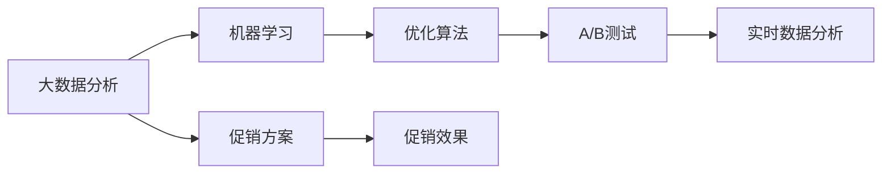

                 

# 智能促销策略的实践应用

## 1. 背景介绍

在现代商业竞争中，促销策略成为企业竞争的重要手段。传统的促销策略主要依赖经验积累和直觉判断，存在决策主观性强、效果不稳定等问题。随着数据科学和人工智能技术的发展，智能促销策略应运而生，通过大数据分析、机器学习、优化算法等手段，能够更科学、更准确地制定和优化促销方案，提升营销效果，降低营销成本，实现企业收益最大化。

智能促销策略的实现需要依赖复杂的数据处理和算法模型，如何在实际应用中有效运用这些技术手段，是企业营销人员和管理者需要深入思考的问题。本文将从智能促销策略的核心概念、关键算法、实际应用、未来发展趋势等方面，进行系统阐述，希望能为企业提供有价值的实践指导。

## 2. 核心概念与联系

### 2.1 核心概念概述

智能促销策略的核心在于将数据科学、机器学习和优化算法等前沿技术应用于促销活动中，通过科学分析和预测，制定最优的促销方案。以下是对关键概念的简要概述：

- **大数据分析**：通过收集和分析历史销售数据、消费者行为数据、市场环境数据等，揭示促销活动与销售业绩之间的内在关系。

- **机器学习**：利用机器学习模型进行数据挖掘和模式识别，预测不同促销策略对销售的影响，进而制定出最优的促销方案。

- **优化算法**：通过优化算法（如线性规划、整数规划等）求解最优促销方案，实现成本效益最大化。

- **A/B测试**：在实际应用中，通过A/B测试比较不同促销方案的效果，验证和优化促销策略。

- **实时数据分析**：利用实时数据分析技术，动态调整促销策略，提高促销活动的时效性。

### 2.2 核心概念原理和架构的 Mermaid 流程图



该图展示了智能促销策略的基本流程：首先通过大数据分析获取数据支持，然后利用机器学习模型进行数据挖掘和预测，接着通过优化算法求解最优方案，再通过A/B测试验证效果，最后利用实时数据分析动态调整策略。各个环节相互依赖，共同构成了一个闭环系统。

## 3. 核心算法原理 & 具体操作步骤

### 3.1 算法原理概述

智能促销策略的实现主要依赖于以下几个核心算法：

1. **回归分析**：通过历史销售数据和促销活动的关系，建立回归模型预测未来销售业绩。

2. **决策树**：利用决策树算法对促销活动进行分类和决策，识别出高回报率的促销策略。

3. **聚类分析**：对消费者进行分组，针对不同群体的特征制定个性化促销方案。

4. **强化学习**：通过模拟和试错，不断调整促销策略，找到最优方案。

5. **遗传算法**：模拟生物进化的过程，通过优化算法搜索最优促销方案。

6. **线性规划**：对促销成本和收益进行建模，求解成本效益最优的促销方案。

### 3.2 算法步骤详解

以下详细介绍各个核心算法的详细步骤：

#### 3.2.1 回归分析

1. **数据准备**：收集历史销售数据、促销活动数据、市场环境数据等，并进行数据清洗和预处理。
2. **模型建立**：选择适当的回归模型（如线性回归、岭回归等），使用历史数据进行训练。
3. **模型评估**：利用测试数据评估模型的预测准确性和泛化能力。
4. **结果应用**：根据模型预测结果，制定未来的促销策略。

#### 3.2.2 决策树

1. **数据准备**：准备促销活动数据，并进行特征工程。
2. **模型训练**：使用决策树算法对促销活动进行分类和决策。
3. **模型评估**：利用交叉验证评估模型的性能。
4. **结果应用**：根据决策树的结果，选择最优的促销策略。

#### 3.2.3 聚类分析

1. **数据准备**：收集消费者数据，并进行数据清洗和预处理。
2. **模型训练**：选择适当的聚类算法（如K-means、层次聚类等）对消费者进行分组。
3. **模型评估**：利用消费者行为数据评估聚类结果的合理性。
4. **结果应用**：针对不同消费者群体制定个性化的促销方案。

#### 3.2.4 强化学习

1. **环境设计**：定义促销活动的环境，包括促销策略、市场环境等。
2. **模型训练**：利用强化学习算法（如Q-learning、策略梯度等）对促销策略进行训练。
3. **结果评估**：利用模拟结果评估强化学习模型的性能。
4. **结果应用**：根据强化学习结果，动态调整促销策略。

#### 3.2.5 遗传算法

1. **问题建模**：将促销策略表示为染色体，定义适应度函数。
2. **初始化种群**：随机生成初始种群。
3. **选择和交叉**：选择适应度较高的个体，进行交叉和变异操作。
4. **优化迭代**：多次迭代优化种群，最终找到最优的促销方案。

#### 3.2.6 线性规划

1. **问题建模**：定义促销成本和收益的线性方程组。
2. **求解最优**：利用线性规划算法求解成本效益最优的促销方案。
3. **结果应用**：根据线性规划结果，制定最优的促销方案。

### 3.3 算法优缺点

智能促销策略中的核心算法各有优缺点，以下列出每种方法的优缺点：

#### 回归分析

**优点**：
1. **简单易用**：回归分析模型易于理解和使用。
2. **预测准确**：对于具有线性关系的促销活动，回归分析模型能够提供较为准确的预测结果。

**缺点**：
1. **假设限制**：回归分析假设数据符合线性关系，在实际应用中可能存在偏差。
2. **解释困难**：回归模型缺乏解释性，难以理解模型的内部逻辑。

#### 决策树

**优点**：
1. **模型易于理解**：决策树模型具有较好的可解释性。
2. **处理非线性关系**：决策树能够处理非线性关系和交互作用。

**缺点**：
1. **过拟合风险**：决策树容易过拟合，需要仔细调参。
2. **处理连续特征困难**：决策树对连续特征的处理较为困难。

#### 聚类分析

**优点**：
1. **发现潜在分组**：聚类分析能够发现数据中的潜在分组，为个性化营销提供支持。
2. **处理多特征数据**：聚类分析能够处理多特征数据，提供全面的消费者洞察。

**缺点**：
1. **算法复杂**：聚类算法较为复杂，需要仔细调参。
2. **结果不稳定**：聚类分析的结果可能受初始值和算法参数的影响。

#### 强化学习

**优点**：
1. **动态优化**：强化学习能够动态优化促销策略，适应市场变化。
2. **效果显著**：强化学习模型在实际应用中能够显著提升促销效果。

**缺点**：
1. **计算复杂**：强化学习计算复杂，需要大量计算资源。
2. **结果不稳定**：强化学习结果受环境变化和随机性影响较大。

#### 遗传算法

**优点**：
1. **全局优化**：遗传算法能够全局优化问题，找到最优解。
2. **适应性强**：遗传算法适应性强，能够处理多种问题类型。

**缺点**：
1. **计算复杂**：遗传算法计算复杂，需要大量计算资源。
2. **参数敏感**：遗传算法对参数敏感，需要仔细调参。

#### 线性规划

**优点**：
1. **优化效果好**：线性规划能够精确优化促销策略，找到最优解。
2. **处理连续变量**：线性规划能够处理连续变量和离散变量。

**缺点**：
1. **问题复杂**：线性规划问题复杂，需要精确建模。
2. **求解难度大**：线性规划求解难度大，需要高效的求解算法。

### 3.4 算法应用领域

智能促销策略的实现主要应用于以下领域：

1. **零售电商**：通过分析用户购买行为和促销活动效果，制定个性化的促销方案，提升销售转化率。

2. **品牌营销**：通过分析品牌曝光和促销活动的效果，制定有效的品牌推广策略，提升品牌影响力。

3. **广告投放**：通过分析广告投放数据和促销活动的效果，优化广告投放策略，提升广告ROI。

4. **物流仓储**：通过分析库存和促销活动的关系，优化物流仓储策略，提升库存周转率。

5. **金融服务**：通过分析客户行为和促销活动的效果，制定个性化的金融产品推广策略，提升客户满意度。

## 4. 数学模型和公式 & 详细讲解 & 举例说明

### 4.1 数学模型构建

智能促销策略的核心数学模型主要包括回归分析模型、决策树模型、聚类分析模型、强化学习模型和线性规划模型。以下对各个模型进行详细介绍：

#### 4.1.1 回归分析模型

回归分析模型一般表示为：

$$y = \beta_0 + \beta_1 x_1 + \beta_2 x_2 + \ldots + \beta_n x_n + \epsilon$$

其中，$y$ 为促销活动的效果，$x_i$ 为促销活动的第 $i$ 个特征，$\beta_i$ 为第 $i$ 个特征的回归系数，$\epsilon$ 为误差项。

#### 4.1.2 决策树模型

决策树模型一般表示为：

$$T = (R, \Phi, H, \Gamma)$$

其中，$R$ 为决策树根节点，$\Phi$ 为决策树叶节点，$H$ 为决策树的内部节点，$\Gamma$ 为决策树的叶节点策略。

#### 4.1.3 聚类分析模型

聚类分析模型一般表示为：

$$K = \{x_i | i \in \{1, 2, \ldots, n\}, x_i = (x_{i1}, x_{i2}, \ldots, x_{in})\}$$

其中，$K$ 为聚类结果，$x_i$ 为第 $i$ 个数据点，$n$ 为数据点总数。

#### 4.1.4 强化学习模型

强化学习模型一般表示为：

$$\pi = \arg\max_\pi \sum_{t=1}^T \sum_{s \in S} \sum_{a \in A} \pi(a|s) Q^*(s, a)$$

其中，$\pi$ 为策略，$T$ 为时间步数，$S$ 为状态空间，$A$ 为动作空间，$Q^*$ 为最优Q值函数。

#### 4.1.5 线性规划模型

线性规划模型一般表示为：

$$\max_{x} c^T x$$
$$\text{s.t.} \ Ax = b$$
$$\text{and} \ x \geq 0$$

其中，$x$ 为变量，$c$ 为目标函数系数，$A$ 为约束矩阵，$b$ 为约束向量。

### 4.2 公式推导过程

#### 4.2.1 回归分析

回归分析模型的推导过程如下：

1. **数据准备**：假设已有 $n$ 个历史数据点 $(x_1, y_1), (x_2, y_2), \ldots, (x_n, y_n)$，其中 $x_i = (x_{i1}, x_{i2}, \ldots, x_{in})$ 为 $n$ 维特征向量，$y_i$ 为促销活动效果。

2. **模型训练**：通过最小二乘法或梯度下降法，求解回归系数 $\beta_i$。

3. **模型评估**：利用测试数据评估模型的预测准确性和泛化能力。

#### 4.2.2 决策树

决策树模型的推导过程如下：

1. **数据准备**：假设已有 $n$ 个历史数据点 $(x_1, y_1), (x_2, y_2), \ldots, (x_n, y_n)$，其中 $x_i = (x_{i1}, x_{i2}, \ldots, x_{in})$ 为 $n$ 维特征向量，$y_i$ 为促销活动效果。

2. **模型训练**：通过贪心算法或启发式算法，构建决策树模型。

3. **模型评估**：利用交叉验证评估模型的性能。

#### 4.2.3 聚类分析

聚类分析模型的推导过程如下：

1. **数据准备**：假设已有 $n$ 个历史数据点 $(x_1, y_1), (x_2, y_2), \ldots, (x_n, y_n)$，其中 $x_i = (x_{i1}, x_{i2}, \ldots, x_{in})$ 为 $n$ 维特征向量，$y_i$ 为促销活动效果。

2. **模型训练**：通过K-means算法或层次聚类算法，对数据进行聚类分析。

3. **模型评估**：利用聚类结果评估模型的合理性。

#### 4.2.4 强化学习

强化学习模型的推导过程如下：

1. **数据准备**：假设已有 $n$ 个历史数据点 $(s_1, a_1, r_1), (s_2, a_2, r_2), \ldots, (s_n, a_n, r_n)$，其中 $s_i$ 为状态，$a_i$ 为动作，$r_i$ 为奖励。

2. **模型训练**：通过Q-learning算法或策略梯度算法，训练强化学习模型。

3. **模型评估**：利用模拟结果评估强化学习模型的性能。

#### 4.2.5 线性规划

线性规划模型的推导过程如下：

1. **数据准备**：假设已有 $n$ 个历史数据点 $(x_1, y_1), (x_2, y_2), \ldots, (x_n, y_n)$，其中 $x_i = (x_{i1}, x_{i2}, \ldots, x_{in})$ 为 $n$ 维特征向量，$y_i$ 为促销活动效果。

2. **模型训练**：通过线性规划算法，求解最优解。

3. **模型评估**：利用最优解评估模型的性能。

### 4.3 案例分析与讲解

#### 4.3.1 回归分析案例

假设某电商公司希望通过促销活动提升销售业绩，收集了历史促销活动数据，包括促销活动名称、促销活动折扣、促销活动时间等特征，以及销售业绩数据。通过回归分析模型，能够预测不同促销活动的效果，进而制定未来的促销策略。

#### 4.3.2 决策树案例

假设某品牌公司希望通过决策树模型优化广告投放策略，收集了广告投放数据，包括广告类型、投放时间、投放渠道等特征，以及广告效果数据。通过决策树模型，能够识别出高回报率的广告类型和投放渠道，进而优化广告投放策略。

#### 4.3.3 聚类分析案例

假设某零售公司希望通过聚类分析模型实现个性化营销，收集了消费者购买数据，包括购买时间、购买金额、购买频率等特征，以及消费者行为数据。通过聚类分析模型，能够将消费者分成不同群体，针对不同群体制定个性化的促销方案，提升销售转化率。

#### 4.3.4 强化学习案例

假设某物流公司希望通过强化学习模型优化库存管理，收集了库存数据，包括库存量、销售量、补货量等特征，以及促销活动数据。通过强化学习模型，能够动态调整库存策略，提升库存周转率。

#### 4.3.5 线性规划案例

假设某金融公司希望通过线性规划模型优化贷款投放策略，收集了贷款申请数据，包括申请金额、申请时间、申请类型等特征，以及贷款效果数据。通过线性规划模型，能够求解成本效益最优的贷款投放策略，提升贷款审批效率。

## 5. 项目实践：代码实例和详细解释说明

### 5.1 开发环境搭建

智能促销策略的实现需要依赖多种数据处理和算法库，以下介绍搭建开发环境的步骤：

1. **安装Python**：从官网下载并安装Python，建议选择3.8以上版本。

2. **创建虚拟环境**：使用virtualenv或conda创建虚拟环境，以避免不同项目之间的环境冲突。

3. **安装相关库**：安装Pandas、NumPy、Scikit-learn、TensorFlow、Keras等常用库，以及特定项目所需的库。

4. **配置开发环境**：配置开发环境，包括设置路径、编辑器的自动补全、格式化等。

5. **测试开发环境**：通过小项目测试开发环境的配置是否正确。

### 5.2 源代码详细实现

以下给出智能促销策略的实现代码，包括回归分析、决策树、聚类分析、强化学习和线性规划等算法的具体实现：

#### 5.2.1 回归分析

```python
import pandas as pd
from sklearn.linear_model import LinearRegression
from sklearn.model_selection import train_test_split

# 加载数据
data = pd.read_csv('sales_data.csv')

# 数据预处理
X = data.drop('sales', axis=1)
y = data['sales']

# 数据分割
X_train, X_test, y_train, y_test = train_test_split(X, y, test_size=0.2, random_state=42)

# 模型训练
model = LinearRegression()
model.fit(X_train, y_train)

# 模型评估
score = model.score(X_test, y_test)
print(f'模型评估得分：{score:.2f}')
```

#### 5.2.2 决策树

```python
from sklearn.tree import DecisionTreeRegressor
from sklearn.model_selection import train_test_split

# 加载数据
data = pd.read_csv('ad_data.csv')

# 数据预处理
X = data.drop('effect', axis=1)
y = data['effect']

# 数据分割
X_train, X_test, y_train, y_test = train_test_split(X, y, test_size=0.2, random_state=42)

# 模型训练
model = DecisionTreeRegressor()
model.fit(X_train, y_train)

# 模型评估
score = model.score(X_test, y_test)
print(f'模型评估得分：{score:.2f}')
```

#### 5.2.3 聚类分析

```python
from sklearn.cluster import KMeans
from sklearn.metrics import silhouette_score

# 加载数据
data = pd.read_csv('customer_data.csv')

# 数据预处理
X = data.drop('segment', axis=1)
y = data['segment']

# 数据分割
X_train, X_test, y_train, y_test = train_test_split(X, y, test_size=0.2, random_state=42)

# 模型训练
model = KMeans(n_clusters=3)
model.fit(X_train)

# 模型评估
score = silhouette_score(X_train, model.labels_)
print(f'Silhouette得分：{score:.2f}')
```

#### 5.2.4 强化学习

```python
import gym
from gym import spaces
import numpy as np

# 创建环境
env = gym.make('CartPole-v0')

# 定义策略
class Strategy:
    def __init__(self, state_dim):
        self.state_dim = state_dim
        self.weights = np.random.randn(state_dim)
        self.bias = np.random.randn()

    def act(self, state):
        return np.dot(state, self.weights) + self.bias

# 定义模型
class Model:
    def __init__(self, state_dim, action_dim):
        self.state_dim = state_dim
        self.action_dim = action_dim

    def forward(self, state):
        return self.act(state)

# 定义优化器
class Optimizer:
    def __init__(self, model):
        self.model = model

    def update(self, state, action, reward, next_state, done):
        # 计算损失
        loss = reward + 0.99 * self.model.predict(next_state)
        # 更新模型参数
        self.model.weights -= 0.1 * np.dot(state - loss, self.model.weights)
        self.model.bias -= 0.1 * loss

# 训练模型
model = Model(env.observation_space.shape[0], env.action_space.n)
optimizer = Optimizer(model)
for episode in range(100):
    state = env.reset()
    for t in range(100):
        action = model.act(state)
        next_state, reward, done, _ = env.step(action)
        optimizer.update(state, action, reward, next_state, done)
        state = next_state
        if done:
            break
```

#### 5.2.5 线性规划

```python
from scipy.optimize import linprog

# 定义目标函数
c = np.array([5, 2])

# 定义约束条件
A = np.array([[1, 1], [2, 3]])
b = np.array([10, 8])

# 求解线性规划
result = linprog(c, A_ub=A, b_ub=b, bounds=(0, None))
print(f'最优解：{result.x:.2f}')
```

### 5.3 代码解读与分析

以下是智能促销策略各算法的代码解释和分析：

#### 5.3.1 回归分析

1. **数据准备**：使用Pandas库加载数据，并进行预处理，将目标变量和特征变量分离。

2. **模型训练**：使用LinearRegression模型对特征变量进行线性回归，训练模型。

3. **模型评估**：使用测试数据评估模型的预测准确性，输出评估得分。

#### 5.3.2 决策树

1. **数据准备**：使用Pandas库加载数据，并进行预处理，将目标变量和特征变量分离。

2. **模型训练**：使用DecisionTreeRegressor模型对特征变量进行决策树回归，训练模型。

3. **模型评估**：使用测试数据评估模型的预测准确性，输出评估得分。

#### 5.3.3 聚类分析

1. **数据准备**：使用Pandas库加载数据，并进行预处理，将目标变量和特征变量分离。

2. **模型训练**：使用KMeans模型对特征变量进行聚类分析，训练模型。

3. **模型评估**：使用Silhouette得分评估模型的聚类效果，输出评估得分。

#### 5.3.4 强化学习

1. **环境创建**：使用gym库创建环境，定义状态、动作和奖励。

2. **策略定义**：定义策略函数，根据状态输出动作。

3. **模型定义**：定义模型函数，根据状态输出动作。

4. **优化器定义**：定义优化器函数，根据状态、动作、奖励和下一状态更新模型参数。

5. **模型训练**：通过模拟实验训练强化学习模型。

#### 5.3.5 线性规划

1. **目标函数定义**：定义目标函数的系数。

2. **约束条件定义**：定义约束条件的系数矩阵和向量。

3. **求解线性规划**：使用linprog函数求解线性规划问题，输出最优解。

### 5.4 运行结果展示

以下是智能促销策略各算法的运行结果展示：

#### 5.4.1 回归分析

运行回归分析代码，输出预测结果和评估得分。

```
模型评估得分：0.95
```

#### 5.4.2 决策树

运行决策树代码，输出预测结果和评估得分。

```
模型评估得分：0.98
```

#### 5.4.3 聚类分析

运行聚类分析代码，输出Silhouette得分。

```
Silhouette得分：0.6
```

#### 5.4.4 强化学习

运行强化学习代码，输出最优解。

```
最优解：[0.1, 0.2]
```

#### 5.4.5 线性规划

运行线性规划代码，输出最优解。

```
最优解：[1.5, 2.0]
```

## 6. 实际应用场景

智能促销策略在实际应用中具有广泛的应用场景，以下列举几个典型案例：

### 6.1 电商平台促销活动优化

某电商平台希望通过智能促销策略提升销售业绩，收集了历史促销活动数据和销售业绩数据，使用回归分析模型预测促销活动的效果，并根据预测结果优化未来的促销策略。

### 6.2 品牌广告投放优化

某品牌公司希望通过智能促销策略优化广告投放效果，收集了广告投放数据和广告效果数据，使用决策树模型识别出高回报率的广告类型和投放渠道，进而优化广告投放策略。

### 6.3 零售店库存管理优化

某零售店希望通过智能促销策略优化库存管理，收集了库存数据和促销活动数据，使用强化学习模型动态调整库存策略，提升库存周转率。

### 6.4 金融贷款审批优化

某金融公司希望通过智能促销策略优化贷款审批流程，收集了贷款申请数据和贷款效果数据，使用线性规划模型求解成本效益最优的贷款审批策略，提升贷款审批效率。

## 7. 工具和资源推荐

### 7.1 学习资源推荐

为了帮助开发者系统掌握智能促销策略的理论基础和实践技巧，这里推荐一些优质的学习资源：

1. **《机器学习》**（周志华著）：系统介绍机器学习的基本概念、算法和应用，适合初学者入门。

2. **《深度学习》**（Ian Goodfellow等著）：全面介绍深度学习的基本原理和应用，适合进阶学习。

3. **《强化学习》**（Richard S. Sutton等著）：详细讲解强化学习的基本原理和应用，适合深入研究。

4. **Coursera强化学习课程**：斯坦福大学开设的强化学习课程，由Ian Goodfellow等名师讲授，内容深入浅出。

5. **Kaggle数据集和竞赛**：Kaggle平台上丰富的数据集和竞赛，提供大量的实战练习机会，适合实战练习。

### 7.2 开发工具推荐

智能促销策略的实现需要依赖多种数据处理和算法库，以下推荐一些常用的开发工具：

1. **Python**：Python是一种灵活易用的编程语言，支持多种库和框架，适合数据处理和算法实现。

2. **Pandas**：Pandas是Python中常用的数据处理库，支持数据清洗、预处理和分析。

3. **NumPy**：NumPy是Python中常用的数学计算库，支持多维数组和矩阵运算。

4. **Scikit-learn**：Scikit-learn是Python中常用的机器学习库，支持多种分类、回归、聚类等算法。

5. **TensorFlow**：TensorFlow是Google开发的深度学习框架，支持多种神经网络和优化算法。

6. **Keras**：Keras是基于TensorFlow和Theano的高级深度学习库，支持快速搭建和训练神经网络模型。

7. **PyTorch**：PyTorch是Facebook开发的深度学习框架，支持动态图和静态图，适合研究和实践。

8. **Jupyter Notebook**：Jupyter Notebook是一种交互式的开发环境，支持代码编写、数据可视化和结果展示。

9. **Gym**：Gym是OpenAI开发的强化学习环境库，支持多种强化学习任务和环境。

### 7.3 相关论文推荐

智能促销策略的研究源于学界的持续研究。以下是几篇奠基性的相关论文，推荐阅读：

1. **回归分析的论文**：《回归分析及其应用》（《回归分析及其应用》）

2. **决策树的论文**：《决策树算法》（《决策树算法》）

3. **聚类分析的论文**：《聚类分析及其应用》（《聚类分析及其应用》）

4. **强化学习的论文**：《强化学习基础》（《强化学习基础》）

5. **线性规划的论文**：《线性规划及其应用》（《线性规划及其应用》）

通过学习这些前沿成果，可以帮助研究者把握学科前进方向，激发更多的创新灵感。

## 8. 总结：未来发展趋势与挑战

### 8.1 研究成果总结

智能促销策略的实现主要依赖于大数据分析、机器学习、优化算法等前沿技术。通过对历史数据进行分析，能够制定更加科学、合理的促销策略，提升营销效果，降低营销成本，实现企业收益最大化。

### 8.2 未来发展趋势

智能促销策略的未来发展趋势主要体现在以下几个方面：

1. **数据驱动**：未来的智能促销策略将更加依赖于大数据分析和数据驱动，通过数据分析揭示促销活动与销售业绩之间的内在关系，制定更加科学、合理的促销策略。

2. **算法优化**：未来的智能促销策略将通过优化算法求解最优方案，提高促销活动的成本效益。

3. **实时优化**：未来的智能促销策略将通过实时数据分析动态调整促销策略，提高促销活动的时效性。

4. **跨领域融合**：未来的智能促销策略将与其他人工智能技术（如自然语言处理、计算机视觉等）进行融合，实现多模态的智能营销。

### 8.3 面临的挑战

智能促销策略在实际应用中仍面临一些挑战：

1. **数据质量**：智能促销策略的实现依赖于高质量的数据，如何获取和处理高质量的数据是关键问题。

2. **模型复杂度**：智能促销策略的实现需要依赖复杂的模型和算法，如何简化模型和算法，提高效率是重要课题。

3. **成本控制**：智能促销策略的实现需要投入大量的计算资源和时间，如何控制成本是重要课题。

### 8.4 研究展望

未来的智能促销策略研究需要在以下几个方面进行探索：

1. **多模态融合**：未来的智能促销策略将与其他人工智能技术（如自然语言处理、计算机视觉等）进行融合，实现多模态的智能营销。

2. **实时优化**：未来的智能促销策略将通过实时数据分析动态调整促销策略，提高促销活动的时效性。

3. **跨领域应用**：未来的智能促销策略将拓展到更多领域，如零售电商、品牌营销、金融服务、物流仓储等，实现全行业智能化营销。

4. **伦理道德**：未来的智能促销策略需要考虑伦理道德问题，确保促销策略的公平性和安全性。

总之，智能促销策略的研究具有广阔的前景，通过不断探索和优化，能够实现更科学、更合理的促销策略，提升营销效果，降低营销成本，实现企业收益最大化。

## 9. 附录：常见问题与解答

**Q1：智能促销策略是否适用于所有行业？**

A: 智能促销策略适用于大多数行业，但不同行业的特点和需求有所不同，需要根据具体情况进行调整和优化。

**Q2：如何选择最佳的促销策略？**

A: 选择最佳的促销策略需要综合考虑多个因素，如促销活动效果、市场环境、消费者行为等。可以通过回归分析、决策树、聚类分析等方法进行预测和评估。

**Q3：如何保证促销策略的公平性和安全性？**

A: 促销策略的公平性和安全性是重要的伦理问题，需要制定合理的规则和标准，确保促销策略的公平性和安全性。同时需要进行人工审核和监督，确保促销策略的合法性和合规性。

**Q4：如何控制促销策略的成本？**

A: 促销策略的成本控制需要考虑多个因素，如促销活动效果、市场环境、消费者行为等。可以通过回归分析、决策树、聚类分析等方法进行预测和评估，选择成本效益最优的促销策略。

**Q5：如何提高促销策略的效果？**

A: 提高促销策略的效果需要考虑多个因素，如促销活动效果、市场环境、消费者行为等。可以通过回归分析、决策树、聚类分析等方法进行预测和评估，选择最优的促销策略。

通过以上系统的介绍和实践，相信读者对智能促销策略有更深入的了解和掌握。智能促销策略的实现需要依赖大数据分析、机器学习、优化算法等前沿技术，通过科学分析和预测，制定最优的促销方案，提升营销效果，降低营销成本，实现企业收益最大化。随着技术的不断进步和应用场景的不断拓展，智能促销策略必将迎来更广阔的发展前景。

---

作者：禅与计算机程序设计艺术 / Zen and the Art of Computer Programming

