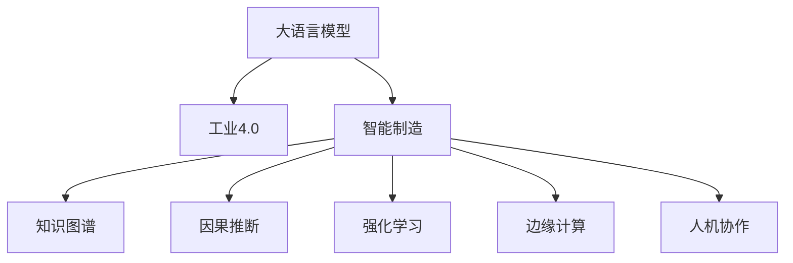

                 

## 1. 背景介绍

### 1.1 问题由来

在第四次工业革命浪潮下，智能制造成为制造业转型的重要方向。以大语言模型(Large Language Model, LLM)为代表的人工智能技术，正逐步融入工业制造的各个环节，显著提升了制造业的生产效率、质量控制、供应链管理等核心能力。传统制造业往往以机械自动化为主，而智能制造则在此基础上，进一步融入数据分析、算法优化、人机协作等智能元素，从而提升整个生产系统的智能化水平。

### 1.2 问题核心关键点

当前，LLM在工业4.0中的应用主要体现在以下几个方面：

- **智能调度与优化**：通过预测分析和自动化调度，优化生产线的运行效率。
- **质量控制与检测**：实时监控生产质量，自动化检测产品缺陷。
- **供应链管理与预测**：实时分析供应链数据，优化库存管理和物流调度。
- **设备维护与监控**：通过数据分析，实现设备状态的实时监测和维护。
- **工艺优化与仿真**：利用模拟仿真，优化工艺流程，提升生产效率和质量。
- **人机协作与培训**：提升操作人员的技能水平，减少误操作，提高人机协作效率。

LLM在工业4.0中的应用，使得制造业能够更加精准、高效、智能化地运行，从而提升整体竞争力和市场响应速度。

### 1.3 问题研究意义

在工业4.0背景下，LLM的应用不仅提升了制造业的技术水平，更改变了其传统的生产方式。通过智能化、数字化改造，制造业可以更加灵活、高效地应对市场变化，提升整体竞争力和市场响应速度。

- **降低生产成本**：智能调度与优化，使得生产效率提升，减少了生产中的浪费和冗余。
- **提高产品质量**：通过实时监控与检测，显著提高了产品的合格率。
- **增强供应链管理**：实时分析与预测，使得供应链更加高效、透明。
- **设备可靠性提升**：精准的设备维护与监控，减少了停机时间，提升了设备利用率。
- **工艺与仿真优化**：模拟仿真技术，使得工艺流程更加科学、高效。
- **人机协作提升**：操作人员的智能培训与辅助，提升了工作效率与准确性。

## 2. 核心概念与联系

### 2.1 核心概念概述

为更好地理解LLM在工业4.0中的应用，本节将介绍几个关键概念：

- **大语言模型(Large Language Model, LLM)**：以自回归(如GPT)或自编码(如BERT)模型为代表的大规模预训练语言模型。通过在大规模无标签文本数据上进行预训练，学习通用的语言表示，具备强大的语言理解和生成能力。

- **工业4.0(Industry 4.0)**：基于互联网和新一代信息技术的集成制造体系，强调网络、信息、物理系统的深度融合，实现智能化生产。

- **智能制造(Smart Manufacturing)**：通过引入物联网、大数据、云计算等技术，实现生产过程的数字化、网络化、智能化，提升生产效率和质量。

- **知识图谱(Knowledge Graph)**：用于表示实体及其关系的数据结构，用于辅助智能制造中的知识管理与检索。

- **因果推断(Causal Inference)**：用于研究变量之间的因果关系，帮助智能制造系统建立更为准确的预测模型。

- **强化学习(Reinforcement Learning, RL)**：通过奖惩机制驱动智能体进行策略学习，优化决策和控制。

- **边缘计算(Edge Computing)**：在靠近数据源的地方进行数据处理和分析，提高数据处理的实时性和效率。

- **人机协作(Human-Machine Collaboration)**：通过智能系统与操作人员的高效交互，实现任务自动分配、操作辅助等功能。

这些核心概念之间的逻辑关系可以通过以下Mermaid流程图来展示：



这个流程图展示了大语言模型在工业4.0背景下的核心概念及其之间的关系：

1. 大语言模型通过预训练获得基础能力。
2. 在智能制造系统中，大语言模型通过微调获得特定任务能力。
3. 知识图谱和因果推断辅助智能制造系统建立知识管理和预测模型。
4. 强化学习提升智能制造系统的决策优化能力。
5. 边缘计算提高数据的实时处理能力。
6. 人机协作增强操作人员的智能辅助，提升效率。

## 3. 核心算法原理 & 具体操作步骤
### 3.1 算法原理概述

基于LLM的智能制造系统，本质上是一个多模态、跨领域的综合智能决策系统。其核心思想是：将预训练的LLM模型视作一个强大的"特征提取器"，通过在特定的工业场景下进行微调，使得模型具备特定的任务能力，从而提升整个生产系统的智能化水平。

形式化地，假设预训练语言模型为 $M_{\theta}$，其中 $\theta$ 为预训练得到的模型参数。给定工业制造系统的任务 $T$ 的输入输出数据集 $D=\{(x_i, y_i)\}_{i=1}^N$，智能制造系统的优化目标是最小化经验风险，即找到最优参数：

$$
\theta^* = \mathop{\arg\min}_{\theta} \mathcal{L}(M_{\theta},D)
$$

其中 $\mathcal{L}$ 为针对任务 $T$ 设计的损失函数，用于衡量模型预测输出与真实标签之间的差异。常见的损失函数包括交叉熵损失、均方误差损失等。

通过梯度下降等优化算法，智能制造系统不断更新模型参数 $\theta$，最小化损失函数 $\mathcal{L}$，使得模型输出逼近真实标签。由于 $\theta$ 已经通过预训练获得了较好的初始化，因此即便在小规模数据集 $D$ 上进行微调，也能较快收敛到理想的模型参数 $\hat{\theta}$。

### 3.2 算法步骤详解

基于LLM的智能制造系统一般包括以下几个关键步骤：

**Step 1: 准备预训练模型和数据集**
- 选择合适的预训练语言模型 $M_{\theta}$ 作为初始化参数，如 BERT、GPT等。
- 准备工业制造系统任务 $T$ 的输入输出数据集 $D$，划分为训练集、验证集和测试集。一般要求输入输出数据与预训练数据的分布不要差异过大。

**Step 2: 添加任务适配层**
- 根据任务类型，在预训练模型顶层设计合适的输出层和损失函数。
- 对于分类任务，通常在顶层添加线性分类器和交叉熵损失函数。
- 对于生成任务，通常使用语言模型的解码器输出概率分布，并以负对数似然为损失函数。

**Step 3: 设置微调超参数**
- 选择合适的优化算法及其参数，如 AdamW、SGD 等，设置学习率、批大小、迭代轮数等。
- 设置正则化技术及强度，包括权重衰减、Dropout、Early Stopping等。
- 确定冻结预训练参数的策略，如仅微调顶层，或全部参数都参与微调。

**Step 4: 执行梯度训练**
- 将训练集数据分批次输入模型，前向传播计算损失函数。
- 反向传播计算参数梯度，根据设定的优化算法和学习率更新模型参数。
- 周期性在验证集上评估模型性能，根据性能指标决定是否触发 Early Stopping。
- 重复上述步骤直到满足预设的迭代轮数或 Early Stopping 条件。

**Step 5: 测试和部署**
- 在测试集上评估微调后模型 $M_{\hat{\theta}}$ 的性能，对比微调前后的精度提升。
- 使用微调后的模型对新样本进行推理预测，集成到实际的生产系统中。
- 持续收集新的数据，定期重新微调模型，以适应数据分布的变化。

以上是基于LLM的智能制造系统的一般流程。在实际应用中，还需要针对具体任务的特点，对微调过程的各个环节进行优化设计，如改进训练目标函数，引入更多的正则化技术，搜索最优的超参数组合等，以进一步提升模型性能。

### 3.3 算法优缺点

基于LLM的智能制造方法具有以下优点：
1. 高效适配。通过微调，LLM能够快速适应特定工业制造任务，提升系统效率和质量。
2. 泛化能力强。大语言模型学习到通用的语言表示，能够适应不同领域的工业制造任务。
3. 数据需求低。相比从头训练，微调需要的标注数据量较少，降低了成本。
4. 精度高。微调过程可以显著提升模型在特定任务上的性能。

同时，该方法也存在一定的局限性：
1. 依赖标注数据。微调的效果很大程度上取决于标注数据的质量和数量，获取高质量标注数据的成本较高。
2. 迁移能力有限。当目标任务与预训练数据的分布差异较大时，微调的性能提升有限。
3. 模型复杂度高。大语言模型的参数量较大，在部署时需要较高的算力和存储资源。

尽管存在这些局限性，但就目前而言，基于LLM的微调方法仍是智能制造系统中最具前景的技术范式。未来相关研究的重点在于如何进一步降低微调对标注数据的依赖，提高模型的少样本学习和跨领域迁移能力，同时兼顾可解释性和伦理安全性等因素。

### 3.4 算法应用领域

基于LLM的智能制造方法在制造业的多个环节都有应用，例如：

- **智能调度与优化**：使用预测模型对生产任务进行优化调度，提高生产效率。
- **质量控制与检测**：实时监控产品质量，通过自然语言描述检测缺陷。
- **供应链管理与预测**：实时分析供应链数据，优化库存管理和物流调度。
- **设备维护与监控**：通过数据分析，实现设备状态的实时监测和维护。
- **工艺优化与仿真**：利用模拟仿真，优化工艺流程，提升生产效率和质量。
- **人机协作与培训**：提升操作人员的技能水平，减少误操作，提高人机协作效率。

除了上述这些经典应用外，LLM还被创新性地应用到更多场景中，如基于视觉数据的智能识别、基于语音数据的智能控制、基于自然语言指令的智能辅助等，为智能制造技术带来了全新的突破。随着预训练模型和微调方法的不断进步，相信智能制造技术将在更广阔的应用领域大放异彩。

## 4. 数学模型和公式 & 详细讲解  
### 4.1 数学模型构建

本节将使用数学语言对基于LLM的智能制造系统微调过程进行更加严格的刻画。

记预训练语言模型为 $M_{\theta}$，其中 $\theta$ 为预训练得到的模型参数。假设智能制造系统的任务 $T$ 的输入输出数据集为 $D=\{(x_i,y_i)\}_{i=1}^N, x_i \in \mathcal{X}, y_i \in \mathcal{Y}$。

定义模型 $M_{\theta}$ 在数据样本 $(x,y)$ 上的损失函数为 $\ell(M_{\theta}(x),y)$，则在数据集 $D$ 上的经验风险为：

$$
\mathcal{L}(\theta) = \frac{1}{N} \sum_{i=1}^N \ell(M_{\theta}(x_i),y_i)
$$

微调的优化目标是最小化经验风险，即找到最优参数：

$$
\theta^* = \mathop{\arg\min}_{\theta} \mathcal{L}(\theta)
$$

在实践中，我们通常使用基于梯度的优化算法（如SGD、Adam等）来近似求解上述最优化问题。设 $\eta$ 为学习率，$\lambda$ 为正则化系数，则参数的更新公式为：

$$
\theta \leftarrow \theta - \eta \nabla_{\theta}\mathcal{L}(\theta) - \eta\lambda\theta
$$

其中 $\nabla_{\theta}\mathcal{L}(\theta)$ 为损失函数对参数 $\theta$ 的梯度，可通过反向传播算法高效计算。

### 4.2 公式推导过程

以下我们以质量控制任务为例，推导交叉熵损失函数及其梯度的计算公式。

假设模型 $M_{\theta}$ 在输入 $x$ 上的输出为 $\hat{y}=M_{\theta}(x) \in [0,1]$，表示样本属于正类的概率。真实标签 $y \in \{0,1\}$。则二分类交叉熵损失函数定义为：

$$
\ell(M_{\theta}(x),y) = -[y\log \hat{y} + (1-y)\log (1-\hat{y})]
$$

将其代入经验风险公式，得：

$$
\mathcal{L}(\theta) = -\frac{1}{N}\sum_{i=1}^N [y_i\log M_{\theta}(x_i)+(1-y_i)\log(1-M_{\theta}(x_i))]
$$

根据链式法则，损失函数对参数 $\theta_k$ 的梯度为：

$$
\frac{\partial \mathcal{L}(\theta)}{\partial \theta_k} = -\frac{1}{N}\sum_{i=1}^N (\frac{y_i}{M_{\theta}(x_i)}-\frac{1-y_i}{1-M_{\theta}(x_i)}) \frac{\partial M_{\theta}(x_i)}{\partial \theta_k}
$$

其中 $\frac{\partial M_{\theta}(x_i)}{\partial \theta_k}$ 可进一步递归展开，利用自动微分技术完成计算。

在得到损失函数的梯度后，即可带入参数更新公式，完成模型的迭代优化。重复上述过程直至收敛，最终得到适应特定工业制造任务的模型参数 $\theta^*$。

## 5. 项目实践：代码实例和详细解释说明
### 5.1 开发环境搭建

在进行智能制造系统微调实践前，我们需要准备好开发环境。以下是使用Python进行PyTorch开发的环境配置流程：

1. 安装Anaconda：从官网下载并安装Anaconda，用于创建独立的Python环境。

2. 创建并激活虚拟环境：
```bash
conda create -n pytorch-env python=3.8 
conda activate pytorch-env
```

3. 安装PyTorch：根据CUDA版本，从官网获取对应的安装命令。例如：
```bash
conda install pytorch torchvision torchaudio cudatoolkit=11.1 -c pytorch -c conda-forge
```

4. 安装Transformers库：
```bash
pip install transformers
```

5. 安装各类工具包：
```bash
pip install numpy pandas scikit-learn matplotlib tqdm jupyter notebook ipython
```

完成上述步骤后，即可在`pytorch-env`环境中开始微调实践。

### 5.2 源代码详细实现

下面我们以质量控制任务为例，给出使用Transformers库对BERT模型进行微调的PyTorch代码实现。

首先，定义质量控制任务的数据处理函数：

```python
from transformers import BertTokenizer
from torch.utils.data import Dataset
import torch

class QualityControlDataset(Dataset):
    def __init__(self, descriptions, labels, tokenizer, max_len=128):
        self.descriptions = descriptions
        self.labels = labels
        self.tokenizer = tokenizer
        self.max_len = max_len
        
    def __len__(self):
        return len(self.descriptions)
    
    def __getitem__(self, item):
        description = self.descriptions[item]
        label = self.labels[item]
        
        encoding = self.tokenizer(description, return_tensors='pt', max_length=self.max_len, padding='max_length', truncation=True)
        input_ids = encoding['input_ids'][0]
        attention_mask = encoding['attention_mask'][0]
        
        # 将标签编码为数字
        label = [label2id[label] for label in self.labels] 
        label.extend([label2id['Negative']] * (self.max_len - len(label)))
        labels = torch.tensor(label, dtype=torch.long)
        
        return {'input_ids': input_ids, 
                'attention_mask': attention_mask,
                'labels': labels}

# 标签与id的映射
label2id = {'Positive': 0, 'Negative': 1}
id2label = {v: k for k, v in label2id.items()}

# 创建dataset
tokenizer = BertTokenizer.from_pretrained('bert-base-cased')

train_dataset = QualityControlDataset(train_descriptions, train_labels, tokenizer)
dev_dataset = QualityControlDataset(dev_descriptions, dev_labels, tokenizer)
test_dataset = QualityControlDataset(test_descriptions, test_labels, tokenizer)
```

然后，定义模型和优化器：

```python
from transformers import BertForTokenClassification, AdamW

model = BertForTokenClassification.from_pretrained('bert-base-cased', num_labels=len(label2id))

optimizer = AdamW(model.parameters(), lr=2e-5)
```

接着，定义训练和评估函数：

```python
from torch.utils.data import DataLoader
from tqdm import tqdm
from sklearn.metrics import classification_report

device = torch.device('cuda') if torch.cuda.is_available() else torch.device('cpu')
model.to(device)

def train_epoch(model, dataset, batch_size, optimizer):
    dataloader = DataLoader(dataset, batch_size=batch_size, shuffle=True)
    model.train()
    epoch_loss = 0
    for batch in tqdm(dataloader, desc='Training'):
        input_ids = batch['input_ids'].to(device)
        attention_mask = batch['attention_mask'].to(device)
        labels = batch['labels'].to(device)
        model.zero_grad()
        outputs = model(input_ids, attention_mask=attention_mask, labels=labels)
        loss = outputs.loss
        epoch_loss += loss.item()
        loss.backward()
        optimizer.step()
    return epoch_loss / len(dataloader)

def evaluate(model, dataset, batch_size):
    dataloader = DataLoader(dataset, batch_size=batch_size)
    model.eval()
    preds, labels = [], []
    with torch.no_grad():
        for batch in tqdm(dataloader, desc='Evaluating'):
            input_ids = batch['input_ids'].to(device)
            attention_mask = batch['attention_mask'].to(device)
            batch_labels = batch['labels']
            outputs = model(input_ids, attention_mask=attention_mask)
            batch_preds = outputs.logits.argmax(dim=2).to('cpu').tolist()
            batch_labels = batch_labels.to('cpu').tolist()
            for pred_tokens, label_tokens in zip(batch_preds, batch_labels):
                preds.append(pred_tokens[:len(label_tokens)])
                labels.append(label_tokens)
                
    print(classification_report(labels, preds))
```

最后，启动训练流程并在测试集上评估：

```python
epochs = 5
batch_size = 16

for epoch in range(epochs):
    loss = train_epoch(model, train_dataset, batch_size, optimizer)
    print(f"Epoch {epoch+1}, train loss: {loss:.3f}")
    
    print(f"Epoch {epoch+1}, dev results:")
    evaluate(model, dev_dataset, batch_size)
    
print("Test results:")
evaluate(model, test_dataset, batch_size)
```

以上就是使用PyTorch对BERT进行质量控制任务微调的完整代码实现。可以看到，得益于Transformers库的强大封装，我们可以用相对简洁的代码完成BERT模型的加载和微调。

### 5.3 代码解读与分析

让我们再详细解读一下关键代码的实现细节：

**QualityControlDataset类**：
- `__init__`方法：初始化文本、标签、分词器等关键组件。
- `__len__`方法：返回数据集的样本数量。
- `__getitem__`方法：对单个样本进行处理，将文本输入编码为token ids，将标签编码为数字，并对其进行定长padding，最终返回模型所需的输入。

**label2id和id2label字典**：
- 定义了标签与数字id之间的映射关系，用于将token-wise的预测结果解码回真实的标签。

**训练和评估函数**：
- 使用PyTorch的DataLoader对数据集进行批次化加载，供模型训练和推理使用。
- 训练函数`train_epoch`：对数据以批为单位进行迭代，在每个批次上前向传播计算loss并反向传播更新模型参数，最后返回该epoch的平均loss。
- 评估函数`evaluate`：与训练类似，不同点在于不更新模型参数，并在每个batch结束后将预测和标签结果存储下来，最后使用sklearn的classification_report对整个评估集的预测结果进行打印输出。

**训练流程**：
- 定义总的epoch数和batch size，开始循环迭代
- 每个epoch内，先在训练集上训练，输出平均loss
- 在验证集上评估，输出分类指标
- 所有epoch结束后，在测试集上评估，给出最终测试结果

可以看到，PyTorch配合Transformers库使得BERT微调的代码实现变得简洁高效。开发者可以将更多精力放在数据处理、模型改进等高层逻辑上，而不必过多关注底层的实现细节。

当然，工业级的系统实现还需考虑更多因素，如模型的保存和部署、超参数的自动搜索、更灵活的任务适配层等。但核心的微调范式基本与此类似。

## 6. 实际应用场景
### 6.1 智能调度与优化

智能调度与优化是智能制造系统中的重要环节，主要通过预测模型对生产任务进行优化调度，提高生产效率。例如：

- **生产计划与调度**：通过预测模型对生产订单进行优化调度，使得生产线更加均衡高效。
- **库存管理与预测**：通过预测模型优化库存管理，降低库存成本。
- **设备维护与调度**：通过预测模型优化设备维护计划，降低维护成本和停机时间。

在技术实现上，可以收集生产历史数据，提取任务时间、订单数量、设备状态等特征，构建监督学习数据集，在此基础上对预训练模型进行微调。微调后的模型能够学习到生产任务的动态规律，从而预测未来生产情况，实现智能调度与优化。

### 6.2 质量控制与检测

质量控制与检测是智能制造系统中的关键环节，主要通过实时监控和检测，提高产品质量。例如：

- **产品缺陷检测**：通过自然语言描述检测产品缺陷，提高产品质量。
- **工艺参数监测**：通过自然语言描述监测工艺参数，避免生产异常。
- **设备状态监测**：通过自然语言描述监测设备状态，及时发现设备故障。

在技术实现上，可以收集生产过程的文本数据，提取相关特征，构建监督学习数据集，在此基础上对预训练模型进行微调。微调后的模型能够学习到生产过程中的语言规律，从而实现对产品缺陷、工艺参数、设备状态的实时检测和预测。

### 6.3 供应链管理与预测

供应链管理与预测是智能制造系统中的重要环节，主要通过实时分析供应链数据，优化库存管理和物流调度。例如：

- **库存量预测**：通过预测模型实时监测库存量，避免库存积压或短缺。
- **物流调度优化**：通过预测模型优化物流调度，提高运输效率。
- **供应商管理**：通过预测模型优化供应商管理，提升供应链可靠性。

在技术实现上，可以收集供应链的历史数据，提取相关特征，构建监督学习数据集，在此基础上对预训练模型进行微调。微调后的模型能够学习到供应链的动态规律，从而实现库存量、物流调度、供应商管理的优化。

### 6.4 设备维护与监控

设备维护与监控是智能制造系统中的关键环节，主要通过数据分析，实现设备状态的实时监测和维护。例如：

- **设备故障预测**：通过预测模型实时监测设备状态，预测故障发生。
- **设备维护计划优化**：通过预测模型优化设备维护计划，降低维护成本。
- **设备性能监测**：通过预测模型实时监测设备性能，避免生产异常。

在技术实现上，可以收集设备的历史数据，提取相关特征，构建监督学习数据集，在此基础上对预训练模型进行微调。微调后的模型能够学习到设备的动态规律，从而实现设备状态、故障、性能的实时监测和预测。

### 6.5 工艺优化与仿真

工艺优化与仿真是智能制造系统中的重要环节，主要通过模拟仿真，优化工艺流程，提升生产效率和质量。例如：

- **工艺参数优化**：通过预测模型优化工艺参数，提升生产效率和质量。
- **生产流程仿真**：通过模拟仿真，优化生产流程，降低生产成本。
- **产品设计优化**：通过预测模型优化产品设计，提升产品竞争力。

在技术实现上，可以收集生产历史数据，提取相关特征，构建监督学习数据集，在此基础上对预训练模型进行微调。微调后的模型能够学习到工艺流程的动态规律，从而实现工艺参数、生产流程、产品设计的优化。

### 6.6 人机协作与培训

人机协作与培训是智能制造系统中的关键环节，主要通过智能系统与操作人员的高效交互，提升生产效率和操作水平。例如：

- **任务自动分配**：通过预测模型自动分配生产任务，提升生产效率。
- **操作辅助**：通过智能系统辅助操作人员，减少误操作，提高生产质量。
- **技能培训**：通过智能系统进行技能培训，提升操作人员的技能水平。

在技术实现上，可以收集操作人员的历史数据，提取相关特征，构建监督学习数据集，在此基础上对预训练模型进行微调。微调后的模型能够学习到操作人员的动态规律，从而实现任务自动分配、操作辅助、技能培训等功能。

### 6.7 未来应用展望

随着智能制造系统的不断进化，LLM的应用将更加广泛和深入。未来，LLM将在以下几个领域发挥更大的作用：

- **智能调度与优化**：通过预测模型和优化算法，实现生产任务的动态调整和优化。
- **质量控制与检测**：通过实时监控和检测，提高产品质量和生产效率。
- **供应链管理与预测**：通过数据分析和预测，优化库存管理和物流调度。
- **设备维护与监控**：通过数据分析，实现设备状态的实时监测和维护。
- **工艺优化与仿真**：通过模拟仿真，优化工艺流程和产品设计。
- **人机协作与培训**：通过智能系统辅助操作人员，提升生产效率和操作水平。

此外，LLM还将与物联网、大数据、云计算等技术深度融合，构建更加智能、高效的智能制造系统。未来，智能制造系统将变得更加灵活、高效、智能化，能够更好地应对市场变化和客户需求，提升整体竞争力和市场响应速度。

## 7. 工具和资源推荐
### 7.1 学习资源推荐

为了帮助开发者系统掌握LLM在智能制造中的应用，这里推荐一些优质的学习资源：

1. 《深度学习与智能制造》系列博文：由智能制造领域专家撰写，深入浅出地介绍了深度学习在智能制造中的应用，涵盖数据预处理、模型构建、微调优化等核心内容。

2. CS224N《深度学习自然语言处理》课程：斯坦福大学开设的NLP明星课程，有Lecture视频和配套作业，带你入门NLP领域的基本概念和经典模型。

3. 《智能制造与人工智能》书籍：深入探讨智能制造和人工智能的融合，涵盖工业4.0、智能调度、质量控制等多个核心话题，是理解智能制造技术的重要参考书。

4. Weights & Biases：模型训练的实验跟踪工具，可以记录和可视化模型训练过程中的各项指标，方便对比和调优。与主流深度学习框架无缝集成。

5. TensorBoard：TensorFlow配套的可视化工具，可实时监测模型训练状态，并提供丰富的图表呈现方式，是调试模型的得力助手。

通过对这些资源的学习实践，相信你一定能够快速掌握LLM在智能制造中的应用，并用于解决实际的NLP问题。
###  7.2 开发工具推荐

高效的开发离不开优秀的工具支持。以下是几款用于LLM在智能制造系统中微调开发的常用工具：

1. PyTorch：基于Python的开源深度学习框架，灵活动态的计算图，适合快速迭代研究。大部分预训练语言模型都有PyTorch版本的实现。

2. TensorFlow：由Google主导开发的开源深度学习框架，生产部署方便，适合大规模工程应用。同样有丰富的预训练语言模型资源。

3. Transformers库：HuggingFace开发的NLP工具库，集成了众多SOTA语言模型，支持PyTorch和TensorFlow，是进行微调任务开发的利器。

4. Weights & Biases：模型训练的实验跟踪工具，可以记录和可视化模型训练过程中的各项指标，方便对比和调优。与主流深度学习框架无缝集成。

5. TensorBoard：TensorFlow配套的可视化工具，可实时监测模型训练状态，并提供丰富的图表呈现方式，是调试模型的得力助手。

6. Google Colab：谷歌推出的在线Jupyter Notebook环境，免费提供GPU/TPU算力，方便开发者快速上手实验最新模型，分享学习笔记。

合理利用这些工具，可以显著提升LLM在智能制造系统中微调任务的开发效率，加快创新迭代的步伐。

### 7.3 相关论文推荐

LLM在智能制造中的应用源于学界的持续研究。以下是几篇奠基性的相关论文，推荐阅读：

1. Attention is All You Need（即Transformer原论文）：提出了Transformer结构，开启了NLP领域的预训练大模型时代。

2. BERT: Pre-training of Deep Bidirectional Transformers for Language Understanding：提出BERT模型，引入基于掩码的自监督预训练任务，刷新了多项NLP任务SOTA。

3. Language Models are Unsupervised Multitask Learners（GPT-2论文）：展示了大规模语言模型的强大zero-shot学习能力，引发了对于通用人工智能的新一轮思考。

4. Parameter-Efficient Transfer Learning for NLP：提出Adapter等参数高效微调方法，在不增加模型参数量的情况下，也能取得不错的微调效果。

5. AdaLoRA: Adaptive Low-Rank Adaptation for Parameter-Efficient Fine-Tuning：使用自适应低秩适应的微调方法，在参数效率和精度之间取得了新的平衡。

6. Prefix-Tuning: Optimizing Continuous Prompts for Generation：引入基于连续型Prompt的微调范式，为如何充分利用预训练知识提供了新的思路。

这些论文代表了大语言模型在智能制造领域的发展脉络。通过学习这些前沿成果，可以帮助研究者把握学科前进方向，激发更多的创新灵感。

## 8. 总结：未来发展趋势与挑战

### 8.1 总结

本文对基于LLM的智能制造系统微调方法进行了全面系统的介绍。首先阐述了LLM和智能制造技术的研究背景和意义，明确了微调在提升生产效率、质量控制、供应链管理等方面的独特价值。其次，从原理到实践，详细讲解了基于LLM的智能制造系统微调过程的数学原理和关键步骤，给出了微调任务开发的完整代码实例。同时，本文还广泛探讨了LLM在智能制造中的实际应用场景，展示了其广阔的前景。

通过本文的系统梳理，可以看到，基于LLM的微调方法正在成为智能制造系统中最具前景的技术范式，极大地拓展了智能制造系统的智能化水平，为制造业转型升级提供了新的技术路径。未来，伴随预训练语言模型和微调方法的不断进步，相信智能制造技术将在更广阔的应用领域大放异彩，深刻影响人类的生产生活方式。

### 8.2 未来发展趋势

展望未来，基于LLM的智能制造系统将呈现以下几个发展趋势：

1. 模型规模持续增大。随着算力成本的下降和数据规模的扩张，预训练语言模型的参数量还将持续增长。超大规模语言模型蕴含的丰富语言知识，有望支撑更加复杂多变的智能制造任务。

2. 微调方法日趋多样。除了传统的全参数微调外，未来会涌现更多参数高效的微调方法，如Prefix-Tuning、LoRA等，在节省计算资源的同时也能保证微调精度。

3. 持续学习成为常态。随着数据分布的不断变化，智能制造系统也需要持续学习新知识以保持性能。如何在不遗忘原有知识的同时，高效吸收新样本信息，将成为重要的研究课题。

4. 标注样本需求降低。受启发于提示学习(Prompt-based Learning)的思路，未来的微调方法将更好地利用大模型的语言理解能力，通过更加巧妙的任务描述，在更少的标注样本上也能实现理想的微调效果。

5. 多模态微调崛起。当前的微调主要聚焦于纯文本数据，未来会进一步拓展到图像、视频、语音等多模态数据微调。多模态信息的融合，将显著提升语言模型对现实世界的理解和建模能力。

6. 模型通用性增强。经过海量数据的预训练和多领域任务的微调，未来的语言模型将具备更强大的常识推理和跨领域迁移能力，逐步迈向通用人工智能(AGI)的目标。

以上趋势凸显了大语言模型在智能制造系统中的广阔前景。这些方向的探索发展，必将进一步提升智能制造系统的性能和应用范围，为制造业带来新的变革。

### 8.3 面临的挑战

尽管基于LLM的智能制造系统应用取得了显著进展，但在迈向更加智能化、普适化应用的过程中，它仍面临着诸多挑战：

1. 标注成本瓶颈。尽管微调降低了标注数据的需求，但对于一些特定领域的智能制造任务，难以获得充足的高质量标注数据，成为制约微调性能的瓶颈。如何进一步降低微调对标注样本的依赖，将是一大难题。

2. 模型鲁棒性不足。当前微调模型面对域外数据时，泛化性能往往大打折扣。对于测试样本的微小扰动，微调模型的预测也容易发生波动。如何提高微调模型的鲁棒性，避免灾难性遗忘，还需要更多理论和实践的积累。

3. 推理效率有待提高。大规模语言模型虽然精度高，但在实际部署时往往面临推理速度慢、内存占用大等效率问题。如何在保证性能的同时，简化模型结构，提升推理速度，优化资源占用，将是重要的优化方向。

4. 可解释性亟需加强。当前微调模型更像是"黑盒"系统，难以解释其内部工作机制和决策逻辑。对于医疗、金融等高风险应用，算法的可解释性和可审计性尤为重要。如何赋予微调模型更强的可解释性，将是亟待攻克的难题。

5. 安全性有待保障。预训练语言模型难免会学习到有偏见、有害的信息，通过微调传递到智能制造系统，可能产生误导性、歧视性的输出，给实际应用带来安全隐患。如何从数据和算法层面消除模型偏见，避免恶意用途，确保输出的安全性，也将是重要的研究课题。

6. 知识整合能力不足。现有的微调模型往往局限于任务内数据，难以灵活吸收和运用更广泛的先验知识。如何让微调过程更好地与外部知识库、规则库等专家知识结合，形成更加全面、准确的信息整合能力，还有很大的想象空间。

正视智能制造系统微调面临的这些挑战，积极应对并寻求突破，将是大语言模型微调走向成熟的必由之路。相信随着学界和产业界的共同努力，这些挑战终将一一被克服，大语言模型微调必将在构建智能制造系统、推动制造业智能化转型中发挥重要作用。

### 8.4 研究展望

面对大语言模型在智能制造系统中微调所面临的挑战，未来的研究需要在以下几个方面寻求新的突破：

1. 探索无监督和半监督微调方法。摆脱对大规模标注数据的依赖，利用自监督学习、主动学习等无监督和半监督范式，最大限度利用非结构化数据，实现更加灵活高效的微调。

2. 研究参数高效和计算高效的微调范式。开发更加参数高效的微调方法，在固定大部分预训练参数的同时，只更新极少量的任务相关参数。同时优化微调模型的计算图，减少前向传播和反向传播的资源消耗，实现更加轻量级、实时性的部署。

3. 融合因果和对比学习范式。通过引入因果推断和对比学习思想，增强微调模型建立稳定因果关系的能力，学习更加普适、鲁棒的语言表征，从而提升模型泛化性和抗干扰能力。

4. 引入更多先验知识。将符号化的先验知识，如知识图谱、逻辑规则等，与神经网络模型进行巧妙融合，引导微调过程学习更准确、合理的语言模型。同时加强不同模态数据的整合，实现视觉、语音等多模态信息与文本信息的协同建模。

5. 结合因果分析和博弈论工具。将因果分析方法引入微调模型，识别出模型决策的关键特征，增强输出解释的因果性和逻辑性。借助博弈论工具刻画人机交互过程，主动探索并规避模型的脆弱点，提高系统稳定性。

6. 纳入伦理道德约束。在模型训练目标中引入伦理导向的评估指标，过滤和惩罚有偏见、有害的输出倾向。同时加强人工干预和审核，建立模型行为的监管机制，确保输出符合人类价值观和伦理道德。

这些研究方向的探索，必将引领大语言模型在智能制造系统中的微调技术迈向更高的台阶，为构建安全、可靠、可解释、可控的智能系统铺平道路。面向未来，大语言模型微调技术还需要与其他人工智能技术进行更深入的融合，如知识表示、因果推理、强化学习等，多路径协同发力，共同推动智能制造技术的进步。只有勇于创新、敢于突破，才能不断拓展语言模型的边界，让智能技术更好地造福人类社会。

## 9. 附录：常见问题与解答
**Q1：大语言模型在智能制造中的应用是否局限于任务内数据？**

A: 大语言模型在智能制造中的应用，不仅依赖于任务内数据，还可以利用外部知识库、规则库等专家知识进行微调。通过将预训练模型与外部知识进行深度融合，可以进一步提升智能制造系统的决策准确性和泛化能力。

**Q2：在智能制造系统中，如何降低对标注数据的需求？**

A: 利用提示学习(Prompt-based Learning)等无监督或半监督学习范式，可以通过自然语言描述和先验知识，最大化利用非结构化数据，减少标注样本需求。同时，通过模型结构优化、参数共享等策略，也可以减少微调所需的计算资源。

**Q3：智能制造系统中的微调模型如何提升推理效率？**

A: 通过参数高效微调、模型结构优化、资源分配优化等技术手段，可以显著提升智能制造系统中的微调模型推理效率。例如，采用混合精度训练、梯度累积等技术，可以有效降低内存占用和计算量。

**Q4：智能制造系统中的微调模型如何增强可解释性？**

A: 通过引入因果分析、博弈论工具等方法，可以增强智能制造系统中的微调模型的可解释性。同时，引入可解释性评估指标，如可理解性、公平性、透明性等，可以进一步提升模型的可解释性。

**Q5：智能制造系统中的微调模型如何确保安全性？**

A: 通过引入伦理导向的评估指标、人工干预和审核机制，可以确保智能制造系统中的微调模型输出符合人类价值观和伦理道德。同时，利用对抗训练、数据增强等技术，可以有效避免模型输出中的偏见和有害信息。

通过回答这些常见问题，相信读者对大语言模型在智能制造系统中的应用有了更深入的理解。未来，随着技术的不断进步，LLM在智能制造系统中的应用将更加广泛和深入，为制造业的智能化转型带来新的机遇和挑战。

