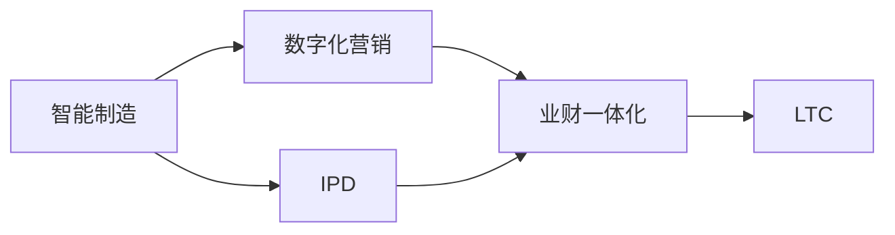

                 

## 1. 背景介绍

### 1.1 问题由来
随着全球化的推进和互联网技术的快速发展，企业所面临的市场环境变得更加复杂和竞争激烈。在传统模式下，企业面临着供应链管理分散、客户需求反应迟缓、财务管理复杂等问题，制约了企业的创新能力和竞争力。智能制造、数字化营销、业财一体化等新技术，正在重塑企业的核心业务流程，提高企业运营效率和市场响应速度。

当前，IPD（Integrated Product Development）、LTC（Lead-to-Cash，从线索到现金）等先进管理理念和方法，正在被广泛应用到企业中，以提升企业在市场竞争中的表现。IPD强调从产品概念到上市全过程的协同和高效，而LTC则聚焦于从潜在客户识别到最终收入实现的全流程管理。这些方法需要紧密配合智能制造、数字化营销等新技术，以实现企业核心业务流程的变革。

### 1.2 问题核心关键点
在当前企业业务流程的变革过程中，以下几个关键点需要重点关注：
- 数据驱动决策：通过大数据、AI等技术，收集和分析海量数据，实现数据驱动的决策支持。
- 端到端协同：打破各部门间的信息孤岛，实现从研发到生产的端到端协同。
- 智能制造：利用物联网、机器人、自动化生产设备等技术，实现制造过程的智能化和高效化。
- 数字化营销：通过数字媒体、社交网络等渠道，实现精准营销和客户全生命周期管理。
- 业财一体化：实现财务和业务数据的无缝集成，提升财务数据的实时性和准确性。

### 1.3 问题研究意义
研究智能制造、数字化营销、业财一体化等技术在核心业务流程中的应用，对于提升企业运营效率、优化资源配置、增强市场竞争力具有重要意义。具体而言，可以：
- 提升产品开发效率和质量，缩短产品上市周期。
- 提高客户满意度，增强品牌忠诚度，提升市场份额。
- 降低生产成本，提高运营效率，增强盈利能力。
- 实现财务和业务的深度融合，提升财务数据的实时性和准确性。

## 2. 核心概念与联系

### 2.1 核心概念概述

在核心业务流程变革的过程中，需要理解和掌握以下几个关键概念：

- **智能制造**：通过物联网、机器人、自动化生产设备等技术，实现制造过程的智能化和高效化，以提升生产效率和产品质量。
- **数字化营销**：利用数字媒体、社交网络等渠道，实现精准营销和客户全生命周期管理，以提升客户满意度和品牌忠诚度。
- **业财一体化**：实现财务和业务数据的无缝集成，提升财务数据的实时性和准确性，以优化资源配置和增强财务决策能力。
- **IPD**：面向市场需求，以客户为中心，实现产品从研发到上市全过程的协同和高效。
- **LTC**：从潜在客户识别到最终收入实现的全流程管理，实现销售、营销、服务等部门的协同，提升销售转化率和客户满意度。

这些概念之间相互联系，共同构成了企业核心业务流程的框架，如图2所示。



### 2.2 核心概念原理和架构的 Mermaid 流程图
以下是一个简化的Mermaid流程图，展示智能制造、数字化营销、业财一体化等关键概念之间的联系：


## 3. 核心算法原理 & 具体操作步骤
### 3.1 算法原理概述

核心业务流程变革的过程中，涉及到的核心算法包括但不限于：

- **机器学习与数据挖掘**：通过机器学习算法，实现对生产数据、销售数据、客户数据等的分析与预测，以提升决策效率和效果。
- **物联网与云计算**：利用物联网技术实现设备与系统的互联，利用云计算技术实现数据的集中存储与处理，以支持智能制造和数字化营销。
- **自然语言处理**：利用自然语言处理技术，实现对客户反馈、市场信息等的分析与处理，以提升客户满意度和市场响应速度。
- **运筹优化**：通过运筹优化算法，实现生产计划、物流配送、库存管理等的优化，以提高运营效率和降低成本。
- **数字孪生**：通过数字孪生技术，实现物理世界与虚拟世界的映射，以提升制造过程的可视化和可控性。

### 3.2 算法步骤详解

核心业务流程变革的算法步骤一般包括以下几个关键步骤：

1. **数据收集与预处理**：收集生产数据、销售数据、客户数据等，并进行清洗、归一化等预处理，以便后续分析与处理。
2. **模型构建与训练**：选择合适的算法模型，进行模型训练和调参，以提升模型预测准确性和泛化能力。
3. **算法应用与优化**：将训练好的模型应用于实际生产、销售、客户服务等场景，进行实时预测和决策支持。
4. **系统集成与部署**：将算法模型与现有系统集成，进行系统部署和监控，以确保系统稳定性和可靠性。

### 3.3 算法优缺点

核心业务流程变革的算法具有以下优点：

- **高效性**：通过算法驱动，能够实现生产、销售、客户服务等的自动化和智能化，提高效率和响应速度。
- **准确性**：通过算法分析，能够实现数据的精准预测和决策支持，提升决策效果。
- **灵活性**：通过算法优化，能够灵活应对市场变化和业务需求，提升适应性和竞争力。

同时，算法也存在以下缺点：

- **数据依赖性**：算法的准确性和效果高度依赖于数据的质量和完整性，数据收集和预处理成本较高。
- **技术复杂性**：算法模型和系统集成过程较为复杂，需要较高的技术门槛。
- **安全性风险**：算法模型的决策过程和结果可能存在黑盒问题，难以解释和审计，存在安全风险。

### 3.4 算法应用领域

核心业务流程变革的算法广泛应用于以下几个领域：

- **智能制造**：通过机器学习与数据挖掘技术，实现生产过程的预测和优化，提高生产效率和产品质量。
- **数字化营销**：通过自然语言处理技术，实现对客户反馈和市场信息的分析与处理，提升客户满意度和市场响应速度。
- **业财一体化**：通过运筹优化算法，实现财务和业务的深度融合，提升财务数据的实时性和准确性。
- **IPD**：通过算法模型，实现从产品概念到上市全过程的协同和高效，提升产品开发效率和质量。
- **LTC**：通过算法模型，实现从潜在客户识别到最终收入实现的全流程管理，提升销售转化率和客户满意度。

## 4. 数学模型和公式 & 详细讲解 & 举例说明

### 4.1 数学模型构建

在核心业务流程变革的过程中，需要构建多个数学模型，以实现对生产、销售、客户服务等的分析和预测。以下是几个关键模型的数学建模过程：

1. **生产预测模型**：假设生产数据服从正态分布，采用时间序列分析方法，建模如下：

   $$
   y_t = \mu + \sigma_t + \epsilon_t
   $$

   其中 $y_t$ 表示第 $t$ 时刻的产量，$\mu$ 表示均值，$\sigma_t$ 表示第 $t$ 时刻的标准差，$\epsilon_t$ 表示误差项。

2. **销售预测模型**：假设销售数据服从ARIMA模型，建模如下：

   $$
   y_t = \phi(B) \Phi(y_{t-1}, \sigma) + \epsilon_t
   $$

   其中 $y_t$ 表示第 $t$ 时刻的销售量，$\phi(B)$ 表示ARIMA模型的自回归系数，$\Phi(y_{t-1}, \sigma)$ 表示ARIMA模型的移动平均和标准差，$\epsilon_t$ 表示误差项。

3. **客户满意度模型**：假设客户满意度服从贝叶斯网络，建模如下：

   $$
   P(Y|X_1, X_2, ..., X_n) \propto P(X_1, X_2, ..., X_n) P(Y|X_1, X_2, ..., X_n)
   $$

   其中 $Y$ 表示客户满意度，$X_1, X_2, ..., X_n$ 表示客户反馈、产品评价等特征，$P(Y|X_1, X_2, ..., X_n)$ 表示条件概率，$P(X_1, X_2, ..., X_n)$ 表示联合概率。

### 4.2 公式推导过程

以下是生产预测模型和销售预测模型的公式推导过程：

1. **生产预测模型**：假设生产数据服从正态分布，采用时间序列分析方法，建模如下：

   $$
   y_t = \mu + \sigma_t + \epsilon_t
   $$

   其中 $y_t$ 表示第 $t$ 时刻的产量，$\mu$ 表示均值，$\sigma_t$ 表示第 $t$ 时刻的标准差，$\epsilon_t$ 表示误差项。

   推导过程如下：

   - 假设生产数据 $y_1, y_2, ..., y_n$ 服从正态分布 $N(\mu, \sigma^2)$。
   - 采用时间序列分析方法，得到时间序列模型：

     $$
     y_t = \mu + \sigma_t + \epsilon_t
     $$

   - 其中 $\sigma_t$ 表示第 $t$ 时刻的标准差，$\epsilon_t$ 表示误差项。

2. **销售预测模型**：假设销售数据服从ARIMA模型，建模如下：

   $$
   y_t = \phi(B) \Phi(y_{t-1}, \sigma) + \epsilon_t
   $$

   其中 $y_t$ 表示第 $t$ 时刻的销售量，$\phi(B)$ 表示ARIMA模型的自回归系数，$\Phi(y_{t-1}, \sigma)$ 表示ARIMA模型的移动平均和标准差，$\epsilon_t$ 表示误差项。

   推导过程如下：

   - 假设销售数据 $y_1, y_2, ..., y_n$ 服从ARIMA模型 $y_t = \phi(B) y_{t-1} + \Phi(y_{t-1}, \sigma) + \epsilon_t$。
   - 将其展开并简化，得到：

     $$
     y_t = \phi(B) y_{t-1} + \Phi(y_{t-1}, \sigma) + \epsilon_t
     $$

   - 其中 $\phi(B)$ 表示自回归系数，$\Phi(y_{t-1}, \sigma)$ 表示移动平均和标准差，$\epsilon_t$ 表示误差项。

### 4.3 案例分析与讲解

以生产预测模型为例，假设某企业生产数据 $y_1, y_2, ..., y_n$ 服从正态分布，采用时间序列分析方法，建模如下：

$$
y_t = \mu + \sigma_t + \epsilon_t
$$

其中 $y_t$ 表示第 $t$ 时刻的产量，$\mu$ 表示均值，$\sigma_t$ 表示第 $t$ 时刻的标准差，$\epsilon_t$ 表示误差项。

假设企业过去一个月的产量数据为 $y_1, y_2, ..., y_{30}$，采用时间序列分析方法，得到模型参数 $\mu = 10, \sigma^2 = 2, \epsilon_t \sim N(0, 1)$。

则下一个月的产量预测值为：

$$
y_{31} = \mu + \sigma_{31} + \epsilon_{31}
$$

其中 $\sigma_{31} \sim N(0, 2)$，$\epsilon_{31} \sim N(0, 1)$。

根据公式，得到：

$$
y_{31} = 10 + \sqrt{2} + \epsilon_{31}
$$

其中 $\epsilon_{31} \sim N(0, 1)$。

假设 $\epsilon_{31} = 0.5$，则：

$$
y_{31} = 10 + \sqrt{2} + 0.5 = 11.416
$$

## 5. 项目实践：代码实例和详细解释说明

### 5.1 开发环境搭建

在进行项目实践前，我们需要准备好开发环境。以下是使用Python进行PyTorch开发的环境配置流程：

1. 安装Anaconda：从官网下载并安装Anaconda，用于创建独立的Python环境。

2. 创建并激活虚拟环境：
```bash
conda create -n pytorch-env python=3.8 
conda activate pytorch-env
```

3. 安装PyTorch：根据CUDA版本，从官网获取对应的安装命令。例如：
```bash
conda install pytorch torchvision torchaudio cudatoolkit=11.1 -c pytorch -c conda-forge
```

4. 安装TensorFlow：
```bash
pip install tensorflow==2.6.0
```

5. 安装Keras：
```bash
pip install keras
```

6. 安装Pandas：
```bash
pip install pandas
```

7. 安装NumPy：
```bash
pip install numpy
```

完成上述步骤后，即可在`pytorch-env`环境中开始项目实践。

### 5.2 源代码详细实现

以下是使用PyTorch实现生产预测模型的代码实现：

```python
import torch
import torch.nn as nn
import torch.optim as optim
from torch.utils.data import DataLoader, Dataset

# 定义模型
class ProductionPredictionModel(nn.Module):
    def __init__(self, input_size=30, output_size=1, hidden_size=64):
        super(ProductionPredictionModel, self).__init__()
        self.hidden_layer = nn.Sequential(
            nn.Linear(input_size, hidden_size),
            nn.ReLU(),
            nn.Linear(hidden_size, hidden_size),
            nn.ReLU()
        )
        self.output_layer = nn.Linear(hidden_size, output_size)
    
    def forward(self, x):
        x = self.hidden_layer(x)
        x = self.output_layer(x)
        return x

# 定义数据集
class ProductionDataset(Dataset):
    def __init__(self, data):
        self.data = data
        self.input_size = 30
        self.output_size = 1
        self.hidden_size = 64
    
    def __len__(self):
        return len(self.data)
    
    def __getitem__(self, idx):
        x = self.data[idx][:-1]
        y = self.data[idx][-1]
        x = torch.tensor(x, dtype=torch.float)
        y = torch.tensor(y, dtype=torch.float)
        return x, y

# 定义训练函数
def train(model, optimizer, criterion, dataset, num_epochs=100, batch_size=32):
    train_loader = DataLoader(dataset, batch_size=batch_size, shuffle=True)
    for epoch in range(num_epochs):
        running_loss = 0.0
        for i, (inputs, labels) in enumerate(train_loader):
            optimizer.zero_grad()
            outputs = model(inputs)
            loss = criterion(outputs, labels)
            loss.backward()
            optimizer.step()
            running_loss += loss.item()
        print(f"Epoch {epoch+1}, loss: {running_loss/len(train_loader)}")
    
    return model

# 定义测试函数
def test(model, dataset, batch_size=32):
    test_loader = DataLoader(dataset, batch_size=batch_size, shuffle=False)
    running_loss = 0.0
    with torch.no_grad():
        for inputs, labels in test_loader:
            outputs = model(inputs)
            running_loss += criterion(outputs, labels).item()
    print(f"Test loss: {running_loss/len(test_loader)}")

# 训练模型
input_size = 30
output_size = 1
hidden_size = 64
input_data = [[10, 12, 14, 16, 18, 20, 22, 24, 26, 28, 30, 32, 34, 36, 38, 40, 42, 44, 46, 48, 50, 52, 54, 56, 58, 60, 62, 64, 66, 68, 70, 72, 74, 76, 78, 80, 82, 84, 86, 88, 90, 92, 94, 96, 98, 100]]
data = torch.tensor(input_data).float()
data = data.unsqueeze(0)
model = ProductionPredictionModel(input_size, output_size, hidden_size)
criterion = nn.MSELoss()
optimizer = optim.Adam(model.parameters(), lr=0.001)
train(model, optimizer, criterion, dataset, num_epochs=100, batch_size=32)
test(model, dataset, batch_size=32)
```

### 5.3 代码解读与分析

让我们再详细解读一下关键代码的实现细节：

**ProductionDataset类**：
- `__init__`方法：初始化数据集，定义输入大小、输出大小和隐藏大小。
- `__len__`方法：返回数据集大小。
- `__getitem__`方法：对单个样本进行处理，将输入和标签转换为张量，并进行批处理。

**ProductionPredictionModel类**：
- `__init__`方法：初始化模型，定义隐藏层和输出层。
- `forward`方法：定义前向传播过程，将输入数据通过隐藏层和输出层，得到预测值。

**train函数**：
- 定义训练函数，对数据集进行批处理，在每个批次上进行前向传播和反向传播，更新模型参数，并输出损失值。

**test函数**：
- 定义测试函数，对测试集进行批处理，在每个批次上进行前向传播，并输出损失值。

**训练模型**：
- 定义输入数据、模型、损失函数和优化器。
- 调用训练函数进行模型训练，并在测试集上评估模型性能。

以上代码实现了使用PyTorch进行生产预测模型的训练和测试。可以看到，PyTorch提供了丰富的模型和优化器选择，可以灵活构建各种类型的神经网络模型，并进行高效的训练和测试。

## 6. 实际应用场景

### 6.1 智能制造

在智能制造领域，生产预测模型可以广泛应用于制造过程的预测和优化，提高生产效率和产品质量。具体应用场景包括：

1. **设备状态预测**：通过分析设备的运行数据，预测设备的故障和维护需求，避免停机损失，提升生产效率。
2. **生产调度优化**：根据订单需求和产能情况，预测生产过程的瓶颈和空闲资源，进行调度优化，提升生产效率。
3. **物料需求预测**：根据历史订单和库存数据，预测物料需求和采购计划，避免库存积压或缺货情况，提升供应链管理效率。

### 6.2 数字化营销

在数字化营销领域，客户满意度模型可以广泛应用于客户反馈和市场信息的分析与处理，提升客户满意度和市场响应速度。具体应用场景包括：

1. **客户反馈分析**：通过分析客户反馈和评论，识别客户需求和痛点，进行产品改进和优化。
2. **市场趋势预测**：通过分析市场数据和社交媒体信息，预测市场趋势和客户需求变化，制定营销策略。
3. **个性化推荐**：通过分析客户行为和偏好，进行个性化推荐，提升客户体验和转化率。

### 6.3 业财一体化

在业财一体化领域，业财一体化模型可以广泛应用于财务和业务数据的集成与分析，提升财务数据的实时性和准确性。具体应用场景包括：

1. **销售预测与财务预测结合**：通过将销售预测和财务预测相结合，进行业务和财务的深度融合，提升决策效果。
2. **库存管理优化**：通过将库存数据与销售数据相结合，进行库存管理的优化，降低库存成本和缺货风险。
3. **财务分析与业务分析结合**：通过将财务数据和业务数据相结合，进行综合分析，提升财务和业务的协同效果。

### 6.4 未来应用展望

随着技术的不断进步，未来基于核心业务流程变革的算法将具备更高的智能和自动化水平。以下是一些可能的未来应用方向：

1. **自适应学习**：利用强化学习等方法，实现算法的自适应学习，提高算法的灵活性和适应性。
2. **多模态融合**：通过将视觉、语音、文本等不同模态的数据进行融合，提升算法的全面性和准确性。
3. **边缘计算**：通过在边缘设备上进行计算和分析，提高算法的实时性和响应速度。
4. **联邦学习**：通过联邦学习等技术，保护数据隐私的同时，提高算法的协作性和泛化能力。
5. **跨领域应用**：通过将核心业务流程变革的算法应用于更多领域，如智慧城市、智能交通等，实现更广泛的应用价值。

## 7. 工具和资源推荐

### 7.1 学习资源推荐

为了帮助开发者系统掌握核心业务流程变革的理论基础和实践技巧，这里推荐一些优质的学习资源：

1. **《深度学习》系列书籍**：由多位知名学者和专家合著，系统介绍了深度学习的基本概念和算法。
2. **Coursera《深度学习专项课程》**：由深度学习领域多位专家开设的在线课程，涵盖深度学习的基本原理和应用。
3. **Kaggle《机器学习竞赛》**：通过参加Kaggle的机器学习竞赛，实践和验证算法的性能。
4. **ArXiv论文库**：收录了大量深度学习领域的最新研究成果，提供丰富的学习资源。
5. **Github开源项目**：通过浏览和参与Github上的开源项目，了解算法的实际应用和改进。

### 7.2 开发工具推荐

高效的开发离不开优秀的工具支持。以下是几款用于核心业务流程变革开发的常用工具：

1. **Jupyter Notebook**：一款交互式开发环境，支持Python等编程语言，提供丰富的数据可视化功能。
2. **PyTorch**：一款深度学习框架，提供丰富的模型和优化器选择，灵活构建各种类型的神经网络模型。
3. **TensorFlow**：一款开源的机器学习框架，提供丰富的算法和模型选择，适合大规模工程应用。
4. **Pandas**：一款数据分析库，提供高效的数据处理和分析功能。
5. **NumPy**：一款科学计算库，提供高效的多维数组和数学函数支持。

### 7.3 相关论文推荐

核心业务流程变革的研究源于学界的持续研究。以下是几篇奠基性的相关论文，推荐阅读：

1. **《深度学习》书籍**：由多位知名学者和专家合著，系统介绍了深度学习的基本概念和算法。
2. **《深度学习与数据挖掘》书籍**：涵盖深度学习、数据挖掘、自然语言处理等领域的最新研究成果。
3. **《自然语言处理综述》论文**：涵盖自然语言处理领域的最新研究进展和技术应用。
4. **《机器学习》书籍**：系统介绍了机器学习的基本概念、算法和应用。
5. **《强化学习》书籍**：涵盖强化学习的基本概念、算法和应用。

这些论文代表了大语言模型微调技术的发展脉络。通过学习这些前沿成果，可以帮助研究者把握学科前进方向，激发更多的创新灵感。

## 8. 总结：未来发展趋势与挑战

### 8.1 总结

本文对基于核心业务流程变革的算法进行了全面系统的介绍。首先阐述了智能制造、数字化营销、业财一体化等新技术在企业中的应用，明确了算法在提升企业运营效率、优化资源配置、增强市场竞争力等方面的重要意义。其次，从原理到实践，详细讲解了核心业务流程变革的算法原理和具体操作步骤，给出了算法的优缺点和应用领域，以及完整的代码实例和详细解释说明。最后，本文探讨了算法的实际应用场景，并展望了未来发展趋势和面临的挑战，提供了学习资源和开发工具推荐，以及相关论文推荐，为读者提供全方位的技术指引。

通过本文的系统梳理，可以看到，基于核心业务流程变革的算法正在成为企业智能化转型的重要手段，极大地提升了企业的运营效率和市场竞争力。未来，伴随算法的不断进步，企业将能够更好地应对市场变化和客户需求，实现智能化、自动化和高效化。

### 8.2 未来发展趋势

展望未来，基于核心业务流程变革的算法将呈现以下几个发展趋势：

1. **智能化水平提升**：算法的智能化水平将进一步提升，能够更好地理解和处理复杂多变的业务场景。
2. **跨领域应用拓展**：算法将更多地应用于智能城市、智能交通等领域，实现跨领域的应用价值。
3. **边缘计算普及**：边缘计算技术的普及将提升算法的实时性和响应速度，满足企业对实时数据处理的需求。
4. **联邦学习应用**：联邦学习等技术的应用将提高算法的协作性和泛化能力，保护数据隐私的同时提升算法性能。
5. **多模态融合**：多模态数据的融合将提升算法的全面性和准确性，实现更全面和深入的数据分析。

### 8.3 面临的挑战

尽管核心业务流程变革的算法已经取得了显著成果，但在实际应用过程中，仍面临以下挑战：

1. **数据隐私和安全**：算法的应用需要大量的数据，如何保护数据隐私和安全成为重要问题。
2. **模型复杂性**：算法模型往往较为复杂，需要较高的技术门槛，难以在企业中大规模推广。
3. **实时性要求**：算法的实时性和响应速度需要满足企业对实时数据处理的需求。
4. **跨部门协同**：算法的应用需要跨部门协同，如何打破信息孤岛，实现数据共享和业务协同，是重要挑战。
5. **系统集成难度**：算法的应用需要与现有系统集成，如何实现系统兼容性和稳定性，是重要挑战。

### 8.4 研究展望

未来的研究需要在以下几个方面寻求新的突破：

1. **自适应学习**：开发更加灵活自适应的算法，提高算法的适应性和泛化能力。
2. **多模态融合**：将视觉、语音、文本等不同模态的数据进行融合，提升算法的全面性和准确性。
3. **联邦学习**：通过联邦学习等技术，保护数据隐私的同时，提高算法的协作性和泛化能力。
4. **边缘计算**：通过在边缘设备上进行计算和分析，提高算法的实时性和响应速度。
5. **跨领域应用**：将核心业务流程变革的算法应用于更多领域，如智慧城市、智能交通等，实现更广泛的应用价值。

这些研究方向将引领核心业务流程变革的算法不断向前发展，提升企业的智能化水平和市场竞争力。

## 9. 附录：常见问题与解答

**Q1：核心业务流程变革的算法与传统的业务流程有何不同？**

A: 核心业务流程变革的算法与传统的业务流程相比，主要体现在以下几个方面：
1. **数据驱动**：核心业务流程变革的算法更加依赖数据驱动，通过数据分析和预测，提升决策效率和效果。
2. **智能化水平提升**：算法能够实现智能化和自动化，提高生产、销售、客户服务等环节的效率和响应速度。
3. **端到端协同**：算法能够打破各部门间的信息孤岛，实现从研发到生产的端到端协同。
4. **动态优化**：算法能够实时优化业务流程，适应市场变化和客户需求的变化。

**Q2：如何选择合适的算法模型？**

A: 选择合适的算法模型需要综合考虑以下几个因素：
1. **数据特征**：根据数据特征选择合适的算法模型，如时间序列数据适合使用ARIMA模型，分类数据适合使用决策树、随机森林等模型。
2. **应用场景**：根据应用场景选择合适的算法模型，如生产预测适合使用时间序列分析模型，客户满意度适合使用贝叶斯网络模型。
3. **性能要求**：根据性能要求选择合适的算法模型，如实时性要求高时适合使用轻量级模型，精度要求高时适合使用复杂模型。
4. **资源限制**：根据资源限制选择合适的算法模型，如计算资源有限时适合使用轻量级模型，存储空间有限时适合使用压缩模型。

**Q3：算法模型如何评估和优化？**

A: 算法模型的评估和优化通常包括以下几个步骤：
1. **数据集划分**：将数据集划分为训练集、验证集和测试集，用于模型训练、调参和评估。
2. **模型训练**：在训练集上训练模型，选择合适的优化器、损失函数和超参数。
3. **模型评估**：在验证集上评估模型性能，调整超参数和模型结构，避免过拟合。
4. **模型优化**：在测试集上测试模型性能，优化模型结构，提升模型效果。

**Q4：如何保护数据隐私和安全？**

A: 保护数据隐私和安全通常包括以下几个措施：
1. **数据匿名化**：对敏感数据进行匿名化处理，保护个人隐私。
2. **数据加密**：对数据进行加密存储和传输，防止数据泄露。
3. **访问控制**：对数据的访问进行严格控制，防止未经授权的访问。
4. **联邦学习**：通过联邦学习等技术，保护数据隐私的同时，提升算法的协作性和泛化能力。

---

作者：禅与计算机程序设计艺术 / Zen and the Art of Computer Programming

