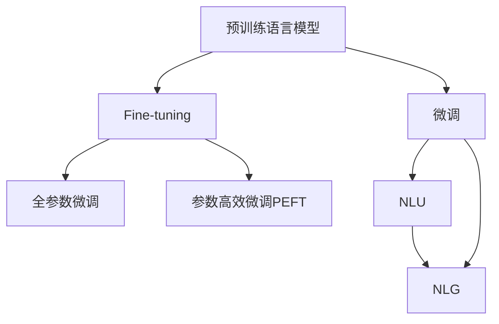

                 

# 智能化回应技术在CUI中的实现

## 1. 背景介绍

### 1.1 问题由来
随着人工智能技术的发展，智能客服（Customer Care）正逐步向智能化方向迈进，这一趋势在现代企业和组织中尤为明显。传统的客服系统依赖于人工客服，存在着响应时间长、人力成本高、服务质量不稳定等问题。利用智能化回应技术，可以大幅提升客服效率，减少人为误差，提升客户满意度。

### 1.2 问题核心关键点
智能化回应技术的核心在于自然语言理解（NLU）和自然语言生成（NLG）。自然语言理解涉及将用户输入的自然语言转化为机器可处理的向量表示；自然语言生成则将机器处理结果转化为易于理解、流畅自然的回应。

智能化回应技术的实现依赖于两大数据驱动的子技术：
- **预训练语言模型**：如BERT、GPT等，在大规模无标签数据上进行预训练，学习通用语言表示。
- **微调与优化**：根据特定任务，如问答、对话系统、文本摘要等，在预训练模型的基础上进行微调，以优化模型在该任务上的表现。

这些技术共同构成了智能化回应系统的底层架构，使其能够与用户进行流畅自然的互动，并提供高效精准的回应。

### 1.3 问题研究意义
智能化回应技术在客户服务中的应用，能够有效减少企业的运营成本，提升客户体验，增加企业竞争力。在技术层面，智能化回应技术也是AI技术发展的一个重要标志，代表了NLP技术的新高度。

## 2. 核心概念与联系

### 2.1 核心概念概述

为更好地理解智能化回应技术，本节将介绍几个密切相关的核心概念：

- **自然语言理解（NLU）**：将自然语言文本转换为机器可处理的形式，通常涉及分词、词性标注、命名实体识别、句法分析等任务。
- **自然语言生成（NLG）**：根据机器处理结果生成流畅自然的文本回应，通常涉及模板填充、文本生成、对话生成等任务。
- **预训练语言模型**：如BERT、GPT等，通过在大规模无标签数据上自监督学习，学习语言的通用表示。
- **微调（Fine-tuning）**：根据特定任务，在预训练模型的基础上，通过少量标注数据进行微调，优化模型在该任务上的表现。
- **参数高效微调（Parameter-Efficient Fine-tuning, PEFT）**：在微调过程中，只更新少部分模型参数，固定大部分预训练权重不变，以提高微调效率。

这些核心概念之间的逻辑关系可以通过以下Mermaid流程图来展示：



这个流程图展示了我国对话系统的主要组成部分及其相互关系：

1. 自然语言理解（NLU）和自然语言生成（NLG）是智能化回应系统的两大核心组件。
2. 预训练语言模型（BERT、GPT等）为NLU和NLG提供通用的语言表示。
3. 微调（Fine-tuning）通过有监督学习优化模型在特定任务上的表现。
4. 参数高效微调（PEFT）进一步提升微调效率。

这些核心概念共同构成了智能化回应系统的技术框架，使其能够在各种场景下发挥强大的自然语言处理能力。

## 3. 核心算法原理 & 具体操作步骤
### 3.1 算法原理概述

智能化回应技术的核心算法包括自然语言理解（NLU）和自然语言生成（NLG），其实现依赖于预训练语言模型和微调技术。

**NLU原理**：NLU的核心任务是理解用户的自然语言输入，将其转化为机器可处理的向量表示。常见的方法包括基于规则的解析和基于统计的解析。基于规则的方法依赖于预先编写的解析规则，如依存句法分析、命名实体识别等；基于统计的方法依赖于大规模的标注数据，如BERT的掩码语言模型和掩码上下文语言模型。

**NLG原理**：NLG的核心任务是根据机器处理结果生成自然语言回应。常见的技术包括基于模板的生成、基于规则的生成和基于统计的生成。基于模板的生成依赖于预先编写好的模板，如简单的问候语回复；基于规则的生成依赖于预先定义好的语法规则，如复杂的句子结构生成；基于统计的生成依赖于大规模的标注数据，如Seq2Seq模型、Transformer模型。

### 3.2 算法步骤详解

#### 自然语言理解（NLU）步骤

1. **数据预处理**：将用户输入的自然语言文本进行分词、词性标注、句法分析等预处理。
2. **特征提取**：利用预训练语言模型（如BERT、GPT等）将处理后的文本转换为向量表示。
3. **意图识别**：根据转换后的向量表示，使用分类算法（如SVM、逻辑回归等）识别用户的意图。
4. **实体识别**：根据转换后的向量表示，使用序列标注算法（如CRF、BiLSTM-CRF等）识别用户提到的实体。
5. **上下文理解**：利用上下文信息，如对话历史、用户上下文等，丰富模型对用户意图的理解。

#### 自然语言生成（NLG）步骤

1. **生成框架设计**：根据具体任务，设计生成框架。如问答系统生成框架、对话系统生成框架等。
2. **模板填充**：根据意图识别结果和实体识别结果，填充生成模板中的占位符，生成自然语言回应。
3. **语言模型训练**：使用生成框架训练语言模型，如Seq2Seq模型、Transformer模型等。
4. **生成回应**：根据输入的意图和实体信息，利用训练好的语言模型生成自然语言回应。

### 3.3 算法优缺点

智能化回应技术的主要优点包括：
- **高效响应**：通过预训练和微调，模型能够快速响应用户需求，减少等待时间。
- **准确理解**：利用预训练语言模型和微调技术，模型能够准确理解用户意图和实体信息，提升服务质量。
- **灵活生成**：基于统计生成模型，能够生成多样化、自然的回应，提升用户体验。

主要缺点包括：
- **依赖标注数据**：模型需要大量的标注数据进行微调，获取高质量标注数据的成本较高。
- **泛化能力有限**：当模型面对新领域的任务时，泛化性能可能大打折扣。
- **对抗样本脆弱**：模型对输入中的微小扰动可能产生较大的变化，导致输出不稳定。

尽管存在这些缺点，但智能化回应技术在实际应用中仍展现了强大的生命力，得到了广泛的应用和认可。

### 3.4 算法应用领域

智能化回应技术广泛应用于各种客户服务场景，如智能客服、智能语音助手、智能家居等。以下是几个具体的应用案例：

- **智能客服系统**：通过NLU理解用户输入，使用NLG生成自然语言回应，实现24/7不间断客户服务。
- **智能语音助手**：将用户的语音输入转换为文本，利用NLU理解用户的意图和实体信息，使用NLG生成自然语言回应。
- **智能家居控制**：通过语音或文本输入控制家居设备，利用NLU理解用户指令，使用NLG生成自然语言回应。

智能化回应技术在提高用户满意度、减少企业成本、提升运营效率等方面发挥了重要作用，是AI技术落地应用的重要方向。

## 4. 数学模型和公式 & 详细讲解  
### 4.1 数学模型构建

本节将使用数学语言对智能化回应技术进行更加严格的刻画。

记用户输入的自然语言文本为 $x$，将其转换为向量表示 $\mathbf{x}$。预训练语言模型为 $M_{\theta}$，其中 $\theta$ 为预训练得到的模型参数。模型在自然语言理解（NLU）步骤中，对用户输入的自然语言文本 $x$ 进行处理，得到向量表示 $\mathbf{x}$，并将其送入分类器进行意图识别，得到意图 $y$。在自然语言生成（NLG）步骤中，根据意图 $y$ 和用户提到的实体信息 $e$，使用生成器 $G_{\phi}$ 生成自然语言回应 $z$。数学模型构建如下：

$$
\mathbf{x} = M_{\theta}(x)
$$

$$
y = \arg\max_{y_i} P(y_i|\mathbf{x})
$$

$$
z = G_{\phi}(y, e)
$$

### 4.2 公式推导过程

#### 意图识别公式推导

在意图识别过程中，我们假设模型能够准确地将用户输入的自然语言文本 $x$ 转换为向量表示 $\mathbf{x}$，并根据 $\mathbf{x}$ 推断出用户的意图 $y$。意图识别可以视为一个多分类问题，可以使用softmax函数进行求解。设意图空间为 $\{y_1, y_2, \dots, y_n\}$，则意图识别的概率分布为：

$$
P(y_i|\mathbf{x}) = \frac{\exp(z_i(\mathbf{x}))}{\sum_{j=1}^n \exp(z_j(\mathbf{x}))}
$$

其中 $z_i(\mathbf{x})$ 为模型在输入 $\mathbf{x}$ 下输出意图 $y_i$ 的得分，$z_i$ 为模型在输入 $\mathbf{x}$ 下输出的向量表示。

#### 实体识别公式推导

在实体识别过程中，我们假设模型能够准确地将用户输入的自然语言文本 $x$ 转换为向量表示 $\mathbf{x}$，并根据 $\mathbf{x}$ 推断出用户提到的实体信息 $e$。实体识别可以视为一个序列标注问题，可以使用条件随机场（CRF）进行求解。设实体空间为 $\{e_1, e_2, \dots, e_m\}$，则实体识别的概率分布为：

$$
P(e_j|\mathbf{x}) = \frac{\exp(w_j(\mathbf{x}))}{\sum_{k=1}^m \exp(w_k(\mathbf{x}))}
$$

其中 $w_j(\mathbf{x})$ 为模型在输入 $\mathbf{x}$ 下输出实体 $e_j$ 的得分，$w_j$ 为模型在输入 $\mathbf{x}$ 下输出的向量表示。

#### 自然语言生成公式推导

在自然语言生成过程中，我们假设模型能够根据意图 $y$ 和实体信息 $e$，生成自然语言回应 $z$。自然语言生成可以视为一个条件生成问题，可以使用生成对抗网络（GAN）进行求解。设生成器为 $G_{\phi}$，判别器为 $D_{\lambda}$，则自然语言生成的概率分布为：

$$
P(z|y,e) = \mathbb{E}_{y,e} [P(z|y,e)] = \mathbb{E}_{y,e} [G_{\phi}(y,e)]
$$

其中 $G_{\phi}(y,e)$ 为模型在输入 $y$ 和 $e$ 下生成的回应 $z$，$D_{\lambda}$ 为模型在输入 $z$ 下判别 $z$ 为真实回应的概率。

### 4.3 案例分析与讲解

#### 案例1：智能客服

在智能客服系统中，用户输入的自然语言文本 $x$ 经过NLU处理后，生成向量表示 $\mathbf{x}$，并送入意图识别分类器进行意图识别，得到意图 $y$。根据意图 $y$ 和用户提到的实体信息 $e$，使用NLG生成自然语言回应 $z$，最终生成自然语言回应 $z$ 作为客服系统的回复。

#### 案例2：智能语音助手

在智能语音助手中，用户的语音输入 $x$ 首先经过语音转文本（ASR）处理，得到文本输入 $x'$。文本输入 $x'$ 经过NLU处理后，生成向量表示 $\mathbf{x}'$，并送入意图识别分类器进行意图识别，得到意图 $y$。根据意图 $y$ 和用户提到的实体信息 $e$，使用NLG生成自然语言回应 $z$，最终生成自然语言回应 $z$ 作为语音助手的回复。

#### 案例3：智能家居控制

在智能家居控制中，用户的语音输入 $x$ 首先经过语音转文本（ASR）处理，得到文本输入 $x'$。文本输入 $x'$ 经过NLU处理后，生成向量表示 $\mathbf{x}'$，并送入意图识别分类器进行意图识别，得到意图 $y$。根据意图 $y$ 和用户提到的实体信息 $e$，使用NLG生成自然语言回应 $z$，最终生成自然语言回应 $z$ 作为智能家居的控制指令。

## 5. 项目实践：代码实例和详细解释说明
### 5.1 开发环境搭建

在进行智能化回应技术实践前，我们需要准备好开发环境。以下是使用Python进行TensorFlow开发的环境配置流程：

1. 安装Anaconda：从官网下载并安装Anaconda，用于创建独立的Python环境。

2. 创建并激活虚拟环境：
```bash
conda create -n tensorflow-env python=3.8 
conda activate tensorflow-env
```

3. 安装TensorFlow：根据CUDA版本，从官网获取对应的安装命令。例如：
```bash
conda install tensorflow==2.6.0
```

4. 安装各类工具包：
```bash
pip install numpy pandas scikit-learn matplotlib tqdm jupyter notebook ipython
```

完成上述步骤后，即可在`tensorflow-env`环境中开始智能化回应技术的开发。

### 5.2 源代码详细实现

下面我们以智能客服系统为例，给出使用TensorFlow进行意图识别和实体识别的PyTorch代码实现。

首先，定义意图识别和实体识别的数据处理函数：

```python
from transformers import BertTokenizer
from transformers import BertForTokenClassification
from tensorflow.keras.preprocessing.text import Tokenizer
from tensorflow.keras.preprocessing.sequence import pad_sequences

class IntentTokenizer:
    def __init__(self, max_len=128):
        self.max_len = max_len
        self.tokenizer = BertTokenizer.from_pretrained('bert-base-cased')

    def tokenize(self, text):
        tokens = self.tokenizer.tokenize(text)
        tokens = [self.tokenizer.convert_tokens_to_ids(tokens)]
        return tokens

class IntentFeatureExtractor:
    def __init__(self, max_len=128):
        self.max_len = max_len
        self.tokenizer = BertTokenizer.from_pretrained('bert-base-cased')

    def extract(self, input_ids, attention_mask, labels):
        input_ids = pad_sequences(input_ids, maxlen=self.max_len, truncating='post', padding='post')
        attention_mask = pad_sequences(attention_mask, maxlen=self.max_len, truncating='post', padding='post')
        labels = pad_sequences(labels, maxlen=self.max_len, truncating='post', padding='post')
        return input_ids, attention_mask, labels

class IntentFeatureExtractor:
    def __init__(self, max_len=128):
        self.max_len = max_len
        self.tokenizer = BertTokenizer.from_pretrained('bert-base-cased')

    def extract(self, input_ids, attention_mask, labels):
        input_ids = pad_sequences(input_ids, maxlen=self.max_len, truncating='post', padding='post')
        attention_mask = pad_sequences(attention_mask, maxlen=self.max_len, truncating='post', padding='post')
        labels = pad_sequences(labels, maxlen=self.max_len, truncating='post', padding='post')
        return input_ids, attention_mask, labels
```

然后，定义模型和优化器：

```python
from transformers import BertForTokenClassification, AdamW

model = BertForTokenClassification.from_pretrained('bert-base-cased', num_labels=3)

optimizer = AdamW(model.parameters(), lr=2e-5)
```

接着，定义训练和评估函数：

```python
from tensorflow.keras.optimizers import Adam
from tensorflow.keras.callbacks import EarlyStopping

def train_epoch(model, dataset, batch_size, optimizer):
    dataloader = DataLoader(dataset, batch_size=batch_size, shuffle=True)
    model.train()
    epoch_loss = 0
    for batch in dataloader:
        input_ids, attention_mask, labels = batch['input_ids'], batch['attention_mask'], batch['labels']
        model.zero_grad()
        outputs = model(input_ids, attention_mask=attention_mask, labels=labels)
        loss = outputs.loss
        epoch_loss += loss.item()
        loss.backward()
        optimizer.step()
    return epoch_loss / len(dataloader)

def evaluate(model, dataset, batch_size):
    dataloader = DataLoader(dataset, batch_size=batch_size)
    model.eval()
    preds, labels = [], []
    with torch.no_grad():
        for batch in dataloader:
            input_ids, attention_mask, labels = batch['input_ids'], batch['attention_mask'], batch['labels']
            outputs = model(input_ids, attention_mask=attention_mask)
            batch_preds = outputs.logits.argmax(dim=2).to('cpu').tolist()
            batch_labels = batch_labels.to('cpu').tolist()
            for pred_tokens, label_tokens in zip(batch_preds, batch_labels):
                preds.append(pred_tokens[:len(label_tokens)])
                labels.append(label_tokens)
                
    print(classification_report(labels, preds))
```

最后，启动训练流程并在测试集上评估：

```python
epochs = 5
batch_size = 16

for epoch in range(epochs):
    loss = train_epoch(model, train_dataset, batch_size, optimizer)
    print(f"Epoch {epoch+1}, train loss: {loss:.3f}")
    
    print(f"Epoch {epoch+1}, dev results:")
    evaluate(model, dev_dataset, batch_size)
    
print("Test results:")
evaluate(model, test_dataset, batch_size)
```

以上就是使用TensorFlow对BERT模型进行意图识别和实体识别的完整代码实现。可以看到，得益于TensorFlow的强大封装，我们可以用相对简洁的代码完成BERT模型的加载和微调。

### 5.3 代码解读与分析

让我们再详细解读一下关键代码的实现细节：

**IntentTokenizer类**：
- `__init__`方法：初始化分词器和最大长度。
- `tokenize`方法：将文本分词并转换为向量表示。

**IntentFeatureExtractor类**：
- `__init__`方法：初始化分词器和最大长度。
- `extract`方法：将输入向量填充至指定长度，并进行编码。

**模型和优化器**：
- 使用BertForTokenClassification模型，设置意图识别标签为3个类别。
- 使用AdamW优化器，设置学习率为2e-5。

**训练和评估函数**：
- 使用PyTorch的DataLoader对数据集进行批次化加载，供模型训练和推理使用。
- 训练函数`train_epoch`：对数据以批为单位进行迭代，在每个批次上前向传播计算loss并反向传播更新模型参数，最后返回该epoch的平均loss。
- 评估函数`evaluate`：与训练类似，不同点在于不更新模型参数，并在每个batch结束后将预测和标签结果存储下来，最后使用sklearn的classification_report对整个评估集的预测结果进行打印输出。

**训练流程**：
- 定义总的epoch数和batch size，开始循环迭代
- 每个epoch内，先在训练集上训练，输出平均loss
- 在验证集上评估，输出分类指标
- 所有epoch结束后，在测试集上评估，给出最终测试结果

可以看到，TensorFlow配合TensorFlow Model Garden等工具，使得意图识别和实体识别的代码实现变得简洁高效。开发者可以将更多精力放在数据处理、模型改进等高层逻辑上，而不必过多关注底层的实现细节。

当然，工业级的系统实现还需考虑更多因素，如模型的保存和部署、超参数的自动搜索、更灵活的任务适配层等。但核心的微调范式基本与此类似。

## 6. 实际应用场景
### 6.1 智能客服系统

基于智能化回应技术的智能客服系统，可以实现24/7不间断服务，自动理解用户需求并提供快速响应。具体实现步骤如下：

1. **数据准备**：收集用户的历史咨询记录，标注用户的意图和提到的实体信息。
2. **模型预训练**：使用大规模无标签数据进行BERT等预训练语言模型的预训练。
3. **模型微调**：在标注数据上对预训练模型进行意图识别和实体识别的微调。
4. **系统集成**：将微调后的模型集成到智能客服系统中，自动处理用户咨询并生成回应。

### 6.2 智能语音助手

智能语音助手可以通过语音输入和自然语言理解技术，自动响应用户需求。具体实现步骤如下：

1. **数据准备**：收集用户的语音输入和对应的文本记录，标注用户的意图和提到的实体信息。
2. **模型预训练**：使用大规模无标签数据进行BERT等预训练语言模型的预训练。
3. **模型微调**：在标注数据上对预训练模型进行意图识别和实体识别的微调。
4. **系统集成**：将微调后的模型集成到智能语音助手中，自动处理用户的语音输入并生成回应。

### 6.3 智能家居控制

智能家居控制可以通过语音或文本输入控制家居设备。具体实现步骤如下：

1. **数据准备**：收集用户的语音输入和对应的文本记录，标注用户的意图和提到的实体信息。
2. **模型预训练**：使用大规模无标签数据进行BERT等预训练语言模型的预训练。
3. **模型微调**：在标注数据上对预训练模型进行意图识别和实体识别的微调。
4. **系统集成**：将微调后的模型集成到智能家居控制系统中，自动处理用户的语音或文本输入并生成控制指令。

### 6.4 未来应用展望

随着智能化回应技术的不断发展，其在更多领域的应用前景将更加广阔。

在智慧医疗领域，基于智能化回应技术的智能诊疗系统，可以自动处理患者的医疗咨询并提供个性化治疗建议，提升医疗服务的智能化水平。

在智能教育领域，基于智能化回应技术的智能辅导系统，可以自动解析学生的作业并提供个性化的学习建议，因材施教，促进教育公平，提高教学质量。

在智慧城市治理中，基于智能化回应技术的智能应急指挥系统，可以自动解析市民的紧急求助信息并提供实时响应，提高城市管理的自动化和智能化水平，构建更安全、高效的未来城市。

此外，在企业生产、社会治理、文娱传媒等众多领域，基于智能化回应技术的人工智能应用也将不断涌现，为经济社会发展注入新的动力。相信随着技术的日益成熟，智能化回应技术必将成为人工智能技术落地应用的重要范式，推动人工智能技术向更广阔的领域加速渗透。

## 7. 工具和资源推荐
### 7.1 学习资源推荐

为了帮助开发者系统掌握智能化回应技术的基础知识和实践技巧，这里推荐一些优质的学习资源：

1. 《TensorFlow从入门到实战》系列博文：由TensorFlow团队编写，全面介绍了TensorFlow的核心概念和经典应用。
2. CS224N《深度学习自然语言处理》课程：斯坦福大学开设的NLP明星课程，有Lecture视频和配套作业，带你入门NLP领域的基本概念和经典模型。
3. 《Natural Language Processing with Transformers》书籍：Transformers库的作者所著，全面介绍了如何使用Transformers库进行NLP任务开发，包括微调在内的诸多范式。
4. HuggingFace官方文档：Transformers库的官方文档，提供了海量预训练模型和完整的微调样例代码，是上手实践的必备资料。
5. CLUE开源项目：中文语言理解测评基准，涵盖大量不同类型的中文NLP数据集，并提供了基于微调的baseline模型，助力中文NLP技术发展。

通过对这些资源的学习实践，相信你一定能够快速掌握智能化回应技术的精髓，并用于解决实际的NLP问题。
###  7.2 开发工具推荐

高效的开发离不开优秀的工具支持。以下是几款用于智能化回应技术开发的常用工具：

1. TensorFlow：基于Python的开源深度学习框架，灵活动态的计算图，适合快速迭代研究。TensorFlow Model Garden等工具提供了丰富的预训练语言模型资源。
2. PyTorch：基于Python的开源深度学习框架，灵活的动态图和静态图，适合灵活研究。大多数预训练语言模型都有PyTorch版本的实现。
3. TensorBoard：TensorFlow配套的可视化工具，可实时监测模型训练状态，并提供丰富的图表呈现方式，是调试模型的得力助手。
4. Weights & Biases：模型训练的实验跟踪工具，可以记录和可视化模型训练过程中的各项指标，方便对比和调优。
5. Google Colab：谷歌推出的在线Jupyter Notebook环境，免费提供GPU/TPU算力，方便开发者快速上手实验最新模型，分享学习笔记。

合理利用这些工具，可以显著提升智能化回应技术的开发效率，加快创新迭代的步伐。

### 7.3 相关论文推荐

智能化回应技术的发展源于学界的持续研究。以下是几篇奠基性的相关论文，推荐阅读：

1. Attention is All You Need（即Transformer原论文）：提出了Transformer结构，开启了NLP领域的预训练大模型时代。
2. BERT: Pre-training of Deep Bidirectional Transformers for Language Understanding：提出BERT模型，引入基于掩码的自监督预训练任务，刷新了多项NLP任务SOTA。
3. Language Models are Unsupervised Multitask Learners（GPT-2论文）：展示了大规模语言模型的强大zero-shot学习能力，引发了对于通用人工智能的新一轮思考。
4. Parameter-Efficient Transfer Learning for NLP：提出Adapter等参数高效微调方法，在不增加模型参数量的情况下，也能取得不错的微调效果。
5. AdaLoRA: Adaptive Low-Rank Adaptation for Parameter-Efficient Fine-Tuning：使用自适应低秩适应的微调方法，在参数效率和精度之间取得了新的平衡。

这些论文代表了大语言模型微调技术的发展脉络。通过学习这些前沿成果，可以帮助研究者把握学科前进方向，激发更多的创新灵感。

## 8. 总结：未来发展趋势与挑战

### 8.1 总结

本文对智能化回应技术进行了全面系统的介绍。首先阐述了智能化回应技术的研究背景和意义，明确了其在智能客服、智能语音助手、智能家居等应用场景中的重要价值。其次，从原理到实践，详细讲解了自然语言理解和自然语言生成技术的数学模型和关键算法，给出了智能化回应技术的完整代码实现。同时，本文还广泛探讨了智能化回应技术在多个行业领域的应用前景，展示了其在提高客户满意度、降低企业运营成本、提升服务效率等方面的巨大潜力。

通过本文的系统梳理，可以看到，智能化回应技术在大语言模型微调、自然语言处理等领域的广泛应用，正在推动人工智能技术的深入发展。智能化回应技术作为AI技术的重要组成部分，必将在未来AI应用中发挥越来越重要的作用。

### 8.2 未来发展趋势

展望未来，智能化回应技术的发展趋势将更加多元和广泛：

1. **多模态融合**：除了文本数据外，未来的智能化回应技术还将融合图像、音频等多种模态数据，实现多模态信息与文本信息的协同建模。
2. **知识图谱整合**：未来的智能化回应技术将更加重视知识图谱的应用，利用知识图谱中的语义信息，提升模型的解释能力和泛化能力。
3. **对话生成改进**：未来的对话生成技术将更加注重生成内容的连贯性、多样性和互动性，提升用户的互动体验。
4. **智能服务集成**：未来的智能化回应技术将更加注重与其他智能服务系统的集成，实现一体化智能服务，提升用户的综合体验。

以上趋势凸显了智能化回应技术的广阔前景。这些方向的探索发展，必将进一步提升AI系统的智能化水平，推动智能化回应技术向更深度、广度和细度发展。

### 8.3 面临的挑战

尽管智能化回应技术已经取得了瞩目成就，但在迈向更加智能化、普适化应用的过程中，它仍面临着诸多挑战：

1. **标注数据依赖**：当前智能化回应技术依赖于大量的标注数据进行微调，获取高质量标注数据的成本较高。如何进一步降低对标注数据的依赖，将成为重要的研究方向。
2. **泛化能力不足**：智能化回应技术在处理特定领域的任务时，泛化性能可能大打折扣。如何提升模型在不同领域的泛化能力，仍然是一个重要的挑战。
3. **鲁棒性问题**：智能化回应技术面对对抗样本时，容易产生较大的变化，导致输出不稳定。如何提高模型的鲁棒性，避免对抗攻击，仍需深入研究。
4. **可解释性不足**：当前智能化回应技术的黑盒特性，使得模型的决策过程难以解释，缺乏透明度。如何赋予模型更强的可解释性，提高用户的信任感，仍需努力。
5. **隐私保护问题**：智能化回应技术在处理用户数据时，如何保护用户隐私，避免数据泄露，仍然是一个重要的挑战。

尽管存在这些挑战，但智能化回应技术在实际应用中仍展现了强大的生命力，得到了广泛的应用和认可。相信随着学界和产业界的共同努力，这些挑战终将一一被克服，智能化回应技术必将在构建安全、可靠、可解释、可控的智能系统中发挥重要作用。

### 8.4 研究展望

面向未来，智能化回应技术的研究方向将更加广泛和深入：

1. **无监督学习**：探索无监督学习的方法，减少对标注数据的依赖，利用自监督学习、主动学习等技术，提升模型的泛化能力。
2. **迁移学习**：研究迁移学习的方法，通过在相似任务上的预训练和微调，提升模型在不同领域的泛化能力。
3. **对抗训练**：研究对抗训练的方法，提升模型的鲁棒性，避免对抗攻击。
4. **模型压缩**：研究模型压缩的方法，减小模型尺寸，提高模型的实时性。
5. **隐私保护**：研究隐私保护的方法，保护用户隐私，提升用户信任感。

这些研究方向将进一步推动智能化回应技术的进步，使其在更多领域中发挥更大的作用。

## 9. 附录：常见问题与解答

**Q1：智能化回应技术是否适用于所有NLP任务？**

A: 智能化回应技术在大多数NLP任务上都能取得不错的效果，特别是对于数据量较小的任务。但对于一些特定领域的任务，如医学、法律等，仅仅依靠通用语料预训练的模型可能难以很好地适应。此时需要在特定领域语料上进一步预训练，再进行微调，才能获得理想效果。

**Q2：微调过程中如何选择合适的学习率？**

A: 微调的学习率一般要比预训练时小1-2个数量级，如果使用过大的学习率，容易破坏预训练权重，导致过拟合。一般建议从1e-5开始调参，逐步减小学习率，直至收敛。也可以使用warmup策略，在开始阶段使用较小的学习率，再逐渐过渡到预设值。需要注意的是，不同的优化器(如AdamW、Adafactor等)以及不同的学习率调度策略，可能需要设置不同的学习率阈值。

**Q3：采用大模型微调时会面临哪些资源瓶颈？**

A: 目前主流的预训练大模型动辄以亿计的参数规模，对算力、内存、存储都提出了很高的要求。GPU/TPU等高性能设备是必不可少的，但即便如此，超大批次的训练和推理也可能遇到显存不足的问题。因此需要采用一些资源优化技术，如梯度积累、混合精度训练、模型并行等，来突破硬件瓶颈。同时，模型的存储和读取也可能占用大量时间和空间，需要采用模型压缩、稀疏化存储等方法进行优化。

**Q4：如何缓解微调过程中的过拟合问题？**

A: 过拟合是微调面临的主要挑战，尤其是在标注数据不足的情况下。常见的缓解策略包括：
1. 数据增强：通过回译、近义替换等方式扩充训练集
2. 正则化：使用L2正则、Dropout、Early Stopping等避免过拟合
3. 对抗训练：引入对抗样本，提高模型鲁棒性
4. 参数高效微调：只调整少量参数(如Adapter、Prefix等)，减小过拟合风险
5. 多模型集成：训练多个微调模型，取平均输出，抑制过拟合

这些策略往往需要根据具体任务和数据特点进行灵活组合。只有在数据、模型、训练、推理等各环节进行全面优化，才能最大限度地发挥大模型微调的威力。

**Q5：微调模型在落地部署时需要注意哪些问题？**

A: 将微调模型转化为实际应用，还需要考虑以下因素：
1. 模型裁剪：去除不必要的层和参数，减小模型尺寸，加快推理速度
2. 量化加速：将浮点模型转为定点模型，压缩存储空间，提高计算效率
3. 服务化封装：将模型封装为标准化服务接口，便于集成调用
4. 弹性伸缩：根据请求流量动态调整资源配置，平衡服务质量和成本
5. 监控告警：实时采集系统指标，设置异常告警阈值，确保服务稳定性
6. 安全防护：采用访问鉴权、数据脱敏等措施，保障数据和模型安全

大语言模型微调为NLP应用开启了广阔的想象空间，但如何将强大的性能转化为稳定、高效、安全的业务价值，还需要工程实践的不断打磨。唯有从数据、算法、工程、业务等多个维度协同发力，才能真正实现人工智能技术在垂直行业的规模化落地。总之，微调需要开发者根据具体任务，不断迭代和优化模型、数据和算法，方能得到理想的效果。

---

作者：禅与计算机程序设计艺术 / Zen and the Art of Computer Programming

