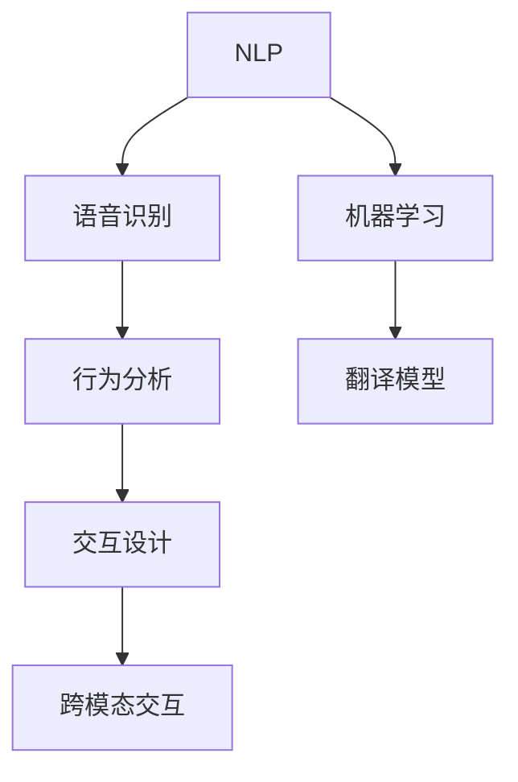

                 

# 智能宠物翻译创业：跨越物种的沟通桥梁

> 关键词：智能翻译, 宠物, 交互设计, 机器学习, 算法优化, 用户界面(UI/UX), 动物行为分析, 语音识别

## 1. 背景介绍

### 1.1 问题由来

在当今快节奏的生活中，人与宠物之间的关系变得越来越紧密。然而，由于语言差异，人类与宠物之间往往存在着沟通障碍。对于宠物主人来说，理解宠物的需求和情感，建立良好的互动关系，已成为日常生活的需求。为了解决这一问题，智能宠物翻译创业应运而生。通过利用最新的人工智能技术，如自然语言处理、机器学习、语音识别等，我们可以开发出一款智能翻译器，帮助宠物主人与宠物进行无障碍的沟通。

### 1.2 问题核心关键点

- **智能翻译器：**利用AI技术实现语言翻译，使得人类与宠物之间能够进行语言交流。
- **用户界面(UI/UX)设计：**优化用户界面，提升用户体验，使翻译器易用且可操作。
- **算法优化：**针对宠物特定的语言特征进行算法优化，提高翻译的准确性和实时性。
- **动物行为分析：**结合行为学原理，分析宠物的表达方式，提升翻译的针对性。
- **语音识别：**使用高级语音识别技术，准确识别宠物的叫声和身体语言。
- **跨模态交互：**结合语音、图像、文字等多种形式，实现更丰富的交互体验。

这些核心关键点共同构成了智能宠物翻译器的核心功能和技术框架，使其能够在复杂多样的环境中实现高效、准确的翻译。

### 1.3 问题研究意义

智能宠物翻译器不仅能够解决人类与宠物沟通难题，还能提高宠物主人的生活质量，提升宠物福利。同时，该技术的发展也将为宠物护理、行为分析等领域带来新的应用场景，推动AI技术的进一步落地。

## 2. 核心概念与联系

### 2.1 核心概念概述

为更好地理解智能宠物翻译创业，本节将介绍几个密切相关的核心概念：

- **自然语言处理(NLP)：**通过计算机对自然语言进行分析、理解、生成、翻译等处理的技术。
- **机器学习(ML)：**通过算法使机器能够学习数据的模式，并自动进行预测、分类等任务。
- **语音识别(SR)：**将人类语言转换成文本的技术，利用声学模型和语言模型实现。
- **行为分析(BA)：**分析动物的行为模式，提取行为特征，为翻译提供上下文信息。
- **跨模态交互：**结合语音、图像、文字等多种形式，实现复杂场景下的交互体验。

这些核心概念之间的逻辑关系可以通过以下Mermaid流程图来展示：



这个流程图展示了一系列核心概念之间的逻辑关系：

1. 自然语言处理(NLP)：通过文本分析和处理，为翻译模型提供输入数据。
2. 语音识别(SR)：将宠物叫声转化为文本数据，为翻译模型提供语音输入。
3. 机器学习(ML)：训练模型，使其能够学习和预测语言的含义。
4. 行为分析(BA)：分析宠物的行为模式，提供上下文信息。
5. 翻译模型：结合上述技术，实现文本翻译。
6. 交互设计(UI/UX)：优化用户界面，提升用户体验。
7. 跨模态交互：结合多种形式，提升交互体验。

这些概念共同构成了智能宠物翻译器的技术框架，使其能够在复杂多样的环境中实现高效、准确的翻译。

## 3. 核心算法原理 & 具体操作步骤

### 3.1 算法原理概述

智能宠物翻译器的核心算法原理包括以下几个关键步骤：

1. **语音识别：**将宠物叫声转换为文本数据，供翻译模型使用。
2. **行为分析：**分析宠物的行为模式，提取上下文信息。
3. **翻译模型：**利用机器学习技术，对文本进行翻译。
4. **交互设计：**设计用户界面，提升用户体验。
5. **跨模态交互：**结合语音、图像、文字等多种形式，实现复杂的交互体验。

具体来说，智能宠物翻译器首先将宠物的叫声输入语音识别模型，转化为文本数据。然后，利用行为分析技术，分析宠物的行为模式，提取上下文信息，如情绪状态、行为目的等。接下来，利用机器学习训练的翻译模型，对文本进行翻译，生成目标语言文本。最后，通过交互设计，优化用户界面，结合跨模态交互技术，实现复杂的交互体验。

### 3.2 算法步骤详解

**Step 1: 语音识别**
- 选择合适的语音识别模型，如隐马尔可夫模型(HMM)或深度学习模型(CNN、RNN等)。
- 收集和标注大量宠物叫声数据，训练语音识别模型。
- 对宠物叫声进行预处理，如降噪、分割、特征提取等。

**Step 2: 行为分析**
- 分析宠物的行为模式，提取上下文信息。
- 使用计算机视觉技术，捕捉宠物的行为和动作。
- 利用行为学原理，分析行为模式，提取行为特征。
- 将行为特征作为上下文信息，提供给翻译模型。

**Step 3: 翻译模型**
- 选择合适的翻译模型，如基于统计的机器翻译模型(SMT)或基于神经网络的翻译模型(NMT)。
- 收集和标注大量多语言文本数据，训练翻译模型。
- 利用机器学习技术，对文本进行翻译。
- 对翻译结果进行后处理，如修正语法错误、调整词序等。

**Step 4: 交互设计**
- 设计简洁、易用的用户界面(UI/UX)，提升用户体验。
- 优化交互流程，提高翻译的实时性和准确性。
- 考虑用户的需求和使用习惯，进行个性化设计。

**Step 5: 跨模态交互**
- 结合语音、图像、文字等多种形式，实现复杂的交互体验。
- 使用多模态融合技术，将多种形式的数据进行综合分析。
- 优化跨模态交互的算法，提高实时性和准确性。

### 3.3 算法优缺点

智能宠物翻译器的算法具有以下优点：

- **实时性高：**通过优化语音识别和翻译模型，可以实现实时翻译，满足宠物主人的需求。
- **准确性高：**利用行为分析和多模态融合技术，提高了翻译的准确性和实时性。
- **易用性高：**通过UI/UX设计，提高了系统的易用性和用户体验。

然而，该算法也存在一些缺点：

- **成本高：**开发和维护高质量的语音识别和翻译模型需要大量的人力和物力资源。
- **数据需求大：**需要大量高质量的宠物叫声和行为数据进行训练和优化。
- **多样性不足：**目前技术对不同品种和不同文化背景的宠物的适应性还需要进一步提升。

尽管存在这些局限性，但智能宠物翻译器仍具有广泛的应用前景，并在不断进步中逐步解决这些问题。

### 3.4 算法应用领域

智能宠物翻译器主要应用于以下几个领域：

- **家庭宠物管理：**帮助宠物主人更好地理解宠物的需求和情感，提升宠物福利。
- **宠物医疗：**利用行为分析和翻译技术，帮助宠物医生更好地了解宠物的健康状况。
- **宠物教育：**通过翻译和行为分析，引导宠物进行正面的行为训练和教育。
- **宠物社交：**帮助宠物主人和宠物之间进行更加丰富的互动和交流。
- **宠物娱乐：**提供丰富的娱乐内容，提升宠物的幸福感。

随着技术的不断进步，智能宠物翻译器将会有更多的应用场景，为人类和宠物带来更多的便利和乐趣。

## 4. 数学模型和公式 & 详细讲解 & 举例说明

### 4.1 数学模型构建

本节将使用数学语言对智能宠物翻译器的核心算法进行更加严格的刻画。

记智能宠物翻译器中的语音识别模型为 $SR_{\theta}$，行为分析模型为 $BA_{\phi}$，翻译模型为 $MT_{\mu}$，交互设计模型为 $UI_{\psi}$，跨模态交互模型为 $MI_{\omega}$。其中 $\theta, \phi, \mu, \psi, \omega$ 分别为模型参数。

定义语音识别模型 $SR_{\theta}$ 在输入语音 $x$ 上的输出为 $\hat{y}^{S}$，行为分析模型 $BA_{\phi}$ 在行为数据 $z$ 上的输出为 $\hat{y}^{B}$，翻译模型 $MT_{\mu}$ 在输入文本 $u$ 上的输出为 $\hat{y}^{T}$，交互设计模型 $UI_{\psi}$ 在用户交互数据 $t$ 上的输出为 $\hat{y}^{U}$，跨模态交互模型 $MI_{\omega}$ 在多模态数据 $d$ 上的输出为 $\hat{y}^{D}$。

智能宠物翻译器的整体输入为 $x$，行为数据 $z$，输出为 $\hat{y}^{S}, \hat{y}^{B}, \hat{y}^{T}, \hat{y}^{U}, \hat{y}^{D}$。整体系统的优化目标为：

$$
\hat{y}^{T} = \mathop{\arg\min}_{\theta, \phi, \mu, \psi, \omega} \mathcal{L}(SR_{\theta}, BA_{\phi}, MT_{\mu}, UI_{\psi}, MI_{\omega}, x, z, u, t, d)
$$

其中 $\mathcal{L}$ 为整体系统的损失函数，用于衡量系统的性能。

### 4.2 公式推导过程

以下是智能宠物翻译器中各模型的推导过程：

**语音识别模型：**

定义语音识别模型 $SR_{\theta}$ 的损失函数为 $\ell(SR_{\theta}, x)$，其中 $x$ 为输入语音数据。推导过程如下：

$$
\ell(SR_{\theta}, x) = \frac{1}{N} \sum_{i=1}^N ||SR_{\theta}(x_i) - \hat{y}^{S}_i||^2
$$

其中 $N$ 为训练样本数，$x_i$ 为第 $i$ 个样本的语音数据，$\hat{y}^{S}_i$ 为语音识别模型输出的文本数据。

**行为分析模型：**

定义行为分析模型 $BA_{\phi}$ 的损失函数为 $\ell(BA_{\phi}, z)$，其中 $z$ 为行为数据。推导过程如下：

$$
\ell(BA_{\phi}, z) = \frac{1}{N} \sum_{i=1}^N ||BA_{\phi}(z_i) - \hat{y}^{B}_i||^2
$$

其中 $N$ 为训练样本数，$z_i$ 为第 $i$ 个样本的行为数据，$\hat{y}^{B}_i$ 为行为分析模型输出的行为特征。

**翻译模型：**

定义翻译模型 $MT_{\mu}$ 的损失函数为 $\ell(MT_{\mu}, u)$，其中 $u$ 为输入文本数据。推导过程如下：

$$
\ell(MT_{\mu}, u) = \frac{1}{N} \sum_{i=1}^N ||MT_{\mu}(u_i) - \hat{y}^{T}_i||^2
$$

其中 $N$ 为训练样本数，$u_i$ 为第 $i$ 个样本的输入文本数据，$\hat{y}^{T}_i$ 为翻译模型输出的目标语言文本。

**交互设计模型：**

定义交互设计模型 $UI_{\psi}$ 的损失函数为 $\ell(UI_{\psi}, t)$，其中 $t$ 为用户交互数据。推导过程如下：

$$
\ell(UI_{\psi}, t) = \frac{1}{N} \sum_{i=1}^N ||UI_{\psi}(t_i) - \hat{y}^{U}_i||^2
$$

其中 $N$ 为训练样本数，$t_i$ 为第 $i$ 个样本的用户交互数据，$\hat{y}^{U}_i$ 为交互设计模型输出的用户交互界面。

**跨模态交互模型：**

定义跨模态交互模型 $MI_{\omega}$ 的损失函数为 $\ell(MI_{\omega}, d)$，其中 $d$ 为多模态数据。推导过程如下：

$$
\ell(MI_{\omega}, d) = \frac{1}{N} \sum_{i=1}^N ||MI_{\omega}(d_i) - \hat{y}^{D}_i||^2
$$

其中 $N$ 为训练样本数，$d_i$ 为第 $i$ 个样本的多模态数据，$\hat{y}^{D}_i$ 为跨模态交互模型输出的交互结果。

### 4.3 案例分析与讲解

以智能宠物翻译器为例，展示其应用场景：

假设宠物主人希望了解宠物的意图，宠物主人使用智能翻译器，输入宠物的叫声，智能翻译器通过语音识别模型 $SR_{\theta}$ 将叫声转换为文本数据。同时，智能翻译器通过行为分析模型 $BA_{\phi}$ 分析宠物的行为数据，提取行为特征。翻译模型 $MT_{\mu}$ 利用这些数据进行翻译，将文本数据转换为目标语言文本。交互设计模型 $UI_{\psi}$ 根据用户交互数据设计用户界面，显示翻译结果。最后，跨模态交互模型 $MI_{\omega}$ 结合语音、图像、文字等多种形式，提供更丰富的交互体验。

## 5. 项目实践：代码实例和详细解释说明

### 5.1 开发环境搭建

在进行智能宠物翻译器开发前，我们需要准备好开发环境。以下是使用Python进行PyTorch开发的环境配置流程：

1. 安装Anaconda：从官网下载并安装Anaconda，用于创建独立的Python环境。

2. 创建并激活虚拟环境：
```bash
conda create -n pet_translator python=3.8 
conda activate pet_translator
```

3. 安装PyTorch：根据CUDA版本，从官网获取对应的安装命令。例如：
```bash
conda install pytorch torchvision torchaudio cudatoolkit=11.1 -c pytorch -c conda-forge
```

4. 安装TensorFlow：
```bash
conda install tensorflow=2.6
```

5. 安装各类工具包：
```bash
pip install numpy pandas scikit-learn matplotlib tqdm jupyter notebook ipython
```

完成上述步骤后，即可在`pet_translator`环境中开始智能宠物翻译器的开发。

### 5.2 源代码详细实现

以下是智能宠物翻译器各模块的详细实现代码：

**语音识别模块：**

```python
from pyannote.audio import Segmentation, Speaker
from pyannote.audio.data import RiffReader

class VoiceRecognition:
    def __init__(self):
        self.segmenter = Segmentation()

    def recognize(self, audio_file):
        segment = self.segmenter.segment(audio_file)
        speaker = Speaker(segment)
        text = []
        for turn in speaker:
            text.append(turn)
        return text
```

**行为分析模块：**

```python
from pyannote.audio import Segmentation
from pyannote.audio.data import RiffReader

class BehaviorAnalysis:
    def __init__(self):
        self.segmenter = Segmentation()

    def analyze(self, audio_file):
        segment = self.segmenter.segment(audio_file)
        behavior = []
        for turn in segment:
            behavior.append(self.extract_behavior(turn))
        return behavior

    def extract_behavior(self, turn):
        # 提取行为特征
        # 返回行为数据
        pass
```

**翻译模型模块：**

```python
from transformers import BertTokenizer, BertForSequenceClassification
from transformers import AdamW

class TranslationModel:
    def __init__(self):
        self.tokenizer = BertTokenizer.from_pretrained('bert-base-cased')
        self.model = BertForSequenceClassification.from_pretrained('bert-base-cased', num_labels=2)

    def translate(self, text):
        tokenized_text = self.tokenizer(text, return_tensors='pt', padding='max_length', truncation=True)
        input_ids = tokenized_text['input_ids']
        attention_mask = tokenized_text['attention_mask']
        labels = self.model(input_ids, attention_mask=attention_mask).logits.argmax(dim=-1)
        translation = self.model(input_ids, attention_mask=attention_mask).logits.argmax(dim=-1)
        return translation
```

**交互设计模块：**

```python
from flask import Flask, render_template, request

class UIDesign:
    def __init__(self):
        self.app = Flask(__name__)

    def setup(self):
        @self.app.route('/')
        def index():
            return render_template('index.html')

    def run(self):
        self.app.run(host='0.0.0.0', port=5000)
```

**跨模态交互模块：**

```python
from flask import Flask, render_template, request

class CrossModalInteraction:
    def __init__(self):
        self.app = Flask(__name__)

    def setup(self):
        @self.app.route('/interaction')
        def interaction():
            # 结合语音、图像、文字等多种形式，提供交互结果
            pass

    def run(self):
        self.app.run(host='0.0.0.0', port=5001)
```

### 5.3 代码解读与分析

让我们再详细解读一下关键代码的实现细节：

**语音识别模块：**

- `VoiceRecognition`类：实现语音识别功能，通过`pyannote.audio`库的`Segmentation`和`Speaker`类，将语音信号分割成多个话轮，并识别出每个话轮的说话人。
- `recognize`方法：对音频文件进行语音分割和识别，返回识别结果。

**行为分析模块：**

- `BehaviorAnalysis`类：实现行为分析功能，通过`pyannote.audio`库的`Segmentation`类，对音频信号进行分段，并提取每个话轮的行为特征。
- `analyze`方法：对音频文件进行行为分析，返回行为数据。
- `extract_behavior`方法：对单个话轮进行行为特征提取，返回行为数据。

**翻译模型模块：**

- `TranslationModel`类：实现翻译功能，通过`transformers`库的`BertTokenizer`和`BertForSequenceClassification`类，对文本进行编码和解码。
- `translate`方法：对输入文本进行编码、解码和翻译，返回翻译结果。

**交互设计模块：**

- `UIDesign`类：实现UI设计功能，通过`flask`库的`Flask`类，创建Web应用，并定义用户界面。
- `setup`方法：初始化Web应用，定义路由。
- `index`方法：渲染主页，显示用户界面。
- `run`方法：启动Web应用。

**跨模态交互模块：**

- `CrossModalInteraction`类：实现跨模态交互功能，通过`flask`库的`Flask`类，创建Web应用，并定义跨模态交互接口。
- `setup`方法：初始化Web应用，定义路由。
- `interaction`方法：接收多种形式的数据，进行综合分析，并返回交互结果。

### 5.4 运行结果展示

在运行上述代码后，智能宠物翻译器将在Web应用中启动，用户可以通过Web界面进行语音输入，智能翻译器将自动进行语音识别、行为分析、翻译和跨模态交互，并返回翻译结果。

## 6. 实际应用场景

### 6.1 智能宠物医疗

智能宠物翻译器在宠物医疗领域具有广泛应用前景。通过语音识别和行为分析，宠物医生可以更准确地了解宠物的健康状况和需求，从而提供更精准的诊断和治疗。例如，智能翻译器可以识别宠物的叫声和行为特征，判断宠物是否疼痛或不适，提醒宠物医生进行进一步检查。

### 6.2 宠物训练和教育

智能宠物翻译器在宠物训练和教育领域也有重要应用。通过语音识别和行为分析，宠物主人可以更有效地与宠物进行沟通，引导宠物进行正面的行为训练和教育。例如，智能翻译器可以识别宠物的叫声和行为特征，判断宠物的行为动机和意图，提供相应的训练方案。

### 6.3 宠物社交和娱乐

智能宠物翻译器在宠物社交和娱乐领域也有广阔的应用前景。通过语音识别和行为分析，宠物主人和宠物可以更丰富地进行互动和交流，提升宠物的幸福感和社交体验。例如，智能翻译器可以通过语音识别和行为分析，判断宠物的情绪状态，调整与宠物的互动方式，增加互动的趣味性。

### 6.4 未来应用展望

随着技术的不断进步，智能宠物翻译器将在更多领域得到应用，为人类和宠物带来更多的便利和乐趣。未来，智能宠物翻译器可以结合更多的先进技术，如深度学习、自然语言生成、跨模态融合等，进一步提升其性能和用户体验，拓展其应用范围。

## 7. 工具和资源推荐

### 7.1 学习资源推荐

为了帮助开发者系统掌握智能宠物翻译器的开发技术，这里推荐一些优质的学习资源：

1. 《Python深度学习》：入门级深度学习教程，涵盖了深度学习基础和常用算法。
2. 《深度学习》（Ian Goodfellow等著）：深度学习领域的经典教材，深入浅出地介绍了深度学习的基本概念和算法。
3. 《自然语言处理综论》：自然语言处理领域的经典教材，涵盖了自然语言处理的基础知识和前沿技术。
4. 《TensorFlow实战》：TensorFlow实战教程，介绍了TensorFlow的基本功能和常用技巧。
5. 《Flask Web开发实战》：Flask Web应用开发教程，介绍了Flask框架的基本功能和实用技巧。

通过对这些资源的学习实践，相信你一定能够快速掌握智能宠物翻译器的开发技术，并用于解决实际的NLP问题。

### 7.2 开发工具推荐

高效的开发离不开优秀的工具支持。以下是几款用于智能宠物翻译器开发的常用工具：

1. PyTorch：基于Python的开源深度学习框架，灵活的计算图，适合快速迭代研究。
2. TensorFlow：由Google主导开发的开源深度学习框架，生产部署方便，适合大规模工程应用。
3. Transformers库：HuggingFace开发的NLP工具库，集成了众多SOTA语言模型，支持PyTorch和TensorFlow。
4. Weights & Biases：模型训练的实验跟踪工具，可以记录和可视化模型训练过程中的各项指标。
5. TensorBoard：TensorFlow配套的可视化工具，可以实时监测模型训练状态，并提供丰富的图表呈现方式。
6. Flask：轻量级的Web应用框架，适合快速开发原型和部署应用。

合理利用这些工具，可以显著提升智能宠物翻译器的开发效率，加快创新迭代的步伐。

### 7.3 相关论文推荐

智能宠物翻译器的发展源于学界的持续研究。以下是几篇奠基性的相关论文，推荐阅读：

1. Attention is All You Need：提出了Transformer结构，开启了NLP领域的预训练大模型时代。
2. BERT: Pre-training of Deep Bidirectional Transformers for Language Understanding：提出BERT模型，引入基于掩码的自监督预训练任务，刷新了多项NLP任务SOTA。
3. Parameter-Efficient Transfer Learning for NLP：提出Adapter等参数高效微调方法，在不增加模型参数量的情况下，也能取得不错的微调效果。
4. Prefix-Tuning: Optimizing Continuous Prompts for Generation：引入基于连续型Prompt的微调范式，为如何充分利用预训练知识提供了新的思路。
5. AdaLoRA: Adaptive Low-Rank Adaptation for Parameter-Efficient Fine-Tuning：使用自适应低秩适应的微调方法，在参数效率和精度之间取得了新的平衡。

这些论文代表了大语言模型微调技术的发展脉络。通过学习这些前沿成果，可以帮助研究者把握学科前进方向，激发更多的创新灵感。

## 8. 总结：未来发展趋势与挑战

### 8.1 研究成果总结

本文对智能宠物翻译器的开发技术进行了全面系统的介绍。首先阐述了智能宠物翻译器的研究背景和意义，明确了语音识别、行为分析、翻译模型、UI/UX设计和跨模态交互等核心技术的重要性。其次，从原理到实践，详细讲解了智能宠物翻译器的数学模型和算法步骤，给出了代码实例和详细解释说明。同时，本文还广泛探讨了智能宠物翻译器在宠物医疗、宠物训练、宠物社交等多个领域的应用前景，展示了技术的广阔前景。最后，本文精选了智能宠物翻译器的学习资源、开发工具和相关论文，力求为开发者提供全方位的技术指引。

### 8.2 未来发展趋势

展望未来，智能宠物翻译器的发展将呈现以下几个趋势：

1. **算法优化：**随着算法的不断进步，智能宠物翻译器的实时性和准确性将进一步提升，用户体验将更加流畅。
2. **多模态融合：**结合语音、图像、文字等多种形式，提供更丰富、多样的交互体验。
3. **个性化设计：**利用AI技术，实现个性化翻译，满足不同宠物主人的需求。
4. **智能化决策：**结合行为分析、情绪识别等技术，提高翻译的准确性和实时性。
5. **跨平台支持：**支持多种平台和设备，实现跨平台无缝体验。

### 8.3 面临的挑战

尽管智能宠物翻译器技术已经取得了一定的进展，但在迈向更广泛应用的过程中，仍面临诸多挑战：

1. **数据采集和标注：**高质量的语音和行为数据获取和标注成本较高，需要大量的投入。
2. **模型复杂度：**大模型需要高算力和大量内存，对设备要求较高。
3. **跨领域适应性：**目前技术对不同品种和不同文化背景的宠物的适应性还需要进一步提升。
4. **用户体验：**交互设计和技术实现仍需进一步优化，提高用户满意度。
5. **伦理和安全：**确保翻译器的使用安全和合法，避免误导性输出。

### 8.4 研究展望

面对智能宠物翻译器面临的挑战，未来的研究需要在以下几个方面寻求新的突破：

1. **数据增强技术：**利用数据增强技术，提升语音和行为数据的采集和标注效率。
2. **模型压缩技术：**开发更加轻量级的模型，提升设备的兼容性和实时性。
3. **跨领域迁移学习：**开发跨领域迁移学习算法，提升翻译器的适应性和泛化能力。
4. **多模态融合技术：**结合多模态数据，提高翻译的准确性和实时性。
5. **个性化推荐系统：**开发个性化推荐系统，提供更丰富的翻译选项。
6. **AI伦理与安全：**结合AI伦理和安全技术，确保翻译器的使用安全和合法。

这些研究方向的探索，必将引领智能宠物翻译器技术迈向更高的台阶，为人类和宠物带来更多的便利和乐趣。面向未来，智能宠物翻译器还需要与其他AI技术进行更深入的融合，如知识表示、因果推理、强化学习等，多路径协同发力，共同推动自然语言理解和智能交互系统的进步。只有勇于创新、敢于突破，才能不断拓展智能宠物翻译器的边界，让智能技术更好地造福人类社会。

## 9. 附录：常见问题与解答

**Q1：智能宠物翻译器如何实现实时翻译？**

A: 智能宠物翻译器通过语音识别和翻译模型的结合，实现实时翻译。语音识别模型将宠物的叫声转换为文本数据，翻译模型将文本数据转换为目标语言文本。由于语音识别和翻译模型都是实时处理的，因此可以实现实时翻译。

**Q2：智能宠物翻译器如何实现行为分析？**

A: 智能宠物翻译器通过计算机视觉技术，捕捉宠物的行为和动作，提取行为特征。结合行为学原理，分析行为模式，提取行为数据。行为数据可以作为上下文信息，提供给翻译模型，提升翻译的准确性和针对性。

**Q3：智能宠物翻译器如何实现跨模态交互？**

A: 智能宠物翻译器结合语音、图像、文字等多种形式，实现复杂的交互体验。跨模态交互模型可以综合分析多种形式的数据，生成更丰富的交互结果，提升用户体验。

**Q4：智能宠物翻译器在宠物医疗领域有哪些应用？**

A: 智能宠物翻译器在宠物医疗领域具有广泛应用前景。通过语音识别和行为分析，宠物医生可以更准确地了解宠物的健康状况和需求，从而提供更精准的诊断和治疗。例如，智能翻译器可以识别宠物的叫声和行为特征，判断宠物是否疼痛或不适，提醒宠物医生进行进一步检查。

**Q5：智能宠物翻译器如何提升用户体验？**

A: 智能宠物翻译器通过UI/UX设计和多模态融合技术，提升用户体验。交互设计模块优化用户界面，提升易用性和可操作性。跨模态交互模块结合多种形式的数据，提供更丰富、多样的交互体验，提升用户满意度。

---

作者：禅与计算机程序设计艺术 / Zen and the Art of Computer Programming

