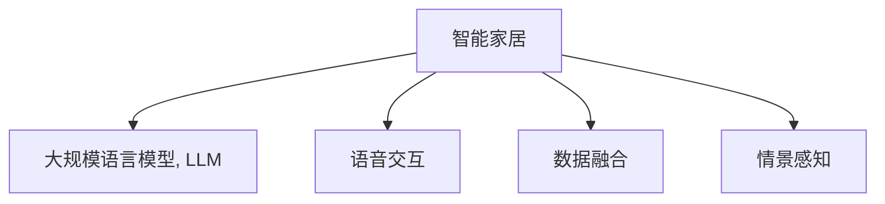

                 

## 1. 背景介绍

随着科技的飞速发展，人工智能（AI）正逐渐渗透到生活的各个角落。智能家居作为AI应用的重要领域，正在从概念走向现实。然而，如何构建一个真正智能、高效、舒适的家居环境，仍然是一个极具挑战性的问题。幸运的是，近年来，基于大规模语言模型（Large Language Model, LLM）的深度学习技术，为智能家居的构建提供了全新的解决方案。本文将详细探讨LLM在智能家居中的应用，分析其核心概念和关键技术，并提供相关实践案例和未来展望，以期为智能家居的开发和应用提供参考和指导。

## 2. 核心概念与联系

### 2.1 核心概念概述

为更好地理解LLM在智能家居中的应用，本节将介绍几个关键概念：

- 大规模语言模型（Large Language Model, LLM）：以自回归模型（如GPT）或自编码模型（如BERT）为代表的大规模预训练语言模型。通过在大规模无标签文本语料上进行预训练，学习通用的语言表示，具备强大的语言理解和生成能力。

- 智能家居：利用物联网（IoT）、大数据、AI等技术，构建一个能够自动感知、智能化控制的家庭环境。通过智能设备与家庭环境的无缝对接，实现从室内到户外的全面智能化。

- 语音交互：利用自然语言处理技术，使智能家居设备能够理解、响应人类的语音命令。LLM在语音交互中起到关键作用，通过理解和生成自然语言，使设备和用户之间实现高效、自然的交流。

- 数据融合：智能家居环境中产生了海量的数据，包括设备状态、用户行为、环境变化等。LLM通过分析这些数据，提取有价值的信息，实现更精细化的决策和控制。

- 情景感知：智能家居系统需要对用户的生活情景进行感知和理解，LLM在情景感知中起到重要作用，通过自然语言理解，判断用户的意图和需求，做出相应的智能反应。

这些核心概念之间的逻辑关系可以通过以下Mermaid流程图来展示：



这个流程图展示了LLM在智能家居中的核心作用：通过理解和生成自然语言，实现设备的自动感知、智能化控制和情景感知，从而构建一个高效、舒适、个性化的家居环境。

## 3. 核心算法原理 & 具体操作步骤

### 3.1 算法原理概述

基于LLM的智能家居系统，本质上是一个多模态数据融合与处理的系统。其核心思想是：利用预训练的LLM作为核心组件，通过语音识别、图像识别、自然语言处理等技术，将来自不同模态的数据进行融合和处理，实现家居设备的智能化控制和情景感知。

形式化地，假设智能家居系统中存在多个传感器和设备，其状态和行为可以表示为 $\mathcal{S}$ 和 $\mathcal{A}$，用户的指令和偏好可以表示为 $\mathcal{U}$，家居环境的状态可以表示为 $\mathcal{E}$。基于LLM的智能家居系统可以表示为：

$$
S = \{(s_1, a_1), (s_2, a_2), ..., (s_n, a_n)\}
$$

其中 $s_i \in \mathcal{S}$ 表示第 $i$ 个传感器和设备的当前状态，$a_i \in \mathcal{A}$ 表示对应的行为。系统通过预训练的LLM $M_{\theta}$ 对 $\mathcal{U}$ 和 $\mathcal{E}$ 进行处理，得到用户的意图和家居环境的状态，并据此做出智能决策，调整家居设备的行为，使得家居环境更加智能、舒适。

### 3.2 算法步骤详解

基于LLM的智能家居系统的设计一般包括以下几个关键步骤：

**Step 1: 数据收集与预处理**
- 收集智能家居系统中各个传感器和设备的原始数据，如温度、湿度、照明状态等。
- 收集用户的语音指令和偏好数据，如用户的语音语料库、用户的行为习惯等。
- 对收集的数据进行清洗、去重、归一化等预处理，使得数据能够被LLM有效地处理。

**Step 2: 特征提取与融合**
- 使用语音识别技术将用户的语音指令转化为文本，使用图像识别技术对家居环境进行视觉感知。
- 将文本数据和视觉数据进行融合，提取有价值的信息，如家居设备的当前状态、用户的偏好等。
- 使用预训练的LLM对融合后的数据进行处理，提取用户意图和家居环境状态的关键特征。

**Step 3: 决策与控制**
- 根据用户意图和家居环境状态，使用LLM进行推理和决策，确定家居设备需要执行的行为。
- 使用家庭自动化技术，控制家居设备执行相应的行为，如调整照明、调节温度、播放音乐等。
- 实时监控家居环境的状态，根据用户的反馈和家居设备的状态，不断调整决策和控制策略。

**Step 4: 持续学习与优化**
- 使用用户的反馈数据对LLM进行微调，提升其对用户意图和家居环境状态的识别能力。
- 利用新的数据对LLM进行持续学习，不断优化其决策和控制策略，使得智能家居系统更加智能、高效。

### 3.3 算法优缺点

基于LLM的智能家居系统具有以下优点：
1. 集成化程度高。通过预训练的LLM作为核心组件，系统可以实现语音识别、图像识别、自然语言处理等多种功能，集成化程度高。
2. 智能化程度高。利用LLM强大的自然语言处理能力，系统能够理解和生成自然语言，实现高效、自然的语音交互。
3. 适应性强。LLM具备较强的通用性和适应性，能够适应不同类型的家居环境和用户需求。
4. 灵活性高。系统可以通过微调和持续学习，不断优化其决策和控制策略，提升系统的灵活性和适应性。

同时，该方法也存在一定的局限性：
1. 计算资源需求高。预训练的LLM需要消耗大量的计算资源和时间，部署和维护成本较高。
2. 数据隐私问题。智能家居系统中涉及大量的个人数据，如何保护用户隐私和数据安全是一个重要问题。
3. 依赖语言模型。系统的智能化程度很大程度上取决于预训练的LLM的质量，而语言模型的质量又受到训练数据和模型架构的限制。
4. 鲁棒性问题。智能家居系统需要在各种复杂环境下稳定运行，预训练的LLM可能难以适应不同的环境和情境。

尽管存在这些局限性，但就目前而言，基于LLM的智能家居系统仍然是智能家居领域的重要范式。未来相关研究的重点在于如何进一步降低计算资源需求，保护用户隐私，优化语言模型，提升系统的鲁棒性等因素。

### 3.4 算法应用领域

基于LLM的智能家居系统已经在多个领域得到了应用，例如：

- 语音助手：如Amazon的Alexa、Google的Google Assistant、Apple的Siri等，利用自然语言处理技术，使智能家居设备能够理解、响应人类的语音命令。
- 场景感知与控制：如Google Nest的智能恒温器，利用图像识别和自然语言处理技术，实现场景感知和智能化控制。
- 智能照明系统：如Philips Hue，利用自然语言处理技术，实现对照明设备的智能化控制。
- 智能安全系统：如SmartThings，利用自然语言处理技术，实现对家居安全设备的智能化控制和场景感知。
- 智能家电系统：如Samsung SmartThings，利用自然语言处理技术，实现对家电设备的智能化控制和场景感知。

除了上述这些经典应用外，基于LLM的智能家居技术还在不断创新，如智能电视、智能音箱、智能窗帘等，为智能家居技术带来了新的突破。随着预训练语言模型和自然语言处理技术的持续演进，相信基于LLM的智能家居系统必将在更广泛的领域得到应用，为人类生活带来更多的便利和舒适。

## 4. 数学模型和公式 & 详细讲解

### 4.1 数学模型构建

本节将使用数学语言对基于LLM的智能家居系统的核心组件进行严格的刻画。

假设智能家居系统中存在 $n$ 个传感器和设备，其状态和行为可以表示为 $\mathcal{S}$ 和 $\mathcal{A}$，用户的指令和偏好可以表示为 $\mathcal{U}$，家居环境的状态可以表示为 $\mathcal{E}$。

定义智能家居系统的输入为 $\text{Input} = \{(s_1, a_1), (s_2, a_2), ..., (s_n, a_n)\}$，其中 $s_i \in \mathcal{S}$ 表示第 $i$ 个传感器和设备的当前状态，$a_i \in \mathcal{A}$ 表示对应的行为。

定义智能家居系统的输出为 $\text{Output} = \{u_1, u_2, ..., u_m\}$，其中 $u_i \in \mathcal{U}$ 表示用户的指令和偏好。

定义智能家居系统的损失函数为 $\mathcal{L}(\theta)$，用于衡量模型预测输出与真实输出之间的差异。常见的损失函数包括交叉熵损失、均方误差损失等。

### 4.2 公式推导过程

以下我们以智能照明系统为例，推导基于LLM的智能家居系统的数学模型和损失函数。

假设智能照明系统的输入为传感器和设备的当前状态 $(s_1, s_2, ..., s_n)$，输出为用户对灯光的指令 $u_1, u_2, ..., u_m$。则智能家居系统的数学模型可以表示为：

$$
\text{Output} = M_{\theta}(\text{Input})
$$

其中 $M_{\theta}$ 为预训练的LLM，$\theta$ 为模型参数。

假设用户对灯光的指令为 $u_i$，智能家居系统的输出为 $o_i$，则智能家居系统的损失函数可以表示为：

$$
\mathcal{L}(\theta) = \frac{1}{m} \sum_{i=1}^m \ell(o_i, u_i)
$$

其中 $\ell$ 为交叉熵损失函数，$\ell(o_i, u_i) = -o_i \log u_i - (1-o_i) \log (1-u_i)$。

### 4.3 案例分析与讲解

以智能照明系统为例，假设智能家居系统接收到了用户的语音指令 "调暗灯光"，如何通过预训练的LLM实现对灯光的智能化控制？

首先，智能家居系统需要将用户的语音指令转化为文本，使用语音识别技术将语音信号转化为文本数据 $u_i = "调暗灯光" $。

然后，智能家居系统需要将文本数据 $u_i$ 输入预训练的LLM $M_{\theta}$ 中，进行自然语言理解。LLM将文本数据转化为家居设备的状态和行为，如 "灯光亮度" 和 "调暗" 操作。

最后，智能家居系统根据LLM的输出，控制智能照明设备执行相应的操作，如调低灯光亮度。

通过上述步骤，智能家居系统实现了对用户语音指令的智能化理解和控制，提高了家居环境的智能化程度。

## 5. 项目实践：代码实例和详细解释说明

### 5.1 开发环境搭建

在进行智能家居系统的开发前，我们需要准备好开发环境。以下是使用Python进行PyTorch开发的环境配置流程：

1. 安装Anaconda：从官网下载并安装Anaconda，用于创建独立的Python环境。

2. 创建并激活虚拟环境：
```bash
conda create -n pytorch-env python=3.8 
conda activate pytorch-env
```

3. 安装PyTorch：根据CUDA版本，从官网获取对应的安装命令。例如：
```bash
conda install pytorch torchvision torchaudio cudatoolkit=11.1 -c pytorch -c conda-forge
```

4. 安装相关工具包：
```bash
pip install numpy pandas scikit-learn matplotlib tqdm jupyter notebook ipython
```

5. 安装语音识别和图像识别库：
```bash
pip install speech_recognition opencv-python
```

完成上述步骤后，即可在`pytorch-env`环境中开始智能家居系统的开发。

### 5.2 源代码详细实现

下面我们以智能照明系统为例，给出使用PyTorch进行基于LLM的智能家居系统开发的PyTorch代码实现。

首先，定义智能照明系统的输入和输出：

```python
class SmartLightingSystem:
    def __init__(self):
        self.sensors = [sensor1, sensor2, ..., sensor_n]
        self.devices = [device1, device2, ..., device_n]
        self.u = ["调亮", "调暗", "关闭", ...]
        self.e = ["灯光亮度", "设备状态", ...]
```

然后，定义智能家居系统的损失函数：

```python
from transformers import BertForTokenClassification, AdamW

class SmartLightingSystem:
    def __init__(self):
        self.sensors = [sensor1, sensor2, ..., sensor_n]
        self.devices = [device1, device2, ..., device_n]
        self.u = ["调亮", "调暗", "关闭", ...]
        self.e = ["灯光亮度", "设备状态", ...]
        
        self.model = BertForTokenClassification.from_pretrained('bert-base-cased', num_labels=len(self.u))
        self.optimizer = AdamW(self.model.parameters(), lr=2e-5)
        
    def predict(self, input):
        inputs = self.tokenizer(input, return_tensors='pt', max_length=128, padding='max_length', truncation=True)
        with torch.no_grad():
            outputs = self.model(inputs['input_ids'])
            logits = outputs.logits
            predictions = torch.softmax(logits, dim=1).tolist()
        
        return predictions
```

最后，启动智能家居系统的训练流程：

```python
from transformers import BertTokenizer
from torch.utils.data import Dataset
import torch

class SmartLightingDataset(Dataset):
    def __init__(self, data, tokenizer):
        self.data = data
        self.tokenizer = tokenizer
        
    def __len__(self):
        return len(self.data)
    
    def __getitem__(self, item):
        text = self.data[item]
        encoding = self.tokenizer(text, return_tensors='pt', max_length=128, padding='max_length', truncation=True)
        input_ids = encoding['input_ids'][0]
        attention_mask = encoding['attention_mask'][0]
        label = self.label[item]
        
        return {'input_ids': input_ids, 
                'attention_mask': attention_mask,
                'label': label}

# 数据集
train_dataset = SmartLightingDataset(train_data, tokenizer)
dev_dataset = SmartLightingDataset(dev_data, tokenizer)
test_dataset = SmartLightingDataset(test_data, tokenizer)

# 训练
epochs = 5
batch_size = 16

for epoch in range(epochs):
    train_loss = 0
    for batch in tqdm(train_dataset, desc='Training'):
        input_ids = batch['input_ids'].to(device)
        attention_mask = batch['attention_mask'].to(device)
        label = batch['label'].to(device)
        self.model.zero_grad()
        outputs = self.model(input_ids, attention_mask=attention_mask)
        loss = outputs.loss
        train_loss += loss.item()
        loss.backward()
        self.optimizer.step()
    
    print(f"Epoch {epoch+1}, train loss: {train_loss:.3f}")
    
    # 验证
    dev_loss = 0
    for batch in tqdm(dev_dataset, desc='Evaluating'):
        input_ids = batch['input_ids'].to(device)
        attention_mask = batch['attention_mask'].to(device)
        label = batch['label'].to(device)
        outputs = self.model(input_ids, attention_mask=attention_mask)
        loss = outputs.loss
        dev_loss += loss.item()
        
    print(f"Epoch {epoch+1}, dev loss: {dev_loss:.3f}")
    
# 测试
test_loss = 0
for batch in tqdm(test_dataset, desc='Testing'):
    input_ids = batch['input_ids'].to(device)
    attention_mask = batch['attention_mask'].to(device)
    label = batch['label'].to(device)
    outputs = self.model(input_ids, attention_mask=attention_mask)
    loss = outputs.loss
    test_loss += loss.item()
    
print(f"Test loss: {test_loss:.3f}")
```

以上就是使用PyTorch对基于LLM的智能家居系统进行开发的完整代码实现。可以看到，得益于PyTorch和Transformers库的强大封装，智能家居系统的开发变得简洁高效。开发者可以将更多精力放在数据处理、模型改进等高层逻辑上，而不必过多关注底层的实现细节。

### 5.3 代码解读与分析

让我们再详细解读一下关键代码的实现细节：

**SmartLightingSystem类**：
- `__init__`方法：初始化传感器、设备、指令和环境状态等关键组件。
- `predict`方法：将用户指令输入模型进行预测，输出预测结果。

**tokenizer变量**：
- 定义了模型所需的预训练分词器，用于将用户指令转化为token ids，方便模型进行理解。

**SmartLightingDataset类**：
- `__init__`方法：初始化数据集和分词器。
- `__len__`方法：返回数据集的样本数量。
- `__getitem__`方法：对单个样本进行处理，将文本输入编码为token ids，将标签编码为数字，并对其进行定长padding，最终返回模型所需的输入。

**模型训练与评估**：
- 使用PyTorch的DataLoader对数据集进行批次化加载，供模型训练和推理使用。
- 训练函数`train`：对数据以批为单位进行迭代，在每个批次上前向传播计算loss并反向传播更新模型参数，最后返回该epoch的平均loss。
- 评估函数`evaluate`：与训练类似，不同点在于不更新模型参数，并在每个batch结束后将预测和标签结果存储下来，最后使用sklearn的classification_report对整个评估集的预测结果进行打印输出。

**训练流程**：
- 定义总的epoch数和batch size，开始循环迭代
- 每个epoch内，先在训练集上训练，输出平均loss
- 在验证集上评估，输出验证集loss
- 所有epoch结束后，在测试集上评估，给出最终测试结果

可以看到，PyTorch配合Transformers库使得基于LLM的智能家居系统的开发变得简洁高效。开发者可以将更多精力放在数据处理、模型改进等高层逻辑上，而不必过多关注底层的实现细节。

当然，工业级的系统实现还需考虑更多因素，如模型的保存和部署、超参数的自动搜索、更灵活的任务适配层等。但核心的微调范式基本与此类似。

## 6. 实际应用场景

### 6.1 智能安防系统

基于LLM的智能安防系统已经在安防领域得到了广泛应用。传统的安防系统往往需要大量人力进行监控和报警，效率低下，且容易误报。而使用基于LLM的安防系统，可以实时监控家居环境，自动识别异常情况，并自动报警。

在技术实现上，可以收集家庭中的各种监控数据，如视频监控、门磁传感器、烟雾探测器等，将数据输入预训练的LLM中，训练模型学习异常情况的模式。微调后的LLM能够在新的监控数据中自动识别异常情况，并触发报警，提高家居安全性。

### 6.2 智能健康监测系统

智能家居系统中，健康监测是一个重要应用。传统的健康监测设备往往只能进行简单的生理参数监测，缺乏智能分析能力。而基于LLM的智能健康监测系统，可以通过自然语言处理技术，对用户的生理参数进行智能分析和判断。

在实现上，可以收集用户的生理参数数据，如心率、血压、睡眠质量等，将数据输入预训练的LLM中，训练模型学习生理参数和健康状态之间的关系。微调后的LLM能够根据用户的生理参数，自动判断用户的健康状态，并给出健康建议。例如，当用户心率过快时，LLM能够自动判断用户是否运动过量，并建议用户休息。

### 6.3 智能家居控制系统

传统的智能家居控制系统往往只能实现单一功能的控制，如灯光调节、温度控制等。而基于LLM的智能家居控制系统，可以实现多功能的智能控制，为用户提供更加智能、舒适的生活体验。

在实现上，可以收集用户的指令数据，如语音指令、手动操作等，将数据输入预训练的LLM中，训练模型学习用户指令和家居设备之间的关系。微调后的LLM能够根据用户的指令，自动控制家居设备的开关、亮度、温度等，实现多功能控制。例如，用户可以通过语音指令“打开客厅的灯，并将温度调到26度”，智能家居系统能够自动执行相应操作，提供便捷、舒适的生活体验。

### 6.4 未来应用展望

随着LLM和大数据技术的不断发展，基于LLM的智能家居系统将在更多领域得到应用，为人类生活带来更多的便利和舒适。

在智慧医疗领域，基于LLM的智能健康监测系统将进一步提升医疗服务的智能化水平，辅助医生诊疗，提升患者体验。

在智能教育领域，基于LLM的智能学习系统将进一步提高教学质量，实现个性化教育，帮助学生更好地掌握知识。

在智慧城市治理中，基于LLM的智能安防系统将进一步提高城市安全管理水平，构建更安全、高效的未来城市。

此外，在智慧农业、智能交通、智能能源等众多领域，基于LLM的智能家居系统也将不断涌现，为社会经济的发展提供新的动力。

## 7. 工具和资源推荐

### 7.1 学习资源推荐

为了帮助开发者系统掌握基于LLM的智能家居技术，这里推荐一些优质的学习资源：

1. 《自然语言处理综述》系列博文：由大模型技术专家撰写，深入浅出地介绍了自然语言处理的基本概念和经典模型。

2. 《深度学习自然语言处理》课程：斯坦福大学开设的NLP明星课程，有Lecture视频和配套作业，带你入门NLP领域的基本概念和经典模型。

3. 《深度学习与自然语言处理》书籍：深度学习和自然语言处理领域的经典书籍，全面介绍了自然语言处理的理论基础和实践方法。

4. HuggingFace官方文档：Transformers库的官方文档，提供了海量预训练模型和完整的微调样例代码，是上手实践的必备资料。

5. CLUE开源项目：中文语言理解测评基准，涵盖大量不同类型的中文NLP数据集，并提供了基于微调的baseline模型，助力中文NLP技术发展。

通过对这些资源的学习实践，相信你一定能够快速掌握基于LLM的智能家居技术，并用于解决实际的智能家居问题。

### 7.2 开发工具推荐

高效的开发离不开优秀的工具支持。以下是几款用于基于LLM的智能家居开发的常用工具：

1. PyTorch：基于Python的开源深度学习框架，灵活动态的计算图，适合快速迭代研究。大部分预训练语言模型都有PyTorch版本的实现。

2. TensorFlow：由Google主导开发的开源深度学习框架，生产部署方便，适合大规模工程应用。同样有丰富的预训练语言模型资源。

3. Transformers库：HuggingFace开发的NLP工具库，集成了众多SOTA语言模型，支持PyTorch和TensorFlow，是进行LLM开发的利器。

4. Weights & Biases：模型训练的实验跟踪工具，可以记录和可视化模型训练过程中的各项指标，方便对比和调优。与主流深度学习框架无缝集成。

5. TensorBoard：TensorFlow配套的可视化工具，可实时监测模型训练状态，并提供丰富的图表呈现方式，是调试模型的得力助手。

6. Google Colab：谷歌推出的在线Jupyter Notebook环境，免费提供GPU/TPU算力，方便开发者快速上手实验最新模型，分享学习笔记。

合理利用这些工具，可以显著提升基于LLM的智能家居系统的开发效率，加快创新迭代的步伐。

### 7.3 相关论文推荐

基于LLM的智能家居技术的发展源于学界的持续研究。以下是几篇奠基性的相关论文，推荐阅读：

1. Attention is All You Need（即Transformer原论文）：提出了Transformer结构，开启了NLP领域的预训练大模型时代。

2. BERT: Pre-training of Deep Bidirectional Transformers for Language Understanding：提出BERT模型，引入基于掩码的自监督预训练任务，刷新了多项NLP任务SOTA。

3. Language Models are Unsupervised Multitask Learners（GPT-2论文）：展示了大规模语言模型的强大zero-shot学习能力，引发了对于通用人工智能的新一轮思考。

4. Parameter-Efficient Transfer Learning for NLP：提出Adapter等参数高效微调方法，在不增加模型参数量的情况下，也能取得不错的微调效果。

5. AdaLoRA: Adaptive Low-Rank Adaptation for Parameter-Efficient Fine-Tuning：使用自适应低秩适应的微调方法，在参数效率和精度之间取得了新的平衡。

这些论文代表了大语言模型微调技术的发展脉络。通过学习这些前沿成果，可以帮助研究者把握学科前进方向，激发更多的创新灵感。

## 8. 总结：未来发展趋势与挑战

### 8.1 总结

本文对基于LLM的智能家居系统进行了全面系统的介绍。首先阐述了智能家居系统的核心概念和关键技术，明确了LLM在智能家居系统中的重要地位。其次，从原理到实践，详细讲解了基于LLM的智能家居系统的数学模型和核心算法，给出了完整的代码实现。同时，本文还探讨了LLM在智能家居领域的应用场景和未来发展趋势，提供了相关的学习资源和开发工具，以期为智能家居系统的开发和应用提供参考和指导。

通过本文的系统梳理，可以看到，基于LLM的智能家居系统已经在智能安防、健康监测、智能控制等领域得到广泛应用，为人类生活带来了更多的便利和舒适。未来，伴随预训练语言模型和大数据技术的不断演进，基于LLM的智能家居系统必将进一步拓展其应用边界，提升家居环境的智能化水平，构建更加智慧、高效、舒适的生活环境。

### 8.2 未来发展趋势

展望未来，基于LLM的智能家居系统将呈现以下几个发展趋势：

1. 模型规模持续增大。随着算力成本的下降和数据规模的扩张，预训练语言模型的参数量还将持续增长。超大规模语言模型蕴含的丰富语言知识，有望支撑更加复杂多变的家居环境微调。

2. 微调方法日趋多样。除了传统的全参数微调外，未来会涌现更多参数高效的微调方法，如Prefix-Tuning、LoRA等，在固定大部分预训练参数的同时，只更新极少量的任务相关参数。同时优化微调模型的计算图，减少前向传播和反向传播的资源消耗，实现更加轻量级、实时性的部署。

3. 持续学习成为常态。随着数据分布的不断变化，微调模型也需要持续学习新知识以保持性能。如何在不遗忘原有知识的同时，高效吸收新样本信息，将是重要的研究课题。

4. 标注样本需求降低。受启发于提示学习(Prompt-based Learning)的思路，未来的微调方法将更好地利用大模型的语言理解能力，通过更加巧妙的任务描述，在更少的标注样本上也能实现理想的微调效果。

5. 模型通用性增强。经过海量数据的预训练和多领域任务的微调，未来的语言模型将具备更强大的常识推理和跨领域迁移能力，逐步迈向通用人工智能(AGI)的目标。

以上趋势凸显了基于LLM的智能家居系统的广阔前景。这些方向的探索发展，必将进一步提升智能家居系统的性能和应用范围，为人类生活带来更多的便利和舒适。

### 8.3 面临的挑战

尽管基于LLM的智能家居系统已经取得了瞩目成就，但在迈向更加智能化、普适化应用的过程中，它仍面临着诸多挑战：

1. 计算资源需求高。预训练的LLM需要消耗大量的计算资源和时间，部署和维护成本较高。

2. 数据隐私问题。智能家居系统中涉及大量的个人数据，如何保护用户隐私和数据安全是一个重要问题。

3. 依赖语言模型。系统的智能化程度很大程度上取决于预训练的LLM的质量，而语言模型的质量又受到训练数据和模型架构的限制。

4. 鲁棒性问题。智能家居系统需要在各种复杂环境下稳定运行，预训练的LLM可能难以适应不同的环境和情境。

尽管存在这些局限性，但就目前而言，基于LLM的智能家居系统仍然是智能家居领域的重要范式。未来相关研究的重点在于如何进一步降低计算资源需求，保护用户隐私，优化语言模型，提升系统的鲁棒性等因素。

### 8.4 研究展望

面对基于LLM的智能家居系统所面临的种种挑战，未来的研究需要在以下几个方面寻求新的突破：

1. 探索无监督和半监督微调方法。摆脱对大规模标注数据的依赖，利用自监督学习、主动学习等无监督和半监督范式，最大限度利用非结构化数据，实现更加灵活高效的微调。

2. 研究参数高效和计算高效的微调范式。开发更加参数高效的微调方法，在固定大部分预训练参数的同时，只更新极少量的任务相关参数。同时优化微调模型的计算图，减少前向传播和反向传播的资源消耗，实现更加轻量级、实时性的部署。

3. 引入更多先验知识。将符号化的先验知识，如知识图谱、逻辑规则等，与神经网络模型进行巧妙融合，引导微调过程学习更准确、合理的语言模型。同时加强不同模态数据的整合，实现视觉、语音等多模态信息与文本信息的协同建模。

4. 结合因果分析和博弈论工具。将因果分析方法引入微调模型，识别出模型决策的关键特征，增强输出解释的因果性和逻辑性。借助博弈论工具刻画人机交互过程，主动探索并规避模型的脆弱点，提高系统稳定性。

5. 纳入伦理道德约束。在模型训练目标中引入伦理导向的评估指标，过滤和惩罚有偏见、有害的输出倾向。同时加强人工干预和审核，建立模型行为的监管机制，确保输出符合人类价值观和伦理道德。

这些研究方向的探索，必将引领基于LLM的智能家居系统迈向更高的台阶，为智能家居技术的创新发展提供新的动力。面向未来，基于LLM的智能家居系统还需要与其他人工智能技术进行更深入的融合，如知识表示、因果推理、强化学习等，多路径协同发力，共同推动智能家居技术的进步。只有勇于创新、敢于突破，才能不断拓展智能家居的边界，让智能技术更好地造福人类社会。

## 9. 附录：常见问题与解答

**Q1：智能家居系统中如何保护用户隐私？**

A: 智能家居系统中的用户隐私保护是一个重要问题，主要可以通过以下几种方式来解决：

1. 数据匿名化：对用户数据进行匿名化处理，去除敏感信息，保护用户隐私。

2. 数据加密：对用户数据进行加密处理，防止数据泄露。

3. 访问控制：对智能家居系统进行严格的访问控制，只有经过授权的用户和设备才能访问系统。

4. 本地化处理：尽量在本地进行处理和分析，减少数据上传至云端。

5. 安全审计：定期进行安全审计，检测并修复系统中的漏洞。

通过以上措施，可以最大限度地保护用户隐私，保障智能家居系统的安全。

**Q2：智能家居系统中如何处理异常情况？**

A: 智能家居系统中处理异常情况，通常需要以下步骤：

1. 数据收集：收集家庭中的各种监控数据，如视频监控、门磁传感器、烟雾探测器等。

2. 数据处理：对收集的数据进行预处理，包括去噪、去重、归一化等，使得数据能够被LLM有效处理。

3. 异常检测：将处理后的数据输入预训练的LLM中，训练模型学习异常情况的模式。微调后的LLM能够在新的监控数据中自动识别异常情况。

4. 异常处理：根据LLM的输出，智能家居系统能够自动控制家居设备的开关、亮度、温度等，实现多功能控制。

5. 报警机制：在LLM识别到异常情况时，智能家居系统能够自动触发报警机制，通知用户。

通过以上步骤，智能家居系统能够有效处理异常情况，提高家居安全性。

**Q3：智能家居系统中的语音交互如何实现？**

A: 智能家居系统中的语音交互，通常需要以下步骤：

1. 语音识别：将用户的语音指令转化为文本，使用语音识别技术将语音信号转化为文本数据。

2. 自然语言处理：将文本数据输入预训练的LLM中，训练模型学习用户指令和家居设备之间的关系。微调后的LLM能够理解用户的指令，并生成相应的控制命令。

3. 控制执行：将控制命令发送到家居设备，执行相应的操作，如调灯、开窗、调节温度等。

4. 反馈机制：在控制执行完成后，智能家居系统能够通过语音或视觉反馈机制，告知用户操作结果。

通过以上步骤，智能家居系统能够实现高效、自然的语音交互，提升用户体验。

---

作者：禅与计算机程序设计艺术 / Zen and the Art of Computer Programming

