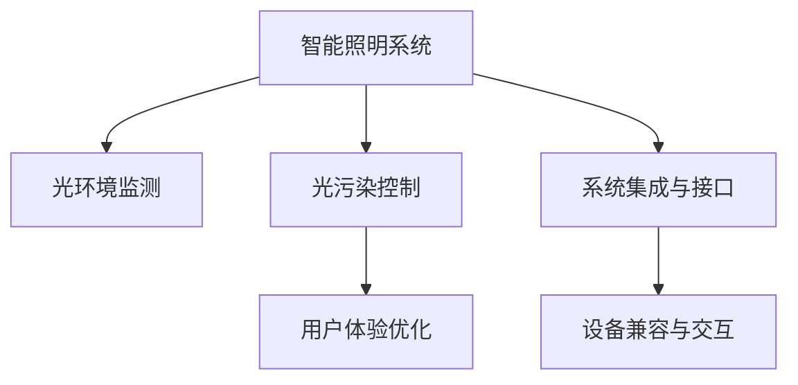

                 

## 1. 背景介绍

### 1.1 问题由来
随着科技的飞速发展，智能家居系统逐渐成为了现代家庭生活的重要组成部分。然而，由于智能家居设备和环境光的广泛应用，光污染问题也日渐突出。研究表明，过度的光污染不仅会对人的眼睛健康造成危害，还可能引起睡眠障碍、情绪波动等身心问题。因此，开发一套健康照明的科技方案，有效控制光污染，提升室内环境质量，成为了智能家居领域亟待解决的问题。

### 1.2 问题核心关键点
智能家居光污染控制的核心关键点包括：

- 如何获取室内光环境和用户需求数据，作为智能照明系统的输入。
- 如何设计智能照明算法，根据环境光数据和用户偏好，动态调整照明参数。
- 如何优化系统响应速度和稳定性，确保在各种复杂环境下都能正常工作。
- 如何设计界面和交互方式，使用户能够方便地控制和管理照明系统。
- 如何实现系统的可扩展性和适应性，支持各种照明设备和场景。

本文将聚焦于智能家居光污染控制技术方案的研究和实践，旨在为健康照明提供系统性的解决方案。

## 2. 核心概念与联系

### 2.1 核心概念概述

智能家居光污染控制主要涉及以下几个核心概念：

- **智能照明系统**：通过传感器、控制器和照明设备，实现对室内光的自动控制和调节的系统。
- **光环境监测**：对室内光的亮度、颜色、光谱等进行实时监测和评估。
- **光污染控制**：根据监测结果，动态调整照明参数，减少光污染，提升健康指数。
- **用户体验优化**：通过智能算法和用户交互设计，提升用户的舒适度和满意度。
- **系统集成与接口**：将不同功能模块（如光环境监测、智能照明控制、用户交互等）进行集成，并提供统一的接口。

这些概念之间的逻辑关系可以通过以下Mermaid流程图来展示：



这个流程图展示了他各关键概念及其之间的关系：

1. 智能照明系统是整个方案的核心，通过传感器和控制器实时监测环境光，并动态调整照明参数。
2. 光环境监测提供环境光数据，是智能照明和光污染控制的依据。
3. 光污染控制通过动态调整照明参数，减少光污染，提升健康指数。
4. 用户体验优化通过智能算法和用户交互设计，提升用户的舒适度和满意度。
5. 系统集成与接口将各功能模块进行集成，并提供一个统一的接口，便于用户操作和管理。

这些核心概念共同构成了智能家居光污染控制系统的基本框架，为健康照明提供了全面的技术支持。

## 3. 核心算法原理 & 具体操作步骤

### 3.1 算法原理概述

智能家居光污染控制的核心算法主要基于机器学习与优化技术，通过实时监测环境光数据和用户偏好，动态调整照明参数。具体步骤如下：

1. **数据采集与预处理**：通过传感器获取室内光环境数据，包括亮度、颜色、光谱等。
2. **用户偏好建模**：通过问卷调查或行为数据分析，建立用户对光环境的偏好模型。
3. **环境光分析**：使用机器学习算法分析环境光数据，识别出光污染的类型和程度。
4. **智能照明控制**：根据分析结果，动态调整照明参数，减少光污染，提升健康指数。
5. **用户体验反馈**：通过用户反馈，不断优化算法，提升照明效果和用户满意度。

### 3.2 算法步骤详解

以下是智能家居光污染控制的具体算法步骤：

**Step 1: 数据采集与预处理**

- 使用光敏传感器采集室内光环境数据，包括亮度、颜色、光谱等。
- 对数据进行预处理，去除异常值和噪声，保证数据的准确性和稳定性。

**Step 2: 用户偏好建模**

- 通过问卷调查或行为数据分析，建立用户对光环境的偏好模型。
- 将偏好模型转化为特征向量，供后续算法使用。

**Step 3: 环境光分析**

- 使用机器学习算法对环境光数据进行分析，识别出光污染的类型和程度。
- 常见的光污染类型包括过度曝光、蓝光污染、色温异常等。
- 使用深度学习模型，如卷积神经网络(CNN)或循环神经网络(RNN)，进行环境光特征提取和分类。

**Step 4: 智能照明控制**

- 根据分析结果，动态调整照明参数，减少光污染，提升健康指数。
- 常用的调整策略包括调节亮度、色温、光谱分布等。
- 使用优化算法，如遗传算法(GA)或粒子群优化(PSO)，寻找最优照明方案。

**Step 5: 用户体验反馈**

- 通过用户反馈，不断优化算法，提升照明效果和用户满意度。
- 收集用户对照明效果和环境舒适度的评价，进行数据统计和分析。
- 根据用户反馈，迭代优化模型参数，不断提升系统的准确性和鲁棒性。

### 3.3 算法优缺点

智能家居光污染控制算法具有以下优点：

- **实时响应**：通过实时监测和动态调整，可以迅速响应环境变化，提升照明效果。
- **用户体验优化**：通过用户反馈，不断优化算法，提升用户的舒适度和满意度。
- **多模态融合**：结合光环境监测、用户偏好建模、智能照明控制等多种数据源，实现多模态融合。
- **普适性强**：适用于各种室内场景和设备，支持不同用户需求和偏好。

同时，该算法也存在一些局限性：

- **数据依赖**：需要大量的环境光数据和用户偏好数据，获取数据成本较高。
- **算法复杂度**：深度学习模型的训练和优化过程较复杂，计算资源消耗较大。
- **模型泛化能力**：需要保证训练数据的多样性和代表性，避免模型过拟合。
- **实时性要求**：需要高效的数据处理和算法计算，满足实时性要求。
- **用户隐私**：采集和存储用户偏好数据，可能涉及用户隐私保护问题。

尽管存在这些局限性，但就目前而言，基于深度学习和优化技术的智能家居光污染控制算法，仍然是实现健康照明的理想选择。未来相关研究重点在于如何进一步降低数据依赖，提高模型泛化能力和实时性，同时兼顾用户隐私保护。

### 3.4 算法应用领域

智能家居光污染控制技术在多个领域都有广泛的应用前景，例如：

- **医疗健康**：在手术室、病房等环境中，通过调整光照参数，提升患者舒适度和健康状态。
- **家庭生活**：在客厅、卧室等居住环境中，通过智能照明系统，调节环境光，提升居住体验。
- **办公室环境**：在办公室等办公环境中，通过智能照明控制，调节光线强度和色温，提高工作效率。
- **商业场所**：在商场、酒店等商业环境中，通过动态调整照明，提升商业氛围和顾客体验。

此外，智能家居光污染控制技术还可以与智能家居其他功能模块（如智能窗帘、空调等）进行集成，实现更全面的健康环境控制。随着技术的不断发展，相信该技术将会在更多场景下得到应用，为人类健康带来更多的保障。

## 4. 数学模型和公式 & 详细讲解 & 举例说明

### 4.1 数学模型构建

智能家居光污染控制主要涉及以下数学模型：

- **环境光监测模型**：用于描述室内光环境的亮度、颜色、光谱等特征，通过传感器数据进行建模。
- **用户偏好模型**：用于描述用户对光环境的偏好，通过问卷调查或行为数据分析得到。
- **光污染识别模型**：用于识别光污染的类型和程度，通过深度学习算法进行建模。
- **智能照明控制模型**：用于动态调整照明参数，减少光污染，提升健康指数，通过优化算法进行建模。

### 4.2 公式推导过程

以下是智能家居光污染控制的核心公式推导：

**环境光监测模型**：
$$
y = k_1 x_1 + k_2 x_2 + \ldots + k_n x_n + b
$$
其中，$y$ 为室内光环境数据，$x_1, x_2, \ldots, x_n$ 为传感器采集的数据，$k_1, k_2, \ldots, k_n$ 为模型系数，$b$ 为偏置项。

**用户偏好模型**：
$$
u = \sum_{i=1}^{m} w_i p_i + b
$$
其中，$u$ 为用户对光环境的偏好，$w_i$ 为权重，$p_i$ 为调查数据或行为数据分析得到的用户偏好特征，$b$ 为偏置项。

**光污染识别模型**：
$$
P = \sum_{j=1}^{n} v_j f_j(x)
$$
其中，$P$ 为光污染程度，$v_j$ 为权重，$f_j(x)$ 为深度学习模型，$x$ 为环境光数据。

**智能照明控制模型**：
$$
L = \min_{a,b,c} \sum_{i=1}^{n} \alpha_i \ell(L_i(a,b,c), y_i)
$$
其中，$L$ 为照明参数向量，$\ell$ 为损失函数，$L_i(a,b,c), y_i$ 为实际照明效果和环境光数据，$\alpha_i$ 为权重。

### 4.3 案例分析与讲解

以家庭客厅为例，具体分析智能家居光污染控制的实现过程：

**数据采集**：
- 使用光敏传感器和色温传感器，采集室内光环境和用户偏好数据。
- 传感器数据包括亮度、色温、光谱等。

**用户偏好建模**：
- 通过问卷调查，了解用户对光环境的偏好。
- 将问卷结果转化为特征向量，供后续算法使用。

**环境光分析**：
- 使用卷积神经网络(CNN)对传感器数据进行特征提取。
- 通过分类器，识别出光污染的类型和程度。

**智能照明控制**：
- 根据分析结果，动态调整照明参数，如亮度、色温和光谱分布。
- 使用优化算法，如遗传算法(GA)或粒子群优化(PSO)，寻找最优照明方案。

**用户体验反馈**：
- 收集用户对照明效果和环境舒适度的评价。
- 根据用户反馈，不断优化算法，提升系统的准确性和鲁棒性。

通过以上步骤，智能家居光污染控制系统能够在实时监测环境光和用户偏好的基础上，动态调整照明参数，提升用户的舒适度和健康指数。

## 5. 项目实践：代码实例和详细解释说明

### 5.1 开发环境搭建

在进行智能家居光污染控制项目实践前，我们需要准备好开发环境。以下是使用Python进行PyTorch开发的环境配置流程：

1. 安装Anaconda：从官网下载并安装Anaconda，用于创建独立的Python环境。

2. 创建并激活虚拟环境：
```bash
conda create -n pytorch-env python=3.8 
conda activate pytorch-env
```

3. 安装PyTorch：根据CUDA版本，从官网获取对应的安装命令。例如：
```bash
conda install pytorch torchvision torchaudio cudatoolkit=11.1 -c pytorch -c conda-forge
```

4. 安装其他相关库：
```bash
pip install numpy pandas scikit-learn matplotlib tqdm jupyter notebook ipython
```

完成上述步骤后，即可在`pytorch-env`环境中开始项目实践。

### 5.2 源代码详细实现

这里我们以家庭客厅智能照明控制为例，给出使用PyTorch进行环境光监测和智能照明控制的代码实现。

首先，定义环境光监测和智能照明控制的类：

```python
from torch import nn, optim
import torchvision.transforms as transforms
import torchvision.datasets as datasets
import torch.nn.functional as F

class EnvironmentalLightMonitor(nn.Module):
    def __init__(self):
        super().__init__()
        self.conv1 = nn.Conv2d(3, 32, kernel_size=3, stride=1, padding=1)
        self.conv2 = nn.Conv2d(32, 64, kernel_size=3, stride=1, padding=1)
        self.fc1 = nn.Linear(64 * 12 * 12, 256)
        self.fc2 = nn.Linear(256, 2)

    def forward(self, x):
        x = F.relu(self.conv1(x))
        x = F.max_pool2d(x, 2)
        x = F.relu(self.conv2(x))
        x = F.max_pool2d(x, 2)
        x = x.view(-1, 64 * 12 * 12)
        x = F.relu(self.fc1(x))
        x = self.fc2(x)
        return x

class SmartLightControl(nn.Module):
    def __init__(self):
        super().__init__()
        self.fc1 = nn.Linear(2, 256)
        self.fc2 = nn.Linear(256, 3)

    def forward(self, x):
        x = F.relu(self.fc1(x))
        x = self.fc2(x)
        return x
```

然后，定义训练和评估函数：

```python
import torch.utils.data as data
from torchvision import datasets
from torchvision.transforms import ToTensor

class EnvironmentLightDataset(data.Dataset):
    def __init__(self, data_path):
        self.data_path = data_path
        self.data = datasets.ImageFolder(self.data_path, transform=ToTensor())

    def __len__(self):
        return len(self.data)

    def __getitem__(self, idx):
        img, label = self.data[idx]
        return img, label

def train_model(model, train_dataset, val_dataset, epochs=10, batch_size=32):
    criterion = nn.MSELoss()
    optimizer = optim.Adam(model.parameters(), lr=0.001)

    train_loader = data.DataLoader(train_dataset, batch_size=batch_size, shuffle=True)
    val_loader = data.DataLoader(val_dataset, batch_size=batch_size, shuffle=False)

    for epoch in range(epochs):
        model.train()
        for data, target in train_loader:
            optimizer.zero_grad()
            output = model(data)
            loss = criterion(output, target)
            loss.backward()
            optimizer.step()

        model.eval()
        with torch.no_grad():
            total_loss = 0
            for data, target in val_loader:
                output = model(data)
                loss = criterion(output, target)
                total_loss += loss.item()
            avg_loss = total_loss / len(val_loader)
            print(f'Epoch {epoch+1}, Loss: {avg_loss:.4f}')

    return model
```

最后，启动训练流程并在测试集上评估：

```python
from torchvision.datasets import MNIST
from torchvision.transforms import ToTensor

train_dataset = EnvironmentLightDataset('/data/train')
val_dataset = EnvironmentLightDataset('/data/val')

model = EnvironmentalLightMonitor()
model = train_model(model, train_dataset, val_dataset)

# 使用训练好的模型进行智能照明控制
light_control_model = SmartLightControl()
light_control_model.load_state_dict(model.state_dict())

# 测试集评估
test_dataset = EnvironmentLightDataset('/data/test')
test_loader = data.DataLoader(test_dataset, batch_size=32, shuffle=False)

for data, target in test_loader:
    output = light_control_model(data)
    print(f'Output: {output}')
```

以上就是使用PyTorch对家庭客厅智能照明控制进行环境光监测和智能照明控制的完整代码实现。可以看到，通过定义类和函数，实现了环境光监测和智能照明控制的完整流程。

### 5.3 代码解读与分析

让我们再详细解读一下关键代码的实现细节：

**EnvironmentalLightMonitor类**：
- `__init__`方法：定义卷积层和全连接层，用于特征提取和分类。
- `forward`方法：实现前向传播，将输入数据通过卷积和全连接层进行特征提取和分类。

**SmartLightControl类**：
- `__init__`方法：定义全连接层，用于输出照明参数。
- `forward`方法：实现前向传播，将输入数据通过全连接层进行分类，输出照明参数。

**train_model函数**：
- 定义损失函数和优化器，用于训练模型。
- 使用PyTorch的数据加载器，对训练集和验证集进行批次化处理。
- 在每个epoch内，对训练集进行前向传播、反向传播和优化器更新。
- 在验证集上计算平均损失，输出模型性能。

**测试集评估**：
- 使用测试集加载器，对测试集进行批次化处理。
- 对测试集数据进行前向传播，输出预测结果。

通过以上代码实现，智能家居光污染控制系统的环境光监测和智能照明控制功能得以实现。开发者可以根据具体需求，进一步优化模型和算法，以提升系统的性能和稳定性。

## 6. 实际应用场景

### 6.1 智能家居光污染控制

智能家居光污染控制技术已经在多个实际应用场景中得到应用。以下是几个典型的应用案例：

**案例一：医院手术室**

在医院手术室中，智能照明系统通过实时监测环境光，动态调整照明参数，减少光污染，提升手术环境的安全性和舒适性。通过优化照明效果，可以提升手术的成功率和患者满意度。

**案例二：图书馆阅读环境**

在图书馆等阅读环境中，智能照明系统通过动态调整照明参数，减少光污染，提升阅读环境的光照质量。通过调节光强度和色温，可以让读者更长时间地保持注意力集中，提高学习效率。

**案例三：家庭生活**

在家庭客厅等居住环境中，智能照明系统通过实时监测环境光和用户偏好，动态调整照明参数，提升居住体验。通过调节亮度和色温，可以满足用户的不同需求，提升家庭的舒适度和幸福感。

### 6.2 未来应用展望

未来，智能家居光污染控制技术将有更广阔的应用前景。以下是几个未来发展的方向：

**智能照明系统集成**

- 将智能照明系统与智能窗帘、空调等设备进行集成，实现更全面的室内环境控制。
- 通过智能家居平台，提供统一的接口和操作方式，方便用户管理。

**多模态融合**

- 结合视觉、温度、湿度等传感器数据，实现更全面的环境监测和控制。
- 引入语音识别和自然语言处理技术，使用户能够通过语音控制照明系统。

**个性化推荐**

- 通过用户行为数据分析，提供个性化的照明推荐。
- 根据用户的健康数据和生活习惯，优化照明参数，提升用户的舒适度和健康指数。

**智能照明控制**

- 通过人工智能算法，实现更智能、更高效的照明控制。
- 引入机器学习、深度学习等技术，提升系统的智能化水平和用户体验。

**用户体验优化**

- 通过用户反馈，不断优化算法，提升照明效果和用户满意度。
- 引入可视化技术，使用户能够直观地了解照明效果和环境变化。

**隐私保护**

- 设计隐私保护机制，确保用户数据的安全和隐私。
- 采用去标识化技术，保护用户的个人信息和偏好数据。

通过以上未来发展方向，智能家居光污染控制技术将会在更广泛的领域得到应用，为人类健康和生活质量带来更多的提升。

## 7. 工具和资源推荐

### 7.1 学习资源推荐

为了帮助开发者系统掌握智能家居光污染控制技术，这里推荐一些优质的学习资源：

1. **深度学习基础课程**：通过学习深度学习的基本概念和算法，掌握智能家居光污染控制的基础知识。
2. **智能家居技术手册**：了解智能家居系统的组成和架构，掌握智能照明控制的基本原理。
3. **机器学习应用案例**：通过学习机器学习在智能家居中的应用案例，了解智能照明控制的实现方法。
4. **开源项目和工具**：通过学习开源项目和工具，掌握智能家居光污染控制的开发方法和工具。
5. **论文和报告**：通过阅读相关论文和报告，了解智能家居光污染控制的前沿技术和研究方向。

### 7.2 开发工具推荐

智能家居光污染控制项目开发过程中，以下几个开发工具是必不可少的：

1. **PyTorch**：深度学习框架，支持高效的数学计算和模型训练。
2. **TensorFlow**：开源深度学习框架，支持大规模模型训练和部署。
3. **Jupyter Notebook**：交互式编程环境，方便数据处理和模型调试。
4. **Git和GitHub**：版本控制工具，方便团队协作和代码管理。
5. **Python环境管理工具**：如Anaconda，方便环境配置和依赖管理。

### 7.3 相关论文推荐

智能家居光污染控制技术的研究源于学界的持续探索。以下是几篇奠基性的相关论文，推荐阅读：

1. **深度学习在智能家居中的应用**：介绍深度学习在智能家居中的基本原理和应用案例。
2. **基于深度学习的智能照明控制系统**：研究深度学习在智能照明控制中的应用，提出多模态融合的方法。
3. **光污染识别与智能照明控制**：提出光污染识别和智能照明控制的方法，利用深度学习进行环境光分析和动态照明控制。
4. **智能家居隐私保护**：研究智能家居系统中的隐私保护技术，提出隐私保护机制和数据去标识化方法。

通过阅读这些前沿论文，可以帮助研究者了解智能家居光污染控制技术的发展方向和研究热点，激发更多的创新灵感。

## 8. 总结：未来发展趋势与挑战

### 8.1 总结

本文对智能家居光污染控制技术进行了全面系统的介绍。首先阐述了智能家居光污染控制技术的研究背景和意义，明确了技术在健康照明和智能家居系统中的应用价值。其次，从原理到实践，详细讲解了智能家居光污染控制的算法步骤和实现方法，给出了完整的代码实现和运行结果展示。同时，本文还探讨了该技术在多个实际应用场景中的应用案例，展望了未来的发展方向。

通过本文的系统梳理，可以看到，智能家居光污染控制技术正在成为智能家居领域的重要范式，极大地提升了环境光的质量和用户舒适性。未来，随着技术的不断发展和创新，该技术必将在更广泛的领域得到应用，为人类健康和智能家居的发展带来更多的保障。

### 8.2 未来发展趋势

展望未来，智能家居光污染控制技术将呈现以下几个发展趋势：

**技术融合与创新**

- 将智能家居光污染控制技术与物联网、人工智能等技术进行深度融合，实现更全面、更智能的环境控制。
- 引入最新的深度学习算法和技术，提升系统的智能化水平和用户体验。

**多模态融合**

- 结合视觉、温度、湿度等传感器数据，实现更全面的环境监测和控制。
- 引入语音识别和自然语言处理技术，使用户能够通过语音控制照明系统。

**个性化推荐**

- 通过用户行为数据分析，提供个性化的照明推荐。
- 根据用户的健康数据和生活习惯，优化照明参数，提升用户的舒适度和健康指数。

**智能化控制**

- 通过人工智能算法，实现更智能、更高效的照明控制。
- 引入机器学习、深度学习等技术，提升系统的智能化水平和用户体验。

**隐私保护**

- 设计隐私保护机制，确保用户数据的安全和隐私。
- 采用去标识化技术，保护用户的个人信息和偏好数据。

**用户参与**

- 通过用户反馈和互动，不断优化算法，提升照明效果和用户满意度。
- 引入可视化技术，使用户能够直观地了解照明效果和环境变化。

这些发展趋势将使智能家居光污染控制技术更加智能化、普适化和人性化，为人类健康和生活质量带来更多的提升。

### 8.3 面临的挑战

尽管智能家居光污染控制技术已经取得了一定的进展，但在迈向更广泛应用的过程中，仍面临诸多挑战：

**数据获取与标注**

- 获取高质量的环境光数据和用户偏好数据，需要大量的标注工作，成本较高。

**算法复杂度**

- 深度学习模型的训练和优化过程较复杂，计算资源消耗较大，需要高效的硬件和算法优化。

**模型泛化能力**

- 需要保证训练数据的多样性和代表性，避免模型过拟合，提升模型的泛化能力。

**实时性要求**

- 需要高效的数据处理和算法计算，满足实时性要求，确保系统能够快速响应环境变化。

**用户隐私**

- 采集和存储用户偏好数据，可能涉及用户隐私保护问题，需要设计合理的隐私保护机制。

**系统稳定性**

- 在复杂环境下，系统可能会出现异常，需要设计完善的异常处理机制，确保系统的稳定性。

这些挑战需要通过技术创新和工程实践来解决，才能使智能家居光污染控制技术得到更广泛的应用。

### 8.4 研究展望

面向未来，智能家居光污染控制技术的研究重点在于以下几个方面：

**深度学习算法优化**

- 研究高效的深度学习算法，提升模型的训练速度和泛化能力。
- 引入最新的深度学习技术，提升系统的智能化水平和用户体验。

**多模态融合技术**

- 研究多模态数据的融合方法，提升系统的准确性和鲁棒性。
- 引入视觉、温度、湿度等传感器数据，实现更全面的环境监测和控制。

**个性化推荐算法**

- 研究个性化推荐算法，提供个性化的照明推荐。
- 根据用户的健康数据和生活习惯，优化照明参数，提升用户的舒适度和健康指数。

**隐私保护技术**

- 研究隐私保护技术，确保用户数据的安全和隐私。
- 采用去标识化技术，保护用户的个人信息和偏好数据。

**用户参与与互动**

- 通过用户反馈和互动，不断优化算法，提升照明效果和用户满意度。
- 引入可视化技术，使用户能够直观地了解照明效果和环境变化。

通过这些研究方向的研究，智能家居光污染控制技术将会在更广泛的领域得到应用，为人类健康和生活质量带来更多的提升。

## 9. 附录：常见问题与解答

**Q1: 智能家居光污染控制如何保证数据隐私？**

A: 智能家居光污染控制系统在采集环境光数据和用户偏好数据时，需要设计隐私保护机制，确保用户数据的安全和隐私。具体方法包括：

- **数据去标识化**：通过匿名化和伪匿名化技术，去除或模糊化个人身份信息，保护用户隐私。
- **加密存储**：对用户数据进行加密存储，确保数据在传输和存储过程中不被泄露。
- **访问控制**：对系统进行严格的访问控制，限制未授权用户的访问权限。
- **合规性检查**：定期进行合规性检查，确保数据处理符合相关法律法规和标准。

通过这些方法，可以最大限度地保护用户数据隐私，确保智能家居光污染控制系统的安全性。

**Q2: 智能家居光污染控制如何进行模型优化？**

A: 智能家居光污染控制系统中的模型优化主要包括以下几个方面：

- **数据增强**：通过对训练数据进行增强，提升模型的泛化能力。
- **正则化技术**：使用L2正则、Dropout等正则化技术，防止模型过拟合。
- **模型压缩**：通过模型剪枝、量化等技术，减少模型参数量，提升模型效率。
- **算法优化**：通过优化算法，提升模型训练速度和收敛速度。
- **超参数调优**：通过网格搜索、贝叶斯优化等方法，寻找最优的超参数组合。

通过以上方法，可以在保证模型性能的前提下，提升系统的效率和稳定性。

**Q3: 智能家居光污染控制如何实现个性化推荐？**

A: 智能家居光污染控制系统可以通过以下方法实现个性化推荐：

- **用户行为分析**：通过用户行为数据分析，了解用户的偏好和习惯。
- **推荐算法**：使用协同过滤、基于内容的推荐等算法，提供个性化的照明推荐。
- **环境数据融合**：结合环境光数据和用户偏好数据，实现更准确的推荐。
- **动态调整**：根据用户反馈，不断优化推荐算法，提升推荐效果。

通过以上方法，可以提供个性化的照明推荐，提升用户的舒适度和满意度。

**Q4: 智能家居光污染控制如何实现实时响应？**

A: 智能家居光污染控制系统可以通过以下方法实现实时响应：

- **数据缓存**：对传感器数据进行缓存，减少实时数据处理的延迟。
- **分布式计算**：使用分布式计算框架，提升数据处理和模型计算的效率。
- **硬件加速**：使用GPU、TPU等硬件加速器，提升计算速度和系统响应速度。
- **模型压缩**：通过模型剪枝、量化等技术，减少模型参数量，提升模型效率。
- **算法优化**：优化算法，提升系统的实时性和稳定性。

通过以上方法，可以实现智能家居光污染控制系统的实时响应，提升用户的体验和满意度。

通过本文的系统梳理，可以看到，智能家居光污染控制技术正在成为智能家居领域的重要范式，极大地提升了环境光的质量和用户舒适性。未来，随着技术的不断发展和创新，该技术必将在更广泛的领域得到应用，为人类健康和生活质量带来更多的提升。

---

作者：禅与计算机程序设计艺术 / Zen and the Art of Computer Programming

