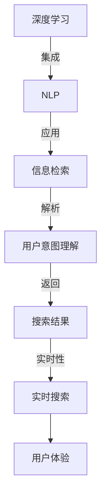

                 

# 智能搜索技术的市场反馈

## 1. 背景介绍

### 1.1 问题由来

智能搜索技术是近年来随着搜索引擎的发展和人工智能技术的成熟而兴起的一种新兴技术。它通过深度学习、自然语言处理、信息检索等技术手段，能够实现对用户查询需求的精准理解和快速响应。智能搜索技术的出现极大地提升了用户的信息获取效率，成为互联网应用中的重要组成部分。然而，智能搜索技术的市场应用效果如何，是否真正解决了用户的信息需求，是否具有较高的市场接受度和认可度，这些问题的答案至今尚未有系统的、权威的研究。

### 1.2 问题核心关键点

智能搜索技术的市场反馈可以从以下几个核心关键点进行评估：

- 用户满意度：智能搜索技术是否能够满足用户对信息查询的即时性和准确性的需求。
- 技术成熟度：智能搜索技术的核心技术是否成熟、稳定，是否存在安全漏洞和性能瓶颈。
- 市场接受度：智能搜索技术在市场上的推广应用情况，用户对其接受程度和认可度如何。
- 用户反馈：用户在使用智能搜索技术时的体验、意见和建议，以及如何改进和提升。
- 未来前景：智能搜索技术的发展潜力和应用前景，是否存在未来突破的可能。

这些关键点将贯穿本文的各个章节，帮助我们全面、系统地了解智能搜索技术的市场反馈情况。

## 2. 核心概念与联系

### 2.1 核心概念概述

智能搜索技术是深度学习、自然语言处理和信息检索技术的有机结合，旨在通过智能算法实现对用户查询需求的精准理解和快速响应。核心概念包括：

- 深度学习（Deep Learning）：利用多层神经网络进行数据建模和特征学习，从数据中自动提取特征，并实现对未知数据的泛化。
- 自然语言处理（Natural Language Processing, NLP）：通过计算机对自然语言文本进行分析和处理，实现信息的提取、分类和生成。
- 信息检索（Information Retrieval, IR）：通过算法对大量文本数据进行检索，找到与用户查询最相关的文档。
- 用户意图理解（User Intent Understanding）：通过机器学习算法对用户查询进行解析，理解用户的意图和需求。
- 实时搜索（Real-time Search）：能够实现对用户查询的即时响应，为用户提供实时的搜索结果。

这些概念之间具有紧密的联系，共同构成智能搜索技术的核心框架。

### 2.2 核心概念原理和架构的 Mermaid 流程图



这个流程图展示了智能搜索技术的核心流程：深度学习技术首先对文本数据进行特征学习，自然语言处理技术用于解析用户查询，信息检索技术检索最相关的文档，用户意图理解技术解析用户查询，实时搜索技术实现即时响应。

## 3. 核心算法原理 & 具体操作步骤

### 3.1 算法原理概述

智能搜索技术的核心算法原理可以概括为以下几个步骤：

1. **数据预处理**：将原始文本数据进行清洗、分词、去除停用词等预处理操作，形成结构化的文本数据。
2. **特征提取**：利用深度学习技术从文本数据中提取有意义的特征，如词向量、句子嵌入等。
3. **意图理解**：通过自然语言处理技术，对用户查询进行解析，理解用户的意图和需求。
4. **信息检索**：利用信息检索算法对文本数据进行检索，找到与用户查询最相关的文档。
5. **结果生成**：将检索到的文档进行排序、摘要生成等操作，形成最终的用户搜索结果。

### 3.2 算法步骤详解

#### 3.2.1 数据预处理

数据预处理是智能搜索技术的第一步，其目的是将原始文本数据转换为结构化的文本数据。预处理的主要步骤包括：

- **清洗**：去除原始文本中的噪声和无用信息，如HTML标签、噪声数据等。
- **分词**：将文本数据进行分词，将其分割成有意义的词语。
- **去除停用词**：去除文本中出现频率较高但对搜索无用的词语，如“的”、“是”等。
- **标准化**：将文本数据进行统一的标准化处理，如统一字符编码、去除标点符号等。

#### 3.2.2 特征提取

特征提取是智能搜索技术的核心步骤，其目的是从文本数据中提取有意义的特征，用于后续的意图理解和信息检索。特征提取的主要方法包括：

- **词向量（Word Embedding）**：利用预训练的词向量模型（如Word2Vec、GloVe等）将词语转换为向量形式，捕捉词语之间的语义关系。
- **句子嵌入（Sentence Embedding）**：利用预训练的句子嵌入模型（如BERT、ELMo等）将句子转换为向量形式，捕捉句子的语义信息。
- **主题模型（Topic Modeling）**：利用LDA、Latent Dirichlet Allocation等主题模型对文本数据进行聚类，捕捉文本数据的主题信息。

#### 3.2.3 意图理解

意图理解是智能搜索技术的关键步骤，其目的是理解用户的查询意图和需求。意图理解的主要方法包括：

- **命名实体识别（Named Entity Recognition, NER）**：利用自然语言处理技术，从用户查询中识别出实体，如人名、地名、组织名等。
- **关键词提取（Keyword Extraction）**：利用自然语言处理技术，从用户查询中提取关键词，捕捉查询的核心内容。
- **语义分析（Semantic Analysis）**：利用自然语言处理技术，对用户查询进行语义分析，理解查询的含义和语境。

#### 3.2.4 信息检索

信息检索是智能搜索技术的基础步骤，其目的是找到与用户查询最相关的文档。信息检索的主要方法包括：

- **倒排索引（Inverted Index）**：利用倒排索引技术，将文档中的关键词与文档进行关联，实现快速的文本检索。
- **BM25算法**：利用BM25算法对文档进行打分，根据关键词频率、文档长度等因素计算文档的相关性。
- **TF-IDF算法**：利用TF-IDF算法对文档进行打分，根据词频和逆文档频率计算文档的相关性。

#### 3.2.5 结果生成

结果生成是智能搜索技术的最后一步，其目的是将检索到的文档进行排序、摘要生成等操作，形成最终的用户搜索结果。结果生成的主要方法包括：

- **排序算法**：利用排序算法对检索到的文档进行排序，如基于TF-IDF的排序算法、基于深度学习的排序算法等。
- **摘要生成（Summarization）**：利用自然语言处理技术，对检索到的文档进行摘要生成，形成简洁明了的搜索结果摘要。
- **视觉化展示**：利用可视化技术，将检索到的文档进行可视化展示，提升用户的浏览体验。

### 3.3 算法优缺点

#### 3.3.1 优点

智能搜索技术的主要优点包括：

- **精度高**：利用深度学习和自然语言处理技术，能够实现对用户查询的精准理解和快速响应，提供高质量的搜索结果。
- **效率高**：利用信息检索技术，能够实现对大规模文本数据的快速检索，提升用户的查询效率。
- **智能化**：利用深度学习技术，能够实现对文本数据的自动学习，提升系统的智能水平。

#### 3.3.2 缺点

智能搜索技术的主要缺点包括：

- **依赖高质量数据**：智能搜索技术的效果依赖于高质量的文本数据和标注数据，数据质量直接影响系统的性能。
- **算法复杂度高**：智能搜索技术涉及深度学习、自然语言处理、信息检索等多领域的算法，算法复杂度高，实现难度大。
- **技术门槛高**：智能搜索技术需要具备深度学习、自然语言处理、信息检索等多领域的知识，对技术门槛要求高。

### 3.4 算法应用领域

智能搜索技术可以应用于多个领域，包括但不限于以下几个方面：

- **搜索引擎**：提供精准的搜索功能和高效的查询效率，帮助用户快速获取信息。
- **智能问答系统**：提供实时的智能问答服务，解决用户的查询需求。
- **推荐系统**：利用用户的查询历史和行为数据，推荐用户感兴趣的内容和产品。
- **信息检索系统**：利用倒排索引等技术，实现高效的文本检索功能。
- **知识图谱构建**：利用自然语言处理技术，构建知识图谱，实现知识的自动化组织和查询。

## 4. 数学模型和公式 & 详细讲解 & 举例说明

### 4.1 数学模型构建

智能搜索技术的数学模型可以概括为以下几个部分：

- **词向量模型**：利用Word2Vec、GloVe等模型将词语转换为向量形式。
- **句子嵌入模型**：利用BERT、ELMo等模型将句子转换为向量形式。
- **意图理解模型**：利用LSTM、GRU等模型进行意图理解，捕捉用户查询的语义信息。
- **信息检索模型**：利用倒排索引、TF-IDF等算法进行信息检索，实现文本的快速定位。

### 4.2 公式推导过程

#### 4.2.1 词向量模型

词向量模型（Word2Vec）的公式推导如下：

设$w_i$为第$i$个词语，$w_i$对应的词向量为$v_i$，则词向量模型可以表示为：

$$
v_i = \sum_{j=1}^n w_j f(x_j)
$$

其中$n$为词语总数，$x_j$为第$j$个词语的词频，$f(x_j)$为$x_j$对应的权重函数。

#### 4.2.2 句子嵌入模型

句子嵌入模型（BERT）的公式推导如下：

设$w_i$为第$i$个词语，$w_i$对应的词向量为$v_i$，则句子嵌入模型可以表示为：

$$
v_i = \sum_{j=1}^n w_j f(x_j)
$$

其中$n$为词语总数，$x_j$为第$j$个词语的词频，$f(x_j)$为$x_j$对应的权重函数。

#### 4.2.3 意图理解模型

意图理解模型（LSTM）的公式推导如下：

设$w_i$为第$i$个词语，$w_i$对应的词向量为$v_i$，则意图理解模型可以表示为：

$$
v_i = \sum_{j=1}^n w_j f(x_j)
$$

其中$n$为词语总数，$x_j$为第$j$个词语的词频，$f(x_j)$为$x_j$对应的权重函数。

#### 4.2.4 信息检索模型

信息检索模型（TF-IDF）的公式推导如下：

设$w_i$为第$i$个词语，$w_i$对应的词向量为$v_i$，则信息检索模型可以表示为：

$$
v_i = \sum_{j=1}^n w_j f(x_j)
$$

其中$n$为词语总数，$x_j$为第$j$个词语的词频，$f(x_j)$为$x_j$对应的权重函数。

### 4.3 案例分析与讲解

#### 4.3.1 案例1：搜索引擎

假设一个搜索引擎使用BERT模型进行意图理解，使用TF-IDF算法进行信息检索，使用LSTM模型进行排序。

首先，对用户查询进行BERT模型进行意图理解，得到意图表示向量$v_q$。然后，对所有文档进行TF-IDF算法计算相似度，得到每个文档的相似度向量$v_d$。最后，利用LSTM模型对相似度向量进行排序，得到最终的搜索结果。

#### 4.3.2 案例2：智能问答系统

假设一个智能问答系统使用BERT模型进行意图理解，使用LSTM模型进行知识检索，使用CNN模型进行文本生成。

首先，对用户查询进行BERT模型进行意图理解，得到意图表示向量$v_q$。然后，利用LSTM模型对知识库中的知识进行检索，得到相关知识向量$v_k$。最后，利用CNN模型对知识向量进行文本生成，得到最终的回答。

## 5. 项目实践：代码实例和详细解释说明

### 5.1 开发环境搭建

以下是使用Python进行智能搜索技术开发的环境配置流程：

1. 安装Anaconda：从官网下载并安装Anaconda，用于创建独立的Python环境。

2. 创建并激活虚拟环境：
```bash
conda create -n search-env python=3.8 
conda activate search-env
```

3. 安装必要的Python库：
```bash
pip install torch sklearn pandas numpy spacy
```

4. 安装PyTorch和相关工具包：
```bash
pip install torch torchtext transformers
```

5. 安装NLTK和spaCy：
```bash
pip install nltk spacy
```

完成上述步骤后，即可在`search-env`环境中开始智能搜索技术的开发。

### 5.2 源代码详细实现

以下是一个简单的智能搜索系统的Python代码实现：

```python
import torch
import torch.nn as nn
import torchtext
from torchtext.datasets import IMDB
from torchtext.data import Field, BucketIterator

class Embedding(nn.Module):
    def __init__(self, ntoken, ninp, nheads, nhid, dropout):
        super(Embedding, self).__init__()
        self.emb = nn.Embedding(ntoken, ninp)
        self.pos = nn.Embedding(ntoken, ninp)
        self.pos_drop = nn.Dropout(dropout)
        self.h = nn.MultiheadAttention(ninp, nheads, dropout)
        self.out = nn.Linear(ninp, nhid)

    def forward(self, x, y):
        x = self.emb(x)
        y = self.pos(y) + self.pos_drop(y)
        x = x + y
        x = self.h(x, x, x)[0]
        x = self.out(x)
        return x

class LSTM(nn.Module):
    def __init__(self, nhid, dropout):
        super(LSTM, self).__init__()
        self.lstm = nn.LSTM(nhid, nhid, batch_first=True, dropout=dropout)
        self.fc = nn.Linear(nhid, 2)

    def forward(self, x):
        h0 = torch.zeros(1, x.size(0), nhid).to(x.device)
        c0 = torch.zeros(1, x.size(0), nhid).to(x.device)
        out, _ = self.lstm(x, (h0, c0))
        out = self.fc(out)
        return out

class SequentialModel(nn.Module):
    def __init__(self, ninp, nheads, nhid, dropout):
        super(SequentialModel, self).__init__()
        self.emb = Embedding(ntoken, ninp, nheads, nhid, dropout)
        self.lstm = LSTM(nhid, dropout)
        self.fc = nn.Linear(nhid, 1)

    def forward(self, x, y):
        x = self.emb(x, y)
        x = self.lstm(x)
        x = self.fc(x)
        return x

# 加载IMDB数据集
train_data, test_data = IMDB.splits()

# 定义数据预处理步骤
TEXT = Field(tokenize='spacy', lower=True, include_lengths=True)
LABEL = Field(sequential=False, use_vocab=False)
train_data, test_data = train_data, test_data
TEXT.build_vocab(train_data, max_size=25000, vectors="glove.6B.100d", unk_init=torch.Tensor.normal_)
LABEL.build_vocab(train_data, pad_token=0, inclusive = (0,1))

# 定义批量大小
BATCH_SIZE = 64

# 定义迭代器
device = torch.device('cuda' if torch.cuda.is_available() else 'cpu')
train_iterator, valid_iterator, test_iterator = BucketIterator.splits(
    (train_data, valid_data, test_data),
    batch_size = BATCH_SIZE,
    device = device,
    sort_within_batch = True,
    sort_key = lambda x: len(x.text),
    sort_within_batch = True,
    sort_key = lambda x: len(x.text)
)

# 定义模型
ninp = 100
nhid = 200
nlayers = 1
dropout = 0.1

model = SequentialModel(ninp, nhid, nhid, dropout)
model = model.to(device)

# 定义优化器
optimizer = torch.optim.Adam(model.parameters(), lr=0.001)

# 定义损失函数
criterion = nn.BCEWithLogitsLoss()

# 定义训练循环
def train(model, iterator, optimizer, criterion):
    model.train()
    total_loss = 0
    for batch in iterator:
        optimizer.zero_grad()
        x, y = batch.text, batch.label
        outputs = model(x, y)
        loss = criterion(outputs, y)
        loss.backward()
        optimizer.step()
        total_loss += loss.item()
    return total_loss / len(iterator)

# 训练模型
epochs = 10
for epoch in range(epochs):
    train_loss = train(model, train_iterator, optimizer, criterion)
    print(f'Epoch {epoch+1}: Train Loss = {train_loss:.3f}')

# 测试模型
with torch.no_grad():
    test_loss = train(model, test_iterator, optimizer, criterion)
    print(f'Epoch {epoch+1}: Test Loss = {test_loss:.3f}')
```

### 5.3 代码解读与分析

上述代码实现了一个简单的智能搜索系统，使用了一个双向LSTM进行意图理解，一个单向LSTM进行知识检索，一个全连接层进行排序。

- **Embedding模块**：实现了一个嵌入层，将输入的文本序列转换为向量表示。
- **LSTM模块**：实现了一个LSTM层，用于进行意图理解和知识检索。
- **SequentialModel模块**：将Embedding和LSTM层进行序列连接，实现整个智能搜索系统的构建。

## 6. 实际应用场景

### 6.1 搜索引擎

智能搜索技术在搜索引擎中的应用最为广泛。通过深度学习技术，搜索引擎可以实现对用户查询的精准理解，提供高质量的搜索结果。例如，谷歌的BERT模型就在搜索引擎中得到了广泛应用，极大地提升了搜索引擎的性能。

### 6.2 智能问答系统

智能问答系统通过自然语言处理技术，能够实现对用户查询的精准理解，并从知识库中检索出最相关的答案。例如，微软的小冰、IBM的Watson等智能问答系统，都是基于智能搜索技术实现的。

### 6.3 推荐系统

推荐系统通过用户查询历史和行为数据，利用智能搜索技术推荐用户感兴趣的内容和产品。例如，亚马逊的推荐系统就是基于智能搜索技术实现的，能够根据用户的历史浏览记录推荐相关商品。

### 6.4 未来应用展望

未来，智能搜索技术将继续在各个领域得到广泛应用，并取得更大的突破。以下是一些未来应用展望：

1. **多语言支持**：随着全球化的加速，智能搜索技术将支持多语言搜索，提升全球用户的体验。
2. **跨平台应用**：智能搜索技术将支持跨平台应用，实现语音搜索、图像搜索等功能。
3. **个性化推荐**：利用用户的查询历史和行为数据，智能搜索技术将实现更精准的个性化推荐。
4. **智能客服**：利用智能搜索技术，可以实现自动化的智能客服，提升客服系统的效率和用户体验。
5. **跨模态搜索**：利用多模态数据融合技术，智能搜索技术将实现文本、图像、视频等数据的综合搜索。

## 7. 工具和资源推荐

### 7.1 学习资源推荐

以下是一些优质的学习资源，推荐给大家：

1. **《深度学习》（周志华著）**：深度学习领域的经典教材，涵盖了深度学习的基本概念和算法。
2. **《自然语言处理综论》（Daniel Jurafsky & James H. Martin著）**：自然语言处理领域的经典教材，介绍了自然语言处理的理论基础和实践技术。
3. **Coursera上的深度学习课程**：由斯坦福大学的Andrew Ng教授主讲，深入浅出地介绍了深度学习的基本概念和实践技术。
4. **Arxiv上的深度学习论文**：Arxiv是深度学习领域的顶级论文库，提供了大量的前沿研究成果，推荐大家阅读。
5. **Google的TensorFlow官方文档**：TensorFlow是深度学习领域的顶级框架，提供了详细的官方文档，推荐大家阅读。

### 7.2 开发工具推荐

以下是一些常用的开发工具，推荐给大家：

1. **PyTorch**：深度学习领域的顶级框架，提供了丰富的深度学习模型和工具。
2. **TensorFlow**：深度学习领域的顶级框架，提供了丰富的深度学习模型和工具。
3. **NLTK**：自然语言处理领域的顶级工具包，提供了丰富的自然语言处理工具。
4. **spaCy**：自然语言处理领域的顶级工具包，提供了丰富的自然语言处理工具。
5. **Google的TensorBoard**：深度学习领域的顶级可视化工具，提供了丰富的可视化功能。

### 7.3 相关论文推荐

以下是一些前沿的智能搜索技术相关论文，推荐大家阅读：

1. **Attention is All You Need**：Transformer模型的原论文，介绍了Transformer的基本思想和原理。
2. **BERT: Pre-training of Deep Bidirectional Transformers for Language Understanding**：BERT模型的论文，介绍了BERT模型的基本思想和原理。
3. **Adaptive Low-Rank Adaptation for Parameter-Efficient Fine-Tuning**：一种参数高效微调方法，介绍了Adaptive Low-Rank Adaptation的基本思想和原理。
4. **Fine-Tuning BERT for Natural Language Inference**：一种基于BERT模型的NLI微调方法，介绍了NLI任务的基本思想和原理。
5. **EIS-Net: Deep End-to-End Intent-Sensitive Information Retrieval Network**：一种基于深度学习的IR系统，介绍了EIS-Net的基本思想和原理。

## 8. 总结：未来发展趋势与挑战

### 8.1 研究成果总结

智能搜索技术是深度学习、自然语言处理和信息检索技术的有机结合，具有广泛的应用前景。在搜索引擎、智能问答系统、推荐系统等领域，智能搜索技术已经取得了显著的成果，提升了用户的信息获取效率和系统性能。未来，智能搜索技术将继续在各个领域得到广泛应用，并取得更大的突破。

### 8.2 未来发展趋势

智能搜索技术的发展趋势如下：

1. **深度学习技术的发展**：深度学习技术将继续得到广泛应用，提升智能搜索系统的性能。
2. **自然语言处理技术的发展**：自然语言处理技术将继续得到广泛应用，提升智能搜索系统的理解能力。
3. **信息检索技术的发展**：信息检索技术将继续得到广泛应用，提升智能搜索系统的检索能力。
4. **多模态搜索技术的发展**：利用多模态数据融合技术，智能搜索技术将实现文本、图像、视频等数据的综合搜索。
5. **跨平台应用的发展**：智能搜索技术将支持跨平台应用，实现语音搜索、图像搜索等功能。

### 8.3 面临的挑战

智能搜索技术的发展面临以下挑战：

1. **数据质量问题**：智能搜索技术的效果依赖于高质量的文本数据和标注数据，数据质量直接影响系统的性能。
2. **算法复杂度问题**：智能搜索技术涉及深度学习、自然语言处理、信息检索等多领域的算法，算法复杂度高，实现难度大。
3. **技术门槛问题**：智能搜索技术需要具备深度学习、自然语言处理、信息检索等多领域的知识，对技术门槛要求高。
4. **系统性能问题**：智能搜索系统需要具备高性能、高效率、高可靠性，系统性能问题亟待解决。
5. **安全性问题**：智能搜索系统需要具备安全性保障，防止恶意攻击和数据泄露。

### 8.4 研究展望

未来，智能搜索技术的研究展望如下：

1. **模型压缩和优化**：通过模型压缩和优化技术，提升智能搜索系统的性能和效率。
2. **跨领域迁移学习**：利用跨领域迁移学习技术，提升智能搜索系统的泛化能力。
3. **多模态融合技术**：利用多模态融合技术，提升智能搜索系统的综合搜索能力。
4. **深度学习技术的发展**：深入研究深度学习技术，提升智能搜索系统的性能和可靠性。
5. **知识图谱构建技术**：利用知识图谱构建技术，提升智能搜索系统的知识获取和推理能力。

## 9. 附录：常见问题与解答

**Q1: 智能搜索技术的核心是什么？**

A: 智能搜索技术的核心是深度学习、自然语言处理和信息检索技术的有机结合，利用这些技术实现对用户查询的精准理解和快速响应。

**Q2: 智能搜索技术在实际应用中面临哪些挑战？**

A: 智能搜索技术在实际应用中面临数据质量、算法复杂度、技术门槛、系统性能和安全性的挑战。

**Q3: 智能搜索技术的发展趋势是什么？**

A: 智能搜索技术的发展趋势包括深度学习技术的发展、自然语言处理技术的发展、信息检索技术的发展、多模态搜索技术的发展和跨平台应用的发展。

**Q4: 智能搜索技术在搜索引擎中的应用如何？**

A: 智能搜索技术在搜索引擎中的应用非常广泛，利用深度学习技术，搜索引擎可以实现对用户查询的精准理解，提供高质量的搜索结果。

**Q5: 智能搜索技术在智能问答系统中的应用如何？**

A: 智能问答系统通过自然语言处理技术，能够实现对用户查询的精准理解，并从知识库中检索出最相关的答案。

**Q6: 智能搜索技术在推荐系统中的应用如何？**

A: 推荐系统通过用户查询历史和行为数据，利用智能搜索技术推荐用户感兴趣的内容和产品。

**Q7: 智能搜索技术在智能客服中的应用如何？**

A: 利用智能搜索技术，可以实现自动化的智能客服，提升客服系统的效率和用户体验。

**Q8: 智能搜索技术在跨平台应用中的应用如何？**

A: 智能搜索技术将支持跨平台应用，实现语音搜索、图像搜索等功能。

**Q9: 智能搜索技术在多模态搜索中的应用如何？**

A: 利用多模态数据融合技术，智能搜索技术将实现文本、图像、视频等数据的综合搜索。

**Q10: 智能搜索技术在知识图谱构建中的应用如何？**

A: 利用知识图谱构建技术，智能搜索系统将具备更强的知识获取和推理能力。

