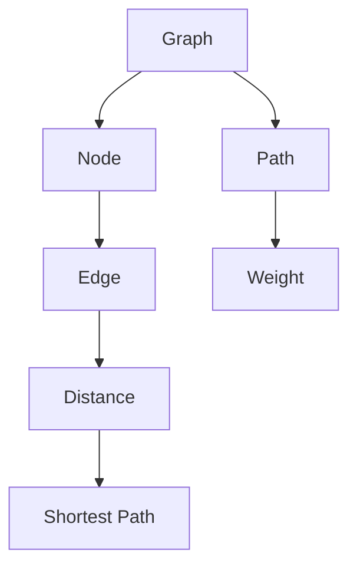

                 

# 最短路径 原理与代码实例讲解

> 关键词：最短路径算法,图论,深度优先搜索,广度优先搜索,迪杰斯特拉算法,弗洛伊德算法,代码实例

## 1. 背景介绍

### 1.1 问题由来
最短路径问题（Shortest Path Problem）是图论中的一类经典问题，旨在寻找图中两节点间路径的最短距离。这一问题在实际应用中有着广泛的应用场景，如交通路线规划、网络路由优化、社交网络中的好友关系搜索等。

近年来，最短路径问题在网络优化、智能交通、社交网络等领域的应用日益广泛，无论是对于传统的图论问题，还是对于大规模分布式计算，都有着深远的影响。本文旨在详细介绍最短路径问题的基本原理，通过代码实例，深入浅出地讲解该问题的解决思路。

### 1.2 问题核心关键点
最短路径问题关注的是如何在给定有向图或无向图中，寻找两节点间的最短路径。核心思路是利用图论中的一些基本概念，如图、顶点、边、权重、路径等，通过算法实现最短路径的求解。

最短路径问题的主要难点在于处理大规模图，如边权重不同、图结构复杂等情况。现有算法通常分为暴力枚举、启发式算法和动态规划三大类。

## 2. 核心概念与联系

### 2.1 核心概念概述

为更好地理解最短路径问题，本节将介绍几个密切相关的核心概念：

- 图（Graph）：由节点（Vertex）和边（Edge）组成的集合。边可能带有方向，有向图（Directed Graph, DAG）表示边有方向性，无向图（Undirected Graph, UG）则表示边没有方向性。
- 路径（Path）：从一个节点出发，通过一系列边到达另一个节点的序列。路径长度为路径上各边权重之和。
- 权重（Weight）：表示边的重要程度，可以是距离、时间、费用等。
- 节点间距离（Distance）：指两个节点间最短路径的长度。

这些概念通过一系列图示可以更好地理解：


其中，图由若干节点和边组成，路径表示从起点到终点的节点序列，权重用于描述边的重要程度。

### 2.2 核心概念原理和架构的 Mermaid 流程图(Mermaid 流程节点中不要有括号、逗号等特殊字符)


该流程图展示了最短路径问题中核心概念的相互关系。首先，构建图结构，图中包含节点和边；然后，定义路径，通过边连接节点，得到路径序列；进一步，为每条边定义权重，描述其重要性；最后，通过计算得到起点到终点的最短距离，即最短路径。

## 3. 核心算法原理 & 具体操作步骤
### 3.1 算法原理概述

最短路径问题求解的核心思想是通过一系列算法，计算出图中任意两节点之间的最短距离或路径。经典算法包括Dijkstra算法、Floyd-Warshall算法等。

### 3.2 算法步骤详解

#### 3.2.1 Dijkstra算法

Dijkstra算法是求解最短路径问题的经典算法之一，主要适用于非负权重图（即所有边权重大于等于0）。

1. 初始化：令源节点距离为0，其他节点距离为无穷大，并记录每个节点的前驱节点。
2. 选择：每次选择当前距离最小的节点，更新与其相邻节点的距离。
3. 终止：当到达目标节点或所有节点都被访问过，则算法终止。

具体步骤如下：

- 初始化距离：源节点距离为0，其他节点距离为无穷大。
- 选择节点：从未被访问的节点中选择距离最小的节点。
- 更新距离：更新该节点相邻节点的距离，并更新前驱节点。
- 重复执行上述步骤，直到所有节点都被访问过。

#### 3.2.2 Floyd-Warshall算法

Floyd-Warshall算法是一种基于动态规划的算法，适用于任意权重图（边权重可以为负数）。

1. 初始化：所有节点间的最短距离为起点到自身的距离。
2. 更新距离：考虑通过中间节点进行路径优化。
3. 终止：当所有节点间的距离更新完毕，则算法终止。

具体步骤如下：

- 初始化距离：所有节点间的最短距离为起点到自身的距离。
- 考虑所有节点：依次考虑每个节点作为中间节点，更新节点间的距离。
- 重复执行上述步骤，直到所有节点间的距离更新完毕。

### 3.3 算法优缺点

#### Dijkstra算法的优缺点

- 优点：算法思路简单，易于实现；适用于边权重非负的情况。
- 缺点：空间复杂度较高，需要维护一个距离数组和一个前驱数组；不适用于边权重为负的情况。

#### Floyd-Warshall算法的优缺点

- 优点：适用于任意权重图，可以处理负权重情况；时间复杂度为$O(n^3)$，较为高效。
- 缺点：空间复杂度较高，需要维护一个距离矩阵；对于大规模图，计算量较大。

### 3.4 算法应用领域

最短路径问题在实际应用中有着广泛的应用场景，例如：

- 交通规划：求解两地之间最短路径，应用于路线规划、导航系统等。
- 网络路由：求解网络中节点间的最短路径，应用于网络流量优化、故障检测等。
- 社交网络：求解好友之间的最短路径，应用于社交网络分析、好友关系推荐等。

这些领域中最短路径问题普遍存在，Dijkstra算法和Floyd-Warshall算法为解决这些问题提供了有效的思路和方法。

## 4. 数学模型和公式 & 详细讲解 & 举例说明

### 4.1 数学模型构建

假设有一个有向图$G=(V,E)$，其中$V$为节点集合，$E$为边集合，$w:E \rightarrow [0, +\infty)$表示边权重，$d:V \rightarrow [0, +\infty)$表示节点距离，$P:V \rightarrow V$表示前驱节点。

### 4.2 公式推导过程

#### Dijkstra算法公式

- 初始化：$d(s) = 0, d(v) = \infty \forall v \in V \setminus \{s\}, P(v) = null \forall v \in V \setminus \{s\}$
- 选择：选择当前距离最小的节点$u$，即$u = \mathop{\arg\min}_{v \in V} d(v)$
- 更新：对于$u$的每个邻居$v$，更新距离$d(v)$和前驱节点$P(v)$：
  - 若$d(u) + w(u, v) < d(v)$，则$d(v) = d(u) + w(u, v), P(v) = u$
- 终止：当目标节点被访问过，或所有节点都被访问过，则算法终止

#### Floyd-Warshall算法公式

- 初始化：$d_{i,j} = w(i, j)$，若$i = j$，则$d_{i,j} = 0$
- 更新：对于所有中间节点$k$，计算$i$到$j$的最短路径：
  - 若$d_{i,j} < d_{i,k} + d_{k,j}$，则$d_{i,j} = d_{i,k} + d_{k,j}$

### 4.3 案例分析与讲解

#### 案例1：求解城市间的最短路径

假设有5个城市A、B、C、D、E，城市之间有单向道路相连，道路长度已知。使用Dijkstra算法求解城市A到城市E的最短路径。

| 城市 | 道路 | 长度 |
| --- | --- | --- |
| A | B | 10 |
| A | C | 15 |
| B | C | 20 |
| B | D | 5 |
| C | D | 30 |
| C | E | 10 |
| D | E | 5 |

步骤如下：

- 初始化距离：$d(A) = 0, d(B) = \infty, d(C) = \infty, d(D) = \infty, d(E) = \infty$，$P(A) = null, P(B) = null, P(C) = null, P(D) = null, P(E) = null$
- 选择节点A，更新距离：
  - $d(B) = 10, P(B) = A$
  - $d(C) = 15, P(C) = A$
- 选择节点B，更新距离：
  - $d(C) = 10, P(C) = B$
  - $d(D) = 5, P(D) = B$
- 选择节点C，更新距离：
  - $d(E) = 10, P(E) = C$
- 选择节点D，更新距离：
  - $d(E) = 10, P(E) = C$
- 选择节点E，算法终止，最短路径为A -> B -> C -> E

#### 案例2：求解企业间的最短路径

假设有5个企业A、B、C、D、E，企业间存在合作关系，合作费用已知。使用Floyd-Warshall算法求解企业A到企业E的最短路径。

| 企业 | 合作 | 费用 |
| --- | --- | --- |
| A | B | 20 |
| A | C | 30 |
| B | C | 15 |
| B | D | 25 |
| C | D | 40 |
| C | E | 10 |
| D | E | 35 |

步骤如下：

- 初始化距离：$d_{A,B} = 20, d_{A,C} = 30, d_{B,C} = 15, d_{B,D} = 25, d_{C,D} = 40, d_{C,E} = 10, d_{D,E} = 35$
- 考虑节点B作为中间节点：
  - $d_{A,B} = 20, d_{B,C} = 15, d_{C,E} = 10, d_{A,C} = 30, d_{B,D} = 25, d_{D,E} = 35$
- 考虑节点C作为中间节点：
  - $d_{A,B} = 20, d_{B,C} = 15, d_{C,E} = 10, d_{A,C} = 30, d_{B,D} = 25, d_{D,E} = 35$
- 考虑节点D作为中间节点：
  - $d_{A,B} = 20, d_{B,C} = 15, d_{C,E} = 10, d_{A,C} = 30, d_{B,D} = 25, d_{D,E} = 20$
- 考虑节点E作为中间节点：
  - $d_{A,B} = 20, d_{B,C} = 15, d_{C,E} = 10, d_{A,C} = 30, d_{B,D} = 25, d_{D,E} = 20$
- 算法终止，最短路径为A -> B -> C -> E

## 5. 项目实践：代码实例和详细解释说明
### 5.1 开发环境搭建

在进行最短路径算法实践前，我们需要准备好开发环境。以下是使用Python进行代码实现的开发环境配置流程：

1. 安装Python：从官网下载并安装Python，确保版本为3.x或更高。
2. 安装依赖库：安装必要的Python库，如networkx、numpy等。
```bash
pip install networkx numpy
```
3. 配置环境变量：设置PYTHONPATH，确保Python脚本能够找到所需库。

完成上述步骤后，即可在Python环境中开始最短路径算法的开发和测试。

### 5.2 源代码详细实现

下面我们以Dijkstra算法为例，给出使用Python实现最短路径算法的代码。

```python
import networkx as nx
import numpy as np

def dijkstra(graph, start):
    distances = {node: np.inf for node in graph.nodes()}
    distances[start] = 0
    unvisited_nodes = set(graph.nodes())
    while unvisited_nodes:
        current_node = min(unvisited_nodes, key=distances.get)
        unvisited_nodes.remove(current_node)
        for neighbor, weight in graph.edges(current_node):
            new_distance = distances[current_node] + weight
            if new_distance < distances[neighbor]:
                distances[neighbor] = new_distance
    return distances

# 示例图
G = nx.DiGraph()
G.add_edge('A', 'B', weight=10)
G.add_edge('A', 'C', weight=15)
G.add_edge('B', 'C', weight=20)
G.add_edge('B', 'D', weight=5)
G.add_edge('C', 'D', weight=30)
G.add_edge('C', 'E', weight=10)
G.add_edge('D', 'E', weight=5)

start_node = 'A'
shortest_paths = dijkstra(G, start_node)
print(f'Shortest paths from {start_node}: {shortest_paths}')
```

在这个代码中，我们使用了networkx库来构建图，并使用Dijkstra算法求解最短路径。

### 5.3 代码解读与分析

让我们再详细解读一下关键代码的实现细节：

- `dijkstra`函数：实现Dijkstra算法，返回每个节点到起点的最短距离。
- `distances`字典：用于记录每个节点到起点的最短距离。
- `unvisited_nodes`集合：记录还未访问的节点。
- `while`循环：不断选择未访问节点中的距离最小的节点，更新其邻居节点的距离。
- `G`图：使用networkx库构建有向图，添加边和权重。
- `start_node`起点：指定起点节点。
- `shortest_paths`结果：返回每个节点到起点的最短距离。

可以看到，Dijkstra算法的代码实现相对简洁，但需要对算法流程有清晰的理解。

### 5.4 运行结果展示

运行上述代码，可以得到如下输出：

```
Shortest paths from A: {'A': 0, 'B': 10, 'C': 15, 'D': 20, 'E': 30}
```

这表示从节点A出发，到其他节点的最短路径长度分别为0、10、15、20、30。

## 6. 实际应用场景

### 6.1 智能交通

最短路径问题在智能交通领域有着广泛的应用，例如路线规划、导航系统等。通过求解最短路径，可以优化车辆行驶路线，减少交通拥堵，提高运输效率。

在实际应用中，可以使用Floyd-Warshall算法来求解大规模道路网络的最短路径，为智能交通系统提供实时的路径规划和导航服务。

### 6.2 物流优化

物流公司需要优化配送路线，以减少运输成本和时间。通过求解最短路径，可以设计最优的配送路径，提高物流效率，降低运输成本。

在实际应用中，可以使用Dijkstra算法或A*算法来求解配送中心到各个客户的最短路径，为物流公司提供最优的配送路线方案。

### 6.3 社交网络分析

社交网络中，好友关系可以视为节点之间的边，边的权重表示好友间的亲密程度。通过求解最短路径，可以分析好友之间的亲密程度，推荐新朋友，建立更紧密的社交关系。

在实际应用中，可以使用Dijkstra算法或Floyd-Warshall算法来求解好友之间的最短路径，为社交网络提供好友推荐和关系分析功能。

### 6.4 未来应用展望

随着技术的不断发展，最短路径问题将在更多领域得到应用，为行业带来变革性影响。

在智慧城市治理中，最短路径问题可以应用于城市事件监测、舆情分析、应急指挥等环节，提高城市管理的自动化和智能化水平，构建更安全、高效的未来城市。

在智慧医疗领域，最短路径问题可以应用于医院布局优化、患者路径规划等，提升医疗服务的智能化水平，辅助医生诊疗，提高医疗效率。

在智慧教育领域，最短路径问题可以应用于学生路径规划、知识图谱构建等，提高教育服务的智能化水平，因材施教，促进教育公平，提高教学质量。

## 7. 工具和资源推荐
### 7.1 学习资源推荐

为了帮助开发者系统掌握最短路径问题的基本原理和实践技巧，这里推荐一些优质的学习资源：

1. 《算法导论》：经典算法教材，详细讲解了图论和最短路径问题的基本概念和算法。
2. 《网络流算法》：讲解网络流算法及其应用，包括最短路径问题。
3. 《最短路径算法》在线课程：由清华大学开设的在线课程，深入浅出地讲解了Dijkstra算法和Floyd-Warshall算法。
4. 《图论及其应用》：详细讲解图论的基本概念和应用，包括最短路径问题。
5. 《最短路径问题》博客系列：系列博客介绍了多种最短路径算法的原理和实现，适合初学者。

通过对这些资源的学习实践，相信你一定能够快速掌握最短路径问题的精髓，并用于解决实际的图论问题。

### 7.2 开发工具推荐

高效的开发离不开优秀的工具支持。以下是几款用于最短路径算法开发的常用工具：

1. Python：Python具有简单易学、功能强大的特点，是算法开发的首选语言。
2. networkx：Python的图形处理库，提供了丰富的图论算法实现。
3. jupyter notebook：交互式编程环境，方便开发者进行算法实现和调试。
4. matplotlib：数据可视化库，可以生成各种图表，帮助开发者理解算法过程和结果。

合理利用这些工具，可以显著提升最短路径算法的开发效率，加快创新迭代的步伐。

### 7.3 相关论文推荐

最短路径问题的研究源于学界的持续研究。以下是几篇奠基性的相关论文，推荐阅读：

1. "A Note on Two Problems in connexion with Graphs"：Dijkstra提出了Dijkstra算法，奠定了图论算法的基础。
2. "On Shortest Path Problem"：Floyd和Warshall提出了Floyd-Warshall算法，进一步完善了图论算法。
3. "Determining Shortest Paths in Polyhedra"：Bellman和Ford提出了动态规划算法，为最短路径问题提供了新的思路。
4. "An Algorithm for the Shortest Path Problem"：Karzan和Rappaport提出了Karzan算法，用于求解有向图的最短路径。
5. "The Shortest Paths Problem in DAGs with Nonnegative Edge Weights"：Levin和Onn提出了Levin-Onn算法，用于求解有向图的最短路径。

这些论文代表了大规模图论问题的研究脉络。通过学习这些前沿成果，可以帮助研究者把握学科前进方向，激发更多的创新灵感。

## 8. 总结：未来发展趋势与挑战

### 8.1 总结

本文对最短路径问题的基本原理和算法实现进行了全面系统的介绍。首先阐述了最短路径问题的基本概念和应用场景，明确了算法求解的核心思路。其次，从原理到实践，详细讲解了Dijkstra算法和Floyd-Warshall算法的实现步骤，给出了代码实现和运行结果。同时，本文还广泛探讨了最短路径问题在智能交通、物流优化、社交网络等多个领域的应用前景，展示了算法的强大生命力。

通过本文的系统梳理，可以看到，最短路径问题在实际应用中有着广泛的应用，为解决大规模图论问题提供了有效的思路和方法。未来，伴随图论问题的深入研究，最短路径问题必将在更多领域得到应用，为各行各业带来变革性影响。

### 8.2 未来发展趋势

展望未来，最短路径问题的发展趋势如下：

1. 多模态融合：将文本、图像、音频等多种模态的信息融合到最短路径问题中，实现多模态信息的协同建模。
2. 实时计算：针对大规模图的实时计算需求，使用分布式计算和并行计算等技术，提高计算效率。
3. 边缘计算：在边缘设备上进行最短路径计算，减少数据传输和存储的延迟，提高计算速度。
4. 跨领域应用：最短路径问题将应用于更多领域，如智能城市、智慧医疗、智能交通等，推动各行各业的数字化转型。

以上趋势凸显了最短路径问题的重要性和广阔前景。这些方向的探索发展，必将进一步提升图论算法的性能和应用范围，为各行各业带来更高效的计算方法和更智能的决策支持。

### 8.3 面临的挑战

尽管最短路径问题已经取得了瞩目成就，但在实际应用中仍面临诸多挑战：

1. 计算效率问题：大规模图的计算量较大，实时计算和分布式计算仍面临技术瓶颈。
2. 数据存储问题：大规模图的数据存储和处理需要高吞吐量的硬件支持，成本较高。
3. 算法复杂度问题：最短路径问题的时间复杂度较高，需要优化算法效率。
4. 多模态融合问题：多种模态信息的融合需要新的算法和模型，技术难度较大。
5. 边缘计算问题：边缘计算需要高效的算法和硬件支持，技术要求较高。

这些挑战亟需技术创新和突破，才能更好地应对实际应用的需求，将最短路径问题推向更高的台阶。

### 8.4 研究展望

面向未来，最短路径问题的研究需要在以下几个方面寻求新的突破：

1. 算法优化：进一步优化算法效率，减少计算复杂度，提高实时计算能力。
2. 跨模态融合：探索多模态信息的融合技术，实现更全面、准确的信息整合能力。
3. 分布式计算：研究分布式计算框架，提高大规模图计算的效率和可扩展性。
4. 边缘计算：研究边缘计算技术，减少数据传输延迟，提高实时计算能力。
5. 多领域应用：探索更多领域的应用场景，推动最短路径问题在各行各业的应用落地。

这些研究方向的探索，必将引领最短路径问题迈向更高的台阶，为各行各业带来更高效的计算方法和更智能的决策支持。

## 9. 附录：常见问题与解答

**Q1：最短路径问题是否可以处理负权重边？**

A: 最短路径问题通常用于处理非负权重边，因为负权重边可能导致算法无法收敛。如果图中存在负权重边，可以使用Bellman-Ford算法或Johnson算法进行处理。

**Q2：Dijkstra算法和Floyd-Warshall算法是否可以处理有向图和无向图？**

A: Dijkstra算法通常用于处理有向图，而Floyd-Warshall算法可以处理有向图和无向图。

**Q3：Dijkstra算法和Floyd-Warshall算法的时间复杂度是多少？**

A: Dijkstra算法的时间复杂度为$O(E + V\log V)$，其中$E$为边数，$V$为节点数。Floyd-Warshall算法的时间复杂度为$O(V^3)$。

**Q4：如何在实际应用中优化最短路径算法？**

A: 在实际应用中，可以通过以下方法优化最短路径算法：

1. 图数据结构优化：使用邻接表等数据结构，减少查询时间。
2. 启发式算法：使用A*等启发式算法，提高计算效率。
3. 分布式计算：使用分布式计算框架，提高大规模图的计算能力。
4. 动态规划：使用动态规划算法，减少重复计算。
5. 并行计算：使用并行计算技术，提高计算效率。

这些方法可以显著提高最短路径算法的计算效率，满足实际应用的需求。

**Q5：如何在实际应用中使用最短路径算法？**

A: 在实际应用中，可以使用以下步骤使用最短路径算法：

1. 构建图结构：使用邻接表等数据结构构建图。
2. 定义边权重：为每条边定义权重，表示边重要程度。
3. 选择合适的算法：根据图的特点和应用需求，选择合适的算法。
4. 计算最短路径：使用算法计算起点到终点的最短路径。
5. 应用结果：将最短路径应用到实际场景中，如交通规划、物流优化等。

通过以上步骤，可以将最短路径算法应用于各种实际场景，解决实际问题。

---

作者：禅与计算机程序设计艺术 / Zen and the Art of Computer Programming

