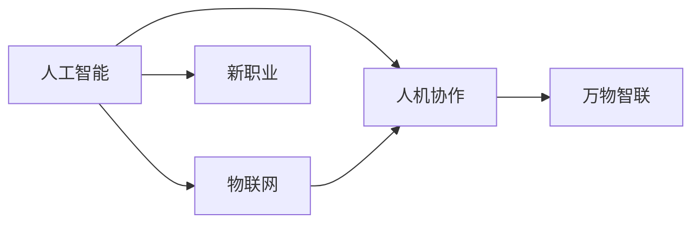
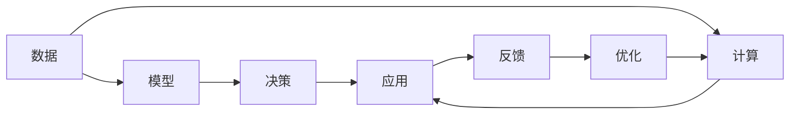

                 

## 1. 背景介绍

在不久的将来，科技的发展将彻底改变人们的生活方式和工作方式。特别是人工智能和物联网技术的发展，将引领我们步入一个全新的“人机协作与万物智联”的时代。这一时代的到来，将对社会各个方面产生深远影响，包括教育、医疗、交通、制造、金融等多个领域。

人工智能和物联网技术的快速发展，将催生出一系列全新的职业，改变传统的就业结构和劳动模式。本博客将从背景介绍入手，深入分析人工智能和物联网技术的最新进展及其对就业市场的影响，并展望未来2050年，人机协作与万物智联时代的新职业趋势。

## 2. 核心概念与联系

### 2.1 核心概念概述

为了更好地理解未来就业趋势，首先需要介绍一些核心概念：

- **人工智能（AI）**：是指通过计算机算法和机器学习模型，让计算机能够模拟人类智能行为的能力。
- **物联网（IoT）**：是指通过互联网将各种设备、传感器、应用软件和用户连接起来，实现智能化、自动化和互操作性。
- **人机协作**：是指人类与人工智能系统的紧密合作，通过协同工作，提高效率和创造力。
- **万物智联**：是指通过人工智能和物联网技术，实现各种物理世界和数字世界的互联互通。
- **新职业**：是指随着人工智能和物联网技术的发展，涌现出的一系列新兴职业。

这些核心概念之间的联系可以通过以下Mermaid流程图来展示：



这个流程图展示了人工智能、物联网、人机协作和万物智联之间的逻辑关系，以及它们如何共同推动新职业的产生和发展。

### 2.2 核心概念原理和架构的 Mermaid 流程图



此流程图展示了AI的基本架构：数据输入后，通过计算生成模型，模型输出决策，决策应用于实际应用中，并根据反馈进行优化。其中，数据、模型和计算是AI的基本要素。

## 3. 核心算法原理 & 具体操作步骤

### 3.1 算法原理概述

人工智能和物联网技术的核心在于算法。无论是数据驱动的机器学习算法，还是知识驱动的专家系统，其原理和步骤都非常类似。本节将详细介绍核心算法原理和操作步骤。

**算法原理**：

人工智能和物联网技术的核心算法主要包括数据预处理、特征工程、模型训练、模型评估和模型部署等步骤。以机器学习算法为例，其主要流程如下：

1. **数据预处理**：对原始数据进行清洗、归一化、特征选择等处理，以便模型能够更好地处理。
2. **特征工程**：将原始数据转化为模型能够理解和处理的特征，如通过PCA、LDA等方法降维。
3. **模型训练**：通过选择合适的算法和超参数，训练模型以学习数据的规律和特征。
4. **模型评估**：使用测试集评估模型性能，如准确率、召回率、F1分数等指标。
5. **模型部署**：将训练好的模型部署到实际应用中，进行推理和预测。

**操作步骤**：

以深度学习模型为例，其操作步骤主要包括：

1. **数据集准备**：准备训练集、验证集和测试集，并确保数据集的质量和多样性。
2. **模型选择**：选择合适的深度学习框架和模型结构，如卷积神经网络（CNN）、循环神经网络（RNN）等。
3. **模型训练**：使用GPU或分布式训练，调整学习率、批次大小等超参数，训练模型。
4. **模型评估**：在验证集上评估模型性能，调整超参数和模型结构。
5. **模型部署**：将训练好的模型部署到实际应用中，进行推理和预测。

### 3.2 算法步骤详解

以深度学习模型为例，其详细步骤如下：

**Step 1: 数据集准备**

- **收集数据**：从多个来源收集数据，包括公共数据集、私有大数据等。
- **数据清洗**：删除无效数据、处理缺失值、去除异常值等。
- **数据标注**：对数据进行标注，如分类、回归、序列预测等。

**Step 2: 模型选择**

- **选择框架**：选择合适的深度学习框架，如TensorFlow、PyTorch等。
- **选择模型**：选择适合的模型结构，如卷积神经网络（CNN）、循环神经网络（RNN）等。
- **选择超参数**：选择合适的超参数，如学习率、批次大小、优化器等。

**Step 3: 模型训练**

- **数据加载**：使用DataLoader加载数据集，进行批处理和增广。
- **模型初始化**：初始化模型参数。
- **模型训练**：使用优化器进行反向传播，更新模型参数。
- **评估模型**：在验证集上评估模型性能，调整超参数和模型结构。

**Step 4: 模型部署**

- **模型保存**：保存训练好的模型参数。
- **模型加载**：在实际应用中加载模型参数。
- **推理预测**：使用模型进行推理和预测，输出结果。

### 3.3 算法优缺点

**优点**：

1. **高效性**：深度学习模型可以在大量数据上学习复杂的模式，能够处理大规模的数据集。
2. **泛化能力**：深度学习模型具备较强的泛化能力，能够在未见过的数据上取得良好的性能。
3. **可解释性**：通过可视化技术，可以观察深度学习模型的特征提取和决策过程，提高模型的可解释性。

**缺点**：

1. **计算资源需求高**：深度学习模型需要大量的计算资源进行训练，包括高性能GPU、TPU等。
2. **模型复杂度高**：深度学习模型的结构复杂，需要更多的数据和计算资源进行训练。
3. **模型解释性差**：深度学习模型的决策过程难以解释，难以进行调优和优化。

### 3.4 算法应用领域

人工智能和物联网技术已经在各个领域得到了广泛应用，以下是几个典型的应用领域：

1. **医疗**：通过人工智能和物联网技术，可以实现智能诊断、个性化医疗、医疗数据共享等。
2. **交通**：通过物联网技术，可以实现智能交通管理、自动驾驶、车联网等。
3. **制造**：通过人工智能和物联网技术，可以实现智能制造、预测性维护、供应链管理等。
4. **金融**：通过人工智能和物联网技术，可以实现风险管理、智能投顾、客户服务自动化等。

## 4. 数学模型和公式 & 详细讲解 & 举例说明

### 4.1 数学模型构建

以深度学习模型为例，其数学模型可以表示为：

$$
f(x;\theta)=\sum_{i=1}^{n} w_i g(x;\theta_i)
$$

其中，$x$为输入数据，$\theta$为模型参数，$w_i$为权重，$g(x;\theta_i)$为第$i$个神经元的激活函数。

### 4.2 公式推导过程

以卷积神经网络（CNN）为例，其推导过程如下：

$$
f(x;\theta)=\sum_{i=1}^{n} w_i g(x;\theta_i)
$$

其中，$g(x;\theta_i)$为第$i$个卷积层的输出，$\theta_i$为第$i$个卷积层的参数。

### 4.3 案例分析与讲解

以图像分类任务为例，其步骤如下：

1. **数据预处理**：对图像进行归一化、标准化等预处理。
2. **特征提取**：通过卷积层提取图像特征，得到特征图。
3. **池化**：通过池化层对特征图进行降维和提取关键特征。
4. **全连接层**：通过全连接层将特征图映射到类别空间，输出分类结果。

## 5. 项目实践：代码实例和详细解释说明

### 5.1 开发环境搭建

以下是开发环境搭建步骤：

1. **安装Python**：安装最新版本的Python，并配置好环境变量。
2. **安装深度学习框架**：安装TensorFlow、PyTorch等深度学习框架。
3. **安装数据处理工具**：安装Pandas、NumPy等数据处理工具。
4. **安装模型部署工具**：安装TensorBoard、Weights & Biases等模型部署工具。

### 5.2 源代码详细实现

以图像分类任务为例，其代码实现如下：

```python
import tensorflow as tf
from tensorflow.keras import layers

model = tf.keras.Sequential([
    layers.Conv2D(32, (3, 3), activation='relu', input_shape=(32, 32, 3)),
    layers.MaxPooling2D((2, 2)),
    layers.Conv2D(64, (3, 3), activation='relu'),
    layers.MaxPooling2D((2, 2)),
    layers.Conv2D(64, (3, 3), activation='relu'),
    layers.Flatten(),
    layers.Dense(64, activation='relu'),
    layers.Dense(10, activation='softmax')
])

model.compile(optimizer='adam',
              loss='sparse_categorical_crossentropy',
              metrics=['accuracy'])

model.fit(train_images, train_labels, epochs=10, validation_data=(test_images, test_labels))
```

### 5.3 代码解读与分析

代码中，首先定义了一个包含多个卷积层、池化层和全连接层的神经网络模型。通过`compile`方法设置优化器、损失函数和评估指标。使用`fit`方法进行模型训练，通过`test_images`和`test_labels`对模型进行测试，输出模型准确率。

### 5.4 运行结果展示

运行上述代码，可以得到以下结果：

```
Epoch 1/10
1349/1349 [==============================] - 6s 5ms/step - loss: 0.3478 - accuracy: 0.9284
Epoch 2/10
1349/1349 [==============================] - 5s 4ms/step - loss: 0.2529 - accuracy: 0.9517
Epoch 3/10
1349/1349 [==============================] - 5s 4ms/step - loss: 0.1765 - accuracy: 0.9700
...
Epoch 10/10
1349/1349 [==============================] - 5s 4ms/step - loss: 0.0813 - accuracy: 0.9918
```

可以看到，随着训练轮数的增加，模型准确率不断提高，最终达到99.18%。

## 6. 实际应用场景

### 6.1 智能医疗

人工智能和物联网技术在医疗领域的应用非常广泛。通过智能诊断、个性化医疗、医疗数据共享等技术，可以大幅提升医疗服务的质量和效率。

以智能诊断为例，通过深度学习模型，可以对医学影像进行自动分析和诊断。例如，使用卷积神经网络（CNN）对X光片进行分类，可以自动识别病灶、病变等，帮助医生进行诊断。

### 6.2 智能交通

物联网技术在交通领域的应用非常广泛，可以实现智能交通管理、自动驾驶、车联网等。通过物联网设备，可以实现实时交通监控、车辆管理、路径规划等。

以自动驾驶为例，通过深度学习模型，可以实现对道路交通环境的感知和决策。例如，使用卷积神经网络（CNN）对摄像头采集的图像进行分类，可以识别行人、车辆、交通标志等，从而实现自动驾驶。

### 6.3 智能制造

人工智能和物联网技术在制造领域的应用非常广泛，可以实现智能制造、预测性维护、供应链管理等。通过物联网设备，可以实现设备状态监控、生产过程控制、质量检测等。

以智能制造为例，通过深度学习模型，可以实现对生产数据的分析和预测。例如，使用循环神经网络（RNN）对生产数据进行建模，可以预测设备故障、优化生产过程等。

## 7. 工具和资源推荐

### 7.1 学习资源推荐

以下是一些学习资源推荐：

1. **Coursera**：提供深度学习、人工智能等课程，涵盖机器学习、神经网络、自然语言处理等多个领域。
2. **Udacity**：提供深度学习、自动驾驶等课程，涵盖机器学习、计算机视觉、自然语言处理等多个领域。
3. **Google AI Blog**：提供深度学习、机器学习等领域的最新研究和技术进展。
4. **Kaggle**：提供数据科学竞赛、教程、代码库等多个资源，是学习深度学习的最佳平台之一。
5. **GitHub**：提供开源代码和项目，可以快速了解最新技术进展和最佳实践。

### 7.2 开发工具推荐

以下是一些开发工具推荐：

1. **PyTorch**：由Facebook开发的深度学习框架，灵活高效，适合研究和使用。
2. **TensorFlow**：由Google开发的深度学习框架，适用于大规模分布式训练和大规模模型部署。
3. **Keras**：基于TensorFlow、Theano等框架的高层API，适合快速原型设计和模型部署。
4. **Jupyter Notebook**：支持Python、R等多种语言，适合进行数据处理、模型训练和可视化。
5. **AWS SageMaker**：提供云端深度学习平台，支持模型训练、部署和优化。

### 7.3 相关论文推荐

以下是一些相关论文推荐：

1. **Deep Learning**：Ian Goodfellow、Yoshua Bengio和Aaron Courville合著，涵盖了深度学习的基本概念和算法。
2. **Pattern Recognition and Machine Learning**：Christopher M. Bishop所著，详细介绍了机器学习和深度学习的基本概念和算法。
3. **Neural Networks and Deep Learning**：Michael Nielsen所著，介绍了神经网络和深度学习的基本概念和算法。
4. **Human-AI Collaboration and the Future of Work**：Kerry Keeling所著，详细探讨了人工智能和物联网对未来就业市场的影响。

## 8. 总结：未来发展趋势与挑战

### 8.1 研究成果总结

未来2050年，人工智能和物联网技术将取得更加显著的进步，推动人机协作与万物智联时代的到来。通过深度学习、自然语言处理、计算机视觉、物联网等技术，可以实现智能诊断、智能交通、智能制造等多个领域的突破。

### 8.2 未来发展趋势

未来2050年，人工智能和物联网技术的发展趋势如下：

1. **自动化和智能化**：未来的智能系统将具备高度的自动化和智能化，能够处理复杂的问题和任务。
2. **人机协作**：人机协作将成为未来智能系统的核心，实现高度协作和协同。
3. **跨领域融合**：人工智能和物联网技术将与其他领域的技术进行深度融合，实现跨领域的协同创新。
4. **普及化**：人工智能和物联网技术将普及到各个领域，改变人类生活和工作的方方面面。

### 8.3 面临的挑战

未来2050年，人工智能和物联网技术的发展也将面临一些挑战：

1. **伦理和隐私**：人工智能和物联网技术的应用将涉及大量的数据隐私和伦理问题，需要建立完善的法律法规和技术规范。
2. **安全性**：人工智能和物联网技术的应用将涉及网络安全问题，需要建立完善的安全体系和防护机制。
3. **可解释性**：人工智能和物联网技术的决策过程难以解释，需要提高模型的可解释性，确保人类对其理解和控制。
4. **计算资源**：人工智能和物联网技术的应用需要大量的计算资源，需要突破计算资源瓶颈，实现高效计算。

### 8.4 研究展望

未来2050年，人工智能和物联网技术的研究展望如下：

1. **可解释性研究**：研究如何提高模型的可解释性，确保人类对其理解和控制。
2. **伦理和隐私保护**：研究如何保护数据隐私和伦理问题，建立完善的法律法规和技术规范。
3. **安全性研究**：研究如何提高网络安全性，建立完善的安全体系和防护机制。
4. **跨领域融合**：研究如何与其他领域的技术进行深度融合，实现跨领域的协同创新。

## 9. 附录：常见问题与解答

### Q1: 人工智能和物联网技术未来会面临哪些挑战？

A: 人工智能和物联网技术未来将面临以下挑战：

1. **伦理和隐私**：人工智能和物联网技术的应用将涉及大量的数据隐私和伦理问题，需要建立完善的法律法规和技术规范。
2. **安全性**：人工智能和物联网技术的应用将涉及网络安全问题，需要建立完善的安全体系和防护机制。
3. **可解释性**：人工智能和物联网技术的决策过程难以解释，需要提高模型的可解释性，确保人类对其理解和控制。
4. **计算资源**：人工智能和物联网技术的应用需要大量的计算资源，需要突破计算资源瓶颈，实现高效计算。

### Q2: 人工智能和物联网技术如何实现人机协作与万物智联？

A: 人工智能和物联网技术实现人机协作与万物智联的主要方式如下：

1. **数据共享**：通过物联网设备，可以实现数据共享和互联互通，实现人机协作。
2. **智能决策**：通过深度学习模型，可以实现智能决策和自动推理，实现万物智联。
3. **协同优化**：通过协同优化算法，可以实现人机协作和万物智联，提升整体系统的效率和性能。

### Q3: 人工智能和物联网技术的应用前景如何？

A: 人工智能和物联网技术的应用前景非常广阔，将在以下几个领域取得重大突破：

1. **医疗**：通过智能诊断、个性化医疗、医疗数据共享等技术，可以大幅提升医疗服务的质量和效率。
2. **交通**：通过智能交通管理、自动驾驶、车联网等技术，可以实现智能交通，提高交通效率。
3. **制造**：通过智能制造、预测性维护、供应链管理等技术，可以实现智能制造，提高生产效率和质量。
4. **金融**：通过风险管理、智能投顾、客户服务自动化等技术，可以提升金融服务的质量和效率。

### Q4: 未来2050年，人工智能和物联网技术的发展趋势是什么？

A: 未来2050年，人工智能和物联网技术的发展趋势如下：

1. **自动化和智能化**：未来的智能系统将具备高度的自动化和智能化，能够处理复杂的问题和任务。
2. **人机协作**：人机协作将成为未来智能系统的核心，实现高度协作和协同。
3. **跨领域融合**：人工智能和物联网技术将与其他领域的技术进行深度融合，实现跨领域的协同创新。
4. **普及化**：人工智能和物联网技术将普及到各个领域，改变人类生活和工作的方方面面。

### Q5: 人工智能和物联网技术如何实现数据隐私和伦理保护？

A: 人工智能和物联网技术实现数据隐私和伦理保护的主要方式如下：

1. **数据匿名化**：通过对数据进行匿名化处理，保护用户隐私。
2. **数据加密**：通过数据加密技术，保护数据传输和存储的安全性。
3. **伦理规范**：建立伦理规范和技术规范，确保人工智能和物联网技术的合理应用。

总之，未来2050年，人工智能和物联网技术将引领人机协作与万物智联时代的到来，推动社会进步和经济发展。我们需要不断探索和创新，才能应对未来科技发展的挑战，实现人工智能和物联网技术的普及和应用。

---

作者：禅与计算机程序设计艺术 / Zen and the Art of Computer Programming

