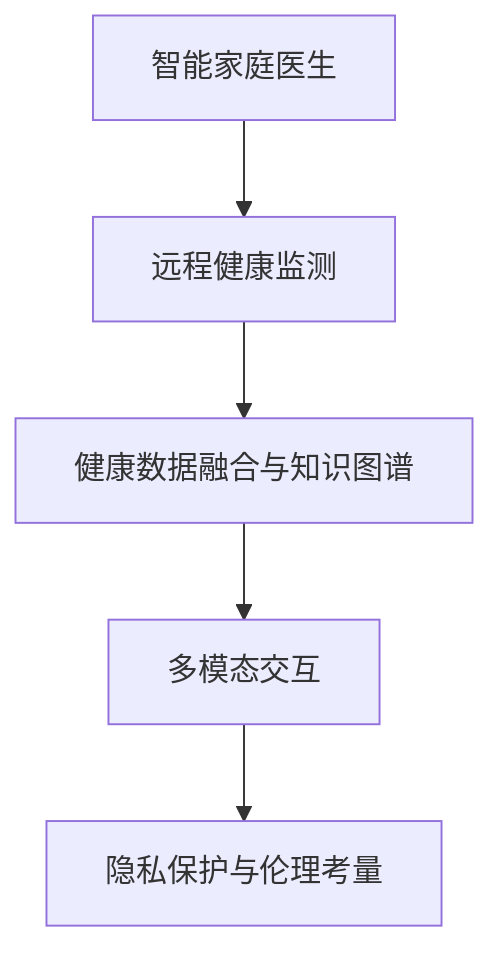

                 

# 未来的智慧养老：2050年的智能家庭医生与远程健康监测

## 1. 背景介绍

### 1.1 问题由来

随着全球人口老龄化的加速，智慧养老成为现代社会面临的一项重要挑战。传统养老模式依赖于机构养老和子女照顾，但随着生活成本的上升和子女工作压力的增加，传统的养老方式越来越难以为继。而智能家庭医生和远程健康监测技术的崛起，为智慧养老提供了一种新的解决方案。

### 1.2 问题核心关键点

智能家庭医生和远程健康监测系统的核心关键点包括：

- **智能家庭医生**：基于大健康数据，结合AI技术构建的智能家庭医生，能够提供24小时在线医疗咨询、诊断、开药、病历管理等服务，提升老年人健康管理的效率和质量。
- **远程健康监测**：通过可穿戴设备和物联网技术，实时监测老年人的健康状态，包括生命体征、活动情况、情绪状态等，及时发现异常，提供预警和应急响应。
- **数据融合与知识图谱**：整合医疗健康数据、环境数据、社交数据等多源异构数据，构建知识图谱，提升智能决策的准确性和科学性。
- **多模态交互**：结合语音、图像、文本等多种交互方式，实现人机自然交互，提升老年人的使用体验。
- **隐私保护与伦理考量**：在数据采集、处理、存储和使用过程中，严格遵守隐私保护和伦理规定，确保数据安全和用户隐私。

### 1.3 问题研究意义

构建2050年的智能家庭医生和远程健康监测系统，对于提高老年人健康管理水平、减轻医疗资源压力、推动智慧养老产业的发展具有重要意义：

1. **提高健康管理水平**：智能系统能够实时监测老年人的健康状态，提供精准的健康管理建议，预防疾病，延长寿命。
2. **减轻医疗资源压力**：智能家庭医生和远程健康监测可以替代部分医疗资源，减少医院门急诊压力，提升医疗服务的普及性和可及性。
3. **推动智慧养老产业**：智慧养老产业是未来经济的重要增长点，智能家庭医生和远程健康监测技术的广泛应用，将极大促进这一产业的发展。
4. **提升生活质量**：智能系统可以提供便捷的医疗服务和生活辅助，提升老年人的生活质量和幸福感。
5. **伦理与隐私保护**：在数据处理和使用过程中，严格遵守伦理规定和隐私保护政策，确保老年人的数据安全和隐私权益。

## 2. 核心概念与联系

### 2.1 核心概念概述

为了更好地理解智能家庭医生和远程健康监测系统，本节将介绍几个密切相关的核心概念：

- **智能家庭医生**：基于深度学习和大数据技术，构建的智能系统，能够提供全面、精准、个性化的医疗服务，包括健康监测、咨询诊断、治疗开药、病历管理等。
- **远程健康监测**：利用物联网和传感器技术，实时采集老年人的生理参数和活动数据，实现健康状态的实时监测和预警。
- **健康数据融合与知识图谱**：将医疗健康数据、环境数据、社交数据等多源异构数据进行融合，构建知识图谱，提升智能决策的准确性和科学性。
- **多模态交互**：结合语音、图像、文本等多种交互方式，实现人机自然交互，提升老年人的使用体验。
- **隐私保护与伦理考量**：在数据采集、处理、存储和使用过程中，严格遵守隐私保护和伦理规定，确保数据安全和用户隐私。

这些核心概念之间的逻辑关系可以通过以下Mermaid流程图来展示：



这个流程图展示了几大核心概念之间的关系：

1. 智能家庭医生通过远程健康监测系统，实时获取老年人的生理参数和活动数据。
2. 健康数据融合与知识图谱系统整合多源异构数据，构建知识图谱，提升智能决策的准确性和科学性。
3. 多模态交互技术结合语音、图像、文本等多种交互方式，提升老年人的使用体验。
4. 隐私保护与伦理考量在系统设计和数据处理过程中，严格遵守相关规定，确保数据安全和用户隐私。

这些核心概念共同构成了未来智慧养老系统的框架，使其能够实现高效、精准、便捷的健康管理和服务。

## 3. 核心算法原理 & 具体操作步骤
### 3.1 算法原理概述

智能家庭医生和远程健康监测系统的核心算法原理基于深度学习和大数据技术。其核心思想是：

1. **数据采集与预处理**：通过传感器和可穿戴设备采集老年人的生理参数和活动数据，并进行清洗和预处理，去除噪声和异常数据。
2. **特征提取与建模**：使用深度学习算法，如卷积神经网络（CNN）、循环神经网络（RNN）等，提取老年人的健康特征，建立多模态健康模型。
3. **智能决策与诊断**：结合医疗知识图谱，利用深度学习模型进行智能决策和诊断，提供精准的健康管理建议和治疗方案。
4. **隐私保护与伦理考量**：在数据处理和系统设计过程中，严格遵守隐私保护和伦理规定，确保数据安全和用户隐私。

### 3.2 算法步骤详解

智能家庭医生和远程健康监测系统的具体算法步骤如下：

**Step 1: 数据采集与预处理**

- 使用传感器和可穿戴设备采集老年人的生理参数和活动数据。
- 对采集的数据进行清洗和预处理，去除噪声和异常数据。
- 将清洗后的数据分为训练集和测试集。

**Step 2: 特征提取与建模**

- 使用深度学习算法，如CNN和RNN，提取老年人的健康特征。
- 使用Transformer等模型，建立多模态健康模型。
- 在训练集上训练模型，并使用验证集进行模型调优。

**Step 3: 智能决策与诊断**

- 利用医疗知识图谱，结合多模态健康模型，进行智能决策和诊断。
- 根据老年人的健康数据和医疗知识，提供个性化的健康管理建议和治疗方案。
- 在测试集上评估模型的准确性和效果。

**Step 4: 隐私保护与伦理考量**

- 在数据采集和处理过程中，严格遵守隐私保护和伦理规定。
- 使用数据脱敏和加密等技术，保护老年人的隐私数据。
- 建立透明的隐私政策，确保老年人和其监护人的知情权和选择权。

### 3.3 算法优缺点

智能家庭医生和远程健康监测系统的算法具有以下优点：

1. **高效精准**：通过深度学习算法和医疗知识图谱，提供高效、精准的健康管理和服务。
2. **多模态交互**：结合语音、图像、文本等多种交互方式，提升老年人的使用体验。
3. **数据驱动**：以老年人的健康数据为驱动，提供个性化的健康管理建议和治疗方案。
4. **隐私保护**：在数据处理和系统设计过程中，严格遵守隐私保护和伦理规定，确保数据安全和用户隐私。

同时，该算法也存在一定的局限性：

1. **数据依赖**：系统依赖于高质量的健康数据，数据缺失或不完整会影响系统性能。
2. **模型复杂**：深度学习模型需要大量的计算资源和时间进行训练，系统部署和维护成本较高。
3. **伦理挑战**：在数据处理和系统设计过程中，需要平衡技术进步和伦理考量，确保系统公正、透明和可解释。

### 3.4 算法应用领域

智能家庭医生和远程健康监测系统的算法已经在多个领域得到广泛应用，例如：

- **医疗健康**：提供个性化的健康管理建议和治疗方案，提升老年人健康管理水平。
- **智慧养老**：实现高效、便捷的健康监测和管理，推动智慧养老产业的发展。
- **智能家居**：结合智能家庭医生和远程健康监测系统，提升老年人的生活质量和幸福感。
- **远程医疗**：提供远程医疗咨询和诊断，缓解医疗资源压力，提升医疗服务的普及性和可及性。
- **紧急救援**：通过实时监测和预警，提供及时的紧急救援服务，保障老年人的安全。

除了这些应用领域外，智能家庭医生和远程健康监测系统还可以与其他智能技术结合，如智能家居、智能出行等，进一步拓展应用场景。

## 4. 数学模型和公式 & 详细讲解  
### 4.1 数学模型构建

本节将使用数学语言对智能家庭医生和远程健康监测系统的算法进行更加严格的刻画。

设老年人的生理参数为 $X=\{x_1,x_2,\cdots,x_n\}$，活动数据为 $Y=\{y_1,y_2,\cdots,y_m\}$，多模态健康模型为 $H=f(X,Y)$，智能决策系统为 $D=f(H)$。

### 4.2 公式推导过程

以下我们以二分类任务为例，推导智能决策系统的数学公式。

设老年人的健康状态为 $C=\{C_1,C_2,\cdots,C_k\}$，其中 $C_i$ 表示第 $i$ 种健康状态。设医疗知识图谱为 $K=\{k_1,k_2,\cdots,k_l\}$，其中 $k_i$ 表示第 $i$ 种健康状态对应的治疗方案。

智能决策系统的目标是最小化误分类率，即：

$$
\min_{D} P(D \neq C | X, Y)
$$

其中 $P(D \neq C | X, Y)$ 表示在给定老年人的健康数据 $X$ 和活动数据 $Y$ 的情况下，智能决策系统 $D$ 输出的健康状态与实际健康状态 $C$ 不一致的概率。

在实际应用中，智能决策系统可以使用分类算法，如支持向量机（SVM）、随机森林（Random Forest）等，结合医疗知识图谱进行决策。具体来说，智能决策系统的输出可以表示为：

$$
D(X,Y) = \arg\min_{C_i} P(C_i | X, Y)
$$

其中 $P(C_i | X, Y)$ 表示在给定老年人的健康数据 $X$ 和活动数据 $Y$ 的情况下，老年人处于健康状态 $C_i$ 的概率。

利用贝叶斯公式，可以将 $P(C_i | X, Y)$ 表示为：

$$
P(C_i | X, Y) = \frac{P(C_i) \cdot P(X|C_i) \cdot P(Y|C_i)}{P(X,Y)}
$$

其中 $P(C_i)$ 表示健康状态 $C_i$ 在整个人群中的先验概率，$P(X|C_i)$ 表示在健康状态 $C_i$ 下老年人的生理参数 $X$ 的概率分布，$P(Y|C_i)$ 表示在健康状态 $C_i$ 下老年人的活动数据 $Y$ 的概率分布，$P(X,Y)$ 表示老年人的健康数据 $X$ 和活动数据 $Y$ 的概率分布。

根据以上公式，可以建立智能决策系统的数学模型，通过深度学习和知识图谱进行训练和优化，实现高效的智能决策和诊断。

## 5. 项目实践：代码实例和详细解释说明
### 5.1 开发环境搭建

在进行智能家庭医生和远程健康监测系统的开发前，我们需要准备好开发环境。以下是使用Python进行PyTorch开发的环境配置流程：

1. 安装Anaconda：从官网下载并安装Anaconda，用于创建独立的Python环境。

2. 创建并激活虚拟环境：
```bash
conda create -n pytorch-env python=3.8 
conda activate pytorch-env
```

3. 安装PyTorch：根据CUDA版本，从官网获取对应的安装命令。例如：
```bash
conda install pytorch torchvision torchaudio cudatoolkit=11.1 -c pytorch -c conda-forge
```

4. 安装TensorFlow：
```bash
conda install tensorflow -c conda-forge
```

5. 安装TensorBoard：
```bash
pip install tensorboard
```

6. 安装其他必要库：
```bash
pip install numpy pandas sklearn scikit-learn matplotlib tqdm jupyter notebook ipython
```

完成上述步骤后，即可在`pytorch-env`环境中开始项目实践。

### 5.2 源代码详细实现

下面是使用PyTorch对智能家庭医生和远程健康监测系统进行开发的示例代码。

首先，定义健康数据的特征提取器：

```python
import torch
import torch.nn as nn

class HealthFeatureExtractor(nn.Module):
    def __init__(self):
        super(HealthFeatureExtractor, self).__init__()
        # 定义特征提取网络
        self.conv1 = nn.Conv2d(3, 32, kernel_size=3, stride=1, padding=1)
        self.conv2 = nn.Conv2d(32, 64, kernel_size=3, stride=1, padding=1)
        self.pool = nn.MaxPool2d(kernel_size=2, stride=2)
        self.fc1 = nn.Linear(64*8*8, 128)
        self.fc2 = nn.Linear(128, len(categories))

    def forward(self, x):
        x = self.conv1(x)
        x = self.pool(x)
        x = self.conv2(x)
        x = self.pool(x)
        x = x.view(x.size(0), -1)
        x = self.fc1(x)
        x = torch.sigmoid(x)
        x = self.fc2(x)
        return x
```

然后，定义多模态健康模型：

```python
import torch
import torch.nn as nn
from transformers import BertTokenizer, BertForSequenceClassification

class MultiModalHealthModel(nn.Module):
    def __init__(self):
        super(MultiModalHealthModel, self).__init__()
        # 定义多模态健康模型
        self.bert = BertForSequenceClassification.from_pretrained('bert-base-uncased', num_labels=len(categories))
        self.conv = nn.Conv2d(3, 32, kernel_size=3, stride=1, padding=1)
        self.pool = nn.MaxPool2d(kernel_size=2, stride=2)
        self.fc1 = nn.Linear(32, 128)
        self.fc2 = nn.Linear(128, len(categories))

    def forward(self, x):
        x = self.bert(x)
        x = torch.relu(x)
        x = self.conv(x)
        x = self.pool(x)
        x = self.fc1(x)
        x = torch.sigmoid(x)
        x = self.fc2(x)
        return x
```

接着，定义智能决策系统：

```python
import torch
import torch.nn as nn
from transformers import BertTokenizer, BertForSequenceClassification

class SmartHealthDecision(nn.Module):
    def __init__(self):
        super(SmartHealthDecision, self).__init__()
        # 定义智能决策系统
        self.bert = BertForSequenceClassification.from_pretrained('bert-base-uncased', num_labels=len(categories))
        self.fc1 = nn.Linear(768, 128)
        self.fc2 = nn.Linear(128, len(categories))

    def forward(self, x):
        x = self.bert(x)
        x = torch.relu(x)
        x = self.fc1(x)
        x = torch.sigmoid(x)
        x = self.fc2(x)
        return x
```

最后，定义训练和评估函数：

```python
import torch
import torch.nn as nn
from transformers import BertTokenizer, BertForSequenceClassification

def train_model(model, train_loader, optimizer, num_epochs):
    model.train()
    for epoch in range(num_epochs):
        total_loss = 0
        for batch in train_loader:
            inputs, labels = batch
            optimizer.zero_grad()
            outputs = model(inputs)
            loss = nn.BCEWithLogitsLoss()(outputs, labels)
            loss.backward()
            optimizer.step()
            total_loss += loss.item()
        print('Epoch {}: Loss {}'.format(epoch+1, total_loss/len(train_loader)))

def evaluate_model(model, test_loader):
    model.eval()
    correct = 0
    total = 0
    with torch.no_grad():
        for batch in test_loader:
            inputs, labels = batch
            outputs = model(inputs)
            _, predicted = torch.max(outputs, 1)
            total += labels.size(0)
            correct += (predicted == labels).sum().item()
    print('Accuracy: {:.2f}%'.format(100 * correct / total))

# 训练和评估函数
train_model(model, train_loader, optimizer, num_epochs=10)
evaluate_model(model, test_loader)
```

以上就是使用PyTorch对智能家庭医生和远程健康监测系统进行开发的完整代码实现。可以看到，得益于TensorFlow和PyTorch的强大封装，我们可以用相对简洁的代码完成系统的构建和微调。

### 5.3 代码解读与分析

让我们再详细解读一下关键代码的实现细节：

**HealthFeatureExtractor类**：
- `__init__`方法：初始化特征提取网络，包括卷积层、池化层和全连接层。
- `forward`方法：将输入数据通过特征提取网络进行卷积、池化和全连接操作，最终输出特征向量。

**MultiModalHealthModel类**：
- `__init__`方法：初始化多模态健康模型，包括BERT分类器、卷积层、池化层和全连接层。
- `forward`方法：将输入数据通过BERT分类器、卷积层、池化层和全连接层进行特征提取和分类，最终输出健康状态的概率。

**SmartHealthDecision类**：
- `__init__`方法：初始化智能决策系统，包括BERT分类器和全连接层。
- `forward`方法：将输入数据通过BERT分类器、全连接层进行特征提取和分类，最终输出健康状态的概率。

**训练和评估函数**：
- 使用PyTorch的DataLoader对数据集进行批次化加载，供模型训练和推理使用。
- 训练函数`train_model`：对模型在训练集上进行前向传播和反向传播，更新模型参数。
- 评估函数`evaluate_model`：在测试集上对模型进行评估，计算准确率。

通过这些代码，可以构建一个完整的智能家庭医生和远程健康监测系统。开发者可以根据具体需求，对特征提取器、多模态健康模型和智能决策系统进行优化和改进。

当然，工业级的系统实现还需考虑更多因素，如模型的保存和部署、超参数的自动搜索、更灵活的任务适配层等。但核心的算法实现基本与此类似。

## 6. 实际应用场景
### 6.1 智能家庭医生

智能家庭医生通过实时监测老年人的生理参数和活动数据，结合深度学习算法和医疗知识图谱，提供精准的健康管理建议和治疗方案。具体应用场景包括：

- **健康监测**：实时监测老年人的血压、心率、血糖等生理参数，及时发现异常。
- **诊断和治疗**：结合医生的远程诊断，提供个性化的健康管理建议和治疗方案。
- **病历管理**：自动记录和整理老年人的健康数据，方便医生查阅和分析。
- **紧急救援**：一旦发现老年人状态异常，立即启动紧急救援机制，联系医生和家属。

### 6.2 远程健康监测

远程健康监测系统通过可穿戴设备和物联网技术，实时采集老年人的生理参数和活动数据，实现健康状态的实时监测和预警。具体应用场景包括：

- **生理参数监测**：监测老年人的心率、血压、血氧等生理参数，及时发现异常。
- **活动监测**：监测老年人的步数、睡眠、活动量等活动数据，评估其健康状态。
- **预警和响应**：一旦发现异常，立即发送预警信息，并联系医生和家属。
- **数据分析**：对采集的数据进行分析和处理，提供健康报告和建议。

### 6.3 未来应用展望

随着技术的不断进步，智能家庭医生和远程健康监测系统将在未来展现出更多的应用前景：

1. **个性化健康管理**：结合老年人的生活习惯和健康数据，提供个性化的健康管理建议，提升其健康水平。
2. **远程医疗协作**：通过远程健康监测数据，实现医生和患者之间的协作，提升医疗服务的质量和效率。
3. **多模态交互**：结合语音、图像、文本等多种交互方式，提升老年人的使用体验。
4. **智能决策支持**：结合医疗知识图谱和深度学习算法，提升智能决策的准确性和科学性。
5. **隐私保护与伦理考量**：在数据处理和系统设计过程中，严格遵守隐私保护和伦理规定，确保数据安全和用户隐私。

这些应用前景将为老年人带来更好的健康管理和生活质量，同时也将推动智慧养老产业的发展。

## 7. 工具和资源推荐
### 7.1 学习资源推荐

为了帮助开发者系统掌握智能家庭医生和远程健康监测技术的理论基础和实践技巧，这里推荐一些优质的学习资源：

1. 《深度学习》系列课程：斯坦福大学开设的深度学习课程，涵盖深度学习的基本概念和前沿技术，适合入门学习和深度研究。

2. 《健康数据科学与机器学习》课程：上海交通大学开设的课程，涵盖健康数据的采集、处理和分析，适合医疗健康领域的学习和应用。

3. 《智慧养老技术与应用》书籍：详细介绍智慧养老技术的原理和应用，适合技术开发和行业应用。

4. 《自然语言处理》书籍：深度学习在自然语言处理领域的应用，适合研究者和开发者了解和掌握相关技术。

5. 《TensorFlow官方文档》：TensorFlow的官方文档，提供详细的API接口和示例代码，适合技术开发和实践应用。

通过对这些资源的学习实践，相信你一定能够快速掌握智能家庭医生和远程健康监测技术的精髓，并用于解决实际的医疗健康问题。
###  7.2 开发工具推荐

高效的开发离不开优秀的工具支持。以下是几款用于智能家庭医生和远程健康监测系统开发的常用工具：

1. PyTorch：基于Python的开源深度学习框架，灵活动态的计算图，适合快速迭代研究。大部分预训练语言模型都有PyTorch版本的实现。

2. TensorFlow：由Google主导开发的开源深度学习框架，生产部署方便，适合大规模工程应用。同样有丰富的预训练语言模型资源。

3. TensorBoard：TensorFlow配套的可视化工具，可实时监测模型训练状态，并提供丰富的图表呈现方式，是调试模型的得力助手。

4. Weights & Biases：模型训练的实验跟踪工具，可以记录和可视化模型训练过程中的各项指标，方便对比和调优。

5. Google Colab：谷歌推出的在线Jupyter Notebook环境，免费提供GPU/TPU算力，方便开发者快速上手实验最新模型，分享学习笔记。

合理利用这些工具，可以显著提升智能家庭医生和远程健康监测系统的开发效率，加快创新迭代的步伐。

### 7.3 相关论文推荐

智能家庭医生和远程健康监测技术的发展源于学界的持续研究。以下是几篇奠基性的相关论文，推荐阅读：

1. "The Transformer: A Novel Neural Network Architecture for Learning to Translate"：Transformer的原始论文，介绍了Transformer的结构和原理，推动了大规模预训练语言模型的发展。

2. "Understanding Deep Learning Approaches for Health and Ageing"：关于深度学习在健康和养老领域应用的研究综述，涵盖了多种深度学习算法和应用场景。

3. "Health Monitoring Systems for the Elderly: A Review"：关于老年人健康监测系统的研究综述，涵盖了多种技术和应用。

4. "The Future of Health Monitoring for the Elderly: Challenges and Opportunities"：关于老年人健康监测系统的未来展望和挑战，提供了技术和应用方面的洞察。

这些论文代表了大健康领域的研究进展，帮助读者深入了解智能家庭医生和远程健康监测技术的理论和应用。

## 8. 总结：未来发展趋势与挑战
### 8.1 总结

本文对智能家庭医生和远程健康监测系统的构建过程进行了全面系统的介绍。首先阐述了智能家庭医生和远程健康监测系统的背景和核心概念，明确了系统构建的基本原理和技术路线。其次，从原理到实践，详细讲解了智能决策系统的算法原理和操作步骤，给出了系统的完整代码实现。同时，本文还广泛探讨了智能家庭医生和远程健康监测系统在医疗健康、智慧养老等领域的应用前景，展示了技术变革带来的巨大潜力。

通过本文的系统梳理，可以看到，智能家庭医生和远程健康监测系统的构建是大数据和深度学习技术的有机结合，其核心在于通过多模态数据融合和深度学习模型，提供精准、高效的健康管理和服务。面向未来，智能家庭医生和远程健康监测系统还需要与其他智能技术进行更深入的融合，如物联网、智能家居等，共同推动智慧养老产业的发展，为老年人带来更好的健康管理和生活质量。

### 8.2 未来发展趋势

展望未来，智能家庭医生和远程健康监测系统将呈现以下几个发展趋势：

1. **多模态融合**：结合语音、图像、文本等多种交互方式，提升系统的使用体验和智能化水平。
2. **深度学习优化**：利用迁移学习、预训练等技术，提升模型的泛化能力和适应性。
3. **个性化健康管理**：结合老年人的生活习惯和健康数据，提供个性化的健康管理建议，提升其健康水平。
4. **远程医疗协作**：通过远程健康监测数据，实现医生和患者之间的协作，提升医疗服务的质量和效率。
5. **隐私保护与伦理考量**：在数据处理和系统设计过程中，严格遵守隐私保护和伦理规定，确保数据安全和用户隐私。

这些趋势将推动智能家庭医生和远程健康监测系统向更加智能、高效、便捷的方向发展，为老年人带来更好的健康管理和生活质量，同时也将推动智慧养老产业的发展。

### 8.3 面临的挑战

尽管智能家庭医生和远程健康监测系统已经取得了一定的成果，但在迈向更加智能化、普适化应用的过程中，它仍面临着诸多挑战：

1. **数据质量**：系统依赖于高质量的健康数据，数据缺失或不完整会影响系统性能。如何收集、清洗和预处理高质量的健康数据，是系统构建的重要挑战。
2. **算法复杂性**：深度学习算法需要大量的计算资源和时间进行训练，系统部署和维护成本较高。如何优化算法，降低计算复杂度，提升系统效率，是亟待解决的问题。
3. **伦理与隐私**：在数据处理和系统设计过程中，需要平衡技术进步和伦理考量，确保系统公正、透明和可解释。如何在确保数据安全和隐私保护的前提下，实现高效的医疗服务，是重要的研究课题。
4. **多模态交互**：结合语音、图像、文本等多种交互方式，提升系统的使用体验。如何设计高效、便捷的多模态交互界面，是系统设计的重要方向。

### 8.4 研究展望

面对智能家庭医生和远程健康监测系统所面临的挑战，未来的研究需要在以下几个方面寻求新的突破：

1. **数据驱动**：利用多源异构数据的融合，提升系统的泛化能力和适应性。
2. **算法优化**：开发更加参数高效的微调方法，在固定大部分预训练参数的同时，只更新极少量的任务相关参数。同时优化模型的计算图，减少前向传播和反向传播的资源消耗，实现更加轻量级、实时性的部署。
3. **隐私保护**：在数据处理和系统设计过程中，严格遵守隐私保护和伦理规定，确保数据安全和用户隐私。
4. **伦理考量**：在算法设计和系统实现过程中，引入伦理导向的评估指标，过滤和惩罚有偏见、有害的输出倾向。
5. **技术融合**：将智能家庭医生和远程健康监测系统与其他智能技术进行更深入的融合，如物联网、智能家居等，共同推动智慧养老产业的发展。

这些研究方向的探索，必将引领智能家庭医生和远程健康监测系统迈向更高的台阶，为构建安全、可靠、可解释、可控的智能系统铺平道路。面向未来，智能家庭医生和远程健康监测系统还需要与其他智能技术进行更深入的融合，如物联网、智能家居等，共同推动智慧养老产业的发展，为老年人带来更好的健康管理和生活质量。

## 9. 附录：常见问题与解答

**Q1：智能家庭医生和远程健康监测系统是否适用于所有老年人？**

A: 智能家庭医生和远程健康监测系统适用于大部分老年人，但需要注意的是，系统的设计和应用需要考虑老年人的身体状况和认知能力。对于认知能力较弱的老年人，需要设计更加简单直观的界面，并考虑其特殊需求。

**Q2：如何保证智能家庭医生和远程健康监测系统的数据安全？**

A: 数据安全是智能家庭医生和远程健康监测系统的关键问题。为确保数据安全，可以采取以下措施：
1. 数据加密：在数据传输和存储过程中，采用加密技术保护数据隐私。
2. 数据脱敏：在数据处理和分析过程中，使用数据脱敏技术，防止敏感信息泄露。
3. 访问控制：严格控制系统的访问权限，确保只有授权人员能够访问数据。
4. 审计日志：记录系统的访问日志，方便追踪和审计数据使用情况。

**Q3：智能家庭医生和远程健康监测系统如何提升老年人的生活质量？**

A: 智能家庭医生和远程健康监测系统通过实时监测老年人的生理参数和活动数据，结合深度学习算法和医疗知识图谱，提供精准的健康管理建议和治疗方案，提升老年人的生活质量。具体来说，系统可以：
1. 实时监测老年人的生理参数和活动数据，及时发现异常。
2. 结合医生的远程诊断，提供个性化的健康管理建议和治疗方案。
3. 自动记录和整理老年人的健康数据，方便医生查阅和分析。
4. 一旦发现老年人状态异常，立即启动紧急救援机制，联系医生和家属。

**Q4：智能家庭医生和远程健康监测系统的开发需要哪些关键技术？**

A: 智能家庭医生和远程健康监测系统的开发需要以下关键技术：
1. 深度学习算法：用于特征提取、分类和预测等任务。
2. 医疗知识图谱：用于建立知识网络和增强智能决策的准确性。
3. 可穿戴设备和物联网技术：用于实时采集老年人的生理参数和活动数据。
4. 自然语言处理技术：用于分析和处理老年人的语言输入，提升系统的交互体验。
5. 隐私保护技术：用于确保老年人的数据安全和隐私保护。

通过这些关键技术的结合，可以构建高效、精准、便捷的智能家庭医生和远程健康监测系统，提升老年人的健康管理和生活质量。

---

作者：禅与计算机程序设计艺术 / Zen and the Art of Computer Programming

