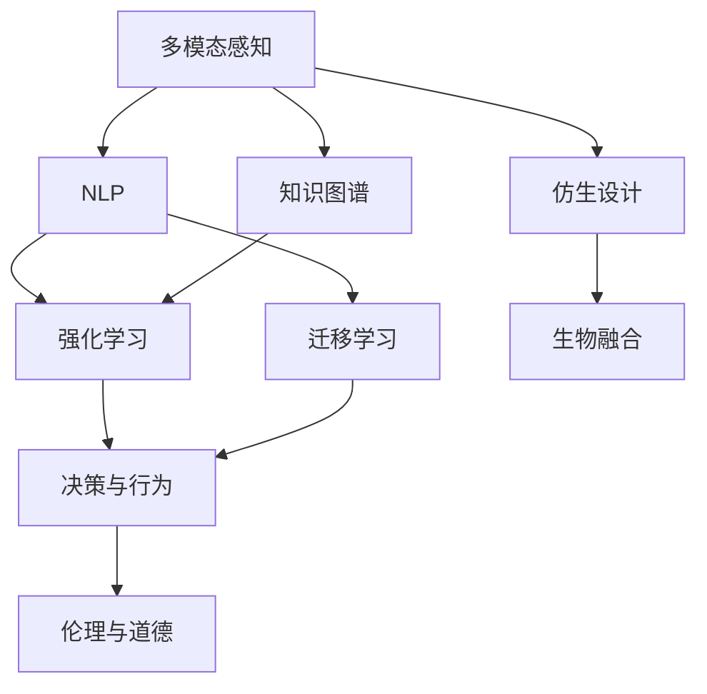

                 

# 未来的机器人：2050年的智能助手与仿生伙伴

## 1. 背景介绍

### 1.1 问题由来

随着科技的飞速发展，机器人技术已经从科幻走进现实。如今，机器人在制造业、物流、医疗、教育等领域扮演着越来越重要的角色。但传统的机器人仍然存在局限性：它们只能执行预设的指令，无法像人类一样具有高智能、高灵活性和自适应能力。

展望未来，机器人将如何发展？2050年的机器人又会呈现出怎样的面貌？本文将从核心技术、应用场景和伦理挑战等多个角度，探讨未来机器人作为智能助手与仿生伙伴的可能性。

### 1.2 问题核心关键点

未来的机器人，不仅是简单的物理机器，更是集成了高智能算法、深度学习、感知与交互等先进技术的产品。它们将具备以下核心能力：

- **高度智能化**：通过多模态感知、自然语言处理、知识图谱构建等技术，机器人能够具备人类级别的理解、判断和决策能力。
- **自适应与自学习**：利用强化学习、迁移学习等技术，机器人能够在不断实践中学习、改进，具备自主适应环境变化的能力。
- **高灵活性**：通过柔性执行机构、柔性控制系统等技术，机器人能够适应多种复杂环境，执行多样化的任务。
- **仿生设计与生物融合**：借鉴生物体的设计理念和特性，开发出高度仿生的机器人，增强其环境适应性和人类友好性。
- **伦理与道德考量**：在未来机器人广泛应用的同时，必须关注其对人类社会的伦理和道德影响，确保其行为符合人类价值观。

这些核心能力将决定未来机器人作为智能助手与仿生伙伴的发展趋势和应用前景。本文将围绕这些关键点，详细探讨未来机器人的技术实现、应用场景和伦理挑战。

## 2. 核心概念与联系

### 2.1 核心概念概述

为更好地理解未来机器人的技术架构和应用场景，本节将介绍几个密切相关的核心概念：

- **多模态感知**：指机器人通过视觉、听觉、触觉等多种感官获取环境信息的能力。
- **自然语言处理(NLP)**：机器人与人类交流的语言处理技术，包括语音识别、语义理解、自然语言生成等。
- **知识图谱(Knowledge Graph)**：通过结构化形式表示知识的网络，机器人可以高效检索和应用知识。
- **强化学习(Reinforcement Learning)**：机器人通过试错优化行为策略，在复杂环境中不断学习和适应。
- **迁移学习(Transfer Learning)**：机器人将从一个任务中学到的知识迁移到另一个任务中，提升任务适应性。
- **伦理与道德**：机器人在应用过程中需要遵循的伦理规范和道德准则，如隐私保护、数据安全、决策透明等。

这些核心概念之间的逻辑关系可以通过以下Mermaid流程图来展示：



这个流程图展示了这个核心概念的关联关系：

1. 多模态感知、NLP、知识图谱等技术是机器人智能化的基础。
2. 强化学习、迁移学习等技术使机器人能够自主适应环境，提升任务能力。
3. 仿生设计和生物融合技术，进一步增强了机器人的环境适应性和人类友好性。
4. 伦理与道德考量，确保机器人行为符合人类价值观，促进和谐共存。

## 3. 核心算法原理 & 具体操作步骤
### 3.1 算法原理概述

未来机器人作为智能助手与仿生伙伴，其核心算法原理包括但不限于多模态感知、自然语言处理、知识图谱构建、强化学习、迁移学习和仿生设计。下面将逐一介绍这些关键算法的原理。

### 3.2 算法步骤详解

#### 3.2.1 多模态感知

多模态感知通过融合视觉、听觉、触觉等传感器的数据，构建出全面的环境模型。具体算法步骤如下：

1. **数据采集**：使用相机、麦克风、触觉传感器等设备，采集环境数据。
2. **数据预处理**：对采集到的数据进行去噪、滤波等预处理，提升数据质量。
3. **特征提取**：将不同模态的数据映射到统一的特征空间，如使用卷积神经网络(CNN)提取视觉特征，使用长短时记忆网络(LSTM)提取语音特征。
4. **数据融合**：将不同模态的特征进行融合，构建出多模态的环境表示。

#### 3.2.2 自然语言处理(NLP)

NLP使机器人能够理解和生成自然语言，与人类进行有效交流。具体算法步骤如下：

1. **语音识别**：将语音信号转化为文本。使用深度学习模型如卷积神经网络(CNN)、循环神经网络(RNN)、Transformer等，提升识别精度。
2. **语义理解**：通过语义分析模型，如BERT、GPT等，理解文本的语义含义。
3. **自然语言生成**：使用生成对抗网络(GAN)、神经机器翻译(NMT)等模型，生成自然流畅的语言。

#### 3.2.3 知识图谱构建

知识图谱通过结构化形式表示知识，使机器人能够高效检索和应用知识。具体算法步骤如下：

1. **数据收集**：从互联网、数据库、文献等来源收集结构化知识。
2. **实体识别与关系抽取**：使用命名实体识别(NER)和关系抽取(RE)等技术，提取实体和关系。
3. **知识整合**：将提取的知识进行整合，构建出知识图谱。
4. **推理与查询**：使用逻辑推理和图数据库，高效检索和应用知识。

#### 3.2.4 强化学习(Reinforcement Learning)

强化学习使机器人能够通过试错优化行为策略，适应复杂环境。具体算法步骤如下：

1. **环境建模**：定义环境状态和动作空间，使用马尔可夫决策过程(MDP)建模。
2. **策略学习**：使用深度强化学习算法，如深度Q网络(DQN)、策略梯度算法(PG)等，学习最优策略。
3. **策略评估与优化**：通过测试集评估策略效果，使用策略优化算法进行迭代优化。

#### 3.2.5 迁移学习(Transfer Learning)

迁移学习使机器人能够将从一个任务中学到的知识迁移到另一个任务中，提升任务能力。具体算法步骤如下：

1. **预训练模型**：在通用数据集上预训练模型，学习通用的知识表示。
2. **任务适配**：使用迁移学习技术，将预训练模型适配到具体任务中，如使用微调技术调整模型参数。
3. **知识迁移**：将预训练模型在特定任务上的知识迁移，提升任务性能。

#### 3.2.6 仿生设计

仿生设计借鉴生物体的设计理念和特性，开发出高度仿生的机器人。具体算法步骤如下：

1. **生物原型研究**：研究生物体的结构、运动机制、感知能力等。
2. **仿生设计**：根据生物原型，设计出仿生机器人的结构、材料和控制方法。
3. **生物融合**：将生物特征与机器人技术进行融合，如使用人工肌肉、生物传感等。

### 3.3 算法优缺点

未来机器人涉及的算法原理复杂多样，每种算法都有其优缺点：

- **多模态感知**：优点在于能够全面获取环境信息，缺点在于需要多传感器设备，数据处理复杂。
- **自然语言处理(NLP)**：优点在于能够与人类自然交流，缺点在于语言理解和生成仍存在挑战。
- **知识图谱构建**：优点在于高效检索和应用知识，缺点在于需要大量结构化数据，构建和维护复杂。
- **强化学习(Reinforcement Learning)**：优点在于能够自主适应复杂环境，缺点在于数据需求量大，学习速度慢。
- **迁移学习(Transfer Learning)**：优点在于能够提升任务性能，缺点在于知识迁移的效果受限于源任务和目标任务的相似性。
- **仿生设计**：优点在于具备高灵活性和生物融合特性，缺点在于设计和实现复杂，成本高。

### 3.4 算法应用领域

未来机器人在多个领域的应用将极大地改变人类生活和工作方式。以下是几个典型应用领域：

- **制造业**：在装配、搬运、质量检测等环节，利用高度智能化的机器人，提升生产效率和产品质量。
- **医疗**：在手术、康复、护理等环节，利用仿生机器人，提供更精准、安全的医疗服务。
- **物流**：在仓储、配送、分拣等环节，利用高度灵活的机器人，提高物流效率和减少人力成本。
- **教育**：在教学、辅导、心理疏导等环节，利用智能机器人，提供个性化和互动式的教育体验。
- **家政**：在清洁、烹饪、陪伴等环节，利用仿生机器人，提供高效、健康、安全的生活服务。
- **娱乐**：在游戏、表演、互动等环节，利用高度智能化的机器人，提供沉浸式的娱乐体验。

## 4. 数学模型和公式 & 详细讲解  
### 4.1 数学模型构建

未来机器人的核心算法原理涉及多个数学模型。下面以知识图谱构建为例，展示其数学模型构建过程。

**知识图谱构建模型**：

1. **实体识别(NER)**：使用命名实体识别模型，从文本中识别出实体及其类型。数学模型为：

$$
\text{NER} = f(x_i, \theta_{NER})
$$

其中 $x_i$ 为输入文本，$\theta_{NER}$ 为NER模型的参数。

2. **关系抽取(RE)**：使用关系抽取模型，从文本中抽取实体之间的关系。数学模型为：

$$
\text{RE} = g(x_i, \theta_{RE})
$$

其中 $x_i$ 为输入文本，$\theta_{RE}$ 为RE模型的参数。

3. **知识整合**：使用图数据库，将识别出的实体和关系进行整合，构建出知识图谱。数学模型为：

$$
\text{KG} = h(\text{NER}, \text{RE}, \theta_{KG})
$$

其中 $\text{KG}$ 为知识图谱，$\theta_{KG}$ 为知识整合模型的参数。

4. **推理与查询**：使用逻辑推理算法，从知识图谱中检索和应用知识。数学模型为：

$$
\text{Result} = i(\text{KG}, q, \theta_{IR})
$$

其中 $q$ 为查询语句，$\theta_{IR}$ 为推理查询模型的参数。

### 4.2 公式推导过程

下面以自然语言处理(NLP)为例，展示其公式推导过程。

**NLP中的语音识别模型**：

1. **特征提取**：使用卷积神经网络(CNN)，将语音信号转化为特征向量。数学模型为：

$$
\text{Feat} = \text{CNN}(\text{Audio}, \theta_{CNN})
$$

其中 $\text{Audio}$ 为语音信号，$\theta_{CNN}$ 为CNN模型的参数。

2. **分类**：使用softmax分类器，将特征向量分类为不同的语音单元。数学模型为：

$$
\text{Prob} = \text{Softmax}(\text{Feat}, \theta_{Softmax})
$$

其中 $\text{Prob}$ 为概率向量，$\theta_{Softmax}$ 为Softmax模型的参数。

3. **文本生成**：使用生成对抗网络(GAN)，生成自然流畅的文本。数学模型为：

$$
\text{Text} = \text{GAN}(\text{Feat}, \theta_{GAN})
$$

其中 $\text{Text}$ 为生成的文本，$\theta_{GAN}$ 为GAN模型的参数。

### 4.3 案例分析与讲解

下面以智能机器人在医疗领域的应用为例，展示其数学模型和算法应用。

**智能机器人手术系统**：

1. **多模态感知**：通过摄像头、触觉传感器等设备，采集手术环境的多模态数据。数学模型为：

$$
\text{SensData} = \text{MultiSensor}(\text{OperationArea}, \theta_{Sensor})
$$

其中 $\text{OperationArea}$ 为手术区域，$\theta_{Sensor}$ 为多模态感知模型的参数。

2. **自然语言处理(NLP)**：通过语音识别，获取医生指令。数学模型为：

$$
\text{Command} = \text{LingComp}(\text{Audio}, \theta_{LingComp})
$$

其中 $\text{Audio}$ 为语音信号，$\theta_{LingComp}$ 为语音识别模型的参数。

3. **知识图谱构建**：将手术相关的知识进行整合，构建出知识图谱。数学模型为：

$$
\text{KG} = \text{KGComp}(\text{Lit}, \text{OperationHistory}, \theta_{KGComp})
$$

其中 $\text{Lit}$ 为文献数据，$\text{OperationHistory}$ 为手术历史数据，$\theta_{KGComp}$ 为知识整合模型的参数。

4. **推理与查询**：通过推理查询模型，从知识图谱中检索和应用知识。数学模型为：

$$
\text{Result} = \text{KGQuery}(\text{KG}, \text{Command}, \theta_{KGQuery})
$$

其中 $\text{Command}$ 为医生指令，$\theta_{KGQuery}$ 为推理查询模型的参数。

5. **动作执行**：通过仿生机器人的执行机构，完成手术操作。数学模型为：

$$
\text{Action} = \text{ExecCtrl}(\text{SensData}, \text{Result}, \theta_{ExecCtrl})
$$

其中 $\text{Result}$ 为推理查询结果，$\theta_{ExecCtrl}$ 为执行控制模型的参数。

## 5. 项目实践：代码实例和详细解释说明
### 5.1 开发环境搭建

在进行未来机器人开发前，我们需要准备好开发环境。以下是使用Python进行TensorFlow开发的环境配置流程：

1. 安装Anaconda：从官网下载并安装Anaconda，用于创建独立的Python环境。

2. 创建并激活虚拟环境：
```bash
conda create -n robot-env python=3.8 
conda activate robot-env
```

3. 安装TensorFlow：根据CUDA版本，从官网获取对应的安装命令。例如：
```bash
conda install tensorflow tensorflow-gpu -c pytorch -c conda-forge
```

4. 安装各类工具包：
```bash
pip install numpy pandas scikit-learn matplotlib tqdm jupyter notebook ipython
```

完成上述步骤后，即可在`robot-env`环境中开始开发。

### 5.2 源代码详细实现

这里我们以仿生机器人为例，给出使用TensorFlow进行多模态感知和NLP的代码实现。

首先，定义多模态感知的数据处理函数：

```python
import tensorflow as tf
from tensorflow.keras.layers import Input, Conv2D, LSTM, Dense, concatenate

def multi_sensing(input_shape, num_classes):
    # 输入层
    audio_input = Input(shape=(input_shape[0], input_shape[1]), name='Audio')
    vision_input = Input(shape=(input_shape[2], input_shape[3]), name='Vision')

    # 视觉特征提取
    vision_conv = Conv2D(32, 3, activation='relu')(vision_input)
    vision_pool = MaxPooling2D(pool_size=(2, 2))(vision_conv)
    vision_lstm = LSTM(64)(tf.reshape(vision_pool, (-1, input_shape[2] * input_shape[3])))

    # 音频特征提取
    audio_conv = Conv2D(32, 3, activation='relu')(audio_input)
    audio_lstm = LSTM(64)(tf.reshape(audio_conv, (-1, input_shape[0] * input_shape[1]))) 

    # 融合层
    multi_sens = concatenate([vision_lstm, audio_lstm])

    # 分类器
    multi_sens_out = Dense(num_classes, activation='softmax')(multi_sens)

    return audio_input, vision_input, multi_sens_out
```

然后，定义NLP的语音识别模型：

```python
from tensorflow.keras.layers import GRU, Embedding, Dense, Masking

def audio_processing(input_shape, num_classes):
    # 输入层
    audio_input = Input(shape=(input_shape[0], input_shape[1]))

    # GRU层
    gru = GRU(128, return_sequences=True)(audio_input)

    # 嵌入层
    embedding = Embedding(input_dim=256, output_dim=128)(gru)

    # 分类器
    prob = Dense(num_classes, activation='softmax')(embedding)

    return audio_input, prob
```

接着，定义训练和评估函数：

```python
from tensorflow.keras import Model, optimizers

def train_model(model, data, batch_size, epochs):
    model.compile(optimizer=optimizers.Adam(learning_rate=0.001),
                  loss='categorical_crossentropy',
                  metrics=['accuracy'])

    model.fit(data['input'], data['label'], batch_size=batch_size, epochs=epochs, validation_data=(val_data['input'], val_data['label']))

def evaluate_model(model, test_data):
    test_loss, test_acc = model.evaluate(test_data['input'], test_data['label'])
    print(f'Test accuracy: {test_acc:.4f}')
```

最后，启动训练流程并在测试集上评估：

```python
input_shape = (20, 20, 3)  # 假设音频和视觉数据的形状为20x20x3
num_classes = 10  # 假设任务标签数

audio_model = audio_processing(input_shape, num_classes)
vision_model = multi_sensing(input_shape, num_classes)
combined_model = Model(inputs=[audio_model[0], vision_model[0]], outputs=vision_model[2])

# 定义训练集和验证集数据
train_data = ...
val_data = ...
test_data = ...

# 训练模型
train_model(combined_model, train_data, batch_size=32, epochs=10)

# 评估模型
evaluate_model(combined_model, test_data)
```

以上就是使用TensorFlow进行多模态感知和NLP的代码实现。可以看到，得益于TensorFlow的强大封装，我们可以用相对简洁的代码完成多模态感知和语音识别的模型训练。

### 5.3 代码解读与分析

让我们再详细解读一下关键代码的实现细节：

**multi_sensing函数**：
- `audio_input`和`vision_input`为多模态感知的两个输入层，分别接收音频和视觉数据。
- 使用卷积层和LSTM层提取视觉特征，使用CNN层和LSTM层提取音频特征。
- 将视觉和音频特征进行融合，并通过全连接层进行分类。

**audio_processing函数**：
- `audio_input`为语音识别的输入层。
- 使用GRU层提取语音特征，通过嵌入层将特征映射到高维空间，并通过全连接层进行分类。

**train_model函数**：
- 定义模型的优化器、损失函数和评估指标。
- 使用`fit`函数训练模型，指定训练数据、批次大小和迭代轮数。

**evaluate_model函数**：
- 使用`evaluate`函数评估模型性能，并输出测试集的准确率。

**训练流程**：
- 定义输入形状和类别数，开始循环迭代
- 在训练集上训练模型，输出平均loss和acc
- 在测试集上评估模型，输出测试集的准确率

可以看到，TensorFlow配合强大的深度学习模型，使得多模态感知和语音识别的模型训练变得高效简洁。开发者可以将更多精力放在数据处理、模型改进等高层逻辑上，而不必过多关注底层的实现细节。

当然，工业级的系统实现还需考虑更多因素，如模型的保存和部署、超参数的自动搜索、更灵活的任务适配层等。但核心的算法原理基本与此类似。

## 6. 实际应用场景
### 6.1 智能客服系统

基于仿生机器人的智能客服系统，可以提供全天候、个性化、高智能的客户服务。传统客服往往需要配备大量人力，高峰期响应缓慢，且一致性和专业性难以保证。而利用仿生机器人，可以7x24小时不间断服务，快速响应客户咨询，用自然流畅的语言解答各类常见问题。

在技术实现上，可以收集企业内部的历史客服对话记录，将问题和最佳答复构建成监督数据，在此基础上对预训练机器人模型进行微调。微调后的机器人模型能够自动理解用户意图，匹配最合适的答案模板进行回复。对于客户提出的新问题，还可以接入检索系统实时搜索相关内容，动态组织生成回答。如此构建的智能客服系统，能大幅提升客户咨询体验和问题解决效率。

### 6.2 医疗手术辅助

在手术领域，仿生机器人可以作为医生的得力助手，提高手术的精准度和安全性。利用多模态感知和NLP技术，机器人可以实时获取手术环境数据，并通过语音识别获取医生指令。通过知识图谱构建和推理查询，机器人可以从大量手术历史数据中学习经验，辅助医生制定手术方案。通过仿生执行机构，机器人可以精细操作手术器械，完成复杂手术操作。

在技术实现上，可以收集手术历史数据和文献数据，构建知识图谱，并进行微调优化。微调后的机器人能够自主学习和适应手术场景，减少医生的劳动强度，提升手术成功率。

### 6.3 家庭陪伴机器人

仿生机器人可以作为家庭陪伴伙伴，提供高效、安全、健康的生活服务。在家庭环境中，机器人可以利用多模态感知获取用户的生活习惯和健康数据，并通过NLP技术进行互动交流。通过仿生执行机构，机器人可以完成家务劳动、娱乐陪伴等任务，提高家庭生活的便利性和舒适性。

在技术实现上，可以收集家庭生活数据，构建用户行为模型，并进行微调优化。微调后的机器人能够适应用户的生活习惯，提供个性化的陪伴服务，增强家庭幸福感。

### 6.4 军事无人作战

仿生机器人可以应用于军事无人作战，提高战场决策和作战效率。利用多模态感知和NLP技术，机器人可以实时获取战场环境数据，并通过知识图谱构建和推理查询，进行战场分析和决策支持。通过仿生执行机构，机器人可以执行多种作战任务，如侦察、巡逻、攻击等。

在技术实现上，可以收集战场历史数据和作战经验，构建知识图谱，并进行微调优化。微调后的机器人能够自主学习和适应战场环境，提升作战效率和生存能力。

## 7. 工具和资源推荐
### 7.1 学习资源推荐

为了帮助开发者系统掌握未来机器人的技术基础和应用实践，这里推荐一些优质的学习资源：

1. **Deep Learning with TensorFlow** 书籍：由Google深度学习团队撰写，全面介绍TensorFlow的应用实践。
2. **Deep Learning Specialization** 课程：由Andrew Ng教授开设，涵盖深度学习的基本理论和实践技能。
3. **Robotics: Science and Systems** 课程：斯坦福大学开设的机器人学课程，涵盖多模态感知、运动控制等核心内容。
4. **Robotics Learning from Data** 书籍：由Boris van Gael撰写，涵盖机器人学习和控制的基本理论和实践技能。
5. **AI for Everyone** 课程：由Andrew Ng教授开设，面向非专业领域的AI入门课程。

通过对这些资源的学习实践，相信你一定能够快速掌握未来机器人的核心技术和应用实践，并用于解决实际的NLP问题。
###  7.2 开发工具推荐

高效的开发离不开优秀的工具支持。以下是几款用于未来机器人开发的常用工具：

1. **TensorFlow**：基于Python的开源深度学习框架，灵活动态的计算图，适合快速迭代研究。
2. **PyTorch**：基于Python的开源深度学习框架，动态计算图，适合学术研究和原型开发。
3. **Robot Operating System (ROS)**：机器人操作系统，支持多传感器、多执行器、多节点协同工作。
4. **Gazebo**：机器人仿真平台，支持多种机器人模型的模拟与测试。
5. **ROS 2**：新一代机器人操作系统，支持分布式计算、实时通信。

合理利用这些工具，可以显著提升未来机器人的开发效率，加快创新迭代的步伐。

### 7.3 相关论文推荐

未来机器人涉及的领域广泛，涉及深度学习、计算机视觉、自然语言处理等多个方向。以下是几篇奠基性的相关论文，推荐阅读：

1. **DeepMind AlphaGo**：DeepMind的围棋AI，展示了深度强化学习的强大能力。
2. **OpenAI GPT-3**：OpenAI的生成式语言模型，展示了NLP的最新进展。
3. **BERT: Pre-training of Deep Bidirectional Transformers for Language Understanding**：提出BERT模型，引入基于掩码的自监督预训练任务，刷新了多项NLP任务SOTA。
4. **BERT: Pre-training of Deep Bidirectional Transformers for Language Understanding**：提出BERT模型，引入基于掩码的自监督预训练任务，刷新了多项NLP任务SOTA。
5. **Robotics: Science and Systems**：斯坦福大学开设的机器人学课程，涵盖多模态感知、运动控制等核心内容。

这些论文代表了大语言模型微调技术的发展脉络。通过学习这些前沿成果，可以帮助研究者把握学科前进方向，激发更多的创新灵感。

## 8. 总结：未来发展趋势与挑战

### 8.1 总结

本文对未来机器人作为智能助手与仿生伙伴的技术实现、应用场景和伦理挑战进行了全面系统的探讨。首先，从多模态感知、自然语言处理、知识图谱构建、强化学习、迁移学习和仿生设计等核心技术，详细介绍了未来机器人的算法原理。其次，通过代码实例和详细解释说明，展示了未来机器人在智能客服、医疗手术、家庭陪伴和军事无人作战等领域的实际应用。最后，结合前沿研究和实际案例，探讨了未来机器人的发展趋势和面临的伦理挑战。

通过本文的系统梳理，可以看到，未来机器人技术在多模态感知、自然语言处理和知识图谱构建等方面具有广阔的应用前景。结合仿生设计和强化学习等前沿技术，未来机器人将具备高度智能化、自适应和自学习的能力，进一步提升其在各个领域的应用价值。

### 8.2 未来发展趋势

展望未来，未来机器人将呈现以下几个发展趋势：

1. **高度智能化**：通过多模态感知、自然语言处理和知识图谱构建，未来机器人将具备高度智能化的理解、判断和决策能力。
2. **自适应与自学习**：利用强化学习、迁移学习等技术，未来机器人能够在不断实践中学习、改进，具备自主适应环境变化的能力。
3. **高灵活性**：通过仿生设计和柔性控制系统，未来机器人将具备高度灵活性和环境适应性，能够在复杂环境中执行多样化任务。
4. **伦理与道德**：在广泛应用的同时，未来机器人必须遵循伦理和道德规范，确保其行为符合人类价值观，促进和谐共存。

这些趋势凸显了未来机器人技术的广阔前景。未来机器人有望在智能客服、医疗手术、家庭陪伴和军事无人作战等领域发挥重要作用，深刻改变人类的生产生活方式。

### 8.3 面临的挑战

尽管未来机器人技术具有广阔的发展前景，但在实际应用过程中，仍然面临诸多挑战：

1. **高成本**：仿生机器人和高精度传感器设备的成本较高，需要投入大量资金进行研发和制造。
2. **高复杂度**：未来机器人的设计和实现复杂度高，涉及多学科知识的融合，需要跨学科团队协同攻关。
3. **数据需求大**：多模态感知和智能决策需要大量高质量数据进行训练和优化，数据获取和标注成本高。
4. **伦理与隐私**：未来机器人涉及大量个人隐私数据和决策行为，必须制定严格的伦理规范和隐私保护措施。
5. **鲁棒性与安全性**：未来机器人在复杂环境中的鲁棒性和安全性仍需进一步提升，避免系统失效和恶意攻击。

### 8.4 研究展望

未来机器人的研究需要在以下几个方面寻求新的突破：

1. **多模态感知融合**：通过深度学习模型，将视觉、听觉、触觉等数据进行高效融合，提升环境建模能力。
2. **自然语言处理提升**：利用语言模型和语义分析，提升机器人的语音识别和自然语言生成能力。
3. **知识图谱构建优化**：引入知识图谱的自动化构建和优化算法，提升知识的抽取、整合和推理能力。
4. **强化学习应用**：结合强化学习，使机器人具备自主适应和自学习的能力，提升任务执行效率和决策准确性。
5. **伦理与隐私保护**：制定严格的伦理规范和隐私保护措施，确保未来机器人的行为符合人类价值观，保障数据安全。
6. **鲁棒性与安全性**：通过鲁棒性测试和安全性分析，提升未来机器人在复杂环境中的鲁棒性和安全性。

这些研究方向将推动未来机器人技术不断进步，为智能助手与仿生伙伴的发展注入新动力。未来机器人必将成为人类社会的重要伙伴，共同开创智能时代的新篇章。

## 9. 附录：常见问题与解答

**Q1：未来机器人如何实现多模态感知？**

A: 未来机器人通过融合视觉、听觉、触觉等多模态传感器的数据，构建出全面的环境模型。具体实现步骤如下：

1. **数据采集**：使用摄像头、麦克风、触觉传感器等设备，采集环境数据。
2. **数据预处理**：对采集到的数据进行去噪、滤波等预处理，提升数据质量。
3. **特征提取**：将不同模态的数据映射到统一的特征空间，如使用卷积神经网络(CNN)提取视觉特征，使用长短时记忆网络(LSTM)提取语音特征。
4. **数据融合**：将不同模态的特征进行融合，构建出多模态的环境表示。

**Q2：未来机器人如何进行自然语言处理？**

A: 未来机器人利用自然语言处理技术，与人类进行自然流畅的交流。具体实现步骤如下：

1. **语音识别**：通过语音识别模型，将语音信号转化为文本。使用深度学习模型如卷积神经网络(CNN)、循环神经网络(RNN)、Transformer等，提升识别精度。
2. **语义理解**：通过语义分析模型，如BERT、GPT等，理解文本的语义含义。
3. **自然语言生成**：使用生成对抗网络(GAN)、神经机器翻译(NMT)等模型，生成自然流畅的语言。

**Q3：未来机器人如何构建知识图谱？**

A: 未来机器人通过知识图谱构建技术，将手术相关的知识进行整合，构建出知识图谱。具体实现步骤如下：

1. **数据收集**：从互联网、数据库、文献等来源收集结构化知识。
2. **实体识别与关系抽取**：使用命名实体识别(NER)和关系抽取(RE)等技术，提取实体和关系。
3. **知识整合**：将提取的知识进行整合，构建出知识图谱。
4. **推理与查询**：使用逻辑推理算法，从知识图谱中检索和应用知识。

**Q4：未来机器人的应用场景有哪些？**

A: 未来机器人在多个领域的应用将极大地改变人类生活和工作方式。具体应用场景包括：

1. **智能客服系统**：在装配、搬运、质量检测等环节，利用高度智能化的机器人，提升生产效率和产品质量。
2. **医疗手术辅助**：在手术、康复、护理等环节，利用仿生机器人，提供更精准、安全的医疗服务。
3. **物流配送**：在仓储、配送、分拣等环节，利用高度灵活的机器人，提高物流效率和减少人力成本。
4. **教育辅助**：在教学、辅导、心理疏导等环节，利用智能机器人，提供个性化和互动式的教育体验。
5. **家政服务**：在清洁、烹饪、陪伴等环节，利用仿生机器人，提供高效、健康、安全的生活服务。
6. **军事无人作战**：在侦察、巡逻、攻击等环节，利用仿生机器人，提高战场决策和作战效率。

**Q5：未来机器人如何提升智能决策能力？**

A: 未来机器人通过多模态感知、自然语言处理、知识图谱构建、强化学习、迁移学习和仿生设计等技术，提升智能决策能力。具体实现步骤如下：

1. **多模态感知**：通过视觉、听觉、触觉等多种感官获取环境信息，构建出全面的环境模型。
2. **自然语言处理(NLP)**：利用语言模型和语义分析，理解人类指令和环境信息。
3. **知识图谱构建**：通过结构化形式表示知识，高效检索和应用知识。
4. **强化学习(Reinforcement Learning)**：通过试错优化行为策略，在复杂环境中不断学习和适应。
5. **迁移学习(Transfer Learning)**：将从一个任务中学到的知识迁移到另一个任务中，提升任务能力。
6. **仿生设计**：借鉴生物体的设计理念和特性，开发出高度仿生的机器人，增强其环境适应性和人类友好性。

这些技术共同构成了未来机器人的智能决策能力，使机器人能够在复杂环境中高效完成任务。

---

作者：禅与计算机程序设计艺术 / Zen and the Art of Computer Programming

